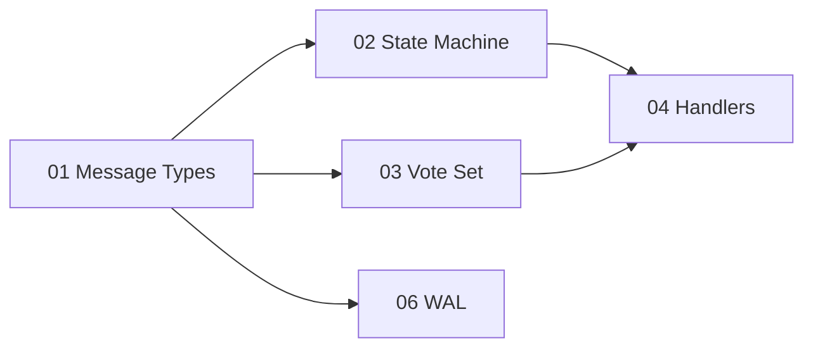
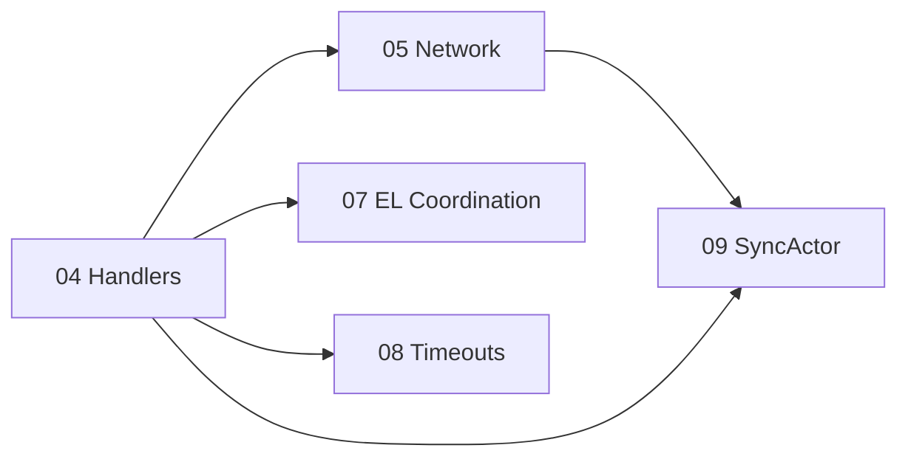
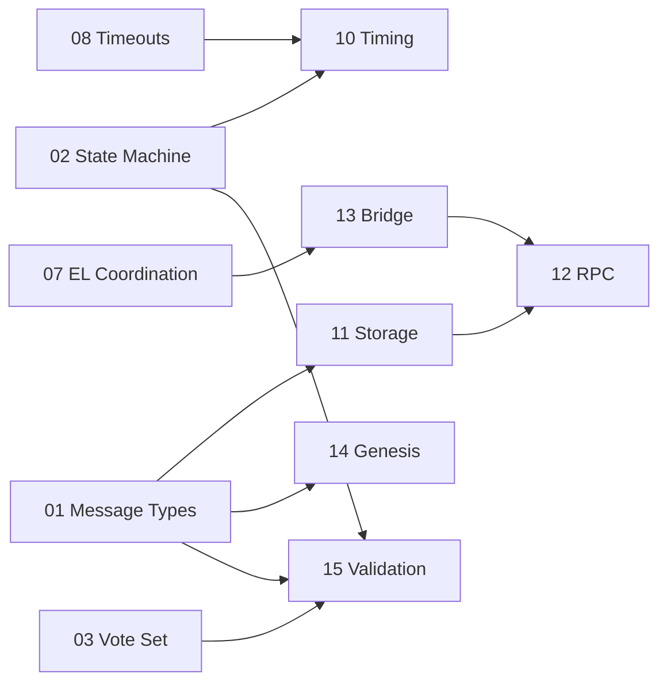

# Tendermint Consensus Implementation Guide

## Overview

This directory contains comprehensive implementation plans for migrating Alys V2 from Aura-based consensus to Tendermint-style two-phase BFT consensus. Each document provides detailed code examples, mermaid diagrams, and step-by-step integration guidance.

**Total Estimated Effort**: 18-24 weeks

---

## Document Index

### Core Consensus (Documents 01-09)

| # | Document | Effort | Dependencies |
|---|----------|--------|--------------|
| 01 | [Message Types & Protocol Foundation](01_MESSAGE_TYPES_AND_PROTOCOL_FOUNDATION.md) | 3-5 days | None |
| 02 | [State Machine](02_STATE_MACHINE.md) | 2 weeks | 01 |
| 03 | [Vote Set Management](03_VOTE_SET_MANAGEMENT.md) | 1 week | 01 |
| 04 | [ChainActor Handler Modifications](04_CHAINACTOR_HANDLERS.md) | 3 weeks | 01, 02, 03 |
| 05 | [Network Layer Integration](05_NETWORK_LAYER.md) | 1-2 weeks | 01, 04 |
| 06 | [Write-Ahead Log (WAL)](06_WAL.md) | 1 week | 01 |
| 07 | [Execution Layer Coordination](07_EL_COORDINATION.md) | 1 week | 02, 04 |
| 08 | [Timeout Management](08_TIMEOUT_MANAGEMENT.md) | 2-3 days | 02, 04 |
| 09 | [SyncActor Modifications](09_SYNC_ACTOR.md) | 1-2 weeks | 01, 04, 05 |

### System Integration (Documents 10-15)

| # | Document | Effort | Dependencies |
|---|----------|--------|--------------|
| 10 | [Slot Worker to Tendermint Timing](10_SLOT_WORKER_TO_TENDERMINT_TIMING.md) | 3-5 days | 02, 08 |
| 11 | [Storage Schema Migration](11_STORAGE_SCHEMA_MIGRATION.md) | 1 week | 01 |
| 12 | [RPC Actor Migration](12_RPC_ACTOR_MIGRATION.md) | 2-3 days | 11, 13 |
| 13 | [Bridge Integration](13_BRIDGE_INTEGRATION.md) | 3-5 days | 07 |
| 14 | [Genesis & Validator Init](14_GENESIS_AND_VALIDATOR_INIT.md) | 1-2 days | 01 |
| 15 | [Validation Module](15_VALIDATION_MODULE.md) | 3-5 days | 01, 02, 03 |

---

## Implementation Order

### Phase 1: Foundation (4-5 weeks)



**Order of implementation:**
1. **01 Message Types** - Define all data structures first
2. **03 Vote Set** - Can be done in parallel with 02
3. **02 State Machine** - Core consensus logic
4. **06 WAL** - Critical for safety, can start early
5. **04 Handlers** - Integrate everything

### Phase 2: Integration (4-5 weeks)



**Order of implementation:**
1. **05 Network Layer** - Message routing
2. **07 EL Coordination** - Block finalization
3. **08 Timeout Management** - Liveness
4. **09 SyncActor** - Commit-proof based sync (replaces fork-choice sync)

### Phase 3: System Integration (3-4 weeks)



**Order of implementation:**
1. **11 Storage Schema** - Foundation for new data types
2. **14 Genesis & Validator Init** - Required for bootstrap
3. **15 Validation Module** - Replace Aura validation
4. **10 Timing** - Replace slot worker with TendermintDriver
5. **13 Bridge Integration** - Instant finality for peg-ins
6. **12 RPC Migration** - Checkpoint-based mining API

### Phase 4: Testing & Hardening (3-4 weeks)

1. Unit tests for all components (01-15)
2. Integration tests (4-node testnet)
3. Adversarial testing (Byzantine scenarios)
4. Performance benchmarking
5. Bridge peg-in/peg-out end-to-end testing
6. Checkpoint anchoring verification

---

## File Structure

After implementation, the Tendermint module will have this structure:

```
app/src/actors_v2/chain/tendermint/
├── mod.rs                    # Module root and re-exports
├── types.rs                  # Core types (ValidatorId, TendermintStep, etc.)
├── messages.rs               # Protocol messages (Proposal, Vote, etc.)
├── state_machine.rs          # TendermintState and transitions
├── vote_set.rs               # Vote collection and thresholds
├── timeout.rs                # Timeout scheduling
├── wal.rs                    # Write-ahead log
├── evidence.rs               # Equivocation detection
├── proposer.rs               # Proposer selection
├── validation.rs             # Tendermint signature validation (15)
├── driver.rs                 # TendermintDriver (replaces slot worker) (10)
└── handlers.rs               # Handler implementations

app/src/actors_v2/storage/
├── schema.rs                 # Updated with CF_COMMITS, CF_VALIDATOR_SETS, CF_CHECKPOINTS (11)
└── messages.rs               # New: StoreCommitMessage, GetCommitMessage, etc.

app/src/actors_v2/rpc/
└── actor.rs                  # Updated for checkpoint mining API (12)

app/src/bridge/
└── mod.rs                    # Updated for instant finality (13)

app/src/genesis/
└── mod.rs                    # Updated with ValidatorSet config (14)
```

---

## Key Concepts

### Consensus Flow

```
Height H, Round R:

  ┌──────────┐     ┌──────────┐     ┌────────────┐     ┌────────┐
  │ PROPOSE  │ ──► │ PREVOTE  │ ──► │ PRECOMMIT  │ ──► │ COMMIT │
  └──────────┘     └──────────┘     └────────────┘     └────────┘
       │               │                 │                │
       ▼               ▼                 ▼                ▼
    Proposer       All vote          All vote          FINAL
    broadcasts     (2/3+)            (2/3+)           (instant)
```

### Safety Properties

1. **No Double Voting**: WAL ensures votes are recorded before broadcast
2. **Locking Rules**: Once locked, only vote for locked block or NIL
3. **Instant Finality**: 2/3+ precommits = irreversible commit

### Liveness Properties

1. **Timeouts**: Ensure progress even with failed proposers
2. **Round Advancement**: Move to new round if no majority
3. **Exponential Backoff**: Handle network delays gracefully

---

## Integration Points

### With Existing V2 Actors

| Actor | Integration | Document |
|-------|-------------|----------|
| **ChainActor** | New Tendermint handlers replace block import | 04, 15 |
| **StorageActor** | Stores blocks, commits, validator sets, checkpoints | 11 |
| **NetworkActor** | New Gossipsub topics for Tendermint messages | 05 |
| **EngineActor** | Direct execution instead of fork_choice_updated | 07 |
| **SyncActor** | Commit-proof verification, simplified state machine | 09 |
| **RpcActor** | Checkpoint-based mining, validator status RPCs | 12 |
| **SlotWorker** | Replaced by TendermintDriver (event-driven timing) | 10 |
| **Bridge** | Instant finality peg-ins, checkpoint-based peg-outs | 13 |

### Code Removal / Replacement

| File | Action | Replacement |
|------|--------|-------------|
| `fork_choice.rs` | Remove entirely | Tendermint instant finality |
| `reorganization.rs` | Remove entirely | No reorgs with BFT consensus |
| `orphan_cache.rs` | Remove entirely | No orphan blocks possible |
| `handlers.rs` | Remove reorg logic | Tendermint handlers |
| `state.rs` | Remove difficulty tracking | Validator set tracking |
| `slot_worker.rs` | Replace with TendermintDriver | Event-driven timing (10) |
| `common/validation.rs` | Replace Aura validation | Tendermint validation (15) |
| `auxpow.rs` | Repurpose for checkpointing | Checkpoint layer (not fork choice) |

---

## Testing Strategy

### Unit Tests (per document)

Each document includes specific test cases for its components.

### Integration Tests

```rust
#[tokio::test]
async fn test_4_validator_consensus() {
    // 1. Setup 4 validators with Tendermint
    // 2. Produce block at height 1
    // 3. Verify all validators commit same block
    // 4. Verify instant finality
}

#[tokio::test]
async fn test_proposer_failure() {
    // 1. Setup 4 validators
    // 2. Kill proposer for round 0
    // 3. Verify timeout advances to round 1
    // 4. Verify new proposer completes consensus
}

#[tokio::test]
async fn test_wal_recovery() {
    // 1. Start consensus
    // 2. Vote prevote
    // 3. Crash validator
    // 4. Restart and verify no double vote
}
```

### Byzantine Tests

| Scenario | Expected Behavior |
|----------|-------------------|
| Double vote | Evidence created, vote rejected |
| Double propose | Evidence created, proposal rejected |
| 4/15 validators offline | Consensus continues (have 11/15) |
| 5/15 validators offline | Network halts until recovery |
| Network partition 8/7 | Both halves halt |

---

## Metrics

Key metrics to monitor:

```yaml
# Consensus progress
tendermint_height: Current consensus height
tendermint_round: Current round within height
tendermint_step: Current step (0-3)

# Vote collection
tendermint_prevotes_received: Total prevotes
tendermint_precommits_received: Total precommits
tendermint_prevote_time_seconds: Time to collect 2/3+ prevotes

# Liveness
tendermint_timeouts_total: Timeout events by step
tendermint_rounds_per_height: Rounds needed per block (>1 = issues)

# Performance
tendermint_block_time_seconds: Time from propose to commit
tendermint_commit_latency_seconds: End-to-end latency
```

---

## Getting Started

1. Read through all documents to understand the full scope
2. Start with `01_MESSAGE_TYPES_AND_PROTOCOL_FOUNDATION.md`
3. Create the `tendermint/` directory structure
4. Implement types and messages first
5. Follow dependency order for remaining components
6. Write tests as you implement each component

---

## Related Documents

- [Tendermint Migration Assessment](../TENDERMINT_MIGRATION_ASSESSMENT.md) - High-level analysis
- [Tendermint Consensus Guide](../TENDERMINT_CONSENSUS_GUIDE.md) - Protocol explanation

---

*Implementation Guide Version: 1.0*
*Last Updated: January 2026*
