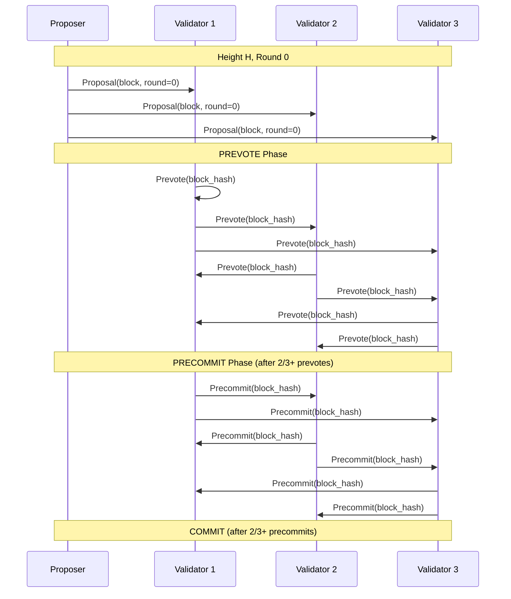

# Implementation Plan: Message Types & Protocol Foundation

## Overview

This document provides a comprehensive implementation guide for the Tendermint protocol message types and foundational data structures. These form the communication backbone of the entire consensus system.

**Estimated Effort**: 1 week
**Dependencies**: None (foundational module)
**Dependents**: All other Tendermint implementation documents, especially:
- `04_CHAINACTOR_HANDLERS.md` (uses all types)
- `14_GENESIS_AND_VALIDATOR_INIT.md` (ValidatorUpdate, GenesisConfig)
- `16_AUXPOW_TENDERMINT_INTEGRATION.md` (PegInInfo, PegInCompensation)
- `17_GOVERNANCE_PARAMETERS.md` (GovernanceUpdate, GovernableParam, ChainParams)
**Files to Create**:
- `app/src/actors_v2/chain/tendermint/mod.rs`
- `app/src/actors_v2/chain/tendermint/messages.rs`
- `app/src/actors_v2/chain/tendermint/types.rs`
- `app/src/actors_v2/chain/tendermint/governance.rs`
- `app/src/actors_v2/chain/tendermint/params.rs`

---

## 1. Conceptual Foundation

### 1.1 Tendermint Message Flow

Tendermint consensus operates through a defined sequence of messages. Understanding this flow is essential before implementing the types.



### 1.2 Message Categories

| Category | Messages | Purpose |
|----------|----------|---------|
| **Proposal** | `Proposal` | Leader broadcasts block candidate |
| **Voting** | `Prevote`, `Precommit` | Validators vote in two phases |
| **Round Change** | `NewRound`, `Timeout` | Progress when stuck |
| **Evidence** | `Evidence` | Report misbehavior |
| **Sync** | `Commit`, `BlockRequest` | Sync finalized blocks |

---

## 2. Module Structure

### 2.1 File Organization

```
app/src/actors_v2/chain/tendermint/
├── mod.rs              # Module exports and re-exports
├── types.rs            # Core types (ValidatorId, BlockHash, Commit, etc.)
├── messages.rs         # All Tendermint protocol messages
├── governance.rs       # Governance types (GovernanceUpdate, ValidatorUpdate, etc.)
├── params.rs           # Chain parameters (ChainParams, GovernableParam, etc.)
├── pegin.rs            # Peg-in types (PegInInfo, PegInCompensation, etc.)
├── block.rs            # Block structure (ConsensusBlockHeader, etc.)
├── state_machine.rs    # Tendermint state (separate implementation plan)
├── vote_set.rs         # Vote collection (separate implementation plan)
├── timeout.rs          # Timeout management (separate implementation plan)
├── wal.rs              # Write-ahead log (separate implementation plan)
├── proposer.rs         # Proposer selection logic
└── evidence.rs         # Equivocation detection
```

### 2.2 Module Root (`mod.rs`)

```rust
//! Tendermint Consensus Implementation for Alys V2
//!
//! This module implements Tendermint-style two-phase BFT consensus,
//! providing instant finality for the Alys blockchain.
//!
//! # Architecture
//!
//! ```text
//! ┌─────────────────────────────────────────────────────────────┐
//! │                    TENDERMINT MODULE                        │
//! ├─────────────────────────────────────────────────────────────┤
//! │                                                             │
//! │  types.rs ──► messages.rs ──► state_machine.rs             │
//! │      │            │                  │                      │
//! │      └────────────┼──────────────────┘                      │
//! │                   ▼                                         │
//! │             vote_set.rs ◄── timeout.rs                      │
//! │                   │                                         │
//! │                   ▼                                         │
//! │               wal.rs                                        │
//! │                   │                                         │
//! │                   ▼                                         │
//! │           evidence.rs ── proposer.rs                        │
//! │                                                             │
//! └─────────────────────────────────────────────────────────────┘
//! ```
//!
//! # Usage
//!
//! ```rust,ignore
//! use crate::actors_v2::chain::tendermint::{
//!     TendermintState,
//!     Proposal,
//!     Vote,
//!     VoteType,
//! };
//! ```

// Core types used throughout the module
pub mod types;
pub use types::*;

// Protocol messages
pub mod messages;
pub use messages::*;

// Governance types (GovernanceUpdate, ValidatorUpdate, etc.)
pub mod governance;
pub use governance::*;

// Chain parameters (ChainParams, GovernableParam)
pub mod params;
pub use params::*;

// Peg-in types (PegInInfo, PegInCompensation)
pub mod pegin;
pub use pegin::*;

// Block structure
pub mod block;
pub use block::*;

// State machine
pub mod state_machine;
pub use state_machine::TendermintState;

// Vote collection
pub mod vote_set;
pub use vote_set::VoteSet;

// Timeout management
pub mod timeout;
pub use timeout::TimeoutScheduler;

// Write-ahead log
pub mod wal;
pub use wal::ConsensusWAL;

// Proposer selection
pub mod proposer;
pub use proposer::ProposerSelector;

// Equivocation evidence
pub mod evidence;
pub use evidence::{Evidence, EquivocationEvidence};

/// Re-export common types for convenience
pub mod prelude {
    pub use super::types::*;
    pub use super::messages::*;
    pub use super::governance::*;
    pub use super::params::*;
    pub use super::pegin::*;
    pub use super::block::*;
    pub use super::TendermintState;
    pub use super::VoteSet;
    pub use super::TimeoutScheduler;
}
```

---

## 3. Core Types Implementation (`types.rs`)

### 3.1 Complete Implementation

```rust
//! Core types for Tendermint consensus.
//!
//! This module defines the fundamental types used throughout the Tendermint
//! implementation. These types are designed to integrate with the existing
//! Alys V2 actor system.

use ethereum_types::H256;
use serde::{Deserialize, Serialize};
use ssz_derive::{Decode, Encode};
use std::fmt;

// Re-export from existing crates for consistency
pub use lighthouse_wrapper::bls::{PublicKey, Signature, AggregateSignature};
pub use lighthouse_wrapper::types::Hash256;

/// Block hash type - consistent with existing Alys conventions
pub type BlockHash = H256;

/// Validator identifier - index into the validator set (0-14 for 15 validators)
///
/// # Design Decision
/// We use u8 instead of PublicKey for efficiency in vote tracking.
/// The ValidatorSet maintains the mapping from index to public key.
#[derive(Debug, Clone, Copy, PartialEq, Eq, Hash, Serialize, Deserialize, Encode, Decode)]
pub struct ValidatorId(pub u8);

impl ValidatorId {
    /// Create a new validator ID
    pub fn new(index: u8) -> Self {
        Self(index)
    }

    /// Get the raw index value
    pub fn index(&self) -> u8 {
        self.0
    }
}

impl fmt::Display for ValidatorId {
    fn fmt(&self, f: &mut fmt::Formatter<'_>) -> fmt::Result {
        write!(f, "Validator({})", self.0)
    }
}

impl From<u8> for ValidatorId {
    fn from(index: u8) -> Self {
        Self(index)
    }
}

/// Tendermint consensus step within a round
///
/// ```text
/// ┌──────────┐     ┌──────────┐     ┌────────────┐     ┌────────┐
/// │ Propose  │ ──► │ Prevote  │ ──► │ Precommit  │ ──► │ Commit │
/// └──────────┘     └──────────┘     └────────────┘     └────────┘
///      │                │                 │                │
///      ▼                ▼                 ▼                ▼
///   timeout          timeout           timeout         done
///   ──────►          ──────►           ──────►
///  NewRound         NewRound          NewRound
/// ```
#[derive(Debug, Clone, Copy, PartialEq, Eq, Hash, Serialize, Deserialize, Encode, Decode)]
pub enum TendermintStep {
    /// Waiting for proposal from the designated proposer
    Propose = 0,

    /// Proposal received, voting prevote
    Prevote = 1,

    /// 2/3+ prevotes received, voting precommit
    Precommit = 2,

    /// 2/3+ precommits received, committing block
    Commit = 3,
}

impl TendermintStep {
    /// Get the next step in the sequence (does not wrap to Propose)
    pub fn next(&self) -> Option<Self> {
        match self {
            Self::Propose => Some(Self::Prevote),
            Self::Prevote => Some(Self::Precommit),
            Self::Precommit => Some(Self::Commit),
            Self::Commit => None, // Height complete
        }
    }

    /// Check if this step allows voting
    pub fn is_voting_step(&self) -> bool {
        matches!(self, Self::Prevote | Self::Precommit)
    }

    /// Convert to numeric value for metrics
    pub fn as_metric_value(&self) -> i64 {
        *self as i64
    }
}

impl fmt::Display for TendermintStep {
    fn fmt(&self, f: &mut fmt::Formatter<'_>) -> fmt::Result {
        match self {
            Self::Propose => write!(f, "Propose"),
            Self::Prevote => write!(f, "Prevote"),
            Self::Precommit => write!(f, "Precommit"),
            Self::Commit => write!(f, "Commit"),
        }
    }
}

/// Vote type distinguishes between prevote and precommit phases
#[derive(Debug, Clone, Copy, PartialEq, Eq, Hash, Serialize, Deserialize, Encode, Decode)]
pub enum VoteType {
    /// First voting phase - signals support for a proposal
    Prevote = 0,

    /// Second voting phase - commits to the block
    Precommit = 1,
}

impl fmt::Display for VoteType {
    fn fmt(&self, f: &mut fmt::Formatter<'_>) -> fmt::Result {
        match self {
            Self::Prevote => write!(f, "Prevote"),
            Self::Precommit => write!(f, "Precommit"),
        }
    }
}

/// Round identifier within a height
///
/// Rounds start at 0 and increment when:
/// - Proposer times out
/// - 2/3+ prevote NIL
/// - 2/3+ precommit NIL
pub type Round = u32;

/// Height identifier (block number)
pub type Height = u64;

/// Voting power for a validator
///
/// For Alys with equal voting power, this is typically 1 per validator.
/// The type allows for future weighted voting if needed.
pub type VotingPower = u64;

/// Commit proof - +2/3 precommit signatures proving block finality
///
/// This structure proves that a block was finalized by collecting
/// the precommit signatures from validators representing >2/3 of
/// the total voting power.
///
/// # Storage Location
///
/// Following the standard Tendermint/CometBFT pattern, this Commit is stored
/// in the **next** block's `last_commit` field:
///
/// ```text
/// Block N:
/// └── last_commit: Commit for Block N-1
///     ├── height: N-1
///     ├── round: R
///     ├── block_hash: hash(Block N-1)
///     └── signatures: [CommitSig, CommitSig, ...]
/// ```
///
/// This means `LoadBlockCommit(height)` returns `Block[height+1].last_commit`.
#[derive(Debug, Clone, Serialize, Deserialize, PartialEq)]
pub struct Commit {
    /// Height of the committed block (this commit is FOR this height)
    pub height: Height,

    /// Round in which the block was committed
    pub round: Round,

    /// Hash of the committed block (BlockID in Tendermint terms)
    pub block_hash: BlockHash,

    /// Individual commit signatures from validators.
    /// The array has one entry per validator in the validator set,
    /// in the same order as the validator set.
    pub signatures: Vec<CommitSig>,
}

/// Individual validator's commit signature.
///
/// Each CommitSig represents how one validator participated in the commit:
/// - Absent: Validator did not submit a precommit
/// - Commit: Validator precommitted to the block
/// - Nil: Validator precommitted nil (voted to skip)
#[derive(Debug, Clone, Serialize, Deserialize, PartialEq)]
pub struct CommitSig {
    /// How this validator participated in the commit
    pub block_id_flag: BlockIDFlag,

    /// Validator's ID/index (None if absent)
    pub validator_address: Option<ValidatorId>,

    /// Timestamp of the vote (Unix timestamp)
    pub timestamp: u64,

    /// BLS signature over the vote (None if absent or voted nil)
    pub signature: Option<BLSSignature>,
}

/// Indicates how a validator participated in the commit
#[derive(Debug, Clone, Copy, Serialize, Deserialize, PartialEq, Eq)]
pub enum BlockIDFlag {
    /// Validator was absent (did not submit a precommit)
    Absent = 0,
    /// Validator precommitted to the block
    Commit = 1,
    /// Validator precommitted nil
    Nil = 2,
}

impl Commit {
    /// Create a new commit from collected precommit signatures
    pub fn new(
        height: Height,
        round: Round,
        block_hash: BlockHash,
        signatures: Vec<CommitSig>,
    ) -> Self {
        Self {
            height,
            round,
            block_hash,
            signatures,
        }
    }

    /// Count the number of validators who committed to the block
    pub fn num_commit_signatures(&self) -> usize {
        self.signatures
            .iter()
            .filter(|sig| sig.block_id_flag == BlockIDFlag::Commit)
            .count()
    }

    /// Check if a specific validator committed to the block
    pub fn has_committed(&self, validator: ValidatorId) -> bool {
        self.signatures.iter().any(|sig| {
            sig.validator_address == Some(validator)
                && sig.block_id_flag == BlockIDFlag::Commit
        })
    }

    /// Verify the commit has sufficient signatures (>2/3)
    pub fn has_sufficient_signatures(&self, total_validators: usize) -> bool {
        let threshold = (total_validators * 2 / 3) + 1;
        self.num_commit_signatures() >= threshold
    }

    /// Get indices of validators who committed (for signature verification)
    pub fn get_committer_indices(&self) -> Vec<u8> {
        self.signatures
            .iter()
            .filter_map(|sig| {
                if sig.block_id_flag == BlockIDFlag::Commit {
                    sig.validator_address.map(|v| v.index())
                } else {
                    None
                }
            })
            .collect()
    }

    /// Get all signatures for aggregate verification
    pub fn get_signatures_for_verification(&self) -> Vec<&BLSSignature> {
        self.signatures
            .iter()
            .filter_map(|sig| {
                if sig.block_id_flag == BlockIDFlag::Commit {
                    sig.signature.as_ref()
                } else {
                    None
                }
            })
            .collect()
    }
}

impl CommitSig {
    /// Create an absent commit signature (validator didn't vote)
    pub fn absent() -> Self {
        Self {
            block_id_flag: BlockIDFlag::Absent,
            validator_address: None,
            timestamp: 0,
            signature: None,
        }
    }

    /// Create a commit signature for a validator who voted for the block
    pub fn commit(validator: ValidatorId, timestamp: u64, signature: BLSSignature) -> Self {
        Self {
            block_id_flag: BlockIDFlag::Commit,
            validator_address: Some(validator),
            timestamp,
            signature: Some(signature),
        }
    }

    /// Create a nil commit signature (validator voted nil)
    pub fn nil(validator: ValidatorId, timestamp: u64, signature: BLSSignature) -> Self {
        Self {
            block_id_flag: BlockIDFlag::Nil,
            validator_address: Some(validator),
            timestamp,
            signature: Some(signature),
        }
    }
}

/// Validator set configuration
///
/// Integrates with the existing Aura authorities while adding
/// voting power semantics for Tendermint.
#[derive(Debug, Clone)]
pub struct ValidatorSet {
    /// Validator public keys (indexed by ValidatorId)
    validators: Vec<PublicKey>,

    /// Voting power for each validator (same order as validators)
    powers: Vec<VotingPower>,

    /// Total voting power (cached for efficiency)
    total_power: VotingPower,

    /// Index of the proposer for the current round
    /// Updated each round via round-robin
    current_proposer_index: usize,
}

impl ValidatorSet {
    /// Create a new validator set from public keys with equal voting power
    ///
    /// This is the standard initialization matching the current Aura setup.
    ///
    /// # Example
    ///
    /// ```rust,ignore
    /// let authorities = aura.authorities.clone();
    /// let validator_set = ValidatorSet::with_equal_power(authorities);
    /// ```
    pub fn with_equal_power(validators: Vec<PublicKey>) -> Self {
        let count = validators.len();
        let powers = vec![1; count]; // Each validator has power 1
        let total_power = count as VotingPower;

        Self {
            validators,
            powers,
            total_power,
            current_proposer_index: 0,
        }
    }

    /// Create a validator set with specified voting powers
    pub fn with_powers(validators: Vec<PublicKey>, powers: Vec<VotingPower>) -> Self {
        assert_eq!(validators.len(), powers.len(), "validators and powers must have same length");
        let total_power = powers.iter().sum();

        Self {
            validators,
            powers,
            total_power,
            current_proposer_index: 0,
        }
    }

    /// Get the total voting power
    pub fn total_power(&self) -> VotingPower {
        self.total_power
    }

    /// Get the voting power of a specific validator
    pub fn get_power(&self, validator: &ValidatorId) -> Result<VotingPower, ValidatorError> {
        self.powers
            .get(validator.index() as usize)
            .copied()
            .ok_or(ValidatorError::UnknownValidator(*validator))
    }

    /// Get the public key of a validator
    pub fn get_public_key(&self, validator: &ValidatorId) -> Result<&PublicKey, ValidatorError> {
        self.validators
            .get(validator.index() as usize)
            .ok_or(ValidatorError::UnknownValidator(*validator))
    }

    /// Get the number of validators
    pub fn len(&self) -> usize {
        self.validators.len()
    }

    /// Check if the set is empty
    pub fn is_empty(&self) -> bool {
        self.validators.is_empty()
    }

    /// Calculate the proposer for a given height and round
    ///
    /// Uses round-robin selection matching Aura's slot_author logic:
    /// `proposer = (height + round) % num_validators`
    ///
    /// # Example
    ///
    /// ```rust,ignore
    /// let validator_set = ValidatorSet::with_equal_power(authorities);
    /// let proposer = validator_set.get_proposer(100, 0);
    /// // With 15 validators: proposer = ValidatorId(100 % 15) = ValidatorId(10)
    /// ```
    pub fn get_proposer(&self, height: Height, round: Round) -> ValidatorId {
        let index = ((height as usize) + (round as usize)) % self.validators.len();
        ValidatorId::new(index as u8)
    }

    /// Calculate the threshold for 2/3+ majority
    ///
    /// For safety, we need strictly greater than 2/3:
    /// `threshold = (total_power * 2 / 3) + 1`
    pub fn two_thirds_threshold(&self) -> VotingPower {
        (self.total_power * 2 / 3) + 1
    }

    /// Check if a given power represents 2/3+ of total
    pub fn has_two_thirds(&self, power: VotingPower) -> bool {
        power >= self.two_thirds_threshold()
    }

    /// Iterator over all validators
    pub fn iter(&self) -> impl Iterator<Item = (ValidatorId, &PublicKey, VotingPower)> {
        self.validators
            .iter()
            .zip(self.powers.iter())
            .enumerate()
            .map(|(i, (pk, &power))| (ValidatorId::new(i as u8), pk, power))
    }

    /// Find validator ID by public key
    pub fn find_validator(&self, pubkey: &PublicKey) -> Option<ValidatorId> {
        self.validators
            .iter()
            .position(|pk| pk == pubkey)
            .map(|i| ValidatorId::new(i as u8))
    }

    // ═══════════════════════════════════════════════════════════════════
    // DYNAMIC VALIDATOR SET UPDATES (for governance)
    // ═══════════════════════════════════════════════════════════════════

    /// Add or update a validator's voting power
    ///
    /// Used by governance to apply ValidatorUpdate changes.
    /// If the validator exists, updates their power.
    /// If new, appends to the validator set.
    ///
    /// # Example
    ///
    /// ```rust,ignore
    /// // Add a new validator with power 1
    /// validator_set.upsert(new_pubkey, 1);
    ///
    /// // Update existing validator's power
    /// validator_set.upsert(existing_pubkey, 2);
    /// ```
    pub fn upsert(&mut self, public_key: PublicKey, power: VotingPower) {
        if let Some(idx) = self.find_validator(&public_key) {
            // Update existing validator
            self.powers[idx.index() as usize] = power;
        } else {
            // Add new validator
            self.validators.push(public_key);
            self.powers.push(power);
        }
        self.recalculate_total_power();
    }

    /// Remove a validator from the set
    ///
    /// Used by governance when a validator's power is set to 0.
    /// Returns true if the validator was found and removed.
    ///
    /// # Warning
    ///
    /// Removing validators changes indices! This should only be called
    /// at height boundaries where a fresh ValidatorId mapping is established.
    pub fn remove(&mut self, public_key: &PublicKey) -> bool {
        if let Some(idx) = self.find_validator(public_key) {
            let index = idx.index() as usize;
            self.validators.remove(index);
            self.powers.remove(index);
            self.recalculate_total_power();
            true
        } else {
            false
        }
    }

    /// Recalculate total voting power after modifications
    fn recalculate_total_power(&mut self) {
        self.total_power = self.powers.iter().sum();
    }

    /// Apply a batch of validator updates atomically
    ///
    /// Updates are applied in order. Power of 0 means removal.
    /// This is the preferred method for governance changes.
    pub fn apply_updates(&mut self, updates: &[ValidatorUpdate]) {
        for update in updates {
            if update.power == 0 {
                self.remove(&update.public_key);
            } else {
                self.upsert(update.public_key.clone(), update.power);
            }
        }
    }
}

/// Errors related to validator operations
#[derive(Debug, Clone, thiserror::Error)]
pub enum ValidatorError {
    #[error("Unknown validator: {0}")]
    UnknownValidator(ValidatorId),

    #[error("Invalid validator index: {0}")]
    InvalidIndex(u8),

    #[error("Validator set is empty")]
    EmptyValidatorSet,
}

#[cfg(test)]
mod tests {
    use super::*;

    #[test]
    fn test_tendermint_step_progression() {
        assert_eq!(TendermintStep::Propose.next(), Some(TendermintStep::Prevote));
        assert_eq!(TendermintStep::Prevote.next(), Some(TendermintStep::Precommit));
        assert_eq!(TendermintStep::Precommit.next(), Some(TendermintStep::Commit));
        assert_eq!(TendermintStep::Commit.next(), None);
    }

    #[test]
    fn test_validator_id() {
        let id = ValidatorId::new(5);
        assert_eq!(id.index(), 5);
        assert_eq!(format!("{}", id), "Validator(5)");
    }

    #[test]
    fn test_two_thirds_threshold() {
        // 15 validators with power 1 each = total 15
        // 2/3 of 15 = 10, threshold = 11
        let validators = vec![PublicKey::default(); 15];
        let set = ValidatorSet::with_equal_power(validators);
        assert_eq!(set.total_power(), 15);
        assert_eq!(set.two_thirds_threshold(), 11);

        // Check threshold behavior
        assert!(!set.has_two_thirds(10));
        assert!(set.has_two_thirds(11));
        assert!(set.has_two_thirds(15));
    }

    #[test]
    fn test_proposer_selection() {
        let validators = vec![PublicKey::default(); 15];
        let set = ValidatorSet::with_equal_power(validators);

        // Height 0, Round 0 -> Validator 0
        assert_eq!(set.get_proposer(0, 0), ValidatorId(0));

        // Height 100, Round 0 -> Validator 10 (100 % 15)
        assert_eq!(set.get_proposer(100, 0), ValidatorId(10));

        // Height 100, Round 1 -> Validator 11 ((100 + 1) % 15)
        assert_eq!(set.get_proposer(100, 1), ValidatorId(11));

        // Round increment wraps around
        assert_eq!(set.get_proposer(14, 1), ValidatorId(0)); // (14 + 1) % 15 = 0
    }
}
```

---

## 4. Governance Types (`governance.rs`)

### 4.1 GovernanceUpdate Enum

The unified type for all governance-controlled changes. See `17_GOVERNANCE_PARAMETERS.md` for full details.

```rust
//! Governance types for federation-controlled updates.
//!
//! All governance changes flow through the unified GovernanceUpdate enum,
//! which supports three categories with different activation timing:
//! - Validator updates: H+2 activation (standard Tendermint)
//! - Parameter updates: H+1 activation (propagation delay)
//! - Emergency actions: H+0 activation (immediate)

use super::types::*;
use serde::{Deserialize, Serialize};

/// Unified type for all governance-controlled changes
///
/// Included in blocks for auditability and late-joiner verification.
/// Updates are idempotent - applying the same update twice is a no-op.
#[derive(Debug, Clone, Serialize, Deserialize, PartialEq, Eq)]
pub enum GovernanceUpdate {
    /// Validator set changes (add/remove/change power)
    /// Activation: H+2 (standard Tendermint delayed validator changes)
    Validator(ValidatorUpdate),

    /// Chain parameter changes
    /// Activation: H+1 (allows propagation before activation)
    Parameter(ParameterUpdate),

    /// Emergency actions (pause/resume)
    /// Activation: H+0 (immediate effect)
    Emergency(EmergencyAction),
}

impl GovernanceUpdate {
    /// Get the activation delay (in blocks) for this update type
    pub fn activation_delay(&self) -> u64 {
        match self {
            GovernanceUpdate::Validator(_) => 2,
            GovernanceUpdate::Parameter(_) => 1,
            GovernanceUpdate::Emergency(_) => 0,
        }
    }

    /// Get the effective height when included at `inclusion_height`
    pub fn effective_height(&self, inclusion_height: u64) -> u64 {
        inclusion_height + self.activation_delay()
    }

    /// Get variant name for logging
    pub fn variant_name(&self) -> &'static str {
        match self {
            GovernanceUpdate::Validator(_) => "Validator",
            GovernanceUpdate::Parameter(_) => "Parameter",
            GovernanceUpdate::Emergency(_) => "Emergency",
        }
    }
}

/// Validator set change request from governance
///
/// # Idempotency
///
/// Updates are keyed by `public_key`. If multiple updates arrive for the
/// same validator, the latest one wins (replaces in queue).
#[derive(Debug, Clone, Serialize, Deserialize, PartialEq, Eq)]
pub struct ValidatorUpdate {
    /// Validator's BLS public key
    pub public_key: PublicKey,

    /// New voting power (0 = remove from validator set)
    pub power: VotingPower,

    /// Governance threshold signature proving authorization
    pub governance_signature: Signature,
}

impl ValidatorUpdate {
    /// Check if this update removes the validator
    pub fn is_removal(&self) -> bool {
        self.power == 0
    }
}

/// Emergency action from governance
///
/// Emergency actions take effect immediately (H+0) and are used for
/// critical situations requiring instant response.
#[derive(Debug, Clone, Serialize, Deserialize, PartialEq, Eq)]
pub struct EmergencyAction {
    /// The action to take
    pub action: EmergencyActionKind,

    /// Governance threshold signature proving authorization
    pub governance_signature: Signature,
}

/// Types of emergency actions
#[derive(Debug, Clone, Copy, Serialize, Deserialize, PartialEq, Eq)]
pub enum EmergencyActionKind {
    /// Pause peg-in processing (new deposits rejected)
    PausePegIns,
    /// Resume peg-in processing
    ResumePegIns,
    /// Pause peg-out processing (withdrawals halted)
    PausePegOuts,
    /// Resume peg-out processing
    ResumePegOuts,
    /// Emergency chain halt (no new blocks)
    PauseChain,
    /// Resume chain operation
    ResumeChain,
}

impl EmergencyAction {
    /// Get the action type for logging/metrics
    pub fn action_type(&self) -> EmergencyActionKind {
        self.action
    }
}

/// Queue of pending governance updates awaiting activation
///
/// Updates are keyed to provide idempotency:
/// - Validators keyed by PublicKey
/// - Parameters keyed by GovernableParam
#[derive(Debug, Clone, Default)]
pub struct GovernanceQueue {
    /// Pending validator updates (keyed by public key)
    pub validators: std::collections::HashMap<PublicKey, ValidatorUpdate>,

    /// Pending parameter updates (keyed by parameter)
    pub parameters: std::collections::HashMap<GovernableParam, ParameterUpdate>,
}

impl GovernanceQueue {
    /// Create an empty governance queue
    pub fn new() -> Self {
        Self::default()
    }

    /// Check if queue is empty
    pub fn is_empty(&self) -> bool {
        self.validators.is_empty() && self.parameters.is_empty()
    }

    /// Get total number of pending updates
    pub fn len(&self) -> usize {
        self.validators.len() + self.parameters.len()
    }
}

#[cfg(test)]
mod governance_tests {
    use super::*;

    #[test]
    fn test_activation_delays() {
        let validator_update = GovernanceUpdate::Validator(ValidatorUpdate {
            public_key: PublicKey::default(),
            power: 1,
            governance_signature: Signature::empty(),
        });
        assert_eq!(validator_update.activation_delay(), 2);
        assert_eq!(validator_update.effective_height(100), 102);

        // Parameter updates activate at H+1
        let param_update = GovernanceUpdate::Parameter(ParameterUpdate {
            param: GovernableParam::MinerFeeBps,
            value: ParameterValue::U64(50),
            governance_signature: Signature::empty(),
        });
        assert_eq!(param_update.activation_delay(), 1);
        assert_eq!(param_update.effective_height(100), 101);

        // Emergency actions are immediate
        let emergency = GovernanceUpdate::Emergency(EmergencyAction {
            action: EmergencyActionKind::PausePegIns,
            governance_signature: Signature::empty(),
        });
        assert_eq!(emergency.activation_delay(), 0);
        assert_eq!(emergency.effective_height(100), 100);
    }

    #[test]
    fn test_governance_queue_idempotency() {
        let mut queue = GovernanceQueue::new();
        let pubkey = PublicKey::default();

        // First update: power = 100
        queue.validators.insert(pubkey.clone(), ValidatorUpdate {
            public_key: pubkey.clone(),
            power: 100,
            governance_signature: Signature::empty(),
        });

        // Second update: power = 200 (replaces first)
        queue.validators.insert(pubkey.clone(), ValidatorUpdate {
            public_key: pubkey.clone(),
            power: 200,
            governance_signature: Signature::empty(),
        });

        assert_eq!(queue.validators.len(), 1);
        assert_eq!(queue.validators.get(&pubkey).unwrap().power, 200);
    }
}
```

---

## 5. Chain Parameters (`params.rs`)

### 5.1 GovernableParam Enum

Exhaustive enumeration of all federation-controllable parameters.

```rust
//! Chain parameters that can be modified by governance.
//!
//! All governable parameters are enumerated here with their constraints.
//! See `17_GOVERNANCE_PARAMETERS.md` for complete documentation.

use serde::{Deserialize, Serialize};
use std::collections::HashMap;

/// Enumeration of all governable parameters
///
/// Organized into ranges by category:
/// - 100-199: Peg-in compensation
/// - 200-299: Bridge configuration
/// - 300-399: Checkpoint configuration
/// - 400-499: Consensus parameters
/// - 500-599: Fee schedule
#[derive(Debug, Clone, Copy, Serialize, Deserialize, PartialEq, Eq, Hash)]
#[repr(u16)]
pub enum GovernableParam {
    // ═══════════════════════════════════════════════════════════════════
    // Peg-in compensation (100-199)
    // ═══════════════════════════════════════════════════════════════════
    /// Miner fee in basis points (50 = 0.5%)
    MinerFeeBps = 100,
    /// Minimum fee in satoshis (floor for small peg-ins)
    MinFeeSatoshi = 101,
    /// Maximum fee in satoshis (cap for large peg-ins)
    MaxFeeSatoshi = 102,

    // ═══════════════════════════════════════════════════════════════════
    // Bridge configuration (200-299)
    // ═══════════════════════════════════════════════════════════════════
    /// Required Bitcoin confirmations for peg-ins
    BtcConfirmations = 200,
    /// Minimum peg-in/out amount in satoshis
    MinPegAmount = 201,
    /// Maximum peg-in/out amount in satoshis
    MaxPegAmount = 202,
    /// Required federation signatures for peg-outs
    FederationThreshold = 203,

    // ═══════════════════════════════════════════════════════════════════
    // Checkpoint configuration (300-399)
    // ═══════════════════════════════════════════════════════════════════
    /// Minimum blocks between checkpoints
    MinCheckpointInterval = 300,
    /// Target checkpoint frequency
    TargetCheckpointInterval = 301,
    /// Liveness gate: max blocks without AuxPoW
    MaxBlocksWithoutPow = 304,

    // ═══════════════════════════════════════════════════════════════════
    // Consensus parameters (400-499)
    // ═══════════════════════════════════════════════════════════════════
    /// Proposal timeout in milliseconds
    ProposeTimeoutMs = 400,
    /// Prevote timeout in milliseconds
    PrevoteTimeoutMs = 401,
    /// Precommit timeout in milliseconds
    PrecommitTimeoutMs = 402,
    /// Timeout increase per round in milliseconds
    TimeoutDeltaMs = 403,
    /// Maximum validator count
    MaxValidators = 404,

    // ═══════════════════════════════════════════════════════════════════
    // Fee schedule (500-599)
    // ═══════════════════════════════════════════════════════════════════
    /// Minimum EVM base fee in gwei
    BaseFeeFloor = 500,
    /// Maximum EVM base fee in gwei
    BaseFeeCeiling = 501,
}

impl GovernableParam {
    /// Convert to bytes for storage key
    pub fn to_bytes(&self) -> [u8; 2] {
        (*self as u16).to_be_bytes()
    }

    /// Parse from bytes
    pub fn from_bytes(bytes: [u8; 2]) -> Option<Self> {
        let value = u16::from_be_bytes(bytes);
        Self::try_from(value).ok()
    }

    /// Get the category name for this parameter
    pub fn category(&self) -> &'static str {
        match *self as u16 {
            100..=199 => "peg-in-compensation",
            200..=299 => "bridge-config",
            300..=399 => "checkpoint-config",
            400..=499 => "consensus-params",
            500..=599 => "fee-schedule",
            _ => "unknown",
        }
    }
}

/// Parameter value types
#[derive(Debug, Clone, Serialize, Deserialize, PartialEq, Eq)]
pub enum ParameterValue {
    U64(u64),
    U32(u32),
    Bool(bool),
    Bytes(Vec<u8>),
}

/// A parameter update from governance
#[derive(Debug, Clone, Serialize, Deserialize, PartialEq, Eq)]
pub struct ParameterUpdate {
    /// Which parameter to update
    pub param: GovernableParam,

    /// New value
    pub value: ParameterValue,

    /// Governance threshold signature
    pub governance_signature: Signature,
}

impl ParameterUpdate {
    /// Validate the parameter value against constraints
    pub fn validate(&self) -> Result<(), ParameterError> {
        match self.param {
            GovernableParam::MinerFeeBps => {
                if let ParameterValue::U64(v) = &self.value {
                    if *v > 10000 {
                        return Err(ParameterError::OutOfRange {
                            param: self.param,
                            value: format!("{}", v),
                            constraint: "0-10000".to_string(),
                        });
                    }
                }
            }
            GovernableParam::BtcConfirmations => {
                if let ParameterValue::U32(v) = &self.value {
                    if *v < 1 || *v > 100 {
                        return Err(ParameterError::OutOfRange {
                            param: self.param,
                            value: format!("{}", v),
                            constraint: "1-100".to_string(),
                        });
                    }
                }
            }
            // Add more validation as needed
            _ => {}
        }
        Ok(())
    }
}

/// Current chain parameter state
///
/// Holds all governable parameters with their current values.
/// Initialized from genesis and updated via governance.
#[derive(Debug, Clone, Serialize, Deserialize)]
pub struct ChainParams {
    // Peg-in compensation
    pub pegin_compensation: PegInCompensation,

    // Bridge config
    pub btc_confirmations: u32,
    pub min_peg_amount: u64,
    pub max_peg_amount: u64,
    pub federation_threshold: u32,

    // Consensus params
    pub propose_timeout_ms: u64,
    pub prevote_timeout_ms: u64,
    pub precommit_timeout_ms: u64,
    pub timeout_delta_ms: u64,
    pub max_validators: u32,

    // Checkpoint config
    pub min_checkpoint_interval: u64,
    pub target_checkpoint_interval: u64,
    pub max_blocks_without_pow: u64,

    // Fee schedule
    pub base_fee_floor: u64,
    pub base_fee_ceiling: u64,

    // Emergency controls
    pub chain_paused: bool,
    pub pegins_paused: bool,
    pub pegouts_paused: bool,
}

impl ChainParams {
    /// Compute a hash of the current parameter state
    ///
    /// Used in block headers for light client verification.
    pub fn compute_hash(&self) -> Hash256 {
        use tiny_keccak::{Hasher, Keccak};

        let serialized = bincode::serialize(self)
            .expect("ChainParams serialization should not fail");

        let mut hasher = Keccak::v256();
        hasher.update(&serialized);

        let mut output = [0u8; 32];
        hasher.finalize(&mut output);
        Hash256::from_slice(&output)
    }

    /// Apply a parameter update
    pub fn apply_update(&mut self, update: &ParameterUpdate) -> Result<(), ParameterError> {
        update.validate()?;

        match update.param {
            GovernableParam::MinerFeeBps => {
                if let ParameterValue::U64(v) = update.value {
                    self.pegin_compensation.miner_fee_bps = v;
                }
            }
            GovernableParam::MinFeeSatoshi => {
                if let ParameterValue::U64(v) = update.value {
                    self.pegin_compensation.min_fee_satoshi = v;
                }
            }
            GovernableParam::MaxFeeSatoshi => {
                if let ParameterValue::U64(v) = update.value {
                    self.pegin_compensation.max_fee_satoshi = v;
                }
            }
            GovernableParam::BtcConfirmations => {
                if let ParameterValue::U32(v) = update.value {
                    self.btc_confirmations = v;
                }
            }
            // ... handle all parameters
            _ => {}
        }

        Ok(())
    }
}

impl Default for ChainParams {
    fn default() -> Self {
        Self {
            pegin_compensation: PegInCompensation::default(),
            btc_confirmations: 6,
            min_peg_amount: 10_000,
            max_peg_amount: 100_000_000,
            federation_threshold: 11,
            propose_timeout_ms: 3000,
            prevote_timeout_ms: 1000,
            precommit_timeout_ms: 1000,
            timeout_delta_ms: 500,
            max_validators: 15,
            min_checkpoint_interval: 100,
            target_checkpoint_interval: 500,
            max_blocks_without_pow: 50_000,
            base_fee_floor: 1,
            base_fee_ceiling: 1000,
            chain_paused: false,
            pegins_paused: false,
            pegouts_paused: false,
        }
    }
}

#[derive(Debug, Clone, thiserror::Error)]
pub enum ParameterError {
    #[error("Parameter {param:?} value {value} out of range: {constraint}")]
    OutOfRange {
        param: GovernableParam,
        value: String,
        constraint: String,
    },

    #[error("Invalid parameter value type for {param:?}")]
    InvalidType { param: GovernableParam },
}
```

---

## 6. Peg-In Types (`pegin.rs`)

### 6.1 Peg-In Structures

Types for miner-effectuated peg-ins. See `16_AUXPOW_TENDERMINT_INTEGRATION.md` for full details.

```rust
//! Peg-in types for Bitcoin deposit processing.
//!
//! Miners monitor Bitcoin for deposits and submit them via submitauxblock.
//! These types define the peg-in data structures and compensation parameters.

use ethereum_types::{Address, H256};
use serde::{Deserialize, Serialize};

/// Peg-in information extracted from Bitcoin transaction
///
/// This data travels FROM the miner TO the chain via submitauxblock.
/// ChainActor validates and queues them, then the proposer converts
/// them to EVM Withdrawals in the next block's execution_payload.
#[derive(Debug, Clone, Serialize, Deserialize, PartialEq, Eq)]
pub struct PegInInfo {
    /// Bitcoin transaction ID
    pub txid: bitcoin::Txid,

    /// Bitcoin block containing the deposit
    pub block_hash: bitcoin::BlockHash,

    /// Bitcoin block height
    pub block_height: u32,

    /// Amount deposited in satoshis
    pub amount: u64,

    /// Target EVM address (extracted from OP_RETURN)
    pub evm_account: Address,
}

/// Queued peg-in with miner fee recipient
///
/// When a miner submits a peg-in, we track who should receive
/// the compensation when the peg-in is included in a block.
#[derive(Debug, Clone, Serialize, Deserialize)]
pub struct QueuedPegIn {
    /// The peg-in information
    pub info: PegInInfo,

    /// Miner address to receive compensation
    pub fee_recipient: Address,

    /// Height at which this peg-in was queued
    pub queued_at_height: u64,
}

/// Peg-in compensation parameters
///
/// Configures how miners are compensated for including peg-ins.
/// These are governable parameters that can be changed by the federation.
#[derive(Debug, Clone, Serialize, Deserialize, PartialEq, Eq)]
pub struct PegInCompensation {
    /// Percentage of peg-in amount paid to miner (basis points)
    /// e.g., 50 = 0.5%
    pub miner_fee_bps: u64,

    /// Minimum fee in satoshis (floor for small peg-ins)
    pub min_fee_satoshi: u64,

    /// Maximum fee in satoshis (cap for large peg-ins)
    pub max_fee_satoshi: u64,
}

impl Default for PegInCompensation {
    fn default() -> Self {
        Self {
            miner_fee_bps: 50,           // 0.5%
            min_fee_satoshi: 1_000,      // 0.00001 BTC
            max_fee_satoshi: 10_000_000, // 0.1 BTC
        }
    }
}

impl PegInCompensation {
    /// Calculate miner fee for a given peg-in amount
    ///
    /// Fee = (amount * miner_fee_bps) / 10000, clamped to [min, max]
    pub fn calculate_fee(&self, amount: u64) -> u64 {
        let fee = (amount * self.miner_fee_bps) / 10_000;
        fee.clamp(self.min_fee_satoshi, self.max_fee_satoshi)
    }
}

#[cfg(test)]
mod pegin_tests {
    use super::*;

    #[test]
    fn test_fee_calculation() {
        let params = PegInCompensation::default();

        // Normal case: 0.5% of 1 BTC = 500,000 sats
        assert_eq!(params.calculate_fee(100_000_000), 500_000);

        // Min floor: 0.5% of 10,000 sats = 50 sats, but min is 1000
        assert_eq!(params.calculate_fee(10_000), 1_000);

        // Max cap: 0.5% of 100 BTC = 50M sats, but max is 10M
        assert_eq!(params.calculate_fee(10_000_000_000), 10_000_000);
    }
}
```

---

## 7. Block Structure (`block.rs`)

### 7.1 ConsensusBlockHeader

Defines the block header structure with Tendermint consensus fields.

```rust
//! Block structure definitions for Tendermint consensus.
//!
//! The block header includes:
//! - Standard blockchain fields (parent, height, timestamp)
//! - Tendermint fields (last_commit, proposer)
//! - Governance fields (governance_updates, params_hash)
//! - AuxPoW fields (auxpow_header)

use super::types::*;
use super::governance::GovernanceUpdate;
use ethereum_types::{Address, H256};
use serde::{Deserialize, Serialize};

/// Consensus block header with all Tendermint and governance fields
///
/// # LastCommit Design
///
/// Following standard Tendermint/CometBFT architecture:
/// - `last_commit` contains the Commit proof for the PREVIOUS block
/// - Block N+1.last_commit proves Block N was finalized
/// - Genesis block has last_commit = None
#[derive(Debug, Clone, Serialize, Deserialize)]
pub struct ConsensusBlockHeader {
    /// Hash of the parent block
    pub parent_hash: BlockHash,

    /// Block height (0-indexed from genesis)
    pub height: Height,

    /// Unix timestamp (seconds since epoch)
    pub timestamp: u64,

    /// Validator who proposed this block
    pub proposer: ValidatorId,

    /// Commit proof for the previous block (embedded)
    ///
    /// This is the key Tendermint design: the commit for block N-1
    /// is embedded in block N's header, proving N-1 was finalized.
    pub last_commit: Option<Commit>,

    /// State root after executing this block
    pub state_root: H256,

    /// Transactions root (merkle root of tx list)
    pub transactions_root: H256,

    /// Receipts root (merkle root of receipts)
    pub receipts_root: H256,

    /// Governance updates included in this block (optional)
    ///
    /// Contains validator updates, parameter changes, and emergency actions
    /// that were received from the governance client. These are recorded
    /// for auditability and late-joiner verification.
    pub governance_updates: Option<Vec<GovernanceUpdate>>,

    /// Hash of current parameter state
    ///
    /// Allows light clients to verify parameter state without
    /// replaying all governance updates from genesis.
    pub params_hash: Hash256,

    /// AuxPoW header (if this block includes merge-mining proof)
    pub auxpow_header: Option<AuxPowHeader>,

    /// Extra data (limited to 32 bytes)
    pub extra_data: Vec<u8>,
}

impl ConsensusBlockHeader {
    /// Compute the block hash
    pub fn hash(&self) -> BlockHash {
        use tiny_keccak::{Hasher, Keccak};

        let mut hasher = Keccak::v256();

        hasher.update(self.parent_hash.as_bytes());
        hasher.update(&self.height.to_le_bytes());
        hasher.update(&self.timestamp.to_le_bytes());
        hasher.update(&[self.proposer.index()]);
        hasher.update(self.state_root.as_bytes());
        hasher.update(self.transactions_root.as_bytes());
        hasher.update(self.receipts_root.as_bytes());
        hasher.update(self.params_hash.as_bytes());

        // Include governance_updates hash if present
        if let Some(ref updates) = self.governance_updates {
            let updates_hash = hash_governance_updates(updates);
            hasher.update(updates_hash.as_bytes());
        }

        let mut output = [0u8; 32];
        hasher.finalize(&mut output);
        BlockHash::from_slice(&output)
    }

    /// Check if this block has a last_commit (all blocks except genesis)
    pub fn has_last_commit(&self) -> bool {
        self.last_commit.is_some()
    }

    /// Check if this block includes AuxPoW proof
    pub fn has_auxpow(&self) -> bool {
        self.auxpow_header.is_some()
    }

    /// Check if this block includes governance updates
    pub fn has_governance_updates(&self) -> bool {
        self.governance_updates.as_ref().map_or(false, |u| !u.is_empty())
    }
}

/// AuxPoW header for merge-mining proof
///
/// Extended to include peg-in data submitted by miners.
#[derive(Debug, Clone, Serialize, Deserialize)]
pub struct AuxPowHeader {
    /// Start of the block range this AuxPoW covers
    pub range_start: H256,

    /// End of the block range this AuxPoW covers
    pub range_end: H256,

    /// Bitcoin difficulty bits
    pub bits: u32,

    /// Alys chain ID for AuxPoW
    pub chain_id: u32,

    /// Block height at submission
    pub height: u64,

    /// The actual AuxPoW proof (None if not yet mined)
    pub auxpow: Option<AuxPow>,

    /// Miner's address for block reward and peg-in compensation
    pub fee_recipient: Address,
}

/// AuxPoW proof structure (Bitcoin merge-mining proof)
#[derive(Debug, Clone, Serialize, Deserialize)]
pub struct AuxPow {
    /// Bitcoin coinbase transaction
    pub coinbase_tx: Vec<u8>,

    /// Merkle branch from coinbase to Bitcoin block root
    pub coinbase_branch: Vec<H256>,

    /// Index in merkle tree
    pub coinbase_index: u32,

    /// Merkle branch in auxiliary blockchain
    pub blockchain_branch: Vec<H256>,

    /// Index in auxiliary merkle tree
    pub blockchain_index: u32,

    /// Bitcoin block header
    pub parent_block: Vec<u8>,
}

/// Pending AuxPoW waiting to be included in next block
#[derive(Debug, Clone)]
pub struct PendingAuxPow {
    /// Hash that was mined
    pub hash: H256,

    /// The AuxPoW proof
    pub auxpow: AuxPow,

    /// Miner's fee recipient address
    pub fee_recipient: Address,
}

impl PendingAuxPow {
    /// Convert to AuxPowHeader for block inclusion
    pub fn into_header(self, range_start: H256, range_end: H256, height: u64) -> AuxPowHeader {
        AuxPowHeader {
            range_start,
            range_end,
            bits: 0, // Filled from AuxPoW
            chain_id: 0, // Alys chain ID
            height,
            auxpow: Some(self.auxpow),
            fee_recipient: self.fee_recipient,
        }
    }
}

/// Helper to hash governance updates for block hash computation
fn hash_governance_updates(updates: &[GovernanceUpdate]) -> Hash256 {
    use tiny_keccak::{Hasher, Keccak};

    let serialized = bincode::serialize(updates)
        .expect("GovernanceUpdate serialization should not fail");

    let mut hasher = Keccak::v256();
    hasher.update(&serialized);

    let mut output = [0u8; 32];
    hasher.finalize(&mut output);
    Hash256::from_slice(&output)
}

#[cfg(test)]
mod block_tests {
    use super::*;

    #[test]
    fn test_genesis_has_no_last_commit() {
        let genesis = ConsensusBlockHeader {
            parent_hash: BlockHash::zero(),
            height: 0,
            timestamp: 0,
            proposer: ValidatorId(0),
            last_commit: None, // Genesis has no last_commit
            state_root: H256::zero(),
            transactions_root: H256::zero(),
            receipts_root: H256::zero(),
            governance_updates: None,
            params_hash: Hash256::zero(),
            auxpow_header: None,
            extra_data: vec![],
        };

        assert!(!genesis.has_last_commit());
        assert!(!genesis.has_auxpow());
        assert!(!genesis.has_governance_updates());
    }
}
```

---

## 8. Message Types Implementation (`messages.rs`)

### 4.1 Complete Implementation

```rust
//! Tendermint protocol messages.
//!
//! This module defines all messages exchanged between validators during
//! Tendermint consensus. Messages are designed for:
//! - Efficient serialization (serde + SSZ for network)
//! - BLS signature compatibility (using existing lighthouse_wrapper)
//! - Integration with the Alys actor message system
//!
//! # Message Flow
//!
//! ```text
//! Height H, Round R:
//!
//!   Leader                      Validators
//!     │                              │
//!     │──── Proposal(block) ────────►│
//!     │                              │
//!     │◄─── Prevote(block_hash) ─────│
//!     │                              │
//!     │     [collect 2/3+ prevotes]  │
//!     │                              │
//!     │◄─── Precommit(block_hash) ───│
//!     │                              │
//!     │     [collect 2/3+ precommits]│
//!     │                              │
//!     │          COMMITTED           │
//! ```

use super::types::*;
use crate::block::ConsensusBlock;
use lighthouse_wrapper::bls::Signature as BLSSignature;
use lighthouse_wrapper::types::MainnetEthSpec;
use serde::{Deserialize, Serialize};
use std::time::Duration;

/// A block proposal from the designated proposer
///
/// The proposer creates a Proposal containing:
/// - The candidate block
/// - Proof-of-Lock (if locked from a previous round)
/// - Their signature authorizing the proposal
///
/// # Proof-of-Lock (POL)
///
/// If the proposer is locked on a block from a previous round, they MUST
/// propose that block and include the `pol_round` indicating when they locked.
/// This prevents equivocation and ensures progress.
///
/// # Example: Creating a Proposal
///
/// ```rust,ignore
/// let proposal = Proposal {
///     height: 100,
///     round: 0,
///     block: block.clone(),
///     pol_round: None,  // Not locked
///     proposer: my_validator_id,
///     signature: sign_proposal(&block, height, round, &keypair)?,
/// };
/// ```
#[derive(Debug, Clone, Serialize, Deserialize)]
pub struct Proposal {
    /// Block height being proposed
    pub height: Height,

    /// Round within this height
    pub round: Round,

    /// The proposed block
    pub block: ConsensusBlock<MainnetEthSpec>,

    /// Proof-of-Lock round (if proposer is locked on this block)
    ///
    /// - `None`: Proposer is not locked, free to propose any valid block
    /// - `Some(r)`: Proposer locked at round `r`, must propose locked block
    pub pol_round: Option<Round>,

    /// Validator ID of the proposer
    pub proposer: ValidatorId,

    /// BLS signature over the proposal
    ///
    /// Signs: `hash(height || round || block_hash || pol_round)`
    pub signature: BLSSignature,
}

impl Proposal {
    /// Get the hash of the proposed block
    pub fn block_hash(&self) -> BlockHash {
        self.block.hash()
    }

    /// Create the signing root for this proposal
    ///
    /// The signing root is: `keccak256(height || round || block_hash || pol_round_flag || pol_round)`
    pub fn signing_root(&self) -> Hash256 {
        use tiny_keccak::{Hasher, Keccak};

        let mut hasher = Keccak::v256();
        hasher.update(&self.height.to_le_bytes());
        hasher.update(&self.round.to_le_bytes());
        hasher.update(self.block_hash().as_bytes());

        match self.pol_round {
            Some(r) => {
                hasher.update(&[1u8]); // Has POL
                hasher.update(&r.to_le_bytes());
            }
            None => {
                hasher.update(&[0u8]); // No POL
            }
        }

        let mut output = [0u8; 32];
        hasher.finalize(&mut output);
        Hash256::from_slice(&output)
    }

    /// Verify the proposal signature
    pub fn verify_signature(&self, public_key: &PublicKey) -> bool {
        let signing_root = self.signing_root();
        self.signature.verify(public_key, signing_root)
    }
}

/// A vote (prevote or precommit) from a validator
///
/// Votes are the core mechanism for reaching consensus:
/// - **Prevote**: "I've seen a valid proposal and am willing to commit to it"
/// - **Precommit**: "I've seen 2/3+ prevotes and am committing to this block"
///
/// # NIL Votes
///
/// A vote with `block_hash = None` is a NIL vote, indicating:
/// - No valid proposal was received in time (timeout)
/// - The validator cannot vote for the proposed block (invalid, conflicts with lock)
///
/// NIL votes are important for liveness - they allow the round to progress
/// even when no block can be committed.
///
/// # Example: Creating a Prevote
///
/// ```rust,ignore
/// // Vote for a block
/// let prevote = Vote {
///     height: 100,
///     round: 0,
///     vote_type: VoteType::Prevote,
///     block_hash: Some(proposal.block_hash()),
///     validator: my_validator_id,
///     signature: sign_vote(VoteType::Prevote, height, round, Some(block_hash), &keypair)?,
/// };
///
/// // NIL vote (no valid proposal)
/// let nil_prevote = Vote {
///     height: 100,
///     round: 0,
///     vote_type: VoteType::Prevote,
///     block_hash: None,  // NIL
///     validator: my_validator_id,
///     signature: sign_vote(VoteType::Prevote, height, round, None, &keypair)?,
/// };
/// ```
#[derive(Debug, Clone, Serialize, Deserialize)]
pub struct Vote {
    /// Block height being voted on
    pub height: Height,

    /// Round within this height
    pub round: Round,

    /// Type of vote (Prevote or Precommit)
    pub vote_type: VoteType,

    /// Hash of the block being voted for, or None for NIL
    pub block_hash: Option<BlockHash>,

    /// Validator casting the vote
    pub validator: ValidatorId,

    /// BLS signature over the vote
    ///
    /// Signs: `hash(vote_type || height || round || block_hash_or_nil)`
    pub signature: BLSSignature,
}

impl Vote {
    /// Check if this is a NIL vote
    pub fn is_nil(&self) -> bool {
        self.block_hash.is_none()
    }

    /// Create the signing root for this vote
    ///
    /// The signing root is: `keccak256(vote_type || height || round || block_hash_or_zeros)`
    pub fn signing_root(&self) -> Hash256 {
        use tiny_keccak::{Hasher, Keccak};

        let mut hasher = Keccak::v256();
        hasher.update(&[self.vote_type as u8]);
        hasher.update(&self.height.to_le_bytes());
        hasher.update(&self.round.to_le_bytes());

        match &self.block_hash {
            Some(hash) => hasher.update(hash.as_bytes()),
            None => hasher.update(&[0u8; 32]), // NIL represented as zeros
        }

        let mut output = [0u8; 32];
        hasher.finalize(&mut output);
        Hash256::from_slice(&output)
    }

    /// Verify the vote signature
    pub fn verify_signature(&self, public_key: &PublicKey) -> bool {
        let signing_root = self.signing_root();
        self.signature.verify(public_key, signing_root)
    }

    /// Create a signed vote
    pub fn new_signed(
        height: Height,
        round: Round,
        vote_type: VoteType,
        block_hash: Option<BlockHash>,
        validator: ValidatorId,
        keypair: &lighthouse_wrapper::bls::Keypair,
    ) -> Self {
        let mut vote = Self {
            height,
            round,
            vote_type,
            block_hash,
            validator,
            signature: BLSSignature::empty(), // Placeholder
        };

        let signing_root = vote.signing_root();
        vote.signature = keypair.sk.sign(signing_root);
        vote
    }
}

/// Timeout event for progressing stuck rounds
///
/// When a validator doesn't receive expected messages within the timeout period,
/// they emit a timeout to trigger round progression.
#[derive(Debug, Clone, Serialize, Deserialize)]
pub struct Timeout {
    /// Height of the timeout
    pub height: Height,

    /// Round that timed out
    pub round: Round,

    /// Step that timed out (Propose, Prevote, or Precommit)
    pub step: TendermintStep,

    /// Validator reporting the timeout
    pub validator: ValidatorId,

    /// Signature proving authenticity
    pub signature: BLSSignature,
}

impl Timeout {
    /// Create the signing root for this timeout
    pub fn signing_root(&self) -> Hash256 {
        use tiny_keccak::{Hasher, Keccak};

        let mut hasher = Keccak::v256();
        hasher.update(b"timeout");
        hasher.update(&self.height.to_le_bytes());
        hasher.update(&self.round.to_le_bytes());
        hasher.update(&[self.step as u8]);

        let mut output = [0u8; 32];
        hasher.finalize(&mut output);
        Hash256::from_slice(&output)
    }
}

/// High-level message enum for network transmission
///
/// This enum wraps all Tendermint protocol messages for unified handling
/// in the network layer.
///
/// # Network Topics
///
/// Each message type corresponds to a Gossipsub topic:
/// - `Proposal` -> `/alys/tendermint/proposals/1`
/// - `Vote` -> `/alys/tendermint/votes/1`
/// - `Timeout` -> `/alys/tendermint/timeouts/1`
/// - `Evidence` -> `/alys/tendermint/evidence/1`
#[derive(Debug, Clone, Serialize, Deserialize)]
pub enum TendermintMessage {
    /// Block proposal from the designated proposer
    Proposal(Proposal),

    /// Vote (prevote or precommit) from a validator
    Vote(Vote),

    /// Timeout notification
    Timeout(Timeout),

    /// Equivocation evidence (double voting/proposing)
    Evidence(EquivocationEvidence),

    /// New round notification (used for view synchronization)
    NewRound {
        height: Height,
        round: Round,
        /// Highest round for which we've seen 2/3+ any votes
        highest_known_round: Round,
    },

    /// Request for a committed block (for syncing)
    BlockRequest {
        height: Height,
    },

    /// Response with a committed block and its proof
    BlockResponse {
        block: ConsensusBlock<MainnetEthSpec>,
        commit: Commit,
    },
}

impl TendermintMessage {
    /// Get the height this message pertains to
    pub fn height(&self) -> Option<Height> {
        match self {
            Self::Proposal(p) => Some(p.height),
            Self::Vote(v) => Some(v.height),
            Self::Timeout(t) => Some(t.height),
            Self::Evidence(e) => Some(e.height()),
            Self::NewRound { height, .. } => Some(*height),
            Self::BlockRequest { height } => Some(*height),
            Self::BlockResponse { block, .. } => Some(block.slot), // slot == height
        }
    }

    /// Get the round this message pertains to (if applicable)
    pub fn round(&self) -> Option<Round> {
        match self {
            Self::Proposal(p) => Some(p.round),
            Self::Vote(v) => Some(v.round),
            Self::Timeout(t) => Some(t.round),
            Self::NewRound { round, .. } => Some(*round),
            _ => None,
        }
    }

    /// Get the message type as a string (for logging/metrics)
    pub fn message_type(&self) -> &'static str {
        match self {
            Self::Proposal(_) => "proposal",
            Self::Vote(v) => match v.vote_type {
                VoteType::Prevote => "prevote",
                VoteType::Precommit => "precommit",
            },
            Self::Timeout(_) => "timeout",
            Self::Evidence(_) => "evidence",
            Self::NewRound { .. } => "new_round",
            Self::BlockRequest { .. } => "block_request",
            Self::BlockResponse { .. } => "block_response",
        }
    }
}

/// Evidence of validator misbehavior
///
/// This is used to prove that a validator has equivocated (double-voted
/// or double-proposed), which is a slashable offense in many BFT protocols.
#[derive(Debug, Clone, Serialize, Deserialize)]
pub enum EquivocationEvidence {
    /// Validator proposed two different blocks for the same height/round
    DuplicateProposal {
        proposal_a: Proposal,
        proposal_b: Proposal,
    },

    /// Validator voted for two different blocks in the same round
    DuplicateVote {
        vote_a: Vote,
        vote_b: Vote,
    },
}

impl EquivocationEvidence {
    /// Get the misbehaving validator
    pub fn validator(&self) -> ValidatorId {
        match self {
            Self::DuplicateProposal { proposal_a, .. } => proposal_a.proposer,
            Self::DuplicateVote { vote_a, .. } => vote_a.validator,
        }
    }

    /// Get the height of the misbehavior
    pub fn height(&self) -> Height {
        match self {
            Self::DuplicateProposal { proposal_a, .. } => proposal_a.height,
            Self::DuplicateVote { vote_a, .. } => vote_a.height,
        }
    }

    /// Get the round of the misbehavior
    pub fn round(&self) -> Round {
        match self {
            Self::DuplicateProposal { proposal_a, .. } => proposal_a.round,
            Self::DuplicateVote { vote_a, .. } => vote_a.round,
        }
    }

    /// Verify that this evidence is valid
    ///
    /// Checks:
    /// 1. Both messages are for the same height/round
    /// 2. Both messages are from the same validator
    /// 3. The messages are different (different block hashes)
    /// 4. Both signatures are valid
    pub fn verify(&self, validator_set: &ValidatorSet) -> Result<bool, ValidatorError> {
        match self {
            Self::DuplicateProposal { proposal_a, proposal_b } => {
                // Same height, round, and proposer
                if proposal_a.height != proposal_b.height
                    || proposal_a.round != proposal_b.round
                    || proposal_a.proposer != proposal_b.proposer
                {
                    return Ok(false);
                }

                // Different blocks
                if proposal_a.block_hash() == proposal_b.block_hash() {
                    return Ok(false);
                }

                // Valid signatures
                let pubkey = validator_set.get_public_key(&proposal_a.proposer)?;
                Ok(proposal_a.verify_signature(pubkey) && proposal_b.verify_signature(pubkey))
            }

            Self::DuplicateVote { vote_a, vote_b } => {
                // Same height, round, validator, and vote type
                if vote_a.height != vote_b.height
                    || vote_a.round != vote_b.round
                    || vote_a.validator != vote_b.validator
                    || vote_a.vote_type != vote_b.vote_type
                {
                    return Ok(false);
                }

                // Different blocks (or one NIL and one not)
                if vote_a.block_hash == vote_b.block_hash {
                    return Ok(false);
                }

                // Valid signatures
                let pubkey = validator_set.get_public_key(&vote_a.validator)?;
                Ok(vote_a.verify_signature(pubkey) && vote_b.verify_signature(pubkey))
            }
        }
    }
}

/// Actor message wrapper for ChainActor integration
///
/// This message type integrates Tendermint consensus messages with the
/// existing ChainActor message system.
///
/// # Integration with ChainMessage
///
/// Add to `ChainMessage` enum in `actors_v2/chain/messages.rs`:
///
/// ```rust,ignore
/// pub enum ChainMessage {
///     // ... existing variants ...
///
///     /// Handle incoming Tendermint consensus message
///     TendermintMessage {
///         message: TendermintMessage,
///         peer_id: Option<String>,
///         correlation_id: Option<Uuid>,
///     },
/// }
/// ```
#[derive(Debug, Clone)]
pub struct TendermintActorMessage {
    /// The consensus message
    pub message: TendermintMessage,

    /// Peer that sent this message (None if locally generated)
    pub peer_id: Option<String>,

    /// Correlation ID for tracing
    pub correlation_id: Option<uuid::Uuid>,
}

#[cfg(test)]
mod tests {
    use super::*;
    use lighthouse_wrapper::bls::Keypair;

    fn create_test_keypair() -> Keypair {
        Keypair::random()
    }

    #[test]
    fn test_vote_signing_root_determinism() {
        let vote1 = Vote {
            height: 100,
            round: 0,
            vote_type: VoteType::Prevote,
            block_hash: Some(BlockHash::repeat_byte(0xAB)),
            validator: ValidatorId(5),
            signature: BLSSignature::empty(),
        };

        let vote2 = vote1.clone();

        assert_eq!(vote1.signing_root(), vote2.signing_root());
    }

    #[test]
    fn test_vote_signing_root_differs_by_type() {
        let prevote = Vote {
            height: 100,
            round: 0,
            vote_type: VoteType::Prevote,
            block_hash: Some(BlockHash::repeat_byte(0xAB)),
            validator: ValidatorId(5),
            signature: BLSSignature::empty(),
        };

        let precommit = Vote {
            height: 100,
            round: 0,
            vote_type: VoteType::Precommit,
            block_hash: Some(BlockHash::repeat_byte(0xAB)),
            validator: ValidatorId(5),
            signature: BLSSignature::empty(),
        };

        assert_ne!(prevote.signing_root(), precommit.signing_root());
    }

    #[test]
    fn test_nil_vote_signing_root() {
        let nil_vote = Vote {
            height: 100,
            round: 0,
            vote_type: VoteType::Prevote,
            block_hash: None, // NIL
            validator: ValidatorId(5),
            signature: BLSSignature::empty(),
        };

        let block_vote = Vote {
            height: 100,
            round: 0,
            vote_type: VoteType::Prevote,
            block_hash: Some(BlockHash::zero()),
            validator: ValidatorId(5),
            signature: BLSSignature::empty(),
        };

        // NIL should differ from voting for zero hash
        assert_ne!(nil_vote.signing_root(), block_vote.signing_root());
    }

    #[test]
    fn test_proposal_signing_root_with_pol() {
        let proposal_no_pol = Proposal {
            height: 100,
            round: 0,
            block: ConsensusBlock::default(), // Would need actual block
            pol_round: None,
            proposer: ValidatorId(0),
            signature: BLSSignature::empty(),
        };

        let proposal_with_pol = Proposal {
            height: 100,
            round: 0,
            block: ConsensusBlock::default(),
            pol_round: Some(1),
            proposer: ValidatorId(0),
            signature: BLSSignature::empty(),
        };

        assert_ne!(proposal_no_pol.signing_root(), proposal_with_pol.signing_root());
    }

    #[test]
    fn test_equivocation_evidence_different_blocks() {
        let vote_a = Vote {
            height: 100,
            round: 0,
            vote_type: VoteType::Prevote,
            block_hash: Some(BlockHash::repeat_byte(0xAA)),
            validator: ValidatorId(5),
            signature: BLSSignature::empty(),
        };

        let vote_b = Vote {
            height: 100,
            round: 0,
            vote_type: VoteType::Prevote,
            block_hash: Some(BlockHash::repeat_byte(0xBB)),
            validator: ValidatorId(5),
            signature: BLSSignature::empty(),
        };

        let evidence = EquivocationEvidence::DuplicateVote { vote_a, vote_b };

        assert_eq!(evidence.validator(), ValidatorId(5));
        assert_eq!(evidence.height(), 100);
        assert_eq!(evidence.round(), 0);
    }

    #[test]
    fn test_tendermint_message_type() {
        let vote = Vote {
            height: 100,
            round: 0,
            vote_type: VoteType::Prevote,
            block_hash: None,
            validator: ValidatorId(0),
            signature: BLSSignature::empty(),
        };

        let msg = TendermintMessage::Vote(vote);
        assert_eq!(msg.message_type(), "prevote");
        assert_eq!(msg.height(), Some(100));
        assert_eq!(msg.round(), Some(0));
    }
}
```

---

## 9. Integration with Existing System

### 5.1 Adding to ChainMessage Enum

Modify `app/src/actors_v2/chain/messages.rs`:

```rust
// Add import at top
use crate::actors_v2::chain::tendermint::{TendermintMessage, Proposal, Vote};

// Add new variant to ChainMessage enum
pub enum ChainMessage {
    // ... existing variants ...

    /// Handle Tendermint consensus message from network
    TendermintConsensus {
        message: TendermintMessage,
        peer_id: Option<String>,
        correlation_id: Option<Uuid>,
    },

    /// Internal: Timeout triggered for current round
    TendermintTimeout {
        height: u64,
        round: u32,
        step: crate::actors_v2::chain::tendermint::TendermintStep,
    },
}
```

### 5.2 Adding to ChainResponse Enum

```rust
pub enum ChainResponse {
    // ... existing variants ...

    /// Tendermint consensus action taken
    TendermintAction {
        action: TendermintActionType,
        height: u64,
        round: u32,
    },
}

#[derive(Debug, Clone)]
pub enum TendermintActionType {
    ProposalReceived,
    PrevoteSent,
    PrecommitSent,
    BlockCommitted { block_hash: H256 },
    RoundAdvanced,
    EvidenceRecorded,
}
```

---

## 10. Serialization for Network Transmission

### 6.1 MessagePack Serialization (V0 Compatible)

```rust
// In messages.rs, add serialization helpers

impl TendermintMessage {
    /// Serialize for network transmission (MessagePack format)
    pub fn serialize_for_network(&self) -> Result<Vec<u8>, SerializationError> {
        rmp_serde::to_vec(self)
            .map_err(|e| SerializationError::Encode(e.to_string()))
    }

    /// Deserialize from network bytes
    pub fn deserialize_from_network(bytes: &[u8]) -> Result<Self, SerializationError> {
        rmp_serde::from_slice(bytes)
            .map_err(|e| SerializationError::Decode(e.to_string()))
    }
}

#[derive(Debug, Clone, thiserror::Error)]
pub enum SerializationError {
    #[error("Failed to encode: {0}")]
    Encode(String),

    #[error("Failed to decode: {0}")]
    Decode(String),
}
```

---

## 11. Example: Complete Message Flow

### 7.1 Proposer Creates and Broadcasts Proposal

```rust
// In ChainActor, when it's our turn to propose

async fn create_and_broadcast_proposal(&self) -> Result<(), ChainError> {
    let height = self.state.tendermint.height;
    let round = self.state.tendermint.round;

    // 1. Build the block (reusing existing logic)
    let block = self.build_block(height).await?;

    // 2. Create proposal with POL if locked
    let proposal = Proposal {
        height,
        round,
        block: block.message.clone(),
        pol_round: self.state.tendermint.locked_round,
        proposer: self.state.validator_id,
        signature: self.sign_proposal(&block.message, height, round)?,
    };

    // 3. Write to WAL before broadcasting (safety)
    self.wal.write(WALEntry::SentProposal {
        height,
        round,
        block_hash: proposal.block_hash(),
    })?;

    // 4. Broadcast to network
    let message = TendermintMessage::Proposal(proposal.clone());
    self.network_actor
        .as_ref()
        .ok_or(ChainError::NetworkActorNotSet)?
        .send(NetworkMessage::BroadcastTendermint { message })
        .await??;

    // 5. Also prevote for our own proposal
    self.cast_prevote(Some(proposal.block_hash())).await?;

    Ok(())
}
```

### 7.2 Validator Receives Proposal and Prevotes

```rust
// Handler for receiving a proposal

async fn handle_proposal(&self, proposal: Proposal, peer_id: Option<String>) -> Result<ChainResponse, ChainError> {
    let height = self.state.tendermint.height;
    let round = self.state.tendermint.round;

    // 1. Basic validation
    if proposal.height != height || proposal.round != round {
        return Ok(ChainResponse::TendermintAction {
            action: TendermintActionType::ProposalIgnored,
            height: proposal.height,
            round: proposal.round,
        });
    }

    // 2. Verify proposer is correct for this round
    let expected_proposer = self.state.validator_set.get_proposer(height, round);
    if proposal.proposer != expected_proposer {
        return Err(ChainError::InvalidProposer {
            expected: expected_proposer,
            actual: proposal.proposer,
        });
    }

    // 3. Verify signature
    let pubkey = self.state.validator_set.get_public_key(&proposal.proposer)?;
    if !proposal.verify_signature(pubkey) {
        return Err(ChainError::InvalidProposalSignature);
    }

    // 4. Validate block contents
    self.validate_block(&proposal.block).await?;

    // 5. Check locking rules (critical for safety)
    let vote_hash = self.determine_prevote(&proposal)?;

    // 6. Store proposal
    self.state.tendermint.current_proposal = Some(proposal.clone());

    // 7. Cast prevote
    self.cast_prevote(vote_hash).await?;

    Ok(ChainResponse::TendermintAction {
        action: TendermintActionType::ProposalReceived,
        height,
        round,
    })
}

/// Determine what to prevote for based on locking rules
fn determine_prevote(&self, proposal: &Proposal) -> Result<Option<BlockHash>, ChainError> {
    let locked_block = &self.state.tendermint.locked_block;
    let locked_round = self.state.tendermint.locked_round;

    match (locked_block, proposal.pol_round) {
        // Not locked - vote for proposal
        (None, _) => Ok(Some(proposal.block_hash())),

        // Locked on this block - vote for it
        (Some(locked), _) if *locked == proposal.block_hash() => {
            Ok(Some(proposal.block_hash()))
        }

        // Locked on different block, but proposal has valid POL from higher round
        (Some(_locked), Some(pol_round)) if pol_round > locked_round.unwrap_or(0) => {
            // Unlock and vote for new proposal
            // (In full implementation, would verify POL)
            Ok(Some(proposal.block_hash()))
        }

        // Locked on different block, no valid unlock - vote NIL
        (Some(_), _) => Ok(None),
    }
}
```

---

## 12. Testing Strategy

### 8.1 Unit Tests

```rust
#[cfg(test)]
mod integration_tests {
    use super::*;

    #[test]
    fn test_proposal_roundtrip_serialization() {
        let proposal = Proposal {
            height: 100,
            round: 0,
            block: create_test_block(),
            pol_round: None,
            proposer: ValidatorId(0),
            signature: BLSSignature::empty(),
        };

        let msg = TendermintMessage::Proposal(proposal.clone());
        let bytes = msg.serialize_for_network().unwrap();
        let decoded = TendermintMessage::deserialize_from_network(&bytes).unwrap();

        match decoded {
            TendermintMessage::Proposal(p) => {
                assert_eq!(p.height, proposal.height);
                assert_eq!(p.round, proposal.round);
                assert_eq!(p.proposer, proposal.proposer);
            }
            _ => panic!("Expected Proposal"),
        }
    }

    #[test]
    fn test_vote_signature_verification() {
        let keypair = Keypair::random();
        let validator_id = ValidatorId(0);

        let vote = Vote::new_signed(
            100,
            0,
            VoteType::Prevote,
            Some(BlockHash::repeat_byte(0xAB)),
            validator_id,
            &keypair,
        );

        assert!(vote.verify_signature(&keypair.pk));

        // Wrong key should fail
        let other_keypair = Keypair::random();
        assert!(!vote.verify_signature(&other_keypair.pk));
    }
}
```

---

## 13. Checklist

### Module Setup
- [ ] Create `app/src/actors_v2/chain/tendermint/` directory
- [ ] Implement `mod.rs` with module structure and exports
- [ ] Update `Cargo.toml` if new dependencies needed (bitcoin, bincode)

### Core Types (types.rs)
- [ ] Implement `ValidatorId` with Display trait
- [ ] Implement `TendermintStep` enum
- [ ] Implement `VoteType` enum
- [ ] Implement `Commit` and `CommitSig` structs
- [ ] Implement `BlockIDFlag` enum
- [ ] Implement `ValidatorSet` with equal power constructor
- [ ] Implement `ValidatorSet::upsert()` for dynamic updates
- [ ] Implement `ValidatorSet::remove()` for validator removal
- [ ] Implement `ValidatorSet::apply_updates()` for batch updates
- [ ] Write unit tests for ValidatorSet

### Messages (messages.rs)
- [ ] Implement `Proposal` with signing root
- [ ] Implement `Vote` with signing root and signature verification
- [ ] Implement `Timeout` struct
- [ ] Implement `TendermintMessage` enum
- [ ] Implement `EquivocationEvidence` enum
- [ ] Write unit tests for message serialization
- [ ] Write unit tests for signature verification

### Governance Types (governance.rs)
- [ ] Implement `GovernanceUpdate` enum with activation delays
- [ ] Implement `ValidatorUpdate` struct (without update_id)
- [ ] Implement `ParameterUpdate` struct
- [ ] Implement `EmergencyAction` struct
- [ ] Implement `EmergencyActionKind` enum
- [ ] Implement `GovernanceQueue` struct
- [ ] Write unit tests for activation timing
- [ ] Write unit tests for queue idempotency

### Chain Parameters (params.rs)
- [ ] Implement `GovernableParam` enum with all parameters
- [ ] Implement `ParameterValue` enum
- [ ] Implement `ParameterUpdate::validate()` with constraints
- [ ] Implement `ChainParams` struct with all fields
- [ ] Implement `ChainParams::compute_hash()` for params_hash
- [ ] Implement `ChainParams::apply_update()` for parameter changes
- [ ] Implement `Default` for `ChainParams` with sensible defaults
- [ ] Write unit tests for parameter validation

### Peg-In Types (pegin.rs)
- [ ] Implement `PegInInfo` struct
- [ ] Implement `QueuedPegIn` struct with fee_recipient
- [ ] Implement `PegInCompensation` struct
- [ ] Implement `PegInCompensation::calculate_fee()` with clamping
- [ ] Write unit tests for fee calculation

### Block Structure (block.rs)
- [ ] Implement `ConsensusBlockHeader` with all fields
- [ ] Implement `ConsensusBlockHeader::hash()` computation
- [ ] Implement `AuxPowHeader` struct with peg-in support
- [ ] Implement `AuxPow` struct
- [ ] Implement `PendingAuxPow` struct
- [ ] Write unit tests for block hashing

### Integration
- [ ] Add `TendermintConsensus` variant to `ChainMessage`
- [ ] Add `TendermintAction` variant to `ChainResponse`
- [ ] Add governance message variants to `ChainMessage`
- [ ] Add peg-in message variants to `ChainMessage`

---

## 14. Next Steps

After completing this implementation:
1. Proceed to **02_STATE_MACHINE.md** - Tendermint State Machine
2. The state machine will use these message types for state transitions
3. The vote set implementation will use `VoteType` and `Vote` structures

---

*Implementation Plan Version: 2.0*
*Last Updated: February 2026*
*Changes: Added governance types, chain parameters, peg-in types, block structure, ValidatorSet dynamic updates*
