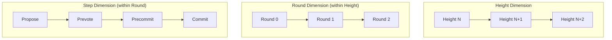
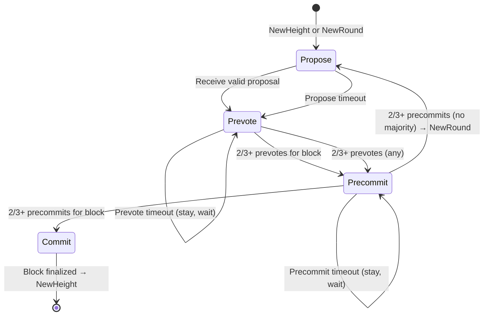
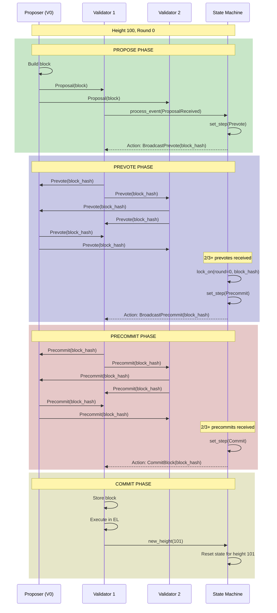

# Implementation Plan: Tendermint State Machine

## Overview

This document provides a comprehensive implementation guide for the Tendermint consensus state machine. The state machine is the core of Tendermint consensus, managing height/round/step transitions and enforcing the protocol rules.

**Estimated Effort**: 2 weeks
**Dependencies**:
- `01_MESSAGE_TYPES_AND_PROTOCOL_FOUNDATION.md` (types and messages)
**Files to Create**:
- `app/src/actors_v2/chain/tendermint/state_machine.rs`
- `app/src/actors_v2/chain/tendermint/locking.rs`

---

## 1. Conceptual Foundation

### 1.1 State Machine Overview

The Tendermint state machine tracks consensus progress through three dimensions:



### 1.2 State Transitions



### 1.3 Critical Safety Properties

1. **Locking Rule**: Once a validator precommits for a block, they are "locked" on it
2. **Unlocking Rule**: Can only unlock with Proof-of-Lock-Change (POL) from higher round
3. **No Double Voting**: A validator votes at most once per step per round
4. **Finality**: Once 2/3+ precommit, the block is final and cannot be reverted

---

## 2. State Machine Implementation

### 2.1 Core State Structure

```rust
//! Tendermint consensus state machine.
//!
//! This module implements the core Tendermint state machine that manages
//! consensus state transitions. It enforces the safety and liveness
//! properties of the protocol.
//!
//! # State Hierarchy
//!
//! ```text
//! TendermintState
//! ├── Current Position: (height, round, step)
//! ├── Locking State: (locked_round, locked_block)
//! ├── Vote Collections: (prevotes, precommits) per round
//! ├── Proposals: received proposals for current height
//! └── Validator Set: current validators and their powers
//! ```

use super::types::*;
use super::messages::*;
use super::vote_set::VoteSet;
use std::collections::HashMap;
use std::sync::Arc;
use tokio::sync::RwLock;
use tracing::{debug, info, warn, error};

/// The core Tendermint consensus state
///
/// This structure maintains all state needed for a single validator to
/// participate in Tendermint consensus. It is designed for async-safe
/// access using `Arc<RwLock<>>` for mutable vote sets.
///
/// # Thread Safety
///
/// The state uses `Arc<RwLock<>>` for vote collections to allow concurrent
/// read access while maintaining safety. Other fields are only modified
/// through controlled state transitions.
///
/// # Example
///
/// ```rust,ignore
/// let validator_set = Arc::new(ValidatorSet::with_equal_power(authorities));
/// let mut state = TendermintState::new(100, validator_set, ValidatorId(5));
///
/// // Process incoming proposal
/// state.on_proposal(proposal)?;
///
/// // Check if we should cast prevote
/// if state.step == TendermintStep::Prevote {
///     let vote = state.create_prevote(block_hash, &keypair)?;
///     // broadcast vote...
/// }
/// ```
#[derive(Debug)]
pub struct TendermintState {
    // ═══════════════════════════════════════════════════════════════════
    // POSITION STATE - Where are we in consensus?
    // ═══════════════════════════════════════════════════════════════════

    /// Current block height being decided
    pub height: Height,

    /// Current round within this height (starts at 0)
    pub round: Round,

    /// Current step within this round
    pub step: TendermintStep,

    // ═══════════════════════════════════════════════════════════════════
    // LOCKING STATE - Critical for safety
    // ═══════════════════════════════════════════════════════════════════

    /// Round at which we became locked (if any)
    ///
    /// Once locked, we can only vote for the locked block unless we
    /// receive a valid Proof-of-Lock-Change from a higher round.
    pub locked_round: Option<Round>,

    /// Block hash we are locked on (if any)
    ///
    /// Safety invariant: if locked_round is Some, locked_block must also be Some
    pub locked_block: Option<BlockHash>,

    /// The round at which we last saw 2/3+ prevotes (used for unlocking)
    pub valid_round: Option<Round>,

    /// The block hash that received 2/3+ prevotes
    pub valid_block: Option<BlockHash>,

    // ═══════════════════════════════════════════════════════════════════
    // VOTE COLLECTION - Track votes from all validators
    // ═══════════════════════════════════════════════════════════════════

    /// Prevotes for the current round
    ///
    /// Uses `Arc<RwLock<>>` for async-safe concurrent access
    pub prevotes: Arc<RwLock<VoteSet>>,

    /// Precommits for the current round
    pub precommits: Arc<RwLock<VoteSet>>,

    /// Historical vote sets from previous rounds (for POL verification)
    /// Key: round number
    pub historical_prevotes: HashMap<Round, Arc<RwLock<VoteSet>>>,

    // ═══════════════════════════════════════════════════════════════════
    // PROPOSAL TRACKING
    // ═══════════════════════════════════════════════════════════════════

    /// Proposal received for current round (if any)
    pub current_proposal: Option<Proposal>,

    /// All proposals seen at this height (for evidence)
    /// Key: (round, proposer)
    pub proposals: HashMap<(Round, ValidatorId), Proposal>,

    // ═══════════════════════════════════════════════════════════════════
    // VALIDATOR CONFIGURATION
    // ═══════════════════════════════════════════════════════════════════

    /// The current validator set
    pub validator_set: Arc<ValidatorSet>,

    /// Our validator ID (if we are a validator)
    pub our_validator_id: Option<ValidatorId>,

    // ═══════════════════════════════════════════════════════════════════
    // VOTE TRACKING - Prevent double voting
    // ═══════════════════════════════════════════════════════════════════

    /// Prevotes we've sent: (round) -> block_hash
    /// Used to prevent double voting and for WAL recovery
    pub sent_prevotes: HashMap<Round, Option<BlockHash>>,

    /// Precommits we've sent: (round) -> block_hash
    pub sent_precommits: HashMap<Round, Option<BlockHash>>,
}

impl TendermintState {
    /// Create a new state for the given height
    ///
    /// # Arguments
    ///
    /// * `height` - The block height to begin consensus for
    /// * `validator_set` - The current validator set
    /// * `our_validator_id` - Our validator ID (None if not a validator)
    ///
    /// # Example
    ///
    /// ```rust,ignore
    /// let state = TendermintState::new(
    ///     100,
    ///     Arc::new(validator_set),
    ///     Some(ValidatorId(5)),
    /// );
    /// ```
    pub fn new(
        height: Height,
        validator_set: Arc<ValidatorSet>,
        our_validator_id: Option<ValidatorId>,
    ) -> Self {
        let prevotes = Arc::new(RwLock::new(VoteSet::new(
            height,
            0,
            VoteType::Prevote,
            validator_set.clone(),
        )));

        let precommits = Arc::new(RwLock::new(VoteSet::new(
            height,
            0,
            VoteType::Precommit,
            validator_set.clone(),
        )));

        Self {
            height,
            round: 0,
            step: TendermintStep::Propose,

            locked_round: None,
            locked_block: None,
            valid_round: None,
            valid_block: None,

            prevotes,
            precommits,
            historical_prevotes: HashMap::new(),

            current_proposal: None,
            proposals: HashMap::new(),

            validator_set,
            our_validator_id,

            sent_prevotes: HashMap::new(),
            sent_precommits: HashMap::new(),
        }
    }

    /// Start a new round within the current height
    ///
    /// This is called when:
    /// - 2/3+ precommits for NIL (no consensus this round)
    /// - Precommit timeout expired with no majority
    ///
    /// Note: Locking state is preserved across rounds!
    ///
    /// # Example
    ///
    /// ```rust,ignore
    /// // Round 0 failed to reach consensus
    /// state.new_round(1);
    /// assert_eq!(state.round, 1);
    /// assert_eq!(state.step, TendermintStep::Propose);
    /// // locked_block is still set if we were locked
    /// ```
    pub fn new_round(&mut self, round: Round) {
        debug!(
            height = self.height,
            old_round = self.round,
            new_round = round,
            "Starting new round"
        );

        // Archive current round's prevotes for POL verification
        if let Ok(prevotes) = Arc::try_unwrap(self.prevotes.clone()) {
            self.historical_prevotes
                .insert(self.round, Arc::new(prevotes));
        }

        self.round = round;
        self.step = TendermintStep::Propose;

        // Create new vote sets for this round
        self.prevotes = Arc::new(RwLock::new(VoteSet::new(
            self.height,
            round,
            VoteType::Prevote,
            self.validator_set.clone(),
        )));

        self.precommits = Arc::new(RwLock::new(VoteSet::new(
            self.height,
            round,
            VoteType::Precommit,
            self.validator_set.clone(),
        )));

        self.current_proposal = None;

        // Note: locked_round and locked_block are NOT reset!
        // Locking persists across rounds until height changes
    }

    /// Advance to a new height after committing a block
    ///
    /// This completely resets the state for the new height.
    /// All locking state is cleared.
    ///
    /// # Example
    ///
    /// ```rust,ignore
    /// // Block at height 100 was committed
    /// state.new_height(101, new_validator_set);
    /// assert_eq!(state.height, 101);
    /// assert_eq!(state.round, 0);
    /// assert!(state.locked_block.is_none());
    /// ```
    pub fn new_height(&mut self, height: Height, validator_set: Arc<ValidatorSet>) {
        info!(
            old_height = self.height,
            new_height = height,
            "Advancing to new height"
        );

        self.height = height;
        self.round = 0;
        self.step = TendermintStep::Propose;

        // Clear locking state
        self.locked_round = None;
        self.locked_block = None;
        self.valid_round = None;
        self.valid_block = None;

        // Clear vote tracking
        self.sent_prevotes.clear();
        self.sent_precommits.clear();

        // Clear proposals
        self.current_proposal = None;
        self.proposals.clear();

        // Clear historical votes
        self.historical_prevotes.clear();

        // Update validator set and create new vote sets
        self.validator_set = validator_set;
        self.prevotes = Arc::new(RwLock::new(VoteSet::new(
            height,
            0,
            VoteType::Prevote,
            self.validator_set.clone(),
        )));
        self.precommits = Arc::new(RwLock::new(VoteSet::new(
            height,
            0,
            VoteType::Precommit,
            self.validator_set.clone(),
        )));
    }

    /// Set the step to a new value
    ///
    /// Only allows forward progression within a round.
    pub fn set_step(&mut self, step: TendermintStep) {
        if step as u8 > self.step as u8 {
            debug!(
                height = self.height,
                round = self.round,
                old_step = %self.step,
                new_step = %step,
                "Step transition"
            );
            self.step = step;
        }
    }

    /// Get the proposer for the current round
    pub fn current_proposer(&self) -> ValidatorId {
        self.validator_set.get_proposer(self.height, self.round)
    }

    /// Check if we are the proposer for the current round
    pub fn is_proposer(&self) -> bool {
        match self.our_validator_id {
            Some(id) => id == self.current_proposer(),
            None => false,
        }
    }

    /// Check if we are a validator
    pub fn is_validator(&self) -> bool {
        self.our_validator_id.is_some()
    }

    /// Check if we have already voted in the current round
    pub fn has_voted_prevote(&self) -> bool {
        self.sent_prevotes.contains_key(&self.round)
    }

    pub fn has_voted_precommit(&self) -> bool {
        self.sent_precommits.contains_key(&self.round)
    }

    /// Record that we sent a prevote
    pub fn record_prevote(&mut self, block_hash: Option<BlockHash>) {
        self.sent_prevotes.insert(self.round, block_hash);
    }

    /// Record that we sent a precommit
    pub fn record_precommit(&mut self, block_hash: Option<BlockHash>) {
        self.sent_precommits.insert(self.round, block_hash);
    }

    /// Lock on a block after seeing 2/3+ prevotes
    ///
    /// This is the critical locking operation that ensures safety.
    pub fn lock_on(&mut self, round: Round, block_hash: BlockHash) {
        info!(
            height = self.height,
            round = round,
            block_hash = %block_hash,
            "Locking on block"
        );
        self.locked_round = Some(round);
        self.locked_block = Some(block_hash);
    }

    /// Update valid block after seeing 2/3+ prevotes
    ///
    /// Valid block is used for unlocking and proposal validity.
    pub fn set_valid(&mut self, round: Round, block_hash: BlockHash) {
        self.valid_round = Some(round);
        self.valid_block = Some(block_hash);
    }

    /// Check if we should unlock based on a Proof-of-Lock-Change
    ///
    /// We can unlock if we see 2/3+ prevotes for a different block
    /// in a round higher than our locked round.
    pub fn can_unlock(&self, pol_round: Round, _pol_block: BlockHash) -> bool {
        match self.locked_round {
            None => true, // Not locked, no unlock needed
            Some(locked_round) => pol_round > locked_round,
        }
    }

    /// Clear the lock (after successful unlock verification)
    pub fn unlock(&mut self) {
        debug!(
            height = self.height,
            previous_locked_round = ?self.locked_round,
            previous_locked_block = ?self.locked_block,
            "Unlocking"
        );
        self.locked_round = None;
        self.locked_block = None;
    }

    /// Get a summary of current state for logging/debugging
    pub fn summary(&self) -> StateSummary {
        StateSummary {
            height: self.height,
            round: self.round,
            step: self.step,
            locked: self.locked_block.is_some(),
            proposer: self.current_proposer(),
            is_us_proposer: self.is_proposer(),
        }
    }
}

/// Summary of state for logging
#[derive(Debug, Clone)]
pub struct StateSummary {
    pub height: Height,
    pub round: Round,
    pub step: TendermintStep,
    pub locked: bool,
    pub proposer: ValidatorId,
    pub is_us_proposer: bool,
}

impl std::fmt::Display for StateSummary {
    fn fmt(&self, f: &mut std::fmt::Formatter<'_>) -> std::fmt::Result {
        write!(
            f,
            "H={} R={} Step={} Locked={} Proposer={} (us={})",
            self.height,
            self.round,
            self.step,
            self.locked,
            self.proposer,
            self.is_us_proposer
        )
    }
}
```

### 2.2 State Transition Logic

```rust
// Continue in state_machine.rs

/// Events that can trigger state transitions
#[derive(Debug, Clone)]
pub enum ConsensusEvent {
    /// New proposal received from proposer
    ProposalReceived(Proposal),

    /// Vote received from a validator
    VoteReceived(Vote),

    /// Timeout expired for current step
    Timeout(TendermintStep),

    /// 2/3+ prevotes collected for a block
    TwoThirdsPrevotes(Option<BlockHash>),

    /// 2/3+ precommits collected for a block
    TwoThirdsPrecommits(Option<BlockHash>),
}

/// Actions to take after processing an event
#[derive(Debug, Clone)]
pub enum ConsensusAction {
    /// Do nothing
    None,

    /// Broadcast our prevote
    BroadcastPrevote(Option<BlockHash>),

    /// Broadcast our precommit
    BroadcastPrecommit(Option<BlockHash>),

    /// Commit the block (consensus reached!)
    CommitBlock(BlockHash),

    /// Move to next round
    NewRound(Round),

    /// Schedule a timeout
    ScheduleTimeout(TendermintStep),
}

impl TendermintState {
    /// Process an incoming event and determine what actions to take
    ///
    /// This is the main state transition function. It takes an event,
    /// updates internal state, and returns actions to perform.
    ///
    /// # State Machine Rules
    ///
    /// ```text
    /// PROPOSE:
    ///   on ProposalReceived:
    ///     if valid and (not locked OR proposal matches lock OR POL unlocks)
    ///       → set_step(Prevote), BroadcastPrevote(block_hash)
    ///     else
    ///       → set_step(Prevote), BroadcastPrevote(None)
    ///   on Timeout:
    ///     → set_step(Prevote), BroadcastPrevote(None)
    ///
    /// PREVOTE:
    ///   on TwoThirdsPrevotes(Some(block)):
    ///     → lock_on(block), set_step(Precommit), BroadcastPrecommit(block)
    ///   on TwoThirdsPrevotes(None):
    ///     → set_step(Precommit), BroadcastPrecommit(None)
    ///   on Timeout (after 2/3+ any):
    ///     → set_step(Precommit), BroadcastPrecommit(locked_block or None)
    ///
    /// PRECOMMIT:
    ///   on TwoThirdsPrecommits(Some(block)):
    ///     → CommitBlock(block)
    ///   on TwoThirdsPrecommits(None) or Timeout:
    ///     → NewRound(round + 1)
    /// ```
    pub async fn process_event(&mut self, event: ConsensusEvent) -> Vec<ConsensusAction> {
        let mut actions = Vec::new();

        match (&self.step, event) {
            // ═══════════════════════════════════════════════════════════════
            // PROPOSE STEP
            // ═══════════════════════════════════════════════════════════════

            (TendermintStep::Propose, ConsensusEvent::ProposalReceived(proposal)) => {
                // Validate proposal is for current height/round
                if proposal.height != self.height || proposal.round != self.round {
                    return actions;
                }

                // Store proposal
                self.current_proposal = Some(proposal.clone());
                self.proposals.insert(
                    (proposal.round, proposal.proposer),
                    proposal.clone(),
                );

                // Determine what to prevote for
                let vote_hash = self.determine_prevote_target(&proposal);

                // Transition to Prevote step
                self.set_step(TendermintStep::Prevote);

                // Only vote if we haven't already
                if self.is_validator() && !self.has_voted_prevote() {
                    actions.push(ConsensusAction::BroadcastPrevote(vote_hash));
                    self.record_prevote(vote_hash);
                }

                // Schedule prevote timeout
                actions.push(ConsensusAction::ScheduleTimeout(TendermintStep::Prevote));
            }

            (TendermintStep::Propose, ConsensusEvent::Timeout(TendermintStep::Propose)) => {
                // Didn't receive proposal in time - prevote NIL
                self.set_step(TendermintStep::Prevote);

                if self.is_validator() && !self.has_voted_prevote() {
                    // Prevote for locked block if we have one, otherwise NIL
                    let vote_hash = self.locked_block;
                    actions.push(ConsensusAction::BroadcastPrevote(vote_hash));
                    self.record_prevote(vote_hash);
                }

                actions.push(ConsensusAction::ScheduleTimeout(TendermintStep::Prevote));
            }

            // ═══════════════════════════════════════════════════════════════
            // PREVOTE STEP
            // ═══════════════════════════════════════════════════════════════

            (TendermintStep::Prevote, ConsensusEvent::TwoThirdsPrevotes(block_hash)) => {
                match block_hash {
                    Some(hash) => {
                        // 2/3+ prevotes for a specific block
                        // Lock on this block and precommit for it
                        self.lock_on(self.round, hash);
                        self.set_valid(self.round, hash);
                        self.set_step(TendermintStep::Precommit);

                        if self.is_validator() && !self.has_voted_precommit() {
                            actions.push(ConsensusAction::BroadcastPrecommit(Some(hash)));
                            self.record_precommit(Some(hash));
                        }
                    }
                    None => {
                        // 2/3+ prevotes but no majority for any block
                        // Precommit NIL
                        self.set_step(TendermintStep::Precommit);

                        if self.is_validator() && !self.has_voted_precommit() {
                            actions.push(ConsensusAction::BroadcastPrecommit(None));
                            self.record_precommit(None);
                        }
                    }
                }

                actions.push(ConsensusAction::ScheduleTimeout(TendermintStep::Precommit));
            }

            (TendermintStep::Prevote, ConsensusEvent::Timeout(TendermintStep::Prevote)) => {
                // Check if we have 2/3+ any prevotes
                let prevotes = self.prevotes.read().await;
                if prevotes.has_two_thirds_any() {
                    drop(prevotes);
                    // Have 2/3+ votes but no majority - precommit for locked block or NIL
                    self.set_step(TendermintStep::Precommit);

                    if self.is_validator() && !self.has_voted_precommit() {
                        actions.push(ConsensusAction::BroadcastPrecommit(self.locked_block));
                        self.record_precommit(self.locked_block);
                    }

                    actions.push(ConsensusAction::ScheduleTimeout(TendermintStep::Precommit));
                } else {
                    // Not enough prevotes yet - wait longer
                    actions.push(ConsensusAction::ScheduleTimeout(TendermintStep::Prevote));
                }
            }

            // ═══════════════════════════════════════════════════════════════
            // PRECOMMIT STEP
            // ═══════════════════════════════════════════════════════════════

            (TendermintStep::Precommit, ConsensusEvent::TwoThirdsPrecommits(block_hash)) => {
                match block_hash {
                    Some(hash) => {
                        // CONSENSUS REACHED! Commit the block
                        self.set_step(TendermintStep::Commit);
                        actions.push(ConsensusAction::CommitBlock(hash));
                    }
                    None => {
                        // 2/3+ precommits but no majority - move to next round
                        let next_round = self.round + 1;
                        self.new_round(next_round);
                        actions.push(ConsensusAction::NewRound(next_round));
                        actions.push(ConsensusAction::ScheduleTimeout(TendermintStep::Propose));
                    }
                }
            }

            (TendermintStep::Precommit, ConsensusEvent::Timeout(TendermintStep::Precommit)) => {
                let precommits = self.precommits.read().await;
                if precommits.has_two_thirds_any() {
                    drop(precommits);
                    // Have 2/3+ votes but no majority - move to next round
                    let next_round = self.round + 1;
                    self.new_round(next_round);
                    actions.push(ConsensusAction::NewRound(next_round));
                    actions.push(ConsensusAction::ScheduleTimeout(TendermintStep::Propose));
                } else {
                    // Not enough precommits yet - wait longer
                    actions.push(ConsensusAction::ScheduleTimeout(TendermintStep::Precommit));
                }
            }

            // ═══════════════════════════════════════════════════════════════
            // VOTE RECEIVED (can happen in any step)
            // ═══════════════════════════════════════════════════════════════

            (_, ConsensusEvent::VoteReceived(vote)) => {
                // Process vote and check for threshold crossing
                let threshold_crossed = self.process_vote(vote).await;

                if let Some(event) = threshold_crossed {
                    // Recursively process the threshold event
                    let more_actions = Box::pin(self.process_event(event)).await;
                    actions.extend(more_actions);
                }
            }

            // Ignore events that don't apply to current step
            _ => {}
        }

        actions
    }

    /// Determine what block hash to prevote for based on locking rules
    ///
    /// # Locking Rules (Critical for Safety)
    ///
    /// 1. If not locked: vote for the proposed block
    /// 2. If locked on the proposed block: vote for it
    /// 3. If locked on different block but proposal has valid POL: can vote for proposal
    /// 4. If locked on different block and no valid POL: vote NIL or locked block
    fn determine_prevote_target(&self, proposal: &Proposal) -> Option<BlockHash> {
        let proposal_hash = proposal.block_hash();

        match (&self.locked_block, &self.locked_round) {
            // Not locked - free to vote for the proposal
            (None, _) => Some(proposal_hash),

            // Locked on this exact block - vote for it
            (Some(locked), _) if *locked == proposal_hash => Some(proposal_hash),

            // Locked on different block - check POL for unlock
            (Some(_locked), Some(locked_round)) => {
                match proposal.pol_round {
                    // Proposal has POL from higher round than our lock
                    Some(pol_round) if pol_round >= *locked_round => {
                        // We could verify the POL here, but for now trust it
                        // In production, would verify 2/3+ prevotes exist
                        Some(proposal_hash)
                    }
                    // No valid POL - vote NIL (cannot vote for conflicting block)
                    _ => None,
                }
            }

            // Locked but no locked_round (shouldn't happen)
            (Some(locked), None) => Some(*locked),
        }
    }

    /// Process an incoming vote and check for threshold crossing
    async fn process_vote(&mut self, vote: Vote) -> Option<ConsensusEvent> {
        // Validate vote is for current height
        if vote.height != self.height {
            return None;
        }

        // Add vote to appropriate set
        let threshold_event = match vote.vote_type {
            VoteType::Prevote => {
                // Only process current round prevotes for state transitions
                if vote.round == self.round {
                    let mut prevotes = self.prevotes.write().await;
                    let _ = prevotes.add_vote(vote.clone());

                    // Check for 2/3+ threshold
                    if prevotes.has_two_thirds_any() {
                        let majority = prevotes.two_thirds_majority();
                        Some(ConsensusEvent::TwoThirdsPrevotes(majority))
                    } else {
                        None
                    }
                } else {
                    None
                }
            }

            VoteType::Precommit => {
                if vote.round == self.round {
                    let mut precommits = self.precommits.write().await;
                    let _ = precommits.add_vote(vote.clone());

                    // Check for 2/3+ threshold
                    if precommits.has_two_thirds_any() {
                        let majority = precommits.two_thirds_majority();
                        Some(ConsensusEvent::TwoThirdsPrecommits(majority))
                    } else {
                        None
                    }
                } else {
                    None
                }
            }
        };

        threshold_event
    }
}
```

---

## 3. Integration with ChainActor

### 3.1 Adding State to ChainState

Modify `app/src/actors_v2/chain/state.rs`:

```rust
// Add to ChainState structure
pub struct ChainState {
    // ... existing fields ...

    /// Tendermint consensus state
    pub tendermint: TendermintState,
}

impl ChainState {
    pub fn new(/* params */) -> Self {
        // ... existing initialization ...

        // Initialize Tendermint state
        let validator_set = Arc::new(ValidatorSet::with_equal_power(
            aura.authorities.clone()
        ));

        let our_validator_id = aura.authority.as_ref().map(|a| ValidatorId(a.index));

        let tendermint = TendermintState::new(
            initial_height,
            validator_set,
            our_validator_id,
        );

        Self {
            // ... existing fields ...
            tendermint,
        }
    }
}
```

### 3.2 Processing Events in Handler

```rust
// In handlers.rs, add Tendermint message processing

impl Handler<ChainMessage> for ChainActor {
    fn handle(&mut self, msg: ChainMessage, _ctx: &mut Context<Self>) -> Self::Result {
        match msg {
            // ... existing handlers ...

            ChainMessage::TendermintConsensus { message, peer_id, correlation_id } => {
                let state = self.state.clone();
                let network = self.network_actor.clone();
                let storage = self.storage_actor.clone();
                let engine = self.engine_actor.clone();
                let wal = self.wal.clone();

                Box::pin(async move {
                    handle_tendermint_message(
                        state,
                        message,
                        peer_id,
                        network,
                        storage,
                        engine,
                        wal,
                    ).await
                })
            }
        }
    }
}

async fn handle_tendermint_message(
    mut state: ChainState,
    message: TendermintMessage,
    _peer_id: Option<String>,
    network: Option<Addr<NetworkActor>>,
    storage: Option<Addr<StorageActor>>,
    engine: Option<Addr<EngineActor>>,
    wal: Arc<RwLock<ConsensusWAL>>,
) -> Result<ChainResponse, ChainError> {
    // Convert message to event
    let event = match message {
        TendermintMessage::Proposal(p) => ConsensusEvent::ProposalReceived(p),
        TendermintMessage::Vote(v) => ConsensusEvent::VoteReceived(v),
        _ => return Ok(ChainResponse::Success),
    };

    // Process event through state machine
    let actions = state.tendermint.process_event(event).await;

    // Execute actions
    for action in actions {
        match action {
            ConsensusAction::BroadcastPrevote(hash) => {
                let vote = create_prevote(&state, hash)?;

                // Write to WAL first (safety)
                wal.write().await.write(WALEntry::SentPrevote {
                    height: state.tendermint.height,
                    round: state.tendermint.round,
                    block_hash: hash,
                })?;

                // Broadcast
                if let Some(ref network) = network {
                    let msg = TendermintMessage::Vote(vote);
                    network.send(NetworkMessage::BroadcastTendermint { message: msg }).await??;
                }
            }

            ConsensusAction::BroadcastPrecommit(hash) => {
                let vote = create_precommit(&state, hash)?;

                // Write to WAL first
                wal.write().await.write(WALEntry::SentPrecommit {
                    height: state.tendermint.height,
                    round: state.tendermint.round,
                    block_hash: hash,
                })?;

                // Broadcast
                if let Some(ref network) = network {
                    let msg = TendermintMessage::Vote(vote);
                    network.send(NetworkMessage::BroadcastTendermint { message: msg }).await??;
                }
            }

            ConsensusAction::CommitBlock(hash) => {
                // Write to WAL
                wal.write().await.write(WALEntry::Commit {
                    height: state.tendermint.height,
                    block_hash: hash,
                })?;

                // Commit the block (detailed in EL Coordination doc)
                commit_block(&state, hash, storage.as_ref(), engine.as_ref()).await?;

                // Advance to next height
                let new_height = state.tendermint.height + 1;
                state.tendermint.new_height(new_height, state.tendermint.validator_set.clone());
            }

            ConsensusAction::NewRound(round) => {
                // WAL entry
                wal.write().await.write(WALEntry::NewRound {
                    height: state.tendermint.height,
                    round,
                })?;
            }

            ConsensusAction::ScheduleTimeout(step) => {
                // Schedule timeout via actor context
                // (Implementation in timeout.rs)
            }

            ConsensusAction::None => {}
        }
    }

    Ok(ChainResponse::Success)
}
```

---

## 4. Example: Complete Height Flow

### 4.1 Happy Path (No Timeouts)



### 4.2 With Round Advancement (Proposer Timeout)

```rust
// Example: Processing a propose timeout

// Initial state: Height 100, Round 0, Step Propose
// Proposer didn't send proposal in time

let actions = state.process_event(
    ConsensusEvent::Timeout(TendermintStep::Propose)
).await;

// Expected actions:
// 1. BroadcastPrevote(None) - NIL vote since no proposal
// 2. ScheduleTimeout(Prevote) - Start prevote timer

// State changes:
// - step: Propose -> Prevote
// - sent_prevotes: {0 -> None}

// Later: If everyone prevotes NIL, 2/3+ prevotes for NIL triggers:
let actions = state.process_event(
    ConsensusEvent::TwoThirdsPrevotes(None)
).await;

// Expected actions:
// 1. BroadcastPrecommit(None) - Precommit NIL
// 2. ScheduleTimeout(Precommit)

// State changes:
// - step: Prevote -> Precommit
// - No lock set (voted NIL)

// Later: 2/3+ precommit NIL triggers new round:
let actions = state.process_event(
    ConsensusEvent::TwoThirdsPrecommits(None)
).await;

// Expected actions:
// 1. NewRound(1)
// 2. ScheduleTimeout(Propose)

// State changes:
// - round: 0 -> 1
// - step: Precommit -> Propose
// - New vote sets created
// - Proposals cleared (except for evidence tracking)
// - locked_block/locked_round PRESERVED from round 0
```

---

## 5. Testing Strategy

### 5.1 Unit Tests

```rust
#[cfg(test)]
mod tests {
    use super::*;

    fn create_test_state() -> TendermintState {
        let validators = vec![PublicKey::default(); 4];
        let validator_set = Arc::new(ValidatorSet::with_equal_power(validators));
        TendermintState::new(100, validator_set, Some(ValidatorId(0)))
    }

    #[tokio::test]
    async fn test_new_round_preserves_lock() {
        let mut state = create_test_state();

        // Lock on a block
        let block_hash = BlockHash::repeat_byte(0xAB);
        state.lock_on(0, block_hash);

        // Advance to round 1
        state.new_round(1);

        // Lock should be preserved
        assert_eq!(state.round, 1);
        assert_eq!(state.step, TendermintStep::Propose);
        assert_eq!(state.locked_round, Some(0));
        assert_eq!(state.locked_block, Some(block_hash));
    }

    #[tokio::test]
    async fn test_new_height_clears_lock() {
        let mut state = create_test_state();

        // Lock on a block
        state.lock_on(0, BlockHash::repeat_byte(0xAB));

        // Advance to new height
        state.new_height(101, state.validator_set.clone());

        // Lock should be cleared
        assert_eq!(state.height, 101);
        assert_eq!(state.round, 0);
        assert!(state.locked_round.is_none());
        assert!(state.locked_block.is_none());
    }

    #[tokio::test]
    async fn test_propose_timeout_causes_nil_prevote() {
        let mut state = create_test_state();

        let actions = state.process_event(
            ConsensusEvent::Timeout(TendermintStep::Propose)
        ).await;

        // Should transition to Prevote and vote NIL
        assert_eq!(state.step, TendermintStep::Prevote);
        assert!(actions.iter().any(|a| matches!(
            a,
            ConsensusAction::BroadcastPrevote(None)
        )));
    }

    #[tokio::test]
    async fn test_locked_validator_prevotes_for_lock() {
        let mut state = create_test_state();
        let locked_block = BlockHash::repeat_byte(0xAB);
        let other_block = BlockHash::repeat_byte(0xCD);

        // Lock on a block
        state.lock_on(0, locked_block);

        // Receive proposal for different block (no POL)
        let proposal = Proposal {
            height: 100,
            round: 0,
            block: create_test_block_with_hash(other_block),
            pol_round: None,
            proposer: ValidatorId(1),
            signature: BLSSignature::empty(),
        };

        // Determine prevote should return NIL (can't vote for conflicting block)
        let vote_target = state.determine_prevote_target(&proposal);
        assert_eq!(vote_target, None);
    }

    #[tokio::test]
    async fn test_can_unlock_with_higher_pol() {
        let state = create_test_state();

        // Locked at round 0
        let mut state = state;
        state.locked_round = Some(0);
        state.locked_block = Some(BlockHash::repeat_byte(0xAB));

        // POL from round 1 should allow unlock
        assert!(state.can_unlock(1, BlockHash::repeat_byte(0xCD)));

        // POL from round 0 should not allow unlock
        assert!(!state.can_unlock(0, BlockHash::repeat_byte(0xCD)));
    }

    #[tokio::test]
    async fn test_commit_on_two_thirds_precommits() {
        let mut state = create_test_state();
        state.step = TendermintStep::Precommit;

        let block_hash = BlockHash::repeat_byte(0xAB);

        let actions = state.process_event(
            ConsensusEvent::TwoThirdsPrecommits(Some(block_hash))
        ).await;

        assert_eq!(state.step, TendermintStep::Commit);
        assert!(actions.iter().any(|a| matches!(
            a,
            ConsensusAction::CommitBlock(h) if *h == block_hash
        )));
    }
}
```

### 5.2 Integration Tests

```rust
#[tokio::test]
async fn test_full_consensus_round() {
    // Setup 4 validators
    let mut states: Vec<TendermintState> = (0..4)
        .map(|i| {
            let validators = vec![PublicKey::default(); 4];
            let set = Arc::new(ValidatorSet::with_equal_power(validators));
            TendermintState::new(100, set, Some(ValidatorId(i as u8)))
        })
        .collect();

    let block_hash = BlockHash::repeat_byte(0xAB);

    // Simulate proposal received by all
    let proposal = create_test_proposal(100, 0, block_hash);
    for state in &mut states {
        let actions = state.process_event(
            ConsensusEvent::ProposalReceived(proposal.clone())
        ).await;
        assert!(actions.iter().any(|a| matches!(
            a,
            ConsensusAction::BroadcastPrevote(Some(_))
        )));
    }

    // Simulate 2/3+ prevotes received
    for state in &mut states {
        let actions = state.process_event(
            ConsensusEvent::TwoThirdsPrevotes(Some(block_hash))
        ).await;
        assert!(actions.iter().any(|a| matches!(
            a,
            ConsensusAction::BroadcastPrecommit(Some(_))
        )));
        assert_eq!(state.locked_block, Some(block_hash));
    }

    // Simulate 2/3+ precommits received
    for state in &mut states {
        let actions = state.process_event(
            ConsensusEvent::TwoThirdsPrecommits(Some(block_hash))
        ).await;
        assert!(actions.iter().any(|a| matches!(
            a,
            ConsensusAction::CommitBlock(_)
        )));
    }
}
```

---

## 6. Error Handling

```rust
/// Errors that can occur during state machine operations
#[derive(Debug, Clone, thiserror::Error)]
pub enum StateMachineError {
    #[error("Invalid height: expected {expected}, got {actual}")]
    InvalidHeight { expected: Height, actual: Height },

    #[error("Invalid round: expected {expected}, got {actual}")]
    InvalidRound { expected: Round, actual: Round },

    #[error("Invalid step transition: {from} -> {to}")]
    InvalidStepTransition { from: TendermintStep, to: TendermintStep },

    #[error("Duplicate vote from validator {validator} in round {round}")]
    DuplicateVote { validator: ValidatorId, round: Round },

    #[error("Invalid signature on {message_type}")]
    InvalidSignature { message_type: &'static str },

    #[error("Proposal from wrong proposer: expected {expected}, got {actual}")]
    WrongProposer { expected: ValidatorId, actual: ValidatorId },
}
```

---

## 7. Checklist

- [ ] Create `state_machine.rs` with `TendermintState`
- [ ] Implement `new()`, `new_round()`, `new_height()` methods
- [ ] Implement locking methods (`lock_on`, `can_unlock`, `unlock`)
- [ ] Implement `process_event()` state transition logic
- [ ] Implement `determine_prevote_target()` with locking rules
- [ ] Add `ConsensusEvent` and `ConsensusAction` enums
- [ ] Add state to `ChainState`
- [ ] Write unit tests for state transitions
- [ ] Write unit tests for locking rules
- [ ] Write integration test for full consensus round

---

## 8. Next Steps

After completing this implementation:
1. Proceed to **03_VOTE_SET_MANAGEMENT.md** - Vote collection and threshold detection
2. The vote set will integrate with the state machine for threshold events
3. Then implement timeouts and WAL for production robustness

---

*Implementation Plan Version: 1.0*
*Last Updated: January 2026*
