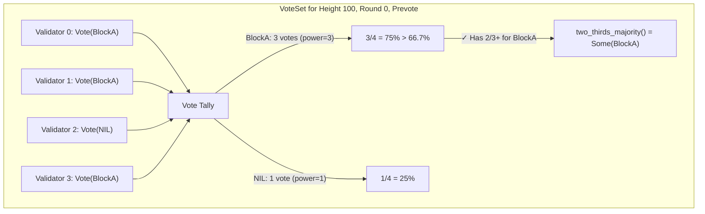
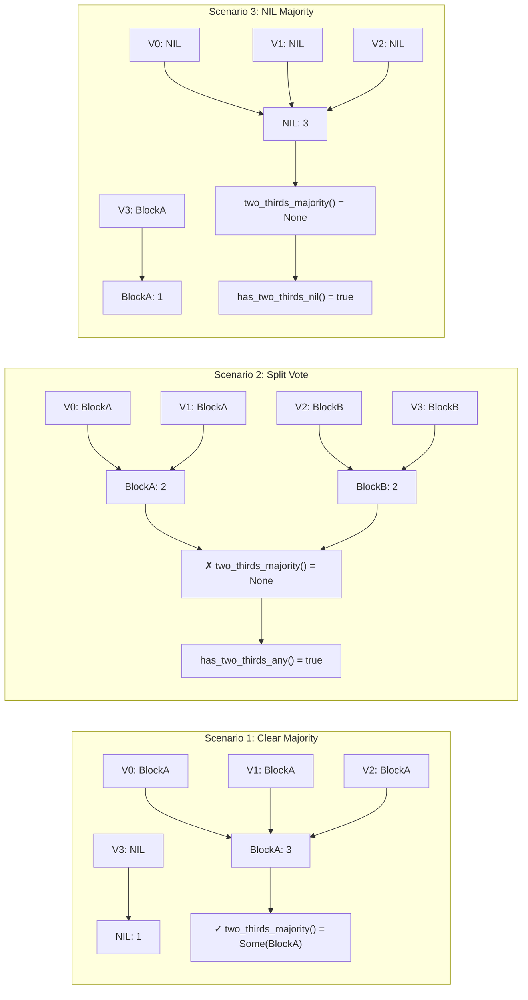

# Implementation Plan: Vote Set Management

## Overview

This document provides a comprehensive implementation guide for Tendermint vote collection and threshold detection. The VoteSet is responsible for tracking votes from validators and determining when 2/3+ thresholds are reached.

**Estimated Effort**: 1 week
**Dependencies**:
- `01_MESSAGE_TYPES_AND_PROTOCOL_FOUNDATION.md`:
  - Core types: `Vote`, `VoteType`, `ValidatorSet`, `ValidatorId`, `BlockHash`
  - Commit types: `Commit`, `CommitSig`, `BlockIDFlag`
  - Type aliases: `Height`, `Round`, `VotingPower`
**Files to Create**:
- `app/src/actors_v2/chain/tendermint/vote_set.rs`

**Important Design Note**: VoteSets are created fresh at the start of each height, after any pending governance updates (validator set changes) have been applied. This ensures the VoteSet always references the correct validator set for that height.

---

## 1. Conceptual Foundation

### 1.1 Vote Collection Model



### 1.2 Threshold Calculations

For a validator set with total power `P`:
- **2/3+ threshold**: `(P * 2 / 3) + 1`
- **has_two_thirds_any()**: Total votes collected >= threshold
- **has_two_thirds_for(block)**: Votes for specific block >= threshold
- **two_thirds_majority()**: Returns block if any block has 2/3+

| Total Power | 2/3 Threshold | Min Validators Needed |
|-------------|---------------|----------------------|
| 4 | 3 | 3 |
| 10 | 7 | 7 |
| 15 | 11 | 11 |
| 100 | 67 | 67 |

---

## 2. Complete Implementation

### 2.1 VoteSet Structure

```rust
//! Vote set management for Tendermint consensus.
//!
//! This module handles vote collection and threshold detection for
//! both prevotes and precommits. It tracks voting power per validator
//! and per block hash.
//!
//! # Thread Safety
//!
//! VoteSet is designed to be used within `Arc<RwLock<VoteSet>>` for
//! async-safe concurrent access. Read operations (threshold checks)
//! use read locks, write operations (adding votes) use write locks.

use super::types::*;
use super::messages::Vote;
use std::collections::{HashMap, HashSet};
use std::sync::Arc;
use tracing::{debug, warn};

/// Errors that can occur during vote operations
#[derive(Debug, Clone, thiserror::Error)]
pub enum VoteError {
    #[error("Duplicate vote from validator {validator} (already voted for {existing:?})")]
    DuplicateVote {
        validator: ValidatorId,
        existing: Option<BlockHash>,
    },

    #[error("Unknown validator: {0}")]
    UnknownValidator(ValidatorId),

    #[error("Vote height mismatch: expected {expected}, got {actual}")]
    HeightMismatch { expected: Height, actual: Height },

    #[error("Vote round mismatch: expected {expected}, got {actual}")]
    RoundMismatch { expected: Round, actual: Round },

    #[error("Vote type mismatch: expected {expected:?}, got {actual:?}")]
    TypeMismatch { expected: VoteType, actual: VoteType },

    #[error("Invalid vote signature")]
    InvalidSignature,
}

/// Collection of votes for a specific (height, round, vote_type)
///
/// VoteSet maintains:
/// - Individual votes from each validator
/// - Voting power tallies per block hash
/// - Total collected voting power
/// - Threshold calculations
///
/// # Vote Timestamp Requirement
///
/// The `Vote` struct (defined in `01_MESSAGE_TYPES_AND_PROTOCOL_FOUNDATION.md`)
/// must include a `timestamp` field for CommitSig creation:
///
/// ```rust,ignore
/// pub struct Vote {
///     pub height: Height,
///     pub round: Round,
///     pub vote_type: VoteType,
///     pub block_hash: Option<BlockHash>,
///     pub validator: ValidatorId,
///     pub timestamp: u64,  // Unix timestamp when vote was cast
///     pub signature: BLSSignature,
/// }
/// ```
///
/// The timestamp is recorded in the CommitSig when building commit proofs.
///
/// # Example
///
/// ```rust,ignore
/// let validator_set = Arc::new(ValidatorSet::with_equal_power(authorities));
/// let mut vote_set = VoteSet::new(100, 0, VoteType::Prevote, validator_set);
///
/// // Add votes
/// vote_set.add_vote(vote1)?;
/// vote_set.add_vote(vote2)?;
/// vote_set.add_vote(vote3)?;
///
/// // Check thresholds
/// if vote_set.has_two_thirds_any() {
///     if let Some(block_hash) = vote_set.two_thirds_majority() {
///         println!("Consensus reached for block: {:?}", block_hash);
///     }
/// }
/// ```
#[derive(Debug)]
pub struct VoteSet {
    // ═══════════════════════════════════════════════════════════════════
    // IDENTITY - What votes does this set collect?
    // ═══════════════════════════════════════════════════════════════════

    /// Block height this vote set is for
    pub height: Height,

    /// Round within the height
    pub round: Round,

    /// Type of votes (Prevote or Precommit)
    pub vote_type: VoteType,

    // ═══════════════════════════════════════════════════════════════════
    // VALIDATOR SET - Who can vote?
    // ═══════════════════════════════════════════════════════════════════

    /// Reference to the validator set for power lookups
    validator_set: Arc<ValidatorSet>,

    /// Total voting power in the validator set (cached)
    total_power: VotingPower,

    // ═══════════════════════════════════════════════════════════════════
    // VOTE STORAGE - What votes have we received?
    // ═══════════════════════════════════════════════════════════════════

    /// Individual votes indexed by validator ID
    /// Each validator can vote at most once
    votes: HashMap<ValidatorId, Vote>,

    /// Set of validators who have voted (for quick duplicate check)
    voters: HashSet<ValidatorId>,

    // ═══════════════════════════════════════════════════════════════════
    // POWER TALLIES - How much power for each block?
    // ═══════════════════════════════════════════════════════════════════

    /// Voting power collected per block hash
    /// None key represents NIL votes
    power_by_block: HashMap<Option<BlockHash>, VotingPower>,

    /// Total voting power collected (across all blocks)
    collected_power: VotingPower,
}

impl VoteSet {
    /// Create a new empty vote set
    ///
    /// # Arguments
    ///
    /// * `height` - Block height for this vote set
    /// * `round` - Round number within the height
    /// * `vote_type` - Whether this collects prevotes or precommits
    /// * `validator_set` - The validator set for power lookups
    pub fn new(
        height: Height,
        round: Round,
        vote_type: VoteType,
        validator_set: Arc<ValidatorSet>,
    ) -> Self {
        let total_power = validator_set.total_power();

        Self {
            height,
            round,
            vote_type,
            validator_set,
            total_power,
            votes: HashMap::new(),
            voters: HashSet::new(),
            power_by_block: HashMap::new(),
            collected_power: 0,
        }
    }

    /// Add a vote to this set
    ///
    /// Returns `Ok(true)` if the vote was new, `Ok(false)` if it was a duplicate
    /// (same validator, same block). Returns an error for conflicting votes.
    ///
    /// # Validation
    ///
    /// This method validates:
    /// - Height/round/type match
    /// - Validator is in the validator set
    /// - No conflicting vote from the same validator
    ///
    /// Signature verification should be done BEFORE calling this method.
    ///
    /// # Example
    ///
    /// ```rust,ignore
    /// // First vote from validator 0
    /// assert!(vote_set.add_vote(vote_from_v0.clone())?);
    ///
    /// // Duplicate vote (same content) is ignored
    /// assert!(!vote_set.add_vote(vote_from_v0.clone())?);
    ///
    /// // Conflicting vote (different block) is an error
    /// let conflicting = vote_set.add_vote(conflicting_vote_from_v0);
    /// assert!(conflicting.is_err());
    /// ```
    pub fn add_vote(&mut self, vote: Vote) -> Result<bool, VoteError> {
        // Validate height
        if vote.height != self.height {
            return Err(VoteError::HeightMismatch {
                expected: self.height,
                actual: vote.height,
            });
        }

        // Validate round
        if vote.round != self.round {
            return Err(VoteError::RoundMismatch {
                expected: self.round,
                actual: vote.round,
            });
        }

        // Validate vote type
        if vote.vote_type != self.vote_type {
            return Err(VoteError::TypeMismatch {
                expected: self.vote_type,
                actual: vote.vote_type,
            });
        }

        // Check if validator is in the set and get their power
        let power = self.validator_set
            .get_power(&vote.validator)
            .map_err(|_| VoteError::UnknownValidator(vote.validator))?;

        // Check for duplicate or conflicting vote
        if let Some(existing) = self.votes.get(&vote.validator) {
            if existing.block_hash == vote.block_hash {
                // Exact duplicate - ignore silently
                return Ok(false);
            } else {
                // Conflicting vote - this is evidence of equivocation!
                return Err(VoteError::DuplicateVote {
                    validator: vote.validator,
                    existing: existing.block_hash,
                });
            }
        }

        // Add the vote
        debug!(
            height = self.height,
            round = self.round,
            vote_type = ?self.vote_type,
            validator = %vote.validator,
            block_hash = ?vote.block_hash,
            power = power,
            "Adding vote to set"
        );

        // Update power tallies
        *self.power_by_block
            .entry(vote.block_hash)
            .or_insert(0) += power;

        self.collected_power += power;

        // Store the vote
        self.voters.insert(vote.validator);
        self.votes.insert(vote.validator, vote);

        Ok(true)
    }

    // ═══════════════════════════════════════════════════════════════════
    // THRESHOLD QUERIES
    // ═══════════════════════════════════════════════════════════════════

    /// Calculate the 2/3+ threshold
    ///
    /// For safety, Tendermint requires strictly greater than 2/3:
    /// `threshold = floor(total * 2 / 3) + 1`
    pub fn two_thirds_threshold(&self) -> VotingPower {
        (self.total_power * 2 / 3) + 1
    }

    /// Check if we have 2/3+ votes (for any block)
    ///
    /// This is used to determine if we can proceed to the next step,
    /// regardless of whether there's a majority for a specific block.
    ///
    /// # Example
    ///
    /// ```rust,ignore
    /// if vote_set.has_two_thirds_any() {
    ///     // Can proceed to next phase
    ///     match vote_set.two_thirds_majority() {
    ///         Some(hash) => println!("Majority for block: {:?}", hash),
    ///         None => println!("2/3+ votes but split among blocks"),
    ///     }
    /// }
    /// ```
    pub fn has_two_thirds_any(&self) -> bool {
        self.collected_power >= self.two_thirds_threshold()
    }

    /// Check if a specific block has 2/3+ votes
    ///
    /// # Arguments
    ///
    /// * `block_hash` - The block to check (None for NIL)
    pub fn has_two_thirds_for(&self, block_hash: Option<&BlockHash>) -> bool {
        let key = block_hash.copied();
        self.power_by_block
            .get(&key)
            .map(|&power| power >= self.two_thirds_threshold())
            .unwrap_or(false)
    }

    /// Get the block hash that has 2/3+ votes, if any
    ///
    /// Returns:
    /// - `Some(hash)` if a specific block has 2/3+
    /// - `None` if no block has 2/3+ (even if total votes >= 2/3)
    ///
    /// Note: NIL votes (block_hash = None) are tracked separately.
    /// This method only returns `Some` for actual block hashes.
    pub fn two_thirds_majority(&self) -> Option<BlockHash> {
        let threshold = self.two_thirds_threshold();

        for (block_hash, &power) in &self.power_by_block {
            if power >= threshold {
                if let Some(hash) = block_hash {
                    return Some(*hash);
                }
                // If NIL has 2/3+, we don't return it as a "majority"
                // The caller should check has_two_thirds_for(None) separately
            }
        }

        None
    }

    /// Check if NIL votes have 2/3+
    pub fn has_two_thirds_nil(&self) -> bool {
        self.has_two_thirds_for(None)
    }

    // ═══════════════════════════════════════════════════════════════════
    // STATISTICS
    // ═══════════════════════════════════════════════════════════════════

    /// Get the number of votes collected
    pub fn vote_count(&self) -> usize {
        self.votes.len()
    }

    /// Get the total voting power collected
    pub fn collected_power(&self) -> VotingPower {
        self.collected_power
    }

    /// Get the total voting power in the validator set
    pub fn total_power(&self) -> VotingPower {
        self.total_power
    }

    /// Get voting power for a specific block
    pub fn power_for(&self, block_hash: Option<&BlockHash>) -> VotingPower {
        let key = block_hash.copied();
        *self.power_by_block.get(&key).unwrap_or(&0)
    }

    /// Get the percentage of power collected (0-100)
    pub fn collected_percentage(&self) -> u8 {
        if self.total_power == 0 {
            return 0;
        }
        ((self.collected_power * 100) / self.total_power) as u8
    }

    /// Check if a validator has already voted
    pub fn has_voted(&self, validator: &ValidatorId) -> bool {
        self.voters.contains(validator)
    }

    /// Get a validator's vote (if any)
    pub fn get_vote_by_validator(&self, validator: &ValidatorId) -> Option<&Vote> {
        self.votes.get(validator)
    }

    /// Get a validator's vote if it matches the specified block_hash
    ///
    /// This is used when building CommitSig arrays where we need to check
    /// if a validator voted for a specific block (or NIL).
    ///
    /// # Arguments
    ///
    /// * `validator` - The validator to check
    /// * `block_hash` - The block hash to match (None for NIL votes)
    ///
    /// # Returns
    ///
    /// The vote if the validator voted for the specified block, None otherwise
    pub fn get_vote(
        &self,
        validator: &ValidatorId,
        block_hash: Option<BlockHash>,
    ) -> Option<&Vote> {
        self.votes.get(validator).filter(|v| v.block_hash == block_hash)
    }

    /// Iterate over all votes
    pub fn iter_votes(&self) -> impl Iterator<Item = &Vote> {
        self.votes.values()
    }

    /// Get all votes for a specific block
    pub fn votes_for(&self, block_hash: Option<BlockHash>) -> Vec<&Vote> {
        self.votes
            .values()
            .filter(|v| v.block_hash == block_hash)
            .collect()
    }

    // ═══════════════════════════════════════════════════════════════════
    // COMMIT PROOF BUILDING
    // ═══════════════════════════════════════════════════════════════════

    /// Build CommitSig array for creating a Commit proof
    ///
    /// This is used after 2/3+ precommits to create the finality proof.
    /// The resulting Vec<CommitSig> has one entry per validator in the
    /// validator set, in the same order.
    ///
    /// # Arguments
    ///
    /// * `block_hash` - The block that was committed
    ///
    /// # Returns
    ///
    /// A Vec<CommitSig> with one entry per validator:
    /// - `BlockIDFlag::Commit` if they precommitted for this block
    /// - `BlockIDFlag::Nil` if they precommitted nil
    /// - `BlockIDFlag::Absent` if they didn't precommit
    ///
    /// # Example
    ///
    /// ```rust,ignore
    /// let signatures = precommit_set.build_commit_sigs(block_hash);
    /// let commit = Commit::new(height, round, block_hash, signatures);
    /// ```
    pub fn build_commit_sigs(&self, block_hash: BlockHash) -> Vec<CommitSig> {
        (0..self.validator_set.len())
            .map(|i| {
                let validator_id = ValidatorId::new(i as u8);

                // Check if validator precommitted for this block
                if let Some(vote) = self.get_vote(&validator_id, Some(block_hash)) {
                    return CommitSig {
                        block_id_flag: BlockIDFlag::Commit,
                        validator_address: Some(validator_id),
                        timestamp: vote.timestamp,
                        signature: Some(vote.signature.clone()),
                    };
                }

                // Check if validator precommitted nil
                if let Some(vote) = self.get_vote(&validator_id, None) {
                    return CommitSig {
                        block_id_flag: BlockIDFlag::Nil,
                        validator_address: Some(validator_id),
                        timestamp: vote.timestamp,
                        signature: Some(vote.signature.clone()),
                    };
                }

                // Validator was absent (didn't precommit)
                CommitSig::absent()
            })
            .collect()
    }

    /// Create an aggregate signature from all votes for a specific block
    ///
    /// This is an alternative to build_commit_sigs() for systems that use
    /// BLS signature aggregation instead of individual signatures.
    ///
    /// # Returns
    ///
    /// A tuple of (aggregate_signature, signers_bitfield)
    pub fn aggregate_for(
        &self,
        block_hash: BlockHash,
    ) -> Option<(AggregateSignature, Vec<bool>)> {
        let votes: Vec<_> = self.votes_for(Some(block_hash));

        if votes.is_empty() {
            return None;
        }

        // Create signers bitfield
        let mut signers = vec![false; self.validator_set.len()];
        for vote in &votes {
            signers[vote.validator.index() as usize] = true;
        }

        // Aggregate signatures
        let mut aggregate = AggregateSignature::infinity();
        for vote in votes {
            aggregate.add_assign(&vote.signature);
        }

        Some((aggregate, signers))
    }

    /// Get summary for logging
    pub fn summary(&self) -> VoteSetSummary {
        VoteSetSummary {
            height: self.height,
            round: self.round,
            vote_type: self.vote_type,
            collected: self.collected_power,
            total: self.total_power,
            threshold: self.two_thirds_threshold(),
            has_majority: self.two_thirds_majority().is_some(),
        }
    }
}

/// Summary of vote set state for logging/metrics
#[derive(Debug, Clone)]
pub struct VoteSetSummary {
    pub height: Height,
    pub round: Round,
    pub vote_type: VoteType,
    pub collected: VotingPower,
    pub total: VotingPower,
    pub threshold: VotingPower,
    pub has_majority: bool,
}

impl std::fmt::Display for VoteSetSummary {
    fn fmt(&self, f: &mut std::fmt::Formatter<'_>) -> std::fmt::Result {
        write!(
            f,
            "VoteSet(H={} R={} {:?}): {}/{} (need {}){}",
            self.height,
            self.round,
            self.vote_type,
            self.collected,
            self.total,
            self.threshold,
            if self.has_majority { " [MAJORITY]" } else { "" }
        )
    }
}
```

---

## 3. Example Flows

### 3.1 Collecting Prevotes Until Threshold

```rust
// Example: Processing incoming prevotes

async fn process_prevotes(
    vote_set: &mut VoteSet,
    votes: Vec<Vote>,
) -> Option<ConsensusEvent> {
    for vote in votes {
        // Validate signature first
        let pubkey = vote_set.validator_set.get_public_key(&vote.validator)?;
        if !vote.verify_signature(pubkey) {
            warn!("Invalid signature on vote from {:?}", vote.validator);
            continue;
        }

        // Add to vote set
        match vote_set.add_vote(vote.clone()) {
            Ok(true) => {
                // New vote added
                println!(
                    "Vote from {} for {:?}. Progress: {}/{}",
                    vote.validator,
                    vote.block_hash,
                    vote_set.collected_power(),
                    vote_set.total_power()
                );
            }
            Ok(false) => {
                // Duplicate vote, already had it
            }
            Err(VoteError::DuplicateVote { validator, existing }) => {
                // EQUIVOCATION DETECTED!
                // Validator voted for a different block previously
                warn!(
                    "Equivocation: {} voted for {:?} after voting for {:?}",
                    validator, vote.block_hash, existing
                );
                // Create and broadcast evidence
            }
            Err(e) => {
                warn!("Vote error: {}", e);
            }
        }

        // Check if threshold reached
        if vote_set.has_two_thirds_any() {
            let majority = vote_set.two_thirds_majority();
            return Some(ConsensusEvent::TwoThirdsPrevotes(majority));
        }
    }

    None // Threshold not yet reached
}
```

### 3.2 Creating Commit Proof After Precommits

```rust
// Example: Creating a Commit after 2/3+ precommits
//
// This follows the Tendermint/CometBFT pattern where the Commit contains
// one CommitSig per validator in the validator set.

fn create_commit(
    vote_set: &VoteSet,
    block_hash: BlockHash,
) -> Result<Commit, CommitError> {
    // Verify we have 2/3+ for this block
    if !vote_set.has_two_thirds_for(Some(&block_hash)) {
        return Err(CommitError::InsufficientVotes {
            have: vote_set.power_for(Some(&block_hash)),
            need: vote_set.two_thirds_threshold(),
        });
    }

    // Build CommitSig array - one entry per validator
    let signatures = vote_set.build_commit_sigs(block_hash);

    // Create the Commit proof
    let commit = Commit::new(
        vote_set.height,
        vote_set.round,
        block_hash,
        signatures,
    );

    // Verify the commit has sufficient signatures
    if !commit.has_sufficient_signatures(vote_set.validator_set.len()) {
        return Err(CommitError::InsufficientSignatures {
            have: commit.num_commit_signatures(),
            need: vote_set.two_thirds_threshold() as usize,
        });
    }

    Ok(commit)
}

#[derive(Debug, thiserror::Error)]
pub enum CommitError {
    #[error("Insufficient votes: have {have}, need {need}")]
    InsufficientVotes { have: VotingPower, need: VotingPower },

    #[error("Insufficient signatures: have {have}, need {need}")]
    InsufficientSignatures { have: usize, need: usize },
}
```

### 3.3 Vote Distribution Scenarios



---

## 4. Integration with State Machine

### 4.1 State Machine Uses VoteSet

```rust
// In state_machine.rs

impl TendermintState {
    /// Check prevote thresholds and trigger appropriate events
    pub async fn check_prevote_threshold(&mut self) -> Option<ConsensusEvent> {
        let prevotes = self.prevotes.read().await;

        if prevotes.has_two_thirds_any() {
            let majority = prevotes.two_thirds_majority();
            return Some(ConsensusEvent::TwoThirdsPrevotes(majority));
        }

        None
    }

    /// Check precommit thresholds
    pub async fn check_precommit_threshold(&mut self) -> Option<ConsensusEvent> {
        let precommits = self.precommits.read().await;

        if precommits.has_two_thirds_any() {
            let majority = precommits.two_thirds_majority();
            return Some(ConsensusEvent::TwoThirdsPrecommits(majority));
        }

        None
    }

    /// Add a vote and check for threshold crossing
    pub async fn add_vote(&mut self, vote: Vote) -> Result<Option<ConsensusEvent>, VoteError> {
        match vote.vote_type {
            VoteType::Prevote => {
                let mut prevotes = self.prevotes.write().await;
                let is_new = prevotes.add_vote(vote)?;

                if is_new && prevotes.has_two_thirds_any() {
                    let majority = prevotes.two_thirds_majority();
                    return Ok(Some(ConsensusEvent::TwoThirdsPrevotes(majority)));
                }
            }
            VoteType::Precommit => {
                let mut precommits = self.precommits.write().await;
                let is_new = precommits.add_vote(vote)?;

                if is_new && precommits.has_two_thirds_any() {
                    let majority = precommits.two_thirds_majority();
                    return Ok(Some(ConsensusEvent::TwoThirdsPrecommits(majority)));
                }
            }
        }

        Ok(None)
    }
}
```

### 4.2 Metrics Integration

```rust
// Add metrics for vote set progress

use prometheus::{IntGauge, IntGaugeVec, Opts, Registry};

lazy_static! {
    static ref TENDERMINT_PREVOTE_POWER: IntGauge = IntGauge::new(
        "tendermint_prevote_power",
        "Total voting power collected in current prevote set"
    ).unwrap();

    static ref TENDERMINT_PRECOMMIT_POWER: IntGauge = IntGauge::new(
        "tendermint_precommit_power",
        "Total voting power collected in current precommit set"
    ).unwrap();

    static ref TENDERMINT_VOTES_BY_BLOCK: IntGaugeVec = IntGaugeVec::new(
        Opts::new("tendermint_votes_by_block", "Voting power per block hash"),
        &["vote_type", "block_hash"]
    ).unwrap();
}

impl VoteSet {
    /// Update metrics after adding a vote
    fn update_metrics(&self) {
        let metric = match self.vote_type {
            VoteType::Prevote => &TENDERMINT_PREVOTE_POWER,
            VoteType::Precommit => &TENDERMINT_PRECOMMIT_POWER,
        };
        metric.set(self.collected_power as i64);

        // Update per-block metrics
        for (block_hash, &power) in &self.power_by_block {
            let hash_str = match block_hash {
                Some(h) => format!("{:?}", h),
                None => "NIL".to_string(),
            };
            TENDERMINT_VOTES_BY_BLOCK
                .with_label_values(&[&format!("{:?}", self.vote_type), &hash_str])
                .set(power as i64);
        }
    }
}
```

---

## 5. Testing Strategy

### 5.1 Unit Tests

```rust
#[cfg(test)]
mod tests {
    use super::*;

    fn create_test_validator_set(count: usize) -> Arc<ValidatorSet> {
        let validators = vec![PublicKey::default(); count];
        Arc::new(ValidatorSet::with_equal_power(validators))
    }

    fn create_test_vote(
        validator: u8,
        block_hash: Option<BlockHash>,
        vote_type: VoteType,
    ) -> Vote {
        Vote {
            height: 100,
            round: 0,
            vote_type,
            block_hash,
            validator: ValidatorId(validator),
            timestamp: 1704067200, // Fixed timestamp for deterministic tests
            signature: BLSSignature::empty(),
        }
    }

    #[test]
    fn test_threshold_calculation() {
        // 15 validators, equal power
        let set = create_test_validator_set(15);
        let vote_set = VoteSet::new(100, 0, VoteType::Prevote, set);

        // 2/3 of 15 = 10, threshold = 11
        assert_eq!(vote_set.total_power(), 15);
        assert_eq!(vote_set.two_thirds_threshold(), 11);
    }

    #[test]
    fn test_has_two_thirds_any() {
        let set = create_test_validator_set(4);
        let mut vote_set = VoteSet::new(100, 0, VoteType::Prevote, set);

        // Threshold for 4 validators: (4 * 2 / 3) + 1 = 3
        assert_eq!(vote_set.two_thirds_threshold(), 3);

        // Add 2 votes - not enough
        let block = BlockHash::repeat_byte(0xAB);
        vote_set.add_vote(create_test_vote(0, Some(block), VoteType::Prevote)).unwrap();
        vote_set.add_vote(create_test_vote(1, Some(block), VoteType::Prevote)).unwrap();
        assert!(!vote_set.has_two_thirds_any());

        // Add 3rd vote - now have 2/3+
        vote_set.add_vote(create_test_vote(2, Some(block), VoteType::Prevote)).unwrap();
        assert!(vote_set.has_two_thirds_any());
        assert_eq!(vote_set.two_thirds_majority(), Some(block));
    }

    #[test]
    fn test_split_vote_no_majority() {
        let set = create_test_validator_set(4);
        let mut vote_set = VoteSet::new(100, 0, VoteType::Prevote, set);

        let block_a = BlockHash::repeat_byte(0xAA);
        let block_b = BlockHash::repeat_byte(0xBB);

        // 2 votes for A, 2 votes for B
        vote_set.add_vote(create_test_vote(0, Some(block_a), VoteType::Prevote)).unwrap();
        vote_set.add_vote(create_test_vote(1, Some(block_a), VoteType::Prevote)).unwrap();
        vote_set.add_vote(create_test_vote(2, Some(block_b), VoteType::Prevote)).unwrap();
        vote_set.add_vote(create_test_vote(3, Some(block_b), VoteType::Prevote)).unwrap();

        // Have all votes but no majority
        assert!(vote_set.has_two_thirds_any()); // All 4 votes = 100%
        assert!(vote_set.two_thirds_majority().is_none()); // Split 50/50
    }

    #[test]
    fn test_nil_votes() {
        let set = create_test_validator_set(4);
        let mut vote_set = VoteSet::new(100, 0, VoteType::Prevote, set);

        // 3 NIL votes
        vote_set.add_vote(create_test_vote(0, None, VoteType::Prevote)).unwrap();
        vote_set.add_vote(create_test_vote(1, None, VoteType::Prevote)).unwrap();
        vote_set.add_vote(create_test_vote(2, None, VoteType::Prevote)).unwrap();

        assert!(vote_set.has_two_thirds_any());
        assert!(vote_set.has_two_thirds_nil());
        assert!(vote_set.two_thirds_majority().is_none()); // NIL doesn't count as majority
    }

    #[test]
    fn test_duplicate_vote_ignored() {
        let set = create_test_validator_set(4);
        let mut vote_set = VoteSet::new(100, 0, VoteType::Prevote, set);

        let block = BlockHash::repeat_byte(0xAB);
        let vote = create_test_vote(0, Some(block), VoteType::Prevote);

        assert!(vote_set.add_vote(vote.clone()).unwrap()); // First vote - new
        assert!(!vote_set.add_vote(vote.clone()).unwrap()); // Duplicate - ignored
        assert_eq!(vote_set.vote_count(), 1);
    }

    #[test]
    fn test_conflicting_vote_error() {
        let set = create_test_validator_set(4);
        let mut vote_set = VoteSet::new(100, 0, VoteType::Prevote, set);

        let block_a = BlockHash::repeat_byte(0xAA);
        let block_b = BlockHash::repeat_byte(0xBB);

        vote_set.add_vote(create_test_vote(0, Some(block_a), VoteType::Prevote)).unwrap();

        // Same validator, different block = error (equivocation)
        let result = vote_set.add_vote(create_test_vote(0, Some(block_b), VoteType::Prevote));
        assert!(matches!(result, Err(VoteError::DuplicateVote { .. })));
    }

    #[test]
    fn test_wrong_height_rejected() {
        let set = create_test_validator_set(4);
        let mut vote_set = VoteSet::new(100, 0, VoteType::Prevote, set);

        let wrong_height_vote = Vote {
            height: 99, // Wrong!
            round: 0,
            vote_type: VoteType::Prevote,
            block_hash: Some(BlockHash::repeat_byte(0xAB)),
            validator: ValidatorId(0),
            timestamp: 1704067200,
            signature: BLSSignature::empty(),
        };

        let result = vote_set.add_vote(wrong_height_vote);
        assert!(matches!(result, Err(VoteError::HeightMismatch { .. })));
    }

    #[test]
    fn test_aggregate_signatures() {
        let set = create_test_validator_set(4);
        let mut vote_set = VoteSet::new(100, 0, VoteType::Precommit, set);

        let block = BlockHash::repeat_byte(0xAB);

        vote_set.add_vote(create_test_vote(0, Some(block), VoteType::Precommit)).unwrap();
        vote_set.add_vote(create_test_vote(1, Some(block), VoteType::Precommit)).unwrap();
        vote_set.add_vote(create_test_vote(2, Some(block), VoteType::Precommit)).unwrap();

        let (_, signers) = vote_set.aggregate_for(block).unwrap();
        assert_eq!(signers, vec![true, true, true, false]);
    }

    #[test]
    fn test_build_commit_sigs() {
        let set = create_test_validator_set(4);
        let mut vote_set = VoteSet::new(100, 0, VoteType::Precommit, set);

        let block = BlockHash::repeat_byte(0xAB);

        // V0 and V1 vote for block, V2 votes NIL, V3 is absent
        vote_set.add_vote(create_test_vote(0, Some(block), VoteType::Precommit)).unwrap();
        vote_set.add_vote(create_test_vote(1, Some(block), VoteType::Precommit)).unwrap();
        vote_set.add_vote(create_test_vote(2, None, VoteType::Precommit)).unwrap();
        // V3 doesn't vote

        let commit_sigs = vote_set.build_commit_sigs(block);

        assert_eq!(commit_sigs.len(), 4);

        // V0: Committed
        assert_eq!(commit_sigs[0].block_id_flag, BlockIDFlag::Commit);
        assert_eq!(commit_sigs[0].validator_address, Some(ValidatorId(0)));
        assert!(commit_sigs[0].signature.is_some());

        // V1: Committed
        assert_eq!(commit_sigs[1].block_id_flag, BlockIDFlag::Commit);
        assert_eq!(commit_sigs[1].validator_address, Some(ValidatorId(1)));

        // V2: Voted NIL
        assert_eq!(commit_sigs[2].block_id_flag, BlockIDFlag::Nil);
        assert_eq!(commit_sigs[2].validator_address, Some(ValidatorId(2)));

        // V3: Absent
        assert_eq!(commit_sigs[3].block_id_flag, BlockIDFlag::Absent);
        assert_eq!(commit_sigs[3].validator_address, None);
        assert!(commit_sigs[3].signature.is_none());
    }

    #[test]
    fn test_get_vote_with_block_hash_filter() {
        let set = create_test_validator_set(4);
        let mut vote_set = VoteSet::new(100, 0, VoteType::Prevote, set);

        let block_a = BlockHash::repeat_byte(0xAA);
        let block_b = BlockHash::repeat_byte(0xBB);

        vote_set.add_vote(create_test_vote(0, Some(block_a), VoteType::Prevote)).unwrap();
        vote_set.add_vote(create_test_vote(1, None, VoteType::Prevote)).unwrap(); // NIL

        // get_vote with matching block_hash returns the vote
        assert!(vote_set.get_vote(&ValidatorId(0), Some(block_a)).is_some());

        // get_vote with non-matching block_hash returns None
        assert!(vote_set.get_vote(&ValidatorId(0), Some(block_b)).is_none());
        assert!(vote_set.get_vote(&ValidatorId(0), None).is_none());

        // get_vote for NIL voter
        assert!(vote_set.get_vote(&ValidatorId(1), None).is_some());
        assert!(vote_set.get_vote(&ValidatorId(1), Some(block_a)).is_none());

        // get_vote_by_validator returns vote regardless of block_hash
        assert!(vote_set.get_vote_by_validator(&ValidatorId(0)).is_some());
        assert!(vote_set.get_vote_by_validator(&ValidatorId(1)).is_some());
    }

    #[test]
    fn test_power_tracking() {
        let set = create_test_validator_set(4);
        let mut vote_set = VoteSet::new(100, 0, VoteType::Prevote, set);

        let block_a = BlockHash::repeat_byte(0xAA);
        let block_b = BlockHash::repeat_byte(0xBB);

        vote_set.add_vote(create_test_vote(0, Some(block_a), VoteType::Prevote)).unwrap();
        vote_set.add_vote(create_test_vote(1, Some(block_a), VoteType::Prevote)).unwrap();
        vote_set.add_vote(create_test_vote(2, Some(block_b), VoteType::Prevote)).unwrap();

        assert_eq!(vote_set.power_for(Some(&block_a)), 2);
        assert_eq!(vote_set.power_for(Some(&block_b)), 1);
        assert_eq!(vote_set.power_for(None), 0); // No NIL votes
        assert_eq!(vote_set.collected_power(), 3);
    }

    #[test]
    fn test_votes_for_block() {
        let set = create_test_validator_set(4);
        let mut vote_set = VoteSet::new(100, 0, VoteType::Prevote, set);

        let block = BlockHash::repeat_byte(0xAB);

        vote_set.add_vote(create_test_vote(0, Some(block), VoteType::Prevote)).unwrap();
        vote_set.add_vote(create_test_vote(1, Some(block), VoteType::Prevote)).unwrap();
        vote_set.add_vote(create_test_vote(2, None, VoteType::Prevote)).unwrap();

        let votes_for_block = vote_set.votes_for(Some(block));
        assert_eq!(votes_for_block.len(), 2);

        let nil_votes = vote_set.votes_for(None);
        assert_eq!(nil_votes.len(), 1);
    }
}
```

---

## 6. Checklist

### Core Implementation
- [ ] Create `vote_set.rs` with `VoteSet` structure
- [ ] Add `Arc` import for `Arc<ValidatorSet>`
- [ ] Implement `add_vote()` with validation
- [ ] Implement threshold queries (`has_two_thirds_any`, `two_thirds_majority`, etc.)
- [ ] Add `VoteError` enum

### Vote Retrieval
- [ ] Implement `get_vote_by_validator()` - returns vote regardless of block_hash
- [ ] Implement `get_vote(validator, block_hash)` - returns vote only if matches
- [ ] Implement `votes_for(block_hash)` - returns all votes for a block
- [ ] Implement `iter_votes()` - iterate all votes

### Commit Proof Building
- [ ] Implement `build_commit_sigs()` - creates `Vec<CommitSig>` for Commit
- [ ] Implement `aggregate_for()` - alternative BLS aggregation (optional)
- [ ] Add `CommitError` enum for commit creation failures

### Testing
- [ ] Write unit tests for threshold calculations
- [ ] Write unit tests for vote addition edge cases
- [ ] Write unit tests for `build_commit_sigs()`
- [ ] Write unit tests for `get_vote()` with block_hash filter
- [ ] Write unit tests for duplicate/conflicting votes

### Integration
- [ ] Add metrics integration
- [ ] Integrate with state machine (02_STATE_MACHINE.md)
- [ ] Integrate with ChainActor handlers (04_CHAINACTOR_HANDLERS.md)

### Documentation
- [ ] Ensure Vote struct includes `timestamp` field in doc 01
- [ ] Document validator set lifecycle (fresh VoteSet per height)

---

## 7. Next Steps

After completing this implementation:
1. Proceed to **04_CHAINACTOR_HANDLERS.md** - Handler integration
2. The handlers will use VoteSet for vote processing
3. Then implement network layer for vote broadcasting

---

*Implementation Plan Version: 2.0*
*Last Updated: February 2026*
*Changes: Added build_commit_sigs(), get_vote() with block_hash filter, Vote timestamp requirement, aligned with Commit/CommitSig structure*
