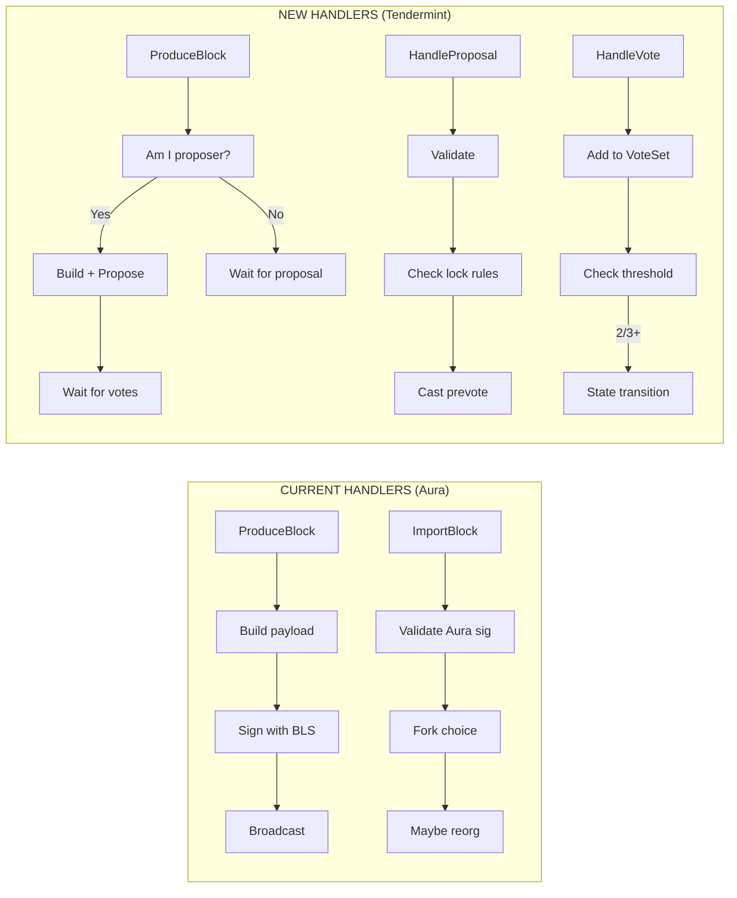
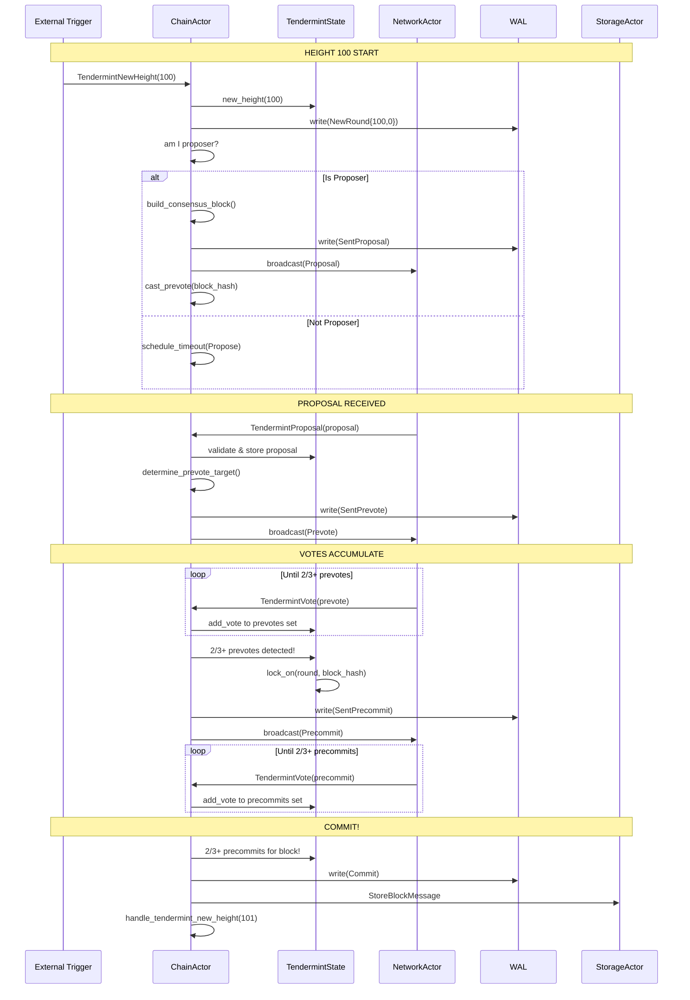

# Implementation Plan: ChainActor Handler Modifications

## Overview

This document provides a comprehensive implementation guide for modifying the ChainActor handlers to support Tendermint consensus. This is the largest single change and represents the integration point where all Tendermint components come together.

**Estimated Effort**: 3 weeks
**Dependencies**:
- `01_MESSAGE_TYPES_AND_PROTOCOL_FOUNDATION.md`
- `02_STATE_MACHINE.md`
- `03_VOTE_SET_MANAGEMENT.md`
**Files to Modify**:
- `app/src/actors_v2/chain/handlers.rs`
- `app/src/actors_v2/chain/actor.rs`
- `app/src/actors_v2/chain/messages.rs`
**Files to Create**:
- `app/src/actors_v2/chain/tendermint/handlers.rs`

---

## 1. Current vs New Handler Architecture

### 1.1 Handler Comparison



### 1.2 Handler Mapping

| Current Handler | Tendermint Replacement | Notes |
|-----------------|----------------------|-------|
| `ProduceBlock` | `HandleProposePhase` | Only runs when we're proposer |
| `ImportBlock` | `HandleProposal` + `HandleVote` | Split into consensus phases |
| Fork choice logic | **REMOVED** | No fork choice in Tendermint |
| Reorg logic | **REMOVED** | No reorgs in Tendermint |
| `BroadcastBlock` | `BroadcastProposal` | Sends proposal, not block |
| N/A (new) | `HandleTimeout` | Timeout handling |
| N/A (new) | `CommitBlock` | Finalization |

---

## 2. Message Additions

### 2.1 New ChainMessage Variants

```rust
// In messages.rs - Add these variants to ChainMessage enum

pub enum ChainMessage {
    // ═══════════════════════════════════════════════════════════════════
    // EXISTING MESSAGES (keep for V0 compatibility during transition)
    // ═══════════════════════════════════════════════════════════════════
    ProduceBlock { slot: u64, timestamp: Duration, correlation_id: Option<Uuid> },
    ImportBlock { block: SignedConsensusBlock, source: BlockSource, peer_id: Option<String> },
    GetChainStatus { correlation_id: Option<Uuid> },
    GetBlockByHeight { height: u64, correlation_id: Option<Uuid> },
    GetBlockByHash { hash: H256, correlation_id: Option<Uuid> },
    BroadcastBlock { block: SignedConsensusBlock, correlation_id: Option<Uuid> },
    // ... other existing messages ...

    // ═══════════════════════════════════════════════════════════════════
    // NEW TENDERMINT MESSAGES
    // ═══════════════════════════════════════════════════════════════════

    /// Trigger: Start of a new height's consensus
    /// Called when: New height begins (after commit or genesis)
    TendermintNewHeight {
        height: u64,
        correlation_id: Option<Uuid>,
    },

    /// Trigger: Start proposing for current round (if we're proposer)
    /// Called when: Round timer starts and we're the designated proposer
    TendermintPropose {
        height: u64,
        round: u32,
        correlation_id: Option<Uuid>,
    },

    /// Trigger: Received proposal from network
    /// Called when: NetworkActor receives Tendermint proposal message
    TendermintProposal {
        proposal: Proposal,
        peer_id: Option<String>,
        correlation_id: Option<Uuid>,
    },

    /// Trigger: Received vote from network
    /// Called when: NetworkActor receives Tendermint vote message
    TendermintVote {
        vote: Vote,
        peer_id: Option<String>,
        correlation_id: Option<Uuid>,
    },

    /// Trigger: Timeout expired for current step
    /// Called when: Timeout scheduler fires
    TendermintTimeout {
        height: u64,
        round: u32,
        step: TendermintStep,
        correlation_id: Option<Uuid>,
    },

    /// Trigger: Internal - Execute pending consensus actions
    /// Called when: After state transitions to process generated actions
    TendermintExecuteActions {
        actions: Vec<ConsensusAction>,
        correlation_id: Option<Uuid>,
    },
}
```

### 2.2 New ChainResponse Variants

```rust
// In messages.rs - Add these variants to ChainResponse enum

pub enum ChainResponse {
    // ... existing variants ...

    /// Tendermint action completed
    TendermintAction {
        action_type: TendermintActionType,
        height: u64,
        round: u32,
    },

    /// Block was committed through Tendermint consensus
    TendermintBlockCommitted {
        block_hash: H256,
        height: u64,
        round: u32,
    },

    /// New height started
    TendermintNewHeightStarted {
        height: u64,
    },
}

#[derive(Debug, Clone, Serialize, Deserialize)]
pub enum TendermintActionType {
    ProposalSent,
    ProposalReceived,
    PrevoteSent { block_hash: Option<H256> },
    PrecommitSent { block_hash: Option<H256> },
    RoundAdvanced { new_round: u32 },
    BlockCommitted { block_hash: H256 },
    TimeoutHandled { step: TendermintStep },
}
```

---

## 3. Handler Implementations

### 3.1 Handler Organization

Create a new file `app/src/actors_v2/chain/tendermint/handlers.rs`:

```rust
//! Tendermint consensus handlers for ChainActor.
//!
//! This module contains all handler logic for Tendermint consensus messages.
//! Handlers are organized by consensus phase:
//!
//! 1. Height Initialization (TendermintNewHeight)
//! 2. Propose Phase (TendermintPropose, TendermintProposal)
//! 3. Vote Phase (TendermintVote)
//! 4. Timeout Handling (TendermintTimeout)
//! 5. Action Execution (TendermintExecuteActions)

use super::*;
use crate::actors_v2::chain::tendermint::*;
use tracing::{debug, info, warn, error, instrument};

impl ChainActor {
    // ═══════════════════════════════════════════════════════════════════
    // HEIGHT INITIALIZATION
    // ═══════════════════════════════════════════════════════════════════

    /// Handle the start of a new height
    ///
    /// Called when:
    /// - After committing a block (advancing to next height)
    /// - At node startup (resuming from WAL)
    ///
    /// # Flow
    ///
    /// ```text
    /// TendermintNewHeight(H)
    ///   ├─ 1. Update state for height H
    ///   ├─ 2. Determine proposer for round 0
    ///   ├─ 3. If we're proposer: trigger TendermintPropose
    ///   └─ 4. Schedule propose timeout
    /// ```
    #[instrument(skip(self), fields(height = %height))]
    pub async fn handle_tendermint_new_height(
        &self,
        height: u64,
    ) -> Result<ChainResponse, ChainError> {
        info!(height, "Starting Tendermint consensus for new height");

        // 1. Initialize state for new height
        let validator_set = self.state.tendermint.validator_set.clone();
        self.state.tendermint.new_height(height, validator_set);

        // 2. Write to WAL
        {
            let mut wal = self.wal.write().await;
            wal.write(WALEntry::NewRound { height, round: 0 })?;
        }

        // 3. Check if we're the proposer
        let proposer = self.state.tendermint.current_proposer();
        let is_proposer = self.state.tendermint.is_proposer();

        debug!(
            height,
            proposer = %proposer,
            is_us = is_proposer,
            "Proposer for round 0"
        );

        if is_proposer {
            // We're the proposer - build and broadcast proposal
            self.handle_tendermint_propose(height, 0).await?;
        }

        // 4. Schedule propose timeout (even if we're proposer, in case we fail)
        self.schedule_timeout(TendermintStep::Propose);

        Ok(ChainResponse::TendermintNewHeightStarted { height })
    }

    // ═══════════════════════════════════════════════════════════════════
    // PROPOSE PHASE
    // ═══════════════════════════════════════════════════════════════════

    /// Handle our turn to propose
    ///
    /// Only called when we are the designated proposer for this round.
    ///
    /// # Flow
    ///
    /// ```text
    /// TendermintPropose(height, round)
    ///   ├─ 1. Verify we're the proposer
    ///   ├─ 2. Build block (reuse existing logic)
    ///   ├─ 3. Create and sign proposal
    ///   ├─ 4. Write to WAL
    ///   ├─ 5. Broadcast proposal
    ///   └─ 6. Self-prevote for our proposal
    /// ```
    #[instrument(skip(self), fields(height = %height, round = %round))]
    pub async fn handle_tendermint_propose(
        &self,
        height: u64,
        round: u32,
    ) -> Result<ChainResponse, ChainError> {
        // 1. Verify we're the proposer
        let expected_proposer = self.state.tendermint.validator_set.get_proposer(height, round);
        let our_id = self.state.tendermint.our_validator_id
            .ok_or(ChainError::NotValidator)?;

        if expected_proposer != our_id {
            warn!(
                height,
                round,
                expected = %expected_proposer,
                actual = %our_id,
                "Not the proposer for this round"
            );
            return Err(ChainError::NotProposer);
        }

        info!(height, round, "Building proposal as designated proposer");

        // 2. Build the block
        let block = self.build_consensus_block(height).await?;

        // 3. Create proposal with POL if locked
        let proposal = Proposal {
            height,
            round,
            block: block.message.clone(),
            pol_round: self.state.tendermint.locked_round,
            proposer: our_id,
            signature: self.sign_proposal(&block.message, height, round)?,
        };

        // 4. Write to WAL before broadcasting
        {
            let mut wal = self.wal.write().await;
            wal.write(WALEntry::SentProposal {
                height,
                round,
                block_hash: proposal.block_hash(),
            })?;
        }

        // 5. Broadcast proposal
        self.broadcast_tendermint_message(TendermintMessage::Proposal(proposal.clone())).await?;

        // 6. Store proposal and self-prevote
        self.state.tendermint.current_proposal = Some(proposal.clone());
        self.state.tendermint.set_step(TendermintStep::Prevote);

        // Cast our own prevote
        let block_hash = proposal.block_hash();
        self.cast_prevote(Some(block_hash)).await?;

        Ok(ChainResponse::TendermintAction {
            action_type: TendermintActionType::ProposalSent,
            height,
            round,
        })
    }

    /// Handle receiving a proposal from another validator
    ///
    /// # Flow
    ///
    /// ```text
    /// TendermintProposal(proposal)
    ///   ├─ 1. Validate height/round
    ///   ├─ 2. Verify proposer is correct
    ///   ├─ 3. Verify signature
    ///   ├─ 4. Validate block contents
    ///   ├─ 5. Apply locking rules
    ///   ├─ 6. Store proposal
    ///   ├─ 7. Transition to Prevote step
    ///   └─ 8. Cast prevote
    /// ```
    #[instrument(skip(self, proposal), fields(
        height = %proposal.height,
        round = %proposal.round,
        proposer = %proposal.proposer
    ))]
    pub async fn handle_tendermint_proposal(
        &self,
        proposal: Proposal,
        peer_id: Option<String>,
    ) -> Result<ChainResponse, ChainError> {
        let state = &self.state.tendermint;

        // 1. Validate height/round
        if proposal.height != state.height {
            debug!(
                expected = state.height,
                actual = proposal.height,
                "Proposal for different height, ignoring"
            );
            return Ok(ChainResponse::Success);
        }

        if proposal.round != state.round {
            debug!(
                expected = state.round,
                actual = proposal.round,
                "Proposal for different round, ignoring"
            );
            return Ok(ChainResponse::Success);
        }

        // Only process in Propose step
        if state.step != TendermintStep::Propose {
            debug!(
                current_step = ?state.step,
                "Proposal received in wrong step, may be duplicate"
            );
            return Ok(ChainResponse::Success);
        }

        // 2. Verify proposer
        let expected_proposer = state.current_proposer();
        if proposal.proposer != expected_proposer {
            warn!(
                expected = %expected_proposer,
                actual = %proposal.proposer,
                "Proposal from wrong proposer"
            );
            return Err(ChainError::InvalidProposer {
                expected: expected_proposer,
                actual: proposal.proposer,
            });
        }

        // 3. Verify signature
        let pubkey = state.validator_set.get_public_key(&proposal.proposer)
            .map_err(|e| ChainError::InvalidProposal(format!("Unknown proposer: {}", e)))?;

        if !proposal.verify_signature(pubkey) {
            warn!("Invalid signature on proposal");
            return Err(ChainError::InvalidProposalSignature);
        }

        info!(
            height = proposal.height,
            round = proposal.round,
            proposer = %proposal.proposer,
            block_hash = ?proposal.block_hash(),
            "Valid proposal received"
        );

        // 4. Validate block contents
        self.validate_proposal_block(&proposal.block).await?;

        // 5. Determine prevote based on locking rules
        let vote_target = self.determine_prevote_for_proposal(&proposal)?;

        // 6. Store proposal and transition state
        self.state.tendermint.current_proposal = Some(proposal.clone());
        self.state.tendermint.proposals.insert(
            (proposal.round, proposal.proposer),
            proposal.clone(),
        );
        self.state.tendermint.set_step(TendermintStep::Prevote);

        // 7. Cast prevote
        if self.state.tendermint.is_validator() {
            self.cast_prevote(vote_target).await?;
        }

        // 8. Schedule prevote timeout
        self.schedule_timeout(TendermintStep::Prevote);

        Ok(ChainResponse::TendermintAction {
            action_type: TendermintActionType::ProposalReceived,
            height: proposal.height,
            round: proposal.round,
        })
    }

    /// Determine what to prevote for based on locking rules
    ///
    /// # Locking Rules (Critical for Safety!)
    ///
    /// 1. Not locked → Vote for proposal
    /// 2. Locked on this block → Vote for it
    /// 3. Locked on different block + valid POL → Vote for proposal (unlock)
    /// 4. Locked on different block + no POL → Vote NIL
    fn determine_prevote_for_proposal(
        &self,
        proposal: &Proposal,
    ) -> Result<Option<BlockHash>, ChainError> {
        let proposal_hash = proposal.block_hash();
        let state = &self.state.tendermint;

        match (&state.locked_block, &state.locked_round) {
            // Case 1: Not locked - vote for proposal
            (None, _) => {
                debug!("Not locked, voting for proposal");
                Ok(Some(proposal_hash))
            }

            // Case 2: Locked on this exact block
            (Some(locked), _) if *locked == proposal_hash => {
                debug!("Locked on proposed block, voting for it");
                Ok(Some(proposal_hash))
            }

            // Case 3: Locked on different block - check POL
            (Some(locked), Some(locked_round)) => {
                if let Some(pol_round) = proposal.pol_round {
                    if pol_round >= *locked_round {
                        // Valid POL from equal or higher round - can unlock
                        debug!(
                            locked_round,
                            pol_round,
                            "POL from higher round, unlocking"
                        );
                        // Note: Full implementation would verify POL
                        Ok(Some(proposal_hash))
                    } else {
                        // POL from lower round - cannot unlock
                        debug!(
                            locked_round,
                            pol_round,
                            "POL from lower round, voting NIL"
                        );
                        Ok(None)
                    }
                } else {
                    // No POL - cannot vote for different block
                    debug!(
                        locked_block = ?locked,
                        proposal_block = ?proposal_hash,
                        "Locked on different block without POL, voting NIL"
                    );
                    Ok(None)
                }
            }

            // Edge case: locked_block but no locked_round (shouldn't happen)
            (Some(locked), None) => {
                warn!("Inconsistent state: locked_block without locked_round");
                Ok(Some(*locked))
            }
        }
    }

    // ═══════════════════════════════════════════════════════════════════
    // VOTE PHASE
    // ═══════════════════════════════════════════════════════════════════

    /// Handle receiving a vote from a validator
    ///
    /// # Flow
    ///
    /// ```text
    /// TendermintVote(vote)
    ///   ├─ 1. Validate height
    ///   ├─ 2. Verify signature
    ///   ├─ 3. Check for equivocation
    ///   ├─ 4. Add to appropriate VoteSet
    ///   ├─ 5. Check for threshold crossing
    ///   └─ 6. Execute state transitions if threshold met
    /// ```
    #[instrument(skip(self, vote), fields(
        height = %vote.height,
        round = %vote.round,
        vote_type = ?vote.vote_type,
        validator = %vote.validator
    ))]
    pub async fn handle_tendermint_vote(
        &self,
        vote: Vote,
        peer_id: Option<String>,
    ) -> Result<ChainResponse, ChainError> {
        let state = &self.state.tendermint;

        // 1. Validate height
        if vote.height != state.height {
            debug!(
                expected = state.height,
                actual = vote.height,
                "Vote for different height, ignoring"
            );
            return Ok(ChainResponse::Success);
        }

        // 2. Verify signature
        let pubkey = state.validator_set.get_public_key(&vote.validator)
            .map_err(|e| ChainError::InvalidVote(format!("Unknown validator: {}", e)))?;

        if !vote.verify_signature(pubkey) {
            warn!(validator = %vote.validator, "Invalid signature on vote");
            return Err(ChainError::InvalidVoteSignature);
        }

        // 3. Check for equivocation (before adding vote)
        self.check_for_equivocation(&vote).await?;

        // 4. Add vote to appropriate set
        let threshold_event = self.add_vote_to_set(vote.clone()).await?;

        debug!(
            vote_type = ?vote.vote_type,
            validator = %vote.validator,
            block_hash = ?vote.block_hash,
            threshold_crossed = threshold_event.is_some(),
            "Vote processed"
        );

        // 5. If threshold crossed, process state transition
        if let Some(event) = threshold_event {
            let actions = self.state.tendermint.process_event(event).await;
            self.execute_consensus_actions(actions).await?;
        }

        Ok(ChainResponse::TendermintAction {
            action_type: match vote.vote_type {
                VoteType::Prevote => TendermintActionType::PrevoteSent {
                    block_hash: vote.block_hash,
                },
                VoteType::Precommit => TendermintActionType::PrecommitSent {
                    block_hash: vote.block_hash,
                },
            },
            height: vote.height,
            round: vote.round,
        })
    }

    /// Add vote to the appropriate VoteSet and check threshold
    async fn add_vote_to_set(&self, vote: Vote) -> Result<Option<ConsensusEvent>, ChainError> {
        let state = &self.state.tendermint;

        // Only process current round votes for state transitions
        if vote.round != state.round {
            // Store for historical reference but don't trigger events
            return Ok(None);
        }

        match vote.vote_type {
            VoteType::Prevote => {
                let mut prevotes = state.prevotes.write().await;
                match prevotes.add_vote(vote.clone()) {
                    Ok(true) => {
                        // New vote added - check threshold
                        if prevotes.has_two_thirds_any() {
                            let majority = prevotes.two_thirds_majority();
                            return Ok(Some(ConsensusEvent::TwoThirdsPrevotes(majority)));
                        }
                    }
                    Ok(false) => {
                        // Duplicate vote, already had it
                    }
                    Err(VoteError::DuplicateVote { validator, existing }) => {
                        // Equivocation! Create evidence
                        warn!(
                            validator = %validator,
                            existing = ?existing,
                            new = ?vote.block_hash,
                            "Equivocation detected!"
                        );
                        // Evidence handling would go here
                    }
                    Err(e) => {
                        warn!("Vote error: {}", e);
                    }
                }
            }

            VoteType::Precommit => {
                let mut precommits = state.precommits.write().await;
                match precommits.add_vote(vote.clone()) {
                    Ok(true) => {
                        if precommits.has_two_thirds_any() {
                            let majority = precommits.two_thirds_majority();
                            return Ok(Some(ConsensusEvent::TwoThirdsPrecommits(majority)));
                        }
                    }
                    Ok(false) => {}
                    Err(VoteError::DuplicateVote { validator, existing }) => {
                        warn!(
                            validator = %validator,
                            existing = ?existing,
                            new = ?vote.block_hash,
                            "Equivocation detected!"
                        );
                    }
                    Err(e) => {
                        warn!("Vote error: {}", e);
                    }
                }
            }
        }

        Ok(None)
    }

    // ═══════════════════════════════════════════════════════════════════
    // TIMEOUT HANDLING
    // ═══════════════════════════════════════════════════════════════════

    /// Handle timeout expiration
    ///
    /// # Timeout Behaviors
    ///
    /// - Propose timeout: Move to Prevote, vote NIL (or locked block)
    /// - Prevote timeout (with 2/3+ any): Move to Precommit
    /// - Precommit timeout (with 2/3+ any): Move to next round
    #[instrument(skip(self), fields(height = %height, round = %round, step = ?step))]
    pub async fn handle_tendermint_timeout(
        &self,
        height: u64,
        round: u32,
        step: TendermintStep,
    ) -> Result<ChainResponse, ChainError> {
        let state = &self.state.tendermint;

        // Verify timeout is for current height/round/step
        if height != state.height || round != state.round || step != state.step {
            debug!(
                "Stale timeout for H={} R={} S={:?}, current is H={} R={} S={:?}",
                height, round, step,
                state.height, state.round, state.step
            );
            return Ok(ChainResponse::Success);
        }

        info!(height, round, step = ?step, "Processing timeout");

        // Process timeout through state machine
        let event = ConsensusEvent::Timeout(step);
        let actions = self.state.tendermint.process_event(event).await;

        // Execute resulting actions
        self.execute_consensus_actions(actions).await?;

        Ok(ChainResponse::TendermintAction {
            action_type: TendermintActionType::TimeoutHandled { step },
            height,
            round,
        })
    }

    // ═══════════════════════════════════════════════════════════════════
    // ACTION EXECUTION
    // ═══════════════════════════════════════════════════════════════════

    /// Execute consensus actions generated by the state machine
    async fn execute_consensus_actions(
        &self,
        actions: Vec<ConsensusAction>,
    ) -> Result<(), ChainError> {
        for action in actions {
            match action {
                ConsensusAction::BroadcastPrevote(block_hash) => {
                    self.cast_prevote(block_hash).await?;
                }

                ConsensusAction::BroadcastPrecommit(block_hash) => {
                    self.cast_precommit(block_hash).await?;
                }

                ConsensusAction::CommitBlock(block_hash) => {
                    self.commit_tendermint_block(block_hash).await?;
                }

                ConsensusAction::NewRound(round) => {
                    let height = self.state.tendermint.height;
                    info!(height, round, "Advancing to new round");

                    // WAL entry
                    {
                        let mut wal = self.wal.write().await;
                        wal.write(WALEntry::NewRound { height, round })?;
                    }

                    // Check if we're proposer for new round
                    if self.state.tendermint.is_proposer() {
                        self.handle_tendermint_propose(height, round).await?;
                    }

                    // Schedule propose timeout
                    self.schedule_timeout(TendermintStep::Propose);
                }

                ConsensusAction::ScheduleTimeout(step) => {
                    self.schedule_timeout(step);
                }

                ConsensusAction::None => {}
            }
        }

        Ok(())
    }

    // ═══════════════════════════════════════════════════════════════════
    // VOTING HELPERS
    // ═══════════════════════════════════════════════════════════════════

    /// Cast a prevote and broadcast it
    async fn cast_prevote(&self, block_hash: Option<BlockHash>) -> Result<(), ChainError> {
        let state = &self.state.tendermint;

        // Check if we've already voted
        if state.has_voted_prevote() {
            debug!("Already cast prevote for this round");
            return Ok(());
        }

        let our_id = state.our_validator_id.ok_or(ChainError::NotValidator)?;
        let keypair = self.get_validator_keypair()?;

        // Create vote
        let vote = Vote::new_signed(
            state.height,
            state.round,
            VoteType::Prevote,
            block_hash,
            our_id,
            &keypair,
        );

        // Write to WAL before broadcast
        {
            let mut wal = self.wal.write().await;
            wal.write(WALEntry::SentPrevote {
                height: state.height,
                round: state.round,
                block_hash,
            })?;
        }

        // Record that we voted
        self.state.tendermint.record_prevote(block_hash);

        // Broadcast
        self.broadcast_tendermint_message(TendermintMessage::Vote(vote)).await?;

        info!(
            height = state.height,
            round = state.round,
            block_hash = ?block_hash,
            "Cast prevote"
        );

        Ok(())
    }

    /// Cast a precommit and broadcast it
    async fn cast_precommit(&self, block_hash: Option<BlockHash>) -> Result<(), ChainError> {
        let state = &self.state.tendermint;

        // Check if we've already voted
        if state.has_voted_precommit() {
            debug!("Already cast precommit for this round");
            return Ok(());
        }

        let our_id = state.our_validator_id.ok_or(ChainError::NotValidator)?;
        let keypair = self.get_validator_keypair()?;

        // Create vote
        let vote = Vote::new_signed(
            state.height,
            state.round,
            VoteType::Precommit,
            block_hash,
            our_id,
            &keypair,
        );

        // Write to WAL before broadcast
        {
            let mut wal = self.wal.write().await;
            wal.write(WALEntry::SentPrecommit {
                height: state.height,
                round: state.round,
                block_hash,
            })?;
        }

        // Record that we voted
        self.state.tendermint.record_precommit(block_hash);

        // Broadcast
        self.broadcast_tendermint_message(TendermintMessage::Vote(vote)).await?;

        info!(
            height = state.height,
            round = state.round,
            block_hash = ?block_hash,
            "Cast precommit"
        );

        Ok(())
    }

    // ═══════════════════════════════════════════════════════════════════
    // COMMIT
    // ═══════════════════════════════════════════════════════════════════

    /// Commit a block after 2/3+ precommits
    ///
    /// This is the finalization step. Once committed, the block is
    /// immediately final and cannot be reverted.
    async fn commit_tendermint_block(&self, block_hash: BlockHash) -> Result<(), ChainError> {
        let state = &self.state.tendermint;
        let height = state.height;
        let round = state.round;

        info!(height, round, block_hash = ?block_hash, "COMMITTING BLOCK");

        // Get the block from proposal
        let proposal = state.current_proposal.as_ref()
            .ok_or(ChainError::NoProposalToCommit)?;

        // Verify hash matches
        if proposal.block_hash() != block_hash {
            return Err(ChainError::BlockHashMismatch {
                expected: block_hash,
                actual: proposal.block_hash(),
            });
        }

        // Write commit to WAL
        {
            let mut wal = self.wal.write().await;
            wal.write(WALEntry::Commit { height, block_hash })?;
        }

        // Create Commit proof from precommits
        let commit = {
            let precommits = state.precommits.read().await;
            let (aggregate_sig, signers) = precommits
                .aggregate_for(block_hash)
                .ok_or(ChainError::NoPrecommitsForBlock)?;

            Commit {
                height,
                round,
                block_hash,
                aggregate_signature: aggregate_sig,
                signers,
            }
        };

        // Execute in EL and store
        // (See 07_EL_COORDINATION.md for details)
        self.finalize_committed_block(&proposal.block, commit).await?;

        // Advance to next height
        let new_height = height + 1;
        self.handle_tendermint_new_height(new_height).await?;

        Ok(())
    }
}
```

---

## 4. Handler Registration

### 4.1 Main Handler Match

Modify `app/src/actors_v2/chain/handlers.rs`:

```rust
impl Handler<ChainMessage> for ChainActor {
    type Result = ResponseFuture<Result<ChainResponse, ChainError>>;

    fn handle(&mut self, msg: ChainMessage, _ctx: &mut Context<Self>) -> Self::Result {
        // Clone what we need for async block
        let state = self.state.clone();
        let actor = self.clone();

        Box::pin(async move {
            match msg {
                // ═══════════════════════════════════════════════════════════
                // EXISTING HANDLERS (V0 compatibility)
                // ═══════════════════════════════════════════════════════════
                ChainMessage::GetChainStatus { correlation_id } => {
                    actor.handle_get_chain_status(correlation_id).await
                }

                ChainMessage::GetBlockByHeight { height, correlation_id } => {
                    actor.handle_get_block_by_height(height, correlation_id).await
                }

                // ... other existing handlers ...

                // ═══════════════════════════════════════════════════════════
                // TENDERMINT HANDLERS
                // ═══════════════════════════════════════════════════════════

                ChainMessage::TendermintNewHeight { height, correlation_id } => {
                    actor.handle_tendermint_new_height(height).await
                }

                ChainMessage::TendermintPropose { height, round, correlation_id } => {
                    actor.handle_tendermint_propose(height, round).await
                }

                ChainMessage::TendermintProposal { proposal, peer_id, correlation_id } => {
                    actor.handle_tendermint_proposal(proposal, peer_id).await
                }

                ChainMessage::TendermintVote { vote, peer_id, correlation_id } => {
                    actor.handle_tendermint_vote(vote, peer_id).await
                }

                ChainMessage::TendermintTimeout { height, round, step, correlation_id } => {
                    actor.handle_tendermint_timeout(height, round, step).await
                }

                ChainMessage::TendermintExecuteActions { actions, correlation_id } => {
                    actor.execute_consensus_actions(actions).await
                        .map(|_| ChainResponse::Success)
                }
            }
        })
    }
}
```

---

## 5. Complete Message Flow Example

### 5.1 Full Height Consensus



---

## 6. Testing Strategy

### 6.1 Unit Tests for Handlers

```rust
#[cfg(test)]
mod tests {
    use super::*;

    async fn setup_test_chain_actor() -> ChainActor {
        // Create test actor with mock dependencies
        // ...
    }

    #[tokio::test]
    async fn test_new_height_initializes_state() {
        let actor = setup_test_chain_actor().await;

        let result = actor.handle_tendermint_new_height(100).await;

        assert!(result.is_ok());
        assert_eq!(actor.state.tendermint.height, 100);
        assert_eq!(actor.state.tendermint.round, 0);
        assert_eq!(actor.state.tendermint.step, TendermintStep::Propose);
    }

    #[tokio::test]
    async fn test_proposal_triggers_prevote() {
        let actor = setup_test_chain_actor().await;
        actor.handle_tendermint_new_height(100).await.unwrap();

        let proposal = create_test_proposal(100, 0);
        let result = actor.handle_tendermint_proposal(proposal, None).await;

        assert!(result.is_ok());
        assert_eq!(actor.state.tendermint.step, TendermintStep::Prevote);
        assert!(actor.state.tendermint.has_voted_prevote());
    }

    #[tokio::test]
    async fn test_locked_validator_votes_nil_for_different_block() {
        let actor = setup_test_chain_actor().await;
        actor.handle_tendermint_new_height(100).await.unwrap();

        // Lock on block A
        let block_a = BlockHash::repeat_byte(0xAA);
        actor.state.tendermint.lock_on(0, block_a);

        // Receive proposal for block B (no POL)
        let proposal = create_test_proposal_for_block(100, 0, BlockHash::repeat_byte(0xBB));
        let vote_target = actor.determine_prevote_for_proposal(&proposal).unwrap();

        assert_eq!(vote_target, None); // Should vote NIL
    }
}
```

---

## 7. Checklist

- [ ] Add new message variants to `ChainMessage`
- [ ] Add new response variants to `ChainResponse`
- [ ] Create `tendermint/handlers.rs`
- [ ] Implement `handle_tendermint_new_height`
- [ ] Implement `handle_tendermint_propose`
- [ ] Implement `handle_tendermint_proposal`
- [ ] Implement `handle_tendermint_vote`
- [ ] Implement `handle_tendermint_timeout`
- [ ] Implement `cast_prevote` and `cast_precommit`
- [ ] Implement `commit_tendermint_block`
- [ ] Integrate with WAL for safety
- [ ] Add handler registration in main handler match
- [ ] Write unit tests for each handler
- [ ] Write integration test for full consensus round

---

## 8. Next Steps

After completing this implementation:
1. Proceed to **05_NETWORK_LAYER.md** - Network message routing
2. Then **06_WAL.md** - Write-ahead log implementation
3. Then **07_EL_COORDINATION.md** - Execution layer integration

---

*Implementation Plan Version: 1.0*
*Last Updated: January 2026*
