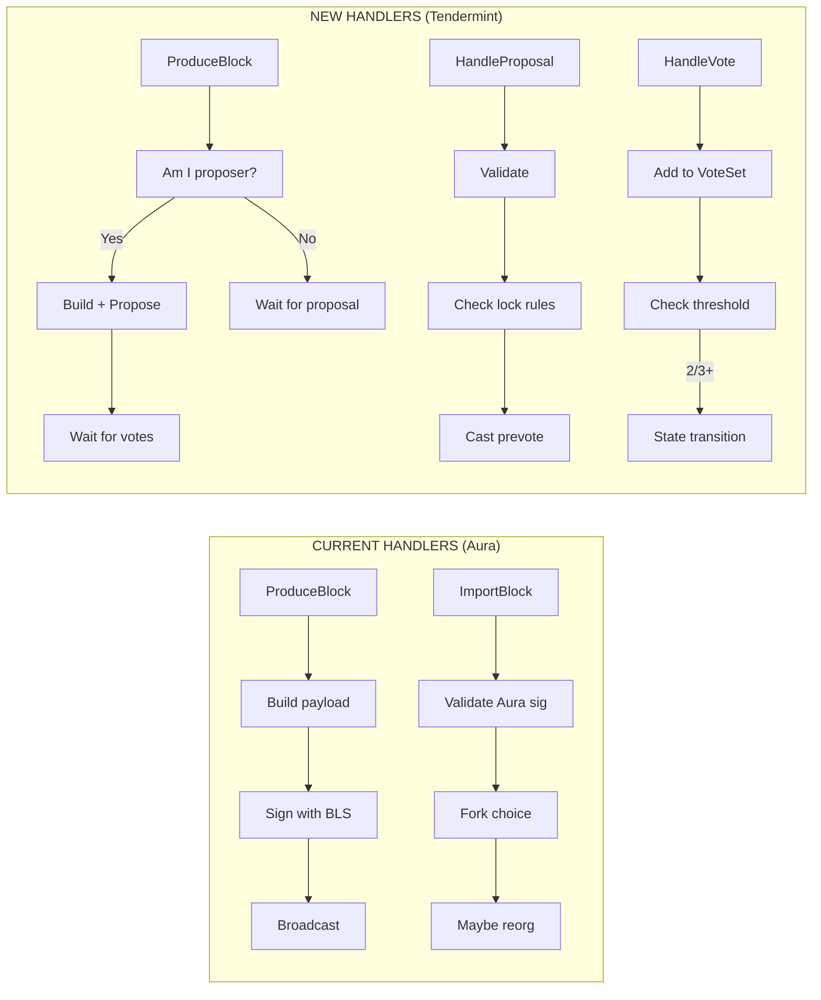
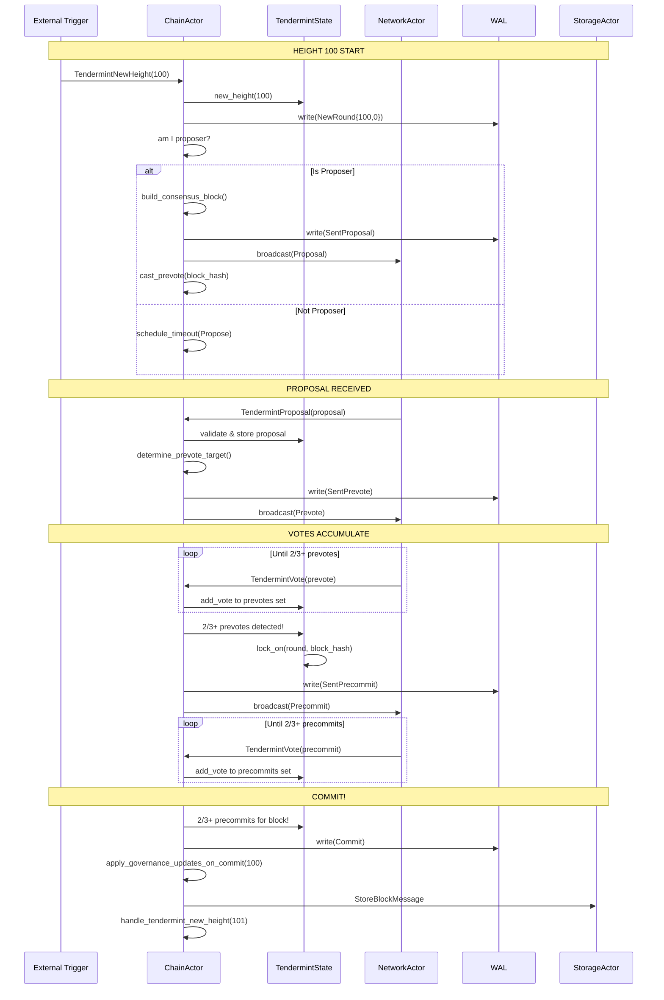
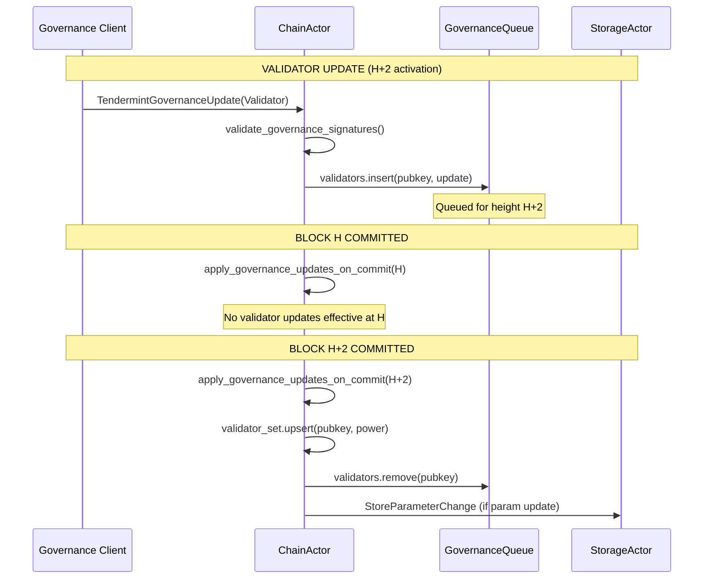
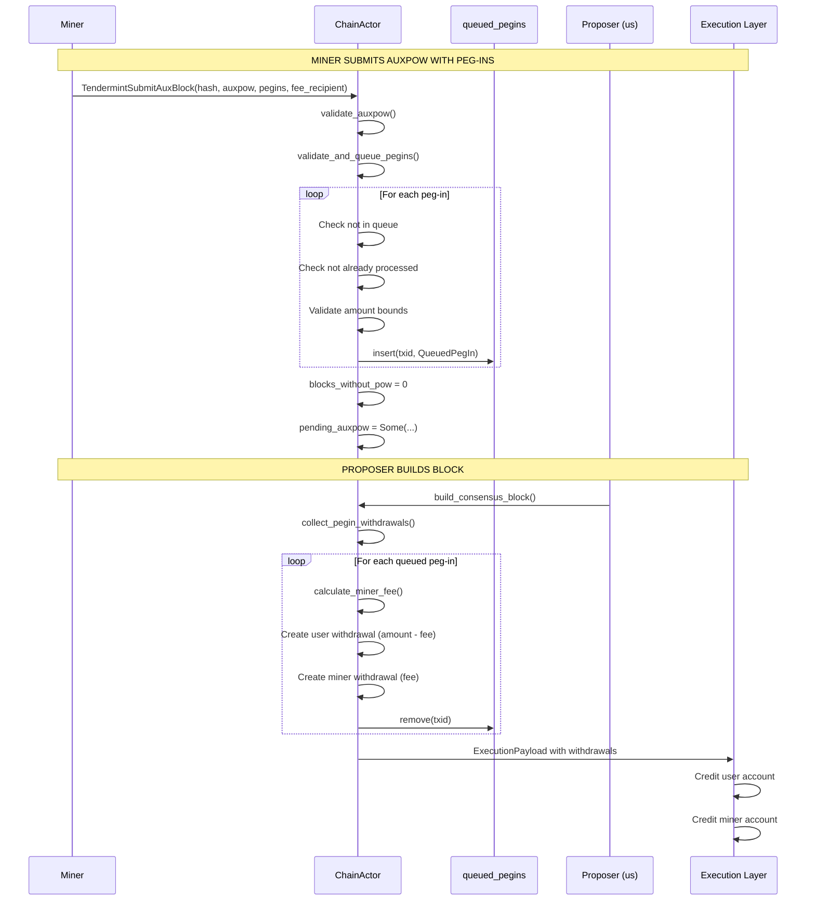

# Implementation Plan: ChainActor Handler Modifications

## Overview

This document provides a comprehensive implementation guide for modifying the ChainActor handlers to support Tendermint consensus. This is the largest single change and represents the integration point where all Tendermint components come together.

**Key Design Decision**: Following standard Tendermint/CometBFT architecture, **LastCommit is embedded in the block structure**. When a block is committed, the commit proof is cached and embedded in the NEXT block's `last_commit` field. Block N+1.last_commit proves Block N was finalized.

**Estimated Effort**: 3 weeks
**Dependencies**:
- `01_MESSAGE_TYPES_AND_PROTOCOL_FOUNDATION.md`
- `02_STATE_MACHINE.md`
- `03_VOTE_SET_MANAGEMENT.md`
- `07_EL_COORDINATION.md` (finalization with embedded commits)
- `11_STORAGE_SCHEMA_MIGRATION.md` (storage with embedded commits)
- `16_AUXPOW_TENDERMINT_INTEGRATION.md` (peg-in handling, miner compensation)
- `17_GOVERNANCE_PARAMETERS.md` (GovernanceUpdate, activation timing)
**Files to Modify**:
- `app/src/actors_v2/chain/handlers.rs`
- `app/src/actors_v2/chain/actor.rs`
- `app/src/actors_v2/chain/messages.rs`
- `app/src/actors_v2/chain/withdrawals.rs` (peg-in to EVM conversion)
**Files to Create**:
- `app/src/actors_v2/chain/tendermint/handlers.rs`
- `app/src/actors_v2/chain/tendermint/governance.rs`

**Cross-Document Type References**:
- `QueuedPegIn`, `PendingAuxPow` → Defined in `01_MESSAGE_TYPES_AND_PROTOCOL_FOUNDATION.md`
- `ConsensusAmount` → Already exists in `app/src/engine.rs`
- `schedule_timeout()` → Defined in `08_TIMEOUT_MANAGEMENT.md`
- `finalize_committed_block()` → Defined in `07_EL_COORDINATION.md`
- `check_for_equivocation()` → Defined in `15_VALIDATION_MODULE.md`
- `broadcast_tendermint_message()` → Defined in `05_NETWORK_LAYER.md`
- AuxPoW validation → Already exists in `app/src/actors_v2/chain/auxpow.rs`
- `blocks_without_pow` counter → Managed in `app/src/actors_v2/chain/auxpow.rs`

**Required ChainError Variants** (add to `app/src/actors_v2/chain/error.rs`):
```rust
// Tendermint-specific errors
NotValidator,                              // Node is not a validator
NotProposer,                               // Not the designated proposer for this round
InvalidProposer { expected: ValidatorId, actual: ValidatorId },
InvalidProposalSignature,
InvalidVoteSignature,
InvalidProposal(String),
InvalidVote(String),
NoProposalToCommit,
BlockHashMismatch { expected: BlockHash, actual: BlockHash },
InsufficientCommitSigners { have: usize, need: usize },
InvalidParentHash { expected: H256, actual: H256 },
InvalidHeight { expected: u64, actual: u64 },
InvalidParamsHash { expected: H256, actual: H256 },
InvalidGovernanceUpdate(String),
PegInsPaused,
LivenessGateTriggered { blocks_without_pow: u64, max_allowed: u64 },
MissingLastCommit,
InvalidLastCommit { expected: BlockHash, actual: BlockHash },
ParamsHashMismatch,
```

---

## 1. Current vs New Handler Architecture

### 1.1 Handler Comparison



### 1.2 Handler Mapping

| Current Handler | Tendermint Replacement | Notes |
|-----------------|----------------------|-------|
| `ProduceBlock` | `HandleProposePhase` | Only runs when we're proposer |
| `ImportBlock` | `HandleProposal` + `HandleVote` | Split into consensus phases |
| Fork choice logic | **REMOVED** | No fork choice in Tendermint |
| Reorg logic | **REMOVED** | No reorgs in Tendermint |
| `BroadcastBlock` | `BroadcastProposal` | Sends proposal, not block |
| N/A (new) | `HandleTimeout` | Timeout handling |
| N/A (new) | `CommitBlock` | Finalization |

---

## 2. Message Additions

### 2.1 New ChainMessage Variants

```rust
// In messages.rs - Add these variants to ChainMessage enum

pub enum ChainMessage {
    // ═══════════════════════════════════════════════════════════════════
    // EXISTING MESSAGES (keep for V0 compatibility during transition)
    // ═══════════════════════════════════════════════════════════════════
    ProduceBlock { slot: u64, timestamp: Duration, correlation_id: Option<Uuid> },
    ImportBlock { block: SignedConsensusBlock, source: BlockSource, peer_id: Option<String> },
    GetChainStatus { correlation_id: Option<Uuid> },
    GetBlockByHeight { height: u64, correlation_id: Option<Uuid> },
    GetBlockByHash { hash: H256, correlation_id: Option<Uuid> },
    BroadcastBlock { block: SignedConsensusBlock, correlation_id: Option<Uuid> },
    // ... other existing messages ...

    // ═══════════════════════════════════════════════════════════════════
    // NEW TENDERMINT MESSAGES
    // ═══════════════════════════════════════════════════════════════════

    /// Trigger: Start of a new height's consensus
    /// Called when: New height begins (after commit or genesis)
    TendermintNewHeight {
        height: u64,
        correlation_id: Option<Uuid>,
    },

    /// Trigger: Start proposing for current round (if we're proposer)
    /// Called when: Round timer starts and we're the designated proposer
    TendermintPropose {
        height: u64,
        round: u32,
        correlation_id: Option<Uuid>,
    },

    /// Trigger: Received proposal from network
    /// Called when: NetworkActor receives Tendermint proposal message
    TendermintProposal {
        proposal: Proposal,
        peer_id: Option<String>,
        correlation_id: Option<Uuid>,
    },

    /// Trigger: Received vote from network
    /// Called when: NetworkActor receives Tendermint vote message
    TendermintVote {
        vote: Vote,
        peer_id: Option<String>,
        correlation_id: Option<Uuid>,
    },

    /// Trigger: Timeout expired for current step
    /// Called when: Timeout scheduler fires
    TendermintTimeout {
        height: u64,
        round: u32,
        step: TendermintStep,
        correlation_id: Option<Uuid>,
    },

    /// Trigger: Internal - Execute pending consensus actions
    /// Called when: After state transitions to process generated actions
    TendermintExecuteActions {
        actions: Vec<ConsensusAction>,
        correlation_id: Option<Uuid>,
    },

    // ═══════════════════════════════════════════════════════════════════
    // GOVERNANCE MESSAGES (See 17_GOVERNANCE_PARAMETERS.md)
    // ═══════════════════════════════════════════════════════════════════

    /// Trigger: Governance client gRPC stream
    /// Called when: Federation sends validator/parameter/emergency updates
    /// Activation: Validator=H+2, Parameter=H+1, Emergency=H+0
    TendermintGovernanceUpdate {
        update: GovernanceUpdate,
        correlation_id: Option<Uuid>,
    },

    // ═══════════════════════════════════════════════════════════════════
    // AUXPOW / PEG-IN MESSAGES (See 16_AUXPOW_TENDERMINT_INTEGRATION.md)
    // ═══════════════════════════════════════════════════════════════════

    /// Trigger: Miner submits AuxPoW with peg-in data via submitauxblock RPC
    /// Called when: Miner completes merge-mining work and includes monitored peg-ins
    TendermintSubmitAuxBlock {
        hash: H256,
        auxpow: AuxPow,
        pegins: Vec<PegInInfo>,
        fee_recipient: Address,
        correlation_id: Option<Uuid>,
    },
}
```

### 2.2 New ChainResponse Variants

```rust
// In messages.rs - Add these variants to ChainResponse enum

pub enum ChainResponse {
    // ... existing variants ...

    /// Tendermint action completed
    TendermintAction {
        action_type: TendermintActionType,
        height: u64,
        round: u32,
    },

    /// Block was committed through Tendermint consensus
    TendermintBlockCommitted {
        block_hash: H256,
        height: u64,
        round: u32,
    },

    /// New height started
    TendermintNewHeightStarted {
        height: u64,
    },
}

#[derive(Debug, Clone, Serialize, Deserialize)]
pub enum TendermintActionType {
    ProposalSent,
    ProposalReceived,
    PrevoteSent { block_hash: Option<H256> },
    PrecommitSent { block_hash: Option<H256> },
    RoundAdvanced { new_round: u32 },
    BlockCommitted { block_hash: H256 },
    TimeoutHandled { step: TendermintStep },
    // Governance actions
    GovernanceUpdateQueued { update_type: GovernanceUpdateType, effective_height: u64 },
    GovernanceUpdateApplied { update_type: GovernanceUpdateType },
    EmergencyActionExecuted { action: EmergencyActionType },
    // Peg-in actions
    AuxBlockAccepted { pegins_queued: usize },
    PegInsIncluded { count: usize, total_amount: u64 },
}

#[derive(Debug, Clone, Serialize, Deserialize)]
pub enum GovernanceUpdateType {
    Validator { public_key: PublicKey, power: u64 },
    Parameter { param: GovernableParam },
    Emergency,
}

#[derive(Debug, Clone, Serialize, Deserialize)]
pub enum EmergencyActionType {
    PausePegIns,
    ResumePegIns,
    PausePegOuts,
    ResumePegOuts,
    PauseChain,
    ResumeChain,
}
```

---

## 3. Handler Implementations

### 3.1 Handler Organization

Create a new file `app/src/actors_v2/chain/tendermint/handlers.rs`:

```rust
//! Tendermint consensus handlers for ChainActor.
//!
//! This module contains all handler logic for Tendermint consensus messages.
//! Handlers are organized by consensus phase:
//!
//! 1. Height Initialization (TendermintNewHeight)
//! 2. Propose Phase (TendermintPropose, TendermintProposal)
//! 3. Vote Phase (TendermintVote)
//! 4. Timeout Handling (TendermintTimeout)
//! 5. Action Execution (TendermintExecuteActions)

use super::*;
use crate::actors_v2::chain::tendermint::*;
use tracing::{debug, info, warn, error, instrument};

impl ChainActor {
    // ═══════════════════════════════════════════════════════════════════
    // HEIGHT INITIALIZATION
    // ═══════════════════════════════════════════════════════════════════

    /// Handle the start of a new height
    ///
    /// Called when:
    /// - After committing a block (advancing to next height)
    /// - At node startup (resuming from WAL)
    ///
    /// # Flow
    ///
    /// ```text
    /// TendermintNewHeight(H)
    ///   ├─ 1. Update state for height H
    ///   ├─ 2. Determine proposer for round 0
    ///   ├─ 3. If we're proposer: trigger TendermintPropose
    ///   └─ 4. Schedule propose timeout
    /// ```
    #[instrument(skip(self), fields(height = %height))]
    pub async fn handle_tendermint_new_height(
        &self,
        height: u64,
    ) -> Result<ChainResponse, ChainError> {
        info!(height, "Starting Tendermint consensus for new height");

        // 1. Initialize state for new height
        let validator_set = self.state.tendermint.validator_set.clone();
        self.state.tendermint.new_height(height, validator_set);

        // 2. Write to WAL
        {
            let mut wal = self.wal.write().await;
            wal.write(WALEntry::NewRound { height, round: 0 })?;
        }

        // 3. Check if we're the proposer
        let proposer = self.state.tendermint.current_proposer();
        let is_proposer = self.state.tendermint.is_proposer();

        debug!(
            height,
            proposer = %proposer,
            is_us = is_proposer,
            "Proposer for round 0"
        );

        if is_proposer {
            // We're the proposer - build and broadcast proposal
            self.handle_tendermint_propose(height, 0).await?;
        }

        // 4. Schedule propose timeout (even if we're proposer, in case we fail)
        self.schedule_timeout(TendermintStep::Propose);

        Ok(ChainResponse::TendermintNewHeightStarted { height })
    }

    // ═══════════════════════════════════════════════════════════════════
    // PROPOSE PHASE
    // ═══════════════════════════════════════════════════════════════════

    /// Handle our turn to propose
    ///
    /// Only called when we are the designated proposer for this round.
    ///
    /// # Flow
    ///
    /// ```text
    /// TendermintPropose(height, round)
    ///   ├─ 1. Verify we're the proposer
    ///   ├─ 2. Build block (reuse existing logic)
    ///   ├─ 3. Create and sign proposal
    ///   ├─ 4. Write to WAL
    ///   ├─ 5. Broadcast proposal
    ///   └─ 6. Self-prevote for our proposal
    /// ```
    #[instrument(skip(self), fields(height = %height, round = %round))]
    pub async fn handle_tendermint_propose(
        &self,
        height: u64,
        round: u32,
    ) -> Result<ChainResponse, ChainError> {
        // 1. Verify we're the proposer
        let expected_proposer = self.state.tendermint.validator_set.get_proposer(height, round);
        let our_id = self.state.tendermint.our_validator_id
            .ok_or(ChainError::NotValidator)?;

        if expected_proposer != our_id {
            warn!(
                height,
                round,
                expected = %expected_proposer,
                actual = %our_id,
                "Not the proposer for this round"
            );
            return Err(ChainError::NotProposer);
        }

        info!(height, round, "Building proposal as designated proposer");

        // 2. Build the block
        let block = self.build_consensus_block(height).await?;

        // 3. Create proposal with POL if locked
        let proposal = Proposal {
            height,
            round,
            block: block.message.clone(),
            pol_round: self.state.tendermint.locked_round,
            proposer: our_id,
            signature: self.sign_proposal(&block.message, height, round)?,
        };

        // 4. Write to WAL before broadcasting
        {
            let mut wal = self.wal.write().await;
            wal.write(WALEntry::SentProposal {
                height,
                round,
                block_hash: proposal.block_hash(),
            })?;
        }

        // 5. Broadcast proposal
        self.broadcast_tendermint_message(TendermintMessage::Proposal(proposal.clone())).await?;

        // 6. Store proposal and self-prevote
        self.state.tendermint.current_proposal = Some(proposal.clone());
        self.state.tendermint.set_step(TendermintStep::Prevote);

        // Cast our own prevote
        let block_hash = proposal.block_hash();
        self.cast_prevote(Some(block_hash)).await?;

        Ok(ChainResponse::TendermintAction {
            action_type: TendermintActionType::ProposalSent,
            height,
            round,
        })
    }

    /// Handle receiving a proposal from another validator
    ///
    /// # Flow
    ///
    /// ```text
    /// TendermintProposal(proposal)
    ///   ├─ 1. Validate height/round
    ///   ├─ 2. Verify proposer is correct
    ///   ├─ 3. Verify signature
    ///   ├─ 4. Validate block contents
    ///   ├─ 5. Apply locking rules
    ///   ├─ 6. Store proposal
    ///   ├─ 7. Transition to Prevote step
    ///   └─ 8. Cast prevote
    /// ```
    #[instrument(skip(self, proposal), fields(
        height = %proposal.height,
        round = %proposal.round,
        proposer = %proposal.proposer
    ))]
    pub async fn handle_tendermint_proposal(
        &self,
        proposal: Proposal,
        peer_id: Option<String>,
    ) -> Result<ChainResponse, ChainError> {
        let state = &self.state.tendermint;

        // 1. Validate height/round
        if proposal.height != state.height {
            debug!(
                expected = state.height,
                actual = proposal.height,
                "Proposal for different height, ignoring"
            );
            return Ok(ChainResponse::Success);
        }

        if proposal.round != state.round {
            debug!(
                expected = state.round,
                actual = proposal.round,
                "Proposal for different round, ignoring"
            );
            return Ok(ChainResponse::Success);
        }

        // Only process in Propose step
        if state.step != TendermintStep::Propose {
            debug!(
                current_step = ?state.step,
                "Proposal received in wrong step, may be duplicate"
            );
            return Ok(ChainResponse::Success);
        }

        // 2. Verify proposer
        let expected_proposer = state.current_proposer();
        if proposal.proposer != expected_proposer {
            warn!(
                expected = %expected_proposer,
                actual = %proposal.proposer,
                "Proposal from wrong proposer"
            );
            return Err(ChainError::InvalidProposer {
                expected: expected_proposer,
                actual: proposal.proposer,
            });
        }

        // 3. Verify signature
        let pubkey = state.validator_set.get_public_key(&proposal.proposer)
            .map_err(|e| ChainError::InvalidProposal(format!("Unknown proposer: {}", e)))?;

        if !proposal.verify_signature(pubkey) {
            warn!("Invalid signature on proposal");
            return Err(ChainError::InvalidProposalSignature);
        }

        info!(
            height = proposal.height,
            round = proposal.round,
            proposer = %proposal.proposer,
            block_hash = ?proposal.block_hash(),
            "Valid proposal received"
        );

        // 4. Validate block contents
        self.validate_proposal_block(&proposal.block).await?;

        // 5. Determine prevote based on locking rules
        let vote_target = self.determine_prevote_for_proposal(&proposal)?;

        // 6. Store proposal and transition state
        self.state.tendermint.current_proposal = Some(proposal.clone());
        self.state.tendermint.proposals.insert(
            (proposal.round, proposal.proposer),
            proposal.clone(),
        );
        self.state.tendermint.set_step(TendermintStep::Prevote);

        // 7. Cast prevote
        if self.state.tendermint.is_validator() {
            self.cast_prevote(vote_target).await?;
        }

        // 8. Schedule prevote timeout
        self.schedule_timeout(TendermintStep::Prevote);

        Ok(ChainResponse::TendermintAction {
            action_type: TendermintActionType::ProposalReceived,
            height: proposal.height,
            round: proposal.round,
        })
    }

    /// Determine what to prevote for based on locking rules
    ///
    /// # Locking Rules (Critical for Safety!)
    ///
    /// 1. Not locked → Vote for proposal
    /// 2. Locked on this block → Vote for it
    /// 3. Locked on different block + valid POL → Vote for proposal (unlock)
    /// 4. Locked on different block + no POL → Vote NIL
    fn determine_prevote_for_proposal(
        &self,
        proposal: &Proposal,
    ) -> Result<Option<BlockHash>, ChainError> {
        let proposal_hash = proposal.block_hash();
        let state = &self.state.tendermint;

        match (&state.locked_block, &state.locked_round) {
            // Case 1: Not locked - vote for proposal
            (None, _) => {
                debug!("Not locked, voting for proposal");
                Ok(Some(proposal_hash))
            }

            // Case 2: Locked on this exact block
            (Some(locked), _) if *locked == proposal_hash => {
                debug!("Locked on proposed block, voting for it");
                Ok(Some(proposal_hash))
            }

            // Case 3: Locked on different block - check POL
            (Some(locked), Some(locked_round)) => {
                if let Some(pol_round) = proposal.pol_round {
                    if pol_round >= *locked_round {
                        // Valid POL from equal or higher round - can unlock
                        debug!(
                            locked_round,
                            pol_round,
                            "POL from higher round, unlocking"
                        );
                        // Note: Full implementation would verify POL
                        Ok(Some(proposal_hash))
                    } else {
                        // POL from lower round - cannot unlock
                        debug!(
                            locked_round,
                            pol_round,
                            "POL from lower round, voting NIL"
                        );
                        Ok(None)
                    }
                } else {
                    // No POL - cannot vote for different block
                    debug!(
                        locked_block = ?locked,
                        proposal_block = ?proposal_hash,
                        "Locked on different block without POL, voting NIL"
                    );
                    Ok(None)
                }
            }

            // Edge case: locked_block but no locked_round (shouldn't happen)
            (Some(locked), None) => {
                warn!("Inconsistent state: locked_block without locked_round");
                Ok(Some(*locked))
            }
        }
    }

    // ═══════════════════════════════════════════════════════════════════
    // VOTE PHASE
    // ═══════════════════════════════════════════════════════════════════

    /// Handle receiving a vote from a validator
    ///
    /// # Flow
    ///
    /// ```text
    /// TendermintVote(vote)
    ///   ├─ 1. Validate height
    ///   ├─ 2. Verify signature
    ///   ├─ 3. Check for equivocation
    ///   ├─ 4. Add to appropriate VoteSet
    ///   ├─ 5. Check for threshold crossing
    ///   └─ 6. Execute state transitions if threshold met
    /// ```
    #[instrument(skip(self, vote), fields(
        height = %vote.height,
        round = %vote.round,
        vote_type = ?vote.vote_type,
        validator = %vote.validator
    ))]
    pub async fn handle_tendermint_vote(
        &self,
        vote: Vote,
        peer_id: Option<String>,
    ) -> Result<ChainResponse, ChainError> {
        let state = &self.state.tendermint;

        // 1. Validate height
        if vote.height != state.height {
            debug!(
                expected = state.height,
                actual = vote.height,
                "Vote for different height, ignoring"
            );
            return Ok(ChainResponse::Success);
        }

        // 2. Verify signature
        let pubkey = state.validator_set.get_public_key(&vote.validator)
            .map_err(|e| ChainError::InvalidVote(format!("Unknown validator: {}", e)))?;

        if !vote.verify_signature(pubkey) {
            warn!(validator = %vote.validator, "Invalid signature on vote");
            return Err(ChainError::InvalidVoteSignature);
        }

        // 3. Check for equivocation (before adding vote)
        self.check_for_equivocation(&vote).await?;

        // 4. Add vote to appropriate set
        let threshold_event = self.add_vote_to_set(vote.clone()).await?;

        debug!(
            vote_type = ?vote.vote_type,
            validator = %vote.validator,
            block_hash = ?vote.block_hash,
            threshold_crossed = threshold_event.is_some(),
            "Vote processed"
        );

        // 5. If threshold crossed, process state transition
        if let Some(event) = threshold_event {
            let actions = self.state.tendermint.process_event(event).await;
            self.execute_consensus_actions(actions).await?;
        }

        Ok(ChainResponse::TendermintAction {
            action_type: match vote.vote_type {
                VoteType::Prevote => TendermintActionType::PrevoteSent {
                    block_hash: vote.block_hash,
                },
                VoteType::Precommit => TendermintActionType::PrecommitSent {
                    block_hash: vote.block_hash,
                },
            },
            height: vote.height,
            round: vote.round,
        })
    }

    /// Add vote to the appropriate VoteSet and check threshold
    async fn add_vote_to_set(&self, vote: Vote) -> Result<Option<ConsensusEvent>, ChainError> {
        let state = &self.state.tendermint;

        // Only process current round votes for state transitions
        if vote.round != state.round {
            // Store for historical reference but don't trigger events
            return Ok(None);
        }

        match vote.vote_type {
            VoteType::Prevote => {
                let mut prevotes = state.prevotes.write().await;
                match prevotes.add_vote(vote.clone()) {
                    Ok(true) => {
                        // New vote added - check threshold
                        if prevotes.has_two_thirds_any() {
                            let majority = prevotes.two_thirds_majority();
                            return Ok(Some(ConsensusEvent::TwoThirdsPrevotes(majority)));
                        }
                    }
                    Ok(false) => {
                        // Duplicate vote, already had it
                    }
                    Err(VoteError::DuplicateVote { validator, existing }) => {
                        // Equivocation! Create evidence
                        warn!(
                            validator = %validator,
                            existing = ?existing,
                            new = ?vote.block_hash,
                            "Equivocation detected!"
                        );
                        // Evidence handling would go here
                    }
                    Err(e) => {
                        warn!("Vote error: {}", e);
                    }
                }
            }

            VoteType::Precommit => {
                let mut precommits = state.precommits.write().await;
                match precommits.add_vote(vote.clone()) {
                    Ok(true) => {
                        if precommits.has_two_thirds_any() {
                            let majority = precommits.two_thirds_majority();
                            return Ok(Some(ConsensusEvent::TwoThirdsPrecommits(majority)));
                        }
                    }
                    Ok(false) => {}
                    Err(VoteError::DuplicateVote { validator, existing }) => {
                        warn!(
                            validator = %validator,
                            existing = ?existing,
                            new = ?vote.block_hash,
                            "Equivocation detected!"
                        );
                    }
                    Err(e) => {
                        warn!("Vote error: {}", e);
                    }
                }
            }
        }

        Ok(None)
    }

    // ═══════════════════════════════════════════════════════════════════
    // TIMEOUT HANDLING
    // ═══════════════════════════════════════════════════════════════════

    /// Handle timeout expiration
    ///
    /// # Timeout Behaviors
    ///
    /// - Propose timeout: Move to Prevote, vote NIL (or locked block)
    /// - Prevote timeout (with 2/3+ any): Move to Precommit
    /// - Precommit timeout (with 2/3+ any): Move to next round
    #[instrument(skip(self), fields(height = %height, round = %round, step = ?step))]
    pub async fn handle_tendermint_timeout(
        &self,
        height: u64,
        round: u32,
        step: TendermintStep,
    ) -> Result<ChainResponse, ChainError> {
        let state = &self.state.tendermint;

        // Verify timeout is for current height/round/step
        if height != state.height || round != state.round || step != state.step {
            debug!(
                "Stale timeout for H={} R={} S={:?}, current is H={} R={} S={:?}",
                height, round, step,
                state.height, state.round, state.step
            );
            return Ok(ChainResponse::Success);
        }

        info!(height, round, step = ?step, "Processing timeout");

        // Process timeout through state machine
        let event = ConsensusEvent::Timeout(step);
        let actions = self.state.tendermint.process_event(event).await;

        // Execute resulting actions
        self.execute_consensus_actions(actions).await?;

        Ok(ChainResponse::TendermintAction {
            action_type: TendermintActionType::TimeoutHandled { step },
            height,
            round,
        })
    }

    // ═══════════════════════════════════════════════════════════════════
    // ACTION EXECUTION
    // ═══════════════════════════════════════════════════════════════════

    /// Execute consensus actions generated by the state machine
    async fn execute_consensus_actions(
        &self,
        actions: Vec<ConsensusAction>,
    ) -> Result<(), ChainError> {
        for action in actions {
            match action {
                ConsensusAction::BroadcastPrevote(block_hash) => {
                    self.cast_prevote(block_hash).await?;
                }

                ConsensusAction::BroadcastPrecommit(block_hash) => {
                    self.cast_precommit(block_hash).await?;
                }

                ConsensusAction::CommitBlock(block_hash) => {
                    self.commit_tendermint_block(block_hash).await?;
                }

                ConsensusAction::NewRound(round) => {
                    let height = self.state.tendermint.height;
                    info!(height, round, "Advancing to new round");

                    // WAL entry
                    {
                        let mut wal = self.wal.write().await;
                        wal.write(WALEntry::NewRound { height, round })?;
                    }

                    // Check if we're proposer for new round
                    if self.state.tendermint.is_proposer() {
                        self.handle_tendermint_propose(height, round).await?;
                    }

                    // Schedule propose timeout
                    self.schedule_timeout(TendermintStep::Propose);
                }

                ConsensusAction::ScheduleTimeout(step) => {
                    self.schedule_timeout(step);
                }

                ConsensusAction::None => {}
            }
        }

        Ok(())
    }

    // ═══════════════════════════════════════════════════════════════════
    // VOTING HELPERS
    // ═══════════════════════════════════════════════════════════════════

    /// Cast a prevote and broadcast it
    async fn cast_prevote(&self, block_hash: Option<BlockHash>) -> Result<(), ChainError> {
        let state = &self.state.tendermint;

        // Check if we've already voted
        if state.has_voted_prevote() {
            debug!("Already cast prevote for this round");
            return Ok(());
        }

        let our_id = state.our_validator_id.ok_or(ChainError::NotValidator)?;
        let keypair = self.get_validator_keypair()?;

        // Create vote
        let vote = Vote::new_signed(
            state.height,
            state.round,
            VoteType::Prevote,
            block_hash,
            our_id,
            &keypair,
        );

        // Write to WAL before broadcast
        {
            let mut wal = self.wal.write().await;
            wal.write(WALEntry::SentPrevote {
                height: state.height,
                round: state.round,
                block_hash,
            })?;
        }

        // Record that we voted
        self.state.tendermint.record_prevote(block_hash);

        // Broadcast
        self.broadcast_tendermint_message(TendermintMessage::Vote(vote)).await?;

        info!(
            height = state.height,
            round = state.round,
            block_hash = ?block_hash,
            "Cast prevote"
        );

        Ok(())
    }

    /// Cast a precommit and broadcast it
    async fn cast_precommit(&self, block_hash: Option<BlockHash>) -> Result<(), ChainError> {
        let state = &self.state.tendermint;

        // Check if we've already voted
        if state.has_voted_precommit() {
            debug!("Already cast precommit for this round");
            return Ok(());
        }

        let our_id = state.our_validator_id.ok_or(ChainError::NotValidator)?;
        let keypair = self.get_validator_keypair()?;

        // Create vote
        let vote = Vote::new_signed(
            state.height,
            state.round,
            VoteType::Precommit,
            block_hash,
            our_id,
            &keypair,
        );

        // Write to WAL before broadcast
        {
            let mut wal = self.wal.write().await;
            wal.write(WALEntry::SentPrecommit {
                height: state.height,
                round: state.round,
                block_hash,
            })?;
        }

        // Record that we voted
        self.state.tendermint.record_precommit(block_hash);

        // Broadcast
        self.broadcast_tendermint_message(TendermintMessage::Vote(vote)).await?;

        info!(
            height = state.height,
            round = state.round,
            block_hash = ?block_hash,
            "Cast precommit"
        );

        Ok(())
    }

    // ═══════════════════════════════════════════════════════════════════
    // COMMIT
    // ═══════════════════════════════════════════════════════════════════

    /// Commit a block after 2/3+ precommits
    ///
    /// This is the finalization step. Once committed, the block is
    /// immediately final and cannot be reverted.
    ///
    /// # Embedded LastCommit Design
    ///
    /// Following standard Tendermint/CometBFT architecture:
    /// - The commit proof created here will be embedded in the NEXT block's `last_commit` field
    /// - Block N+1.last_commit proves Block N was finalized
    /// - The commit is cached until Block N+1 is proposed
    ///
    async fn commit_tendermint_block(&mut self, block_hash: BlockHash) -> Result<(), ChainError> {
        let state = &self.state.tendermint;
        let height = state.height;
        let round = state.round;

        info!(height, round, block_hash = ?block_hash, "COMMITTING BLOCK");

        // Get the block from proposal
        let proposal = state.current_proposal.as_ref()
            .ok_or(ChainError::NoProposalToCommit)?;

        // Verify hash matches
        if proposal.block_hash() != block_hash {
            return Err(ChainError::BlockHashMismatch {
                expected: block_hash,
                actual: proposal.block_hash(),
            });
        }

        // Write commit to WAL
        {
            let mut wal = self.wal.write().await;
            wal.write(WALEntry::Commit { height, block_hash })?;
        }

        // Create Commit proof from precommits using CommitSig structure
        let commit = {
            let precommits = state.precommits.read().await;
            let validator_set = &state.validator_set;

            // Build CommitSig array - one entry per validator
            let signatures: Vec<CommitSig> = (0..validator_set.len())
                .map(|i| {
                    let validator_id = ValidatorId::new(i as u8);
                    match precommits.get_vote(&validator_id, Some(block_hash)) {
                        Some(vote) => CommitSig {
                            block_id_flag: BlockIDFlag::Commit,
                            validator_address: Some(validator_id),
                            timestamp: vote.timestamp,
                            signature: Some(vote.signature.clone()),
                        },
                        None => {
                            // Check if they voted nil
                            match precommits.get_vote(&validator_id, None) {
                                Some(vote) => CommitSig {
                                    block_id_flag: BlockIDFlag::Nil,
                                    validator_address: Some(validator_id),
                                    timestamp: vote.timestamp,
                                    signature: Some(vote.signature.clone()),
                                },
                                None => CommitSig::absent(),
                            }
                        }
                    }
                })
                .collect();

            Commit::new(height, round, block_hash, signatures)
        };

        // Verify we have sufficient signatures before proceeding
        if !commit.has_sufficient_signatures(state.validator_set.len()) {
            return Err(ChainError::InsufficientCommitSigners {
                have: commit.num_commit_signatures(),
                need: state.validator_set.two_thirds_threshold() as usize,
            });
        }

        // Execute in EL and store block
        // The commit will be cached and embedded in the next block's last_commit
        // (See 07_EL_COORDINATION.md for details)
        self.finalize_committed_block(&proposal.block, commit).await?;

        // Apply governance updates that activate at this height
        self.apply_governance_updates_on_commit(height).await?;

        // Update blocks_without_pow counter for liveness tracking
        // (See 16_AUXPOW_TENDERMINT_INTEGRATION.md for liveness gate details)
        if proposal.block.header.auxpow_header.is_some() {
            self.state.blocks_without_pow = 0;
        } else {
            self.state.blocks_without_pow += 1;
            if self.state.blocks_without_pow >= self.state.chain_params.max_blocks_without_pow {
                warn!(
                    blocks_without_pow = self.state.blocks_without_pow,
                    max = self.state.chain_params.max_blocks_without_pow,
                    "Approaching liveness gate - peg-ins will pause without AuxPoW"
                );
            }
        }

        // Advance to next height
        let new_height = height + 1;
        self.handle_tendermint_new_height(new_height).await?;

        Ok(())
    }

    // ═══════════════════════════════════════════════════════════════════
    // GOVERNANCE HANDLERS (See 17_GOVERNANCE_PARAMETERS.md)
    // ═══════════════════════════════════════════════════════════════════

    /// Handle governance update from federation gRPC stream
    ///
    /// # Activation Timing
    ///
    /// - **Validator updates**: H+2 (standard Tendermint delayed validator changes)
    /// - **Parameter updates**: H+1 (allows propagation before activation)
    /// - **Emergency actions**: H+0 (immediate effect)
    ///
    /// # Flow
    ///
    /// ```text
    /// TendermintGovernanceUpdate(update)
    ///   ├─ 1. Validate update format and signatures
    ///   ├─ 2. Calculate effective height
    ///   ├─ 3. Queue update (idempotent - replaces existing for same key)
    ///   └─ 4. For emergencies: execute immediately
    /// ```
    #[instrument(skip(self, update))]
    pub async fn handle_governance_update(
        &self,
        update: GovernanceUpdate,
    ) -> Result<ChainResponse, ChainError> {
        let current_height = self.state.tendermint.height;
        let effective_height = update.effective_height(current_height);

        info!(
            current_height,
            effective_height,
            update_type = ?update.variant_name(),
            "Processing governance update"
        );

        // Validate signatures (federation threshold required)
        self.validate_governance_signatures(&update)?;

        match &update {
            GovernanceUpdate::Validator(validator_update) => {
                // Queue for H+2 activation (idempotent - keyed by public_key)
                self.state.governance_queue.validators.insert(
                    validator_update.public_key.clone(),
                    validator_update.clone(),
                );

                info!(
                    public_key = %validator_update.public_key,
                    power = validator_update.power,
                    effective_height,
                    "Validator update queued"
                );

                Ok(ChainResponse::TendermintAction {
                    action_type: TendermintActionType::GovernanceUpdateQueued {
                        update_type: GovernanceUpdateType::Validator {
                            public_key: validator_update.public_key.clone(),
                            power: validator_update.power,
                        },
                        effective_height,
                    },
                    height: current_height,
                    round: self.state.tendermint.round,
                })
            }

            GovernanceUpdate::Parameter(param_update) => {
                // Queue for H+1 activation (idempotent - keyed by param)
                self.state.governance_queue.parameters.insert(
                    param_update.param,
                    param_update.clone(),
                );

                info!(
                    param = ?param_update.param,
                    effective_height,
                    "Parameter update queued"
                );

                Ok(ChainResponse::TendermintAction {
                    action_type: TendermintActionType::GovernanceUpdateQueued {
                        update_type: GovernanceUpdateType::Parameter {
                            param: param_update.param,
                        },
                        effective_height,
                    },
                    height: current_height,
                    round: self.state.tendermint.round,
                })
            }

            GovernanceUpdate::Emergency(emergency) => {
                // Execute immediately (H+0)
                self.execute_emergency_action(emergency).await?;

                Ok(ChainResponse::TendermintAction {
                    action_type: TendermintActionType::EmergencyActionExecuted {
                        action: emergency.action_type(),
                    },
                    height: current_height,
                    round: self.state.tendermint.round,
                })
            }
        }
    }

    /// Apply governance updates that activate at the given height
    ///
    /// Called during block commit. Processes:
    /// - Validator updates where effective_height == height (included at H-2)
    /// - Parameter updates where effective_height == height (included at H-1)
    async fn apply_governance_updates_on_commit(&self, height: u64) -> Result<(), ChainError> {
        // Apply validator updates (H+2 activation)
        let validator_updates: Vec<_> = self.state.governance_queue.validators
            .iter()
            .filter(|(_, update)| update.effective_height(height.saturating_sub(2)) == height)
            .map(|(_, update)| update.clone())
            .collect();

        for update in validator_updates {
            info!(
                public_key = %update.public_key,
                power = update.power,
                height,
                "Applying validator update"
            );

            if update.power == 0 {
                self.state.tendermint.validator_set.remove(&update.public_key);
            } else {
                self.state.tendermint.validator_set.upsert(
                    update.public_key.clone(),
                    update.power,
                );
            }

            // Remove from queue
            self.state.governance_queue.validators.remove(&update.public_key);
        }

        // Apply parameter updates (H+1 activation)
        let param_updates: Vec<_> = self.state.governance_queue.parameters
            .iter()
            .filter(|(_, update)| update.effective_height(height.saturating_sub(1)) == height)
            .map(|(_, update)| update.clone())
            .collect();

        for update in param_updates {
            info!(
                param = ?update.param,
                height,
                "Applying parameter update"
            );

            // Update in-memory parameter state
            self.state.chain_params.apply_update(&update)?;

            // Persist to CF_PARAMETER_HISTORY for late-joiner reconstruction
            self.storage_actor.send(StorageMessage::StoreParameterChange {
                param: update.param,
                value: update.value.clone(),
                effective_height: height,
            }).await?;

            // Remove from queue
            self.state.governance_queue.parameters.remove(&update.param);
        }

        Ok(())
    }

    /// Execute an emergency action immediately
    async fn execute_emergency_action(
        &self,
        emergency: &EmergencyAction,
    ) -> Result<(), ChainError> {
        match emergency.action {
            EmergencyActionKind::PausePegIns => {
                self.state.chain_params.pegins_paused = true;
                warn!("EMERGENCY: Peg-ins paused");
            }
            EmergencyActionKind::ResumePegIns => {
                self.state.chain_params.pegins_paused = false;
                info!("Peg-ins resumed");
            }
            EmergencyActionKind::PausePegOuts => {
                self.state.chain_params.pegouts_paused = true;
                warn!("EMERGENCY: Peg-outs paused");
            }
            EmergencyActionKind::ResumePegOuts => {
                self.state.chain_params.pegouts_paused = false;
                info!("Peg-outs resumed");
            }
            EmergencyActionKind::PauseChain => {
                self.state.chain_params.chain_paused = true;
                error!("EMERGENCY: Chain paused!");
            }
            EmergencyActionKind::ResumeChain => {
                self.state.chain_params.chain_paused = false;
                warn!("Chain resumed");
            }
        }

        Ok(())
    }

    // ═══════════════════════════════════════════════════════════════════
    // AUXPOW / PEG-IN HANDLERS (See 16_AUXPOW_TENDERMINT_INTEGRATION.md)
    // ═══════════════════════════════════════════════════════════════════

    /// Handle AuxPoW submission from miner with peg-in data
    ///
    /// # Flow
    ///
    /// ```text
    /// TendermintSubmitAuxBlock(hash, auxpow, pegins, fee_recipient)
    ///   ├─ 1. Validate AuxPoW proof
    ///   ├─ 2. Validate and queue peg-ins (dedup against queue + processed)
    ///   ├─ 3. Store fee_recipient for miner compensation
    ///   ├─ 4. Reset blocks_without_pow counter
    ///   └─ 5. Cache AuxPoW for next block proposal
    /// ```
    #[instrument(skip(self, auxpow, pegins), fields(
        hash = %hash,
        pegin_count = pegins.len()
    ))]
    pub async fn handle_submit_auxblock(
        &self,
        hash: H256,
        auxpow: AuxPow,
        pegins: Vec<PegInInfo>,
        fee_recipient: Address,
    ) -> Result<ChainResponse, ChainError> {
        // 1. Validate AuxPoW proof
        self.validate_auxpow(&hash, &auxpow)?;

        info!(
            hash = %hash,
            fee_recipient = %fee_recipient,
            pegins = pegins.len(),
            "Valid AuxPoW submission received"
        );

        // 2. Validate and queue peg-ins
        let queued_count = self.validate_and_queue_pegins(pegins, fee_recipient).await?;

        // 3. Reset liveness counter
        self.state.blocks_without_pow = 0;

        // 4. Cache AuxPoW for embedding in next block
        self.state.pending_auxpow = Some(PendingAuxPow {
            hash,
            auxpow,
            fee_recipient,
        });

        Ok(ChainResponse::TendermintAction {
            action_type: TendermintActionType::AuxBlockAccepted {
                pegins_queued: queued_count,
            },
            height: self.state.tendermint.height,
            round: self.state.tendermint.round,
        })
    }

    /// Validate and queue peg-ins from miner submission
    ///
    /// Four-layer deduplication (see 16_AUXPOW_TENDERMINT_INTEGRATION.md):
    /// - Layer 0: Reject if already queued or processed (here)
    /// - Layer 1: Queue keyed by txid (natural dedup)
    /// - Layer 2: Producer filter before block inclusion
    /// - Layer 3: Validator rejection of duplicates
    async fn validate_and_queue_pegins(
        &self,
        pegins: Vec<PegInInfo>,
        fee_recipient: Address,
    ) -> Result<usize, ChainError> {
        // Check if peg-ins are paused (explicit pause via emergency action)
        if self.state.chain_params.pegins_paused {
            warn!("Peg-ins are paused - rejecting submission");
            return Err(ChainError::PegInsPaused);
        }

        // Check liveness gate (implicit pause via lack of AuxPoW)
        // See 16_AUXPOW_TENDERMINT_INTEGRATION.md for details
        if self.state.blocks_without_pow >= self.state.chain_params.max_blocks_without_pow {
            warn!(
                blocks_without_pow = self.state.blocks_without_pow,
                max = self.state.chain_params.max_blocks_without_pow,
                "Liveness gate triggered - peg-ins paused until AuxPoW received"
            );
            return Err(ChainError::LivenessGateTriggered {
                blocks_without_pow: self.state.blocks_without_pow,
                max_allowed: self.state.chain_params.max_blocks_without_pow,
            });
        }

        let mut queued_count = 0;

        for pegin in pegins {
            // Skip if already in queue
            if self.state.queued_pegins.contains_key(&pegin.txid) {
                debug!(txid = %pegin.txid, "Peg-in already queued — skipping");
                continue;
            }

            // Skip if already processed in a finalized block
            let wallet = self.bitcoin_wallet.read().await;
            if wallet.get_tx(&pegin.txid)?.is_some() {
                debug!(txid = %pegin.txid, "Peg-in already processed — skipping");
                continue;
            }
            drop(wallet);

            // Validate amount within bounds
            let min_peg = self.state.chain_params.min_peg_amount;
            let max_peg = self.state.chain_params.max_peg_amount;
            if pegin.amount < min_peg || pegin.amount > max_peg {
                warn!(
                    txid = %pegin.txid,
                    amount = pegin.amount,
                    min = min_peg,
                    max = max_peg,
                    "Peg-in amount out of bounds"
                );
                continue;
            }

            // Queue with fee recipient for later compensation
            self.state.queued_pegins.insert(pegin.txid, QueuedPegIn {
                info: pegin.clone(),
                fee_recipient,
                queued_at_height: self.state.tendermint.height,
            });

            queued_count += 1;
            debug!(txid = %pegin.txid, amount = pegin.amount, "Peg-in queued");
        }

        info!(queued = queued_count, "Peg-ins validated and queued");
        Ok(queued_count)
    }

    // ═══════════════════════════════════════════════════════════════════
    // BLOCK BUILDING
    // ═══════════════════════════════════════════════════════════════════

    /// Build a consensus block for proposal
    ///
    /// # Contents
    ///
    /// - Transactions from mempool
    /// - Peg-in withdrawals (with miner compensation split)
    /// - Governance updates (pending for this height's inclusion)
    /// - AuxPoW header (if available)
    /// - params_hash for light client verification
    async fn build_consensus_block(&self, height: u64) -> Result<SignedConsensusBlock, ChainError> {
        let parent_hash = self.state.chain_state.head_hash;
        let timestamp = SystemTime::now()
            .duration_since(UNIX_EPOCH)
            .unwrap()
            .as_secs();

        // Collect transactions from mempool
        let transactions = self.collect_transactions().await?;

        // Collect peg-in withdrawals with miner compensation
        let (withdrawals, pegins_included) = self.collect_pegin_withdrawals().await?;

        // Collect governance updates to include in block
        let governance_updates = self.collect_governance_updates_for_block()?;

        // Calculate params_hash for light client verification
        let params_hash = self.state.chain_params.compute_hash();

        // Build block header
        let header = ConsensusBlockHeader {
            parent_hash,
            height,
            timestamp,
            proposer: self.state.tendermint.our_validator_id.unwrap(),
            // LastCommit is embedded from previous block's commit
            last_commit: self.state.last_commit.clone(),
            // AuxPoW if available
            auxpow_header: self.state.pending_auxpow.take().map(|p| p.into_header()),
            // Governance updates (optional)
            governance_updates: if governance_updates.is_empty() {
                None
            } else {
                Some(governance_updates)
            },
            // Parameter state hash for verification
            params_hash,
            // ... other fields
        };

        // Build execution payload with withdrawals
        let execution_payload = self.build_execution_payload(
            &header,
            transactions,
            withdrawals,
        ).await?;

        let block = ConsensusBlock {
            header,
            execution_payload,
        };

        // Sign the block
        let signature = self.sign_block(&block)?;

        Ok(SignedConsensusBlock {
            message: block,
            signature,
        })
    }

    /// Collect peg-in withdrawals with miner compensation
    ///
    /// Each peg-in becomes TWO withdrawals:
    /// 1. User receives: amount - miner_fee
    /// 2. Miner receives: miner_fee
    async fn collect_pegin_withdrawals(&self) -> Result<(Vec<Withdrawal>, usize), ChainError> {
        let mut withdrawals = Vec::new();
        let mut included_count = 0;
        let params = &self.state.chain_params.pegin_compensation;

        // Take up to MAX_PEGINS_PER_BLOCK from queue
        const MAX_PEGINS_PER_BLOCK: usize = 16;

        let pegins_to_process: Vec<_> = self.state.queued_pegins
            .iter()
            .take(MAX_PEGINS_PER_BLOCK)
            .map(|(txid, queued)| (txid.clone(), queued.clone()))
            .collect();

        for (txid, queued) in pegins_to_process {
            // Calculate miner fee
            let miner_fee = calculate_miner_fee(queued.info.amount, params);
            let user_amount = queued.info.amount - miner_fee;

            // User withdrawal
            withdrawals.push(Withdrawal {
                index: withdrawals.len() as u64,
                validator_index: 0,
                address: queued.info.evm_account,
                amount: ConsensusAmount::from_satoshi(user_amount).0,
            });

            // Miner compensation withdrawal
            withdrawals.push(Withdrawal {
                index: withdrawals.len() as u64,
                validator_index: 0,
                address: queued.fee_recipient,
                amount: ConsensusAmount::from_satoshi(miner_fee).0,
            });

            // Remove from queue
            self.state.queued_pegins.remove(&txid);
            included_count += 1;

            debug!(
                txid = %txid,
                user_amount,
                miner_fee,
                "Peg-in converted to withdrawals"
            );
        }

        Ok((withdrawals, included_count))
    }

    /// Collect governance updates to include in block
    ///
    /// Includes all pending updates from governance queue.
    /// Updates are idempotent, so re-including is safe.
    fn collect_governance_updates_for_block(&self) -> Vec<GovernanceUpdate> {
        let mut updates = Vec::new();

        // Include pending validator updates
        for (_, validator_update) in &self.state.governance_queue.validators {
            updates.push(GovernanceUpdate::Validator(validator_update.clone()));
        }

        // Include pending parameter updates
        for (_, param_update) in &self.state.governance_queue.parameters {
            updates.push(GovernanceUpdate::Parameter(param_update.clone()));
        }

        // Emergency actions are not queued (immediate execution)

        updates
    }

    // ═══════════════════════════════════════════════════════════════════
    // BLOCK VALIDATION
    // ═══════════════════════════════════════════════════════════════════

    /// Validate a proposed block's contents
    ///
    /// # Validations
    ///
    /// 1. Basic structure (height, parent, timestamp)
    /// 2. params_hash matches current parameter state
    /// 3. Governance updates are well-formed and signed
    /// 4. Peg-in withdrawals are valid (not already processed)
    /// 5. Execution payload is valid
    async fn validate_proposal_block(&self, block: &ConsensusBlock) -> Result<(), ChainError> {
        // 1. Basic structure validation
        if block.header.parent_hash != self.state.chain_state.head_hash {
            return Err(ChainError::InvalidParentHash {
                expected: self.state.chain_state.head_hash,
                actual: block.header.parent_hash,
            });
        }

        if block.header.height != self.state.tendermint.height {
            return Err(ChainError::InvalidHeight {
                expected: self.state.tendermint.height,
                actual: block.header.height,
            });
        }

        // 2. Validate params_hash
        let expected_params_hash = self.state.chain_params.compute_hash();
        if block.header.params_hash != expected_params_hash {
            return Err(ChainError::InvalidParamsHash {
                expected: expected_params_hash,
                actual: block.header.params_hash,
            });
        }

        // 3. Validate governance updates
        if let Some(ref updates) = block.header.governance_updates {
            for update in updates {
                self.validate_governance_update_format(update)?;
            }
        }

        // 4. Validate withdrawals (peg-ins not already processed)
        self.validate_withdrawals(&block.execution_payload.withdrawals).await?;

        // 5. Validate execution payload via EL
        self.validate_execution_payload(&block.execution_payload).await?;

        Ok(())
    }

    /// Validate withdrawal transactions are not duplicates
    async fn validate_withdrawals(&self, withdrawals: &[Withdrawal]) -> Result<(), ChainError> {
        // Withdrawals from peg-ins should not be for already-processed txids
        // This requires tracking which withdrawals correspond to which peg-ins
        // Implementation depends on how we encode txid in withdrawal metadata
        Ok(())
    }

    /// Validate governance update format (not signatures - those validated on receipt)
    fn validate_governance_update_format(&self, update: &GovernanceUpdate) -> Result<(), ChainError> {
        match update {
            GovernanceUpdate::Validator(v) => {
                // Power must be reasonable
                if v.power > 1_000_000 {
                    return Err(ChainError::InvalidGovernanceUpdate(
                        "Validator power too high".to_string()
                    ));
                }
            }
            GovernanceUpdate::Parameter(p) => {
                // Validate parameter value is within constraints
                p.validate()?;
            }
            GovernanceUpdate::Emergency(_) => {
                // Emergency actions validated on receipt
            }
        }
        Ok(())
    }
}

/// Calculate miner fee for peg-in compensation
fn calculate_miner_fee(amount: u64, params: &PegInCompensation) -> u64 {
    let fee = (amount * params.miner_fee_bps) / 10_000;
    fee.clamp(params.min_fee_satoshi, params.max_fee_satoshi)
}
```

---

## 4. Handler Registration

### 4.1 Main Handler Match

Modify `app/src/actors_v2/chain/handlers.rs`:

```rust
impl Handler<ChainMessage> for ChainActor {
    type Result = ResponseFuture<Result<ChainResponse, ChainError>>;

    fn handle(&mut self, msg: ChainMessage, _ctx: &mut Context<Self>) -> Self::Result {
        // Clone what we need for async block
        let state = self.state.clone();
        let actor = self.clone();

        Box::pin(async move {
            match msg {
                // ═══════════════════════════════════════════════════════════
                // EXISTING HANDLERS (V0 compatibility)
                // ═══════════════════════════════════════════════════════════
                ChainMessage::GetChainStatus { correlation_id } => {
                    actor.handle_get_chain_status(correlation_id).await
                }

                ChainMessage::GetBlockByHeight { height, correlation_id } => {
                    actor.handle_get_block_by_height(height, correlation_id).await
                }

                // ... other existing handlers ...

                // ═══════════════════════════════════════════════════════════
                // TENDERMINT HANDLERS
                // ═══════════════════════════════════════════════════════════

                ChainMessage::TendermintNewHeight { height, correlation_id } => {
                    actor.handle_tendermint_new_height(height).await
                }

                ChainMessage::TendermintPropose { height, round, correlation_id } => {
                    actor.handle_tendermint_propose(height, round).await
                }

                ChainMessage::TendermintProposal { proposal, peer_id, correlation_id } => {
                    actor.handle_tendermint_proposal(proposal, peer_id).await
                }

                ChainMessage::TendermintVote { vote, peer_id, correlation_id } => {
                    actor.handle_tendermint_vote(vote, peer_id).await
                }

                ChainMessage::TendermintTimeout { height, round, step, correlation_id } => {
                    actor.handle_tendermint_timeout(height, round, step).await
                }

                ChainMessage::TendermintExecuteActions { actions, correlation_id } => {
                    actor.execute_consensus_actions(actions).await
                        .map(|_| ChainResponse::Success)
                }

                // ═══════════════════════════════════════════════════════════
                // GOVERNANCE HANDLERS
                // ═══════════════════════════════════════════════════════════

                ChainMessage::TendermintGovernanceUpdate { update, correlation_id } => {
                    actor.handle_governance_update(update).await
                }

                // ═══════════════════════════════════════════════════════════
                // AUXPOW / PEG-IN HANDLERS
                // ═══════════════════════════════════════════════════════════

                ChainMessage::TendermintSubmitAuxBlock {
                    hash,
                    auxpow,
                    pegins,
                    fee_recipient,
                    correlation_id
                } => {
                    actor.handle_submit_auxblock(hash, auxpow, pegins, fee_recipient).await
                }
            }
        })
    }
}
```

---

## 5. Complete Message Flow Example

### 5.1 Full Height Consensus



### 5.2 Governance Update Flow



### 5.3 Peg-In Flow (Miner-Effectuated)



---

## 6. Sync and Catch-Up Behavior

### 6.1 Late-Joiner Consensus Entry

When a node joins mid-height or falls behind, the handler logic must account for catching up:

```rust
/// Check if we're in sync before participating in consensus
fn can_participate_in_consensus(&self) -> bool {
    // Must have latest block
    let local_height = self.state.chain_state.head_height;
    let consensus_height = self.state.tendermint.height;

    // Allow participation if within acceptable range
    // (1 block behind is OK - we might receive committed block any moment)
    consensus_height.saturating_sub(1) <= local_height
}

/// Handle receiving a vote for a future height (indicates we're behind)
pub async fn handle_future_vote(&self, vote: Vote) -> Result<(), ChainError> {
    if vote.height > self.state.tendermint.height {
        info!(
            local_height = self.state.tendermint.height,
            vote_height = vote.height,
            "Received vote for future height - triggering sync"
        );
        // Notify SyncActor to request blocks
        self.sync_actor.send(SyncMessage::RequestBlocksFrom {
            start_height: self.state.chain_state.head_height + 1,
            target_height: vote.height,
        }).await?;
    }
    Ok(())
}
```

### 6.2 Commit Proof Reconstruction

Late joiners receiving blocks must verify the embedded `last_commit`:

```rust
/// Validate block's last_commit field during sync
async fn validate_sync_block(&self, block: &ConsensusBlock) -> Result<(), ChainError> {
    if block.header.height == 0 {
        // Genesis has no last_commit
        return Ok(());
    }

    let last_commit = block.header.last_commit.as_ref()
        .ok_or(ChainError::MissingLastCommit)?;

    // Verify last_commit proves the previous block
    let prev_block_hash = block.header.parent_hash;
    if last_commit.block_hash != prev_block_hash {
        return Err(ChainError::InvalidLastCommit {
            expected: prev_block_hash,
            actual: last_commit.block_hash,
        });
    }

    // Verify 2/3+ signatures from validator set at that height
    // (Must use historical validator set, not current)
    let historical_val_set = self.get_validator_set_at_height(block.header.height - 1).await?;
    if !last_commit.has_sufficient_signatures(historical_val_set.len()) {
        return Err(ChainError::InsufficientCommitSigners {
            have: last_commit.num_commit_signatures(),
            need: historical_val_set.two_thirds_threshold() as usize,
        });
    }

    Ok(())
}
```

### 6.3 Parameter State Recovery

Late joiners must reconstruct parameter state from `CF_PARAMETER_HISTORY`:

```rust
/// Recover parameter state for a late-joining node
async fn recover_parameter_state(&self, target_height: u64) -> Result<ChainParams, ChainError> {
    // Start with genesis parameters
    let mut params = ChainParams::genesis();

    // Apply all parameter changes up to target height
    let changes = self.storage_actor.send(StorageMessage::GetParameterHistory {
        from_height: 0,
        to_height: target_height,
    }).await?;

    for change in changes {
        params.apply_update(&change)?;
    }

    // Verify params_hash matches block at target_height
    let block = self.storage_actor.send(StorageMessage::GetBlockByHeight {
        height: target_height,
    }).await?;

    if params.compute_hash() != block.header.params_hash {
        return Err(ChainError::ParamsHashMismatch);
    }

    Ok(params)
}
```

---

## 7. Testing Strategy

### 6.1 Unit Tests for Handlers

```rust
#[cfg(test)]
mod tests {
    use super::*;

    async fn setup_test_chain_actor() -> ChainActor {
        // Create test actor with mock dependencies
        // ...
    }

    #[tokio::test]
    async fn test_new_height_initializes_state() {
        let actor = setup_test_chain_actor().await;

        let result = actor.handle_tendermint_new_height(100).await;

        assert!(result.is_ok());
        assert_eq!(actor.state.tendermint.height, 100);
        assert_eq!(actor.state.tendermint.round, 0);
        assert_eq!(actor.state.tendermint.step, TendermintStep::Propose);
    }

    #[tokio::test]
    async fn test_proposal_triggers_prevote() {
        let actor = setup_test_chain_actor().await;
        actor.handle_tendermint_new_height(100).await.unwrap();

        let proposal = create_test_proposal(100, 0);
        let result = actor.handle_tendermint_proposal(proposal, None).await;

        assert!(result.is_ok());
        assert_eq!(actor.state.tendermint.step, TendermintStep::Prevote);
        assert!(actor.state.tendermint.has_voted_prevote());
    }

    #[tokio::test]
    async fn test_locked_validator_votes_nil_for_different_block() {
        let actor = setup_test_chain_actor().await;
        actor.handle_tendermint_new_height(100).await.unwrap();

        // Lock on block A
        let block_a = BlockHash::repeat_byte(0xAA);
        actor.state.tendermint.lock_on(0, block_a);

        // Receive proposal for block B (no POL)
        let proposal = create_test_proposal_for_block(100, 0, BlockHash::repeat_byte(0xBB));
        let vote_target = actor.determine_prevote_for_proposal(&proposal).unwrap();

        assert_eq!(vote_target, None); // Should vote NIL
    }

    // ═══════════════════════════════════════════════════════════════════
    // GOVERNANCE TESTS
    // ═══════════════════════════════════════════════════════════════════

    #[tokio::test]
    async fn test_validator_update_queued_for_h_plus_2() {
        let actor = setup_test_chain_actor().await;
        actor.handle_tendermint_new_height(100).await.unwrap();

        let update = GovernanceUpdate::Validator(ValidatorUpdate {
            public_key: create_test_pubkey(),
            power: 100,
            governance_signature: create_test_signature(),
        });

        let result = actor.handle_governance_update(update).await;

        assert!(result.is_ok());
        assert_eq!(actor.state.governance_queue.validators.len(), 1);
        // Update should activate at height 102
    }

    #[tokio::test]
    async fn test_parameter_update_queued_for_h_plus_1() {
        let actor = setup_test_chain_actor().await;
        actor.handle_tendermint_new_height(100).await.unwrap();

        let update = GovernanceUpdate::Parameter(ParameterUpdate {
            param: GovernableParam::MinerFeeBps,
            value: ParameterValue::U64(75), // 0.75%
            governance_signature: create_test_signature(),
        });

        let result = actor.handle_governance_update(update).await;

        assert!(result.is_ok());
        assert_eq!(actor.state.governance_queue.parameters.len(), 1);
        // Update should activate at height 101
    }

    #[tokio::test]
    async fn test_emergency_action_immediate() {
        let actor = setup_test_chain_actor().await;
        assert!(!actor.state.chain_params.pegins_paused);

        let update = GovernanceUpdate::Emergency(EmergencyAction {
            action: EmergencyActionKind::PausePegIns,
            governance_signature: create_test_signature(),
        });

        let result = actor.handle_governance_update(update).await;

        assert!(result.is_ok());
        assert!(actor.state.chain_params.pegins_paused);
    }

    #[tokio::test]
    async fn test_duplicate_validator_update_is_idempotent() {
        let actor = setup_test_chain_actor().await;
        actor.handle_tendermint_new_height(100).await.unwrap();

        let pubkey = create_test_pubkey();

        // First update: power = 100
        let update1 = GovernanceUpdate::Validator(ValidatorUpdate {
            public_key: pubkey.clone(),
            power: 100,
            governance_signature: create_test_signature(),
        });
        actor.handle_governance_update(update1).await.unwrap();

        // Second update for same validator: power = 200
        let update2 = GovernanceUpdate::Validator(ValidatorUpdate {
            public_key: pubkey.clone(),
            power: 200,
            governance_signature: create_test_signature(),
        });
        actor.handle_governance_update(update2).await.unwrap();

        // Queue should have only one entry (latest wins)
        assert_eq!(actor.state.governance_queue.validators.len(), 1);
        assert_eq!(
            actor.state.governance_queue.validators.get(&pubkey).unwrap().power,
            200
        );
    }

    // ═══════════════════════════════════════════════════════════════════
    // PEG-IN TESTS
    // ═══════════════════════════════════════════════════════════════════

    #[tokio::test]
    async fn test_pegin_queued_on_auxblock_submit() {
        let actor = setup_test_chain_actor().await;
        actor.handle_tendermint_new_height(100).await.unwrap();

        let pegins = vec![PegInInfo {
            txid: Txid::from_byte_array([0x11; 32]),
            block_hash: BlockHash::from_byte_array([0x22; 32]),
            block_height: 800000,
            amount: 100_000, // 0.001 BTC
            evm_account: Address::repeat_byte(0x33),
        }];

        let result = actor.handle_submit_auxblock(
            H256::repeat_byte(0x44),
            create_test_auxpow(),
            pegins,
            Address::repeat_byte(0x55), // miner address
        ).await;

        assert!(result.is_ok());
        assert_eq!(actor.state.queued_pegins.len(), 1);
    }

    #[tokio::test]
    async fn test_duplicate_pegin_rejected() {
        let actor = setup_test_chain_actor().await;
        actor.handle_tendermint_new_height(100).await.unwrap();

        let txid = Txid::from_byte_array([0x11; 32]);
        let pegins = vec![PegInInfo {
            txid: txid.clone(),
            block_hash: BlockHash::from_byte_array([0x22; 32]),
            block_height: 800000,
            amount: 100_000,
            evm_account: Address::repeat_byte(0x33),
        }];

        // First submission
        actor.handle_submit_auxblock(
            H256::repeat_byte(0x44),
            create_test_auxpow(),
            pegins.clone(),
            Address::repeat_byte(0x55),
        ).await.unwrap();

        // Second submission with same txid
        let result = actor.handle_submit_auxblock(
            H256::repeat_byte(0x66),
            create_test_auxpow(),
            pegins,
            Address::repeat_byte(0x77),
        ).await;

        // Should succeed but not queue duplicate
        assert!(result.is_ok());
        assert_eq!(actor.state.queued_pegins.len(), 1);
    }

    #[tokio::test]
    async fn test_pegin_rejected_when_paused() {
        let actor = setup_test_chain_actor().await;
        actor.state.chain_params.pegins_paused = true;

        let pegins = vec![create_test_pegin()];

        let result = actor.handle_submit_auxblock(
            H256::repeat_byte(0x44),
            create_test_auxpow(),
            pegins,
            Address::repeat_byte(0x55),
        ).await;

        assert!(matches!(result, Err(ChainError::PegInsPaused)));
    }

    #[tokio::test]
    async fn test_pegin_rejected_when_liveness_gate_triggered() {
        let actor = setup_test_chain_actor().await;
        actor.state.chain_params.max_blocks_without_pow = 100;
        actor.state.blocks_without_pow = 100; // At limit

        let pegins = vec![create_test_pegin()];

        let result = actor.handle_submit_auxblock(
            H256::repeat_byte(0x44),
            create_test_auxpow(),
            pegins,
            Address::repeat_byte(0x55),
        ).await;

        assert!(matches!(
            result,
            Err(ChainError::LivenessGateTriggered { blocks_without_pow: 100, max_allowed: 100 })
        ));
    }

    #[tokio::test]
    async fn test_blocks_without_pow_incremented_on_commit_without_auxpow() {
        let actor = setup_test_chain_actor().await;
        actor.handle_tendermint_new_height(100).await.unwrap();

        // Create and commit a block WITHOUT AuxPoW
        let block_without_auxpow = create_test_block_without_auxpow(100);
        // Simulate commit path...
        // After commit, blocks_without_pow should increment
        assert_eq!(actor.state.blocks_without_pow, 1);
    }

    #[tokio::test]
    async fn test_blocks_without_pow_reset_on_commit_with_auxpow() {
        let actor = setup_test_chain_actor().await;
        actor.state.blocks_without_pow = 50; // Start with count

        // Create and commit a block WITH AuxPoW
        let block_with_auxpow = create_test_block_with_auxpow(100);
        // Simulate commit path...
        // After commit, blocks_without_pow should reset
        assert_eq!(actor.state.blocks_without_pow, 0);
    }

    #[tokio::test]
    async fn test_miner_compensation_calculation() {
        let params = PegInCompensation {
            miner_fee_bps: 50, // 0.5%
            min_fee_satoshi: 1000,
            max_fee_satoshi: 10_000_000,
        };

        // Normal case: 0.5% of 1 BTC = 500,000 sats
        assert_eq!(calculate_miner_fee(100_000_000, &params), 500_000);

        // Min floor: 0.5% of 10,000 sats = 50 sats, but min is 1000
        assert_eq!(calculate_miner_fee(10_000, &params), 1000);

        // Max cap: 0.5% of 100 BTC = 50M sats, but max is 10M
        assert_eq!(calculate_miner_fee(10_000_000_000, &params), 10_000_000);
    }

    #[tokio::test]
    async fn test_pegin_withdrawal_split() {
        let actor = setup_test_chain_actor().await;
        actor.handle_tendermint_new_height(100).await.unwrap();

        // Queue a peg-in
        let user_address = Address::repeat_byte(0x11);
        let miner_address = Address::repeat_byte(0x22);
        let amount = 100_000_000; // 1 BTC

        actor.state.queued_pegins.insert(
            Txid::from_byte_array([0x33; 32]),
            QueuedPegIn {
                info: PegInInfo {
                    txid: Txid::from_byte_array([0x33; 32]),
                    block_hash: BlockHash::from_byte_array([0x44; 32]),
                    block_height: 800000,
                    amount,
                    evm_account: user_address,
                },
                fee_recipient: miner_address,
                queued_at_height: 100,
            },
        );

        let (withdrawals, count) = actor.collect_pegin_withdrawals().await.unwrap();

        assert_eq!(count, 1);
        assert_eq!(withdrawals.len(), 2); // User + miner

        // User gets amount minus fee
        assert_eq!(withdrawals[0].address, user_address);
        // Miner gets fee
        assert_eq!(withdrawals[1].address, miner_address);

        // Total should equal original amount
        let user_amount = ConsensusAmount(withdrawals[0].amount).to_satoshi();
        let miner_amount = ConsensusAmount(withdrawals[1].amount).to_satoshi();
        assert_eq!(user_amount + miner_amount, amount);
    }
}
```

---

## 8. Checklist

### Core Consensus Handlers
- [ ] Add new message variants to `ChainMessage`
- [ ] Add new response variants to `ChainResponse`
- [ ] Add Tendermint-specific `ChainError` variants (see "Required ChainError Variants" above)
- [ ] Create `tendermint/handlers.rs`
- [ ] Implement `handle_tendermint_new_height`
- [ ] Implement `handle_tendermint_propose`
- [ ] Implement `handle_tendermint_proposal`
- [ ] Implement `handle_tendermint_vote`
- [ ] Implement `handle_tendermint_timeout`
- [ ] Implement `cast_prevote` and `cast_precommit`
- [ ] Implement `commit_tendermint_block`
- [ ] Integrate with WAL for safety
- [ ] Add handler registration in main handler match
- [ ] Write unit tests for each handler
- [ ] Write integration test for full consensus round

### Helper Methods to Implement
These methods are referenced in handlers but need implementation:
- [ ] `get_validator_keypair()` → Retrieve this node's validator signing keypair
- [ ] `sign_proposal(block, height, round)` → Sign proposal message with validator key
- [ ] `sign_block(block)` → Sign consensus block (distinct from proposal signature)
- [ ] `collect_transactions()` → Gather transactions from mempool for block building
- [ ] `build_execution_payload(header, txs, withdrawals)` → Build EL payload (see `07_EL_COORDINATION.md`)
- [ ] `validate_execution_payload(payload)` → Validate EL payload via Engine API
- [ ] `validate_auxpow(hash, auxpow)` → AuxPoW validation (already in `auxpow.rs`)

### Governance Integration (17_GOVERNANCE_PARAMETERS.md)
- [ ] Add `TendermintGovernanceUpdate` message variant
- [ ] Implement `handle_governance_update()` handler
- [ ] Implement `GovernanceQueue` data structure
- [ ] Implement `apply_governance_updates_on_commit()`
- [ ] Apply activation timing (H+2 validators, H+1 parameters, H+0 emergencies)
- [ ] Implement `execute_emergency_action()`
- [ ] Implement `validate_governance_signatures()` → Verify federation threshold signatures
- [ ] Implement `params_hash` calculation in `ChainParams::compute_hash()`
- [ ] Add `params_hash` validation in `validate_proposal_block()`
- [ ] Write parameter changes to `CF_PARAMETER_HISTORY`
- [ ] Create `tendermint/governance.rs`
- [ ] Write unit tests for governance handlers
- [ ] Write integration test for validator set changes
- [ ] Write integration test for parameter changes

### Peg-In Integration (16_AUXPOW_TENDERMINT_INTEGRATION.md)
- [ ] Add `TendermintSubmitAuxBlock` message variant
- [ ] Implement `handle_submit_auxblock()` handler
- [ ] Implement `validate_and_queue_pegins()`
- [ ] Implement `QueuedPegIn` struct with fee_recipient
- [ ] Implement `collect_pegin_withdrawals()` with compensation split
- [ ] Implement `calculate_miner_fee()` function
- [ ] Add peg-in pause check (`pegins_paused`)
- [ ] Add liveness gate check (`blocks_without_pow >= max_blocks_without_pow`)
- [ ] Add amount bounds validation (`min_peg_amount`, `max_peg_amount`)
- [ ] Implement four-layer dedup (Layer 0 in handler)
- [ ] Update `build_consensus_block()` to include peg-ins
- [ ] Track `blocks_without_pow` counter in `commit_tendermint_block()`
- [ ] Write unit tests for peg-in handlers
- [ ] Write integration test for peg-in flow
- [ ] Write test for miner compensation calculation
- [ ] Write test for liveness gate behavior

### Block Building
- [ ] Implement `build_consensus_block()` with all components
- [ ] Include governance updates in block
- [ ] Include peg-in withdrawals with fee split
- [ ] Include AuxPoW header when available
- [ ] Calculate and include `params_hash`
- [ ] Implement `collect_governance_updates_for_block()`
- [ ] Embed `last_commit` from previous block's cached commit

### Block Validation
- [ ] Implement `validate_proposal_block()` with all checks
- [ ] Validate `params_hash` matches expected state
- [ ] Validate governance update format
- [ ] Validate withdrawals not duplicates
- [ ] Implement `validate_governance_update_format()`
- [ ] Validate `last_commit` has sufficient signatures for previous block

### Sync/Catch-Up Support
- [ ] Implement `can_participate_in_consensus()` check
- [ ] Implement `handle_future_vote()` for triggering sync
- [ ] Implement `validate_sync_block()` for verifying `last_commit` during sync
- [ ] Implement `recover_parameter_state()` for late-joiner parameter reconstruction
- [ ] Implement `get_validator_set_at_height()` for historical validator set lookup

---

## 9. Next Steps

After completing this implementation:
1. Proceed to **05_NETWORK_LAYER.md** - Network message routing
2. Then **06_WAL.md** - Write-ahead log implementation
3. Then **07_EL_COORDINATION.md** - Execution layer integration

---

*Implementation Plan Version: 2.1*
*Last Updated: February 2026*
*Changes in 2.1: Added cross-document references, ChainError variants, liveness gate logic, sync/catch-up section, expanded checklist*
*Changes in 2.0: Added governance update handlers, peg-in handlers, block building, and validation*
