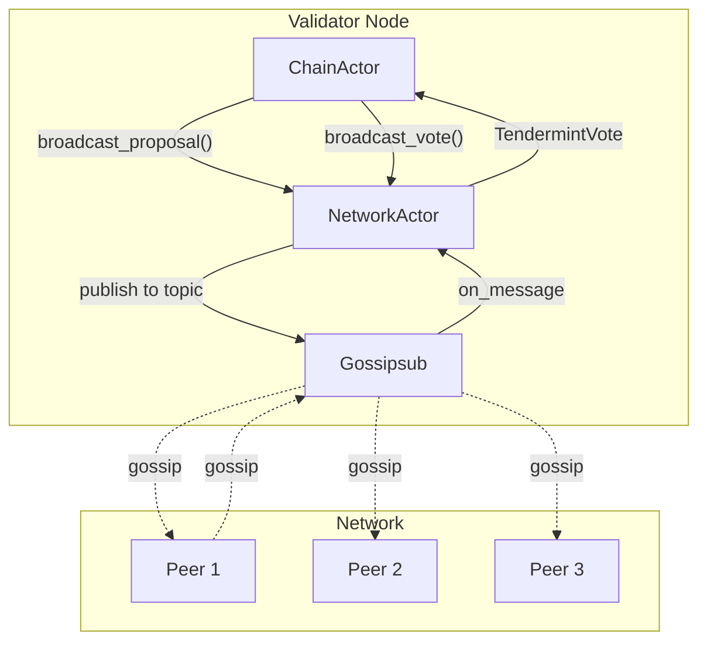
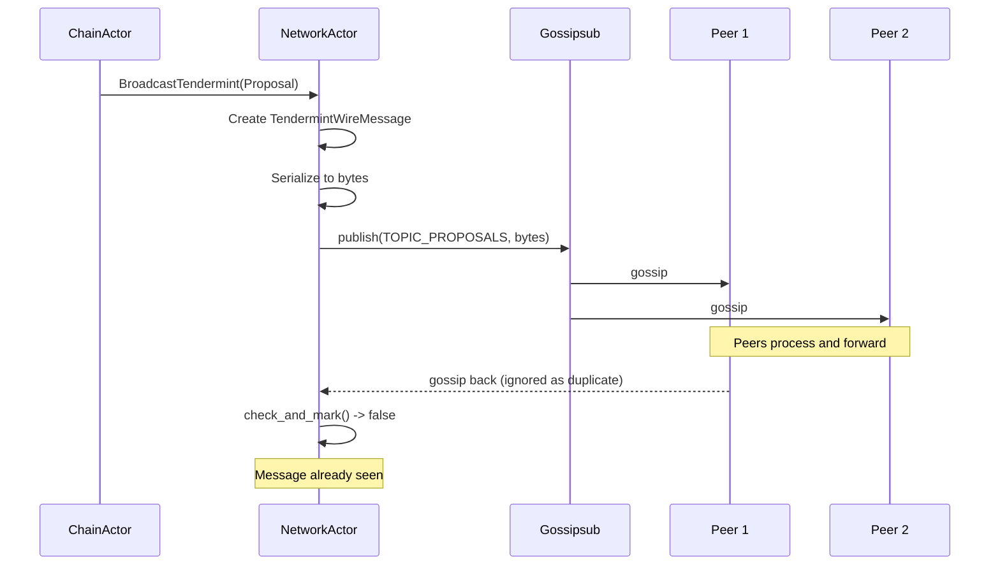
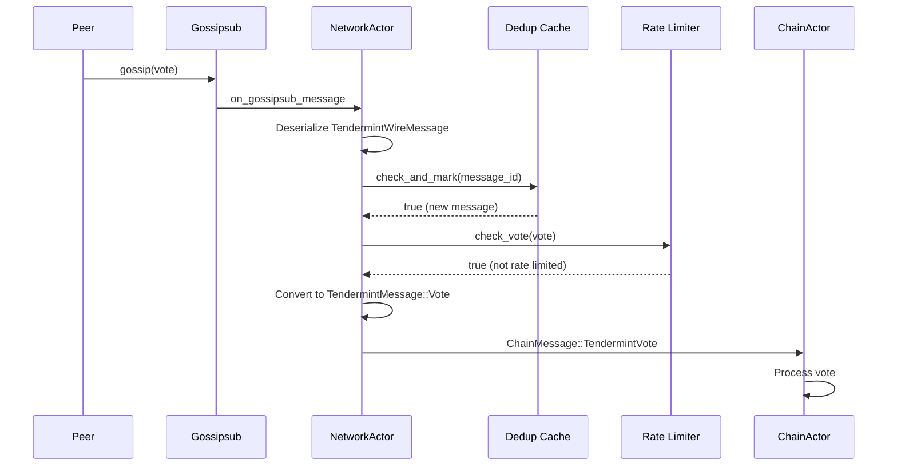

# Implementation Plan: Network Layer Integration

## Overview

This document provides a comprehensive implementation guide for integrating Tendermint consensus messages with the NetworkActor. The network layer handles message broadcasting, deduplication, and routing between validators.

**Estimated Effort**: 1-2 weeks
**Dependencies**:
- `01_MESSAGE_TYPES_AND_PROTOCOL_FOUNDATION.md`
- `04_CHAINACTOR_HANDLERS.md`
**Files to Modify**:
- `app/src/actors_v2/network/messages.rs`
- `app/src/actors_v2/network/network_actor.rs`
**Files to Create**:
- `app/src/actors_v2/network/tendermint.rs`

---

## 1. Network Architecture

### 1.1 Message Flow Overview



### 1.2 Gossipsub Topics

| Topic | Purpose | Message Type | Rate Limit |
|-------|---------|--------------|------------|
| `/alys/tendermint/proposals/1` | Block proposals | `Proposal` | 1/round/validator |
| `/alys/tendermint/votes/1` | Prevotes & Precommits | `Vote` | 2/round/validator |
| `/alys/tendermint/evidence/1` | Equivocation evidence | `Evidence` | Rare |

---

## 2. Message Definitions

### 2.1 NetworkMessage Extensions

```rust
// In network/messages.rs

use crate::actors_v2::chain::tendermint::{
    TendermintMessage, Proposal, Vote, EquivocationEvidence
};

/// Network message types
pub enum NetworkMessage {
    // ... existing variants ...

    // ═══════════════════════════════════════════════════════════════════
    // TENDERMINT MESSAGES
    // ═══════════════════════════════════════════════════════════════════

    /// Broadcast Tendermint message to all validators
    BroadcastTendermint {
        message: TendermintMessage,
        correlation_id: Option<Uuid>,
    },

    /// Received Tendermint message from network
    TendermintMessageReceived {
        message: TendermintMessage,
        peer_id: String,
        correlation_id: Option<Uuid>,
    },

    /// Subscribe to Tendermint topics
    SubscribeTendermintTopics {
        correlation_id: Option<Uuid>,
    },
}
```

### 2.2 Wire Protocol

```rust
// In network/tendermint.rs

use serde::{Deserialize, Serialize};
use super::*;

/// Wire format for Tendermint messages
#[derive(Debug, Clone, Serialize, Deserialize)]
pub struct TendermintWireMessage {
    /// Protocol version (for future compatibility)
    pub version: u8,

    /// Message type tag
    pub msg_type: TendermintWireType,

    /// Serialized message content
    pub payload: Vec<u8>,

    /// Sender peer ID (for deduplication)
    pub sender: String,

    /// Message ID (for deduplication)
    pub message_id: [u8; 32],
}

#[derive(Debug, Clone, Copy, Serialize, Deserialize)]
#[repr(u8)]
pub enum TendermintWireType {
    Proposal = 0,
    Prevote = 1,
    Precommit = 2,
    NewRound = 3,
    Evidence = 4,
}

impl TendermintWireMessage {
    /// Create wire message from Tendermint message
    pub fn from_message(
        message: &TendermintMessage,
        sender: String,
    ) -> Result<Self, SerializationError> {
        let (msg_type, payload) = match message {
            TendermintMessage::Proposal(p) => {
                (TendermintWireType::Proposal, rmp_serde::to_vec(p)?)
            }
            TendermintMessage::Vote(v) => {
                let wire_type = match v.vote_type {
                    VoteType::Prevote => TendermintWireType::Prevote,
                    VoteType::Precommit => TendermintWireType::Precommit,
                };
                (wire_type, rmp_serde::to_vec(v)?)
            }
            TendermintMessage::Evidence(e) => {
                (TendermintWireType::Evidence, rmp_serde::to_vec(e)?)
            }
            TendermintMessage::NewRound { height, round, highest_known_round } => {
                (TendermintWireType::NewRound, rmp_serde::to_vec(&(*height, *round, *highest_known_round))?)
            }
            _ => return Err(SerializationError::UnsupportedMessageType),
        };

        // Generate message ID for deduplication
        let message_id = Self::compute_message_id(&payload, &sender);

        Ok(Self {
            version: 1,
            msg_type,
            payload,
            sender,
            message_id,
        })
    }

    /// Deserialize back to Tendermint message
    pub fn into_message(self) -> Result<TendermintMessage, SerializationError> {
        match self.msg_type {
            TendermintWireType::Proposal => {
                let proposal: Proposal = rmp_serde::from_slice(&self.payload)?;
                Ok(TendermintMessage::Proposal(proposal))
            }
            TendermintWireType::Prevote | TendermintWireType::Precommit => {
                let vote: Vote = rmp_serde::from_slice(&self.payload)?;
                Ok(TendermintMessage::Vote(vote))
            }
            TendermintWireType::Evidence => {
                let evidence: EquivocationEvidence = rmp_serde::from_slice(&self.payload)?;
                Ok(TendermintMessage::Evidence(evidence))
            }
            TendermintWireType::NewRound => {
                let (height, round, highest): (u64, u32, u32) =
                    rmp_serde::from_slice(&self.payload)?;
                Ok(TendermintMessage::NewRound {
                    height,
                    round,
                    highest_known_round: highest,
                })
            }
        }
    }

    /// Compute message ID for deduplication
    fn compute_message_id(payload: &[u8], sender: &str) -> [u8; 32] {
        use tiny_keccak::{Hasher, Keccak};
        let mut hasher = Keccak::v256();
        hasher.update(payload);
        hasher.update(sender.as_bytes());
        let mut output = [0u8; 32];
        hasher.finalize(&mut output);
        output
    }
}
```

---

## 3. Message Deduplication

### 3.1 Deduplication Cache

```rust
// In network/tendermint.rs

use lru::LruCache;
use std::num::NonZeroUsize;
use std::time::{Duration, Instant};

/// Cache for deduplicating Tendermint messages
///
/// Prevents processing the same message multiple times when received
/// via different gossip paths.
pub struct TendermintMessageDedup {
    /// Seen message IDs with their arrival time
    seen: LruCache<[u8; 32], Instant>,

    /// Time after which messages can be seen again
    ttl: Duration,
}

impl TendermintMessageDedup {
    pub fn new(capacity: usize, ttl: Duration) -> Self {
        Self {
            seen: LruCache::new(NonZeroUsize::new(capacity).unwrap()),
            ttl,
        }
    }

    /// Check if message is a duplicate, and mark as seen if not
    ///
    /// Returns true if this is a NEW message (not seen before)
    pub fn check_and_mark(&mut self, message_id: [u8; 32]) -> bool {
        let now = Instant::now();

        // Check if we've seen this message recently
        if let Some(seen_at) = self.seen.get(&message_id) {
            if now.duration_since(*seen_at) < self.ttl {
                return false; // Duplicate
            }
        }

        // Mark as seen
        self.seen.put(message_id, now);
        true // New message
    }

    /// Clear expired entries (called periodically)
    pub fn cleanup(&mut self) {
        let now = Instant::now();
        let expired: Vec<_> = self.seen
            .iter()
            .filter(|(_, &seen_at)| now.duration_since(seen_at) >= self.ttl)
            .map(|(id, _)| *id)
            .collect();

        for id in expired {
            self.seen.pop(&id);
        }
    }
}

// Proposal-specific deduplication (only one proposal per round per proposer)
pub struct ProposalDedup {
    /// Key: (height, round, proposer) -> proposal hash
    seen: LruCache<(u64, u32, ValidatorId), BlockHash>,
}

impl ProposalDedup {
    pub fn new(capacity: usize) -> Self {
        Self {
            seen: LruCache::new(NonZeroUsize::new(capacity).unwrap()),
        }
    }

    /// Check if proposal is duplicate or conflicting
    pub fn check(&mut self, proposal: &Proposal) -> ProposalDedupResult {
        let key = (proposal.height, proposal.round, proposal.proposer);

        if let Some(&existing_hash) = self.seen.get(&key) {
            if existing_hash == proposal.block_hash() {
                ProposalDedupResult::Duplicate
            } else {
                ProposalDedupResult::Conflicting { existing_hash }
            }
        } else {
            self.seen.put(key, proposal.block_hash());
            ProposalDedupResult::New
        }
    }
}

pub enum ProposalDedupResult {
    New,
    Duplicate,
    Conflicting { existing_hash: BlockHash },
}
```

---

## 4. NetworkActor Handler

### 4.1 Tendermint Message Handling

```rust
// In network/network_actor.rs

impl NetworkActor {
    /// Handle request to broadcast Tendermint message
    async fn handle_broadcast_tendermint(
        &mut self,
        message: TendermintMessage,
    ) -> Result<(), NetworkError> {
        // 1. Create wire message
        let wire_msg = TendermintWireMessage::from_message(
            &message,
            self.local_peer_id.to_string(),
        )?;

        // 2. Serialize for network
        let bytes = rmp_serde::to_vec(&wire_msg)
            .map_err(|e| NetworkError::Serialization(e.to_string()))?;

        // 3. Determine topic
        let topic = match &message {
            TendermintMessage::Proposal(_) => TOPIC_TENDERMINT_PROPOSALS,
            TendermintMessage::Vote(_) => TOPIC_TENDERMINT_VOTES,
            TendermintMessage::Evidence(_) => TOPIC_TENDERMINT_EVIDENCE,
            _ => TOPIC_TENDERMINT_VOTES, // Default for other types
        };

        // 4. Publish via gossipsub
        self.publish_to_topic(topic, bytes).await?;

        debug!(
            message_type = message.message_type(),
            topic = topic,
            "Broadcast Tendermint message"
        );

        Ok(())
    }

    /// Handle incoming Tendermint message from gossipsub
    async fn on_tendermint_gossip(
        &mut self,
        data: Vec<u8>,
        peer_id: PeerId,
        topic: &str,
    ) -> Result<(), NetworkError> {
        // 1. Deserialize wire message
        let wire_msg: TendermintWireMessage = rmp_serde::from_slice(&data)
            .map_err(|e| NetworkError::Deserialization(e.to_string()))?;

        // 2. Check deduplication
        if !self.tendermint_dedup.check_and_mark(wire_msg.message_id) {
            debug!("Duplicate Tendermint message, ignoring");
            return Ok(());
        }

        // 3. Convert to Tendermint message
        let message = wire_msg.into_message()?;

        // 4. Additional validation for proposals
        if let TendermintMessage::Proposal(ref proposal) = message {
            match self.proposal_dedup.check(proposal) {
                ProposalDedupResult::New => {}
                ProposalDedupResult::Duplicate => {
                    debug!("Duplicate proposal, ignoring");
                    return Ok(());
                }
                ProposalDedupResult::Conflicting { existing_hash } => {
                    warn!(
                        proposer = %proposal.proposer,
                        height = proposal.height,
                        round = proposal.round,
                        existing = ?existing_hash,
                        new = ?proposal.block_hash(),
                        "Conflicting proposal detected - possible equivocation"
                    );
                    // Continue processing - ChainActor will create evidence
                }
            }
        }

        // 5. Forward to ChainActor
        if let Some(ref chain_actor) = self.chain_actor {
            let chain_msg = match &message {
                TendermintMessage::Proposal(p) => ChainMessage::TendermintProposal {
                    proposal: p.clone(),
                    peer_id: Some(peer_id.to_string()),
                    correlation_id: None,
                },
                TendermintMessage::Vote(v) => ChainMessage::TendermintVote {
                    vote: v.clone(),
                    peer_id: Some(peer_id.to_string()),
                    correlation_id: None,
                },
                TendermintMessage::Evidence(e) => {
                    // Handle evidence separately
                    self.handle_evidence(e.clone()).await?;
                    return Ok(());
                }
                _ => return Ok(()),
            };

            chain_actor.send(chain_msg).await
                .map_err(|e| NetworkError::ActorMailbox(e.to_string()))?
                .map_err(|e| NetworkError::ChainError(e.to_string()))?;
        }

        Ok(())
    }
}
```

### 4.2 Topic Subscription

```rust
// In network/network_actor.rs

/// Tendermint topic names
const TOPIC_TENDERMINT_PROPOSALS: &str = "/alys/tendermint/proposals/1";
const TOPIC_TENDERMINT_VOTES: &str = "/alys/tendermint/votes/1";
const TOPIC_TENDERMINT_EVIDENCE: &str = "/alys/tendermint/evidence/1";

impl NetworkActor {
    /// Subscribe to all Tendermint gossipsub topics
    pub async fn subscribe_tendermint_topics(&mut self) -> Result<(), NetworkError> {
        let topics = [
            TOPIC_TENDERMINT_PROPOSALS,
            TOPIC_TENDERMINT_VOTES,
            TOPIC_TENDERMINT_EVIDENCE,
        ];

        for topic in topics {
            self.subscribe_topic(topic).await?;
            info!("Subscribed to Tendermint topic: {}", topic);
        }

        Ok(())
    }

    /// Handle messages from gossipsub based on topic
    async fn on_gossipsub_message(
        &mut self,
        peer_id: PeerId,
        topic: String,
        data: Vec<u8>,
    ) {
        match topic.as_str() {
            TOPIC_TENDERMINT_PROPOSALS |
            TOPIC_TENDERMINT_VOTES |
            TOPIC_TENDERMINT_EVIDENCE => {
                if let Err(e) = self.on_tendermint_gossip(data, peer_id, &topic).await {
                    warn!(topic, error = %e, "Error processing Tendermint gossip");
                }
            }
            // ... handle other topics ...
            _ => {
                debug!(topic, "Unknown gossipsub topic");
            }
        }
    }
}
```

---

## 5. Rate Limiting

### 5.1 Per-Validator Rate Limits

```rust
// In network/tendermint.rs

use std::collections::HashMap;

/// Rate limiter for Tendermint messages
pub struct TendermintRateLimiter {
    /// Proposals per validator: (height, round) -> count
    proposals: HashMap<ValidatorId, HashMap<(u64, u32), u32>>,

    /// Votes per validator: (height, round, vote_type) -> count
    votes: HashMap<ValidatorId, HashMap<(u64, u32, VoteType), u32>>,

    /// Maximum allowed per category
    max_proposals_per_round: u32,  // Should be 1
    max_votes_per_round: u32,       // Should be 1 per type
}

impl TendermintRateLimiter {
    pub fn new() -> Self {
        Self {
            proposals: HashMap::new(),
            votes: HashMap::new(),
            max_proposals_per_round: 1,
            max_votes_per_round: 1,
        }
    }

    /// Check and record proposal, returns false if rate limited
    pub fn check_proposal(&mut self, proposal: &Proposal) -> bool {
        let validator_proposals = self.proposals
            .entry(proposal.proposer)
            .or_default();

        let key = (proposal.height, proposal.round);
        let count = validator_proposals.entry(key).or_insert(0);

        if *count >= self.max_proposals_per_round {
            warn!(
                proposer = %proposal.proposer,
                height = proposal.height,
                round = proposal.round,
                count = *count,
                "Rate limiting proposals from validator"
            );
            return false;
        }

        *count += 1;
        true
    }

    /// Check and record vote, returns false if rate limited
    pub fn check_vote(&mut self, vote: &Vote) -> bool {
        let validator_votes = self.votes
            .entry(vote.validator)
            .or_default();

        let key = (vote.height, vote.round, vote.vote_type);
        let count = validator_votes.entry(key).or_insert(0);

        if *count >= self.max_votes_per_round {
            warn!(
                validator = %vote.validator,
                height = vote.height,
                round = vote.round,
                vote_type = ?vote.vote_type,
                count = *count,
                "Rate limiting votes from validator"
            );
            return false;
        }

        *count += 1;
        true
    }

    /// Cleanup old entries (call on new height)
    pub fn on_new_height(&mut self, new_height: u64) {
        // Remove entries for heights before new_height - 1
        for proposals in self.proposals.values_mut() {
            proposals.retain(|(h, _), _| *h >= new_height.saturating_sub(1));
        }
        for votes in self.votes.values_mut() {
            votes.retain(|(h, _, _), _| *h >= new_height.saturating_sub(1));
        }
    }
}
```

---

## 6. Metrics

### 6.1 Network Metrics

```rust
use prometheus::{IntCounterVec, HistogramVec, Opts, Registry};

lazy_static! {
    /// Tendermint messages sent by type
    static ref TENDERMINT_MESSAGES_SENT: IntCounterVec = IntCounterVec::new(
        Opts::new("tendermint_messages_sent", "Tendermint messages broadcast"),
        &["message_type"]
    ).unwrap();

    /// Tendermint messages received by type
    static ref TENDERMINT_MESSAGES_RECEIVED: IntCounterVec = IntCounterVec::new(
        Opts::new("tendermint_messages_received", "Tendermint messages received"),
        &["message_type", "result"]  // result: new, duplicate, rate_limited
    ).unwrap();

    /// Message propagation latency
    static ref TENDERMINT_MESSAGE_LATENCY: HistogramVec = HistogramVec::new(
        prometheus::HistogramOpts::new(
            "tendermint_message_latency_seconds",
            "Time from message creation to receipt"
        ),
        &["message_type"]
    ).unwrap();
}

pub fn register_tendermint_network_metrics(registry: &Registry) {
    registry.register(Box::new(TENDERMINT_MESSAGES_SENT.clone())).ok();
    registry.register(Box::new(TENDERMINT_MESSAGES_RECEIVED.clone())).ok();
    registry.register(Box::new(TENDERMINT_MESSAGE_LATENCY.clone())).ok();
}
```

---

## 7. Complete Flow Example

### 7.1 Broadcasting a Proposal



### 7.2 Receiving a Vote



---

## 8. Testing Strategy

```rust
#[cfg(test)]
mod tests {
    use super::*;

    #[test]
    fn test_wire_message_roundtrip() {
        let vote = Vote {
            height: 100,
            round: 0,
            vote_type: VoteType::Prevote,
            block_hash: Some(BlockHash::repeat_byte(0xAB)),
            validator: ValidatorId(5),
            signature: BLSSignature::empty(),
        };

        let message = TendermintMessage::Vote(vote.clone());
        let wire = TendermintWireMessage::from_message(&message, "peer1".into()).unwrap();
        let recovered = wire.into_message().unwrap();

        match recovered {
            TendermintMessage::Vote(v) => {
                assert_eq!(v.height, vote.height);
                assert_eq!(v.round, vote.round);
                assert_eq!(v.validator, vote.validator);
            }
            _ => panic!("Wrong message type"),
        }
    }

    #[test]
    fn test_deduplication() {
        let mut dedup = TendermintMessageDedup::new(100, Duration::from_secs(60));

        let message_id = [0xAB; 32];

        // First time - new
        assert!(dedup.check_and_mark(message_id));

        // Second time - duplicate
        assert!(!dedup.check_and_mark(message_id));
    }

    #[test]
    fn test_rate_limiting() {
        let mut limiter = TendermintRateLimiter::new();

        let vote1 = Vote {
            height: 100,
            round: 0,
            vote_type: VoteType::Prevote,
            block_hash: Some(BlockHash::repeat_byte(0xAB)),
            validator: ValidatorId(5),
            signature: BLSSignature::empty(),
        };

        // First vote allowed
        assert!(limiter.check_vote(&vote1));

        // Second vote for same (height, round, type) blocked
        assert!(!limiter.check_vote(&vote1));

        // Different round allowed
        let vote2 = Vote { round: 1, ..vote1.clone() };
        assert!(limiter.check_vote(&vote2));
    }
}
```

---

## 9. Checklist

- [ ] Add `BroadcastTendermint` to `NetworkMessage`
- [ ] Create `network/tendermint.rs` module
- [ ] Implement `TendermintWireMessage`
- [ ] Implement `TendermintMessageDedup`
- [ ] Implement `ProposalDedup`
- [ ] Implement `TendermintRateLimiter`
- [ ] Add Tendermint topic constants
- [ ] Implement `subscribe_tendermint_topics()`
- [ ] Implement `handle_broadcast_tendermint()`
- [ ] Implement `on_tendermint_gossip()`
- [ ] Add metrics
- [ ] Write unit tests
- [ ] Integration test with multiple peers

---

*Implementation Plan Version: 1.0*
*Last Updated: January 2026*
