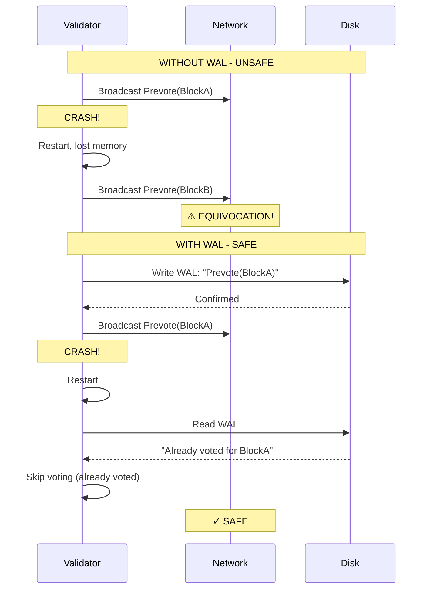

# Implementation Plan: Write-Ahead Log (WAL)

## Overview

This document provides a comprehensive implementation guide for the Tendermint Write-Ahead Log (WAL). The WAL is critical for safety - it ensures validators never double-vote after a crash by persisting voting decisions before broadcasting them.

**Estimated Effort**: 1 week
**Dependencies**:
- `01_MESSAGE_TYPES_AND_PROTOCOL_FOUNDATION.md`
**Files to Create**:
- `app/src/actors_v2/chain/tendermint/wal.rs`

---

## 1. Why WAL is Critical

### 1.1 The Double-Vote Problem



### 1.2 Safety Invariant

**Critical Rule**: A validator MUST write to WAL BEFORE broadcasting any vote or proposal. This ensures that upon restart, the validator knows what votes it has already cast.

---

## 2. WAL Entry Types

### 2.1 Complete WAL Entry Enum

```rust
//! Write-Ahead Log for Tendermint consensus safety.
//!
//! The WAL ensures validators never double-vote after crashes by persisting
//! voting decisions before broadcasting them.
//!
//! # Safety Properties
//!
//! 1. **Durability**: Entries are fsync'd before any network broadcast
//! 2. **Atomicity**: Each entry is written atomically (length-prefixed)
//! 3. **Recoverability**: Full state can be reconstructed from WAL on restart

use super::types::*;
use serde::{Deserialize, Serialize};
use std::fs::{File, OpenOptions};
use std::io::{self, BufReader, BufWriter, Read, Write};
use std::path::{Path, PathBuf};
use tracing::{debug, info, warn, error};

/// WAL entry types
///
/// Each entry represents a state transition or action that must survive crashes.
#[derive(Debug, Clone, Serialize, Deserialize)]
pub enum WALEntry {
    // ═══════════════════════════════════════════════════════════════════
    // ROUND STATE
    // ═══════════════════════════════════════════════════════════════════

    /// Starting a new round (height or round change)
    ///
    /// Written at the start of each round. On recovery, allows jumping
    /// to the correct (height, round) position.
    NewRound {
        height: u64,
        round: u32,
    },

    // ═══════════════════════════════════════════════════════════════════
    // MESSAGES SENT (Critical for Safety)
    // ═══════════════════════════════════════════════════════════════════

    /// We created and will broadcast a proposal
    ///
    /// Written BEFORE broadcasting the proposal.
    SentProposal {
        height: u64,
        round: u32,
        block_hash: BlockHash,
    },

    /// We created and will broadcast a prevote
    ///
    /// Written BEFORE broadcasting the prevote.
    /// `block_hash = None` indicates a NIL vote.
    SentPrevote {
        height: u64,
        round: u32,
        block_hash: Option<BlockHash>,
    },

    /// We created and will broadcast a precommit
    ///
    /// Written BEFORE broadcasting the precommit.
    SentPrecommit {
        height: u64,
        round: u32,
        block_hash: Option<BlockHash>,
    },

    // ═══════════════════════════════════════════════════════════════════
    // LOCKING STATE
    // ═══════════════════════════════════════════════════════════════════

    /// We locked on a block (after seeing 2/3+ prevotes)
    ///
    /// Critical for ensuring we don't vote for conflicting blocks
    /// across rounds after a restart.
    Locked {
        round: u32,
        block_hash: BlockHash,
    },

    /// We unlocked (after seeing valid POL)
    Unlocked {
        previous_round: u32,
    },

    // ═══════════════════════════════════════════════════════════════════
    // COMMIT
    // ═══════════════════════════════════════════════════════════════════

    /// Block was committed (2/3+ precommits received)
    ///
    /// On recovery, allows skipping to the next height.
    Commit {
        height: u64,
        block_hash: BlockHash,
    },
}

impl WALEntry {
    /// Get the height this entry pertains to
    pub fn height(&self) -> Option<u64> {
        match self {
            Self::NewRound { height, .. } => Some(*height),
            Self::SentProposal { height, .. } => Some(*height),
            Self::SentPrevote { height, .. } => Some(*height),
            Self::SentPrecommit { height, .. } => Some(*height),
            Self::Commit { height, .. } => Some(*height),
            Self::Locked { .. } | Self::Unlocked { .. } => None,
        }
    }

    /// Get entry type name for logging
    pub fn entry_type(&self) -> &'static str {
        match self {
            Self::NewRound { .. } => "NewRound",
            Self::SentProposal { .. } => "SentProposal",
            Self::SentPrevote { .. } => "SentPrevote",
            Self::SentPrecommit { .. } => "SentPrecommit",
            Self::Locked { .. } => "Locked",
            Self::Unlocked { .. } => "Unlocked",
            Self::Commit { .. } => "Commit",
        }
    }
}
```

---

## 3. WAL Implementation

### 3.1 Core WAL Structure

```rust
/// Write-Ahead Log for Tendermint consensus
///
/// # File Format
///
/// ```text
/// ┌────────────────────────────────────────────────────┐
/// │ Entry 1: [length: u32][crc32: u32][data: bytes]    │
/// │ Entry 2: [length: u32][crc32: u32][data: bytes]    │
/// │ ...                                                 │
/// └────────────────────────────────────────────────────┘
/// ```
///
/// Each entry is length-prefixed and CRC-protected for integrity.
///
/// # Thread Safety
///
/// WAL is designed to be wrapped in `Arc<RwLock<>>` for async access.
/// Write operations take exclusive locks; reads during recovery are sequential.
pub struct ConsensusWAL {
    /// File handle for writing
    file: BufWriter<File>,

    /// Path to the WAL file
    path: PathBuf,

    /// Current height (for truncation decisions)
    current_height: u64,

    /// Entries written since last sync (for batching)
    pending_entries: usize,
}

/// Errors that can occur during WAL operations
#[derive(Debug, thiserror::Error)]
pub enum WALError {
    #[error("IO error: {0}")]
    Io(#[from] io::Error),

    #[error("Serialization error: {0}")]
    Serialization(String),

    #[error("Deserialization error: {0}")]
    Deserialization(String),

    #[error("Checksum mismatch: expected {expected}, got {actual}")]
    ChecksumMismatch { expected: u32, actual: u32 },

    #[error("Corrupted entry at offset {offset}")]
    CorruptedEntry { offset: u64 },

    #[error("WAL file not found: {0}")]
    NotFound(PathBuf),
}

impl ConsensusWAL {
    /// Create or open a WAL file
    ///
    /// # Arguments
    ///
    /// * `data_dir` - Directory for storing WAL file
    ///
    /// # Example
    ///
    /// ```rust,ignore
    /// let wal = ConsensusWAL::new(Path::new("/data/alys"))?;
    /// ```
    pub fn new(data_dir: &Path) -> Result<Self, WALError> {
        let path = data_dir.join("tendermint.wal");

        // Ensure directory exists
        if let Some(parent) = path.parent() {
            std::fs::create_dir_all(parent)?;
        }

        // Open file for appending
        let file = OpenOptions::new()
            .create(true)
            .append(true)
            .open(&path)?;

        let file = BufWriter::new(file);

        info!(path = ?path, "Opened WAL file");

        Ok(Self {
            file,
            path,
            current_height: 0,
            pending_entries: 0,
        })
    }

    /// Write an entry to the WAL
    ///
    /// This method:
    /// 1. Serializes the entry
    /// 2. Computes CRC32 checksum
    /// 3. Writes length-prefixed entry
    /// 4. Calls fsync to ensure durability
    ///
    /// # Safety
    ///
    /// MUST be called BEFORE any network broadcast of the corresponding message.
    pub fn write(&mut self, entry: WALEntry) -> Result<(), WALError> {
        // Serialize entry
        let data = bincode::serialize(&entry)
            .map_err(|e| WALError::Serialization(e.to_string()))?;

        // Compute checksum
        let crc = crc32fast::hash(&data);

        // Write length prefix (u32, little-endian)
        let length = data.len() as u32;
        self.file.write_all(&length.to_le_bytes())?;

        // Write checksum
        self.file.write_all(&crc.to_le_bytes())?;

        // Write data
        self.file.write_all(&data)?;

        // Increment pending count
        self.pending_entries += 1;

        // Update current height
        if let Some(height) = entry.height() {
            self.current_height = height;
        }

        debug!(
            entry_type = entry.entry_type(),
            height = ?entry.height(),
            "WAL entry written"
        );

        // Sync to disk
        self.sync()?;

        Ok(())
    }

    /// Flush and sync to disk
    pub fn sync(&mut self) -> Result<(), WALError> {
        self.file.flush()?;
        self.file.get_ref().sync_all()?;
        self.pending_entries = 0;
        Ok(())
    }

    /// Replay all entries from the WAL file
    ///
    /// Used during recovery to reconstruct state after a crash.
    ///
    /// # Returns
    ///
    /// All valid entries in the WAL, in order.
    pub fn replay(&self) -> Result<Vec<WALEntry>, WALError> {
        let file = File::open(&self.path)?;
        let mut reader = BufReader::new(file);
        let mut entries = Vec::new();
        let mut offset: u64 = 0;

        loop {
            // Read length
            let mut length_buf = [0u8; 4];
            match reader.read_exact(&mut length_buf) {
                Ok(_) => {}
                Err(e) if e.kind() == io::ErrorKind::UnexpectedEof => break,
                Err(e) => return Err(e.into()),
            }
            let length = u32::from_le_bytes(length_buf) as usize;

            // Read checksum
            let mut crc_buf = [0u8; 4];
            reader.read_exact(&mut crc_buf)?;
            let expected_crc = u32::from_le_bytes(crc_buf);

            // Read data
            let mut data = vec![0u8; length];
            reader.read_exact(&mut data)?;

            // Verify checksum
            let actual_crc = crc32fast::hash(&data);
            if actual_crc != expected_crc {
                warn!(
                    offset,
                    expected = expected_crc,
                    actual = actual_crc,
                    "WAL checksum mismatch, stopping replay"
                );
                break; // Stop at first corruption (partial write during crash)
            }

            // Deserialize entry
            let entry: WALEntry = bincode::deserialize(&data)
                .map_err(|e| WALError::Deserialization(e.to_string()))?;

            entries.push(entry);
            offset += 4 + 4 + length as u64;
        }

        info!(
            entries_recovered = entries.len(),
            "WAL replay completed"
        );

        Ok(entries)
    }

    /// Truncate WAL entries before a given height
    ///
    /// Called after a height is fully committed and no longer needed for recovery.
    /// This prevents unbounded WAL growth.
    pub fn truncate_before(&mut self, height: u64) -> Result<(), WALError> {
        // Read all entries
        let entries = self.replay()?;

        // Filter entries to keep (height >= given height)
        let entries_to_keep: Vec<_> = entries
            .into_iter()
            .filter(|e| e.height().map_or(true, |h| h >= height))
            .collect();

        // Create new WAL file
        let temp_path = self.path.with_extension("wal.tmp");
        let temp_file = OpenOptions::new()
            .create(true)
            .write(true)
            .truncate(true)
            .open(&temp_path)?;

        let mut temp_writer = BufWriter::new(temp_file);

        // Write kept entries
        for entry in &entries_to_keep {
            let data = bincode::serialize(entry)
                .map_err(|e| WALError::Serialization(e.to_string()))?;
            let crc = crc32fast::hash(&data);
            let length = data.len() as u32;

            temp_writer.write_all(&length.to_le_bytes())?;
            temp_writer.write_all(&crc.to_le_bytes())?;
            temp_writer.write_all(&data)?;
        }

        temp_writer.flush()?;
        temp_writer.get_ref().sync_all()?;
        drop(temp_writer);

        // Atomic rename
        std::fs::rename(&temp_path, &self.path)?;

        // Reopen file
        let file = OpenOptions::new()
            .append(true)
            .open(&self.path)?;
        self.file = BufWriter::new(file);

        info!(
            truncated_before = height,
            entries_remaining = entries_to_keep.len(),
            "WAL truncated"
        );

        Ok(())
    }
}
```

---

## 4. Recovery Logic

### 4.1 State Recovery from WAL

```rust
/// Recovered state from WAL replay
#[derive(Debug, Default)]
pub struct RecoveredState {
    /// Last committed height (start consensus at height + 1)
    pub last_committed_height: Option<u64>,

    /// Last committed block hash
    pub last_committed_block: Option<BlockHash>,

    /// Current round (if crashed mid-height)
    pub current_round: Option<u32>,

    /// Votes already sent at current height
    pub sent_prevotes: HashMap<u32, Option<BlockHash>>,  // round -> block_hash
    pub sent_precommits: HashMap<u32, Option<BlockHash>>,

    /// Lock state
    pub locked_round: Option<u32>,
    pub locked_block: Option<BlockHash>,
}

impl RecoveredState {
    /// Recover state from WAL entries
    pub fn from_wal_entries(entries: Vec<WALEntry>) -> Self {
        let mut state = Self::default();
        let mut current_height: Option<u64> = None;

        for entry in entries {
            match entry {
                WALEntry::NewRound { height, round } => {
                    if current_height != Some(height) {
                        // New height - reset round-specific state
                        current_height = Some(height);
                        state.current_round = Some(round);
                        state.sent_prevotes.clear();
                        state.sent_precommits.clear();
                    } else {
                        state.current_round = Some(round);
                    }
                }

                WALEntry::SentPrevote { height, round, block_hash } => {
                    if current_height == Some(height) {
                        state.sent_prevotes.insert(round, block_hash);
                    }
                }

                WALEntry::SentPrecommit { height, round, block_hash } => {
                    if current_height == Some(height) {
                        state.sent_precommits.insert(round, block_hash);
                    }
                }

                WALEntry::Locked { round, block_hash } => {
                    state.locked_round = Some(round);
                    state.locked_block = Some(block_hash);
                }

                WALEntry::Unlocked { .. } => {
                    state.locked_round = None;
                    state.locked_block = None;
                }

                WALEntry::Commit { height, block_hash } => {
                    state.last_committed_height = Some(height);
                    state.last_committed_block = Some(block_hash);
                    // Clear height-specific state
                    state.sent_prevotes.clear();
                    state.sent_precommits.clear();
                    state.locked_round = None;
                    state.locked_block = None;
                    current_height = None;
                }

                WALEntry::SentProposal { .. } => {
                    // Proposals don't need special recovery handling
                    // (proposer selection is deterministic)
                }
            }
        }

        state
    }

    /// Get the height to start consensus at
    pub fn start_height(&self) -> u64 {
        self.last_committed_height.map_or(1, |h| h + 1)
    }

    /// Check if we already voted prevote in a given round
    pub fn has_prevoted(&self, round: u32) -> Option<Option<BlockHash>> {
        self.sent_prevotes.get(&round).copied()
    }

    /// Check if we already voted precommit in a given round
    pub fn has_precommitted(&self, round: u32) -> Option<Option<BlockHash>> {
        self.sent_precommits.get(&round).copied()
    }
}
```

### 4.2 Integration with ChainActor Startup

```rust
// In actor.rs

impl ChainActor {
    /// Initialize Tendermint state from WAL on startup
    pub async fn recover_tendermint_state(&mut self) -> Result<(), ChainError> {
        // 1. Replay WAL
        let entries = {
            let wal = self.wal.read().await;
            wal.replay().map_err(|e| ChainError::WALError(e.to_string()))?
        };

        // 2. Recover state
        let recovered = RecoveredState::from_wal_entries(entries);

        info!(
            last_committed = ?recovered.last_committed_height,
            start_height = recovered.start_height(),
            locked = ?recovered.locked_block,
            "Recovered Tendermint state from WAL"
        );

        // 3. Initialize state machine at correct height
        let start_height = recovered.start_height();
        self.state.tendermint.new_height(
            start_height,
            self.state.tendermint.validator_set.clone(),
        );

        // 4. Restore locking state
        if let (Some(round), Some(block)) = (recovered.locked_round, recovered.locked_block) {
            self.state.tendermint.lock_on(round, block);
        }

        // 5. Restore vote tracking
        for (round, block_hash) in recovered.sent_prevotes {
            self.state.tendermint.sent_prevotes.insert(round, block_hash);
        }
        for (round, block_hash) in recovered.sent_precommits {
            self.state.tendermint.sent_precommits.insert(round, block_hash);
        }

        // 6. Truncate old entries
        if let Some(committed_height) = recovered.last_committed_height {
            let mut wal = self.wal.write().await;
            wal.truncate_before(committed_height)?;
        }

        Ok(())
    }
}
```

---

## 5. Usage in Handlers

### 5.1 Writing Before Broadcast

```rust
// Example from handlers.rs

impl ChainActor {
    async fn cast_prevote(&self, block_hash: Option<BlockHash>) -> Result<(), ChainError> {
        let state = &self.state.tendermint;

        // Check if already voted (from memory or WAL recovery)
        if state.has_voted_prevote() {
            debug!("Already voted prevote this round");
            return Ok(());
        }

        // ═══════════════════════════════════════════════════════════════
        // CRITICAL: Write to WAL BEFORE broadcast
        // ═══════════════════════════════════════════════════════════════
        {
            let mut wal = self.wal.write().await;
            wal.write(WALEntry::SentPrevote {
                height: state.height,
                round: state.round,
                block_hash,
            })?;
        }
        // WAL is synced (fsync'd) at this point

        // Now safe to record in memory and broadcast
        self.state.tendermint.record_prevote(block_hash);

        let vote = self.create_vote(VoteType::Prevote, block_hash)?;
        self.broadcast_tendermint_message(TendermintMessage::Vote(vote)).await?;

        Ok(())
    }
}
```

---

## 6. Testing Strategy

```rust
#[cfg(test)]
mod tests {
    use super::*;
    use tempfile::tempdir;

    #[test]
    fn test_wal_write_and_replay() {
        let dir = tempdir().unwrap();
        let mut wal = ConsensusWAL::new(dir.path()).unwrap();

        // Write entries
        wal.write(WALEntry::NewRound { height: 100, round: 0 }).unwrap();
        wal.write(WALEntry::SentPrevote {
            height: 100,
            round: 0,
            block_hash: Some(BlockHash::repeat_byte(0xAB)),
        }).unwrap();
        wal.write(WALEntry::Commit {
            height: 100,
            block_hash: BlockHash::repeat_byte(0xAB),
        }).unwrap();

        // Replay
        let entries = wal.replay().unwrap();
        assert_eq!(entries.len(), 3);

        match &entries[0] {
            WALEntry::NewRound { height, round } => {
                assert_eq!(*height, 100);
                assert_eq!(*round, 0);
            }
            _ => panic!("Wrong entry type"),
        }
    }

    #[test]
    fn test_recovery_state() {
        let entries = vec![
            WALEntry::NewRound { height: 100, round: 0 },
            WALEntry::SentPrevote {
                height: 100,
                round: 0,
                block_hash: Some(BlockHash::repeat_byte(0xAB)),
            },
            WALEntry::Locked {
                round: 0,
                block_hash: BlockHash::repeat_byte(0xAB),
            },
            WALEntry::Commit {
                height: 100,
                block_hash: BlockHash::repeat_byte(0xAB),
            },
        ];

        let recovered = RecoveredState::from_wal_entries(entries);

        assert_eq!(recovered.last_committed_height, Some(100));
        assert_eq!(recovered.start_height(), 101);
        // Lock state cleared after commit
        assert!(recovered.locked_block.is_none());
    }

    #[test]
    fn test_truncation() {
        let dir = tempdir().unwrap();
        let mut wal = ConsensusWAL::new(dir.path()).unwrap();

        // Write entries for multiple heights
        for height in 100..105 {
            wal.write(WALEntry::NewRound { height, round: 0 }).unwrap();
            wal.write(WALEntry::Commit {
                height,
                block_hash: BlockHash::repeat_byte(height as u8),
            }).unwrap();
        }

        // Truncate before height 103
        wal.truncate_before(103).unwrap();

        // Verify only heights >= 103 remain
        let entries = wal.replay().unwrap();
        let heights: Vec<_> = entries.iter()
            .filter_map(|e| e.height())
            .collect();

        assert!(heights.iter().all(|&h| h >= 103));
    }
}
```

---

## 7. Checklist

- [ ] Create `tendermint/wal.rs`
- [ ] Implement `WALEntry` enum with all entry types
- [ ] Implement `ConsensusWAL` struct
- [ ] Implement `write()` with length-prefix and CRC
- [ ] Implement `replay()` for recovery
- [ ] Implement `truncate_before()` for cleanup
- [ ] Implement `RecoveredState` for state reconstruction
- [ ] Integrate WAL recovery into ChainActor startup
- [ ] Ensure all vote/proposal handlers write to WAL before broadcast
- [ ] Write unit tests for write/replay
- [ ] Write unit tests for recovery logic
- [ ] Write unit test for truncation

---

*Implementation Plan Version: 1.0*
*Last Updated: January 2026*
