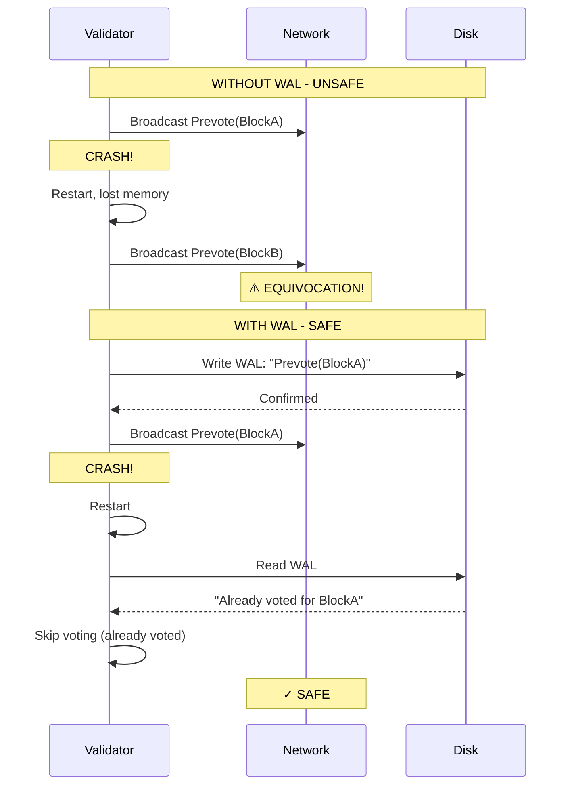

# Implementation Plan: Write-Ahead Log (WAL)

## Overview

This document provides a comprehensive implementation guide for the Tendermint Write-Ahead Log (WAL). The WAL is critical for safety - it ensures validators never double-vote after a crash by persisting voting decisions before broadcasting them.

**Estimated Effort**: 1 week
**Dependencies**:
- `01_MESSAGE_TYPES_AND_PROTOCOL_FOUNDATION.md`
- `04_CHAINACTOR_HANDLERS.md` (WAL usage in handlers)
- `11_STORAGE_SCHEMA_MIGRATION.md` (storage coordination)
**Files to Create**:
- `app/src/actors_v2/chain/tendermint/wal.rs`

**Cross-Document Type References**:
- `BlockHash` → Defined in `01_MESSAGE_TYPES_AND_PROTOCOL_FOUNDATION.md`
- `EquivocationEvidence` → Defined in `01_MESSAGE_TYPES_AND_PROTOCOL_FOUNDATION.md`
- `ChainError::WALError` → Must be added to `app/src/actors_v2/chain/error.rs`
- WAL writes in handlers → See `04_CHAINACTOR_HANDLERS.md` sections 3.1, 3.2, 3.3
- Storage height reconciliation → Coordinate with `11_STORAGE_SCHEMA_MIGRATION.md`

**Design Decisions**:
- **Serialization**: Uses `bincode` for compact binary serialization (consistent with storage layer)
- **Proposal Content**: Only `block_hash` is stored, not full block content. Blocks are deterministically built from mempool/state, so re-building after recovery produces the same block.
- **Corruption Handling**: Stops at first corrupted entry. Later entries may depend on corrupted state, and partial writes during crash make subsequent entries unreliable.

---

## 1. Why WAL is Critical

### 1.1 The Double-Vote Problem



### 1.2 Safety Invariant

**Critical Rule**: A validator MUST write to WAL BEFORE broadcasting any vote or proposal. This ensures that upon restart, the validator knows what votes it has already cast.

---

## 2. WAL Entry Types

### 2.1 Complete WAL Entry Enum

```rust
//! Write-Ahead Log for Tendermint consensus safety.
//!
//! The WAL ensures validators never double-vote after crashes by persisting
//! voting decisions before broadcasting them.
//!
//! # Safety Properties
//!
//! 1. **Durability**: Entries are fsync'd before any network broadcast
//! 2. **Atomicity**: Each entry is written atomically (length-prefixed)
//! 3. **Recoverability**: Full state can be reconstructed from WAL on restart

use super::types::*;
use serde::{Deserialize, Serialize};
use std::fs::{File, OpenOptions};
use std::io::{self, BufReader, BufWriter, Read, Write};
use std::path::{Path, PathBuf};
use tracing::{debug, info, warn, error};

/// WAL entry types
///
/// Each entry represents a state transition or action that must survive crashes.
#[derive(Debug, Clone, Serialize, Deserialize)]
pub enum WALEntry {
    // ═══════════════════════════════════════════════════════════════════
    // ROUND STATE
    // ═══════════════════════════════════════════════════════════════════

    /// Starting a new round (height or round change)
    ///
    /// Written at the start of each round. On recovery, allows jumping
    /// to the correct (height, round) position.
    NewRound {
        height: u64,
        round: u32,
    },

    // ═══════════════════════════════════════════════════════════════════
    // MESSAGES SENT (Critical for Safety)
    // ═══════════════════════════════════════════════════════════════════

    /// We created and will broadcast a proposal
    ///
    /// Written BEFORE broadcasting the proposal.
    SentProposal {
        height: u64,
        round: u32,
        block_hash: BlockHash,
    },

    /// We created and will broadcast a prevote
    ///
    /// Written BEFORE broadcasting the prevote.
    /// `block_hash = None` indicates a NIL vote.
    SentPrevote {
        height: u64,
        round: u32,
        block_hash: Option<BlockHash>,
    },

    /// We created and will broadcast a precommit
    ///
    /// Written BEFORE broadcasting the precommit.
    SentPrecommit {
        height: u64,
        round: u32,
        block_hash: Option<BlockHash>,
    },

    // ═══════════════════════════════════════════════════════════════════
    // LOCKING STATE
    // ═══════════════════════════════════════════════════════════════════

    /// We locked on a block (after seeing 2/3+ prevotes)
    ///
    /// Critical for ensuring we don't vote for conflicting blocks
    /// across rounds after a restart.
    Locked {
        round: u32,
        block_hash: BlockHash,
    },

    /// We unlocked (after seeing valid POL)
    Unlocked {
        previous_round: u32,
    },

    // ═══════════════════════════════════════════════════════════════════
    // COMMIT
    // ═══════════════════════════════════════════════════════════════════

    /// Block was committed (2/3+ precommits received)
    ///
    /// On recovery, allows skipping to the next height.
    Commit {
        height: u64,
        block_hash: BlockHash,
    },

    // ═══════════════════════════════════════════════════════════════════
    // EVIDENCE (See 15_VALIDATION_MODULE.md)
    // ═══════════════════════════════════════════════════════════════════

    /// We detected equivocation and will broadcast evidence
    ///
    /// Written BEFORE broadcasting evidence to prevent re-detection after crash.
    SentEvidence {
        height: u64,
        culprit: ValidatorId,
        evidence_hash: [u8; 32],
    },

    // ═══════════════════════════════════════════════════════════════════
    // LIVENESS STATE (See 16_AUXPOW_TENDERMINT_INTEGRATION.md)
    // ═══════════════════════════════════════════════════════════════════

    /// Blocks without AuxPoW counter update
    ///
    /// Persists the liveness gate counter to survive restarts.
    LivenessUpdate {
        height: u64,
        blocks_without_pow: u64,
    },
}

impl WALEntry {
    /// Get the height this entry pertains to
    pub fn height(&self) -> Option<u64> {
        match self {
            Self::NewRound { height, .. } => Some(*height),
            Self::SentProposal { height, .. } => Some(*height),
            Self::SentPrevote { height, .. } => Some(*height),
            Self::SentPrecommit { height, .. } => Some(*height),
            Self::Commit { height, .. } => Some(*height),
            Self::SentEvidence { height, .. } => Some(*height),
            Self::LivenessUpdate { height, .. } => Some(*height),
            Self::Locked { .. } | Self::Unlocked { .. } => None,
        }
    }

    /// Get entry type name for logging
    pub fn entry_type(&self) -> &'static str {
        match self {
            Self::NewRound { .. } => "NewRound",
            Self::SentProposal { .. } => "SentProposal",
            Self::SentPrevote { .. } => "SentPrevote",
            Self::SentPrecommit { .. } => "SentPrecommit",
            Self::Locked { .. } => "Locked",
            Self::Unlocked { .. } => "Unlocked",
            Self::Commit { .. } => "Commit",
            Self::SentEvidence { .. } => "SentEvidence",
            Self::LivenessUpdate { .. } => "LivenessUpdate",
        }
    }
}
```

---

## 3. WAL Implementation

### 3.1 Configuration

```rust
// In tendermint/wal.rs

/// WAL configuration parameters
#[derive(Debug, Clone)]
pub struct WALConfig {
    /// Directory for WAL file storage
    pub data_dir: PathBuf,

    /// WAL filename (default: "tendermint.wal")
    pub filename: String,

    /// Sync mode for durability vs performance trade-off
    pub sync_mode: SyncMode,

    /// Truncate WAL after this many committed heights
    pub truncate_after_commits: u64,

    /// Maximum WAL file size before forced truncation (optional)
    pub max_size_bytes: Option<u64>,
}

#[derive(Debug, Clone, Copy, Default)]
pub enum SyncMode {
    /// Sync after every write (safest, slowest)
    #[default]
    EveryWrite,

    /// Sync after batch of writes (balanced)
    Batched { batch_size: usize },

    /// Sync only on commit (fastest, least safe)
    OnCommitOnly,
}

impl Default for WALConfig {
    fn default() -> Self {
        Self {
            data_dir: PathBuf::from("/data/alys"),
            filename: "tendermint.wal".to_string(),
            sync_mode: SyncMode::EveryWrite,
            truncate_after_commits: 10,
            max_size_bytes: Some(100 * 1024 * 1024), // 100MB
        }
    }
}
```

### 3.2 Core WAL Structure

```rust
/// Write-Ahead Log for Tendermint consensus
///
/// # File Format
///
/// ```text
/// ┌────────────────────────────────────────────────────┐
/// │ Entry 1: [length: u32][crc32: u32][data: bytes]    │
/// │ Entry 2: [length: u32][crc32: u32][data: bytes]    │
/// │ ...                                                 │
/// └────────────────────────────────────────────────────┘
/// ```
///
/// Each entry is length-prefixed and CRC-protected for integrity.
///
/// # Thread Safety
///
/// WAL is designed to be wrapped in `Arc<RwLock<>>` for async access.
/// Write operations take exclusive locks; reads during recovery are sequential.
pub struct ConsensusWAL {
    /// File handle for writing
    file: BufWriter<File>,

    /// Path to the WAL file
    path: PathBuf,

    /// Current height (for truncation decisions)
    current_height: u64,

    /// Entries written since last sync (for batching)
    pending_entries: usize,
}

/// Errors that can occur during WAL operations
#[derive(Debug, thiserror::Error)]
pub enum WALError {
    #[error("IO error: {0}")]
    Io(#[from] io::Error),

    #[error("Serialization error: {0}")]
    Serialization(String),

    #[error("Deserialization error: {0}")]
    Deserialization(String),

    #[error("Checksum mismatch: expected {expected}, got {actual}")]
    ChecksumMismatch { expected: u32, actual: u32 },

    #[error("Corrupted entry at offset {offset}")]
    CorruptedEntry { offset: u64 },

    #[error("WAL file not found: {0}")]
    NotFound(PathBuf),
}

impl ConsensusWAL {
    /// Create or open a WAL file
    ///
    /// # Arguments
    ///
    /// * `data_dir` - Directory for storing WAL file
    ///
    /// # Example
    ///
    /// ```rust,ignore
    /// let wal = ConsensusWAL::new(Path::new("/data/alys"))?;
    /// ```
    pub fn new(data_dir: &Path) -> Result<Self, WALError> {
        let path = data_dir.join("tendermint.wal");

        // Ensure directory exists
        if let Some(parent) = path.parent() {
            std::fs::create_dir_all(parent)?;
        }

        // Open file for appending
        let file = OpenOptions::new()
            .create(true)
            .append(true)
            .open(&path)?;

        let file = BufWriter::new(file);

        info!(path = ?path, "Opened WAL file");

        Ok(Self {
            file,
            path,
            current_height: 0,
            pending_entries: 0,
        })
    }

    /// Write an entry to the WAL
    ///
    /// This method:
    /// 1. Serializes the entry
    /// 2. Computes CRC32 checksum
    /// 3. Writes length-prefixed entry
    /// 4. Calls fsync to ensure durability
    ///
    /// # Safety
    ///
    /// MUST be called BEFORE any network broadcast of the corresponding message.
    pub fn write(&mut self, entry: WALEntry) -> Result<(), WALError> {
        // Serialize entry
        let data = bincode::serialize(&entry)
            .map_err(|e| WALError::Serialization(e.to_string()))?;

        // Compute checksum
        let crc = crc32fast::hash(&data);

        // Write length prefix (u32, little-endian)
        let length = data.len() as u32;
        self.file.write_all(&length.to_le_bytes())?;

        // Write checksum
        self.file.write_all(&crc.to_le_bytes())?;

        // Write data
        self.file.write_all(&data)?;

        // Increment pending count
        self.pending_entries += 1;

        // Update current height
        if let Some(height) = entry.height() {
            self.current_height = height;
        }

        debug!(
            entry_type = entry.entry_type(),
            height = ?entry.height(),
            "WAL entry written"
        );

        // Sync to disk
        self.sync()?;

        Ok(())
    }

    /// Flush and sync to disk
    pub fn sync(&mut self) -> Result<(), WALError> {
        self.file.flush()?;
        self.file.get_ref().sync_all()?;
        self.pending_entries = 0;
        Ok(())
    }

    /// Replay all entries from the WAL file
    ///
    /// Used during recovery to reconstruct state after a crash.
    ///
    /// # Returns
    ///
    /// All valid entries in the WAL, in order.
    pub fn replay(&self) -> Result<Vec<WALEntry>, WALError> {
        let file = File::open(&self.path)?;
        let mut reader = BufReader::new(file);
        let mut entries = Vec::new();
        let mut offset: u64 = 0;

        loop {
            // Read length
            let mut length_buf = [0u8; 4];
            match reader.read_exact(&mut length_buf) {
                Ok(_) => {}
                Err(e) if e.kind() == io::ErrorKind::UnexpectedEof => break,
                Err(e) => return Err(e.into()),
            }
            let length = u32::from_le_bytes(length_buf) as usize;

            // Read checksum
            let mut crc_buf = [0u8; 4];
            reader.read_exact(&mut crc_buf)?;
            let expected_crc = u32::from_le_bytes(crc_buf);

            // Read data
            let mut data = vec![0u8; length];
            reader.read_exact(&mut data)?;

            // Verify checksum
            let actual_crc = crc32fast::hash(&data);
            if actual_crc != expected_crc {
                warn!(
                    offset,
                    expected = expected_crc,
                    actual = actual_crc,
                    "WAL checksum mismatch, stopping replay"
                );
                break; // Stop at first corruption (partial write during crash)
            }

            // Deserialize entry
            let entry: WALEntry = bincode::deserialize(&data)
                .map_err(|e| WALError::Deserialization(e.to_string()))?;

            entries.push(entry);
            offset += 4 + 4 + length as u64;
        }

        info!(
            entries_recovered = entries.len(),
            "WAL replay completed"
        );

        Ok(entries)
    }

    /// Truncate WAL entries before a given height
    ///
    /// Called after a height is fully committed and no longer needed for recovery.
    /// This prevents unbounded WAL growth.
    pub fn truncate_before(&mut self, height: u64) -> Result<(), WALError> {
        // Read all entries
        let entries = self.replay()?;

        // Filter entries to keep (height >= given height)
        let entries_to_keep: Vec<_> = entries
            .into_iter()
            .filter(|e| e.height().map_or(true, |h| h >= height))
            .collect();

        // Create new WAL file
        let temp_path = self.path.with_extension("wal.tmp");
        let temp_file = OpenOptions::new()
            .create(true)
            .write(true)
            .truncate(true)
            .open(&temp_path)?;

        let mut temp_writer = BufWriter::new(temp_file);

        // Write kept entries
        for entry in &entries_to_keep {
            let data = bincode::serialize(entry)
                .map_err(|e| WALError::Serialization(e.to_string()))?;
            let crc = crc32fast::hash(&data);
            let length = data.len() as u32;

            temp_writer.write_all(&length.to_le_bytes())?;
            temp_writer.write_all(&crc.to_le_bytes())?;
            temp_writer.write_all(&data)?;
        }

        temp_writer.flush()?;
        temp_writer.get_ref().sync_all()?;
        drop(temp_writer);

        // Atomic rename
        std::fs::rename(&temp_path, &self.path)?;

        // Reopen file
        let file = OpenOptions::new()
            .append(true)
            .open(&self.path)?;
        self.file = BufWriter::new(file);

        info!(
            truncated_before = height,
            entries_remaining = entries_to_keep.len(),
            "WAL truncated"
        );

        Ok(())
    }
}
```

### 3.3 File Locking

```rust
use fs2::FileExt;

impl ConsensusWAL {
    /// Create or open a WAL file with exclusive lock
    ///
    /// Prevents multiple processes from accessing the same WAL.
    pub fn new_with_lock(config: &WALConfig) -> Result<Self, WALError> {
        let path = config.data_dir.join(&config.filename);

        // Ensure directory exists
        if let Some(parent) = path.parent() {
            std::fs::create_dir_all(parent)?;
        }

        // Open file for appending
        let file = OpenOptions::new()
            .create(true)
            .read(true)
            .append(true)
            .open(&path)?;

        // Acquire exclusive lock (fails if another process holds it)
        file.try_lock_exclusive().map_err(|e| {
            WALError::Io(io::Error::new(
                io::ErrorKind::WouldBlock,
                format!("WAL file is locked by another process: {}", e)
            ))
        })?;

        let file = BufWriter::new(file);

        info!(path = ?path, "Opened WAL file with exclusive lock");

        Ok(Self {
            file,
            path,
            current_height: 0,
            pending_entries: 0,
            config: config.clone(),
        })
    }
}
```

### 3.4 Async Wrapper

The `ConsensusWAL` is synchronous for simplicity, but ChainActor needs async access:

```rust
// In actor.rs

use tokio::sync::RwLock;
use std::sync::Arc;

pub struct ChainActor {
    // ... other fields ...

    /// Write-ahead log for consensus safety
    /// Wrapped in RwLock for async access from handlers
    pub wal: Arc<RwLock<ConsensusWAL>>,
}

impl ChainActor {
    pub fn new(config: ChainConfig) -> Result<Self, ChainError> {
        let wal = ConsensusWAL::new_with_lock(&config.wal_config)
            .map_err(|e| ChainError::WALError(e.to_string()))?;

        Ok(Self {
            // ... other initialization ...
            wal: Arc::new(RwLock::new(wal)),
        })
    }
}

// Usage in handlers:
async fn cast_prevote(&self, block_hash: Option<BlockHash>) -> Result<(), ChainError> {
    // Acquire write lock, write entry, then release
    {
        let mut wal = self.wal.write().await;
        wal.write(WALEntry::SentPrevote {
            height: self.state.tendermint.height,
            round: self.state.tendermint.round,
            block_hash,
        }).map_err(|e| ChainError::WALError(e.to_string()))?;
    }
    // Lock released here

    // Now safe to broadcast
    self.broadcast_vote(block_hash).await
}
```

### 3.5 ChainError WAL Variant

```rust
// Add to app/src/actors_v2/chain/error.rs

#[derive(Debug, thiserror::Error)]
pub enum ChainError {
    // ... existing variants ...

    #[error("WAL error: {0}")]
    WALError(String),

    #[error("WAL/Storage height mismatch: WAL={wal_height}, Storage={storage_height}")]
    WALStorageMismatch { wal_height: u64, storage_height: u64 },
}

impl From<WALError> for ChainError {
    fn from(e: WALError) -> Self {
        ChainError::WALError(e.to_string())
    }
}
```

---

## 4. Recovery Logic

### 4.1 State Recovery from WAL

```rust
/// Recovered state from WAL replay
#[derive(Debug, Default)]
pub struct RecoveredState {
    /// Last committed height (start consensus at height + 1)
    pub last_committed_height: Option<u64>,

    /// Last committed block hash
    pub last_committed_block: Option<BlockHash>,

    /// Current round (if crashed mid-height)
    pub current_round: Option<u32>,

    /// Votes already sent at current height
    pub sent_prevotes: HashMap<u32, Option<BlockHash>>,  // round -> block_hash
    pub sent_precommits: HashMap<u32, Option<BlockHash>>,

    /// Lock state
    pub locked_round: Option<u32>,
    pub locked_block: Option<BlockHash>,

    /// Evidence already sent (to avoid re-broadcasting)
    pub sent_evidence: HashSet<[u8; 32]>,  // evidence_hash

    /// Liveness counter (blocks without AuxPoW)
    pub blocks_without_pow: u64,
}

impl RecoveredState {
    /// Recover state from WAL entries
    pub fn from_wal_entries(entries: Vec<WALEntry>) -> Self {
        let mut state = Self::default();
        let mut current_height: Option<u64> = None;

        for entry in entries {
            match entry {
                WALEntry::NewRound { height, round } => {
                    if current_height != Some(height) {
                        // New height - reset round-specific state
                        current_height = Some(height);
                        state.current_round = Some(round);
                        state.sent_prevotes.clear();
                        state.sent_precommits.clear();
                    } else {
                        state.current_round = Some(round);
                    }
                }

                WALEntry::SentPrevote { height, round, block_hash } => {
                    if current_height == Some(height) {
                        state.sent_prevotes.insert(round, block_hash);
                    }
                }

                WALEntry::SentPrecommit { height, round, block_hash } => {
                    if current_height == Some(height) {
                        state.sent_precommits.insert(round, block_hash);
                    }
                }

                WALEntry::Locked { round, block_hash } => {
                    state.locked_round = Some(round);
                    state.locked_block = Some(block_hash);
                }

                WALEntry::Unlocked { .. } => {
                    state.locked_round = None;
                    state.locked_block = None;
                }

                WALEntry::Commit { height, block_hash } => {
                    state.last_committed_height = Some(height);
                    state.last_committed_block = Some(block_hash);
                    // Clear height-specific state
                    state.sent_prevotes.clear();
                    state.sent_precommits.clear();
                    state.locked_round = None;
                    state.locked_block = None;
                    current_height = None;
                }

                WALEntry::SentProposal { .. } => {
                    // Proposals don't need special recovery handling
                    // (proposer selection is deterministic)
                }

                WALEntry::SentEvidence { evidence_hash, .. } => {
                    state.sent_evidence.insert(evidence_hash);
                }

                WALEntry::LivenessUpdate { blocks_without_pow, .. } => {
                    state.blocks_without_pow = blocks_without_pow;
                }
            }
        }

        state
    }

    /// Get the height to start consensus at
    pub fn start_height(&self) -> u64 {
        self.last_committed_height.map_or(1, |h| h + 1)
    }

    /// Check if we already voted prevote in a given round
    pub fn has_prevoted(&self, round: u32) -> Option<Option<BlockHash>> {
        self.sent_prevotes.get(&round).copied()
    }

    /// Check if we already voted precommit in a given round
    pub fn has_precommitted(&self, round: u32) -> Option<Option<BlockHash>> {
        self.sent_precommits.get(&round).copied()
    }
}
```

### 4.2 Integration with ChainActor Startup

```rust
// In actor.rs

impl ChainActor {
    /// Initialize Tendermint state from WAL on startup
    pub async fn recover_tendermint_state(&mut self) -> Result<(), ChainError> {
        // 1. Replay WAL
        let entries = {
            let wal = self.wal.read().await;
            wal.replay().map_err(|e| ChainError::WALError(e.to_string()))?
        };

        // 2. Recover state
        let recovered = RecoveredState::from_wal_entries(entries);

        info!(
            last_committed = ?recovered.last_committed_height,
            start_height = recovered.start_height(),
            locked = ?recovered.locked_block,
            "Recovered Tendermint state from WAL"
        );

        // 3. Initialize state machine at correct height
        let start_height = recovered.start_height();
        self.state.tendermint.new_height(
            start_height,
            self.state.tendermint.validator_set.clone(),
        );

        // 4. Restore locking state
        if let (Some(round), Some(block)) = (recovered.locked_round, recovered.locked_block) {
            self.state.tendermint.lock_on(round, block);
        }

        // 5. Restore vote tracking
        for (round, block_hash) in recovered.sent_prevotes {
            self.state.tendermint.sent_prevotes.insert(round, block_hash);
        }
        for (round, block_hash) in recovered.sent_precommits {
            self.state.tendermint.sent_precommits.insert(round, block_hash);
        }

        // 6. Restore liveness counter
        self.state.blocks_without_pow = recovered.blocks_without_pow;

        // 7. Restore evidence tracking
        self.state.sent_evidence = recovered.sent_evidence;

        // 8. Truncate old entries
        if let Some(committed_height) = recovered.last_committed_height {
            let mut wal = self.wal.write().await;
            wal.truncate_before(committed_height)?;
        }

        Ok(())
    }
}
```

### 4.3 WAL/Storage Height Reconciliation

On startup, WAL height and storage height should match. If they don't, storage is the source of truth:

```rust
impl ChainActor {
    /// Reconcile WAL state with storage state
    ///
    /// Storage is the source of truth because:
    /// 1. Storage is updated AFTER block finalization
    /// 2. WAL may have entries for uncommitted heights
    /// 3. If storage says height N is committed, WAL entries for N are stale
    pub async fn reconcile_wal_with_storage(&mut self) -> Result<(), ChainError> {
        // Get storage height
        let storage_height = self.storage_actor
            .send(StorageMessage::GetHeadHeight)
            .await?
            .map_err(|e| ChainError::Storage(e.to_string()))?;

        // Get WAL state
        let wal_state = {
            let wal = self.wal.read().await;
            let entries = wal.replay().map_err(|e| ChainError::WALError(e.to_string()))?;
            RecoveredState::from_wal_entries(entries)
        };

        let wal_height = wal_state.last_committed_height.unwrap_or(0);

        if wal_height != storage_height {
            warn!(
                wal_height,
                storage_height,
                "WAL/storage height mismatch - reconciling"
            );

            if wal_height > storage_height {
                // WAL is ahead - this shouldn't happen normally
                // Storage commit failed after WAL commit was written
                error!(
                    "WAL ahead of storage - possible incomplete commit. \
                     Manual investigation may be required."
                );
                return Err(ChainError::WALStorageMismatch {
                    wal_height,
                    storage_height,
                });
            }

            // Storage is ahead - WAL is stale (crashed before WAL commit write)
            // Truncate WAL to match storage and start fresh
            {
                let mut wal = self.wal.write().await;
                wal.truncate_before(storage_height + 1)?;
            }

            info!(
                new_start_height = storage_height + 1,
                "Reconciled WAL with storage"
            );
        }

        Ok(())
    }
}
```

### 4.4 Truncation Strategy

Truncation should be called periodically to prevent unbounded growth:

```rust
impl ChainActor {
    /// Called after committing a block
    async fn on_block_committed(&mut self, height: u64) -> Result<(), ChainError> {
        // ... commit logic ...

        // Truncate WAL periodically
        if height % self.config.wal.truncate_after_commits == 0 {
            let truncate_before = height.saturating_sub(self.config.wal.truncate_after_commits);
            let mut wal = self.wal.write().await;
            wal.truncate_before(truncate_before)?;
        }

        Ok(())
    }
}
```

---

## 5. Metrics

```rust
use prometheus::{Histogram, IntCounter, IntGauge, Opts, Registry};

lazy_static! {
    /// WAL write latency
    static ref WAL_WRITE_LATENCY: Histogram = Histogram::with_opts(
        prometheus::HistogramOpts::new(
            "tendermint_wal_write_latency_seconds",
            "Time to write and sync a WAL entry"
        )
        .buckets(vec![0.0001, 0.0005, 0.001, 0.005, 0.01, 0.05, 0.1])
    ).unwrap();

    /// WAL replay time
    static ref WAL_REPLAY_LATENCY: Histogram = Histogram::with_opts(
        prometheus::HistogramOpts::new(
            "tendermint_wal_replay_latency_seconds",
            "Time to replay WAL on startup"
        )
    ).unwrap();

    /// WAL file size
    static ref WAL_FILE_SIZE: IntGauge = IntGauge::new(
        "tendermint_wal_file_size_bytes",
        "Current WAL file size"
    ).unwrap();

    /// WAL entries written
    static ref WAL_ENTRIES_WRITTEN: IntCounter = IntCounter::new(
        "tendermint_wal_entries_written_total",
        "Total WAL entries written"
    ).unwrap();

    /// WAL entries recovered
    static ref WAL_ENTRIES_RECOVERED: IntGauge = IntGauge::new(
        "tendermint_wal_entries_recovered",
        "Number of entries recovered on last replay"
    ).unwrap();

    /// WAL truncations
    static ref WAL_TRUNCATIONS: IntCounter = IntCounter::new(
        "tendermint_wal_truncations_total",
        "Total WAL truncation operations"
    ).unwrap();
}

pub fn register_wal_metrics(registry: &Registry) {
    registry.register(Box::new(WAL_WRITE_LATENCY.clone())).ok();
    registry.register(Box::new(WAL_REPLAY_LATENCY.clone())).ok();
    registry.register(Box::new(WAL_FILE_SIZE.clone())).ok();
    registry.register(Box::new(WAL_ENTRIES_WRITTEN.clone())).ok();
    registry.register(Box::new(WAL_ENTRIES_RECOVERED.clone())).ok();
    registry.register(Box::new(WAL_TRUNCATIONS.clone())).ok();
}

// Usage in ConsensusWAL::write():
pub fn write(&mut self, entry: WALEntry) -> Result<(), WALError> {
    let start = std::time::Instant::now();

    // ... write logic ...

    WAL_WRITE_LATENCY.observe(start.elapsed().as_secs_f64());
    WAL_ENTRIES_WRITTEN.inc();

    Ok(())
}
```

---

## 6. Usage in Handlers

### 5.1 Writing Before Broadcast

```rust
// Example from handlers.rs

impl ChainActor {
    async fn cast_prevote(&self, block_hash: Option<BlockHash>) -> Result<(), ChainError> {
        let state = &self.state.tendermint;

        // Check if already voted (from memory or WAL recovery)
        if state.has_voted_prevote() {
            debug!("Already voted prevote this round");
            return Ok(());
        }

        // ═══════════════════════════════════════════════════════════════
        // CRITICAL: Write to WAL BEFORE broadcast
        // ═══════════════════════════════════════════════════════════════
        {
            let mut wal = self.wal.write().await;
            wal.write(WALEntry::SentPrevote {
                height: state.height,
                round: state.round,
                block_hash,
            })?;
        }
        // WAL is synced (fsync'd) at this point

        // Now safe to record in memory and broadcast
        self.state.tendermint.record_prevote(block_hash);

        let vote = self.create_vote(VoteType::Prevote, block_hash)?;
        self.broadcast_tendermint_message(TendermintMessage::Vote(vote)).await?;

        Ok(())
    }
}
```

---

## 7. Testing Strategy

```rust
#[cfg(test)]
mod tests {
    use super::*;
    use tempfile::tempdir;

    #[test]
    fn test_wal_write_and_replay() {
        let dir = tempdir().unwrap();
        let mut wal = ConsensusWAL::new(dir.path()).unwrap();

        // Write entries
        wal.write(WALEntry::NewRound { height: 100, round: 0 }).unwrap();
        wal.write(WALEntry::SentPrevote {
            height: 100,
            round: 0,
            block_hash: Some(BlockHash::repeat_byte(0xAB)),
        }).unwrap();
        wal.write(WALEntry::Commit {
            height: 100,
            block_hash: BlockHash::repeat_byte(0xAB),
        }).unwrap();

        // Replay
        let entries = wal.replay().unwrap();
        assert_eq!(entries.len(), 3);

        match &entries[0] {
            WALEntry::NewRound { height, round } => {
                assert_eq!(*height, 100);
                assert_eq!(*round, 0);
            }
            _ => panic!("Wrong entry type"),
        }
    }

    #[test]
    fn test_recovery_state() {
        let entries = vec![
            WALEntry::NewRound { height: 100, round: 0 },
            WALEntry::SentPrevote {
                height: 100,
                round: 0,
                block_hash: Some(BlockHash::repeat_byte(0xAB)),
            },
            WALEntry::Locked {
                round: 0,
                block_hash: BlockHash::repeat_byte(0xAB),
            },
            WALEntry::Commit {
                height: 100,
                block_hash: BlockHash::repeat_byte(0xAB),
            },
        ];

        let recovered = RecoveredState::from_wal_entries(entries);

        assert_eq!(recovered.last_committed_height, Some(100));
        assert_eq!(recovered.start_height(), 101);
        // Lock state cleared after commit
        assert!(recovered.locked_block.is_none());
    }

    #[test]
    fn test_truncation() {
        let dir = tempdir().unwrap();
        let mut wal = ConsensusWAL::new(dir.path()).unwrap();

        // Write entries for multiple heights
        for height in 100..105 {
            wal.write(WALEntry::NewRound { height, round: 0 }).unwrap();
            wal.write(WALEntry::Commit {
                height,
                block_hash: BlockHash::repeat_byte(height as u8),
            }).unwrap();
        }

        // Truncate before height 103
        wal.truncate_before(103).unwrap();

        // Verify only heights >= 103 remain
        let entries = wal.replay().unwrap();
        let heights: Vec<_> = entries.iter()
            .filter_map(|e| e.height())
            .collect();

        assert!(heights.iter().all(|&h| h >= 103));
    }

    #[test]
    fn test_file_locking() {
        let dir = tempdir().unwrap();
        let config = WALConfig {
            data_dir: dir.path().to_path_buf(),
            ..Default::default()
        };

        // First open succeeds
        let _wal1 = ConsensusWAL::new_with_lock(&config).unwrap();

        // Second open fails due to lock
        let result = ConsensusWAL::new_with_lock(&config);
        assert!(result.is_err());
    }

    #[test]
    fn test_recovery_after_crash_during_prevote() {
        let dir = tempdir().unwrap();
        let mut wal = ConsensusWAL::new(dir.path()).unwrap();

        // Simulate: Started round, sent prevote, then crashed
        wal.write(WALEntry::NewRound { height: 100, round: 0 }).unwrap();
        wal.write(WALEntry::SentPrevote {
            height: 100,
            round: 0,
            block_hash: Some(BlockHash::repeat_byte(0xAB)),
        }).unwrap();
        // CRASH - no commit written

        // Recovery
        let entries = wal.replay().unwrap();
        let recovered = RecoveredState::from_wal_entries(entries);

        // Should know we already voted
        assert!(recovered.has_prevoted(0).is_some());
        assert_eq!(recovered.has_prevoted(0).unwrap(), Some(BlockHash::repeat_byte(0xAB)));

        // Should NOT have a committed height
        assert!(recovered.last_committed_height.is_none());
    }

    #[test]
    fn test_recovery_with_corrupted_entry() {
        let dir = tempdir().unwrap();
        let path = dir.path().join("tendermint.wal");

        // Write valid entries
        {
            let mut wal = ConsensusWAL::new(dir.path()).unwrap();
            wal.write(WALEntry::NewRound { height: 100, round: 0 }).unwrap();
            wal.write(WALEntry::Commit {
                height: 100,
                block_hash: BlockHash::repeat_byte(0xAB),
            }).unwrap();
        }

        // Append garbage (simulates partial write during crash)
        {
            let mut file = OpenOptions::new().append(true).open(&path).unwrap();
            file.write_all(&[0xFF, 0xFF, 0xFF, 0xFF]).unwrap();
        }

        // Recovery should stop at corruption but return valid entries
        let wal = ConsensusWAL::new(dir.path()).unwrap();
        let entries = wal.replay().unwrap();

        // Should have the two valid entries
        assert_eq!(entries.len(), 2);
    }

    #[test]
    fn test_evidence_recovery() {
        let entries = vec![
            WALEntry::NewRound { height: 100, round: 0 },
            WALEntry::SentEvidence {
                height: 100,
                culprit: ValidatorId(5),
                evidence_hash: [0xAB; 32],
            },
        ];

        let recovered = RecoveredState::from_wal_entries(entries);

        assert!(recovered.sent_evidence.contains(&[0xAB; 32]));
    }

    #[test]
    fn test_liveness_counter_recovery() {
        let entries = vec![
            WALEntry::Commit {
                height: 99,
                block_hash: BlockHash::repeat_byte(0x99),
            },
            WALEntry::NewRound { height: 100, round: 0 },
            WALEntry::LivenessUpdate {
                height: 100,
                blocks_without_pow: 42,
            },
        ];

        let recovered = RecoveredState::from_wal_entries(entries);

        assert_eq!(recovered.blocks_without_pow, 42);
    }
}
```

---

## 8. Checklist

### Core WAL Implementation
- [ ] Create `tendermint/wal.rs`
- [ ] Implement `WALEntry` enum with all entry types (consensus + evidence + liveness)
- [ ] Implement `WALConfig` struct
- [ ] Implement `WALError` enum
- [ ] Implement `ConsensusWAL` struct
- [ ] Implement `new_with_lock()` with file locking
- [ ] Implement `write()` with length-prefix and CRC
- [ ] Implement `replay()` for recovery
- [ ] Implement `truncate_before()` for cleanup
- [ ] Implement `sync()` with configurable sync modes

### Recovery Logic
- [ ] Implement `RecoveredState` struct with all fields
- [ ] Implement `from_wal_entries()` for state reconstruction
- [ ] Handle new entry types (SentEvidence, LivenessUpdate)
- [ ] Integrate WAL recovery into ChainActor startup
- [ ] Implement `reconcile_wal_with_storage()`
- [ ] Implement periodic truncation in `on_block_committed()`

### ChainActor Integration
- [ ] Add `wal: Arc<RwLock<ConsensusWAL>>` field to ChainActor
- [ ] Add `ChainError::WALError` variant
- [ ] Add `ChainError::WALStorageMismatch` variant
- [ ] Implement `recover_tendermint_state()` method
- [ ] Ensure all vote handlers write to WAL before broadcast
- [ ] Ensure all proposal handlers write to WAL before broadcast
- [ ] Ensure evidence handlers write to WAL before broadcast
- [ ] Write liveness updates to WAL on block commit

### Metrics
- [ ] Add `WAL_WRITE_LATENCY` histogram
- [ ] Add `WAL_REPLAY_LATENCY` histogram
- [ ] Add `WAL_FILE_SIZE` gauge
- [ ] Add `WAL_ENTRIES_WRITTEN` counter
- [ ] Add `WAL_ENTRIES_RECOVERED` gauge
- [ ] Add `WAL_TRUNCATIONS` counter
- [ ] Implement `register_wal_metrics()`

### Testing
- [ ] Write unit tests for write/replay
- [ ] Write unit tests for recovery logic
- [ ] Write unit test for truncation
- [ ] Write unit test for file locking
- [ ] Write crash simulation tests:
  - [ ] Crash during prevote
  - [ ] Crash during precommit
  - [ ] Crash during commit
  - [ ] Crash with corrupted last entry
- [ ] Write WAL/storage reconciliation tests
- [ ] Write integration test with ChainActor

---

## 9. Appendix: Peg-In Queue Persistence

**Note**: The `queued_pegins` map (from `16_AUXPOW_TENDERMINT_INTEGRATION.md`) is NOT stored in WAL because:

1. **Reconstruction possible**: Peg-ins can be re-submitted by miners after restart
2. **Deduplication prevents issues**: Four-layer dedup prevents double-processing
3. **WAL is for consensus safety**: WAL focuses on preventing equivocation, not caching data

If peg-in persistence is desired for faster recovery, consider:
- Storing in RocksDB column family (CF_PENDING_PEGINS)
- Or accepting that miners will re-submit after node restart

---

*Implementation Plan Version: 2.0*
*Last Updated: February 2026*
*Changes in 2.0: Added configuration, async wrapper, file locking, evidence/liveness entries, height reconciliation, metrics, expanded checklist*
