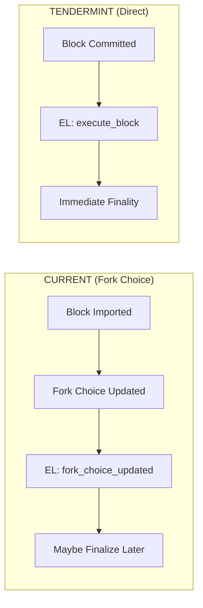
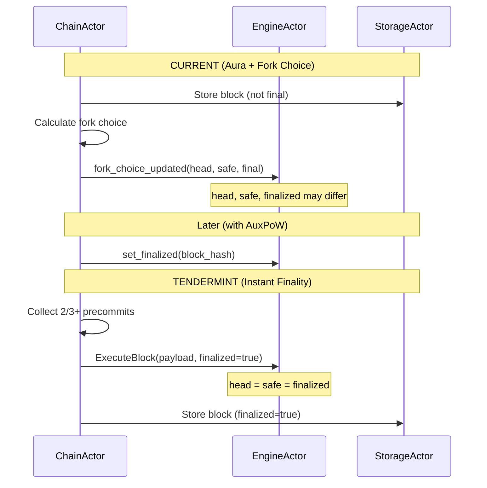

# Implementation Plan: Execution Layer Coordination

## Overview

This document provides a comprehensive implementation guide for coordinating between Tendermint consensus (CL) and the Execution Layer (EL). This replaces the current `fork_choice_updated` pattern with a simpler direct execution model appropriate for Tendermint's instant finality.

**Estimated Effort**: 1 week
**Dependencies**:
- `02_STATE_MACHINE.md`
- `04_CHAINACTOR_HANDLERS.md`
**Files to Modify**:
- `app/src/actors_v2/chain/handlers.rs`
- `app/src/actors_v2/engine/messages.rs`
- `app/src/actors_v2/engine/actor.rs`

---

## 1. Conceptual Change

### 1.1 Current vs New EL Coordination



### 1.2 Key Differences

| Aspect | Current (Aura) | Tendermint |
|--------|----------------|------------|
| Finality timing | Delayed (needs AuxPoW) | Immediate (on commit) |
| Fork choice | Cumulative difficulty | Not needed |
| EL notification | `fork_choice_updated` | Direct execution |
| Head/Safe/Finalized | Three separate values | All same value |

---

## 2. New EL Message Pattern

### 2.1 ExecuteBlockMessage

```rust
// In engine/messages.rs

/// Request to execute and finalize a block
///
/// Unlike `fork_choice_updated`, this is a direct execution request
/// for a block that has already achieved consensus finality through
/// Tendermint.
#[derive(Debug, Clone, Message)]
#[rtype(result = "Result<ExecuteBlockResponse, EngineError>")]
pub struct ExecuteBlockMessage {
    /// The execution payload to execute
    pub execution_payload: ExecutionPayloadCapella,

    /// Whether this block is immediately final (always true for Tendermint)
    pub finalized: bool,

    /// Parent execution block hash (for validation)
    pub parent_hash: ExecutionBlockHash,

    /// Correlation ID for tracing
    pub correlation_id: Option<Uuid>,
}

/// Response from block execution
#[derive(Debug, Clone)]
pub struct ExecuteBlockResponse {
    /// Status of the execution
    pub status: PayloadStatus,

    /// Block hash after execution
    pub block_hash: ExecutionBlockHash,

    /// Gas used
    pub gas_used: u64,
}

#[derive(Debug, Clone, PartialEq)]
pub enum PayloadStatus {
    /// Block is valid and was executed successfully
    Valid,

    /// Block is invalid (bad transactions, state root mismatch, etc.)
    Invalid { reason: String },

    /// Block validation is in progress
    Syncing,

    /// Parent block is unknown
    Accepted,
}
```

### 2.2 Handler Implementation

```rust
// In engine/actor.rs

impl Handler<ExecuteBlockMessage> for EngineActor {
    type Result = ResponseFuture<Result<ExecuteBlockResponse, EngineError>>;

    fn handle(&mut self, msg: ExecuteBlockMessage, _ctx: &mut Context<Self>) -> Self::Result {
        let engine = self.engine.clone();

        Box::pin(async move {
            // 1. Validate parent exists
            let parent = engine.get_block_by_hash(msg.parent_hash).await?
                .ok_or(EngineError::UnknownParent(msg.parent_hash))?;

            // 2. Execute the payload
            let result = engine.execute_payload(&msg.execution_payload).await?;

            match result.status {
                PayloadStatus::Valid => {
                    // 3. If finalized (always true for Tendermint), update state
                    if msg.finalized {
                        engine.set_finalized(result.block_hash).await?;
                        engine.set_safe(result.block_hash).await?;
                        engine.set_head(result.block_hash).await?;
                    }

                    Ok(ExecuteBlockResponse {
                        status: PayloadStatus::Valid,
                        block_hash: result.block_hash,
                        gas_used: result.gas_used,
                    })
                }
                PayloadStatus::Invalid { reason } => {
                    Err(EngineError::InvalidPayload(reason))
                }
                _ => {
                    Err(EngineError::UnexpectedStatus(result.status))
                }
            }
        })
    }
}
```

---

## 3. Block Finalization Flow

### 3.1 Complete Commit Flow

```rust
// In chain/handlers.rs

impl ChainActor {
    /// Finalize a committed block through the EL
    ///
    /// Called after 2/3+ precommits are received for a block.
    /// This is the final step in Tendermint consensus.
    ///
    /// # Flow
    ///
    /// ```text
    /// finalize_committed_block(block, commit)
    ///   ├─ 1. Validate commit proof
    ///   ├─ 2. Execute block in EL
    ///   ├─ 3. Store block in consensus storage
    ///   ├─ 4. Store commit proof
    ///   ├─ 5. Update chain head
    ///   └─ 6. Emit events
    /// ```
    pub async fn finalize_committed_block(
        &self,
        block: &ConsensusBlock<MainnetEthSpec>,
        commit: Commit,
    ) -> Result<(), ChainError> {
        let height = block.slot; // slot == height in Tendermint mode
        let block_hash = block.hash();

        info!(
            height,
            block_hash = ?block_hash,
            signers = commit.num_signers(),
            "Finalizing committed block"
        );

        // 1. Validate commit proof
        self.validate_commit(&commit, block_hash)?;

        // 2. Execute in EL
        let engine = self.engine_actor.as_ref()
            .ok_or(ChainError::EngineActorNotSet)?;

        let parent_hash = block.execution_payload.parent_hash.clone();

        let execute_result = engine.send(ExecuteBlockMessage {
            execution_payload: block.execution_payload.clone(),
            finalized: true, // Always true for Tendermint
            parent_hash,
            correlation_id: None,
        }).await
            .map_err(|e| ChainError::ActorMailbox(e.to_string()))?
            .map_err(|e| ChainError::ExecutionLayerError(e.to_string()))?;

        if execute_result.status != PayloadStatus::Valid {
            return Err(ChainError::ExecutionFailed(format!(
                "Payload status: {:?}",
                execute_result.status
            )));
        }

        // 3. Store consensus block
        let storage = self.storage_actor.as_ref()
            .ok_or(ChainError::StorageActorNotSet)?;

        storage.send(StoreBlockMessage {
            block: SignedConsensusBlock::from_commit(block.clone(), commit.clone()),
            canonical: true,
            finalized: true,
            correlation_id: None,
        }).await
            .map_err(|e| ChainError::ActorMailbox(e.to_string()))?
            .map_err(|e| ChainError::Storage(e.to_string()))?;

        // 4. Store commit proof (for light clients and sync)
        storage.send(StoreCommitMessage {
            height,
            commit: commit.clone(),
            correlation_id: None,
        }).await
            .map_err(|e| ChainError::ActorMailbox(e.to_string()))?
            .map_err(|e| ChainError::Storage(e.to_string()))?;

        // 5. Update chain head
        let block_ref = BlockRef {
            hash: block_hash,
            height,
            execution_hash: execute_result.block_hash,
        };

        storage.send(UpdateChainHeadMessage {
            block_ref: block_ref.clone(),
            correlation_id: None,
        }).await
            .map_err(|e| ChainError::ActorMailbox(e.to_string()))?
            .map_err(|e| ChainError::Storage(e.to_string()))?;

        // Update local state
        self.state.head = Some(block_ref);

        // 6. Emit metrics
        TENDERMINT_BLOCKS_COMMITTED.inc();
        TENDERMINT_BLOCK_HEIGHT.set(height as i64);
        TENDERMINT_BLOCK_GAS_USED.observe(execute_result.gas_used as f64);

        info!(
            height,
            block_hash = ?block_hash,
            gas_used = execute_result.gas_used,
            "Block finalized successfully"
        );

        Ok(())
    }

    /// Validate a commit proof
    fn validate_commit(&self, commit: &Commit, expected_hash: BlockHash) -> Result<(), ChainError> {
        // 1. Check block hash matches
        if commit.block_hash != expected_hash {
            return Err(ChainError::CommitHashMismatch {
                expected: expected_hash,
                actual: commit.block_hash,
            });
        }

        // 2. Check we have 2/3+ signers
        let num_signers = commit.num_signers();
        let threshold = self.state.tendermint.validator_set.two_thirds_threshold() as usize;

        if num_signers < threshold {
            return Err(ChainError::InsufficientCommitSigners {
                have: num_signers,
                need: threshold,
            });
        }

        // 3. Verify aggregate signature
        let validator_set = &self.state.tendermint.validator_set;
        let signing_keys: Vec<_> = commit.signers.iter()
            .enumerate()
            .filter(|(_, &signed)| signed)
            .filter_map(|(i, _)| validator_set.get_public_key(&ValidatorId(i as u8)).ok())
            .cloned()
            .collect();

        // Create signing root for verification
        let signing_root = compute_precommit_signing_root(
            commit.height,
            commit.round,
            commit.block_hash,
        );

        // Verify aggregate signature
        if !commit.aggregate_signature.verify(&signing_keys, signing_root) {
            return Err(ChainError::InvalidCommitSignature);
        }

        Ok(())
    }
}
```

---

## 4. Removal of Fork Choice

### 4.1 Code to Remove

The following fork-choice related code becomes obsolete:

```rust
// REMOVE: fork_choice.rs (entire file)
// REMOVE: reorganization.rs (entire file)

// In handlers.rs, REMOVE:
// - handle_import_block's fork choice logic
// - compare_blocks_with_difficulty calls
// - reorganize_to_new_tip calls

// In state.rs, REMOVE:
// - cumulative_difficulty field
// - difficulty_cache field
// - Related methods
```

### 4.2 Migration Strategy

```rust
// Create feature flag for gradual migration

#[cfg(feature = "tendermint")]
impl ChainActor {
    // New Tendermint handlers
    async fn handle_tendermint_proposal(&self, ...) { ... }
    async fn handle_tendermint_vote(&self, ...) { ... }
}

#[cfg(not(feature = "tendermint"))]
impl ChainActor {
    // Keep old Aura handlers
    async fn handle_import_block(&self, ...) { ... }
}
```

---

## 5. Comparison: Before and After

### 5.1 Block Import Flow



### 5.2 State Differences

| State | Current (Aura) | Tendermint |
|-------|----------------|------------|
| `head` | Latest imported block | Latest committed block |
| `safe` | Block with enough votes | Same as head |
| `finalized` | Block with AuxPoW | Same as head |
| Tracking needed | All three | Just one |

---

## 6. Storage Changes

### 6.1 New Storage Messages

```rust
// In storage/messages.rs

/// Store a commit proof for a height
#[derive(Debug, Clone, Message)]
#[rtype(result = "Result<(), StorageError>")]
pub struct StoreCommitMessage {
    pub height: u64,
    pub commit: Commit,
    pub correlation_id: Option<Uuid>,
}

/// Get commit proof for a height
#[derive(Debug, Clone, Message)]
#[rtype(result = "Result<Option<Commit>, StorageError>")]
pub struct GetCommitMessage {
    pub height: u64,
    pub correlation_id: Option<Uuid>,
}
```

### 6.2 Block Storage Schema

```rust
// Storage schema for Tendermint blocks

/// Key-value pairs stored:
/// - `block:{hash}` -> SignedConsensusBlock (with commit)
/// - `block_by_height:{height}` -> block_hash
/// - `commit:{height}` -> Commit proof
/// - `chain_head` -> BlockRef
/// - `latest_finalized` -> height (always == chain_head in Tendermint)
```

---

## 7. Metrics

```rust
use prometheus::{IntCounter, IntGauge, Histogram, HistogramOpts};

lazy_static! {
    /// Blocks committed through Tendermint
    static ref TENDERMINT_BLOCKS_COMMITTED: IntCounter = IntCounter::new(
        "tendermint_blocks_committed",
        "Number of blocks committed through Tendermint"
    ).unwrap();

    /// Current block height
    static ref TENDERMINT_BLOCK_HEIGHT: IntGauge = IntGauge::new(
        "tendermint_block_height",
        "Current Tendermint block height"
    ).unwrap();

    /// Gas used per block
    static ref TENDERMINT_BLOCK_GAS_USED: Histogram = Histogram::with_opts(
        HistogramOpts::new(
            "tendermint_block_gas_used",
            "Gas used per committed block"
        )
    ).unwrap();

    /// Block commit latency
    static ref TENDERMINT_COMMIT_LATENCY: Histogram = Histogram::with_opts(
        HistogramOpts::new(
            "tendermint_commit_latency_seconds",
            "Time from proposal to commit"
        )
    ).unwrap();
}
```

---

## 8. Testing Strategy

```rust
#[cfg(test)]
mod tests {
    use super::*;

    #[tokio::test]
    async fn test_execute_block_finalized() {
        let engine = setup_test_engine().await;
        let block = create_test_block();

        let result = engine.send(ExecuteBlockMessage {
            execution_payload: block.execution_payload.clone(),
            finalized: true,
            parent_hash: block.execution_payload.parent_hash.clone(),
            correlation_id: None,
        }).await.unwrap().unwrap();

        assert_eq!(result.status, PayloadStatus::Valid);

        // Verify head, safe, finalized are all updated
        let head = engine.send(GetHeadMessage {}).await.unwrap().unwrap();
        let finalized = engine.send(GetFinalizedMessage {}).await.unwrap().unwrap();

        assert_eq!(head, result.block_hash);
        assert_eq!(finalized, result.block_hash);
    }

    #[tokio::test]
    async fn test_commit_proof_validation() {
        let actor = setup_test_chain_actor().await;
        let block = create_test_block();

        // Valid commit with 11/15 signatures
        let valid_commit = create_commit_with_signers(11);
        assert!(actor.validate_commit(&valid_commit, block.hash()).is_ok());

        // Invalid commit with only 10/15 signatures
        let invalid_commit = create_commit_with_signers(10);
        assert!(actor.validate_commit(&invalid_commit, block.hash()).is_err());
    }

    #[tokio::test]
    async fn test_full_finalization_flow() {
        let actor = setup_test_chain_actor().await;
        let block = create_test_block();
        let commit = create_valid_commit(&block);

        let result = actor.finalize_committed_block(&block.message, commit).await;

        assert!(result.is_ok());

        // Verify block is stored
        let stored = actor.storage_actor.as_ref().unwrap()
            .send(GetBlockMessage { hash: block.hash(), correlation_id: None })
            .await.unwrap().unwrap();

        assert!(stored.is_some());
    }
}
```

---

## 9. Checklist

- [ ] Add `ExecuteBlockMessage` to engine messages
- [ ] Implement `ExecuteBlockMessage` handler in EngineActor
- [ ] Implement `finalize_committed_block` in ChainActor
- [ ] Implement `validate_commit` method
- [ ] Add `StoreCommitMessage` to storage messages
- [ ] Implement commit storage handler
- [ ] Remove fork choice code (with feature flag)
- [ ] Remove reorganization code (with feature flag)
- [ ] Add metrics for block finalization
- [ ] Write unit tests for execution
- [ ] Write unit tests for commit validation
- [ ] Write integration test for full flow

---

*Implementation Plan Version: 1.0*
*Last Updated: January 2026*
