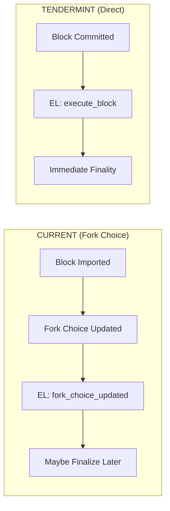
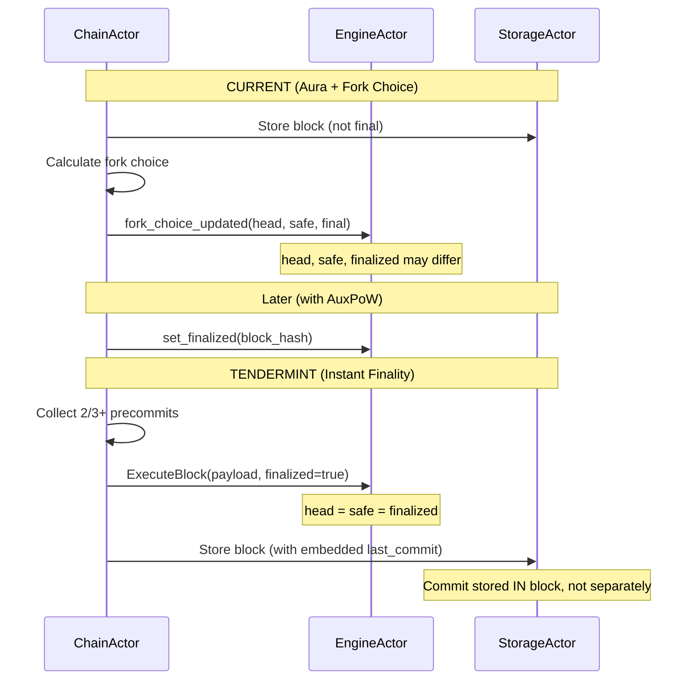

# Implementation Plan: Execution Layer Coordination

## Overview

This document provides a comprehensive implementation guide for coordinating between Tendermint consensus (CL) and the Execution Layer (EL). This replaces the current `fork_choice_updated` pattern with a simpler direct execution model appropriate for Tendermint's instant finality.

**Key Design Decision**: Following standard Tendermint/CometBFT architecture, **LastCommit is embedded in the block structure**. Block N contains the commit proof for Block N-1. The EL coordination handles block execution and finalization based on this embedded commit model.

**Estimated Effort**: 1 week
**Dependencies**:
- `01_MESSAGE_TYPES_AND_PROTOCOL_FOUNDATION.md` (Commit, CommitSig, BlockIDFlag)
- `02_STATE_MACHINE.md` (TendermintState)
- `04_CHAINACTOR_HANDLERS.md` (block handling)
- `11_STORAGE_SCHEMA_MIGRATION.md` (embedded LastCommit design)
- `13_BRIDGE_INTEGRATION.md` (withdrawals/peg-in conversion)
- `16_AUXPOW_TENDERMINT_INTEGRATION.md` (peg-in to withdrawal flow)
**Files to Modify**:
- `app/src/actors_v2/chain/handlers.rs`
- `app/src/actors_v2/engine/messages.rs`
- `app/src/actors_v2/engine/actor.rs`
- `app/src/actors_v2/engine/error.rs`
- `app/src/actors_v2/chain/error.rs`

---

## Cross-Document Type References

| Type | Defined In | Usage Here |
|------|-----------|------------|
| `Commit` | `01_MESSAGE_TYPES` | Commit proof for finalized blocks |
| `CommitSig` | `01_MESSAGE_TYPES` | Individual validator signatures in commit |
| `BlockIDFlag` | `01_MESSAGE_TYPES` | Commit/Nil/Absent status per validator |
| `TendermintState` | `02_STATE_MACHINE` | Contains `pending_commit`, `validator_set` |
| `ValidatorSet` | `02_STATE_MACHINE` | For signature verification |
| `ConsensusBlock` | `01_MESSAGE_TYPES` | Block structure with `last_commit` field |
| `ExecutionPayloadCapella` | External (lighthouse) | EL payload format |
| `Withdrawal` | `13_BRIDGE_INTEGRATION` | Peg-in tokens in execution payload |

---

## 1. Conceptual Change

### 1.1 Current vs New EL Coordination



### 1.2 Block Structure with Embedded LastCommit

```
Block N (being finalized):
├── parent_hash: hash(Block N-1)
├── slot: N
├── last_commit: Commit for Block N-1  ← Proves N-1 is final
│   ├── height: N-1
│   ├── round: R
│   ├── block_hash: hash(Block N-1)
│   └── signatures: [CommitSig, ...]
├── execution_payload
└── ... other fields
```

### 1.3 Key Differences

| Aspect | Current (Aura) | Tendermint |
|--------|----------------|------------|
| Finality timing | Delayed (needs AuxPoW) | Immediate (on commit) |
| Fork choice | Cumulative difficulty | Not needed |
| EL notification | `fork_choice_updated` | Direct execution |
| Head/Safe/Finalized | Three separate values | All same value |
| Commit storage | N/A | Embedded in next block |

---

## 2. New EL Message Pattern

### 2.1 ExecuteBlockMessage

```rust
// In engine/messages.rs

/// Request to execute and finalize a block
///
/// Unlike `fork_choice_updated`, this is a direct execution request
/// for a block that has already achieved consensus finality through
/// Tendermint.
#[derive(Debug, Clone, Message)]
#[rtype(result = "Result<ExecuteBlockResponse, EngineError>")]
pub struct ExecuteBlockMessage {
    /// The execution payload to execute
    pub execution_payload: ExecutionPayloadCapella,

    /// Whether this block is immediately final (always true for Tendermint)
    pub finalized: bool,

    /// Parent execution block hash (for validation)
    pub parent_hash: ExecutionBlockHash,

    /// Correlation ID for tracing
    pub correlation_id: Option<Uuid>,
}

/// Response from block execution
#[derive(Debug, Clone)]
pub struct ExecuteBlockResponse {
    /// Status of the execution
    pub status: PayloadStatus,

    /// Block hash after execution
    pub block_hash: ExecutionBlockHash,

    /// Gas used
    pub gas_used: u64,
}

#[derive(Debug, Clone, PartialEq)]
pub enum PayloadStatus {
    /// Block is valid and was executed successfully
    Valid,

    /// Block is invalid (bad transactions, state root mismatch, etc.)
    Invalid { reason: String },

    /// Block validation is in progress
    Syncing,

    /// Parent block is unknown
    Accepted,
}
```

### 2.2 EngineError Variants for Tendermint

Add these variants to `engine/error.rs`:

```rust
// In engine/error.rs - add to existing EngineError enum

#[derive(Debug, Clone, thiserror::Error)]
pub enum EngineError {
    // ... existing variants ...

    /// Parent block not found in EL
    #[error("Unknown parent block: {0:?}")]
    UnknownParent(ExecutionBlockHash),

    /// Payload validation/execution failed
    #[error("Invalid payload: {0}")]
    InvalidPayload(String),

    /// Unexpected status from EL
    #[error("Unexpected payload status: {0:?}")]
    UnexpectedStatus(PayloadStatus),

    /// EL communication timeout
    #[error("EL request timed out after {0:?}")]
    RequestTimeout(std::time::Duration),

    /// EL returned error during execution
    #[error("Execution failed: {0}")]
    ExecutionFailed(String),
}
```

### 2.3 Handler Implementation

```rust
// In engine/actor.rs

impl Handler<ExecuteBlockMessage> for EngineActor {
    type Result = ResponseFuture<Result<ExecuteBlockResponse, EngineError>>;

    fn handle(&mut self, msg: ExecuteBlockMessage, _ctx: &mut Context<Self>) -> Self::Result {
        let engine = self.engine.clone();

        Box::pin(async move {
            // 1. Validate parent exists
            let parent = engine.get_block_by_hash(msg.parent_hash).await?
                .ok_or(EngineError::UnknownParent(msg.parent_hash))?;

            // 2. Execute the payload
            let result = engine.execute_payload(&msg.execution_payload).await?;

            match result.status {
                PayloadStatus::Valid => {
                    // 3. If finalized (always true for Tendermint), update state
                    if msg.finalized {
                        engine.set_finalized(result.block_hash).await?;
                        engine.set_safe(result.block_hash).await?;
                        engine.set_head(result.block_hash).await?;
                    }

                    Ok(ExecuteBlockResponse {
                        status: PayloadStatus::Valid,
                        block_hash: result.block_hash,
                        gas_used: result.gas_used,
                    })
                }
                PayloadStatus::Invalid { reason } => {
                    Err(EngineError::InvalidPayload(reason))
                }
                _ => {
                    Err(EngineError::UnexpectedStatus(result.status))
                }
            }
        })
    }
}
```

### 2.4 ChainError Variants for EL Coordination

Add these variants to `chain/error.rs`:

```rust
// In chain/error.rs - add to existing ChainError enum

#[derive(Debug, Error)]
pub enum ChainError {
    // ... existing variants ...

    /// EngineActor address not configured
    #[error("EngineActor not set")]
    EngineActorNotSet,

    /// Commit hash doesn't match expected block
    #[error("Commit hash mismatch: expected {expected:?}, got {actual:?}")]
    CommitHashMismatch {
        expected: BlockHash,
        actual: BlockHash,
    },

    /// Not enough validators signed the commit
    #[error("Insufficient commit signers: have {have}, need {need}")]
    InsufficientCommitSigners {
        have: usize,
        need: usize,
    },

    /// Invalid signature in commit
    #[error("Invalid commit signature")]
    InvalidCommitSignature,

    /// EL execution failed
    #[error("Execution failed: {0}")]
    ExecutionFailed(String),

    /// EL returned error
    #[error("Execution layer error: {0}")]
    ExecutionLayerError(String),

    /// EL request timed out
    #[error("EL timeout after {0:?}")]
    ElTimeout(std::time::Duration),
}
```

### 2.5 EL Timeout Handling

EL communication may timeout during block finalization. Handle gracefully:

```rust
impl ChainActor {
    /// Execute block with timeout and retry
    async fn execute_with_timeout(
        &self,
        msg: ExecuteBlockMessage,
    ) -> Result<ExecuteBlockResponse, ChainError> {
        let engine = self.engine_actor.as_ref()
            .ok_or(ChainError::EngineActorNotSet)?;

        const EL_TIMEOUT: Duration = Duration::from_secs(30);
        const MAX_RETRIES: u32 = 3;

        let mut last_error = None;

        for attempt in 0..MAX_RETRIES {
            match tokio::time::timeout(
                EL_TIMEOUT,
                engine.send(msg.clone())
            ).await {
                Ok(Ok(Ok(response))) => return Ok(response),
                Ok(Ok(Err(engine_err))) => {
                    // EL returned an error - don't retry for invalid payloads
                    match &engine_err {
                        EngineError::InvalidPayload(_) => {
                            return Err(ChainError::ExecutionLayerError(engine_err.to_string()));
                        }
                        _ => {
                            warn!(attempt, error = ?engine_err, "EL error, retrying");
                            last_error = Some(ChainError::ExecutionLayerError(engine_err.to_string()));
                        }
                    }
                }
                Ok(Err(mailbox_err)) => {
                    return Err(ChainError::ActorMailbox(mailbox_err.to_string()));
                }
                Err(_timeout) => {
                    warn!(attempt, "EL request timed out, retrying");
                    last_error = Some(ChainError::ElTimeout(EL_TIMEOUT));
                    EL_TIMEOUTS.inc();
                }
            }

            // Exponential backoff before retry
            tokio::time::sleep(Duration::from_millis(100 * 2u64.pow(attempt))).await;
        }

        Err(last_error.unwrap_or(ChainError::ElTimeout(EL_TIMEOUT)))
    }
}
```

**Consensus Implications of EL Timeout:**
- During proposal: Skip this round, let next proposer try
- During finalization: Block consensus until EL responds or timeout
- Critical: Never commit a block without successful EL execution

---

## 3. Block Finalization Flow

### 3.1 Understanding Finality with Embedded LastCommit

When we finalize Block N, the commit proof for N will be embedded in Block N+1:

```
Timeline:
  Block N produced → Validators precommit → Commit(N) created
                                                   ↓
  Block N+1 proposed ← includes Commit(N) as last_commit ←─┘
```

The `finalize_committed_block` function:
1. Receives the block and its commit (collected from precommits)
2. Executes the block in EL
3. Stores the block
4. The commit will be embedded in the NEXT block's `last_commit` field

### 3.2 Complete Commit Flow

```rust
// In chain/handlers.rs

impl ChainActor {
    /// Finalize a committed block through the EL
    ///
    /// Called after 2/3+ precommits are received for a block.
    /// This is the final step in Tendermint consensus.
    ///
    /// # Flow
    ///
    /// ```text
    /// finalize_committed_block(block, commit)
    ///   ├─ 1. Validate commit proof
    ///   ├─ 2. Execute block in EL
    ///   ├─ 3. Store block in consensus storage
    ///   ├─ 4. Update chain head
    ///   ├─ 5. Cache commit for next block's last_commit
    ///   └─ 6. Emit metrics/events
    /// ```
    ///
    /// # Note on Commit Storage
    ///
    /// The commit is NOT stored separately. Instead:
    /// - The commit is cached in memory
    /// - When Block N+1 is proposed, it includes this commit as `last_commit`
    /// - The commit is persisted as part of Block N+1
    ///
    pub async fn finalize_committed_block(
        &mut self,
        block: &ConsensusBlock<MainnetEthSpec>,
        commit: Commit,
    ) -> Result<(), ChainError> {
        let height = block.slot;
        let block_hash = block.hash();

        info!(
            height,
            block_hash = ?block_hash,
            commit_signers = commit.num_commit_signatures(),
            "Finalizing committed block"
        );

        // 1. Validate commit proof
        self.validate_commit(&commit, block_hash)?;

        // 2. Execute in EL
        let engine = self.engine_actor.as_ref()
            .ok_or(ChainError::EngineActorNotSet)?;

        let parent_hash = block.execution_payload.parent_hash.clone();

        let execute_result = engine.send(ExecuteBlockMessage {
            execution_payload: block.execution_payload.clone(),
            finalized: true, // Always true for Tendermint
            parent_hash,
            correlation_id: None,
        }).await
            .map_err(|e| ChainError::ActorMailbox(e.to_string()))?
            .map_err(|e| ChainError::ExecutionLayerError(e.to_string()))?;

        if execute_result.status != PayloadStatus::Valid {
            return Err(ChainError::ExecutionFailed(format!(
                "Payload status: {:?}",
                execute_result.status
            )));
        }

        // 3. Store consensus block
        // Note: The block's own last_commit (if present) proves the PREVIOUS block
        let storage = self.storage_actor.as_ref()
            .ok_or(ChainError::StorageActorNotSet)?;

        storage.send(StoreBlockMessage {
            block: block.clone().into_signed(), // Block with its own last_commit
            correlation_id: None,
        }).await
            .map_err(|e| ChainError::ActorMailbox(e.to_string()))?
            .map_err(|e| ChainError::Storage(e.to_string()))?;

        // 4. Update chain head
        let block_ref = BlockRef {
            hash: block_hash,
            height,
            execution_hash: execute_result.block_hash,
        };

        storage.send(UpdateChainHeadMessage {
            block_ref: block_ref.clone(),
            correlation_id: None,
        }).await
            .map_err(|e| ChainError::ActorMailbox(e.to_string()))?
            .map_err(|e| ChainError::Storage(e.to_string()))?;

        // Update local state
        self.state.head = Some(block_ref);

        // 5. Cache this commit for embedding in the NEXT block
        // When we propose Block N+1, we'll include this as last_commit
        self.state.tendermint.pending_commit = Some(commit.clone());

        // 6. Emit metrics
        TENDERMINT_BLOCKS_COMMITTED.inc();
        TENDERMINT_BLOCK_HEIGHT.set(height as i64);
        TENDERMINT_BLOCK_GAS_USED.observe(execute_result.gas_used as f64);

        info!(
            height,
            block_hash = ?block_hash,
            gas_used = execute_result.gas_used,
            "Block finalized successfully"
        );

        Ok(())
    }

    /// Validate a commit proof
    ///
    /// Verifies that the commit:
    /// 1. References the correct block hash
    /// 2. Has 2/3+ validator signatures
    /// 3. All signatures are valid
    fn validate_commit(&self, commit: &Commit, expected_hash: BlockHash) -> Result<(), ChainError> {
        // 1. Check block hash matches
        if commit.block_hash != expected_hash {
            return Err(ChainError::CommitHashMismatch {
                expected: expected_hash,
                actual: commit.block_hash,
            });
        }

        // 2. Check we have 2/3+ signers
        let num_signers = commit.num_commit_signatures();
        let threshold = self.state.tendermint.validator_set.two_thirds_threshold() as usize;

        if num_signers < threshold {
            return Err(ChainError::InsufficientCommitSigners {
                have: num_signers,
                need: threshold,
            });
        }

        // 3. Verify each signature
        let validator_set = &self.state.tendermint.validator_set;
        let signing_root = compute_precommit_signing_root(
            commit.height,
            commit.round,
            commit.block_hash,
        );

        for commit_sig in &commit.signatures {
            // Skip absent validators
            if commit_sig.block_id_flag != BlockIDFlag::Commit {
                continue;
            }

            let validator_id = commit_sig.validator_address
                .ok_or(ChainError::InvalidCommitSignature)?;

            let signature = commit_sig.signature.as_ref()
                .ok_or(ChainError::InvalidCommitSignature)?;

            let pubkey = validator_set.get_public_key(&validator_id)
                .map_err(|_| ChainError::InvalidCommitSignature)?;

            if !signature.verify(pubkey, signing_root) {
                return Err(ChainError::InvalidCommitSignature);
            }
        }

        Ok(())
    }
}

/// Compute the signing root for a precommit vote
///
/// This is what validators sign when sending a precommit.
/// Defined in 01_MESSAGE_TYPES_AND_PROTOCOL_FOUNDATION.md
fn compute_precommit_signing_root(
    height: u64,
    round: u32,
    block_hash: BlockHash,
) -> Hash256 {
    use sha2::{Sha256, Digest};

    let mut hasher = Sha256::new();
    hasher.update(b"TENDERMINT_PRECOMMIT");
    hasher.update(height.to_le_bytes());
    hasher.update(round.to_le_bytes());
    hasher.update(block_hash.as_bytes());

    Hash256::from_slice(&hasher.finalize())
}
```

### 3.3 Block Proposal with Embedded LastCommit

When proposing a new block, embed the cached commit:

```rust
impl ChainActor {
    /// Create a new block proposal with embedded last_commit
    pub async fn create_block_proposal(
        &mut self,
        height: u64,
    ) -> Result<ConsensusBlock<MainnetEthSpec>, ChainError> {
        // Get execution payload from EL
        let execution_payload = self.get_execution_payload(height).await?;

        // Get parent hash
        let parent_hash = self.state.head
            .as_ref()
            .map(|h| h.hash)
            .unwrap_or(Hash256::zero());

        // Get the cached commit for the previous block
        // This will be embedded as last_commit
        let last_commit = if height > 0 {
            self.state.tendermint.pending_commit.take()
        } else {
            None // Genesis has no last_commit
        };

        let block = ConsensusBlock {
            parent_hash,
            slot: height,
            last_commit,  // Embedded commit for previous block
            auxpow_header: None,
            execution_payload,
            pegins: vec![],
            pegout_payment_proposal: None,
            finalized_pegouts: vec![],
        };

        Ok(block)
    }

    /// Get execution payload from the EL for a new block
    ///
    /// This requests the EL to build a payload including:
    /// - Pending transactions from mempool
    /// - Withdrawals from peg-in queue (see doc 13, 16)
    /// - Random value, timestamp, etc.
    ///
    /// Integration with Withdrawals (doc 13 BRIDGE_INTEGRATION):
    /// - Peg-ins are converted to EVM Withdrawals via collect_withdrawals()
    async fn get_execution_payload(
        &self,
        height: u64,
    ) -> Result<ExecutionPayloadCapella, ChainError> {
        let engine = self.engine_actor.as_ref()
            .ok_or(ChainError::EngineActorNotSet)?;

        // Get parent execution hash
        let parent_exec_hash = self.state.head
            .as_ref()
            .map(|h| h.execution_hash)
            .unwrap_or_default();

        // Collect withdrawals from peg-in queue
        // See doc 13 (BRIDGE_INTEGRATION) Section 2.3
        // See doc 16 (AUXPOW_TENDERMINT_INTEGRATION) for peg-in flow
        let withdrawals = self.collect_pegin_withdrawals().await?;

        // Request payload from EL
        let timestamp = std::time::SystemTime::now()
            .duration_since(std::time::UNIX_EPOCH)
            .unwrap()
            .as_secs();

        let payload_attributes = PayloadAttributes {
            timestamp,
            prev_randao: self.get_randao_for_height(height),
            suggested_fee_recipient: self.config.fee_recipient,
            withdrawals: Some(withdrawals),
        };

        // Start payload building
        let payload_id = engine.send(PreparePayloadMessage {
            parent_hash: parent_exec_hash,
            payload_attributes,
            correlation_id: None,
        }).await
            .map_err(|e| ChainError::ActorMailbox(e.to_string()))?
            .map_err(|e| ChainError::ExecutionLayerError(e.to_string()))?;

        // Get the built payload
        let payload = engine.send(GetPayloadMessage {
            payload_id,
            correlation_id: None,
        }).await
            .map_err(|e| ChainError::ActorMailbox(e.to_string()))?
            .map_err(|e| ChainError::ExecutionLayerError(e.to_string()))?;

        Ok(payload)
    }

    /// Collect pending peg-ins and convert to EVM withdrawals
    ///
    /// See doc 13 (BRIDGE_INTEGRATION) Section 2.3 for full implementation
    async fn collect_pegin_withdrawals(&self) -> Result<Vec<Withdrawal>, ChainError> {
        // Implementation in chain/withdrawals.rs
        // Converts PegInInfo -> Withdrawal with miner fee split
        todo!("See doc 13 for WithdrawalCollector implementation")
    }
}
```

---

## 4. Removal of Fork Choice

### 4.1 Code to Remove

The following fork-choice related code becomes obsolete:

```rust
// REMOVE: fork_choice.rs (entire file)
// REMOVE: reorganization.rs (entire file)

// In handlers.rs, REMOVE:
// - handle_import_block's fork choice logic
// - compare_blocks_with_difficulty calls
// - reorganize_to_new_tip calls

// In state.rs, REMOVE:
// - cumulative_difficulty field
// - difficulty_cache field
// - Related methods
```

### 4.2 Migration Strategy

```rust
// Create feature flag for gradual migration

#[cfg(feature = "tendermint")]
impl ChainActor {
    // New Tendermint handlers
    async fn handle_tendermint_proposal(&self, ...) { ... }
    async fn handle_tendermint_vote(&self, ...) { ... }
}

#[cfg(not(feature = "tendermint"))]
impl ChainActor {
    // Keep old Aura handlers
    async fn handle_import_block(&self, ...) { ... }
}
```

---

## 5. Comparison: Before and After

### 5.1 Block Import Flow



### 5.2 State Differences

| State | Current (Aura) | Tendermint |
|-------|----------------|------------|
| `head` | Latest imported block | Latest committed block |
| `safe` | Block with enough votes | Same as head |
| `finalized` | Block with AuxPoW | Same as head |
| Tracking needed | All three | Just one |
| Commit storage | N/A | Embedded in next block |

---

## 6. Storage Integration

### 6.1 Commit Storage Pattern

Following the embedded LastCommit design from Document 11:

```
┌─────────────────────────────────────────────────────────────┐
│                    Storage Schema                           │
├─────────────────────────────────────────────────────────────┤
│ CF_BLOCKS: Blocks with embedded last_commit                 │
│   - Block N contains last_commit proving Block N-1          │
│                                                             │
│ CF_VALIDATOR_SETS: Height-based validator sets (H+2 rule)   │
│ CF_CHECKPOINTS: AuxPoW checkpoint proofs                    │
│                                                             │
│ NOTE: NO CF_COMMITS - commits are embedded in blocks        │
└─────────────────────────────────────────────────────────────┘
```

### 6.2 Retrieving Commits

To get the commit for a specific height, fetch the NEXT block:

```rust
impl ChainActor {
    /// Get the commit that finalized a block at the given height.
    ///
    /// Returns Block[height+1].last_commit
    pub async fn get_commit_for_height(&self, height: u64) -> Result<Option<Commit>, ChainError> {
        // Genesis has no commit
        if height == 0 {
            return Ok(None);
        }

        // Get the NEXT block which contains the commit for this height
        let storage = self.storage_actor.as_ref()
            .ok_or(ChainError::StorageActorNotSet)?;

        let next_block = storage.send(GetBlockByHeightMessage {
            height: height + 1,
            correlation_id: None,
        }).await
            .map_err(|e| ChainError::ActorMailbox(e.to_string()))?
            .map_err(|e| ChainError::Storage(e.to_string()))?;

        match next_block {
            Some(block) => Ok(block.message.last_commit),
            None => Ok(None), // Next block doesn't exist yet
        }
    }
}
```

### 6.3 Block Re-execution During Sync

When the SyncActor catches up with the chain (doc 09), blocks must be re-executed through the EL:

```rust
impl ChainActor {
    /// Execute a synced block through the EL
    ///
    /// Called by SyncActor when importing historical blocks.
    /// Similar to finalize_committed_block but:
    /// - Block already has embedded last_commit (proves previous block)
    /// - We verify the commit and execute
    /// - State root is verified after execution
    pub async fn execute_synced_block(
        &mut self,
        block: &SignedConsensusBlock<MainnetEthSpec>,
    ) -> Result<(), ChainError> {
        let height = block.message.slot;
        let block_hash = block.message.hash();

        // 1. Verify last_commit proves the previous block (if not genesis)
        if height > 1 {
            if let Some(last_commit) = &block.message.last_commit {
                // Get the previous block to verify the commit
                let prev_hash = block.message.parent_hash;
                self.validate_commit(last_commit, prev_hash)?;
            } else {
                return Err(ChainError::InvalidBlock(
                    format!("Block {} missing last_commit", height)
                ));
            }
        }

        // 2. Execute in EL (idempotent - EL handles already-executed blocks)
        let execute_result = self.execute_with_timeout(ExecuteBlockMessage {
            execution_payload: block.message.execution_payload.clone(),
            finalized: true,
            parent_hash: block.message.execution_payload.parent_hash.clone(),
            correlation_id: None,
        }).await?;

        // 3. Verify state root matches (optional but recommended)
        // The execution payload contains the expected state_root
        // EL returns the computed state_root after execution
        // These should match for valid blocks
        if execute_result.status != PayloadStatus::Valid {
            return Err(ChainError::ExecutionFailed(format!(
                "Synced block {} execution failed: {:?}",
                height, execute_result.status
            )));
        }

        // 4. Store block (already has embedded last_commit)
        let storage = self.storage_actor.as_ref()
            .ok_or(ChainError::StorageActorNotSet)?;

        storage.send(StoreBlockMessage {
            block: block.clone(),
            correlation_id: None,
        }).await
            .map_err(|e| ChainError::ActorMailbox(e.to_string()))?
            .map_err(|e| ChainError::Storage(e.to_string()))?;

        // 5. Update head
        let block_ref = BlockRef {
            hash: block_hash,
            height,
            execution_hash: execute_result.block_hash,
        };
        self.state.head = Some(block_ref);

        SYNC_BLOCKS_EXECUTED.inc();
        debug!(height, "Synced block executed successfully");

        Ok(())
    }
}
```

**Idempotency Note**: The EL should handle re-execution of already-executed blocks gracefully. If the block was already executed (e.g., during a restart), the EL returns `PayloadStatus::Valid` without re-processing.

---

## 7. Metrics

```rust
use prometheus::{IntCounter, IntGauge, Histogram, HistogramOpts};

lazy_static! {
    /// Blocks committed through Tendermint
    static ref TENDERMINT_BLOCKS_COMMITTED: IntCounter = IntCounter::new(
        "tendermint_blocks_committed",
        "Number of blocks committed through Tendermint"
    ).unwrap();

    /// Current block height
    static ref TENDERMINT_BLOCK_HEIGHT: IntGauge = IntGauge::new(
        "tendermint_block_height",
        "Current Tendermint block height"
    ).unwrap();

    /// Gas used per block
    static ref TENDERMINT_BLOCK_GAS_USED: Histogram = Histogram::with_opts(
        HistogramOpts::new(
            "tendermint_block_gas_used",
            "Gas used per committed block"
        )
    ).unwrap();

    /// Block commit latency
    static ref TENDERMINT_COMMIT_LATENCY: Histogram = Histogram::with_opts(
        HistogramOpts::new(
            "tendermint_commit_latency_seconds",
            "Time from proposal to commit"
        )
    ).unwrap();

    /// EL request timeouts
    static ref EL_TIMEOUTS: IntCounter = IntCounter::new(
        "el_request_timeouts_total",
        "Number of EL requests that timed out"
    ).unwrap();

    /// EL execution latency
    static ref EL_EXECUTION_LATENCY: Histogram = Histogram::with_opts(
        HistogramOpts::new(
            "el_execution_latency_seconds",
            "Time for EL to execute a block"
        )
    ).unwrap();

    /// Blocks executed during sync
    static ref SYNC_BLOCKS_EXECUTED: IntCounter = IntCounter::new(
        "sync_blocks_executed_total",
        "Number of blocks executed during sync catchup"
    ).unwrap();
}
```

---

## 8. Testing Strategy

```rust
#[cfg(test)]
mod tests {
    use super::*;

    #[tokio::test]
    async fn test_execute_block_finalized() {
        let engine = setup_test_engine().await;
        let block = create_test_block();

        let result = engine.send(ExecuteBlockMessage {
            execution_payload: block.execution_payload.clone(),
            finalized: true,
            parent_hash: block.execution_payload.parent_hash.clone(),
            correlation_id: None,
        }).await.unwrap().unwrap();

        assert_eq!(result.status, PayloadStatus::Valid);

        // Verify head, safe, finalized are all updated
        let head = engine.send(GetHeadMessage {}).await.unwrap().unwrap();
        let finalized = engine.send(GetFinalizedMessage {}).await.unwrap().unwrap();

        assert_eq!(head, result.block_hash);
        assert_eq!(finalized, result.block_hash);
    }

    #[tokio::test]
    async fn test_commit_proof_validation() {
        let actor = setup_test_chain_actor().await;
        let block = create_test_block();

        // Valid commit with 11/15 signatures
        let valid_commit = create_commit_with_signers(11);
        assert!(actor.validate_commit(&valid_commit, block.hash()).is_ok());

        // Invalid commit with only 10/15 signatures
        let invalid_commit = create_commit_with_signers(10);
        assert!(actor.validate_commit(&invalid_commit, block.hash()).is_err());
    }

    #[tokio::test]
    async fn test_full_finalization_flow() {
        let mut actor = setup_test_chain_actor().await;
        let block = create_test_block();
        let commit = create_valid_commit(&block);

        let result = actor.finalize_committed_block(&block.message, commit.clone()).await;
        assert!(result.is_ok());

        // Verify block is stored
        let stored = actor.storage_actor.as_ref().unwrap()
            .send(GetBlockMessage { hash: block.hash(), correlation_id: None })
            .await.unwrap().unwrap();
        assert!(stored.is_some());

        // Verify commit is cached for next block
        assert!(actor.state.tendermint.pending_commit.is_some());
    }

    #[tokio::test]
    async fn test_block_proposal_includes_last_commit() {
        let mut actor = setup_test_chain_actor().await;

        // Finalize block 0
        let block0 = create_genesis_block();
        let commit0 = create_valid_commit(&block0);
        actor.finalize_committed_block(&block0.message, commit0.clone()).await.unwrap();

        // Create proposal for block 1
        let block1 = actor.create_block_proposal(1).await.unwrap();

        // Block 1 should have last_commit for block 0
        assert!(block1.last_commit.is_some());
        let last_commit = block1.last_commit.unwrap();
        assert_eq!(last_commit.height, 0);
        assert_eq!(last_commit.block_hash, block0.hash());
    }

    #[tokio::test]
    async fn test_get_commit_for_height() {
        let mut actor = setup_test_chain_actor().await;

        // Finalize blocks 0 and 1
        let block0 = create_genesis_block();
        let commit0 = create_valid_commit(&block0);
        actor.finalize_committed_block(&block0.message, commit0.clone()).await.unwrap();

        let block1 = actor.create_block_proposal(1).await.unwrap();
        let commit1 = create_valid_commit_for_block(&block1);
        actor.finalize_committed_block(&block1, commit1.clone()).await.unwrap();

        // Get commit for block 0 (should be in block 1's last_commit)
        let retrieved = actor.get_commit_for_height(0).await.unwrap();
        assert!(retrieved.is_some());
        assert_eq!(retrieved.unwrap().height, 0);

        // Get commit for block 1 (next block doesn't exist yet)
        let tip_commit = actor.get_commit_for_height(1).await.unwrap();
        assert!(tip_commit.is_none()); // Block 2 doesn't exist
    }
}
```

### 8.1 Testing Helpers

```rust
// Test utilities for EL coordination tests

/// Create a mock EngineActor for testing
async fn setup_test_engine() -> Addr<MockEngineActor> {
    MockEngineActor::new()
        .with_execution_result(PayloadStatus::Valid)
        .start()
}

/// Create a mock ChainActor with initialized TendermintState
async fn setup_test_chain_actor() -> ChainActor {
    let mut actor = ChainActor::new_for_test();
    actor.state.tendermint = TendermintState {
        validator_set: create_test_validator_set(15),
        pending_commit: None,
        blocks_without_pow: 0,
        current_height: 0,
        current_round: 0,
    };
    actor
}

/// Create a test block with execution payload
fn create_test_block() -> ConsensusBlock<MainnetEthSpec> {
    ConsensusBlock {
        parent_hash: Hash256::zero(),
        slot: 1,
        last_commit: None,
        auxpow_header: None,
        execution_payload: create_test_execution_payload(),
        pegins: vec![],
        pegout_payment_proposal: None,
        finalized_pegouts: vec![],
    }
}

/// Create genesis block (height 0)
fn create_genesis_block() -> SignedConsensusBlock<MainnetEthSpec> {
    SignedConsensusBlock {
        message: ConsensusBlock {
            parent_hash: Hash256::zero(),
            slot: 0,
            last_commit: None, // Genesis has no last_commit
            auxpow_header: None,
            execution_payload: create_genesis_payload(),
            pegins: vec![],
            pegout_payment_proposal: None,
            finalized_pegouts: vec![],
        },
        signature: Signature::empty(),
    }
}

/// Create a valid commit with the specified number of signers
fn create_commit_with_signers(num_signers: usize) -> Commit {
    let validators = create_test_validator_set(15);
    let mut signatures = Vec::new();

    for i in 0..15 {
        if i < num_signers {
            signatures.push(CommitSig {
                block_id_flag: BlockIDFlag::Commit,
                validator_address: Some(validators.validators[i].address),
                timestamp: 0,
                signature: Some(create_test_signature(i)),
            });
        } else {
            signatures.push(CommitSig {
                block_id_flag: BlockIDFlag::Absent,
                validator_address: None,
                timestamp: 0,
                signature: None,
            });
        }
    }

    Commit {
        height: 0,
        round: 0,
        block_hash: Hash256::zero(),
        signatures,
    }
}

/// Create a valid commit for a specific block
fn create_valid_commit(block: &SignedConsensusBlock<MainnetEthSpec>) -> Commit {
    let mut commit = create_commit_with_signers(11); // 11/15 = 73% > 2/3
    commit.height = block.message.slot;
    commit.block_hash = block.message.hash();
    commit
}

fn create_valid_commit_for_block(block: &ConsensusBlock<MainnetEthSpec>) -> Commit {
    let mut commit = create_commit_with_signers(11);
    commit.height = block.slot;
    commit.block_hash = block.hash();
    commit
}

/// Create a test validator set
fn create_test_validator_set(size: usize) -> ValidatorSet {
    // See doc 02 (STATE_MACHINE) for ValidatorSet implementation
    ValidatorSet::new_for_test(size)
}

/// Create test execution payload
fn create_test_execution_payload() -> ExecutionPayloadCapella {
    // Minimal valid payload for testing
    ExecutionPayloadCapella::default()
}
```

---

## 9. Checklist

### EL Coordination
- [ ] Add `ExecuteBlockMessage` to engine messages
- [ ] Add `ExecuteBlockResponse` and `PayloadStatus` types
- [ ] Implement `ExecuteBlockMessage` handler in EngineActor
- [ ] Implement `finalize_committed_block` in ChainActor
- [ ] Implement `validate_commit` method with `CommitSig`/`BlockIDFlag`
- [ ] Implement `compute_precommit_signing_root` helper

### Error Types
- [ ] Add `EngineError` variants: `UnknownParent`, `InvalidPayload`, `UnexpectedStatus`, `RequestTimeout`
- [ ] Add `ChainError` variants: `EngineActorNotSet`, `CommitHashMismatch`, `InsufficientCommitSigners`, `InvalidCommitSignature`, `ExecutionFailed`, `ExecutionLayerError`, `ElTimeout`

### EL Timeout Handling
- [ ] Implement `execute_with_timeout` with retry logic
- [ ] Add exponential backoff for transient failures
- [ ] Add `EL_TIMEOUTS` metric

### Embedded LastCommit Integration
- [ ] Add `pending_commit` to TendermintState
- [ ] Implement `create_block_proposal` with embedded `last_commit`
- [ ] Implement `get_commit_for_height` (fetches from next block)
- [ ] **DO NOT** add separate commit storage

### Payload Building (doc 13 integration)
- [ ] Implement `get_execution_payload` method
- [ ] Add `PreparePayloadMessage` and `GetPayloadMessage` support
- [ ] Integrate `collect_pegin_withdrawals` for peg-in tokens

### Sync Integration (doc 09)
- [ ] Implement `execute_synced_block` for catch-up
- [ ] Verify `last_commit` during sync block import
- [ ] Add `SYNC_BLOCKS_EXECUTED` metric

### Code Removal
- [ ] Remove fork choice code (with feature flag)
- [ ] Remove reorganization code (with feature flag)

### Testing
- [ ] Add metrics for block finalization
- [ ] Add testing helpers (`setup_test_engine`, `create_commit_with_signers`, etc.)
- [ ] Write unit tests for execution
- [ ] Write unit tests for commit validation
- [ ] Write unit tests for embedded last_commit
- [ ] Write unit tests for EL timeout handling
- [ ] Write unit tests for sync block execution
- [ ] Write integration test for full flow

---

## 10. Correlation ID Usage

The `correlation_id` field in messages enables distributed tracing across actors:

```rust
/// When to use correlation IDs:

// 1. User-initiated operations (API calls, RPC requests)
let correlation_id = Some(Uuid::new_v4());
engine.send(ExecuteBlockMessage {
    // ...
    correlation_id,  // Pass to all downstream calls
}).await;

// 2. Consensus-initiated operations (proposals, votes)
// Generate at consensus round start, propagate through all handlers
let round_correlation_id = Uuid::new_v4();

// 3. Sync operations
// Generate per sync batch for tracing block downloads
let sync_batch_id = Uuid::new_v4();
```

**Logging with Correlation ID:**
```rust
use tracing::instrument;

#[instrument(skip(self), fields(correlation_id = ?msg.correlation_id))]
async fn handle_execute_block(&self, msg: ExecuteBlockMessage) {
    // All logs in this span include the correlation_id
    info!("Executing block");
}
```

**When to Pass `None`:**
- Internal housekeeping operations
- Metrics collection
- Test code (unless testing tracing)

---

## 11. Summary

**Key Design Decisions:**

| Aspect | Implementation |
|--------|---------------|
| Commit storage | Embedded in Block[N+1].last_commit (for Block N) |
| Pending commit | Cached in `state.tendermint.pending_commit` |
| Block proposal | Includes cached commit as `last_commit` |
| Commit retrieval | Fetch Block[height+1].last_commit |
| Separate commit CF | **NOT USED** - commits are in blocks |

This follows the standard Tendermint/CometBFT pattern and ensures consistency with Document 11 (Storage Schema Migration).

---

*Implementation Plan Version: 2.2*
*Last Updated: February 2026*
*Changes in v2.2:*
- *Removed blocks_without_pow liveness gate (simplified AuxPoW model)*
- *Removed is_liveness_gate_open checks*
- *Peg-ins are always processed when available*

*Changes in v2.1:*
- *Added cross-document type references*
- *Added EngineError and ChainError variants for EL coordination*
- *Added EL timeout handling with retry logic*
- *Added get_execution_payload with withdrawals integration (doc 13, 16)*
- *Added block re-execution during sync (doc 09)*
- *Added compute_precommit_signing_root helper*
- *Added correlation ID usage section*
- *Added testing helpers*
- *Expanded checklist with new items*
