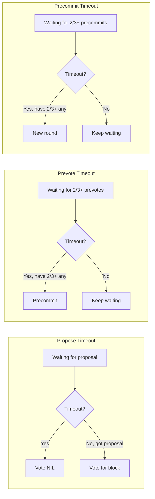
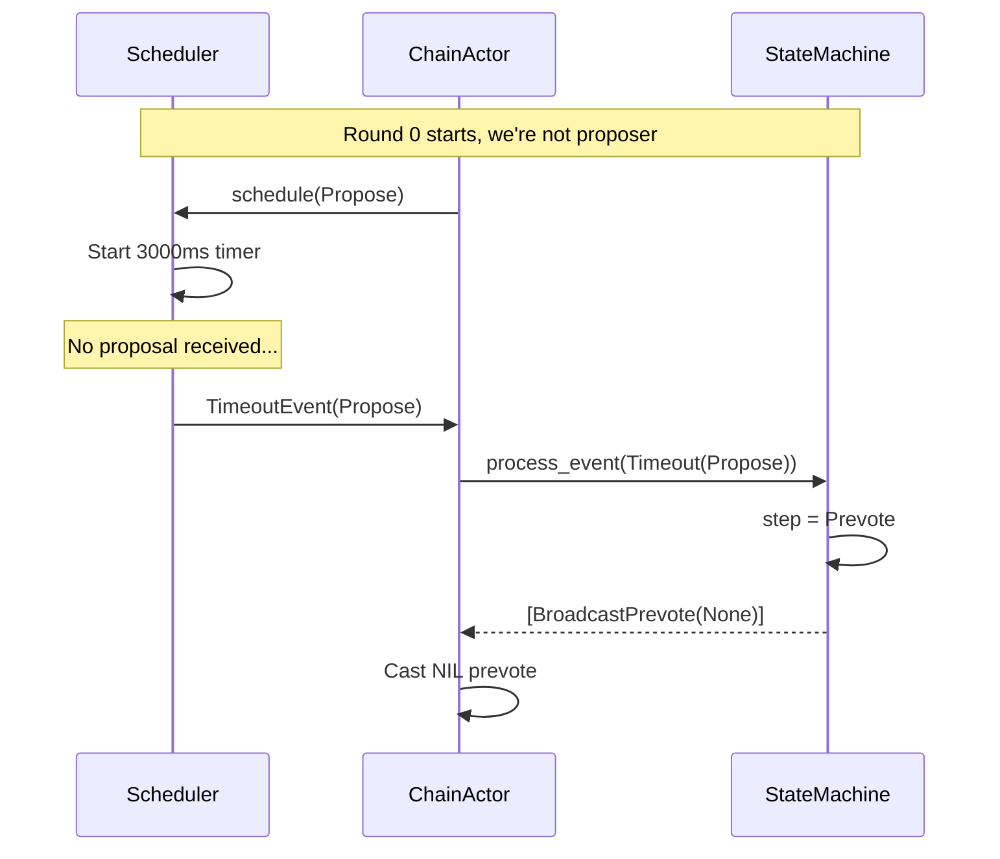
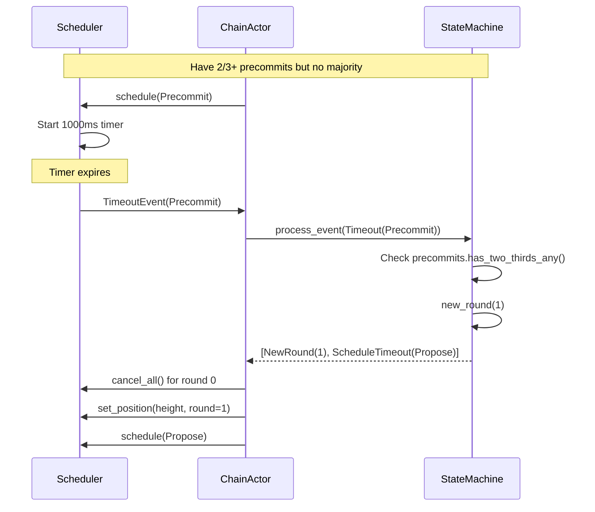

# Implementation Plan: Timeout & Round Management

## Overview

This document provides a comprehensive implementation guide for Tendermint timeout management. Timeouts are essential for liveness - they ensure the protocol progresses even when proposers fail or messages are delayed.

**Estimated Effort**: 2-3 days
**Dependencies**:
- `01_MESSAGE_TYPES_AND_PROTOCOL_FOUNDATION.md` (Height, Round, TendermintStep)
- `02_STATE_MACHINE.md` (ConsensusAction::ScheduleTimeout, ConsensusEvent::Timeout)
- `04_CHAINACTOR_HANDLERS.md` (ChainMessage::TendermintTimeout)
- `05_NETWORK_LAYER.md` (timeout gossip topic)
- `06_WAL.md` (timeout recovery after crash)
- `10_SLOT_WORKER_TO_TENDERMINT_TIMING.md` (migration from Aura timing)
**Files to Create**:
- `app/src/actors_v2/chain/tendermint/timeout.rs`
**Files to Modify**:
- `app/src/actors_v2/chain/error.rs` (TimeoutError variants)

---

## Cross-Document Type References

| Type | Defined In | Usage Here |
|------|-----------|------------|
| `Height` | `01_MESSAGE_TYPES` (`pub type Height = u64`) | Consensus height for timeout tracking |
| `Round` | `01_MESSAGE_TYPES` (`pub type Round = u32`) | Round number for backoff calculation |
| `TendermintStep` | `01_MESSAGE_TYPES` | Propose/Prevote/Precommit/Commit steps |
| `ConsensusAction::ScheduleTimeout` | `02_STATE_MACHINE` | State machine requests timeout scheduling |
| `ConsensusEvent::Timeout` | `02_STATE_MACHINE` | Timeout event fed back to state machine |
| `ChainMessage::TendermintTimeout` | `04_CHAINACTOR_HANDLERS` | Actor message for timeout events |
| Timeout gossip topic | `05_NETWORK_LAYER` | `/alys/tendermint/timeouts/1` |

---

## 1. Timeout Conceptual Model

### 1.1 Timeout Purposes



### 1.2 Timeout Durations

| Step | Base Duration | Per-Round Delta | Purpose |
|------|--------------|-----------------|---------|
| Propose | 3000ms | +500ms | Wait for proposer |
| Prevote | 1000ms | +500ms | Collect votes |
| Precommit | 1000ms | +500ms | Finalize decision |

**Exponential Backoff**: Each round increases timeout by `delta`:
- Round 0: 3000ms propose
- Round 1: 3500ms propose
- Round 2: 4000ms propose
- ...

---

## 2. Timeout Scheduler Implementation

### 2.1 Core Structure

```rust
//! Timeout management for Tendermint consensus.
//!
//! This module provides timeout scheduling for each consensus step.
//! Timeouts are critical for liveness - without them, the protocol
//! would halt if a proposer fails.
//!
//! # Timeout Behavior
//!
//! - **Propose timeout**: If no proposal received, prevote NIL
//! - **Prevote timeout**: After 2/3+ any, if no majority, precommit
//! - **Precommit timeout**: After 2/3+ any, if no majority, new round
//!
//! # Exponential Backoff
//!
//! Timeouts increase with each round to handle network delays:
//! `timeout(round) = base_timeout + (round * delta)`

use super::types::*;
use std::time::Duration;
use tokio::sync::mpsc;
use tokio::time::{sleep, Instant};
use tracing::{debug, info, warn};

/// Timeout configuration
///
/// Configures the base timeouts and per-round delta for each step.
#[derive(Debug, Clone)]
pub struct TimeoutConfig {
    /// Base timeout for propose step
    pub propose_timeout: Duration,

    /// Base timeout for prevote step
    pub prevote_timeout: Duration,

    /// Base timeout for precommit step
    pub precommit_timeout: Duration,

    /// Additional time per round (exponential backoff)
    pub timeout_delta: Duration,

    /// Maximum timeout (cap for backoff)
    pub max_timeout: Duration,
}

impl Default for TimeoutConfig {
    fn default() -> Self {
        Self {
            propose_timeout: Duration::from_millis(3000),
            prevote_timeout: Duration::from_millis(1000),
            precommit_timeout: Duration::from_millis(1000),
            timeout_delta: Duration::from_millis(500),
            max_timeout: Duration::from_secs(30),
        }
    }
}

impl TimeoutConfig {
    /// Calculate timeout for a step at a given round
    ///
    /// # Commit Step
    ///
    /// Returns `Duration::ZERO` for `TendermintStep::Commit` because:
    /// - Commit is not a waiting state - it's the final action
    /// - Once 2/3+ precommits are collected, commit happens immediately
    /// - No timeout needed; the block is finalized synchronously
    ///
    /// Attempting to schedule a Commit timeout is a logic error and will
    /// be rejected by `schedule()`.
    pub fn timeout_for(&self, step: TendermintStep, round: u32) -> Duration {
        let base = match step {
            TendermintStep::Propose => self.propose_timeout,
            TendermintStep::Prevote => self.prevote_timeout,
            TendermintStep::Precommit => self.precommit_timeout,
            TendermintStep::Commit => Duration::ZERO, // No timeout for commit
        };

        let with_backoff = base + self.timeout_delta * round;

        // Cap at maximum
        std::cmp::min(with_backoff, self.max_timeout)
    }
}

/// A scheduled timeout that can be cancelled
#[derive(Debug)]
pub struct ScheduledTimeout {
    /// When this timeout was scheduled
    pub scheduled_at: Instant,

    /// When this timeout expires
    pub expires_at: Instant,

    /// The step this timeout is for
    pub step: TendermintStep,

    /// Height/round this timeout is for
    pub height: Height,
    pub round: Round,

    /// Handle to cancel this timeout
    pub cancel_tx: mpsc::Sender<()>,
}

/// Timeout event sent when a timeout expires
#[derive(Debug, Clone)]
pub struct TimeoutEvent {
    pub height: Height,
    pub round: Round,
    pub step: TendermintStep,
}

/// Timeout-related errors
#[derive(Debug, Clone, thiserror::Error)]
pub enum TimeoutError {
    /// Attempted to schedule timeout for invalid step (e.g., Commit)
    #[error("Cannot schedule timeout for step: {0:?}")]
    InvalidStep(TendermintStep),

    /// Scheduler channel closed
    #[error("Timeout event channel closed")]
    ChannelClosed,

    /// Scheduler not initialized
    #[error("Timeout scheduler not initialized")]
    NotInitialized,
}

/// Manages timeout scheduling for Tendermint consensus
///
/// The scheduler maintains at most one active timeout per step.
/// When a new timeout is scheduled for a step, any existing timeout
/// for that step is cancelled.
pub struct TimeoutScheduler {
    /// Configuration
    config: TimeoutConfig,

    /// Currently active timeouts
    active_timeouts: Vec<ScheduledTimeout>,

    /// Channel to send timeout events
    event_tx: mpsc::Sender<TimeoutEvent>,

    /// Current consensus position
    current_height: Height,
    current_round: Round,
}

impl TimeoutScheduler {
    /// Create a new timeout scheduler
    pub fn new(
        config: TimeoutConfig,
        event_tx: mpsc::Sender<TimeoutEvent>,
    ) -> Self {
        Self {
            config,
            active_timeouts: Vec::new(),
            event_tx,
            current_height: 0,
            current_round: 0,
        }
    }

    /// Update current position and cancel stale timeouts
    pub fn set_position(&mut self, height: Height, round: Round) {
        if height != self.current_height || round != self.current_round {
            // Cancel all timeouts from previous height/round
            self.cancel_all_stale(height, round);
            self.current_height = height;
            self.current_round = round;
        }
    }

    /// Schedule a timeout for a step
    ///
    /// If a timeout for this step already exists, it is cancelled first.
    ///
    /// # Errors
    ///
    /// Returns `TimeoutError::InvalidStep` if attempting to schedule
    /// a timeout for `TendermintStep::Commit`.
    pub fn schedule(&mut self, step: TendermintStep) -> Result<(), TimeoutError> {
        // Commit step has no timeout - it's a logic error to schedule one
        if step == TendermintStep::Commit {
            warn!("Attempted to schedule timeout for Commit step");
            return Err(TimeoutError::InvalidStep(step));
        }

        // Cancel existing timeout for this step (prevents duplicates)
        self.cancel_step(step);

        // Calculate timeout duration
        let duration = self.config.timeout_for(step, self.current_round);

        // Create cancellation channel
        let (cancel_tx, mut cancel_rx) = mpsc::channel::<()>(1);

        let height = self.current_height;
        let round = self.current_round;
        let event_tx = self.event_tx.clone();

        // Store scheduled timeout info
        let now = Instant::now();
        self.active_timeouts.push(ScheduledTimeout {
            scheduled_at: now,
            expires_at: now + duration,
            step,
            height,
            round,
            cancel_tx: cancel_tx.clone(),
        });

        debug!(
            height,
            round,
            step = ?step,
            duration_ms = duration.as_millis(),
            "Scheduled timeout"
        );

        // Spawn timeout task
        tokio::spawn(async move {
            tokio::select! {
                _ = sleep(duration) => {
                    // Timeout expired
                    let event = TimeoutEvent { height, round, step };
                    if event_tx.send(event).await.is_err() {
                        warn!("Failed to send timeout event");
                    }
                    debug!(height, round, step = ?step, "Timeout expired");
                }
                _ = cancel_rx.recv() => {
                    // Timeout was cancelled
                    debug!(height, round, step = ?step, "Timeout cancelled");
                }
            }
        });

        Ok(())
    }

    /// Cancel timeout for a specific step
    pub fn cancel_step(&mut self, step: TendermintStep) {
        self.active_timeouts.retain(|t| {
            if t.step == step && t.height == self.current_height && t.round == self.current_round {
                // Send cancel signal (ignore errors)
                let _ = t.cancel_tx.try_send(());
                false // Remove from list
            } else {
                true // Keep
            }
        });
    }

    /// Cancel all stale timeouts (from previous heights/rounds)
    fn cancel_all_stale(&mut self, new_height: Height, new_round: Round) {
        self.active_timeouts.retain(|t| {
            if t.height < new_height || (t.height == new_height && t.round < new_round) {
                let _ = t.cancel_tx.try_send(());
                false
            } else {
                true
            }
        });
    }

    /// Cancel all active timeouts
    pub fn cancel_all(&mut self) {
        for timeout in &self.active_timeouts {
            let _ = timeout.cancel_tx.try_send(());
        }
        self.active_timeouts.clear();
    }

    /// Get remaining time for a step's timeout
    pub fn time_remaining(&self, step: TendermintStep) -> Option<Duration> {
        self.active_timeouts
            .iter()
            .find(|t| t.step == step && t.height == self.current_height && t.round == self.current_round)
            .map(|t| {
                let now = Instant::now();
                if now >= t.expires_at {
                    Duration::ZERO
                } else {
                    t.expires_at - now
                }
            })
    }
}
```

---

## 3. Integration with ChainActor

### 3.1 Adding Scheduler to Actor

```rust
// In actor.rs

pub struct ChainActor {
    // ... existing fields ...

    /// Timeout scheduler for Tendermint consensus
    timeout_scheduler: Arc<RwLock<TimeoutScheduler>>,

    /// Receiver for timeout events
    timeout_rx: mpsc::Receiver<TimeoutEvent>,
}

impl ChainActor {
    pub fn new(/* params */) -> Self {
        // Create timeout channel
        let (timeout_tx, timeout_rx) = mpsc::channel(32);

        // Create scheduler
        let timeout_config = TimeoutConfig::default();
        let timeout_scheduler = Arc::new(RwLock::new(
            TimeoutScheduler::new(timeout_config, timeout_tx)
        ));

        Self {
            // ... other fields ...
            timeout_scheduler,
            timeout_rx,
        }
    }

    /// Schedule a timeout for the given step
    pub fn schedule_timeout(&self, step: TendermintStep) {
        // Clone and spawn to avoid blocking
        let scheduler = self.timeout_scheduler.clone();
        let height = self.state.tendermint.height;
        let round = self.state.tendermint.round;

        tokio::spawn(async move {
            let mut scheduler = scheduler.write().await;
            scheduler.set_position(height, round);
            scheduler.schedule(step);
        });
    }

    /// Cancel timeout for a step
    pub fn cancel_timeout(&self, step: TendermintStep) {
        let scheduler = self.timeout_scheduler.clone();

        tokio::spawn(async move {
            let mut scheduler = scheduler.write().await;
            scheduler.cancel_step(step);
        });
    }
}
```

### 3.2 Processing Timeout Events

```rust
// In actor.rs, Actor trait implementation

impl Actor for ChainActor {
    type Context = Context<Self>;

    fn started(&mut self, ctx: &mut Self::Context) {
        // Start timeout event processing loop
        self.start_timeout_processor(ctx);

        // ... other startup logic ...
    }
}

impl ChainActor {
    /// Start the timeout event processor
    fn start_timeout_processor(&mut self, ctx: &mut Context<Self>) {
        let addr = ctx.address();

        // Move receiver into async task
        let mut timeout_rx = std::mem::replace(
            &mut self.timeout_rx,
            mpsc::channel(1).1 // Dummy receiver
        );

        // Spawn timeout processor
        tokio::spawn(async move {
            while let Some(event) = timeout_rx.recv().await {
                // Forward to actor as a message
                if addr.send(ChainMessage::TendermintTimeout {
                    height: event.height,
                    round: event.round,
                    step: event.step,
                    correlation_id: None,
                }).await.is_err() {
                    warn!("Failed to forward timeout to ChainActor");
                    break;
                }
            }
        });
    }
}
```

### 3.3 State Machine Integration

The timeout scheduler connects to the state machine (doc 02) bidirectionally:

```rust
impl ChainActor {
    /// Process consensus actions that may involve timeouts
    ///
    /// Called after state machine transitions to execute resulting actions.
    /// See `02_STATE_MACHINE.md` for ConsensusAction definitions.
    fn process_consensus_actions(&mut self, actions: Vec<ConsensusAction>) {
        for action in actions {
            match action {
                ConsensusAction::ScheduleTimeout(step) => {
                    // State machine requests a timeout be scheduled
                    self.schedule_timeout(step);
                }
                ConsensusAction::NewRound(round) => {
                    // Round advancement - cancel old timeouts, update position
                    self.handle_new_round(round);
                }
                // ... other actions (BroadcastVote, Commit, etc.)
                _ => {}
            }
        }
    }

    /// Handle timeout message from scheduler
    ///
    /// Converts TimeoutEvent back to ConsensusEvent for state machine.
    fn handle_timeout_message(
        &mut self,
        height: Height,
        round: Round,
        step: TendermintStep,
    ) -> Result<(), ChainError> {
        // Verify timeout is for current position (not stale)
        if height != self.state.tendermint.height || round != self.state.tendermint.round {
            debug!(
                event_height = height,
                event_round = round,
                current_height = self.state.tendermint.height,
                current_round = self.state.tendermint.round,
                "Ignoring stale timeout"
            );
            return Ok(());
        }

        // Record metric
        TENDERMINT_TIMEOUTS.with_label_values(&[&format!("{:?}", step)]).inc();

        // Feed timeout back to state machine
        let event = ConsensusEvent::Timeout(step);
        let actions = self.state.tendermint.state_machine.process_event(event);

        // Execute resulting actions
        self.process_consensus_actions(actions);

        Ok(())
    }

    /// Handle round advancement
    fn handle_new_round(&mut self, new_round: Round) {
        let height = self.state.tendermint.height;

        info!(height, round = new_round, "Advancing to new round");

        // Update position - this cancels stale timeouts
        let scheduler = self.timeout_scheduler.clone();
        tokio::spawn(async move {
            let mut scheduler = scheduler.write().await;
            scheduler.set_position(height, new_round);
        });

        // Update state
        self.state.tendermint.round = new_round;

        // Schedule propose timeout for new round
        self.schedule_timeout(TendermintStep::Propose);
    }
}
```

### 3.4 Graceful Shutdown

Cancel all timeouts when the actor is stopping:

```rust
impl Actor for ChainActor {
    // ...

    fn stopping(&mut self, _ctx: &mut Self::Context) -> Running {
        // Cancel all pending timeouts
        let scheduler = self.timeout_scheduler.clone();
        tokio::spawn(async move {
            let mut scheduler = scheduler.write().await;
            scheduler.cancel_all();
            info!("Cancelled all pending timeouts on shutdown");
        });

        Running::Stop
    }
}
```

---

## 4. Timeout Flow Examples

### 4.1 Propose Timeout Flow



### 4.2 Round Advancement Flow



---

## 5. Network Layer Integration

Timeout notifications may be shared with peers to help lagging validators catch up. See `05_NETWORK_LAYER.md` for the timeout gossip topic.

### 5.1 Timeout Gossip (Optional)

```rust
/// Timeout notification for network gossip
///
/// Broadcasted on `/alys/tendermint/timeouts/1` topic.
/// Helps lagging validators know that others have timed out.
#[derive(Debug, Clone, Serialize, Deserialize)]
pub struct TimeoutNotification {
    pub height: Height,
    pub round: Round,
    pub step: TendermintStep,
    pub validator_id: ValidatorId,
    pub signature: Signature,
}

impl ChainActor {
    /// Optionally broadcast timeout to network
    ///
    /// This helps validators who are behind know that others
    /// have also timed out, aiding in round synchronization.
    async fn broadcast_timeout_if_needed(
        &self,
        step: TendermintStep,
    ) -> Result<(), ChainError> {
        // Only broadcast for significant timeouts
        if step != TendermintStep::Precommit {
            return Ok(());
        }

        let notification = TimeoutNotification {
            height: self.state.tendermint.height,
            round: self.state.tendermint.round,
            step,
            validator_id: self.config.validator_id,
            signature: self.sign_timeout_notification()?,
        };

        if let Some(network) = &self.network_actor {
            network.send(BroadcastTimeoutMessage {
                notification,
                correlation_id: None,
            }).await
                .map_err(|e| ChainError::ActorMailbox(e.to_string()))?;
        }

        Ok(())
    }

    /// Handle received timeout notification from peer
    fn handle_peer_timeout(&mut self, notification: TimeoutNotification) {
        // Verify signature
        if !self.verify_timeout_signature(&notification) {
            warn!(
                validator = ?notification.validator_id,
                "Invalid timeout signature"
            );
            return;
        }

        // Track for round synchronization
        self.state.tendermint.timeout_votes.record(
            notification.height,
            notification.round,
            notification.step,
            notification.validator_id,
        );

        // If we see 2/3+ timeout notifications, we can skip ahead
        if self.state.tendermint.timeout_votes.has_two_thirds_any(
            notification.height,
            notification.round,
        ) {
            info!(
                height = notification.height,
                round = notification.round,
                "Received 2/3+ timeout notifications, advancing round"
            );
            self.handle_new_round(notification.round + 1);
        }
    }
}
```

**Note**: Timeout gossip is optional. The primary liveness mechanism is local timeout scheduling. Gossip helps with faster round synchronization in partitioned networks.

---

## 6. WAL Recovery Integration

After a crash, the validator must restore its timeout state. See `06_WAL.md` for WAL details.

### 6.1 Timeout State Recovery

```rust
impl ChainActor {
    /// Restore timeout state after crash recovery
    ///
    /// Called during WAL replay. We don't log timeout events to WAL
    /// (they're ephemeral), but we need to restart timeouts based on
    /// recovered consensus state.
    fn restore_timeout_state(&mut self, recovered: &RecoveredState) {
        let height = recovered.height;
        let round = recovered.round;
        let step = recovered.step;

        info!(
            height,
            round,
            step = ?step,
            "Restoring timeout state after recovery"
        );

        // Update scheduler position
        let scheduler = self.timeout_scheduler.clone();
        tokio::spawn(async move {
            let mut scheduler = scheduler.write().await;
            scheduler.set_position(height, round);
        });

        // Schedule appropriate timeout for current step
        match step {
            TendermintStep::Propose => {
                // If we're in Propose, schedule propose timeout
                // (unless we're the proposer, handled elsewhere)
                if !self.is_proposer_for_round(height, round) {
                    self.schedule_timeout(TendermintStep::Propose);
                }
            }
            TendermintStep::Prevote => {
                // In Prevote, schedule prevote timeout
                self.schedule_timeout(TendermintStep::Prevote);
            }
            TendermintStep::Precommit => {
                // In Precommit, schedule precommit timeout
                self.schedule_timeout(TendermintStep::Precommit);
            }
            TendermintStep::Commit => {
                // Commit doesn't need timeout - finalization is synchronous
            }
        }
    }
}
```

### 6.2 Design Decision: No WAL for Timeouts

Timeouts are NOT logged to WAL because:

1. **Ephemeral by nature**: Timeouts are process-local timing events, not consensus decisions
2. **No safety impact**: Missing a timeout on restart just means we wait again
3. **State machine determines step**: The WAL logs votes/proposals which determine the step; timeout can be re-scheduled based on recovered step
4. **Simpler recovery**: Fewer WAL entries means faster recovery

Upon restart:
- WAL is replayed to recover `(height, round, step)`
- Timeout scheduler is initialized with recovered position
- Appropriate timeout is scheduled for current step

---

## 7. Metrics

```rust
use prometheus::{IntCounterVec, HistogramVec, Opts};

lazy_static! {
    /// Timeout events by step
    static ref TENDERMINT_TIMEOUTS: IntCounterVec = IntCounterVec::new(
        Opts::new("tendermint_timeouts_total", "Timeout events triggered"),
        &["step"]
    ).unwrap();

    /// Timeout durations actually used
    static ref TENDERMINT_TIMEOUT_DURATION: HistogramVec = HistogramVec::new(
        prometheus::HistogramOpts::new(
            "tendermint_timeout_duration_seconds",
            "Configured timeout durations"
        ),
        &["step", "round"]
    ).unwrap();

    /// Timeouts cancelled before expiry
    static ref TENDERMINT_TIMEOUTS_CANCELLED: IntCounterVec = IntCounterVec::new(
        Opts::new("tendermint_timeouts_cancelled_total", "Timeouts cancelled before expiry"),
        &["step", "reason"]  // reason: "step_change", "round_change", "height_change", "shutdown"
    ).unwrap();

    /// Current round (for observing round advancement)
    static ref TENDERMINT_CURRENT_ROUND: IntGauge = IntGauge::new(
        "tendermint_current_round",
        "Current consensus round"
    ).unwrap();

    /// Stale timeout events (received after position advanced)
    static ref TENDERMINT_STALE_TIMEOUTS: IntCounter = IntCounter::new(
        "tendermint_stale_timeouts_total",
        "Timeout events ignored because position advanced"
    ).unwrap();
}

impl TimeoutScheduler {
    pub fn schedule_with_metrics(&mut self, step: TendermintStep) {
        let duration = self.config.timeout_for(step, self.current_round);

        TENDERMINT_TIMEOUT_DURATION
            .with_label_values(&[
                &format!("{:?}", step),
                &self.current_round.to_string(),
            ])
            .observe(duration.as_secs_f64());

        let _ = self.schedule(step);  // Updated for Result return type
    }
}
```

---

## 8. Configuration

### 8.1 Environment-Based Config

```rust
impl TimeoutConfig {
    /// Create config from environment variables
    pub fn from_env() -> Self {
        Self {
            propose_timeout: Duration::from_millis(
                std::env::var("TENDERMINT_PROPOSE_TIMEOUT_MS")
                    .ok()
                    .and_then(|s| s.parse().ok())
                    .unwrap_or(3000)
            ),
            prevote_timeout: Duration::from_millis(
                std::env::var("TENDERMINT_PREVOTE_TIMEOUT_MS")
                    .ok()
                    .and_then(|s| s.parse().ok())
                    .unwrap_or(1000)
            ),
            precommit_timeout: Duration::from_millis(
                std::env::var("TENDERMINT_PRECOMMIT_TIMEOUT_MS")
                    .ok()
                    .and_then(|s| s.parse().ok())
                    .unwrap_or(1000)
            ),
            timeout_delta: Duration::from_millis(
                std::env::var("TENDERMINT_TIMEOUT_DELTA_MS")
                    .ok()
                    .and_then(|s| s.parse().ok())
                    .unwrap_or(500)
            ),
            max_timeout: Duration::from_secs(
                std::env::var("TENDERMINT_MAX_TIMEOUT_SECS")
                    .ok()
                    .and_then(|s| s.parse().ok())
                    .unwrap_or(30)
            ),
        }
    }

    /// Aggressive config for testing
    pub fn fast_for_testing() -> Self {
        Self {
            propose_timeout: Duration::from_millis(100),
            prevote_timeout: Duration::from_millis(50),
            precommit_timeout: Duration::from_millis(50),
            timeout_delta: Duration::from_millis(25),
            max_timeout: Duration::from_secs(5),
        }
    }
}
```

---

## 9. Testing Strategy

```rust
#[cfg(test)]
mod tests {
    use super::*;
    use tokio::time::timeout;

    #[tokio::test]
    async fn test_timeout_fires() {
        let (event_tx, mut event_rx) = mpsc::channel(32);
        let config = TimeoutConfig {
            propose_timeout: Duration::from_millis(50),
            ..Default::default()
        };

        let mut scheduler = TimeoutScheduler::new(config, event_tx);
        scheduler.set_position(100, 0);
        scheduler.schedule(TendermintStep::Propose).unwrap();

        // Should receive event within 100ms
        let event = timeout(Duration::from_millis(100), event_rx.recv())
            .await
            .expect("Timeout waiting for event")
            .expect("Channel closed");

        assert_eq!(event.height, 100);
        assert_eq!(event.round, 0);
        assert_eq!(event.step, TendermintStep::Propose);
    }

    #[tokio::test]
    async fn test_timeout_cancelled() {
        let (event_tx, mut event_rx) = mpsc::channel(32);
        let config = TimeoutConfig {
            propose_timeout: Duration::from_millis(50),
            ..Default::default()
        };

        let mut scheduler = TimeoutScheduler::new(config, event_tx);
        scheduler.set_position(100, 0);
        scheduler.schedule(TendermintStep::Propose).unwrap();

        // Cancel immediately
        scheduler.cancel_step(TendermintStep::Propose);

        // Should NOT receive event
        let result = timeout(Duration::from_millis(100), event_rx.recv()).await;
        assert!(result.is_err() || result.unwrap().is_none());
    }

    #[tokio::test]
    async fn test_stale_timeouts_cancelled() {
        let (event_tx, mut event_rx) = mpsc::channel(32);
        let config = TimeoutConfig {
            propose_timeout: Duration::from_millis(100),
            ..Default::default()
        };

        let mut scheduler = TimeoutScheduler::new(config, event_tx);
        scheduler.set_position(100, 0);
        scheduler.schedule(TendermintStep::Propose).unwrap();

        // Advance round
        scheduler.set_position(100, 1);
        scheduler.schedule(TendermintStep::Propose).unwrap();

        // First event should be cancelled, only get second
        let event = timeout(Duration::from_millis(150), event_rx.recv())
            .await
            .expect("Timeout waiting for event")
            .expect("Channel closed");

        assert_eq!(event.round, 1); // Only round 1 event
    }

    #[test]
    fn test_timeout_backoff() {
        let config = TimeoutConfig::default();

        // Round 0
        assert_eq!(
            config.timeout_for(TendermintStep::Propose, 0),
            Duration::from_millis(3000)
        );

        // Round 1 (+500ms)
        assert_eq!(
            config.timeout_for(TendermintStep::Propose, 1),
            Duration::from_millis(3500)
        );

        // Round 10 (+5000ms)
        assert_eq!(
            config.timeout_for(TendermintStep::Propose, 10),
            Duration::from_millis(8000)
        );

        // Round 100 - should cap at max
        let timeout_100 = config.timeout_for(TendermintStep::Propose, 100);
        assert!(timeout_100 <= config.max_timeout);
    }

    #[tokio::test]
    async fn test_commit_step_rejected() {
        let (event_tx, _event_rx) = mpsc::channel(32);
        let config = TimeoutConfig::default();

        let mut scheduler = TimeoutScheduler::new(config, event_tx);
        scheduler.set_position(100, 0);

        // Commit step should be rejected
        let result = scheduler.schedule(TendermintStep::Commit);
        assert!(matches!(result, Err(TimeoutError::InvalidStep(_))));
    }

    #[tokio::test]
    async fn test_duplicate_scheduling_cancels_previous() {
        let (event_tx, mut event_rx) = mpsc::channel(32);
        let config = TimeoutConfig {
            propose_timeout: Duration::from_millis(100),
            ..Default::default()
        };

        let mut scheduler = TimeoutScheduler::new(config, event_tx);
        scheduler.set_position(100, 0);

        // Schedule twice in quick succession
        scheduler.schedule(TendermintStep::Propose).unwrap();
        tokio::time::sleep(Duration::from_millis(10)).await;
        scheduler.schedule(TendermintStep::Propose).unwrap();

        // Should only receive ONE event (second scheduling cancels first)
        let event = timeout(Duration::from_millis(150), event_rx.recv())
            .await
            .expect("Timeout waiting for event")
            .expect("Channel closed");

        assert_eq!(event.step, TendermintStep::Propose);

        // No second event should come
        let result = timeout(Duration::from_millis(50), event_rx.recv()).await;
        assert!(result.is_err() || result.unwrap().is_none());
    }
}
```

---

## 10. Checklist

### Core Implementation
- [ ] Create `tendermint/timeout.rs`
- [ ] Implement `TimeoutConfig` with defaults
- [ ] Implement `TimeoutScheduler`
- [ ] Implement `schedule()` with cancellation and validation
- [ ] Implement `cancel_step()` and `cancel_all()`
- [ ] Implement stale timeout cleanup on position change
- [ ] Add `TimeoutError` enum to error types

### ChainActor Integration
- [ ] Add scheduler to ChainActor
- [ ] Implement timeout event processor
- [ ] Implement `handle_timeout_message` with state machine integration
- [ ] Implement `process_consensus_actions` for `ScheduleTimeout` action
- [ ] Implement `handle_new_round` for round advancement
- [ ] Add graceful shutdown in `stopping()`

### State Machine Integration (doc 02)
- [ ] Wire `ConsensusAction::ScheduleTimeout` to `schedule_timeout()`
- [ ] Wire `TimeoutEvent` to `ConsensusEvent::Timeout`
- [ ] Handle `ConsensusAction::NewRound` for round transitions

### Network Layer (doc 05, optional)
- [ ] Implement `TimeoutNotification` message
- [ ] Implement `broadcast_timeout_if_needed`
- [ ] Implement `handle_peer_timeout` for received notifications
- [ ] Add timeout vote tracking for round sync

### WAL Recovery (doc 06)
- [ ] Implement `restore_timeout_state` for crash recovery
- [ ] Schedule appropriate timeout based on recovered step

### Configuration
- [ ] Add environment-based configuration
- [ ] Add `fast_for_testing()` config

### Metrics
- [ ] Add `TENDERMINT_TIMEOUTS` counter by step
- [ ] Add `TENDERMINT_TIMEOUT_DURATION` histogram
- [ ] Add timeout cancellation counter

### Testing
- [ ] Write unit tests for scheduling
- [ ] Write unit tests for cancellation
- [ ] Write unit tests for backoff
- [ ] Write unit tests for Commit step rejection
- [ ] Write unit tests for stale timeout handling
- [ ] Write integration test for state machine round trip

---

*Implementation Plan Version: 2.0*
*Last Updated: February 2026*
*Changes:*
- *Added cross-document type references*
- *Added TimeoutError enum*
- *Added Commit step validation in schedule()*
- *Added state machine integration section (3.3)*
- *Added graceful shutdown section (3.4)*
- *Added network layer integration section (5)*
- *Added WAL recovery integration section (6)*
- *Renumbered sections for new content*
- *Expanded checklist with all integration points*
