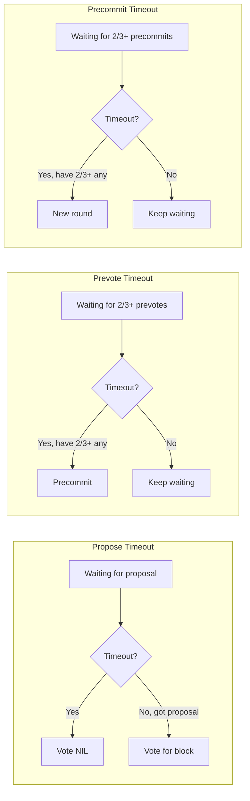
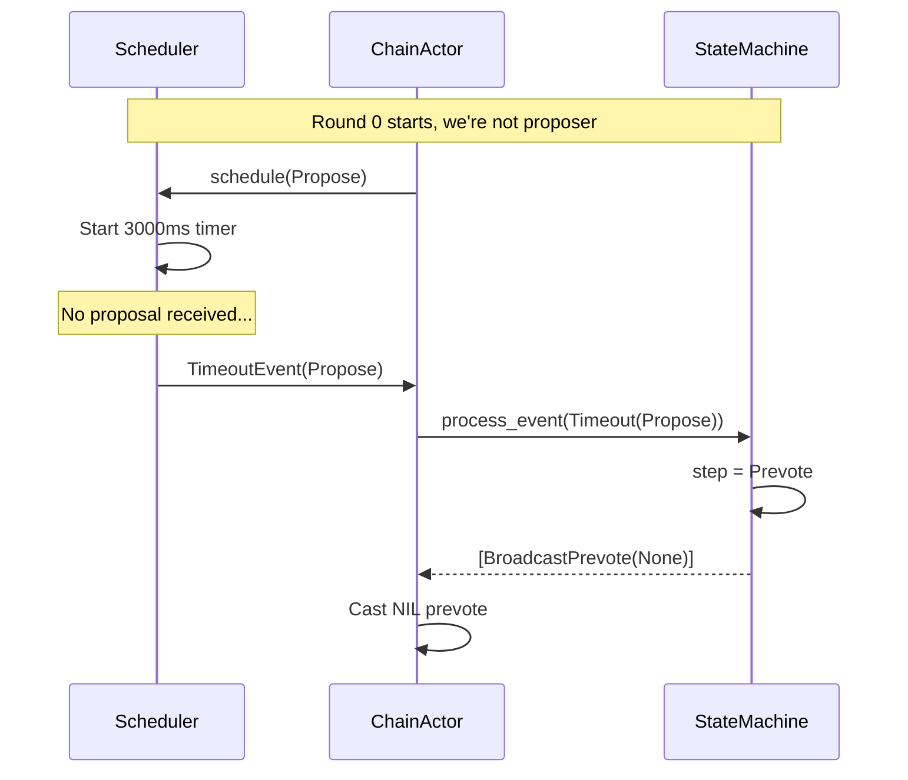
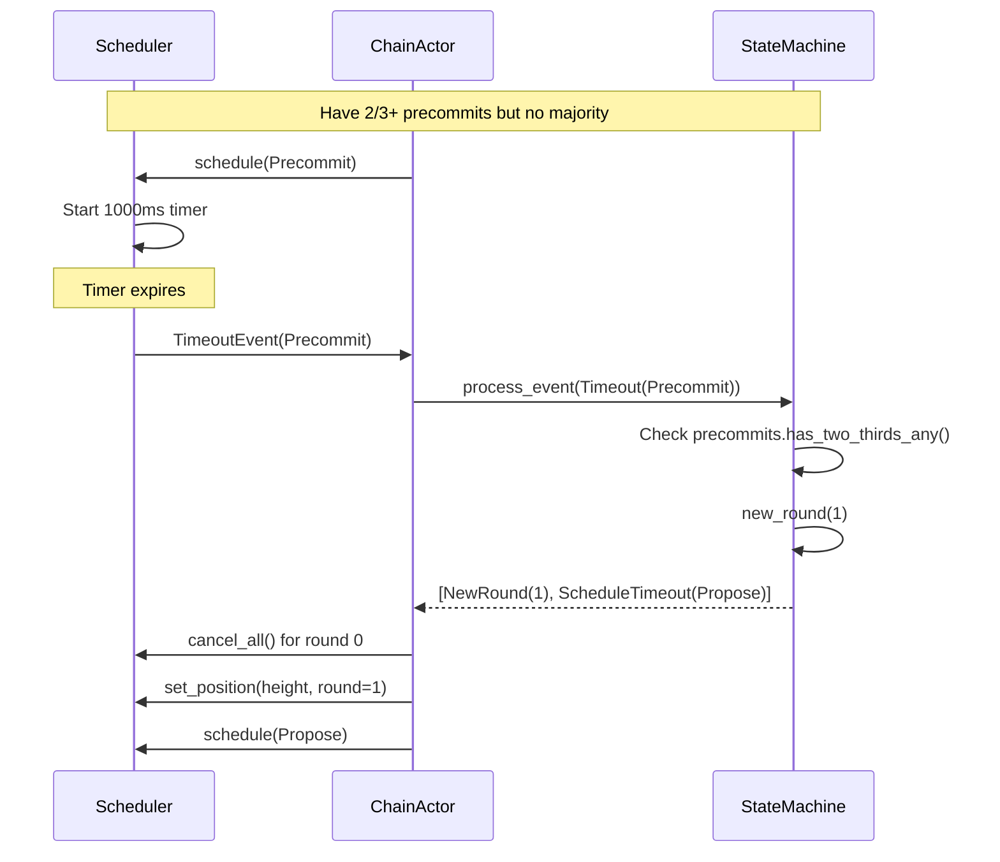

# Implementation Plan: Timeout & Round Management

## Overview

This document provides a comprehensive implementation guide for Tendermint timeout management. Timeouts are essential for liveness - they ensure the protocol progresses even when proposers fail or messages are delayed.

**Estimated Effort**: 2-3 days
**Dependencies**:
- `02_STATE_MACHINE.md`
- `04_CHAINACTOR_HANDLERS.md`
**Files to Create**:
- `app/src/actors_v2/chain/tendermint/timeout.rs`

---

## 1. Timeout Conceptual Model

### 1.1 Timeout Purposes



### 1.2 Timeout Durations

| Step | Base Duration | Per-Round Delta | Purpose |
|------|--------------|-----------------|---------|
| Propose | 3000ms | +500ms | Wait for proposer |
| Prevote | 1000ms | +500ms | Collect votes |
| Precommit | 1000ms | +500ms | Finalize decision |

**Exponential Backoff**: Each round increases timeout by `delta`:
- Round 0: 3000ms propose
- Round 1: 3500ms propose
- Round 2: 4000ms propose
- ...

---

## 2. Timeout Scheduler Implementation

### 2.1 Core Structure

```rust
//! Timeout management for Tendermint consensus.
//!
//! This module provides timeout scheduling for each consensus step.
//! Timeouts are critical for liveness - without them, the protocol
//! would halt if a proposer fails.
//!
//! # Timeout Behavior
//!
//! - **Propose timeout**: If no proposal received, prevote NIL
//! - **Prevote timeout**: After 2/3+ any, if no majority, precommit
//! - **Precommit timeout**: After 2/3+ any, if no majority, new round
//!
//! # Exponential Backoff
//!
//! Timeouts increase with each round to handle network delays:
//! `timeout(round) = base_timeout + (round * delta)`

use super::types::*;
use std::time::Duration;
use tokio::sync::mpsc;
use tokio::time::{sleep, Instant};
use tracing::{debug, info, warn};

/// Timeout configuration
///
/// Configures the base timeouts and per-round delta for each step.
#[derive(Debug, Clone)]
pub struct TimeoutConfig {
    /// Base timeout for propose step
    pub propose_timeout: Duration,

    /// Base timeout for prevote step
    pub prevote_timeout: Duration,

    /// Base timeout for precommit step
    pub precommit_timeout: Duration,

    /// Additional time per round (exponential backoff)
    pub timeout_delta: Duration,

    /// Maximum timeout (cap for backoff)
    pub max_timeout: Duration,
}

impl Default for TimeoutConfig {
    fn default() -> Self {
        Self {
            propose_timeout: Duration::from_millis(3000),
            prevote_timeout: Duration::from_millis(1000),
            precommit_timeout: Duration::from_millis(1000),
            timeout_delta: Duration::from_millis(500),
            max_timeout: Duration::from_secs(30),
        }
    }
}

impl TimeoutConfig {
    /// Calculate timeout for a step at a given round
    pub fn timeout_for(&self, step: TendermintStep, round: u32) -> Duration {
        let base = match step {
            TendermintStep::Propose => self.propose_timeout,
            TendermintStep::Prevote => self.prevote_timeout,
            TendermintStep::Precommit => self.precommit_timeout,
            TendermintStep::Commit => Duration::ZERO, // No timeout for commit
        };

        let with_backoff = base + self.timeout_delta * round;

        // Cap at maximum
        std::cmp::min(with_backoff, self.max_timeout)
    }
}

/// A scheduled timeout that can be cancelled
#[derive(Debug)]
pub struct ScheduledTimeout {
    /// When this timeout was scheduled
    pub scheduled_at: Instant,

    /// When this timeout expires
    pub expires_at: Instant,

    /// The step this timeout is for
    pub step: TendermintStep,

    /// Height/round this timeout is for
    pub height: Height,
    pub round: Round,

    /// Handle to cancel this timeout
    pub cancel_tx: mpsc::Sender<()>,
}

/// Timeout event sent when a timeout expires
#[derive(Debug, Clone)]
pub struct TimeoutEvent {
    pub height: Height,
    pub round: Round,
    pub step: TendermintStep,
}

/// Manages timeout scheduling for Tendermint consensus
///
/// The scheduler maintains at most one active timeout per step.
/// When a new timeout is scheduled for a step, any existing timeout
/// for that step is cancelled.
pub struct TimeoutScheduler {
    /// Configuration
    config: TimeoutConfig,

    /// Currently active timeouts
    active_timeouts: Vec<ScheduledTimeout>,

    /// Channel to send timeout events
    event_tx: mpsc::Sender<TimeoutEvent>,

    /// Current consensus position
    current_height: Height,
    current_round: Round,
}

impl TimeoutScheduler {
    /// Create a new timeout scheduler
    pub fn new(
        config: TimeoutConfig,
        event_tx: mpsc::Sender<TimeoutEvent>,
    ) -> Self {
        Self {
            config,
            active_timeouts: Vec::new(),
            event_tx,
            current_height: 0,
            current_round: 0,
        }
    }

    /// Update current position and cancel stale timeouts
    pub fn set_position(&mut self, height: Height, round: Round) {
        if height != self.current_height || round != self.current_round {
            // Cancel all timeouts from previous height/round
            self.cancel_all_stale(height, round);
            self.current_height = height;
            self.current_round = round;
        }
    }

    /// Schedule a timeout for a step
    ///
    /// If a timeout for this step already exists, it is cancelled first.
    pub fn schedule(&mut self, step: TendermintStep) {
        // Cancel existing timeout for this step
        self.cancel_step(step);

        // Calculate timeout duration
        let duration = self.config.timeout_for(step, self.current_round);

        // Create cancellation channel
        let (cancel_tx, mut cancel_rx) = mpsc::channel::<()>(1);

        let height = self.current_height;
        let round = self.current_round;
        let event_tx = self.event_tx.clone();

        // Store scheduled timeout info
        let now = Instant::now();
        self.active_timeouts.push(ScheduledTimeout {
            scheduled_at: now,
            expires_at: now + duration,
            step,
            height,
            round,
            cancel_tx: cancel_tx.clone(),
        });

        debug!(
            height,
            round,
            step = ?step,
            duration_ms = duration.as_millis(),
            "Scheduled timeout"
        );

        // Spawn timeout task
        tokio::spawn(async move {
            tokio::select! {
                _ = sleep(duration) => {
                    // Timeout expired
                    let event = TimeoutEvent { height, round, step };
                    if event_tx.send(event).await.is_err() {
                        warn!("Failed to send timeout event");
                    }
                    debug!(height, round, step = ?step, "Timeout expired");
                }
                _ = cancel_rx.recv() => {
                    // Timeout was cancelled
                    debug!(height, round, step = ?step, "Timeout cancelled");
                }
            }
        });
    }

    /// Cancel timeout for a specific step
    pub fn cancel_step(&mut self, step: TendermintStep) {
        self.active_timeouts.retain(|t| {
            if t.step == step && t.height == self.current_height && t.round == self.current_round {
                // Send cancel signal (ignore errors)
                let _ = t.cancel_tx.try_send(());
                false // Remove from list
            } else {
                true // Keep
            }
        });
    }

    /// Cancel all stale timeouts (from previous heights/rounds)
    fn cancel_all_stale(&mut self, new_height: Height, new_round: Round) {
        self.active_timeouts.retain(|t| {
            if t.height < new_height || (t.height == new_height && t.round < new_round) {
                let _ = t.cancel_tx.try_send(());
                false
            } else {
                true
            }
        });
    }

    /// Cancel all active timeouts
    pub fn cancel_all(&mut self) {
        for timeout in &self.active_timeouts {
            let _ = timeout.cancel_tx.try_send(());
        }
        self.active_timeouts.clear();
    }

    /// Get remaining time for a step's timeout
    pub fn time_remaining(&self, step: TendermintStep) -> Option<Duration> {
        self.active_timeouts
            .iter()
            .find(|t| t.step == step && t.height == self.current_height && t.round == self.current_round)
            .map(|t| {
                let now = Instant::now();
                if now >= t.expires_at {
                    Duration::ZERO
                } else {
                    t.expires_at - now
                }
            })
    }
}
```

---

## 3. Integration with ChainActor

### 3.1 Adding Scheduler to Actor

```rust
// In actor.rs

pub struct ChainActor {
    // ... existing fields ...

    /// Timeout scheduler for Tendermint consensus
    timeout_scheduler: Arc<RwLock<TimeoutScheduler>>,

    /// Receiver for timeout events
    timeout_rx: mpsc::Receiver<TimeoutEvent>,
}

impl ChainActor {
    pub fn new(/* params */) -> Self {
        // Create timeout channel
        let (timeout_tx, timeout_rx) = mpsc::channel(32);

        // Create scheduler
        let timeout_config = TimeoutConfig::default();
        let timeout_scheduler = Arc::new(RwLock::new(
            TimeoutScheduler::new(timeout_config, timeout_tx)
        ));

        Self {
            // ... other fields ...
            timeout_scheduler,
            timeout_rx,
        }
    }

    /// Schedule a timeout for the given step
    pub fn schedule_timeout(&self, step: TendermintStep) {
        // Clone and spawn to avoid blocking
        let scheduler = self.timeout_scheduler.clone();
        let height = self.state.tendermint.height;
        let round = self.state.tendermint.round;

        tokio::spawn(async move {
            let mut scheduler = scheduler.write().await;
            scheduler.set_position(height, round);
            scheduler.schedule(step);
        });
    }

    /// Cancel timeout for a step
    pub fn cancel_timeout(&self, step: TendermintStep) {
        let scheduler = self.timeout_scheduler.clone();

        tokio::spawn(async move {
            let mut scheduler = scheduler.write().await;
            scheduler.cancel_step(step);
        });
    }
}
```

### 3.2 Processing Timeout Events

```rust
// In actor.rs, Actor trait implementation

impl Actor for ChainActor {
    type Context = Context<Self>;

    fn started(&mut self, ctx: &mut Self::Context) {
        // Start timeout event processing loop
        self.start_timeout_processor(ctx);

        // ... other startup logic ...
    }
}

impl ChainActor {
    /// Start the timeout event processor
    fn start_timeout_processor(&mut self, ctx: &mut Context<Self>) {
        let addr = ctx.address();

        // Move receiver into async task
        let mut timeout_rx = std::mem::replace(
            &mut self.timeout_rx,
            mpsc::channel(1).1 // Dummy receiver
        );

        // Spawn timeout processor
        tokio::spawn(async move {
            while let Some(event) = timeout_rx.recv().await {
                // Forward to actor as a message
                if addr.send(ChainMessage::TendermintTimeout {
                    height: event.height,
                    round: event.round,
                    step: event.step,
                    correlation_id: None,
                }).await.is_err() {
                    warn!("Failed to forward timeout to ChainActor");
                    break;
                }
            }
        });
    }
}
```

---

## 4. Timeout Flow Examples

### 4.1 Propose Timeout Flow



### 4.2 Round Advancement Flow



---

## 5. Metrics

```rust
use prometheus::{IntCounterVec, HistogramVec, Opts};

lazy_static! {
    /// Timeout events by step
    static ref TENDERMINT_TIMEOUTS: IntCounterVec = IntCounterVec::new(
        Opts::new("tendermint_timeouts_total", "Timeout events triggered"),
        &["step"]
    ).unwrap();

    /// Timeout durations actually used
    static ref TENDERMINT_TIMEOUT_DURATION: HistogramVec = HistogramVec::new(
        prometheus::HistogramOpts::new(
            "tendermint_timeout_duration_seconds",
            "Configured timeout durations"
        ),
        &["step", "round"]
    ).unwrap();
}

impl TimeoutScheduler {
    pub fn schedule_with_metrics(&mut self, step: TendermintStep) {
        let duration = self.config.timeout_for(step, self.current_round);

        TENDERMINT_TIMEOUT_DURATION
            .with_label_values(&[
                &format!("{:?}", step),
                &self.current_round.to_string(),
            ])
            .observe(duration.as_secs_f64());

        self.schedule(step);
    }
}
```

---

## 6. Configuration

### 6.1 Environment-Based Config

```rust
impl TimeoutConfig {
    /// Create config from environment variables
    pub fn from_env() -> Self {
        Self {
            propose_timeout: Duration::from_millis(
                std::env::var("TENDERMINT_PROPOSE_TIMEOUT_MS")
                    .ok()
                    .and_then(|s| s.parse().ok())
                    .unwrap_or(3000)
            ),
            prevote_timeout: Duration::from_millis(
                std::env::var("TENDERMINT_PREVOTE_TIMEOUT_MS")
                    .ok()
                    .and_then(|s| s.parse().ok())
                    .unwrap_or(1000)
            ),
            precommit_timeout: Duration::from_millis(
                std::env::var("TENDERMINT_PRECOMMIT_TIMEOUT_MS")
                    .ok()
                    .and_then(|s| s.parse().ok())
                    .unwrap_or(1000)
            ),
            timeout_delta: Duration::from_millis(
                std::env::var("TENDERMINT_TIMEOUT_DELTA_MS")
                    .ok()
                    .and_then(|s| s.parse().ok())
                    .unwrap_or(500)
            ),
            max_timeout: Duration::from_secs(
                std::env::var("TENDERMINT_MAX_TIMEOUT_SECS")
                    .ok()
                    .and_then(|s| s.parse().ok())
                    .unwrap_or(30)
            ),
        }
    }

    /// Aggressive config for testing
    pub fn fast_for_testing() -> Self {
        Self {
            propose_timeout: Duration::from_millis(100),
            prevote_timeout: Duration::from_millis(50),
            precommit_timeout: Duration::from_millis(50),
            timeout_delta: Duration::from_millis(25),
            max_timeout: Duration::from_secs(5),
        }
    }
}
```

---

## 7. Testing Strategy

```rust
#[cfg(test)]
mod tests {
    use super::*;
    use tokio::time::timeout;

    #[tokio::test]
    async fn test_timeout_fires() {
        let (event_tx, mut event_rx) = mpsc::channel(32);
        let config = TimeoutConfig {
            propose_timeout: Duration::from_millis(50),
            ..Default::default()
        };

        let mut scheduler = TimeoutScheduler::new(config, event_tx);
        scheduler.set_position(100, 0);
        scheduler.schedule(TendermintStep::Propose);

        // Should receive event within 100ms
        let event = timeout(Duration::from_millis(100), event_rx.recv())
            .await
            .expect("Timeout waiting for event")
            .expect("Channel closed");

        assert_eq!(event.height, 100);
        assert_eq!(event.round, 0);
        assert_eq!(event.step, TendermintStep::Propose);
    }

    #[tokio::test]
    async fn test_timeout_cancelled() {
        let (event_tx, mut event_rx) = mpsc::channel(32);
        let config = TimeoutConfig {
            propose_timeout: Duration::from_millis(50),
            ..Default::default()
        };

        let mut scheduler = TimeoutScheduler::new(config, event_tx);
        scheduler.set_position(100, 0);
        scheduler.schedule(TendermintStep::Propose);

        // Cancel immediately
        scheduler.cancel_step(TendermintStep::Propose);

        // Should NOT receive event
        let result = timeout(Duration::from_millis(100), event_rx.recv()).await;
        assert!(result.is_err() || result.unwrap().is_none());
    }

    #[tokio::test]
    async fn test_stale_timeouts_cancelled() {
        let (event_tx, mut event_rx) = mpsc::channel(32);
        let config = TimeoutConfig {
            propose_timeout: Duration::from_millis(100),
            ..Default::default()
        };

        let mut scheduler = TimeoutScheduler::new(config, event_tx);
        scheduler.set_position(100, 0);
        scheduler.schedule(TendermintStep::Propose);

        // Advance round
        scheduler.set_position(100, 1);
        scheduler.schedule(TendermintStep::Propose);

        // First event should be cancelled, only get second
        let event = timeout(Duration::from_millis(150), event_rx.recv())
            .await
            .expect("Timeout waiting for event")
            .expect("Channel closed");

        assert_eq!(event.round, 1); // Only round 1 event
    }

    #[test]
    fn test_timeout_backoff() {
        let config = TimeoutConfig::default();

        // Round 0
        assert_eq!(
            config.timeout_for(TendermintStep::Propose, 0),
            Duration::from_millis(3000)
        );

        // Round 1 (+500ms)
        assert_eq!(
            config.timeout_for(TendermintStep::Propose, 1),
            Duration::from_millis(3500)
        );

        // Round 10 (+5000ms)
        assert_eq!(
            config.timeout_for(TendermintStep::Propose, 10),
            Duration::from_millis(8000)
        );

        // Round 100 - should cap at max
        let timeout_100 = config.timeout_for(TendermintStep::Propose, 100);
        assert!(timeout_100 <= config.max_timeout);
    }
}
```

---

## 8. Checklist

- [ ] Create `tendermint/timeout.rs`
- [ ] Implement `TimeoutConfig` with defaults
- [ ] Implement `TimeoutScheduler`
- [ ] Implement `schedule()` with cancellation
- [ ] Implement `cancel_step()` and `cancel_all()`
- [ ] Implement stale timeout cleanup on position change
- [ ] Add scheduler to ChainActor
- [ ] Implement timeout event processor
- [ ] Add `schedule_timeout()` calls in handlers
- [ ] Add environment-based configuration
- [ ] Add metrics
- [ ] Write unit tests for scheduling
- [ ] Write unit tests for cancellation
- [ ] Write unit tests for backoff

---

*Implementation Plan Version: 1.0*
*Last Updated: January 2026*
