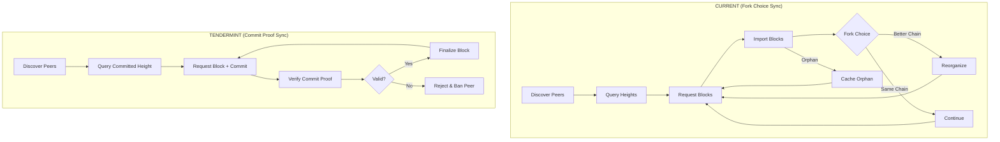
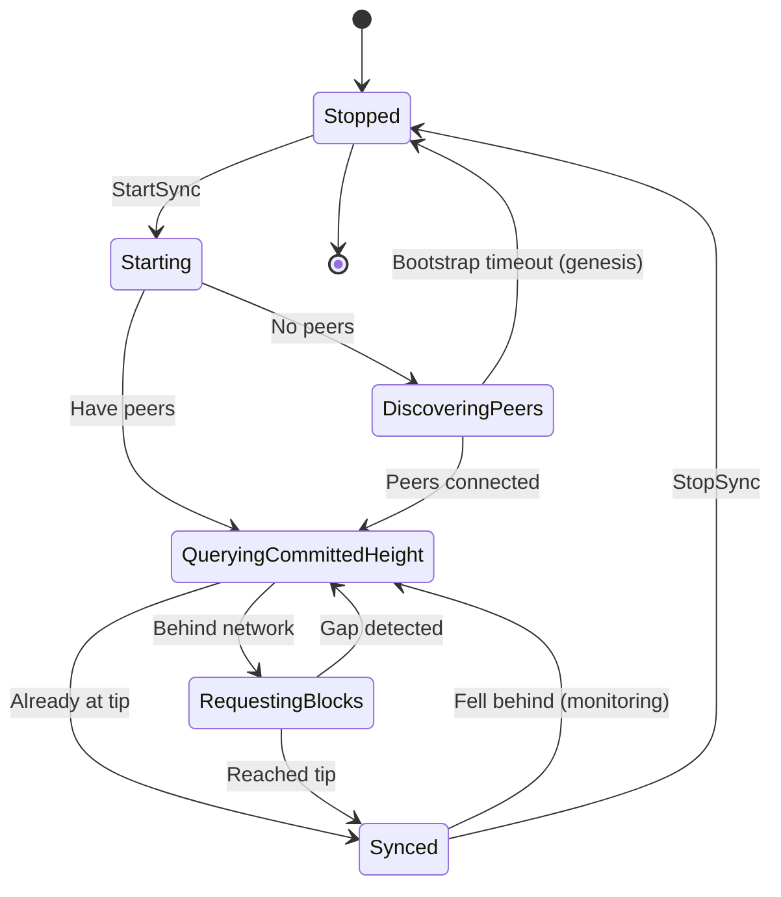
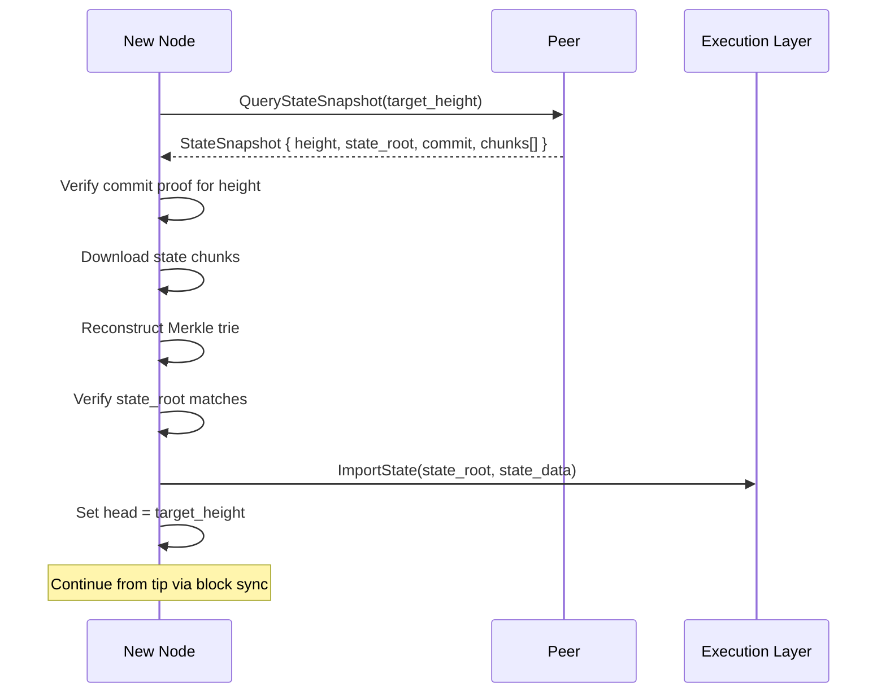

# Implementation Plan: SyncActor Modifications for Tendermint

## Overview

This document provides a comprehensive implementation guide for modifying the SyncActor to work with Tendermint consensus. The fundamental change is from probabilistic-finality sync (with fork choice, orphan handling, and reorg support) to instant-finality sync (with commit proof verification and linear block progression).

**Estimated Effort**: 1-2 weeks
**Dependencies**:
- `01_MESSAGE_TYPES_AND_PROTOCOL_FOUNDATION.md` (Commit type)
- `04_CHAINACTOR_HANDLERS.md` (Block finalization)
- `05_NETWORK_LAYER.md` (Commit gossip)
**Files to Modify**:
- `app/src/actors_v2/network/sync_actor.rs`
- `app/src/actors_v2/network/messages.rs`
- `app/src/actors_v2/chain/messages.rs`
- `app/src/actors_v2/chain/handlers.rs`

**Files to Delete**:
- `app/src/actors_v2/chain/fork_choice.rs` (~794 lines)
- `app/src/actors_v2/chain/reorganization.rs` (~623 lines)
- `app/src/actors_v2/chain/orphan_cache.rs` (~300 lines)

---

## 1. Conceptual Change: Probabilistic vs Instant Finality

### 1.1 Current (Aura/PoW) vs Tendermint Sync



### 1.2 Key Differences

| Aspect | Current (Aura) | Tendermint |
|--------|----------------|------------|
| Height Discovery | Mode/Median of peer heights | Query committed height with proof |
| Block Validity | Parent exists, difficulty valid | Commit proof verifies 2/3+ signatures |
| Orphan Handling | Cache orphans, request parents | Not needed - blocks are final |
| Fork Choice | Cumulative difficulty | Not needed - single chain |
| Reorg Support | Yes (complex) | Not needed - no reorgs |
| State Machine | 8 states | 6 states |
| Bootstrap Detection | 30s timeout heuristic | Commit proof presence |

---

## 2. State Machine Simplification

### 2.1 Current State Machine (8 States)

```rust
// CURRENT: Complex state machine with orphan/fork support
pub enum SyncState {
    Stopped,
    Starting,
    DiscoveringPeers,
    QueryingNetworkHeight,  // Uses mode/median heuristics
    RequestingBlocks,
    ProcessingBlocks,       // May produce orphans, trigger reorgs
    Synced,
    Error(String),
}
```

### 2.2 New State Machine (6 States)

```rust
// TENDERMINT: Simplified for linear progression
pub enum SyncState {
    Stopped,
    Starting,
    DiscoveringPeers,
    QueryingCommittedHeight,  // NEW: Query with commit proof
    RequestingBlocks,         // Requests (Block, Commit) pairs
    Synced,
}

impl SyncState {
    /// Human-readable description for logging
    pub fn description(&self) -> &'static str {
        match self {
            SyncState::Stopped => "Stopped - Not syncing",
            SyncState::Starting => "Starting - Initializing sync",
            SyncState::DiscoveringPeers => "Discovering Peers - Waiting for connections",
            SyncState::QueryingCommittedHeight => "Querying - Getting network committed height",
            SyncState::RequestingBlocks => "Requesting - Fetching committed blocks",
            SyncState::Synced => "Synced - At network tip",
        }
    }
}
```

### 2.3 State Transition Diagram



---

## 3. Commit Proof Verification

### 3.1 New Types for Sync

```rust
// In network/messages.rs

/// Block with its commit proof for sync
#[derive(Debug, Clone)]
pub struct CommittedBlock {
    /// The consensus block
    pub block: SignedConsensusBlock<MainnetEthSpec>,

    /// The commit proof (2/3+ validator signatures)
    pub commit: Commit,
}

/// Response from committed height query
#[derive(Debug, Clone)]
pub struct CommittedHeightResponse {
    /// The node's latest committed height
    pub height: u64,

    /// The block hash at that height
    pub block_hash: BlockHash,

    /// The commit proof for that height (enables verification)
    pub commit: Commit,
}

/// Block request with commit requirement
#[derive(Debug, Clone)]
pub struct BlockWithCommitRequest {
    /// Starting height
    pub start_height: u64,

    /// Number of blocks to request
    pub count: u32,

    /// Correlation ID for request tracking
    pub correlation_id: Option<Uuid>,
}

/// Block response with commits
#[derive(Debug, Clone)]
pub struct BlockWithCommitResponse {
    /// Blocks with their commit proofs
    pub blocks: Vec<CommittedBlock>,

    /// Correlation ID for request tracking
    pub correlation_id: Option<Uuid>,
}
```

### 3.2 Commit Verification Logic

```rust
// In sync_actor.rs

impl SyncActor {
    /// Verify a commit proof for a block
    ///
    /// # Verification Steps
    ///
    /// 1. Check commit height matches block height
    /// 2. Check commit block_hash matches block hash
    /// 3. Verify 2/3+ validators signed
    /// 4. Verify aggregate signature
    ///
    /// # Returns
    ///
    /// `Ok(())` if valid, `Err(SyncError)` with reason if invalid
    fn verify_commit(
        &self,
        block: &SignedConsensusBlock<MainnetEthSpec>,
        commit: &Commit,
    ) -> Result<(), SyncError> {
        let block_hash = block.message.hash();
        let height = block.message.slot;

        // 1. Height must match
        if commit.height != height {
            return Err(SyncError::CommitVerification(format!(
                "Commit height {} does not match block height {}",
                commit.height, height
            )));
        }

        // 2. Block hash must match
        if commit.block_hash != block_hash {
            return Err(SyncError::CommitVerification(format!(
                "Commit block_hash {:?} does not match block hash {:?}",
                commit.block_hash, block_hash
            )));
        }

        // 3. Check 2/3+ threshold
        let num_signers = commit.num_signers();
        let threshold = self.validator_set.two_thirds_threshold();

        if num_signers < threshold {
            return Err(SyncError::CommitVerification(format!(
                "Insufficient signers: {} < {} required",
                num_signers, threshold
            )));
        }

        // 4. Verify aggregate signature
        let signing_keys = self.collect_signer_keys(commit)?;
        let signing_root = compute_precommit_signing_root(
            commit.height,
            commit.round,
            commit.block_hash,
        );

        if !commit.aggregate_signature.verify(&signing_keys, signing_root) {
            return Err(SyncError::CommitVerification(
                "Invalid aggregate signature".to_string()
            ));
        }

        tracing::debug!(
            height = height,
            signers = num_signers,
            threshold = threshold,
            "Commit proof verified successfully"
        );

        Ok(())
    }

    /// Collect public keys of signers from commit
    fn collect_signer_keys(&self, commit: &Commit) -> Result<Vec<PublicKey>, SyncError> {
        let keys: Vec<_> = commit.signers.iter()
            .enumerate()
            .filter(|(_, &signed)| signed)
            .filter_map(|(i, _)| {
                self.validator_set
                    .get_public_key(&ValidatorId(i as u8))
                    .ok()
                    .cloned()
            })
            .collect();

        if keys.len() != commit.num_signers() {
            return Err(SyncError::CommitVerification(
                "Could not resolve all signer public keys".to_string()
            ));
        }

        Ok(keys)
    }
}
```

---

## 4. Updated SyncActorState

### 4.1 Fields to Remove

```rust
// REMOVE from SyncActorState:

// Orphan-related (not needed with instant finality)
// - observed_height field (from ChainStatus)
// - orphan_count tracking

// Fork-choice related (not needed)
// - Any cumulative difficulty tracking
// - Best chain comparisons

// Height discovery heuristics (replaced by commit proofs)
// - observed_peer_heights: Vec<u64>  // Used for mode calculation
// - Mode/median calculations
```

### 4.2 Fields to Add

```rust
// ADD to SyncActorState:

/// Validator set for commit verification (updated per epoch)
validator_set: ValidatorSet,

/// Latest verified committed height from network
committed_network_height: u64,

/// Commit proof for the latest committed height (for verification)
latest_network_commit: Option<Commit>,

/// Pending block requests with commit requirement
pending_block_commits: HashMap<String, PendingBlockRequest>,
```

### 4.3 Updated SyncActorState Structure

```rust
/// Mutable state for Tendermint-compatible SyncActor
struct SyncActorState {
    // === Core State ===
    /// Current sync state
    sync_state: SyncState,

    /// Current committed height (our chain tip)
    current_height: u64,

    /// Target committed height (network tip with proof)
    target_height: u64,

    /// Running state
    is_running: bool,

    // === Peer Management ===
    /// Available sync peers
    sync_peers: Vec<PeerId>,

    /// Peer selection index (round-robin)
    peer_selection_index: usize,

    // === Request Tracking ===
    /// Active block+commit requests
    active_requests: HashMap<String, BlockCommitRequestInfo>,

    /// Block queue (now includes commit proofs)
    block_queue: VecDeque<CommittedBlock>,

    // === Metrics ===
    /// Sync metrics
    metrics: SyncMetrics,

    // === Timing ===
    /// Timestamp when current sync_state was entered
    state_entered_at: SystemTime,

    /// Last sync completion time (for cooldown)
    last_sync_completed_at: Option<Instant>,

    // === Active Monitoring ===
    /// Timestamped peer height observations
    peer_height_observations: Vec<PeerHeightObservation>,

    /// Consecutive checks showing node is behind
    consecutive_behind_checks: u32,
}
```

---

## 5. Message Handler Modifications

### 5.1 StartSync Handler

```rust
// BEFORE: Complex mode/median discovery
SyncMessage::StartSync { start_height, target_height } => {
    // ... discover peers ...
    // ... transition to QueryingNetworkHeight ...
    // Uses mode/median of peer heights
}

// AFTER: Commit-proof based discovery
SyncMessage::StartSync { start_height } => {
    let state = std::sync::Arc::clone(&self.state);
    let network_actor = self.network_actor.clone();

    ctx.spawn(async move {
        let mut s = state.write().unwrap();

        // Validate state
        if !matches!(s.sync_state, SyncState::Stopped | SyncState::Synced) {
            tracing::warn!(state = ?s.sync_state, "Sync already running");
            return;
        }

        // Initialize state
        s.current_height = start_height;
        s.is_running = true;
        s.transition_to_state(SyncState::Starting);

        // Check for peers
        if s.sync_peers.is_empty() {
            s.transition_to_state(SyncState::DiscoveringPeers);
            return;
        }

        // Have peers - query committed height with proof
        s.transition_to_state(SyncState::QueryingCommittedHeight);

        drop(s);

        // Query network for committed height
        if let Some(network) = network_actor {
            let _ = network.send(NetworkMessage::QueryCommittedHeight).await;
        }
    }.into_actor(self));

    Ok(SyncResponse::Started)
}
```

### 5.2 New QueryCommittedHeight Handler

```rust
SyncMessage::ReportCommittedHeight { height, block_hash, commit } => {
    // Received committed height with proof from a peer
    let state = std::sync::Arc::clone(&self.state);
    let validator_set = self.validator_set.clone();

    ctx.spawn(async move {
        // 1. Verify the commit proof
        if let Err(e) = Self::verify_commit_static(&validator_set, height, block_hash, &commit) {
            tracing::warn!(
                peer = %peer_id,
                height = height,
                error = %e,
                "Invalid committed height proof - ignoring"
            );
            return;
        }

        let mut s = state.write().unwrap();

        // 2. Update target if this is higher than known
        if height > s.target_height {
            tracing::info!(
                previous_target = s.target_height,
                new_target = height,
                "Discovered higher committed height with valid proof"
            );

            s.target_height = height;
            s.latest_network_commit = Some(commit);

            // 3. Transition to requesting if behind
            if s.sync_state == SyncState::QueryingCommittedHeight {
                if s.current_height < height {
                    s.transition_to_state(SyncState::RequestingBlocks);
                } else {
                    s.transition_to_state(SyncState::Synced);
                    s.is_running = false;
                }
            }
        }
    }.into_actor(self));

    Ok(SyncResponse::Started)
}
```

### 5.3 RequestBlocks with Commit Requirement

```rust
SyncMessage::RequestBlocks { start_height, count, peer_id } => {
    let state = std::sync::Arc::clone(&self.state);
    let network_actor = self.network_actor.clone();

    // Create request tracking
    let (is_running, target_peer, request_id) = {
        let mut s = self.state.write().unwrap();

        if !s.is_running {
            return Err(SyncError::NotStarted);
        }

        let target_peer = peer_id.unwrap_or_else(|| s.select_sync_peer());
        let request_id = Uuid::new_v4().to_string();

        s.active_requests.insert(request_id.clone(), BlockCommitRequestInfo {
            request_id: request_id.clone(),
            start_height,
            count,
            peer_id: target_peer.clone(),
            requested_at: SystemTime::now(),
        });

        (true, target_peer, request_id)
    };

    // Send request to NetworkActor
    if let Some(network) = network_actor {
        ctx.spawn(async move {
            // CRITICAL: Request blocks WITH commit proofs
            if let Err(e) = network.send(NetworkMessage::RequestBlocksWithCommit {
                start_height,
                count,
                peer_id: target_peer.clone(),
                correlation_id: Some(Uuid::parse_str(&request_id).unwrap()),
            }).await {
                tracing::error!(
                    request_id = %request_id,
                    error = %e,
                    "Failed to request blocks with commits"
                );

                let mut s = state.write().unwrap();
                s.active_requests.remove(&request_id);
            }
        }.into_actor(self));
    }

    Ok(SyncResponse::BlocksRequested { request_id })
}
```

### 5.4 HandleBlockResponse with Commit Verification

```rust
SyncMessage::HandleBlockWithCommitResponse { blocks, request_id, peer_id } => {
    tracing::info!(
        block_count = blocks.len(),
        request_id = %request_id,
        peer = %peer_id,
        "Received blocks with commit proofs"
    );

    let state = std::sync::Arc::clone(&self.state);
    let chain_actor = self.chain_actor.clone();
    let validator_set = self.validator_set.clone();

    ctx.spawn(async move {
        // Process each block with its commit
        for committed_block in blocks {
            let block = &committed_block.block;
            let commit = &committed_block.commit;
            let height = block.message.slot;

            // 1. Verify commit proof BEFORE importing
            if let Err(e) = Self::verify_commit_static(
                &validator_set,
                height,
                block.message.hash(),
                commit
            ) {
                tracing::error!(
                    height = height,
                    peer = %peer_id,
                    error = %e,
                    "Invalid commit proof - rejecting block and banning peer"
                );

                // TODO: Ban peer for sending invalid commit
                break;
            }

            // 2. Import verified block to ChainActor
            if let Some(chain) = &chain_actor {
                match chain.send(ChainMessage::ImportFinalizedBlock {
                    block: block.clone(),
                    commit: commit.clone(),
                    source: BlockSource::Sync,
                }).await {
                    Ok(Ok(_)) => {
                        tracing::debug!(
                            height = height,
                            "Successfully imported finalized block"
                        );

                        // Update current height
                        let mut s = state.write().unwrap();
                        if height > s.current_height {
                            s.current_height = height;
                        }
                    }
                    Ok(Err(e)) => {
                        tracing::error!(
                            height = height,
                            error = ?e,
                            "Failed to import block"
                        );
                    }
                    Err(e) => {
                        tracing::error!(
                            height = height,
                            error = %e,
                            "ChainActor mailbox error"
                        );
                    }
                }
            }
        }

        // Clean up request tracking
        {
            let mut s = state.write().unwrap();
            s.active_requests.remove(&request_id);
        }
    }.into_actor(self));

    Ok(SyncResponse::BlockProcessed { block_height: 0 })
}
```

---

## 6. Code Removal

### 6.1 Files to Delete Entirely

```bash
# These files are for probabilistic finality - not needed with Tendermint
rm app/src/actors_v2/chain/fork_choice.rs      # ~794 lines
rm app/src/actors_v2/chain/reorganization.rs   # ~623 lines
rm app/src/actors_v2/chain/orphan_cache.rs     # ~300 lines
```

### 6.2 Code to Remove from SyncActor

```rust
// REMOVE: Mode/median height calculation (lines 328-405)
// These heuristics are for probabilistic systems without proofs

fn calculate_mode(heights: &[u64]) -> u64 { ... }  // REMOVE
fn calculate_median_height(...) -> Option<u64> { ... }  // REMOVE

// REMOVE: observed_peer_heights collection
// REMOVE: Mode-based height discovery in ReportPeerHeights
// REMOVE: Bootstrap timeout for genesis (commit proofs handle this)
```

### 6.3 Code to Remove from ChainActor

```rust
// In chain/handlers.rs, REMOVE:

// Fork choice logic
fn compare_chains(...) -> ChainComparison { ... }  // REMOVE
fn calculate_cumulative_difficulty(...) { ... }    // REMOVE

// Reorg handling
fn handle_potential_reorg(...) { ... }  // REMOVE
fn reorganize_to_new_tip(...) { ... }   // REMOVE

// Orphan caching
fn cache_orphan_block(...) { ... }  // REMOVE
fn process_orphan_queue(...) { ... }  // REMOVE

// In chain/state.rs, REMOVE:
pub observed_height: u64,       // From ChainStatus
pub orphan_count: usize,        // From ChainStatus
// Any cumulative_difficulty tracking
```

---

## 7. New ChainActor Handler: ImportFinalizedBlock

### 7.1 Message Definition

```rust
// In chain/messages.rs

/// Import a finalized block with its commit proof
///
/// Unlike ImportBlock (for probabilistic systems), this message:
/// 1. Requires a valid commit proof
/// 2. Does not trigger fork choice
/// 3. Does not handle orphans
/// 4. Is immediately final
#[derive(Debug, Clone)]
pub enum ChainMessage {
    // ... existing messages ...

    /// Import a block that has been finalized through Tendermint consensus
    ImportFinalizedBlock {
        /// The block to import
        block: SignedConsensusBlock<MainnetEthSpec>,

        /// The commit proof (2/3+ validator signatures)
        commit: Commit,

        /// Source of the block (Sync, Gossip, etc.)
        source: BlockSource,
    },
}
```

### 7.2 Handler Implementation

```rust
// In chain/handlers.rs

ChainMessage::ImportFinalizedBlock { block, commit, source } => {
    let height = block.message.slot;
    let block_hash = block.message.hash();

    tracing::info!(
        height = height,
        block_hash = ?block_hash,
        source = ?source,
        signers = commit.num_signers(),
        "Importing finalized block"
    );

    // 1. Verify commit proof (defense in depth - sync already verified)
    if let Err(e) = self.validate_commit(&commit, block_hash) {
        return Err(ChainError::InvalidCommit(e.to_string()));
    }

    // 2. Verify parent exists (linear chain requirement)
    let parent_hash = block.message.parent_root;
    if !self.storage.has_block(&parent_hash).await? {
        return Err(ChainError::MissingParent(parent_hash));
    }

    // 3. Execute in EL
    let engine = self.engine_actor.as_ref()
        .ok_or(ChainError::EngineActorNotSet)?;

    let execute_result = engine.send(ExecuteBlockMessage {
        execution_payload: block.message.execution_payload.clone(),
        finalized: true,
        parent_hash: block.message.execution_payload.parent_hash,
        correlation_id: None,
    }).await
        .map_err(|e| ChainError::ActorMailbox(e.to_string()))?
        .map_err(|e| ChainError::ExecutionLayerError(e.to_string()))?;

    if execute_result.status != PayloadStatus::Valid {
        return Err(ChainError::ExecutionFailed(format!(
            "Invalid payload: {:?}",
            execute_result.status
        )));
    }

    // 4. Store block and commit
    let storage = self.storage_actor.as_ref()
        .ok_or(ChainError::StorageActorNotSet)?;

    storage.send(StoreBlockMessage {
        block: SignedConsensusBlock::from_commit(block.message.clone(), commit.clone()),
        canonical: true,
        finalized: true,
        correlation_id: None,
    }).await
        .map_err(|e| ChainError::ActorMailbox(e.to_string()))?
        .map_err(|e| ChainError::Storage(e.to_string()))?;

    storage.send(StoreCommitMessage {
        height,
        commit: commit.clone(),
        correlation_id: None,
    }).await
        .map_err(|e| ChainError::ActorMailbox(e.to_string()))?
        .map_err(|e| ChainError::Storage(e.to_string()))?;

    // 5. Update chain head
    self.state.head = Some(BlockRef {
        hash: block_hash,
        height,
        execution_hash: execute_result.block_hash,
    });

    // 6. Notify SyncActor of new height
    if let Some(sync) = &self.sync_actor {
        let _ = sync.send(SyncMessage::UpdateCurrentHeight { height }).await;
    }

    // 7. Metrics
    TENDERMINT_BLOCKS_IMPORTED.inc();
    TENDERMINT_BLOCK_HEIGHT.set(height as i64);

    Ok(ChainResponse::BlockImported { height, hash: block_hash })
}
```

---

## 8. State Sync (New Capability)

### 8.1 Overview

With Tendermint's instant finality, state sync becomes viable. Nodes can sync state directly from a recent finalized block rather than replaying all blocks.

### 8.2 State Sync Flow



### 8.3 State Sync Types

```rust
// In sync/state_sync.rs (new file)

/// State snapshot metadata
#[derive(Debug, Clone)]
pub struct StateSnapshotInfo {
    /// Height of the snapshot
    pub height: u64,

    /// Execution layer state root
    pub state_root: Hash256,

    /// Commit proof for this height
    pub commit: Commit,

    /// Number of state chunks
    pub num_chunks: u32,

    /// Total state size in bytes
    pub total_size: u64,
}

/// Request for state snapshot
#[derive(Debug, Clone)]
pub struct StateSnapshotRequest {
    /// Target height (0 = latest)
    pub height: Option<u64>,

    /// Minimum trust period (height must be within this)
    pub min_trust_height: u64,
}

/// State chunk for transfer
#[derive(Debug, Clone)]
pub struct StateChunk {
    /// Chunk index
    pub index: u32,

    /// Chunk data (portion of state trie)
    pub data: Vec<u8>,

    /// Proof that chunk belongs to state_root
    pub proof: Vec<Hash256>,
}
```

### 8.4 State Sync Handler

```rust
// In sync_actor.rs

SyncMessage::StartStateSync { target_height } => {
    // State sync is only available with Tendermint (instant finality)
    // 1. Query peers for state snapshots
    // 2. Verify commit proof for snapshot height
    // 3. Download and verify state chunks
    // 4. Import state to EL
    // 5. Resume block sync from snapshot height

    let state = std::sync::Arc::clone(&self.state);
    let network_actor = self.network_actor.clone();

    ctx.spawn(async move {
        let mut s = state.write().unwrap();
        s.transition_to_state(SyncState::StateSync);
        drop(s);

        // 1. Query for snapshots
        if let Some(network) = &network_actor {
            let _ = network.send(NetworkMessage::QueryStateSnapshots {
                target_height,
                min_trust_height: 0, // Accept any height for now
            }).await;
        }

        // State sync continues via HandleStateSnapshot message
    }.into_actor(self));

    Ok(SyncResponse::Started)
}
```

---

## 9. Network Protocol Changes

### 9.1 New Network Messages

```rust
// In network/messages.rs

pub enum NetworkMessage {
    // ... existing messages ...

    /// Query a peer for their committed height with proof
    QueryCommittedHeight,

    /// Response with committed height and proof
    CommittedHeightResponse {
        height: u64,
        block_hash: BlockHash,
        commit: Commit,
    },

    /// Request blocks with their commit proofs
    RequestBlocksWithCommit {
        start_height: u64,
        count: u32,
        peer_id: PeerId,
        correlation_id: Option<Uuid>,
    },

    /// Response with blocks and commits
    BlocksWithCommitResponse {
        blocks: Vec<CommittedBlock>,
        correlation_id: Option<Uuid>,
    },

    /// Query for state snapshots (state sync)
    QueryStateSnapshots {
        target_height: Option<u64>,
        min_trust_height: u64,
    },

    /// State snapshot info response
    StateSnapshotResponse(StateSnapshotInfo),

    /// Request state chunk
    RequestStateChunk {
        height: u64,
        chunk_index: u32,
    },

    /// State chunk response
    StateChunkResponse(StateChunk),
}
```

### 9.2 Wire Protocol

```rust
// In network/protocol.rs

/// Tendermint sync wire messages
#[derive(Debug, Clone, Serialize, Deserialize)]
pub enum TendermintSyncWire {
    /// Query committed height
    QueryCommittedHeight,

    /// Committed height response
    CommittedHeight {
        height: u64,
        block_hash: [u8; 32],
        commit_bytes: Vec<u8>,  // SSZ-encoded Commit
    },

    /// Request blocks with commits
    RequestBlocksWithCommit {
        start_height: u64,
        count: u32,
        request_id: [u8; 16],  // UUID bytes
    },

    /// Blocks with commits response
    BlocksWithCommit {
        blocks: Vec<CommittedBlockWire>,
        request_id: [u8; 16],
    },
}

#[derive(Debug, Clone, Serialize, Deserialize)]
pub struct CommittedBlockWire {
    /// SSZ-encoded block
    pub block_bytes: Vec<u8>,

    /// SSZ-encoded commit
    pub commit_bytes: Vec<u8>,
}
```

---

## 10. Active Monitoring Simplification

### 10.1 Current (Complex)

```rust
// CURRENT: Uses mode/median heuristics, complex gap detection
let network_height = match Self::calculate_median_height(
    &s.peer_height_observations,
    max_age,
    self.config.min_peer_quorum,
) { ... }
```

### 10.2 Tendermint (Simple)

```rust
// TENDERMINT: Just verify commit proofs
SyncMessage::ReportCommittedHeight { height, block_hash, commit } => {
    // Verify the commit proof
    if let Err(e) = self.verify_commit_static(&self.validator_set, height, block_hash, &commit) {
        tracing::debug!(height = height, "Invalid commit proof in monitoring");
        return Ok(SyncResponse::Started);
    }

    let mut s = self.state.write().unwrap();

    // Simple comparison - no heuristics needed
    if height > s.current_height + self.config.resync_threshold {
        if s.consecutive_behind_checks >= 2 {
            tracing::warn!(
                current = s.current_height,
                network = height,
                "Fell behind committed height - triggering resync"
            );
            s.is_running = true;
            s.target_height = height;
            s.transition_to_state(SyncState::RequestingBlocks);
        } else {
            s.consecutive_behind_checks += 1;
        }
    } else {
        s.consecutive_behind_checks = 0;
    }

    Ok(SyncResponse::Started)
}
```

---

## 11. Configuration Changes

### 11.1 Fields to Remove

```rust
// REMOVE from SyncConfig:
pub peer_height_max_age_secs: u64,  // Not needed - commit proofs are self-validating
pub min_peer_quorum: usize,          // Not needed - one valid commit is enough
```

### 11.2 Updated Configuration

```rust
/// Tendermint sync configuration
#[derive(Debug, Clone)]
pub struct SyncConfig {
    // === Block Fetching ===
    /// Maximum blocks per request
    pub max_blocks_per_request: u32,

    /// Maximum concurrent block requests
    pub max_concurrent_requests: usize,

    /// Request timeout
    pub sync_timeout: Duration,

    // === Peer Management ===
    /// Maximum sync peers
    pub max_sync_peers: usize,

    /// Peer height poll interval (for monitoring)
    pub peer_height_poll_interval_secs: u64,

    // === Re-sync Triggers ===
    /// Height gap that triggers re-sync
    pub resync_threshold: u64,

    /// Cooldown after sync before allowing re-sync
    pub sync_cooldown_secs: u64,

    // === State Sync (new) ===
    /// Enable state sync for fast bootstrap
    pub enable_state_sync: bool,

    /// Minimum height for state sync (security parameter)
    pub state_sync_min_trust_height: u64,

    // === Storage ===
    /// Data directory for checkpoints
    pub data_dir: PathBuf,
}
```

---

## 12. Testing Strategy

### 12.1 Unit Tests

```rust
#[cfg(test)]
mod tendermint_sync_tests {
    use super::*;

    #[tokio::test]
    async fn test_commit_verification_valid() {
        let validator_set = create_test_validator_set(15);
        let block = create_test_block(100);
        let commit = create_valid_commit(&block, &validator_set, 11); // 11/15 = 73%

        let actor = create_test_sync_actor(validator_set);
        let result = actor.verify_commit(&block, &commit);

        assert!(result.is_ok());
    }

    #[tokio::test]
    async fn test_commit_verification_insufficient_signers() {
        let validator_set = create_test_validator_set(15);
        let block = create_test_block(100);
        let commit = create_valid_commit(&block, &validator_set, 9); // 9/15 = 60% < 67%

        let actor = create_test_sync_actor(validator_set);
        let result = actor.verify_commit(&block, &commit);

        assert!(matches!(result, Err(SyncError::CommitVerification(_))));
    }

    #[tokio::test]
    async fn test_commit_verification_wrong_block_hash() {
        let validator_set = create_test_validator_set(15);
        let block = create_test_block(100);
        let wrong_block = create_test_block(101);
        let commit = create_valid_commit(&wrong_block, &validator_set, 11);

        let actor = create_test_sync_actor(validator_set);
        let result = actor.verify_commit(&block, &commit);

        assert!(matches!(result, Err(SyncError::CommitVerification(_))));
    }

    #[tokio::test]
    async fn test_sync_state_transitions() {
        let actor = create_test_sync_actor_with_peers(vec!["peer1".to_string()]);

        // Start sync
        actor.handle(SyncMessage::StartSync { start_height: 0 }, &mut ctx).unwrap();

        // Should transition to QueryingCommittedHeight (have peers)
        let state = actor.state.read().unwrap();
        assert_eq!(state.sync_state, SyncState::QueryingCommittedHeight);
    }

    #[tokio::test]
    async fn test_import_finalized_block() {
        let actor = setup_full_test_actor().await;
        let block = create_test_block(1);
        let commit = create_valid_commit(&block, 11);

        let result = actor.handle(SyncMessage::HandleBlockWithCommitResponse {
            blocks: vec![CommittedBlock { block, commit }],
            request_id: "test".to_string(),
            peer_id: "peer1".to_string(),
        }, &mut ctx);

        assert!(result.is_ok());

        // Verify block was imported
        let state = actor.state.read().unwrap();
        assert_eq!(state.current_height, 1);
    }
}
```

### 12.2 Integration Tests

```rust
#[tokio::test]
async fn test_full_sync_flow_with_commits() {
    // 1. Setup 4-node network with Tendermint
    let nodes = setup_tendermint_testnet(4).await;

    // 2. Produce 10 blocks with commits
    for _ in 0..10 {
        produce_and_commit_block(&nodes).await;
    }

    // 3. Start new node that needs to sync
    let new_node = start_new_node().await;

    // 4. Trigger sync
    new_node.sync_actor.send(SyncMessage::StartSync {
        start_height: 0,
    }).await.unwrap();

    // 5. Wait for sync completion
    tokio::time::sleep(Duration::from_secs(10)).await;

    // 6. Verify new node has all blocks with commits
    for height in 1..=10 {
        let block = new_node.storage.get_block_by_height(height).await.unwrap();
        assert!(block.is_some());

        let commit = new_node.storage.get_commit(height).await.unwrap();
        assert!(commit.is_some());
        assert!(commit.unwrap().num_signers() >= 11); // 2/3+ of 15
    }
}

#[tokio::test]
async fn test_active_monitoring_triggers_resync() {
    // 1. Setup synced node
    let node = setup_synced_node(100).await;

    // 2. Simulate network advancing while node is offline
    // (node.current_height = 100, network = 150)

    // 3. Report higher committed height
    node.sync_actor.send(SyncMessage::ReportCommittedHeight {
        height: 150,
        block_hash: Hash256::random(),
        commit: create_valid_commit_for_height(150),
    }).await.unwrap();

    // Wait for consecutive check
    tokio::time::sleep(Duration::from_secs(35)).await;

    // 4. Report again
    node.sync_actor.send(SyncMessage::ReportCommittedHeight {
        height: 155,
        block_hash: Hash256::random(),
        commit: create_valid_commit_for_height(155),
    }).await.unwrap();

    // 5. Verify resync triggered
    let state = node.sync_actor.state.read().unwrap();
    assert_eq!(state.sync_state, SyncState::RequestingBlocks);
}
```

---

## 13. Migration Strategy

### 13.1 Feature Flag Approach

```rust
// In Cargo.toml
[features]
tendermint = []

// In sync_actor.rs
#[cfg(feature = "tendermint")]
mod tendermint_sync;

#[cfg(not(feature = "tendermint"))]
mod probabilistic_sync;

#[cfg(feature = "tendermint")]
pub use tendermint_sync::SyncActor;

#[cfg(not(feature = "tendermint"))]
pub use probabilistic_sync::SyncActor;
```

### 13.2 Gradual Migration Steps

1. **Phase 1**: Add commit verification alongside existing sync
2. **Phase 2**: Add `ImportFinalizedBlock` handler to ChainActor
3. **Phase 3**: Remove fork choice/orphan code (behind feature flag)
4. **Phase 4**: Simplify state machine
5. **Phase 5**: Add state sync support
6. **Phase 6**: Remove feature flag, delete old code

---

## 14. Checklist

- [ ] Define `CommittedBlock`, `CommittedHeightResponse` types
- [ ] Implement `verify_commit` in SyncActor
- [ ] Simplify `SyncState` enum (8 → 6 states)
- [ ] Update `SyncActorState` fields
- [ ] Implement `QueryCommittedHeight` handler
- [ ] Implement `RequestBlocksWithCommit` handler
- [ ] Implement `HandleBlockWithCommitResponse` handler
- [ ] Add `ImportFinalizedBlock` to ChainActor
- [ ] Remove `fork_choice.rs` (behind feature flag)
- [ ] Remove `reorganization.rs` (behind feature flag)
- [ ] Remove `orphan_cache.rs` (behind feature flag)
- [ ] Remove mode/median calculations
- [ ] Update `SyncConfig` structure
- [ ] Add network wire protocol for commits
- [ ] Implement active monitoring with commit verification
- [ ] Add state sync types and handlers (optional)
- [ ] Write unit tests for commit verification
- [ ] Write integration tests for full sync flow
- [ ] Update documentation

---

## 15. Metrics

```rust
lazy_static! {
    /// Blocks synced via Tendermint sync
    static ref TENDERMINT_SYNC_BLOCKS: IntCounter = IntCounter::new(
        "tendermint_sync_blocks_total",
        "Total blocks synced with commit proofs"
    ).unwrap();

    /// Invalid commit proofs received
    static ref TENDERMINT_SYNC_INVALID_COMMITS: IntCounter = IntCounter::new(
        "tendermint_sync_invalid_commits_total",
        "Commit proofs that failed verification"
    ).unwrap();

    /// Sync state gauge (0=Stopped, 1=Starting, etc.)
    static ref TENDERMINT_SYNC_STATE: IntGauge = IntGauge::new(
        "tendermint_sync_state",
        "Current sync state"
    ).unwrap();

    /// Time to sync to network tip
    static ref TENDERMINT_SYNC_DURATION: Histogram = Histogram::with_opts(
        HistogramOpts::new(
            "tendermint_sync_duration_seconds",
            "Time to complete sync"
        )
    ).unwrap();
}
```

---

*Implementation Plan Version: 1.0*
*Last Updated: January 2026*
