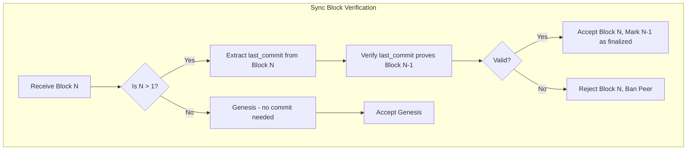
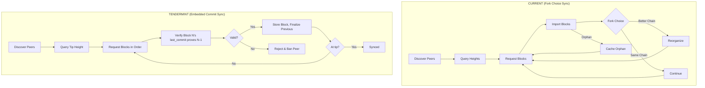
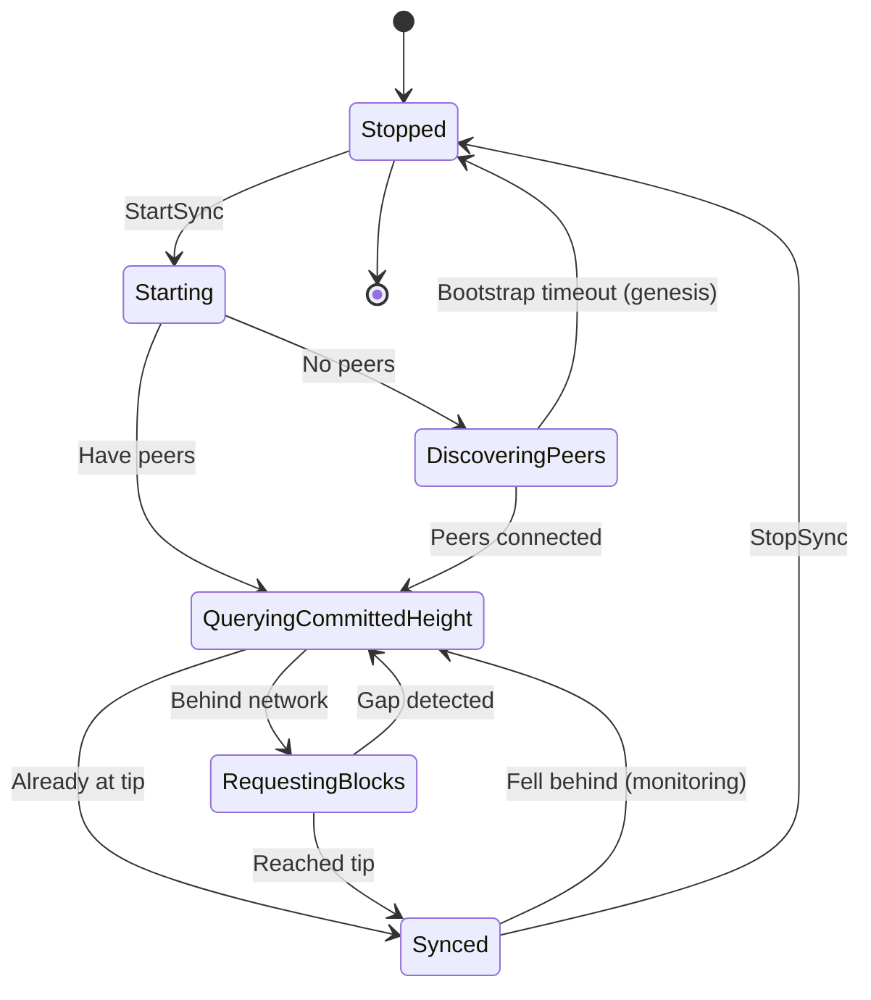

# Implementation Plan: SyncActor Modifications for Tendermint

## Overview

This document provides a comprehensive implementation guide for modifying the SyncActor to work with Tendermint consensus. The fundamental change is from probabilistic-finality sync (with fork choice, orphan handling, and reorg support) to instant-finality sync (with commit proof verification and linear block progression).

**Key Design Decision**: Following standard Tendermint/CometBFT architecture, **LastCommit is embedded in the block structure**. Block N contains the commit proof for Block N-1. This affects how sync verifies finality.

**Estimated Effort**: 1-2 weeks
**Dependencies**:
- `01_MESSAGE_TYPES_AND_PROTOCOL_FOUNDATION.md` (Commit, CommitSig, BlockIDFlag)
- `04_CHAINACTOR_HANDLERS.md` (Block finalization, blocks_without_pow)
- `05_NETWORK_LAYER.md` (Block gossip, peer scoring)
- `06_WAL.md` (Crash recovery)
- `07_EL_COORDINATION.md` (execute_synced_block)
- `11_STORAGE_SCHEMA_MIGRATION.md` (Storage with embedded commits)
- `17_GOVERNANCE_PARAMETERS.md` (ValidatorSet changes during sync)
**Files to Modify**:
- `app/src/actors_v2/network/sync_actor.rs`
- `app/src/actors_v2/network/messages.rs`
- `app/src/actors_v2/chain/messages.rs`
- `app/src/actors_v2/chain/handlers.rs`

**Files to Delete**:
- `app/src/actors_v2/chain/fork_choice.rs` (~794 lines)
- `app/src/actors_v2/chain/reorganization.rs` (~623 lines)
- `app/src/actors_v2/chain/orphan_cache.rs` (~300 lines)

---

## Cross-Document Type References

| Type | Defined In | Usage Here |
|------|-----------|------------|
| `Commit` | `01_MESSAGE_TYPES` | Embedded in `block.last_commit` |
| `CommitSig` | `01_MESSAGE_TYPES` | Individual validator signatures |
| `BlockIDFlag` | `01_MESSAGE_TYPES` | Commit/Nil/Absent status |
| `SignedConsensusBlock` | `01_MESSAGE_TYPES` | Block structure with last_commit |
| `ValidatorSet` | `02_STATE_MACHINE` | For commit signature verification |
| `compute_precommit_signing_root` | `01_MESSAGE_TYPES` | Signing root for verification |
| `execute_synced_block` | `07_EL_COORDINATION` | EL execution during sync |
| `blocks_without_pow` | `04_CHAINACTOR_HANDLERS` | Liveness gate counter |
| `MisbehaviorReason` | `05_NETWORK_LAYER` | Peer scoring/banning |
| `RecoveredState` | `06_WAL` | Crash recovery |

---

## 1. Understanding Embedded LastCommit for Sync

### 1.1 Block Structure Recap

Each block contains the commit proof for the **previous** block:

```
Block N:
├── parent_hash: hash(Block N-1)
├── slot: N
├── last_commit: Commit for Block N-1  ← Proves N-1 is final
│   ├── height: N-1
│   ├── round: R
│   ├── block_hash: hash(Block N-1)
│   └── signatures: [CommitSig, ...]
├── execution_payload
└── ... other fields
```

### 1.2 Finality Verification During Sync

```
Sync receives blocks in order:

Block 1 (last_commit: None - genesis has no commit)
Block 2 (last_commit: Commit for Block 1) → Proves Block 1 is final
Block 3 (last_commit: Commit for Block 2) → Proves Block 2 is final
Block 4 (last_commit: Commit for Block 3) → Proves Block 3 is final
...
Block N (last_commit: Commit for Block N-1) → Proves Block N-1 is final

↳ Block N itself is NOT yet proven final until Block N+1 arrives
```

### 1.3 Sync Verification Strategy



---

## 2. Conceptual Change: Probabilistic vs Instant Finality

### 2.1 Current (Aura/PoW) vs Tendermint Sync



### 2.2 Key Differences

| Aspect | Current (Aura) | Tendermint |
|--------|----------------|------------|
| Height Discovery | Mode/Median of peer heights | Query committed height |
| Block Validity | Parent exists, difficulty valid | Block's last_commit proves parent |
| Commit Storage | N/A | Embedded in next block |
| Orphan Handling | Cache orphans, request parents | Not needed - blocks are final |
| Fork Choice | Cumulative difficulty | Not needed - single chain |
| Reorg Support | Yes (complex) | Not needed - no reorgs |
| State Machine | 8 states | 6 states |

---

## 3. State Machine Simplification

### 3.1 New State Machine (6 States)

```rust
/// Tendermint sync state machine
pub enum SyncState {
    /// Sync not running
    Stopped,

    /// Initializing sync
    Starting,

    /// Waiting for peer connections
    DiscoveringPeers,

    /// Querying network for committed height
    QueryingCommittedHeight,

    /// Fetching and verifying blocks
    RequestingBlocks,

    /// At network tip, monitoring for new blocks
    Synced,
}

impl SyncState {
    pub fn description(&self) -> &'static str {
        match self {
            SyncState::Stopped => "Stopped - Not syncing",
            SyncState::Starting => "Starting - Initializing sync",
            SyncState::DiscoveringPeers => "Discovering Peers - Waiting for connections",
            SyncState::QueryingCommittedHeight => "Querying - Getting network committed height",
            SyncState::RequestingBlocks => "Requesting - Fetching blocks with embedded commits",
            SyncState::Synced => "Synced - At network tip",
        }
    }
}
```

### 3.2 State Transition Diagram



---

## 4. Sync Types and Messages

### 4.0 Error Types and Enums

```rust
// In network/messages.rs

/// Sync-related errors
#[derive(Debug, Clone, thiserror::Error)]
pub enum SyncError {
    /// Sync not started
    #[error("Sync not started")]
    NotStarted,

    /// Commit verification failed
    #[error("Commit verification failed: {0}")]
    CommitVerification(String),

    /// Block validation failed
    #[error("Block validation failed: {0}")]
    BlockValidation(String),

    /// Request timed out
    #[error("Request timed out after {0:?}")]
    RequestTimeout(Duration),

    /// Peer banned or unavailable
    #[error("Peer unavailable: {0}")]
    PeerUnavailable(String),

    /// Rate limited by peer
    #[error("Rate limited by peer {0}")]
    RateLimited(PeerId),

    /// No peers available for sync
    #[error("No sync peers available")]
    NoPeers,

    /// Chain actor error
    #[error("Chain actor error: {0}")]
    ChainError(String),

    /// Network error
    #[error("Network error: {0}")]
    NetworkError(String),

    /// ValidatorSet mismatch during sync
    #[error("ValidatorSet mismatch at height {height}: {reason}")]
    ValidatorSetMismatch { height: u64, reason: String },

    /// Queue full - backpressure
    #[error("Block queue full ({size} blocks pending)")]
    QueueFull { size: usize },
}

/// Source of a block being imported
#[derive(Debug, Clone, Copy, PartialEq, Eq)]
pub enum BlockSource {
    /// Block received via sync protocol
    Sync,

    /// Block received via gossip (live consensus)
    Gossip,

    /// Block produced locally (we are proposer)
    Local,

    /// Block from WAL recovery
    Recovery,
}
```

### 4.1 Block Request/Response Types

```rust
// In network/messages.rs

/// Request for a range of blocks
#[derive(Debug, Clone)]
pub struct BlockRangeRequest {
    /// Starting height
    pub start_height: u64,

    /// Number of blocks to request
    pub count: u32,

    /// Correlation ID for request tracking
    pub correlation_id: Option<Uuid>,
}

/// Response with blocks (each block contains last_commit for previous)
#[derive(Debug, Clone)]
pub struct BlockRangeResponse {
    /// Blocks in height order
    /// Each block.last_commit proves the previous block
    pub blocks: Vec<SignedConsensusBlock<MainnetEthSpec>>,

    /// Correlation ID for request tracking
    pub correlation_id: Option<Uuid>,
}

/// Response from tip height query
#[derive(Debug, Clone)]
pub struct TipHeightResponse {
    /// The node's current tip height
    pub height: u64,

    /// The block hash at that height
    pub block_hash: BlockHash,

    /// Peer ID that responded
    pub peer_id: PeerId,
}
```

### 4.2 Tip Commit Request (for chain tip)

Since Block N's commit is in Block N+1, we need a way to verify the current tip before N+1 exists:

```rust
/// Request the current commit for a block (used for chain tip)
///
/// This is used when we have Block N but Block N+1 doesn't exist yet.
/// The commit will be embedded in N+1 once it's produced.
#[derive(Debug, Clone)]
pub struct TipCommitRequest {
    /// Height to get commit for
    pub height: u64,

    /// Expected block hash
    pub block_hash: BlockHash,
}

/// Response with the commit for the tip block
#[derive(Debug, Clone)]
pub struct TipCommitResponse {
    /// The commit proof
    pub commit: Commit,

    /// Peer that responded
    pub peer_id: PeerId,
}
```

---

## 5. Commit Verification Logic

### 5.1 Verifying Embedded LastCommit

```rust
impl SyncActor {
    /// Verify a block's last_commit proves the previous block was finalized.
    ///
    /// # Verification Steps
    ///
    /// 1. Check last_commit height == block height - 1
    /// 2. Check last_commit block_hash == block.parent_hash
    /// 3. Verify 2/3+ validators signed
    /// 4. Verify all signatures
    ///
    /// # Arguments
    ///
    /// * `block` - The block whose last_commit to verify
    /// * `parent_hash` - Expected parent hash (should match last_commit.block_hash)
    ///
    /// # Returns
    ///
    /// `Ok(())` if valid, `Err(SyncError)` with reason if invalid
    fn verify_block_last_commit(
        &self,
        block: &SignedConsensusBlock<MainnetEthSpec>,
        parent_hash: BlockHash,
    ) -> Result<(), SyncError> {
        let height = block.message.slot;

        // Genesis has no last_commit
        if height == 0 {
            if block.message.last_commit.is_some() {
                return Err(SyncError::CommitVerification(
                    "Genesis block should not have last_commit".to_string()
                ));
            }
            return Ok(());
        }

        // All other blocks MUST have last_commit
        let last_commit = block.message.last_commit.as_ref()
            .ok_or_else(|| SyncError::CommitVerification(format!(
                "Block {} missing required last_commit",
                height
            )))?;

        // 1. Height must be previous block
        if last_commit.height != height - 1 {
            return Err(SyncError::CommitVerification(format!(
                "last_commit height {} does not match expected {}",
                last_commit.height, height - 1
            )));
        }

        // 2. Block hash must match parent
        if last_commit.block_hash != parent_hash {
            return Err(SyncError::CommitVerification(format!(
                "last_commit block_hash {:?} does not match parent {:?}",
                last_commit.block_hash, parent_hash
            )));
        }

        // 3. Verify signatures
        self.verify_commit_signatures(last_commit)?;

        tracing::debug!(
            block_height = height,
            commit_for_height = last_commit.height,
            signers = last_commit.num_commit_signatures(),
            "Block's last_commit verified successfully"
        );

        Ok(())
    }

    /// Verify a commit has sufficient valid signatures
    fn verify_commit_signatures(&self, commit: &Commit) -> Result<(), SyncError> {
        let validator_set = &self.validator_set;

        // Check 2/3+ threshold
        let num_commit_sigs = commit.num_commit_signatures();
        let threshold = validator_set.two_thirds_threshold() as usize;

        if num_commit_sigs < threshold {
            return Err(SyncError::CommitVerification(format!(
                "Insufficient signers: {} < {} required",
                num_commit_sigs, threshold
            )));
        }

        // Verify each signature
        let signing_root = compute_precommit_signing_root(
            commit.height,
            commit.round,
            commit.block_hash,
        );

        for commit_sig in &commit.signatures {
            if commit_sig.block_id_flag != BlockIDFlag::Commit {
                continue; // Skip absent/nil
            }

            let validator_id = commit_sig.validator_address
                .ok_or_else(|| SyncError::CommitVerification(
                    "Commit signature missing validator address".to_string()
                ))?;

            let signature = commit_sig.signature.as_ref()
                .ok_or_else(|| SyncError::CommitVerification(
                    "Commit signature missing signature".to_string()
                ))?;

            let pubkey = validator_set.get_public_key(&validator_id)
                .map_err(|e| SyncError::CommitVerification(e.to_string()))?;

            if !signature.verify(pubkey, signing_root) {
                return Err(SyncError::CommitVerification(format!(
                    "Invalid signature from validator {}",
                    validator_id
                )));
            }
        }

        Ok(())
    }
}
```

### 5.2 Handling ValidatorSet Changes During Sync

During long sync operations, the validator set may change (see doc 17 for governance with H+2 activation). The SyncActor must use the correct validator set for each height:

```rust
impl SyncActor {
    /// Get the validator set that was active at a given height
    ///
    /// ValidatorSet changes are activated at H+2, so:
    /// - GovernanceUpdate at height H activates new set at H+2
    /// - We need to look up which set was active at the commit height
    async fn get_validator_set_for_height(
        &self,
        height: u64,
    ) -> Result<Arc<ValidatorSet>, SyncError> {
        // Query storage for the validator set active at this height
        let storage = self.storage_actor.as_ref()
            .ok_or(SyncError::NetworkError("Storage not available".to_string()))?;

        let validator_set = storage.send(GetValidatorSetAtHeight {
            height,
            correlation_id: None,
        }).await
            .map_err(|e| SyncError::NetworkError(e.to_string()))?
            .map_err(|e| SyncError::ValidatorSetMismatch {
                height,
                reason: e.to_string(),
            })?;

        Ok(Arc::new(validator_set))
    }

    /// Verify block's last_commit using the correct validator set for that height
    async fn verify_block_last_commit_with_height_lookup(
        &self,
        block: &SignedConsensusBlock<MainnetEthSpec>,
        parent_hash: BlockHash,
    ) -> Result<(), SyncError> {
        let height = block.message.slot;

        // Genesis has no last_commit
        if height == 0 {
            return Ok(());
        }

        let last_commit = block.message.last_commit.as_ref()
            .ok_or_else(|| SyncError::CommitVerification(
                format!("Block {} missing last_commit", height)
            ))?;

        // Get the validator set that was active when the parent was committed
        // This is the set that signed the commit
        let validator_set = self.get_validator_set_for_height(last_commit.height).await?;

        // Verify using the correct validator set
        self.verify_commit_signatures_with_set(&validator_set, last_commit)?;

        // Verify commit matches parent
        if last_commit.block_hash != parent_hash {
            return Err(SyncError::CommitVerification(
                "last_commit block_hash doesn't match parent".to_string()
            ));
        }

        Ok(())
    }
}
```

**Key Points:**
- Commits are signed by the validator set active at the commit height
- When syncing across governance updates, the validator set changes
- Must look up the historical validator set for each commit verification
- Storage keeps validator sets indexed by activation height (see doc 11)

---

## 6. Updated SyncActorState

### 6.1 Fields to Remove

```rust
// REMOVE from SyncActorState:

// Orphan-related (not needed with instant finality)
// - orphan_count tracking

// Fork-choice related (not needed)
// - Any cumulative difficulty tracking
// - Best chain comparisons

// Height discovery heuristics (replaced by simple queries)
// - observed_peer_heights: Vec<u64>  // Used for mode calculation
// - Mode/median calculations
```

### 6.2 Updated SyncActorState Structure

```rust
/// Mutable state for Tendermint-compatible SyncActor
struct SyncActorState {
    // === Core State ===
    /// Current sync state
    sync_state: SyncState,

    /// Current height (our chain tip)
    current_height: u64,

    /// Target height (network tip)
    target_height: u64,

    /// Running state
    is_running: bool,

    // === Finality Tracking ===
    /// Last height for which we have verified finality
    /// (We have block N+1 whose last_commit proves block N)
    last_finalized_height: u64,

    // === Peer Management ===
    /// Available sync peers
    sync_peers: Vec<PeerId>,

    /// Peer selection index (round-robin)
    peer_selection_index: usize,

    // === Request Tracking ===
    /// Active block requests
    active_requests: HashMap<String, BlockRequestInfo>,

    /// Block queue
    block_queue: VecDeque<SignedConsensusBlock<MainnetEthSpec>>,

    // === Metrics ===
    sync_metrics: SyncMetrics,

    // === Timing ===
    state_entered_at: SystemTime,
    last_sync_completed_at: Option<Instant>,

    // === Active Monitoring ===
    consecutive_behind_checks: u32,

    // === Backpressure ===
    /// Maximum blocks to queue before applying backpressure
    max_queue_size: usize,

    // === Rate Limiting ===
    /// Requests sent to each peer in current window
    peer_request_counts: HashMap<PeerId, u32>,

    /// Last rate limit window reset
    rate_limit_window_start: Instant,
}

impl SyncActorState {
    /// Check if we can accept more blocks (backpressure)
    fn can_accept_blocks(&self) -> bool {
        self.block_queue.len() < self.max_queue_size
    }

    /// Check if we can send request to peer (rate limiting)
    fn can_request_from_peer(&mut self, peer_id: &PeerId) -> bool {
        const RATE_LIMIT_WINDOW: Duration = Duration::from_secs(10);
        const MAX_REQUESTS_PER_WINDOW: u32 = 50;

        // Reset window if expired
        if self.rate_limit_window_start.elapsed() > RATE_LIMIT_WINDOW {
            self.peer_request_counts.clear();
            self.rate_limit_window_start = Instant::now();
        }

        let count = self.peer_request_counts.entry(peer_id.clone()).or_insert(0);
        if *count >= MAX_REQUESTS_PER_WINDOW {
            return false;
        }

        *count += 1;
        true
    }
}
```

### 6.3 Request Timeout Handling

```rust
/// Information about an active block request
#[derive(Debug, Clone)]
pub struct BlockRequestInfo {
    pub request_id: String,
    pub start_height: u64,
    pub count: u32,
    pub peer_id: PeerId,
    pub requested_at: SystemTime,
    pub timeout: Duration,
}

impl SyncActor {
    /// Check for timed out requests and retry or fail
    fn check_request_timeouts(&mut self) {
        const DEFAULT_TIMEOUT: Duration = Duration::from_secs(30);

        let mut timed_out = Vec::new();
        let now = SystemTime::now();

        {
            let s = self.state.read().unwrap();
            for (request_id, info) in &s.active_requests {
                if let Ok(elapsed) = now.duration_since(info.requested_at) {
                    if elapsed > info.timeout.max(DEFAULT_TIMEOUT) {
                        timed_out.push((request_id.clone(), info.clone()));
                    }
                }
            }
        }

        for (request_id, info) in timed_out {
            tracing::warn!(
                request_id = %request_id,
                peer = %info.peer_id,
                start_height = info.start_height,
                "Block request timed out"
            );

            SYNC_REQUEST_TIMEOUTS.inc();

            // Remove from active requests
            {
                let mut s = self.state.write().unwrap();
                s.active_requests.remove(&request_id);
            }

            // Retry with different peer
            self.retry_block_request(info.start_height, info.count);
        }
    }

    /// Retry a failed block request with a different peer
    fn retry_block_request(&self, start_height: u64, count: u32) {
        let state = Arc::clone(&self.state);
        let network_actor = self.network_actor.clone();

        tokio::spawn(async move {
            let peer_id = {
                let mut s = state.write().unwrap();
                s.select_sync_peer()
            };

            if let Some(network) = network_actor {
                let _ = network.send(NetworkMessage::RequestBlocks {
                    start_height,
                    count,
                    peer_id,
                    correlation_id: Some(Uuid::new_v4()),
                }).await;
            }
        });
    }
}
```

### 6.4 Backpressure Handling

When blocks arrive faster than we can process them:

```rust
impl SyncActor {
    /// Handle incoming blocks with backpressure
    async fn handle_blocks_with_backpressure(
        &self,
        blocks: Vec<SignedConsensusBlock<MainnetEthSpec>>,
        peer_id: PeerId,
    ) -> Result<(), SyncError> {
        let mut s = self.state.write().unwrap();

        // Check if queue is full
        if !s.can_accept_blocks() {
            tracing::warn!(
                queue_size = s.block_queue.len(),
                max_size = s.max_queue_size,
                "Block queue full - applying backpressure"
            );
            SYNC_BACKPRESSURE_EVENTS.inc();
            return Err(SyncError::QueueFull { size: s.block_queue.len() });
        }

        // Add blocks to queue
        for block in blocks {
            s.block_queue.push_back(block);
        }

        SYNC_QUEUE_SIZE.set(s.block_queue.len() as i64);

        Ok(())
    }

    /// Process blocks from queue (called periodically)
    async fn process_block_queue(&self) {
        loop {
            let block = {
                let mut s = self.state.write().unwrap();
                s.block_queue.pop_front()
            };

            match block {
                Some(block) => {
                    if let Err(e) = self.import_block(block).await {
                        tracing::error!(error = ?e, "Failed to import queued block");
                    }
                }
                None => break, // Queue empty
            }
        }
    }
}
```

---

## 7. Message Handler Modifications

### 7.1 StartSync Handler

```rust
SyncMessage::StartSync { start_height } => {
    let state = Arc::clone(&self.state);
    let network_actor = self.network_actor.clone();

    ctx.spawn(async move {
        let mut s = state.write().unwrap();

        // Validate state
        if !matches!(s.sync_state, SyncState::Stopped | SyncState::Synced) {
            tracing::warn!(state = ?s.sync_state, "Sync already running");
            return;
        }

        // Initialize state
        s.current_height = start_height;
        s.last_finalized_height = if start_height > 0 { start_height - 1 } else { 0 };
        s.is_running = true;
        s.transition_to_state(SyncState::Starting);

        // Check for peers
        if s.sync_peers.is_empty() {
            s.transition_to_state(SyncState::DiscoveringPeers);
            return;
        }

        // Have peers - query tip height
        s.transition_to_state(SyncState::QueryingCommittedHeight);

        drop(s);

        // Query network for tip height
        if let Some(network) = network_actor {
            let _ = network.send(NetworkMessage::QueryTipHeight).await;
        }
    }.into_actor(self));

    Ok(SyncResponse::Started)
}
```

### 7.2 HandleTipHeightResponse Handler

```rust
SyncMessage::ReportTipHeight { height, block_hash, peer_id } => {
    let state = Arc::clone(&self.state);

    ctx.spawn(async move {
        let mut s = state.write().unwrap();

        // Update target if this is higher
        if height > s.target_height {
            tracing::info!(
                previous_target = s.target_height,
                new_target = height,
                peer = %peer_id,
                "Discovered higher tip"
            );

            s.target_height = height;

            // Transition to requesting if behind
            if s.sync_state == SyncState::QueryingCommittedHeight {
                if s.current_height < height {
                    s.transition_to_state(SyncState::RequestingBlocks);
                } else {
                    s.transition_to_state(SyncState::Synced);
                    s.is_running = false;
                }
            }
        }
    }.into_actor(self));

    Ok(SyncResponse::Started)
}
```

### 7.3 RequestBlocks Handler

```rust
SyncMessage::RequestBlocks { start_height, count, peer_id } => {
    let state = Arc::clone(&self.state);
    let network_actor = self.network_actor.clone();

    let (is_running, target_peer, request_id) = {
        let mut s = self.state.write().unwrap();

        if !s.is_running {
            return Err(SyncError::NotStarted);
        }

        let target_peer = peer_id.unwrap_or_else(|| s.select_sync_peer());
        let request_id = Uuid::new_v4().to_string();

        s.active_requests.insert(request_id.clone(), BlockRequestInfo {
            request_id: request_id.clone(),
            start_height,
            count,
            peer_id: target_peer.clone(),
            requested_at: SystemTime::now(),
        });

        (true, target_peer, request_id)
    };

    // Send request to NetworkActor
    if let Some(network) = network_actor {
        ctx.spawn(async move {
            if let Err(e) = network.send(NetworkMessage::RequestBlocks {
                start_height,
                count,
                peer_id: target_peer.clone(),
                correlation_id: Some(Uuid::parse_str(&request_id).unwrap()),
            }).await {
                tracing::error!(
                    request_id = %request_id,
                    error = %e,
                    "Failed to request blocks"
                );

                let mut s = state.write().unwrap();
                s.active_requests.remove(&request_id);
            }
        }.into_actor(self));
    }

    Ok(SyncResponse::BlocksRequested { request_id })
}
```

### 7.4 HandleBlockResponse with Embedded Commit Verification

```rust
SyncMessage::HandleBlockResponse { blocks, request_id, peer_id } => {
    tracing::info!(
        block_count = blocks.len(),
        request_id = %request_id,
        peer = %peer_id,
        "Received blocks for sync"
    );

    let state = Arc::clone(&self.state);
    let chain_actor = self.chain_actor.clone();
    let validator_set = self.validator_set.clone();

    ctx.spawn(async move {
        // Process each block in order
        let mut last_verified_hash: Option<BlockHash> = None;

        for block in blocks {
            let height = block.message.slot;
            let block_hash = block.canonical_root();
            let parent_hash = block.message.parent_hash;

            // 1. Verify block's last_commit proves the parent
            // Note: ValidatorSet may change across heights - see section 5.2
            if let Err(e) = Self::verify_block_last_commit_static(
                &validator_set,
                &block,
                parent_hash,
            ) {
                tracing::error!(
                    height = height,
                    peer = %peer_id,
                    error = %e,
                    "Block's last_commit verification failed - rejecting and banning peer"
                );

                // Ban peer for providing invalid block (see doc 05 peer scoring)
                if let Some(network) = &network_actor {
                    let _ = network.send(NetworkMessage::ReportMisbehavior {
                        peer_id: peer_id.clone(),
                        reason: MisbehaviorReason::InvalidBlock,
                        ban_duration: Some(Duration::from_secs(3600)),
                    }).await;
                }
                SYNC_INVALID_BLOCKS.inc();
                break;
            }

            // 2. Import block via ChainActor's execute_synced_block
            // This handles EL execution and blocks_without_pow tracking (doc 07)
            if let Some(chain) = &chain_actor {
                match chain.send(ChainMessage::ExecuteSyncedBlock {
                    block: block.clone(),
                    correlation_id: None,
                }).await {
                    Ok(Ok(_)) => {
                        tracing::debug!(
                            height = height,
                            "Successfully imported synced block"
                        );

                        // Update state
                        let mut s = state.write().unwrap();
                        if height > s.current_height {
                            s.current_height = height;
                        }

                        // The previous block is now proven final
                        // (this block's last_commit proves it)
                        if height > 1 && height - 1 > s.last_finalized_height {
                            s.last_finalized_height = height - 1;
                        }

                        last_verified_hash = Some(block_hash);
                        SYNC_BLOCKS_IMPORTED.inc();
                    }
                    Ok(Err(e)) => {
                        tracing::error!(height = height, error = ?e, "Failed to import block");
                        SYNC_IMPORT_FAILURES.inc();
                    }
                    Err(e) => {
                        tracing::error!(height = height, error = %e, "ChainActor mailbox error");
                    }
                }
            }
        }

        // Clean up request tracking
        {
            let mut s = state.write().unwrap();
            s.active_requests.remove(&request_id);

            // Check if we've reached the target
            if s.current_height >= s.target_height {
                s.transition_to_state(SyncState::Synced);
                s.is_running = false;
                tracing::info!(height = s.current_height, "Sync completed");
            }
        }
    }.into_actor(self));

    Ok(SyncResponse::BlockProcessed { block_height: 0 })
}
```

---

## 8. ChainActor Handler: ImportBlock (Tendermint Version)

### 8.1 Updated ImportBlock Handler

With embedded LastCommit, the import logic changes:

```rust
// In chain/handlers.rs

ChainMessage::ImportBlock { block, source } => {
    let height = block.message.slot;
    let block_hash = block.canonical_root();
    let parent_hash = block.message.parent_hash;

    tracing::info!(
        height = height,
        block_hash = ?block_hash,
        source = ?source,
        has_last_commit = block.message.last_commit.is_some(),
        "Importing block"
    );

    // 1. For non-genesis, verify last_commit proves parent
    if height > 0 {
        let last_commit = block.message.last_commit.as_ref()
            .ok_or_else(|| ChainError::MissingLastCommit(height))?;

        // Verify last_commit is for the parent
        if last_commit.height != height - 1 {
            return Err(ChainError::InvalidLastCommit(format!(
                "last_commit height {} doesn't match expected {}",
                last_commit.height, height - 1
            )));
        }

        if last_commit.block_hash != parent_hash {
            return Err(ChainError::InvalidLastCommit(format!(
                "last_commit block_hash doesn't match parent_hash"
            )));
        }

        // Verify commit signatures
        self.validate_commit_signatures(last_commit)?;
    }

    // 2. Verify parent exists
    if height > 0 && !self.storage.has_block(&parent_hash).await? {
        return Err(ChainError::MissingParent(parent_hash));
    }

    // 3. Execute in EL
    let engine = self.engine_actor.as_ref()
        .ok_or(ChainError::EngineActorNotSet)?;

    let execute_result = engine.send(ExecuteBlockMessage {
        execution_payload: block.message.execution_payload.clone(),
        parent_hash: block.message.execution_payload.parent_hash,
        correlation_id: None,
    }).await
        .map_err(|e| ChainError::ActorMailbox(e.to_string()))?
        .map_err(|e| ChainError::ExecutionLayerError(e.to_string()))?;

    if execute_result.status != PayloadStatus::Valid {
        return Err(ChainError::ExecutionFailed(format!(
            "Invalid payload: {:?}",
            execute_result.status
        )));
    }

    // 4. Store block (commit is embedded in block.last_commit)
    let storage = self.storage_actor.as_ref()
        .ok_or(ChainError::StorageActorNotSet)?;

    storage.send(StoreBlockMessage {
        block: block.clone(),
        correlation_id: None,
    }).await
        .map_err(|e| ChainError::ActorMailbox(e.to_string()))?
        .map_err(|e| ChainError::Storage(e.to_string()))?;

    // 5. Update chain head
    self.state.head = Some(BlockRef {
        hash: block_hash,
        height,
        execution_hash: execute_result.block_hash,
    });

    // 6. The previous block is now finalized (this block proves it)
    if height > 0 {
        // Mark previous block as finalized in EL
        let _ = engine.send(SetFinalizedMessage {
            block_hash: parent_hash,
            correlation_id: None,
        }).await;

        tracing::info!(
            finalized_height = height - 1,
            finalized_hash = ?parent_hash,
            "Previous block finalized via embedded last_commit"
        );
    }

    // 7. Metrics
    TENDERMINT_BLOCKS_IMPORTED.inc();
    TENDERMINT_BLOCK_HEIGHT.set(height as i64);

    Ok(ChainResponse::BlockImported { height, hash: block_hash })
}
```

---

## 9. Code Removal

### 9.1 Files to Delete Entirely

```bash
# These files are for probabilistic finality - not needed with Tendermint
rm app/src/actors_v2/chain/fork_choice.rs      # ~794 lines
rm app/src/actors_v2/chain/reorganization.rs   # ~623 lines
rm app/src/actors_v2/chain/orphan_cache.rs     # ~300 lines
```

### 9.2 Code to Remove from SyncActor

```rust
// REMOVE: Mode/median height calculation
fn calculate_mode(heights: &[u64]) -> u64 { ... }  // REMOVE
fn calculate_median_height(...) -> Option<u64> { ... }  // REMOVE

// REMOVE: observed_peer_heights collection
// REMOVE: Mode-based height discovery
// REMOVE: Orphan handling
```

### 9.3 Code to Remove from ChainActor

```rust
// In chain/handlers.rs, REMOVE:

// Fork choice logic
fn compare_chains(...) -> ChainComparison { ... }  // REMOVE
fn calculate_cumulative_difficulty(...) { ... }    // REMOVE

// Reorg handling
fn handle_potential_reorg(...) { ... }  // REMOVE
fn reorganize_to_new_tip(...) { ... }   // REMOVE

// Orphan caching
fn cache_orphan_block(...) { ... }  // REMOVE
fn process_orphan_queue(...) { ... }  // REMOVE
```

---

## 10. Network Protocol Changes

### 10.1 Updated Network Messages

```rust
// In network/messages.rs

pub enum NetworkMessage {
    // ... existing messages ...

    /// Query a peer for their tip height
    QueryTipHeight,

    /// Response with tip height
    TipHeightResponse {
        height: u64,
        block_hash: BlockHash,
    },

    /// Request blocks (blocks include embedded last_commit)
    RequestBlocks {
        start_height: u64,
        count: u32,
        peer_id: PeerId,
        correlation_id: Option<Uuid>,
    },

    /// Response with blocks
    BlocksResponse {
        blocks: Vec<SignedConsensusBlock<MainnetEthSpec>>,
        correlation_id: Option<Uuid>,
    },

    /// Request current commit for tip (before next block exists)
    RequestTipCommit {
        height: u64,
        block_hash: BlockHash,
    },

    /// Response with tip commit
    TipCommitResponse {
        commit: Commit,
    },
}
```

### 10.2 Commit Retrieval Pattern

Since commits are embedded in blocks, retrieving a commit works as follows:

```rust
impl ChainActor {
    /// Get the commit that finalized a block at the given height.
    ///
    /// Returns Block[height+1].last_commit
    pub async fn get_commit_for_height(&self, height: u64) -> Result<Option<Commit>, ChainError> {
        // Genesis has no commit
        if height == 0 {
            return Ok(None);
        }

        // Get the NEXT block which contains the commit for this height
        let next_block = self.storage.get_block_by_height(height + 1).await?;

        match next_block {
            Some(block) => Ok(block.message.last_commit),
            None => Ok(None), // Next block doesn't exist yet
        }
    }
}
```

---

## 11. Active Monitoring

### 11.1 Simplified Monitoring with Embedded Commits

```rust
SyncMessage::ReportTipHeight { height, block_hash, peer_id } => {
    let state = Arc::clone(&self.state);

    ctx.spawn(async move {
        let mut s = state.write().unwrap();

        // Simple comparison
        if height > s.current_height + self.config.resync_threshold {
            if s.consecutive_behind_checks >= 2 {
                tracing::warn!(
                    current = s.current_height,
                    network = height,
                    "Fell behind network tip - triggering resync"
                );
                s.is_running = true;
                s.target_height = height;
                s.transition_to_state(SyncState::RequestingBlocks);
            } else {
                s.consecutive_behind_checks += 1;
            }
        } else {
            s.consecutive_behind_checks = 0;
        }
    }.into_actor(self));

    Ok(SyncResponse::Started)
}
```

---

## 12. Metrics

```rust
use prometheus::{IntCounter, IntGauge, Histogram, HistogramOpts, IntCounterVec, Opts};

lazy_static! {
    /// Blocks imported during sync
    static ref SYNC_BLOCKS_IMPORTED: IntCounter = IntCounter::new(
        "sync_blocks_imported_total",
        "Total blocks imported during sync"
    ).unwrap();

    /// Current sync height
    static ref SYNC_CURRENT_HEIGHT: IntGauge = IntGauge::new(
        "sync_current_height",
        "Current sync height"
    ).unwrap();

    /// Target sync height
    static ref SYNC_TARGET_HEIGHT: IntGauge = IntGauge::new(
        "sync_target_height",
        "Target sync height"
    ).unwrap();

    /// Sync progress (0.0 to 1.0)
    static ref SYNC_PROGRESS: Gauge = Gauge::new(
        "sync_progress",
        "Sync progress as fraction (0.0 to 1.0)"
    ).unwrap();

    /// Invalid blocks received
    static ref SYNC_INVALID_BLOCKS: IntCounter = IntCounter::new(
        "sync_invalid_blocks_total",
        "Blocks rejected due to invalid last_commit"
    ).unwrap();

    /// Import failures
    static ref SYNC_IMPORT_FAILURES: IntCounter = IntCounter::new(
        "sync_import_failures_total",
        "Blocks that failed to import"
    ).unwrap();

    /// Request timeouts
    static ref SYNC_REQUEST_TIMEOUTS: IntCounter = IntCounter::new(
        "sync_request_timeouts_total",
        "Block requests that timed out"
    ).unwrap();

    /// Backpressure events
    static ref SYNC_BACKPRESSURE_EVENTS: IntCounter = IntCounter::new(
        "sync_backpressure_events_total",
        "Times backpressure was applied due to full queue"
    ).unwrap();

    /// Block queue size
    static ref SYNC_QUEUE_SIZE: IntGauge = IntGauge::new(
        "sync_queue_size",
        "Current size of block processing queue"
    ).unwrap();

    /// Blocks per second during sync
    static ref SYNC_BLOCKS_PER_SECOND: Histogram = Histogram::with_opts(
        HistogramOpts::new(
            "sync_blocks_per_second",
            "Block import rate during sync"
        )
    ).unwrap();

    /// Peer performance (blocks received per peer)
    static ref SYNC_PEER_BLOCKS: IntCounterVec = IntCounterVec::new(
        Opts::new("sync_peer_blocks_total", "Blocks received per peer"),
        &["peer_id"]
    ).unwrap();

    /// Sync state transitions
    static ref SYNC_STATE_TRANSITIONS: IntCounterVec = IntCounterVec::new(
        Opts::new("sync_state_transitions_total", "Sync state transitions"),
        &["from_state", "to_state"]
    ).unwrap();
}

impl SyncActorState {
    /// Update metrics when state changes
    fn transition_to_state(&mut self, new_state: SyncState) {
        SYNC_STATE_TRANSITIONS
            .with_label_values(&[
                &format!("{:?}", self.sync_state),
                &format!("{:?}", new_state),
            ])
            .inc();

        self.sync_state = new_state;
        self.state_entered_at = SystemTime::now();

        // Update progress metric
        if self.target_height > 0 {
            let progress = self.current_height as f64 / self.target_height as f64;
            SYNC_PROGRESS.set(progress.min(1.0));
        }
    }
}
```

---

## 13. Crash Recovery

When the node crashes during sync, we recover using stored state and WAL (see doc 06).

### 13.1 Recovery Flow

```rust
impl SyncActor {
    /// Recover sync state after crash
    ///
    /// Called during startup after WAL replay.
    pub async fn recover_sync_state(&mut self) -> Result<(), SyncError> {
        // 1. Get current chain head from storage
        let storage = self.storage_actor.as_ref()
            .ok_or(SyncError::NetworkError("Storage not available".to_string()))?;

        let head = storage.send(GetChainHead { correlation_id: None })
            .await
            .map_err(|e| SyncError::NetworkError(e.to_string()))?
            .map_err(|e| SyncError::NetworkError(e.to_string()))?;

        let current_height = head.map(|h| h.height).unwrap_or(0);

        tracing::info!(
            recovered_height = current_height,
            "Recovering sync state after restart"
        );

        // 2. Initialize state from recovered height
        {
            let mut s = self.state.write().unwrap();
            s.current_height = current_height;
            s.last_finalized_height = if current_height > 0 { current_height - 1 } else { 0 };
            s.sync_state = SyncState::Stopped;
            s.active_requests.clear();
            s.block_queue.clear();
        }

        // 3. Sync will be restarted by external trigger (e.g., peer discovery)
        // Don't auto-start here - let normal startup flow handle it

        Ok(())
    }
}
```

### 13.2 Handling Partial Block Imports

If crash occurred mid-import:
- Storage may have block but EL may not
- WAL ensures we don't lose consensus votes
- Re-execute blocks from last known good state

```rust
impl SyncActor {
    /// Verify storage and EL are in sync after recovery
    async fn verify_storage_el_consistency(&self) -> Result<(), SyncError> {
        let storage_head = self.get_storage_head().await?;
        let el_head = self.get_el_head().await?;

        if storage_head.height != el_head.height {
            tracing::warn!(
                storage_height = storage_head.height,
                el_height = el_head.height,
                "Storage/EL height mismatch - re-executing blocks"
            );

            // Re-execute blocks from EL head to storage head
            for height in (el_head.height + 1)..=storage_head.height {
                let block = self.get_block_by_height(height).await?;
                self.execute_block_in_el(&block).await?;
            }
        }

        Ok(())
    }
}
```

---

## 14. Testing Strategy

### 12.1 Unit Tests

```rust
#[cfg(test)]
mod tendermint_sync_tests {
    use super::*;

    #[tokio::test]
    async fn test_block_last_commit_verification_valid() {
        let validator_set = create_test_validator_set(15);

        // Create block 1 with valid last_commit for genesis
        let genesis = create_genesis_block();
        let commit_for_genesis = create_valid_commit(0, genesis.canonical_root(), &validator_set, 11);
        let block1 = create_block_with_last_commit(1, genesis.canonical_root(), Some(commit_for_genesis));

        let actor = create_test_sync_actor(validator_set);
        let result = actor.verify_block_last_commit(&block1, genesis.canonical_root());

        assert!(result.is_ok());
    }

    #[tokio::test]
    async fn test_block_last_commit_wrong_height() {
        let validator_set = create_test_validator_set(15);
        let genesis = create_genesis_block();

        // Create commit for wrong height (2 instead of 0)
        let wrong_commit = create_valid_commit(2, genesis.canonical_root(), &validator_set, 11);
        let block1 = create_block_with_last_commit(1, genesis.canonical_root(), Some(wrong_commit));

        let actor = create_test_sync_actor(validator_set);
        let result = actor.verify_block_last_commit(&block1, genesis.canonical_root());

        assert!(matches!(result, Err(SyncError::CommitVerification(_))));
    }

    #[tokio::test]
    async fn test_block_missing_last_commit() {
        let validator_set = create_test_validator_set(15);
        let genesis = create_genesis_block();

        // Block 1 without last_commit (invalid)
        let block1 = create_block_with_last_commit(1, genesis.canonical_root(), None);

        let actor = create_test_sync_actor(validator_set);
        let result = actor.verify_block_last_commit(&block1, genesis.canonical_root());

        assert!(matches!(result, Err(SyncError::CommitVerification(_))));
    }

    #[tokio::test]
    async fn test_genesis_no_last_commit() {
        let validator_set = create_test_validator_set(15);
        let genesis = create_genesis_block(); // last_commit = None

        let actor = create_test_sync_actor(validator_set);
        let result = actor.verify_block_last_commit(&genesis, BlockHash::zero());

        assert!(result.is_ok()); // Genesis doesn't need last_commit
    }

    #[tokio::test]
    async fn test_sync_imports_blocks_with_embedded_commits() {
        let actor = setup_full_test_actor().await;

        let genesis = create_genesis_block();
        let commit0 = create_valid_commit(0, genesis.canonical_root(), 11);
        let block1 = create_block_with_last_commit(1, genesis.canonical_root(), Some(commit0));

        let result = actor.handle(SyncMessage::HandleBlockResponse {
            blocks: vec![genesis, block1],
            request_id: "test".to_string(),
            peer_id: "peer1".to_string(),
        }, &mut ctx);

        assert!(result.is_ok());

        let state = actor.state.read().unwrap();
        assert_eq!(state.current_height, 1);
        assert_eq!(state.last_finalized_height, 0); // Block 1's commit proves block 0
    }
}
```

### 14.2 Integration Tests

```rust
#[tokio::test]
async fn test_full_sync_with_embedded_commits() {
    // 1. Setup 4-node network with Tendermint
    let nodes = setup_tendermint_testnet(4).await;

    // 2. Produce 10 blocks (each contains last_commit for previous)
    for _ in 0..10 {
        produce_block(&nodes).await;
    }

    // 3. Start new node that needs to sync
    let new_node = start_new_node().await;

    // 4. Trigger sync
    new_node.sync_actor.send(SyncMessage::StartSync {
        start_height: 0,
    }).await.unwrap();

    // 5. Wait for sync completion
    tokio::time::sleep(Duration::from_secs(10)).await;

    // 6. Verify new node has all blocks
    for height in 0..=10 {
        let block = new_node.storage.get_block_by_height(height).await.unwrap();
        assert!(block.is_some());

        // Verify last_commit is present (except genesis)
        if height > 0 {
            assert!(block.unwrap().message.last_commit.is_some());
        }
    }

    // 7. Verify commits can be retrieved via next block
    for height in 0..10 {
        let commit = new_node.chain.get_commit_for_height(height).await.unwrap();
        if height == 0 {
            assert!(commit.is_none()); // Genesis has no commit
        } else {
            assert!(commit.is_some());
            assert_eq!(commit.unwrap().height, height);
        }
    }
}
```

---

## 15. Checklist

### Error Types and Enums
- [ ] Define complete `SyncError` enum
- [ ] Define `BlockSource` enum
- [ ] Add error variants for timeout, rate limit, backpressure

### Sync Types
- [ ] Update `BlockRangeRequest` / `BlockRangeResponse` (blocks include last_commit)
- [ ] Add `TipCommitRequest` / `TipCommitResponse` for chain tip
- [ ] Remove `CommittedBlock` wrapper (not needed - commit is in block)
- [ ] Add `BlockRequestInfo` with timeout tracking

### Commit Verification
- [ ] Implement `verify_block_last_commit` (verifies block.last_commit)
- [ ] Implement `verify_commit_signatures`
- [ ] Implement `get_validator_set_for_height` for governance changes
- [ ] Handle ValidatorSet changes across sync range (doc 17)

### State Machine
- [ ] Simplify `SyncState` enum (8 → 6 states)
- [ ] Update `SyncActorState` fields
- [ ] Add `last_finalized_height` tracking
- [ ] Add `block_queue` for backpressure
- [ ] Add `peer_request_counts` for rate limiting

### Handlers
- [ ] Update `StartSync` handler
- [ ] Update `HandleBlockResponse` to use `ExecuteSyncedBlock` (doc 07)
- [ ] Update `ImportBlock` in ChainActor for embedded commit
- [ ] Remove separate commit storage calls
- [ ] Add peer banning on invalid blocks (doc 05 integration)

### Request Management
- [ ] Implement request timeout handling
- [ ] Implement retry logic with different peers
- [ ] Implement rate limiting per peer
- [ ] Implement backpressure handling

### Code Removal
- [ ] Remove `fork_choice.rs`
- [ ] Remove `reorganization.rs`
- [ ] Remove `orphan_cache.rs`
- [ ] Remove mode/median calculations
- [ ] Remove separate `StoreCommitMessage` usage

### Network Protocol
- [ ] Update block request/response (blocks include last_commit)
- [ ] Add tip commit request for chain tip verification
- [ ] Add `ReportMisbehavior` message integration

### Metrics
- [ ] Add `SYNC_BLOCKS_IMPORTED` counter
- [ ] Add `SYNC_CURRENT_HEIGHT` / `SYNC_TARGET_HEIGHT` gauges
- [ ] Add `SYNC_PROGRESS` gauge
- [ ] Add `SYNC_INVALID_BLOCKS` / `SYNC_IMPORT_FAILURES` counters
- [ ] Add `SYNC_REQUEST_TIMEOUTS` counter
- [ ] Add `SYNC_BACKPRESSURE_EVENTS` counter
- [ ] Add `SYNC_QUEUE_SIZE` gauge
- [ ] Add `SYNC_BLOCKS_PER_SECOND` histogram

### Crash Recovery
- [ ] Implement `recover_sync_state` for startup
- [ ] Implement `verify_storage_el_consistency`
- [ ] Handle partial block imports

### Testing
- [ ] Unit tests for embedded last_commit verification
- [ ] Unit tests for genesis handling (no last_commit)
- [ ] Unit tests for request timeout handling
- [ ] Unit tests for rate limiting
- [ ] Unit tests for backpressure
- [ ] Integration tests for full sync flow
- [ ] Tests for commit retrieval via next block
- [ ] Tests for ValidatorSet changes during sync
- [ ] Tests for crash recovery

---

## 16. Summary

**Key Changes from Embedded LastCommit Design:**

| Aspect | Previous Design | Embedded LastCommit Design |
|--------|-----------------|---------------------------|
| Commit location | Separate storage | `Block[N].last_commit` (for N-1) |
| Sync verification | Verify commit separately | Verify `block.last_commit` |
| Storage | `StoreCommitMessage` | Commits stored with blocks |
| Retrieval | Direct commit lookup | Fetch `Block[N+1].last_commit` |
| Genesis | Commit = None in storage | `last_commit = None` in block |
| Chain tip | Commit exists separately | May need tip commit request |

This follows the standard Tendermint/CometBFT pattern where each block carries the proof of finality for its parent.

---

*Implementation Plan Version: 2.1*
*Last Updated: February 2026*
*Changes:*
- *Added cross-document type references*
- *Added complete SyncError enum and BlockSource enum*
- *Added ValidatorSet change handling during sync (doc 17 integration)*
- *Added peer banning integration (doc 05)*
- *Added request timeout handling with retry logic*
- *Added rate limiting per peer*
- *Added backpressure handling for block queue*
- *Added comprehensive metrics section*
- *Added crash recovery section (doc 06 integration)*
- *Updated HandleBlockResponse to use ExecuteSyncedBlock (doc 07)*
- *Expanded checklist with all new items*
