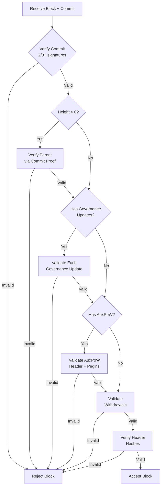
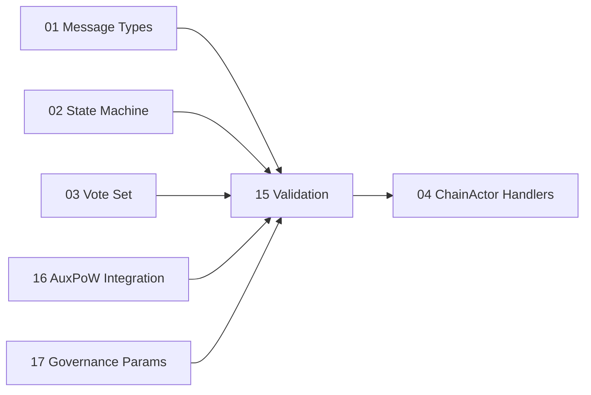

# Validation Module Migration for Tendermint

## Overview

This document details the migration of the V2 validation module from Aura-based signature verification to Tendermint consensus validation. The current validation logic in `common/validation.rs` relies on slot-based authority selection and single-proposer signatures. Tendermint requires multi-party vote validation and commit verification.

**Estimated Effort**: 3-5 days
**Dependencies**:
- 01_MESSAGE_TYPES_AND_PROTOCOL_FOUNDATION.md (Core types)
- 02_STATE_MACHINE.md (Consensus state)
- 03_VOTE_SET_MANAGEMENT.md (Vote collection)
- 16_AUXPOW_TENDERMINT_INTEGRATION.md (AuxPoW validation)
- 17_GOVERNANCE_PARAMETERS.md (Governance update validation)

---

## Current Validation Architecture

### Existing Functions

```rust
// common/validation.rs - Current Aura-based validation

/// Verify block signature using Aura slot-based authority
pub fn verify_block_signature(
    block: &SignedConsensusBlock<MainnetEthSpec>,
    aura: &Aura,
) -> Result<(), ChainError>

/// Validate parent hash and height relationship
pub async fn validate_parent_relationship(
    block: &SignedConsensusBlock<MainnetEthSpec>,
    storage_actor: &Addr<StorageActor>,
) -> Result<(), ChainError>

/// Get expected authority for slot (helper)
pub fn verify_block_authority(
    block: &SignedConsensusBlock<MainnetEthSpec>,
    aura: &Aura,
) -> Result<u8, ChainError>
```

### Current Authority Selection (Aura)

```rust
// Slot-based round-robin selection
fn slot_author(slot: u64, authorities: &[PublicKey]) -> Option<(u8, &PublicKey)> {
    let idx = (slot % authorities.len() as u64) as usize;
    Some((idx as u8, &authorities[idx]))
}
```

---

## Tendermint Validation Requirements

### Signature Types

| Type | Description | Validation Method |
|------|-------------|-------------------|
| **Proposal** | Block proposal from designated proposer | Single BLS signature |
| **Prevote** | First-round vote | Single BLS signature |
| **Precommit** | Second-round vote | Single BLS signature |
| **Commit** | Aggregated finalization proof | Aggregate BLS signature |

### Proposer Selection (Tendermint)

```rust
/// Height+round based proposer selection (deterministic)
pub fn proposer_for_height_round(
    height: u64,
    round: u32,
    validator_set: &ValidatorSet,
) -> ValidatorId {
    let total_power: u64 = validator_set.validators.iter()
        .map(|v| v.voting_power)
        .sum();

    // Weighted selection based on voting power
    let proposer_index = (height + round as u64) % validator_set.validators.len() as u64;
    validator_set.validators[proposer_index as usize].id.clone()
}
```

---

## New Validation Module Structure

### File: `chain/tendermint/validation.rs`

```rust
//! Tendermint consensus validation module
//!
//! Provides signature verification for proposals, votes, and commits
//! in the Tendermint two-phase BFT consensus protocol.

use super::messages::{Proposal, Vote, VoteType, Commit, SignedProposal, SignedVote};
use super::types::{ValidatorId, ValidatorSet, TendermintError};
use lighthouse_wrapper::bls::{PublicKey, Signature, AggregateSignature};

/// Validate a signed proposal from the designated proposer
pub fn verify_proposal(
    proposal: &SignedProposal,
    validator_set: &ValidatorSet,
    expected_height: u64,
    expected_round: u32,
) -> Result<(), TendermintError> {
    // 1. Verify height/round match expected
    if proposal.inner.height != expected_height {
        return Err(TendermintError::InvalidHeight {
            expected: expected_height,
            actual: proposal.inner.height,
        });
    }

    if proposal.inner.round != expected_round {
        return Err(TendermintError::InvalidRound {
            expected: expected_round,
            actual: proposal.inner.round,
        });
    }

    // 2. Verify proposer is correct for this height/round
    let expected_proposer = proposer_for_height_round(
        expected_height,
        expected_round,
        validator_set,
    );

    if proposal.proposer_id != expected_proposer {
        return Err(TendermintError::WrongProposer {
            expected: expected_proposer,
            actual: proposal.proposer_id.clone(),
            height: expected_height,
            round: expected_round,
        });
    }

    // 3. Verify proposer's signature
    let proposer_pubkey = validator_set.get_public_key(&proposal.proposer_id)
        .ok_or_else(|| TendermintError::UnknownValidator(proposal.proposer_id.clone()))?;

    let message_bytes = proposal.inner.signing_root();
    if !proposal.signature.verify(&proposer_pubkey, &message_bytes) {
        return Err(TendermintError::InvalidSignature {
            validator: proposal.proposer_id.clone(),
            message_type: "proposal".to_string(),
        });
    }

    tracing::debug!(
        height = expected_height,
        round = expected_round,
        proposer = ?proposal.proposer_id,
        "Proposal signature verified"
    );

    Ok(())
}

/// Validate a single vote (prevote or precommit)
pub fn verify_vote(
    vote: &SignedVote,
    validator_set: &ValidatorSet,
    expected_height: u64,
    expected_round: u32,
) -> Result<(), TendermintError> {
    // 1. Verify height/round
    if vote.inner.height != expected_height {
        return Err(TendermintError::InvalidHeight {
            expected: expected_height,
            actual: vote.inner.height,
        });
    }

    if vote.inner.round != expected_round {
        return Err(TendermintError::InvalidRound {
            expected: expected_round,
            actual: vote.inner.round,
        });
    }

    // 2. Verify voter is in validator set
    let voter_pubkey = validator_set.get_public_key(&vote.voter_id)
        .ok_or_else(|| TendermintError::UnknownValidator(vote.voter_id.clone()))?;

    // 3. Verify voter's signature
    let message_bytes = vote.inner.signing_root();
    if !vote.signature.verify(&voter_pubkey, &message_bytes) {
        return Err(TendermintError::InvalidSignature {
            validator: vote.voter_id.clone(),
            message_type: format!("{:?}", vote.inner.vote_type),
        });
    }

    tracing::trace!(
        height = expected_height,
        round = expected_round,
        voter = ?vote.voter_id,
        vote_type = ?vote.inner.vote_type,
        "Vote signature verified"
    );

    Ok(())
}

/// Validate a commit (aggregated precommits) for block finalization
pub fn verify_commit(
    commit: &Commit,
    validator_set: &ValidatorSet,
    block_hash: Hash256,
) -> Result<(), TendermintError> {
    // 1. Verify commit is for the claimed block
    if commit.block_hash != block_hash {
        return Err(TendermintError::CommitBlockMismatch {
            expected: block_hash,
            actual: commit.block_hash,
        });
    }

    // 2. Calculate total voting power in commit
    let total_power: u64 = validator_set.validators.iter()
        .map(|v| v.voting_power)
        .sum();

    let committed_power: u64 = commit.precommits.iter()
        .filter_map(|pc| validator_set.get_voting_power(&pc.voter_id))
        .sum();

    // 3. Verify 2/3+ voting power
    let threshold = (total_power * 2) / 3 + 1;
    if committed_power < threshold {
        return Err(TendermintError::InsufficientCommitPower {
            committed: committed_power,
            threshold,
            total: total_power,
        });
    }

    // 4. Verify each precommit signature
    for precommit in &commit.precommits {
        verify_vote(precommit, validator_set, commit.height, commit.round)?;

        // Verify vote is for the correct block
        if precommit.inner.block_hash != Some(block_hash) {
            return Err(TendermintError::PrecommitBlockMismatch {
                voter: precommit.voter_id.clone(),
                expected: block_hash,
                actual: precommit.inner.block_hash,
            });
        }
    }

    // 5. Optionally verify aggregate signature (optimization)
    if let Some(ref agg_sig) = commit.aggregate_signature {
        verify_aggregate_commit_signature(
            agg_sig,
            &commit.precommits,
            validator_set,
            commit.height,
            commit.round,
            block_hash,
        )?;
    }

    tracing::info!(
        height = commit.height,
        round = commit.round,
        block_hash = %block_hash,
        committed_power = committed_power,
        threshold = threshold,
        precommit_count = commit.precommits.len(),
        "Commit verified with 2/3+ voting power"
    );

    Ok(())
}

/// Verify aggregate signature for commit (BLS aggregation)
fn verify_aggregate_commit_signature(
    aggregate_signature: &AggregateSignature,
    precommits: &[SignedVote],
    validator_set: &ValidatorSet,
    height: u64,
    round: u32,
    block_hash: Hash256,
) -> Result<(), TendermintError> {
    // Collect public keys of all voters
    let public_keys: Vec<PublicKey> = precommits.iter()
        .filter_map(|pc| validator_set.get_public_key(&pc.voter_id).cloned())
        .collect();

    if public_keys.len() != precommits.len() {
        return Err(TendermintError::MissingPublicKeys);
    }

    // Create the canonical message that all voters signed
    let canonical_vote = Vote {
        vote_type: VoteType::Precommit,
        height,
        round,
        block_hash: Some(block_hash),
        timestamp: 0, // Timestamp not included in aggregate
    };
    let message_bytes = canonical_vote.signing_root();

    // Verify aggregate signature
    if !aggregate_signature.verify(&public_keys, &message_bytes) {
        return Err(TendermintError::InvalidAggregateSignature);
    }

    tracing::debug!(
        height = height,
        round = round,
        signer_count = public_keys.len(),
        "Aggregate commit signature verified"
    );

    Ok(())
}
```

---

## Proposer Selection Implementation

### Weighted Proposer Election

```rust
/// ValidatorSet with weighted proposer selection
impl ValidatorSet {
    /// Deterministic proposer selection weighted by voting power
    ///
    /// Uses a priority-based algorithm similar to Tendermint Core:
    /// - Each validator maintains a priority (increases by voting power each round)
    /// - Proposer is the validator with highest priority
    /// - After proposing, priority is reduced by total voting power
    pub fn get_proposer(&self, height: u64, round: u32) -> Option<&Validator> {
        if self.validators.is_empty() {
            return None;
        }

        // Simple deterministic selection for initial implementation
        // TODO: Implement full weighted priority algorithm
        let index = (height + round as u64) as usize % self.validators.len();
        Some(&self.validators[index])
    }

    /// Advanced: weighted priority selection
    pub fn get_proposer_weighted(&self, height: u64, round: u32) -> Option<&Validator> {
        let mut priorities: Vec<(usize, i64)> = self.validators.iter()
            .enumerate()
            .map(|(i, v)| (i, v.voting_power as i64))
            .collect();

        // Simulate rounds to reach current height+round
        let iterations = height + round as u64;
        let total_power: i64 = self.validators.iter()
            .map(|v| v.voting_power as i64)
            .sum();

        for _ in 0..iterations {
            // Increment all priorities by voting power
            for (i, priority) in priorities.iter_mut() {
                *priority += self.validators[*i].voting_power as i64;
            }

            // Find highest priority (proposer)
            let max_idx = priorities.iter()
                .max_by_key(|(_, p)| *p)
                .map(|(i, _)| *i)?;

            // Reduce proposer's priority
            priorities[max_idx].1 -= total_power;
        }

        // Final proposer is highest priority
        let proposer_idx = priorities.iter()
            .max_by_key(|(_, p)| *p)
            .map(|(i, _)| *i)?;

        Some(&self.validators[proposer_idx])
    }
}
```

---

## Error Types

### New TendermintError Variants

```rust
/// Tendermint-specific validation errors
#[derive(Debug, Clone, thiserror::Error)]
pub enum TendermintError {
    #[error("Invalid height: expected {expected}, got {actual}")]
    InvalidHeight { expected: u64, actual: u64 },

    #[error("Invalid round: expected {expected}, got {actual}")]
    InvalidRound { expected: u32, actual: u32 },

    #[error("Wrong proposer for height {height} round {round}: expected {expected:?}, got {actual:?}")]
    WrongProposer {
        expected: ValidatorId,
        actual: ValidatorId,
        height: u64,
        round: u32,
    },

    #[error("Unknown validator: {0:?}")]
    UnknownValidator(ValidatorId),

    #[error("Invalid signature from {validator:?} on {message_type}")]
    InvalidSignature {
        validator: ValidatorId,
        message_type: String,
    },

    #[error("Commit block mismatch: expected {expected}, got {actual}")]
    CommitBlockMismatch {
        expected: Hash256,
        actual: Hash256,
    },

    #[error("Insufficient commit power: {committed}/{total} (need {threshold})")]
    InsufficientCommitPower {
        committed: u64,
        threshold: u64,
        total: u64,
    },

    #[error("Precommit from {voter:?} for wrong block: expected {expected}, got {actual:?}")]
    PrecommitBlockMismatch {
        voter: ValidatorId,
        expected: Hash256,
        actual: Option<Hash256>,
    },

    #[error("Missing public keys for aggregate verification")]
    MissingPublicKeys,

    #[error("Invalid aggregate signature")]
    InvalidAggregateSignature,

    #[error("Duplicate vote from {0:?}")]
    DuplicateVote(ValidatorId),

    #[error("Equivocation detected: {validator:?} voted for different blocks at height {height} round {round}")]
    Equivocation {
        validator: ValidatorId,
        height: u64,
        round: u32,
    },
}
```

---

## Parent Relationship Validation

### Simplified for Instant Finality

With Tendermint, parent validation is simpler because:
1. No orphan blocks (instant finality)
2. No fork choice required
3. Sequential height progression guaranteed

```rust
/// Validate block's parent relationship (Tendermint version)
///
/// Simplified from Aura version - no orphan handling needed
pub async fn validate_parent_relationship_tendermint(
    block: &TendermintBlock,
    commit: &Commit,
    storage_actor: &Addr<StorageActor>,
) -> Result<(), TendermintError> {
    let block_height = block.height;
    let parent_hash = block.parent_hash;

    // Genesis block (height 0) has no parent
    if block_height == 0 {
        tracing::debug!("Genesis block, skipping parent validation");
        return Ok(());
    }

    // Verify parent commit exists (proves parent was finalized)
    let get_commit_msg = GetCommitMessage {
        height: block_height - 1,
        correlation_id: Some(Uuid::new_v4()),
    };

    let parent_commit = storage_actor.send(get_commit_msg).await
        .map_err(|e| TendermintError::Storage(e.to_string()))?
        .map_err(|e| TendermintError::Storage(e.to_string()))?
        .ok_or_else(|| TendermintError::MissingParentCommit {
            height: block_height - 1,
        })?;

    // Verify parent hash matches committed block
    if parent_commit.block_hash != parent_hash {
        return Err(TendermintError::ParentHashMismatch {
            expected: parent_commit.block_hash,
            claimed: parent_hash,
            height: block_height,
        });
    }

    tracing::debug!(
        block_height = block_height,
        parent_hash = %parent_hash,
        "Parent relationship validated via commit proof"
    );

    Ok(())
}
```

---

## Integration with ChainActor

### Handler Updates

```rust
// chain/handlers.rs - Updated for Tendermint validation

impl Handler<ProcessProposalMessage> for ChainActor {
    type Result = ResponseFuture<Result<ProcessProposalResponse, ChainError>>;

    fn handle(&mut self, msg: ProcessProposalMessage, _ctx: &mut Context<Self>) -> Self::Result {
        let validator_set = self.state.validator_set.clone();
        let current_height = self.state.tendermint_state.height;
        let current_round = self.state.tendermint_state.round;

        Box::pin(async move {
            // Use new Tendermint validation
            verify_proposal(
                &msg.proposal,
                &validator_set,
                current_height,
                current_round,
            )?;

            // Additional block validation...

            Ok(ProcessProposalResponse { accepted: true })
        })
    }
}

impl Handler<ProcessVoteMessage> for ChainActor {
    type Result = ResponseFuture<Result<ProcessVoteResponse, ChainError>>;

    fn handle(&mut self, msg: ProcessVoteMessage, _ctx: &mut Context<Self>) -> Self::Result {
        let validator_set = self.state.validator_set.clone();
        let current_height = self.state.tendermint_state.height;
        let current_round = self.state.tendermint_state.round;

        Box::pin(async move {
            // Use new Tendermint validation
            verify_vote(
                &msg.vote,
                &validator_set,
                current_height,
                current_round,
            )?;

            Ok(ProcessVoteResponse { accepted: true })
        })
    }
}
```

---

## Equivocation Detection

### Double Vote Detection

```rust
/// Detect and record equivocation (double voting)
pub fn check_for_equivocation(
    new_vote: &SignedVote,
    existing_votes: &HashMap<ValidatorId, SignedVote>,
) -> Option<EquivocationEvidence> {
    if let Some(existing) = existing_votes.get(&new_vote.voter_id) {
        // Same validator, same height, same round, different block
        if existing.inner.height == new_vote.inner.height
            && existing.inner.round == new_vote.inner.round
            && existing.inner.vote_type == new_vote.inner.vote_type
            && existing.inner.block_hash != new_vote.inner.block_hash
        {
            tracing::warn!(
                validator = ?new_vote.voter_id,
                height = new_vote.inner.height,
                round = new_vote.inner.round,
                vote_type = ?new_vote.inner.vote_type,
                existing_block = ?existing.inner.block_hash,
                new_block = ?new_vote.inner.block_hash,
                "EQUIVOCATION DETECTED - validator voted for different blocks"
            );

            return Some(EquivocationEvidence {
                validator: new_vote.voter_id.clone(),
                vote_a: existing.clone(),
                vote_b: new_vote.clone(),
                height: new_vote.inner.height,
                round: new_vote.inner.round,
            });
        }
    }

    None
}

/// Evidence of validator misbehavior
#[derive(Debug, Clone)]
pub struct EquivocationEvidence {
    pub validator: ValidatorId,
    pub vote_a: SignedVote,
    pub vote_b: SignedVote,
    pub height: u64,
    pub round: u32,
}
```

---

## AuxPoW Validation

With the simplified AuxPoW model (see Document 16), AuxPoW is **optional per-block**. When a block includes an `AuxPowHeader`, it must be validated.

### AuxPoW Header Validation

```rust
/// Validate optional AuxPoW header attached to a block
pub fn verify_auxpow_header(
    auxpow_header: &AuxPowHeader,
    block_hash: Hash256,
    expected_chain_id: u32,
) -> Result<(), TendermintError> {
    // 1. Verify block hash matches
    if auxpow_header.block_hash != block_hash {
        return Err(TendermintError::AuxPowBlockMismatch {
            expected: block_hash,
            actual: auxpow_header.block_hash,
        });
    }

    // 2. Verify chain ID
    if auxpow_header.chain_id != expected_chain_id {
        return Err(TendermintError::AuxPowChainIdMismatch {
            expected: expected_chain_id,
            actual: auxpow_header.chain_id,
        });
    }

    // 3. Verify AuxPoW merkle proof structure
    auxpow_header.auxpow.check(block_hash, expected_chain_id)
        .map_err(|e| TendermintError::AuxPowValidation(format!("{:?}", e)))?;

    tracing::debug!(
        block_hash = %block_hash,
        height = auxpow_header.height,
        pegin_count = auxpow_header.pegins.len(),
        "AuxPoW header validated"
    );

    Ok(())
}
```

### Peg-In Validation

Peg-ins carried in AuxPoW submissions require validation against Bitcoin state:

```rust
/// Validate peg-in data from miner submission
pub async fn validate_pegin(
    pegin: &PegInInfo,
    bitcoin_client: &BitcoinClient,
    wallet: &BitcoinWallet,
    params: &BridgeConfig,
) -> Result<(), TendermintError> {
    // 1. Check not already processed
    if wallet.get_tx(&pegin.txid)?.is_some() {
        return Err(TendermintError::DuplicatePegIn(pegin.txid));
    }

    // 2. Verify Bitcoin transaction exists and has sufficient confirmations
    let btc_tx = bitcoin_client.get_transaction(&pegin.txid).await
        .map_err(|e| TendermintError::BitcoinRpc(e.to_string()))?
        .ok_or_else(|| TendermintError::PegInTxNotFound(pegin.txid))?;

    if btc_tx.confirmations < params.btc_confirmations as i32 {
        return Err(TendermintError::InsufficientConfirmations {
            txid: pegin.txid,
            required: params.btc_confirmations,
            actual: btc_tx.confirmations as u32,
        });
    }

    // 3. Verify amount matches
    if btc_tx.amount != pegin.amount {
        return Err(TendermintError::PegInAmountMismatch {
            txid: pegin.txid,
            claimed: pegin.amount,
            actual: btc_tx.amount,
        });
    }

    // 4. Verify amount within bounds
    if pegin.amount < params.min_peg_amount || pegin.amount > params.max_peg_amount {
        return Err(TendermintError::PegInAmountOutOfBounds {
            amount: pegin.amount,
            min: params.min_peg_amount,
            max: params.max_peg_amount,
        });
    }

    Ok(())
}
```

**See**: [16_AUXPOW_TENDERMINT_INTEGRATION.md](16_AUXPOW_TENDERMINT_INTEGRATION.md) for complete AuxPoW integration details.

---

## Governance Update Validation

Governance updates (validator changes, parameter changes, emergency actions) included in blocks must be validated. See Document 17 for the complete governance system.

### Governance Update Verification

```rust
/// Validate all governance updates in a block proposal
pub fn verify_proposal_governance_updates(
    &self,
    proposal: &ConsensusBlock,
    governance_pubkey: &PublicKey,
) -> Result<(), TendermintError> {
    let Some(updates) = &proposal.governance_updates else {
        return Ok(());
    };

    for update in updates {
        match update {
            GovernanceUpdate::Validator(vu) => {
                // Verify governance authority signature
                verify_governance_signature(vu, governance_pubkey)?;
                // Validate the update (power bounds, max validators, etc.)
                self.validate_validator_update(vu)?;
            }
            GovernanceUpdate::Parameter(pu) => {
                verify_governance_signature(pu, governance_pubkey)?;
                self.validate_parameter_update(pu)?;
            }
            GovernanceUpdate::Emergency(ea) => {
                verify_governance_signature(ea, governance_pubkey)?;
                // Emergency actions have no additional validation
            }
        }
    }

    tracing::debug!(
        height = proposal.slot,
        update_count = updates.len(),
        "Governance updates validated"
    );

    Ok(())
}

/// Validate parameter update constraints
fn validate_parameter_update(&self, update: &ParameterUpdate) -> Result<(), TendermintError> {
    match update.param {
        GovernableParam::MinerFeeBps => {
            let value: u64 = update.decode_value()?;
            if value > 10_000 {
                return Err(TendermintError::InvalidParameterValue {
                    param: update.param,
                    reason: "miner_fee_bps cannot exceed 10000 (100%)".to_string(),
                });
            }
        }
        GovernableParam::BtcConfirmations => {
            let value: u32 = update.decode_value()?;
            if value < 1 || value > 100 {
                return Err(TendermintError::InvalidParameterValue {
                    param: update.param,
                    reason: "btc_confirmations must be 1-100".to_string(),
                });
            }
        }
        GovernableParam::MaxValidators => {
            let value: u32 = update.decode_value()?;
            if value < 4 || value > 100 {
                return Err(TendermintError::InvalidParameterValue {
                    param: update.param,
                    reason: "max_validators must be 4-100".to_string(),
                });
            }
        }
        // ... other parameter validations
        _ => {}
    }

    Ok(())
}
```

**See**: [17_GOVERNANCE_PARAMETERS.md](17_GOVERNANCE_PARAMETERS.md) Section 7.2 and 7.4 for complete validation details.

---

## Full Block Validation

This section describes the complete block validation flow, combining all validation types.

### Complete Validation Function

```rust
/// Validate a complete Tendermint block
///
/// This is the main entry point for block validation, combining:
/// - Consensus validation (commit signatures)
/// - Governance update validation
/// - AuxPoW validation (if present)
/// - Withdrawal/peg-in validation
pub async fn validate_block_full(
    &self,
    block: &ConsensusBlock,
    commit: &Commit,
) -> Result<(), TendermintError> {
    let block_hash = block.hash();

    // 1. Verify commit has 2/3+ voting power for this block
    verify_commit(commit, &self.validator_set, block_hash)?;

    // 2. Verify parent relationship via commit proof
    if block.slot > 0 {
        validate_parent_relationship_tendermint(
            block,
            commit,
            &self.storage_actor,
        ).await?;
    }

    // 3. Validate governance updates (if present)
    if block.governance_updates.is_some() {
        self.verify_proposal_governance_updates(block, &self.governance_pubkey)?;
    }

    // 4. Validate AuxPoW header (if present)
    if let Some(ref auxpow) = block.auxpow {
        verify_auxpow_header(auxpow, block_hash, self.chain_id)?;
    }

    // 5. Validate withdrawals match queued peg-ins
    self.validate_withdrawals(&block.execution_payload.withdrawals).await?;

    // 6. Verify hashes in header
    self.verify_header_hashes(block)?;

    tracing::info!(
        height = block.slot,
        block_hash = %block_hash,
        has_auxpow = block.auxpow.is_some(),
        has_governance = block.governance_updates.is_some(),
        "Block fully validated"
    );

    Ok(())
}

/// Verify header hashes match computed values
fn verify_header_hashes(&self, block: &ConsensusBlock) -> Result<(), TendermintError> {
    // Verify validators_hash
    let computed_validators_hash = self.validator_set.hash();
    if block.validators_hash != computed_validators_hash {
        return Err(TendermintError::ValidatorsHashMismatch {
            expected: computed_validators_hash,
            actual: block.validators_hash,
        });
    }

    // Verify params_hash
    let computed_params_hash = self.chain_params.hash();
    if block.params_hash != computed_params_hash {
        return Err(TendermintError::ParamsHashMismatch {
            expected: computed_params_hash,
            actual: block.params_hash,
        });
    }

    Ok(())
}

/// Validate execution payload withdrawals
async fn validate_withdrawals(
    &self,
    withdrawals: &[Withdrawal],
) -> Result<(), TendermintError> {
    for withdrawal in withdrawals {
        // Check withdrawal corresponds to a valid queued peg-in
        // or is a miner fee payment
        // Implementation depends on withdrawal tracking strategy
    }

    Ok(())
}
```

### Validation Flow Diagram



---

## Additional Error Types

```rust
// Additional TendermintError variants for new validation types

#[derive(Debug, Clone, thiserror::Error)]
pub enum TendermintError {
    // ... existing variants ...

    // AuxPoW validation errors
    #[error("AuxPoW block hash mismatch: expected {expected}, got {actual}")]
    AuxPowBlockMismatch { expected: Hash256, actual: Hash256 },

    #[error("AuxPoW chain ID mismatch: expected {expected}, got {actual}")]
    AuxPowChainIdMismatch { expected: u32, actual: u32 },

    #[error("AuxPoW validation failed: {0}")]
    AuxPowValidation(String),

    // Peg-in validation errors
    #[error("Duplicate peg-in: {0}")]
    DuplicatePegIn(Txid),

    #[error("Peg-in transaction not found: {0}")]
    PegInTxNotFound(Txid),

    #[error("Insufficient confirmations for {txid}: required {required}, got {actual}")]
    InsufficientConfirmations { txid: Txid, required: u32, actual: u32 },

    #[error("Peg-in amount mismatch for {txid}: claimed {claimed}, actual {actual}")]
    PegInAmountMismatch { txid: Txid, claimed: u64, actual: u64 },

    #[error("Peg-in amount {amount} out of bounds [{min}, {max}]")]
    PegInAmountOutOfBounds { amount: u64, min: u64, max: u64 },

    // Governance validation errors
    #[error("Invalid parameter value for {param:?}: {reason}")]
    InvalidParameterValue { param: GovernableParam, reason: String },

    #[error("Invalid governance signature")]
    InvalidGovernanceSignature,

    // Header hash errors
    #[error("Validators hash mismatch: expected {expected}, got {actual}")]
    ValidatorsHashMismatch { expected: Hash256, actual: Hash256 },

    #[error("Params hash mismatch: expected {expected}, got {actual}")]
    ParamsHashMismatch { expected: Hash256, actual: Hash256 },

    // Bitcoin RPC error
    #[error("Bitcoin RPC error: {0}")]
    BitcoinRpc(String),
}
```

---

## Migration Steps

### Step 1: Create New Module

```bash
# Create new validation module
touch app/src/actors_v2/chain/tendermint/validation.rs
```

### Step 2: Implement Core Functions

1. `verify_proposal()` - Proposal signature validation
2. `verify_vote()` - Individual vote validation
3. `verify_commit()` - Commit (2/3+ precommits) validation
4. `proposer_for_height_round()` - Deterministic proposer selection
5. `verify_auxpow_header()` - Optional AuxPoW validation (see Doc 16)
6. `validate_pegin()` - Peg-in data validation (see Doc 16)
7. `verify_proposal_governance_updates()` - Governance validation (see Doc 17)
8. `validate_block_full()` - Complete block validation combining all checks

### Step 3: Update ChainActor

```rust
// chain/mod.rs
pub mod tendermint;

// In handlers, replace:
// verify_block_signature(block, &aura) -> verify_proposal(proposal, &validator_set, h, r)
```

### Step 4: Deprecate Aura Validation

```rust
// common/validation.rs
#[deprecated(note = "Use tendermint::validation::verify_proposal instead")]
pub fn verify_block_signature(...) { ... }
```

### Step 5: Remove After Migration

Once Tendermint is fully operational, remove:
- `common/validation.rs` (Aura validation)
- `aura` dependency from validation code
- Slot-based authority selection

---

## Testing

### Unit Tests

```rust
#[cfg(test)]
mod tests {
    use super::*;
    use lighthouse_wrapper::bls::Keypair;

    fn create_test_validator_set(count: usize) -> (ValidatorSet, Vec<Keypair>) {
        let keypairs: Vec<Keypair> = (0..count).map(|_| Keypair::random()).collect();
        let validators: Vec<Validator> = keypairs.iter()
            .enumerate()
            .map(|(i, kp)| Validator {
                id: ValidatorId(kp.pk.to_bytes()),
                public_key: kp.pk.clone(),
                voting_power: 1,
            })
            .collect();
        (ValidatorSet { validators }, keypairs)
    }

    #[test]
    fn test_verify_proposal_valid() {
        let (validator_set, keypairs) = create_test_validator_set(4);

        // Create proposal from correct proposer for height 0, round 0
        let proposer_idx = 0; // (0 + 0) % 4
        let proposal = create_signed_proposal(
            0, 0, Hash256::zero(), &keypairs[proposer_idx]
        );

        let result = verify_proposal(&proposal, &validator_set, 0, 0);
        assert!(result.is_ok());
    }

    #[test]
    fn test_verify_proposal_wrong_proposer() {
        let (validator_set, keypairs) = create_test_validator_set(4);

        // Create proposal from WRONG proposer (idx 1 instead of 0)
        let proposal = create_signed_proposal(
            0, 0, Hash256::zero(), &keypairs[1]
        );

        let result = verify_proposal(&proposal, &validator_set, 0, 0);
        assert!(matches!(result, Err(TendermintError::WrongProposer { .. })));
    }

    #[test]
    fn test_verify_commit_sufficient_power() {
        let (validator_set, keypairs) = create_test_validator_set(4);
        let block_hash = Hash256::random();

        // Create commit with 3/4 validators (75% > 67% threshold)
        let commit = create_commit_with_signers(
            0, 0, block_hash, &keypairs[0..3], &validator_set
        );

        let result = verify_commit(&commit, &validator_set, block_hash);
        assert!(result.is_ok());
    }

    #[test]
    fn test_verify_commit_insufficient_power() {
        let (validator_set, keypairs) = create_test_validator_set(4);
        let block_hash = Hash256::random();

        // Create commit with only 2/4 validators (50% < 67% threshold)
        let commit = create_commit_with_signers(
            0, 0, block_hash, &keypairs[0..2], &validator_set
        );

        let result = verify_commit(&commit, &validator_set, block_hash);
        assert!(matches!(result, Err(TendermintError::InsufficientCommitPower { .. })));
    }

    #[test]
    fn test_equivocation_detection() {
        let (_, keypairs) = create_test_validator_set(1);

        let vote_a = create_signed_vote(
            VoteType::Prevote, 0, 0, Some(Hash256::random()), &keypairs[0]
        );
        let vote_b = create_signed_vote(
            VoteType::Prevote, 0, 0, Some(Hash256::random()), &keypairs[0]
        );

        let mut existing = HashMap::new();
        existing.insert(vote_a.voter_id.clone(), vote_a.clone());

        let evidence = check_for_equivocation(&vote_b, &existing);
        assert!(evidence.is_some());
    }

    // === AuxPoW Validation Tests ===

    #[test]
    fn test_auxpow_header_block_hash_mismatch() {
        let block_hash = Hash256::random();
        let wrong_hash = Hash256::random();

        let auxpow_header = create_test_auxpow_header(wrong_hash);

        let result = verify_auxpow_header(&auxpow_header, block_hash, 2121);
        assert!(matches!(result, Err(TendermintError::AuxPowBlockMismatch { .. })));
    }

    #[test]
    fn test_auxpow_header_chain_id_mismatch() {
        let block_hash = Hash256::random();

        let auxpow_header = AuxPowHeader {
            block_hash,
            chain_id: 9999, // Wrong chain ID
            ..create_test_auxpow_header(block_hash)
        };

        let result = verify_auxpow_header(&auxpow_header, block_hash, 2121);
        assert!(matches!(result, Err(TendermintError::AuxPowChainIdMismatch { .. })));
    }

    // === Governance Validation Tests ===

    #[test]
    fn test_parameter_validation_miner_fee_bps() {
        let actor = create_test_chain_actor();

        // Valid: 50 bps (0.5%)
        let update = ParameterUpdate::new(
            GovernableParam::MinerFeeBps,
            &50u64,
            test_signature(),
        ).unwrap();
        assert!(actor.validate_parameter_update(&update).is_ok());

        // Invalid: > 100%
        let update = ParameterUpdate::new(
            GovernableParam::MinerFeeBps,
            &15000u64,
            test_signature(),
        ).unwrap();
        assert!(matches!(
            actor.validate_parameter_update(&update),
            Err(TendermintError::InvalidParameterValue { .. })
        ));
    }

    #[test]
    fn test_parameter_validation_btc_confirmations() {
        let actor = create_test_chain_actor();

        // Valid: 6 confirmations
        let update = ParameterUpdate::new(
            GovernableParam::BtcConfirmations,
            &6u32,
            test_signature(),
        ).unwrap();
        assert!(actor.validate_parameter_update(&update).is_ok());

        // Invalid: 0 confirmations
        let update = ParameterUpdate::new(
            GovernableParam::BtcConfirmations,
            &0u32,
            test_signature(),
        ).unwrap();
        assert!(matches!(
            actor.validate_parameter_update(&update),
            Err(TendermintError::InvalidParameterValue { .. })
        ));
    }

    // === Full Block Validation Tests ===

    #[tokio::test]
    async fn test_validate_block_full_valid() {
        let (validator_set, keypairs) = create_test_validator_set(4);
        let actor = create_test_chain_actor_with_validators(validator_set.clone());

        let block = create_test_block(0);
        let commit = create_commit_with_signers(
            0, 0, block.hash(), &keypairs[0..3], &validator_set
        );

        let result = actor.validate_block_full(&block, &commit).await;
        assert!(result.is_ok());
    }

    #[tokio::test]
    async fn test_validate_block_full_with_auxpow() {
        let (validator_set, keypairs) = create_test_validator_set(4);
        let actor = create_test_chain_actor_with_validators(validator_set.clone());

        let mut block = create_test_block(0);
        let block_hash = block.hash();
        block.auxpow = Some(create_valid_auxpow_header(block_hash, 2121));

        let commit = create_commit_with_signers(
            0, 0, block_hash, &keypairs[0..3], &validator_set
        );

        let result = actor.validate_block_full(&block, &commit).await;
        assert!(result.is_ok());
    }

    #[tokio::test]
    async fn test_validate_block_full_with_governance() {
        let (validator_set, keypairs) = create_test_validator_set(4);
        let actor = create_test_chain_actor_with_validators(validator_set.clone());

        let mut block = create_test_block(0);
        block.governance_updates = Some(vec![
            GovernanceUpdate::Parameter(ParameterUpdate::new(
                GovernableParam::MinerFeeBps,
                &100u64,
                governance_signature(),
            ).unwrap()),
        ]);

        let block_hash = block.hash();
        let commit = create_commit_with_signers(
            0, 0, block_hash, &keypairs[0..3], &validator_set
        );

        let result = actor.validate_block_full(&block, &commit).await;
        assert!(result.is_ok());
    }
}
```

---

## Summary

| Component | Current (Aura) | New (Tendermint) |
|-----------|----------------|------------------|
| Authority Selection | `slot % num_authorities` | `(height + round) % num_validators` |
| Block Signature | Single proposer BLS | Single proposer BLS (same) |
| Finality Proof | None (Aura has no finality) | 2/3+ precommit signatures (instant) |
| Bitcoin Anchor | AuxPoW (consensus-tied) | AuxPoW (optional per-block) |
| Parent Validation | Storage lookup + orphan handling | Commit-proof verification |
| Equivocation | Not detected | Explicit detection + evidence |
| Voting Power | Equal (implicit) | Explicit per-validator |
| Governance Updates | N/A | Signature + constraint validation |

---

## Dependencies



---

*Implementation Plan Version: 1.1*
*Last Updated: February 2026*

---

### Changelog

**v1.1** (February 2026):
- Added AuxPoW validation section (references Document 16)
- Added Governance update validation section (references Document 17)
- Added Full Block Validation section combining all validation types
- Added Additional Error Types section for new validation errors
- Added unit tests for AuxPoW, governance, and full block validation
- Updated summary table: clarified AuxPoW is optional per-block, not finality mechanism
- Updated dependencies to include Documents 16 and 17
- Updated dependency diagram
- Updated migration steps to include new validation functions
