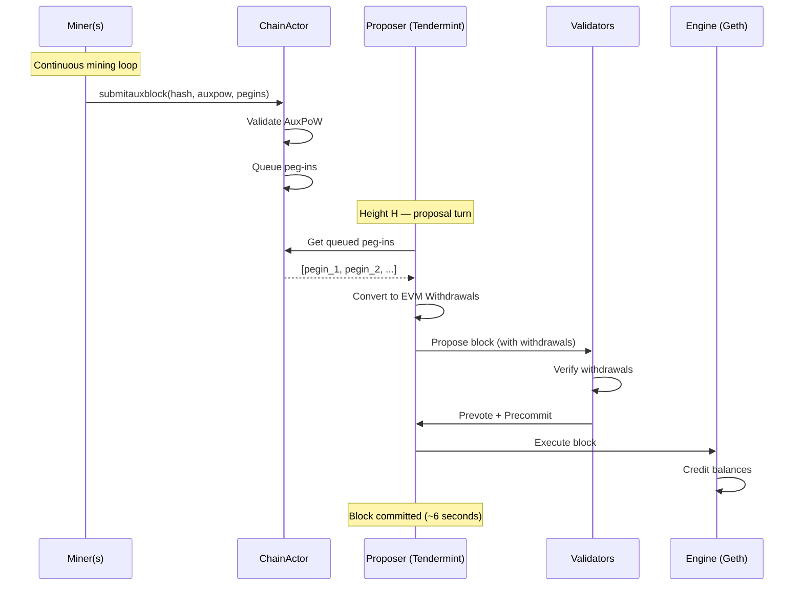

# AuxPoW-Tendermint Integration: Per-Block Optional AuxPoW

**Version**: 4.0
**Status**: Simplified model - no checkpoints, no difficulty thresholds, no liveness gate

## Overview

This document describes how AuxPoW (merge-mining) integrates with Tendermint consensus. The design is intentionally simple:

- **Tendermint produces blocks** with instant finality (2/3+ validator signatures)
- **Miners optionally attach AuxPoW + peg-ins** to any block via `submitauxblock`
- **No difficulty thresholds** - any valid AuxPoW proof is accepted
- **No liveness gate** - the chain never stalls waiting for PoW
- **No checkpoint intervals** - AuxPoW is purely optional enhancement

### AuxPoW Serves Two Purposes

1. **Peg-In Delivery** — For AML/KYC legal compliance, miners must monitor Bitcoin for deposits and include peg-in data in their AuxPoW submissions. This is the primary purpose.

2. **Optional Bitcoin Anchoring** — AuxPoW proofs anchor Alys blocks in Bitcoin's PoW chain, providing additional security for external verifiers who want Bitcoin-grade assurance.

> **Prerequisites**: See [MINER_PEGIN_IMPACT_ANALYSIS.md](MINER_PEGIN_IMPACT_ANALYSIS.md) for detailed explanations of merge-mining mechanics and the peg-in lifecycle.

---

## Architecture

### Simple Flow

```
┌─────────────────┐                              ┌─────────────────┐
│  Bitcoin Chain  │                              │   Alys Chain    │
│                 │                              │   (Tendermint)  │
│  User deposits  │      Miner monitors          │                 │
│  to federation  │ ─────────────────────────►   │  Blocks produced│
│  address        │                              │  every ~6s with │
└─────────────────┘                              │  instant finality│
        │                                        │                 │
        │ Miner detects peg-in                   │                 │
        ▼                                        │                 │
┌─────────────────┐                              │                 │
│     Miner       │    submitauxblock(           │   Block N       │
│                 │      block_hash,             │   ├─ Optional   │
│  - Monitors BTC │      auxpow,         ──────► │   │  AuxPoW     │
│  - Finds PoW    │      pegins[]        )       │   └─ Peg-in     │
│  - Earns fee    │                              │      Withdrawals│
└─────────────────┘                              └─────────────────┘
```

### Key Property: Tendermint Never Waits

Tendermint consensus operates independently of AuxPoW. Blocks are produced every ~6 seconds with instant finality. Miners submit AuxPoW + peg-ins whenever they find valid proofs. The chain never stalls.

```
Timeline:
═══════════════════════════════════════════════════════════════════

Tendermint:  1 ─ 2 ─ 3 ─ 4 ─ 5 ─ 6 ─ 7 ─ 8 ─ 9 ─ 10 ─ 11 ─ 12
             │   │   │   │   │   │   │   │   │    │    │    │
             F   F   F   F   F   F   F   F   F    F    F    F
             (all instantly final via 2/3+ precommits)

AuxPoW:          ↓           ↓               ↓
              [PoW+pegin] [PoW+pegin]    [PoW+pegin]
              (optional)  (optional)     (optional)

F = Consensus Finality (instant, ~6 seconds)
```

---

## Extended AuxPowHeader

The `AuxPowHeader` struct carries peg-in data from miners to the chain:

```rust
pub struct AuxPowHeader {
    /// Hash of the block this AuxPoW is for
    pub block_hash: Hash256,
    /// Bitcoin merge-mining proof
    pub auxpow: AuxPow,
    /// Difficulty bits (for verification)
    pub bits: u32,
    /// Chain ID for AuxPoW validation
    pub chain_id: u32,
    /// Block height
    pub height: u64,
    /// Miner's address for fee payment
    pub fee_recipient: Address,
    /// Peg-in transactions attested by this miner (NEW)
    /// These travel FROM the miner TO the chain via submitauxblock.
    pub pegins: Vec<PegInInfo>,
}

/// Peg-in information extracted from Bitcoin transaction
pub struct PegInInfo {
    pub txid: Txid,              // Bitcoin transaction ID
    pub block_hash: BlockHash,   // Bitcoin block containing the deposit
    pub block_height: u32,       // Bitcoin block height
    pub amount: u64,             // Satoshis deposited
    pub evm_account: Address,    // Target EVM address (from OP_RETURN)
}
```

---

## Extended Miner Binary

The miner must gain Bitcoin monitoring capabilities:

```rust
// Miner's main loop
loop {
    // 1. Check for new Bitcoin deposits
    let pending_pegins = bitcoin_monitor.get_pending_pegins().await;

    // 2. Get mining work package
    let aux_block = rpc_client.create_aux_block(&miner_address).await?;

    // 3. Mine PoW (any difficulty that meets minimum)
    let auxpow = AuxPow::mine(aux_block.hash, aux_block.target, chain_id).await;

    // 4. Submit with peg-in data
    rpc_client.submit_aux_block(aux_block.hash, auxpow, pending_pegins).await?;
}
```

The miner needs:
- Bitcoin RPC endpoint access
- Knowledge of federation deposit address(es)
- Same inputs the Bridge currently uses for peg-in detection

---

## Duplicate Peg-In Prevention

Multiple miners monitoring Bitcoin will detect the same deposits. Four layers prevent duplicate processing:

| Layer | Where | Mechanism |
|-------|-------|-----------|
| 0. Ingestion filter | `handle_submit_auxblock()` | Reject pegins already queued or in wallet |
| 1. Queue dedup | `BTreeMap<Txid, PegInInfo>` | Map keyed by txid naturally deduplicates |
| 2. Producer filter | `collect_withdrawals()` | Check `wallet.get_tx(txid)` before including |
| 3. Validator verify | `check_withdrawals()` | Reject blocks with already-processed txids |

```rust
async fn validate_and_queue_pegins(
    &mut self,
    pegins: Vec<PegInInfo>,
) -> Result<usize, ChainError> {
    let mut queued_count = 0;

    for pegin in pegins {
        // Skip if already in queue
        if self.state.queued_pegins.contains_key(&pegin.txid) {
            debug!(txid = %pegin.txid, "Peg-in already queued");
            continue;
        }

        // Skip if already processed in a finalized block
        let wallet = self.bitcoin_wallet.read().await;
        if wallet.get_tx(&pegin.txid)?.is_some() {
            debug!(txid = %pegin.txid, "Peg-in already processed");
            continue;
        }
        drop(wallet);

        self.state.queued_pegins.insert(pegin.txid, pegin);
        queued_count += 1;
    }

    Ok(queued_count)
}
```

---

## Peg-In to EVM Withdrawal Conversion

The proposer converts queued peg-ins to EVM withdrawals:

```rust
Withdrawal {
    index: withdrawals.len() as u64,
    validator_index: 0,              // Unused in Alys
    address: pegin_info.evm_account, // From Bitcoin OP_RETURN
    amount: ConsensusAmount::from_satoshi(pegin_info.amount).0,
}
```

Geth processes these via the Capella withdrawal mechanism — direct balance credit, no gas, no revert.

---

## Miner Compensation

Miners receive a percentage of each peg-in amount as compensation for monitoring Bitcoin and including peg-ins:

```rust
/// Peg-in compensation parameters (configured in genesis)
pub struct PegInCompensation {
    /// Percentage of peg-in amount paid to miner (basis points)
    /// e.g., 50 = 0.5%
    pub miner_fee_bps: u64,
    /// Minimum fee in satoshis (floor for small peg-ins)
    pub min_fee_satoshi: u64,
    /// Maximum fee in satoshis (cap for large peg-ins)
    pub max_fee_satoshi: u64,
}

impl Default for PegInCompensation {
    fn default() -> Self {
        Self {
            miner_fee_bps: 50,           // 0.5% default
            min_fee_satoshi: 1000,       // 0.00001 BTC minimum
            max_fee_satoshi: 10_000_000, // 0.1 BTC maximum
        }
    }
}

fn calculate_miner_fee(amount: u64, params: &PegInCompensation) -> u64 {
    let fee = (amount * params.miner_fee_bps) / 10_000;
    fee.clamp(params.min_fee_satoshi, params.max_fee_satoshi)
}
```

**Withdrawal Split**: Each peg-in creates two withdrawals:

```rust
fn pegin_to_withdrawals(
    pegin: &PegInInfo,
    miner_address: Address,
    params: &PegInCompensation,
) -> Vec<Withdrawal> {
    let miner_fee = calculate_miner_fee(pegin.amount, params);
    let user_amount = pegin.amount - miner_fee;

    vec![
        // User receives peg-in minus fee
        Withdrawal {
            index: 0,
            validator_index: 0,
            address: pegin.evm_account,
            amount: ConsensusAmount::from_satoshi(user_amount).0,
        },
        // Miner receives fee
        Withdrawal {
            index: 1,
            validator_index: 0,
            address: miner_address,
            amount: ConsensusAmount::from_satoshi(miner_fee).0,
        },
    ]
}
```

---

## Submission Handler

The `submitauxblock` handler accepts any valid AuxPoW proof:

```rust
async fn handle_submit_auxblock(
    &mut self,
    block_hash: BlockHash,
    auxpow: AuxPow,
    pegins: Vec<PegInInfo>,
) -> Result<SubmissionResult, ChainError> {
    // 1. Retrieve mining context
    let context = self.state.mining_contexts.get(&block_hash)
        .ok_or(ChainError::UnknownBlockHash)?;

    // 2. Validate AuxPoW structure (merkle proofs, chain ID)
    auxpow.check(block_hash, context.chain_id)
        .map_err(|e| ChainError::AuxPowValidation(format!("{:?}", e)))?;

    // 3. Validate and queue peg-ins
    let queued_count = self.validate_and_queue_pegins(pegins).await?;

    // 4. Store AuxPoW for the block (optional enhancement)
    let header = AuxPowHeader {
        block_hash: context.block_hash,
        auxpow,
        bits: context.bits,
        chain_id: context.chain_id,
        height: context.height,
        fee_recipient: context.miner_address,
        pegins: vec![], // Pegins queued separately
    };
    self.state.set_queued_pow(header);

    info!(
        height = context.height,
        pegins = queued_count,
        "AuxPoW submission accepted"
    );

    Ok(SubmissionResult { pegins_queued: queued_count })
}
```

---

## Consensus Integration



---

## Block Structure

Peg-ins become EVM withdrawals in the execution payload. AuxPoW is stored as optional metadata:

```rust
pub struct ConsensusBlock<T: EthSpec> {
    pub parent_hash: Hash256,
    pub slot: u64,
    pub last_commit: Option<Commit>,
    /// Peg-ins converted to Withdrawals here
    pub execution_payload: ExecutionPayloadCapella<T>,
    /// Optional AuxPoW (for Bitcoin anchoring)
    pub auxpow: Option<AuxPowHeader>,
    /// Bitcoin deposit txids processed (for deduplication)
    pub processed_pegins: Vec<Txid>,
    // ... other fields
}
```

---

## Mining Pool Offline Scenario

```
┌─────────────────────────────────────────────────────────────────┐
│  SCENARIO: Mining pool goes offline                             │
├─────────────────────────────────────────────────────────────────┤
│                                                                 │
│  Tendermint: Continues producing blocks at full speed ✓         │
│  On-chain operations: Fully functional ✓                        │
│  Peg-ins: STOP (inherent — miners are the delivery channel)     │
│  Peg-outs: Continue normally (Tendermint finality sufficient)   │
│                                                                 │
│  The chain is fully operational for all on-chain activity.      │
│  Only new peg-ins are affected (no miner to submit them).       │
│                                                                 │
│  Recovery: Mining pool returns → peg-ins resume                 │
│                                                                 │
└─────────────────────────────────────────────────────────────────┘
```

---

## RPC Interface

### `createauxblock`

Returns a work package for the miner (unchanged from current behavior).

```json
{
  "hash": "0x...",
  "chainid": 2121,
  "height": 12345,
  "bits": "0x1d00ffff",
  "target": "0x..."
}
```

### `submitauxblock`

Extended to accept peg-in data:

```rust
/// Submit AuxPoW with optional peg-ins
async fn submit_aux_block(
    block_hash: BlockHash,
    auxpow: AuxPow,
    pegins: Vec<PegInInfo>,  // NEW
) -> Result<SubmissionResult, RpcError>
```

**Request:**
```json
{
  "method": "submitauxblock",
  "params": [
    "0xblockhash...",
    "0xauxpowdata...",
    [
      {
        "txid": "0xbitcointxid...",
        "block_hash": "0xbtcblockhash...",
        "block_height": 800000,
        "amount": 100000000,
        "evm_account": "0xevmaddress..."
      }
    ]
  ]
}
```

**Response:**
```json
{
  "result": {
    "accepted": true,
    "pegins_queued": 1
  }
}
```

---

## RPC Monitoring Endpoints

### `getvalidatorstatus`

Returns Tendermint validator information:

```json
{
  "is_validator": true,
  "validator_id": 2,
  "voting_power": 100,
  "validator_set_size": 4,
  "is_proposer_this_height": false
}
```

### `getconsensusstate`

Returns current Tendermint consensus state:

```json
{
  "height": 12345,
  "round": 0,
  "step": "Prevote",
  "prevotes": 3,
  "precommits": 0,
  "proposal_received": true
}
```

### `getpeginstatus`

Returns peg-in queue status:

```json
{
  "queued_pegins": 2,
  "total_queued_amount": 150000000,
  "last_pegin_height": 12340
}
```

---

## Metrics

```rust
lazy_static! {
    /// AuxPoW submissions received
    pub static ref AUXPOW_SUBMISSIONS: IntCounter = IntCounter::new(
        "auxpow_submissions_total",
        "Total AuxPoW submissions via submitauxblock"
    ).unwrap();

    /// Peg-ins queued via submitauxblock
    pub static ref PEGINS_QUEUED: IntCounter = IntCounter::new(
        "pegins_queued_total",
        "Peg-ins queued from submitauxblock submissions"
    ).unwrap();

    /// Peg-ins included in blocks
    pub static ref PEGINS_INCLUDED: IntCounter = IntCounter::new(
        "pegins_included_total",
        "Peg-ins included in committed blocks"
    ).unwrap();

    /// Current peg-in queue size
    pub static ref PEGIN_QUEUE_SIZE: IntGauge = IntGauge::new(
        "pegin_queue_size",
        "Current number of peg-ins waiting to be included"
    ).unwrap();

    /// Blocks with AuxPoW attached
    pub static ref BLOCKS_WITH_AUXPOW: IntCounter = IntCounter::new(
        "blocks_with_auxpow_total",
        "Blocks that have AuxPoW proof attached"
    ).unwrap();
}
```

---

## Checklist

### AuxPowHeader Extension
- [ ] Add `pegins: Vec<PegInInfo>` field to `AuxPowHeader`
- [ ] Define `PegInInfo` struct
- [ ] Update serialization/deserialization

### Miner Binary
- [ ] Add Bitcoin RPC client
- [ ] Implement `BitcoinMonitor` for deposit detection
- [ ] Update main loop to collect pending peg-ins
- [ ] Extend `submitauxblock` call with peg-ins

### ChainActor
- [ ] Implement `validate_and_queue_pegins()`
- [ ] Update `handle_submit_auxblock()` to accept peg-ins
- [ ] Store `queued_pegins: BTreeMap<Txid, PegInInfo>` in state

### Block Production
- [ ] Update `collect_withdrawals()` to include peg-in withdrawals
- [ ] Implement miner fee calculation and split
- [ ] Track processed txids for deduplication

### Validation
- [ ] Verify peg-ins against Bitcoin in block validation
- [ ] Reject duplicate peg-in txids
- [ ] Validate miner fee calculations

### RPC
- [ ] Extend `submitauxblock` to accept pegins parameter
- [ ] Add `getpeginstatus` endpoint
- [ ] Update `getvalidatorstatus` and `getconsensusstate`

### Storage
- [ ] Store optional AuxPoW per block
- [ ] Store processed peg-in txids for deduplication queries

### Metrics
- [ ] Add peg-in queue metrics
- [ ] Add AuxPoW submission metrics

### Testing
- [ ] Unit tests for peg-in validation
- [ ] Unit tests for duplicate prevention
- [ ] Integration tests for full peg-in flow
- [ ] Test mining pool offline scenario

---

## Related Documents

- [MINER_PEGIN_IMPACT_ANALYSIS.md](MINER_PEGIN_IMPACT_ANALYSIS.md) — Detailed merge-mining mechanics
- [14_GENESIS_AND_VALIDATOR_INIT.md](14_GENESIS_AND_VALIDATOR_INIT.md) — PegInCompensation configuration

---

*Implementation Plan Version: 4.0*
*Last Updated: February 2026*
*Changes: Simplified to per-block optional AuxPoW model. Removed dual-difficulty, checkpoint intervals, and liveness gate.*
