# AuxPoW-Tendermint Integration: Exploration of Approaches

## Overview

This document explores how AuxPoW (merge-mining) can be integrated with Tendermint consensus at varying levels of tightness. AuxPoW currently serves two roles in Alys: **fork choice weight** (higher cumulative difficulty wins) and **liveness gate** (chain halts after `max_blocks_without_pow` blocks without an AuxPoW proof). Tendermint eliminates the need for fork choice entirely, so AuxPoW must find a new role.

The question is not *whether* AuxPoW should exist — it should, for Bitcoin-anchored security — but *how tightly* it should be coupled to the consensus protocol.

### Current AuxPoW Behavior

```
Block 1     Block 2     Block 3     ...     Block n     Block n+1
  │           │           │                   │           │
  ▼           ▼           ▼                   ▼           ▼
[normal]   [normal]   [normal]            [AuxPoW!]   [normal]
                                              │
                                              ▼
                                    Counter resets to 0.
                                    Chain keeps producing.

If n reaches max_blocks_without_pow (50000 on testnet):
  → Chain HALTS. No more blocks until AuxPoW is submitted.
```

Each approach below reimagines this relationship for a Tendermint world.

---

## Approach 1: Preserve the Liveness Gate

### Concept

The simplest migration: keep the existing `max_blocks_without_pow` rule, but enforce it within the Tendermint propose phase rather than the block import phase.

### How It Works

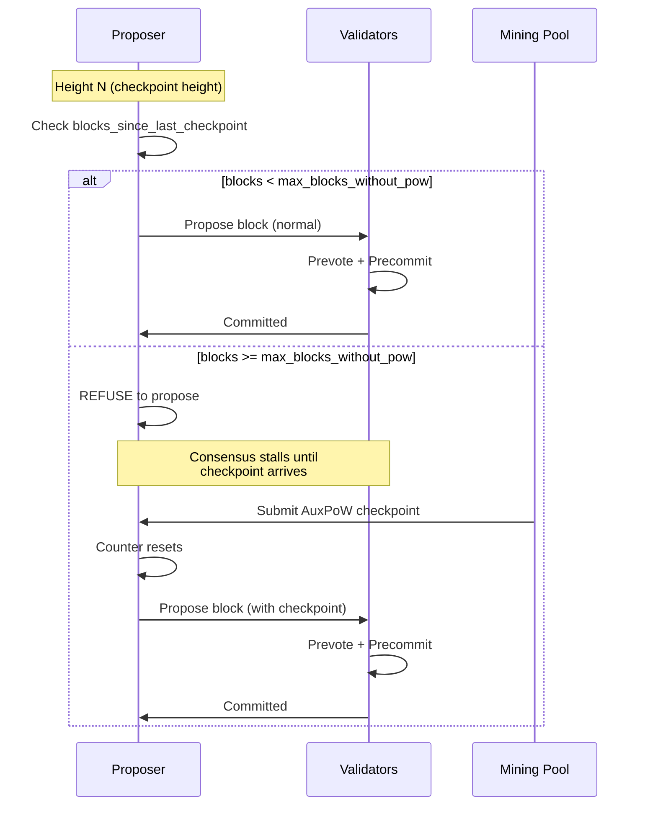

### Proposer Logic

```rust
impl ChainActor {
    async fn handle_propose_phase(&self, height: u64, round: u32) -> Result<(), ChainError> {
        // Check AuxPoW liveness gate BEFORE proposing
        let blocks_since_checkpoint = height - self.state.last_checkpoint_height;

        if blocks_since_checkpoint >= self.config.max_blocks_without_pow {
            // Check if we have a pending checkpoint to include
            if let Some(checkpoint) = self.state.pending_checkpoint.take() {
                // Include checkpoint in this block's proposal
                let block = self.build_block_with_checkpoint(height, checkpoint).await?;
                return self.propose_block(height, round, block).await;
            }

            // No checkpoint available — refuse to propose
            warn!(
                height = height,
                blocks_since = blocks_since_checkpoint,
                "Refusing to propose: AuxPoW checkpoint required"
            );
            return Ok(()); // Skip proposal, timeout will advance round
        }

        // Normal proposal
        let block = self.build_block(height).await?;
        self.propose_block(height, round, block).await
    }
}
```

### What Happens During a Stall

```
Height 50000:  Proposer checks → 50000 blocks without checkpoint
               Proposer refuses to propose
               Timeout fires → Round 1

Height 50000, Round 1:  New proposer also refuses
                        Timeout fires → Round 2

               ... validators keep cycling through rounds ...

Mining pool submits checkpoint covering blocks 1-50000:

Height 50000, Round R:  Proposer sees pending checkpoint
                        Proposes block WITH checkpoint
                        Validators verify checkpoint
                        Block committed ✓
                        Counter resets to 0
```

### Validator Verification

Validators must also enforce the liveness gate when they receive a proposal:

```rust
fn validate_proposal(&self, proposal: &Proposal) -> Result<(), ChainError> {
    let blocks_since = proposal.height - self.state.last_checkpoint_height;

    if blocks_since >= self.config.max_blocks_without_pow {
        // This block MUST include a checkpoint
        if proposal.block.auxpow_checkpoint.is_none() {
            return Err(ChainError::MissingRequiredCheckpoint);
        }
        // Validate the checkpoint
        self.verify_checkpoint(proposal.block.auxpow_checkpoint.as_ref().unwrap())?;
    }

    Ok(())
}
```

### Failure Scenario: Mining Pool Goes Offline

```
┌─────────────────────────────────────────────────────────────────┐
│  SCENARIO: Mining pool goes offline at height 49000             │
├─────────────────────────────────────────────────────────────────┤
│                                                                 │
│  Height 49000:  Last checkpoint submitted                       │
│  Height 49001-99000:  Normal Tendermint consensus               │
│  Height 99001: max_blocks_without_pow reached (50000)           │
│                                                                 │
│  ┌────────────────────────────────────────────────────────────┐ │
│  │  CHAIN IS HALTED                                          │ │
│  │                                                            │ │
│  │  All Tendermint validators are healthy.                   │ │
│  │  All Tendermint validators can communicate.               │ │
│  │  But NO BLOCKS are produced.                              │ │
│  │                                                            │ │
│  │  Chain is waiting for an external system (mining pool)    │ │
│  │  that has nothing to do with BFT consensus.               │ │
│  └────────────────────────────────────────────────────────────┘ │
│                                                                 │
│  Recovery: Mining pool comes back online, submits checkpoint.   │
│  Chain resumes at height 99001.                                 │
│                                                                 │
└─────────────────────────────────────────────────────────────────┘
```

### Assessment

| Dimension | Rating | Notes |
|-----------|--------|-------|
| Integration tightness | Medium | AuxPoW gates proposer behavior |
| Implementation complexity | Low | Minimal changes to Tendermint protocol |
| Liveness risk | **High** | Mining pool outage halts chain |
| Security guarantee | Strong | Bitcoin PoW required for chain progress |
| Bridge security | Implicit | Checkpoints guaranteed to exist |

**Best for**: Networks that can guarantee mining pool uptime and want the strongest possible assurance that AuxPoW checkpoints exist.

---

## Approach 2: AuxPoW-Gated Epochs

### Concept

Tendermint operates in fixed-length "epochs" of `N` blocks. Consensus runs freely within an epoch, but a new epoch **cannot begin** until an AuxPoW checkpoint seals the previous one. This creates predictable Bitcoin anchoring points without blocking every individual proposal.

### Epoch Structure

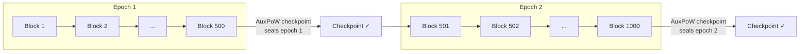

### How It Works

Within an epoch, Tendermint runs with zero AuxPoW awareness. Blocks are proposed, voted on, and committed at full speed. The AuxPoW interaction only happens at epoch boundaries.

```
┌──────────────────────────────────────────────────────────────────┐
│                        EPOCH LIFECYCLE                           │
├──────────────────────────────────────────────────────────────────┤
│                                                                  │
│  PHASE 1: Open Consensus (blocks 1 to N)                        │
│  ─────────────────────────────────────────                       │
│  Tendermint runs normally. No AuxPoW checks.                     │
│  Blocks are finalized instantly via 2/3+ precommits.             │
│                                                                  │
│  PHASE 2: Epoch Boundary (block N)                               │
│  ─────────────────────────────────                               │
│  Block N is the last block of the epoch.                         │
│  After committing block N, consensus PAUSES.                     │
│  A checkpoint covering blocks [last_checkpoint+1 ... N]          │
│  must be submitted.                                              │
│                                                                  │
│  PHASE 3: Checkpoint Submission                                  │
│  ─────────────────────────────                                   │
│  Mining pool submits AuxPoW proof for the epoch's block range.   │
│  All validators verify the checkpoint.                           │
│  Checkpoint is stored.                                           │
│                                                                  │
│  PHASE 4: Epoch Transition                                       │
│  ─────────────────────────                                       │
│  New epoch begins at block N+1.                                  │
│  Consensus resumes.                                              │
│                                                                  │
└──────────────────────────────────────────────────────────────────┘
```

### Epoch State Machine

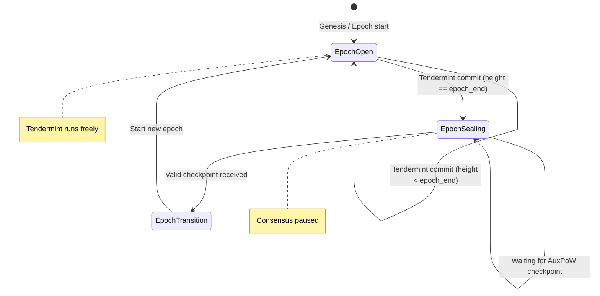

### Implementation

```rust
pub struct EpochManager {
    /// Number of blocks per epoch
    pub epoch_length: u64,
    /// Current epoch number (0-indexed)
    pub current_epoch: u64,
    /// First height of current epoch
    pub epoch_start_height: u64,
    /// Height of last committed checkpoint
    pub last_checkpoint_height: u64,
    /// Grace period: blocks allowed into next epoch while awaiting checkpoint
    pub grace_blocks: u64,
}

impl EpochManager {
    pub fn epoch_end_height(&self) -> u64 {
        self.epoch_start_height + self.epoch_length - 1
    }

    pub fn is_epoch_boundary(&self, height: u64) -> bool {
        height == self.epoch_end_height()
    }

    pub fn should_pause_consensus(&self, height: u64) -> bool {
        // Past epoch end AND no checkpoint yet for current epoch
        height > self.epoch_end_height() + self.grace_blocks
            && self.last_checkpoint_height < self.epoch_end_height()
    }

    pub fn seal_epoch(&mut self, checkpoint_height: u64) {
        self.last_checkpoint_height = checkpoint_height;
        self.current_epoch += 1;
        self.epoch_start_height = checkpoint_height + 1;
    }
}
```

### Grace Period: Avoiding Hard Stalls

A strict epoch boundary causes unnecessary stalls. A grace period allows consensus to continue into the next epoch while the mining pool catches up:

```
Epoch 1: blocks 1-500      Epoch 2: blocks 501-1000
                    │                   │
                    ▼                   │
              Epoch boundary            │
                    │                   │
              ┌─────┼──────┐            │
              │  Grace     │            │
              │  Period    │            │
              │  (50 blks) │            │
              └─────┼──────┘            │
                    │                   │
     If checkpoint  │   If no           │
     arrives within │   checkpoint      │
     grace:         │   by block 550:   │
          │         │        │          │
          ▼         │        ▼          │
    Continue to     │   PAUSE at 550    │
    epoch 2         │   Wait for        │
    seamlessly      │   checkpoint      │
```

```rust
/// Check if we can propose at this height
fn can_propose(&self, height: u64) -> ProposalDecision {
    let epoch_end = self.epoch_manager.epoch_end_height();
    let grace_end = epoch_end + self.epoch_manager.grace_blocks;

    if height <= epoch_end {
        // Within epoch bounds — always allowed
        ProposalDecision::Allowed
    } else if height <= grace_end {
        // In grace period — allowed but warn
        ProposalDecision::AllowedWithWarning {
            blocks_past_epoch: height - epoch_end,
            grace_remaining: grace_end - height,
        }
    } else if self.epoch_manager.last_checkpoint_height >= epoch_end {
        // Checkpoint arrived during grace — transition to new epoch
        ProposalDecision::Allowed
    } else {
        // Past grace, no checkpoint — halt
        ProposalDecision::Blocked {
            reason: "Epoch checkpoint required before continuing",
            waiting_since: epoch_end,
        }
    }
}
```

### What Validators See

```
Epoch 1 (blocks 1-500):
  Height 1:   ✓ Commit (epoch open)
  Height 2:   ✓ Commit
  ...
  Height 499: ✓ Commit
  Height 500: ✓ Commit — EPOCH BOUNDARY

Grace period (blocks 501-550):
  Height 501: ⚠ Commit (grace period, 49 blocks remaining)
  Height 502: ⚠ Commit (grace period, 48 blocks remaining)
  ...

  Height 520: Mining pool submits checkpoint for blocks 1-500
              Epoch 1 sealed ✓
              Epoch 2 begins at 501
              Grace period ends — back to normal

  Height 521: ✓ Commit (epoch 2 open)
  ...
```

### Bridge Integration

Epochs create natural anchor points for bridge operations:

```rust
impl BridgeActor {
    async fn process_pegout(&self, request: PegOutRequest) -> Result<(), BridgeError> {
        let deposit_height = request.deposit_block_height;

        // Find which epoch contains the deposit
        let deposit_epoch = deposit_height / self.epoch_length;

        // Require that epoch to be sealed (has AuxPoW checkpoint)
        if !self.epoch_manager.is_epoch_sealed(deposit_epoch) {
            return Err(BridgeError::EpochNotSealed {
                epoch: deposit_epoch,
                deposit_height,
                message: "Peg-out must wait for epoch checkpoint".to_string(),
            });
        }

        // Epoch is sealed — proceed with peg-out
        self.execute_pegout(request).await
    }
}
```

### Assessment

| Dimension | Rating | Notes |
|-----------|--------|-------|
| Integration tightness | Medium-High | Epochs are structurally enforced |
| Implementation complexity | Medium | New EpochManager + grace period logic |
| Liveness risk | Medium | Grace period mitigates stalls |
| Security guarantee | Strong | Every epoch is Bitcoin-anchored |
| Bridge security | Strong | Epoch sealing gives clear anchor points |

**Best for**: Networks that want predictable checkpoint intervals with minimal impact on normal consensus throughput.

---

## Approach 3: AuxPoW as Commit Extension

### Concept

Make AuxPoW a first-class field within the Tendermint data structures. At designated checkpoint heights, the proposer must include a valid AuxPoW proof in the block. Validators reject proposals at checkpoint heights that lack a valid proof.

### Where AuxPoW Lives in the Protocol

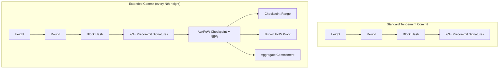

### Checkpoint Heights

Not every block includes an AuxPoW. Checkpoint heights are deterministic:

```rust
const CHECKPOINT_INTERVAL: u64 = 500;

fn is_checkpoint_height(height: u64) -> bool {
    height > 0 && height % CHECKPOINT_INTERVAL == 0
}

// Heights 500, 1000, 1500, 2000, ... are checkpoint heights
```

### Protocol Flow at Checkpoint Heights

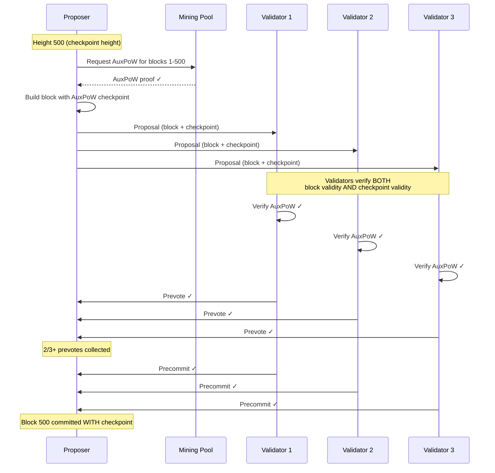

### Protocol Flow at Normal Heights

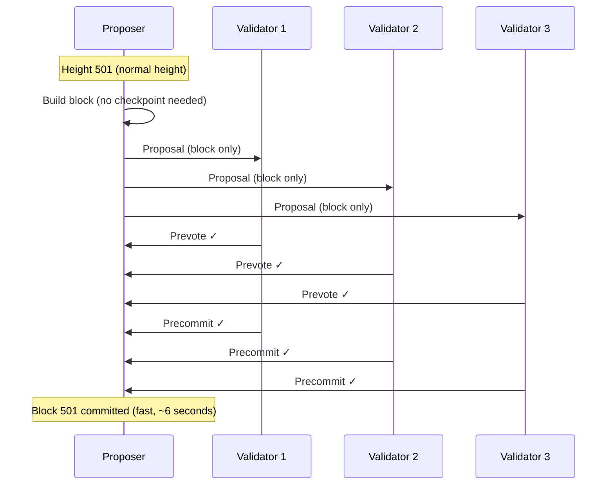

### Extended Block Structure

```rust
/// Tendermint block with optional AuxPoW checkpoint
pub struct TendermintBlock {
    pub height: u64,
    pub round: u32,
    pub parent_hash: Hash256,
    pub execution_payload: ExecutionPayloadCapella<MainnetEthSpec>,
    pub pegins: Vec<(Txid, BlockHash)>,
    pub pegout_payment_proposal: Option<BitcoinTransaction>,
    pub finalized_pegouts: Vec<BitcoinTransaction>,

    /// AuxPoW checkpoint — present only at checkpoint heights
    pub auxpow_checkpoint: Option<AuxPowCheckpoint>,
}

pub struct AuxPowCheckpoint {
    /// First block in the checkpoint range
    pub range_start_height: u64,
    /// Last block in the checkpoint range (inclusive)
    pub range_end_height: u64,
    /// Merkle root of all block hashes in range
    pub commitment: Hash256,
    /// Bitcoin merge-mining proof
    pub auxpow: AuxPow,
    /// Difficulty target
    pub bits: u32,
    /// Chain ID for AuxPoW validation
    pub chain_id: u32,
}
```

### Proposer Responsibility

The proposer for a checkpoint height has extra work:

```rust
impl ChainActor {
    async fn build_proposal(&self, height: u64) -> Result<TendermintBlock, ChainError> {
        let block = self.build_execution_block(height).await?;

        let checkpoint = if is_checkpoint_height(height) {
            // Proposer must provide the AuxPoW checkpoint
            let range_start = self.state.last_checkpoint_height + 1;
            let range_end = height;

            // Option A: Proposer has pre-mined checkpoint ready
            if let Some(cp) = self.state.pending_checkpoint.take() {
                if cp.range_end_height == range_end {
                    Some(cp)
                } else {
                    // Stale checkpoint — need fresh one
                    self.request_checkpoint(range_start, range_end).await.ok()
                }
            } else {
                // Option B: Request from mining pool in real-time
                self.request_checkpoint(range_start, range_end).await.ok()
            }
        } else {
            None
        };

        Ok(TendermintBlock {
            height,
            auxpow_checkpoint: checkpoint,
            ..block
        })
    }
}
```

### What If the Proposer Cannot Provide a Checkpoint?

If the proposer for a checkpoint height doesn't have a ready AuxPoW proof, the round times out and a new proposer tries:

```
Height 500 (checkpoint required):

  Round 0:
    Proposer A has no checkpoint ready
    → Proposes block WITHOUT checkpoint
    → Validators reject (missing required checkpoint)
    → Round times out

  Round 1:
    Proposer B has no checkpoint ready
    → Same outcome, round times out

  Round 2:
    Proposer C has a pre-mined checkpoint!
    → Proposes block WITH checkpoint
    → Validators verify checkpoint ✓
    → Block committed ✓

  Time elapsed: 2 timeouts × ~6 seconds = ~12 seconds extra latency
```

This means validators should **pre-mine checkpoints proactively** to minimize delays at checkpoint heights:

```rust
/// Background task that pre-mines checkpoints
async fn checkpoint_pre_mining_loop(
    chain_state: Arc<RwLock<ChainState>>,
    mining_pool: Arc<MiningPoolClient>,
) {
    loop {
        let state = chain_state.read().await;
        let current_height = state.get_height();
        let next_checkpoint = next_checkpoint_height(current_height);
        let blocks_until = next_checkpoint - current_height;

        // Start pre-mining when we're within 50 blocks of next checkpoint
        if blocks_until <= 50 {
            let range_start = state.last_checkpoint_height + 1;
            let range_end = next_checkpoint;

            drop(state); // Release lock

            // Request checkpoint from mining pool (may take minutes)
            if let Ok(checkpoint) = mining_pool.create_checkpoint(range_start, range_end).await {
                let mut state = chain_state.write().await;
                state.pending_checkpoint = Some(checkpoint);
                info!(
                    checkpoint_height = next_checkpoint,
                    "Pre-mined checkpoint ready"
                );
            }
        }

        tokio::time::sleep(Duration::from_secs(6)).await;
    }
}
```

### Validator Verification at Checkpoint Heights

```rust
fn validate_proposal_at_checkpoint_height(
    &self,
    proposal: &Proposal,
    validator_set: &ValidatorSet,
) -> Result<(), ChainError> {
    // Standard proposal validation
    self.verify_proposal_signature(proposal, validator_set)?;
    self.verify_execution_payload(proposal)?;

    // Checkpoint validation (ONLY at checkpoint heights)
    let checkpoint = proposal.block.auxpow_checkpoint.as_ref()
        .ok_or(ChainError::MissingRequiredCheckpoint)?;

    // 1. Verify range covers expected blocks
    let expected_start = self.state.last_checkpoint_height + 1;
    let expected_end = proposal.height;
    if checkpoint.range_start_height != expected_start
        || checkpoint.range_end_height != expected_end {
        return Err(ChainError::InvalidCheckpointRange);
    }

    // 2. Verify commitment matches actual block hashes
    let actual_commitment = self.compute_range_commitment(
        checkpoint.range_start_height,
        checkpoint.range_end_height,
    ).await?;
    if checkpoint.commitment != actual_commitment {
        return Err(ChainError::InvalidCheckpointCommitment);
    }

    // 3. Verify Bitcoin proof of work
    if !checkpoint.auxpow.check_proof_of_work(
        CompactTarget::from_consensus(checkpoint.bits)
    ) {
        return Err(ChainError::InsufficientProofOfWork);
    }

    // 4. Verify AuxPoW structure (merkle branch, chain ID)
    let commitment_hash = BlockHash::from_byte_array(checkpoint.commitment.0);
    checkpoint.auxpow.check(commitment_hash, checkpoint.chain_id)
        .map_err(|e| ChainError::AuxPowValidation(format!("{:?}", e)))?;

    Ok(())
}
```

### SyncActor Benefits

Nodes syncing from genesis automatically receive checkpoints as part of the block data. No separate checkpoint discovery is needed:

```
Syncing node requests blocks 1-1000:

  Block 1:   [payload]
  Block 2:   [payload]
  ...
  Block 500: [payload + AuxPoW checkpoint covering 1-500] ← FREE
  Block 501: [payload]
  ...
  Block 1000: [payload + AuxPoW checkpoint covering 501-1000] ← FREE

  Syncing node verifies each checkpoint as part of block verification.
  No additional checkpoint discovery protocol needed.
```

### Assessment

| Dimension | Rating | Notes |
|-----------|--------|-------|
| Integration tightness | **Highest** | AuxPoW is part of the block structure |
| Implementation complexity | Medium-High | Proposer pre-mining, extended block format |
| Liveness risk | Medium | Rounds cycle until a proposer has a checkpoint |
| Security guarantee | Strong | Every node verifies checkpoints as consensus data |
| Bridge security | Strong | Checkpoints are in the block chain itself |

**Best for**: Networks that want AuxPoW to be a verifiable, auditable part of the block history rather than a side-channel.

---

## Approach 4: Dual-Layer Finality

### Concept

Create two explicit finality tiers. **Consensus finality** (Tendermint) is instant and handles all normal operations. **Anchor finality** (AuxPoW + Bitcoin) is delayed and required only for high-value or cross-chain operations. Tendermint never stalls waiting for AuxPoW.

### Two-Tier Architecture

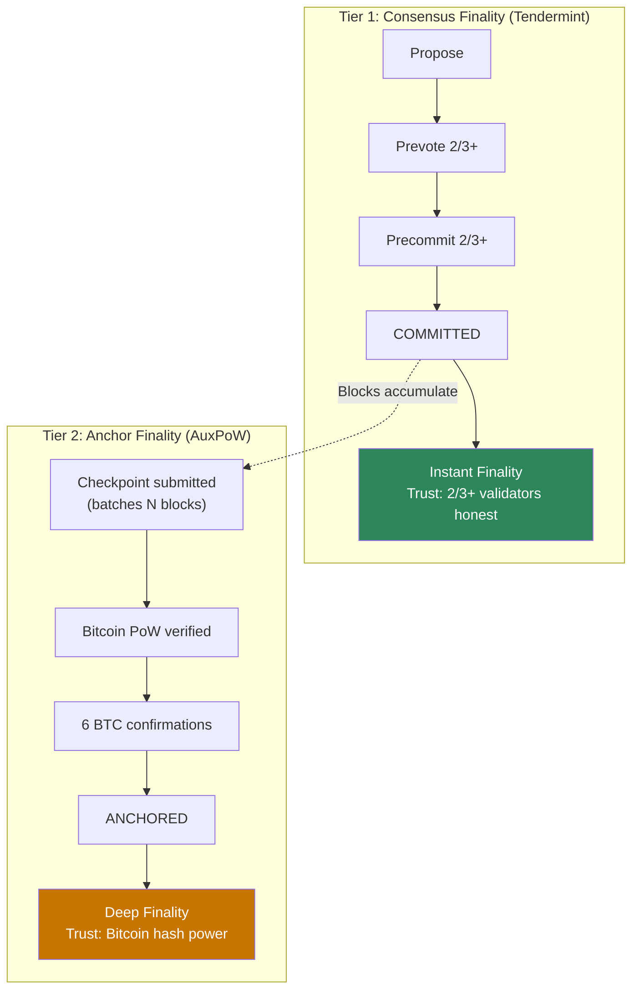

### Finality Tier Assignments

```
┌─────────────────────────────────────────────────────────────────┐
│                   OPERATION → FINALITY TIER                     │
├─────────────────────────────────────────────────────────────────┤
│                                                                 │
│  TIER 1 ONLY (Consensus Finality — instant):                    │
│  ─────────────────────────────────────────                      │
│  • EVM transactions between Alys accounts                       │
│  • Smart contract deployments and calls                         │
│  • Token transfers within Alys                                  │
│  • Reading chain state                                          │
│  • Small peg-ins (below threshold T)                            │
│                                                                 │
│  TIER 2 REQUIRED (Anchor Finality — delayed):                   │
│  ─────────────────────────────────────────                      │
│  • All peg-outs (releasing Bitcoin)                              │
│  • Large peg-ins (above threshold T)                             │
│  • Validator set changes                                        │
│  • Governance actions (parameter changes)                       │
│  • Cross-chain proofs (for external verifiers)                  │
│                                                                 │
└─────────────────────────────────────────────────────────────────┘
```

### Key Property: Tendermint Never Waits

Unlike Approaches 1-3, Tendermint runs completely independently of AuxPoW. Blocks are produced at full speed regardless of checkpoint status:

```
Timeline:
═══════════════════════════════════════════════════════════════════

Tendermint:  1 ─ 2 ─ 3 ─ 4 ─ 5 ─ 6 ─ ... ─ 500 ─ 501 ─ ... ─ 1000
             │   │   │   │   │   │         │     │             │
             F   F   F   F   F   F         F     F             F
             (all instantly final)

AuxPoW:                                    CP1                 CP2
                                           │                   │
                                     Covers 1-500        Covers 501-1000
                                           │                   │
                                     +60 min BTC         +60 min BTC
                                     confirmations       confirmations
                                           │                   │
                                           ▼                   ▼
                                     Blocks 1-500        Blocks 501-1000
                                     now ANCHORED        now ANCHORED

F = Consensus Finality (instant)
CP = Checkpoint (AuxPoW submitted)
```

### Finality Status per Block

```rust
pub enum FinalityStatus {
    /// Block has 2/3+ Tendermint precommits (instant)
    ConsensusFinalized {
        height: u64,
        commit: Commit,
    },

    /// Block is covered by an AuxPoW checkpoint
    CheckpointAnchored {
        height: u64,
        commit: Commit,
        checkpoint: AuxPowCheckpoint,
    },

    /// Block is covered by a checkpoint with sufficient BTC confirmations
    DeepFinalized {
        height: u64,
        commit: Commit,
        checkpoint: AuxPowCheckpoint,
        btc_confirmations: u32,
    },
}

impl FinalityStatus {
    pub fn meets_tier(&self, required: FinalityTier) -> bool {
        match (required, self) {
            (FinalityTier::Consensus, _) => true, // All statuses meet Tier 1
            (FinalityTier::Anchored, FinalityStatus::CheckpointAnchored { .. }) => true,
            (FinalityTier::Anchored, FinalityStatus::DeepFinalized { .. }) => true,
            (FinalityTier::Deep, FinalityStatus::DeepFinalized { btc_confirmations, .. }) => {
                *btc_confirmations >= REQUIRED_BTC_CONFIRMATIONS
            }
            _ => false,
        }
    }
}
```

### Bridge Operations with Dual Finality

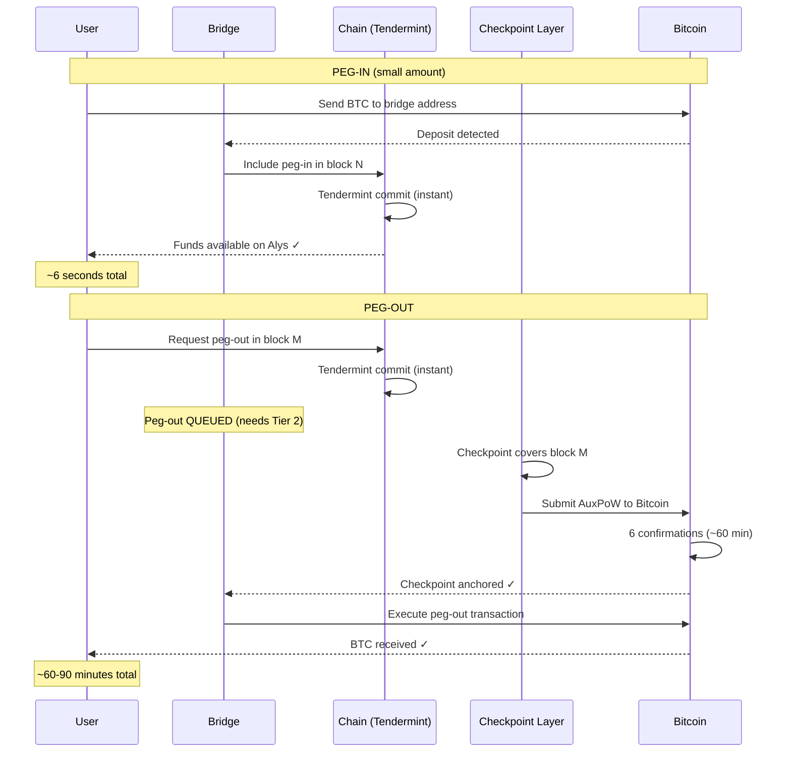

### Tracking Anchor Finality

```rust
pub struct AnchorFinalityTracker {
    /// Pending checkpoints (not yet submitted to Bitcoin)
    pending_checkpoints: Vec<PendingCheckpoint>,
    /// Submitted checkpoints (awaiting BTC confirmations)
    submitted_checkpoints: Vec<SubmittedCheckpoint>,
    /// Fully anchored checkpoints
    anchored_checkpoints: Vec<AnchoredCheckpoint>,
}

pub struct PendingCheckpoint {
    pub range_start: u64,
    pub range_end: u64,
    pub commitment: Hash256,
    pub created_at: SystemTime,
}

pub struct SubmittedCheckpoint {
    pub range_start: u64,
    pub range_end: u64,
    pub commitment: Hash256,
    pub auxpow: AuxPow,
    pub btc_block_hash: BlockHash,
    pub submitted_at: SystemTime,
}

pub struct AnchoredCheckpoint {
    pub range_start: u64,
    pub range_end: u64,
    pub commitment: Hash256,
    pub auxpow: AuxPow,
    pub btc_block_hash: BlockHash,
    pub btc_confirmations: u32,
    pub anchored_at: SystemTime,
}

impl AnchorFinalityTracker {
    /// Get the highest block height that has anchor finality
    pub fn highest_anchored_height(&self) -> Option<u64> {
        self.anchored_checkpoints.iter()
            .map(|cp| cp.range_end)
            .max()
    }

    /// Check if a specific block has anchor finality
    pub fn is_anchored(&self, height: u64) -> bool {
        self.anchored_checkpoints.iter()
            .any(|cp| height >= cp.range_start && height <= cp.range_end)
    }
}
```

### What If Checkpoints Stop Coming?

Unlike Approaches 1-3, the chain does **not halt**. Instead:

```
┌─────────────────────────────────────────────────────────────────┐
│  SCENARIO: Mining pool goes offline                             │
├─────────────────────────────────────────────────────────────────┤
│                                                                 │
│  Tendermint: Continues producing blocks at full speed ✓         │
│                                                                 │
│  On-chain operations: Fully functional ✓                        │
│                                                                 │
│  Peg-ins (small): Still instant ✓                               │
│                                                                 │
│  Peg-outs: QUEUED but not processed                             │
│            Users see "Waiting for anchor finality"              │
│            Funds are safe, just delayed                         │
│                                                                 │
│  Large peg-ins: QUEUED                                          │
│            Same as peg-outs                                     │
│                                                                 │
│  Validator set changes: BLOCKED                                 │
│            Cannot change validators without anchor              │
│                                                                 │
│  Alert: "No checkpoint in N blocks" → Ops team investigates   │
│                                                                 │
│  Recovery: Mining pool comes back                               │
│            Submits checkpoint covering entire gap                │
│            All queued operations process                         │
│                                                                 │
└─────────────────────────────────────────────────────────────────┘
```

### Latency Comparison

```
Operation              Approach 1    Approach 2    Approach 3    Approach 4
──────────────────────────────────────────────────────────────────────────
On-chain transfer      ~6s           ~6s           ~6s           ~6s
                       (may stall)   (may stall)   (may stall)   (never stalls)

Peg-in (small)         ~6s           ~6s           ~6s           ~6s
                       (may stall)   (may stall)   (may stall)   (never stalls)

Peg-out                ~6s + CP      ~6s + CP      ~6s + CP      ~6s + CP wait
                       + BTC confs   + BTC confs   + BTC confs   + BTC confs

Checkpoint stall       FULL HALT     HALT after    ROUNDS        NO HALT
                                     grace         CYCLE         (just queues)
```

### Assessment

| Dimension | Rating | Notes |
|-----------|--------|-------|
| Integration tightness | Medium | AuxPoW is parallel, not embedded |
| Implementation complexity | Medium | Finality tracker + operation categorization |
| Liveness risk | **Lowest** | Tendermint never waits for AuxPoW |
| Security guarantee | Tiered | Consensus-only vs Bitcoin-anchored |
| Bridge security | **Strongest** | Explicit tier requirements per operation |

**Best for**: Networks that prioritize uptime and fast UX for on-chain operations while still requiring Bitcoin-level security for cross-chain operations.

---

## Approach 5: AuxPoW as Long-Range Attack Protection Only

### Concept

The most minimal integration. AuxPoW serves a single purpose: preventing an attacker who compromises old validator keys from creating a fake alternate history. Checkpoints are verified only during initial sync and peer evaluation, never during normal consensus.

### The Attack It Prevents

```
┌─────────────────────────────────────────────────────────────────┐
│  LONG-RANGE ATTACK SCENARIO                                     │
├─────────────────────────────────────────────────────────────────┤
│                                                                 │
│  Legitimate chain (with checkpoints):                           │
│                                                                 │
│  G ─── 100 ─── 200 ─── ... ─── 10000                          │
│         │              │                │                       │
│       [CP1]          [CP2]            [CP20]                    │
│     BTC anchor     BTC anchor       BTC anchor                 │
│                                                                 │
│  Attacker (has old validator keys from height 100):             │
│                                                                 │
│  G ─── 100' ─── 200' ─── ... ─── 10000'                       │
│         │                                                       │
│         └── Signed with compromised old keys                   │
│             Looks valid (has 2/3+ signatures)                  │
│             BUT has no AuxPoW checkpoints                      │
│                                                                 │
│  New node syncing from scratch:                                │
│    "I see two chains. Which is real?"                          │
│    → Chain with AuxPoW checkpoints wins.                       │
│    → Checkpoints are anchored in Bitcoin (unforgeable).        │
│    → Attacker would need to also forge Bitcoin PoW.            │
│                                                                 │
└─────────────────────────────────────────────────────────────────┘
```

### Sync-Time Verification Only

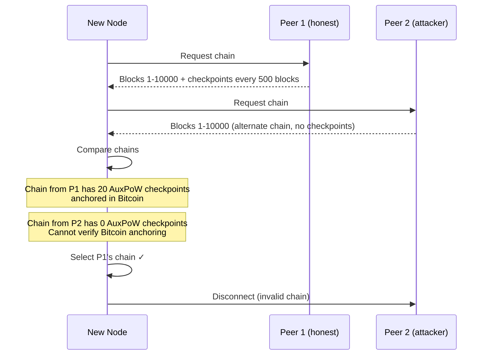

### Implementation

```rust
impl SyncActor {
    /// Verify chain during initial sync
    async fn verify_synced_chain(
        &self,
        blocks: &[SignedBlock],
        checkpoints: &[AuxPowCheckpoint],
    ) -> Result<(), SyncError> {
        let expected_checkpoint_count = blocks.last()
            .map(|b| b.height / CHECKPOINT_INTERVAL)
            .unwrap_or(0);

        // Verify we have enough checkpoints
        if (checkpoints.len() as u64) < expected_checkpoint_count {
            return Err(SyncError::InsufficientCheckpoints {
                expected: expected_checkpoint_count,
                actual: checkpoints.len() as u64,
            });
        }

        // Verify each checkpoint
        for checkpoint in checkpoints {
            // Verify checkpoint commitment matches actual blocks
            let actual = self.compute_commitment(
                blocks,
                checkpoint.range_start_height,
                checkpoint.range_end_height,
            )?;

            if actual != checkpoint.commitment {
                return Err(SyncError::InvalidCheckpointCommitment);
            }

            // Verify Bitcoin PoW
            if !checkpoint.auxpow.check_proof_of_work(
                CompactTarget::from_consensus(checkpoint.bits)
            ) {
                return Err(SyncError::InvalidCheckpointPoW);
            }
        }

        Ok(())
    }
}
```

### What Happens During Normal Operation

Nothing. AuxPoW is invisible to running consensus:

```
Normal operation:

  Height 1:    Tendermint propose/prevote/precommit/commit
  Height 2:    Tendermint propose/prevote/precommit/commit
  ...
  Height 1000: Tendermint propose/prevote/precommit/commit

  (No AuxPoW checks at any point)

  Mining pools submit checkpoints in the background.
  Checkpoints are stored but not required by consensus.
  If mining pools go offline:
    → Chain continues forever
    → No stalls, no degradation
    → Long-range attack protection gradually weakens
    → Alert: "No checkpoint in N blocks"
```

### The Weakness

```
┌─────────────────────────────────────────────────────────────────┐
│  WEAKNESS: No guarantee checkpoints keep being produced         │
├─────────────────────────────────────────────────────────────────┤
│                                                                 │
│  If mining pools stop submitting checkpoints:                   │
│                                                                 │
│  • Chain keeps running (good)                                   │
│  • But gap between last checkpoint and current height grows     │
│  • Long-range attack window expands                            │
│  • Bridge operations have no Bitcoin-anchored reference         │
│                                                                 │
│  After 1 month without checkpoints:                             │
│    An attacker with old keys could create a fake chain         │
│    covering the entire checkpoint-less period.                  │
│    New nodes would have no way to distinguish real from fake.  │
│                                                                 │
│  This approach relies entirely on economic incentives            │
│  (or social consensus) to keep mining pools engaged.            │
│                                                                 │
└─────────────────────────────────────────────────────────────────┘
```

### Assessment

| Dimension | Rating | Notes |
|-----------|--------|-------|
| Integration tightness | **Lowest** | Only checked during sync |
| Implementation complexity | **Low** | Sync verification only |
| Liveness risk | **None** | Tendermint runs with zero AuxPoW awareness |
| Security guarantee | **Weakest** | Voluntary checkpoints, no enforcement |
| Bridge security | Weakest | No guarantee checkpoints exist for bridge ops |

**Best for**: Networks that prioritize absolute consensus independence and treat AuxPoW as a pure defense-in-depth measure.

---

## Hybrid Approach: Epoch-Gated + Dual-Layer Finality (2 + 4)

### Concept

Combine the structural benefits of Approach 2 (epoch boundaries) with the liveness benefits of Approach 4 (Tendermint never stalls). Epochs exist as a target for checkpoints, but consensus continues even if a checkpoint is late. Bridge operations enforce the tier requirement independently.

### How It Works

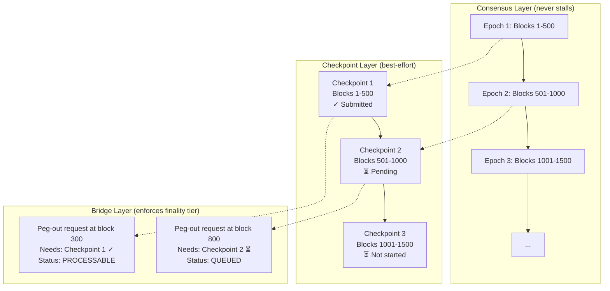

### State Machine

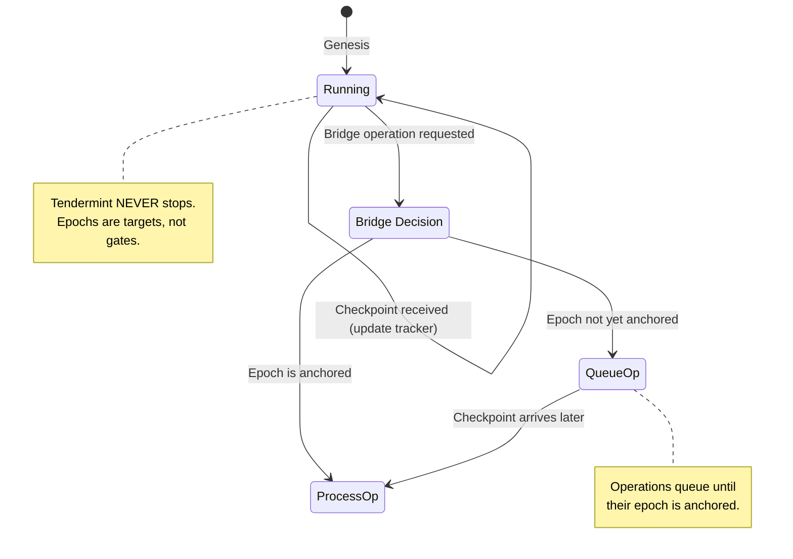

### Implementation

```rust
pub struct HybridEpochManager {
    pub epoch_length: u64,

    /// Tracks which epochs have been sealed by checkpoints
    pub sealed_epochs: BTreeMap<u64, AnchoredCheckpoint>,

    /// Operations waiting for their epoch to be sealed
    pub pending_operations: Vec<PendingBridgeOp>,
}

impl HybridEpochManager {
    pub fn epoch_for_height(&self, height: u64) -> u64 {
        height / self.epoch_length
    }

    pub fn is_epoch_sealed(&self, epoch: u64) -> bool {
        self.sealed_epochs.contains_key(&epoch)
    }

    /// Called when a checkpoint arrives (any time, not blocking consensus)
    pub fn on_checkpoint_received(&mut self, checkpoint: AnchoredCheckpoint) {
        let epoch = self.epoch_for_height(checkpoint.range_end_height);
        self.sealed_epochs.insert(epoch, checkpoint);

        // Process any pending operations that were waiting for this epoch
        let newly_processable: Vec<_> = self.pending_operations
            .drain_filter(|op| self.is_epoch_sealed(self.epoch_for_height(op.block_height)))
            .collect();

        for op in newly_processable {
            // Trigger bridge processing
            tracing::info!(
                epoch = epoch,
                op_height = op.block_height,
                "Epoch sealed — processing queued bridge operation"
            );
        }
    }
}
```

### User Experience

```
USER ACTION                    WHAT HAPPENS                    LATENCY
─────────────────────────────────────────────────────────────────────────

Send tokens on Alys           Tendermint commit               ~6 seconds
                              (Tier 1 finality)

Peg-in 0.01 BTC              Tendermint commit               ~6 seconds
(small amount)                (Tier 1 finality)

Peg-out 1.0 BTC              Tendermint commit (instant)     ~6 seconds
                              + Wait for epoch checkpoint     + 0-50 minutes
                              + Wait for BTC confirmations    + ~60 minutes
                              Total:                          ~70-120 minutes

                              User sees:
                              "Peg-out confirmed. Waiting for
                               Bitcoin anchor finality.
                               Estimated: ~90 minutes"

Peg-out during pool outage    Tendermint commit (instant)     ~6 seconds
                              + Epoch checkpoint: DELAYED     + ???

                              User sees:
                              "Peg-out confirmed. Waiting for
                               Bitcoin anchor finality.
                               Status: Checkpoint pending.
                               The chain is fully operational."
```

### Assessment

| Dimension | Rating | Notes |
|-----------|--------|-------|
| Integration tightness | Medium-High | Epochs + finality tiers |
| Implementation complexity | Medium | Epoch manager + finality tracker + bridge queue |
| Liveness risk | **Lowest** | Tendermint never stalls |
| Security guarantee | Strong | Tiered with epoch structure |
| Bridge security | **Strongest** | Explicit tier per operation + epoch anchoring |

**Best for**: Production networks that need both reliability (no stalls) and strong security (Bitcoin anchoring for cross-chain ops).

---

## Full Comparison Matrix

| | Approach 1 | Approach 2 | Approach 3 | Approach 4 | Approach 5 | Hybrid (2+4) |
|---|---|---|---|---|---|---|
| **Summary** | Liveness gate | Epoch-gated | Commit extension | Dual-layer | Sync-only | Best of 2+4 |
| **Consensus stalls?** | Yes | Yes (grace) | Yes (rounds cycle) | **Never** | Never | **Never** |
| **Checkpoint guaranteed?** | **Yes** | **Yes** | **Yes** | No (queues ops) | No (voluntary) | No (queues ops) |
| **Bridge impact** | All ops wait | Epoch boundary | In-block proof | Tiered | None | **Tiered + epochs** |
| **Mining pool outage** | **Chain halts** | Chain halts (after grace) | Rounds slow down | Chain fine, ops queue | Chain fine | **Chain fine, ops queue** |
| **Complexity** | Low | Medium | Medium-High | Medium | **Low** | Medium |
| **On-chain UX** | May stall | May stall | May slow | **Always fast** | Always fast | **Always fast** |
| **Long-range protection** | Strong | Strong | Strong | Strong | **Weakest** | Strong |

---

## Recommendation

For a production system, the **Hybrid (2+4)** approach provides the best balance:

1. **Tendermint never waits** for AuxPoW — on-chain operations are always instant
2. **Epoch structure** creates predictable checkpoint targets for mining pools
3. **Bridge operations enforce their own finality tier** — no consensus changes needed
4. **Mining pool outage** degrades peg-out latency but never halts the chain
5. **Implementation is modular** — each concern (epochs, finality tracking, bridge queuing) can be built and tested independently

The next step would be to select an approach and create a detailed implementation plan with code examples, storage schema, and integration points.

---

*Exploration Document Version: 1.0*
*Last Updated: January 2026*
