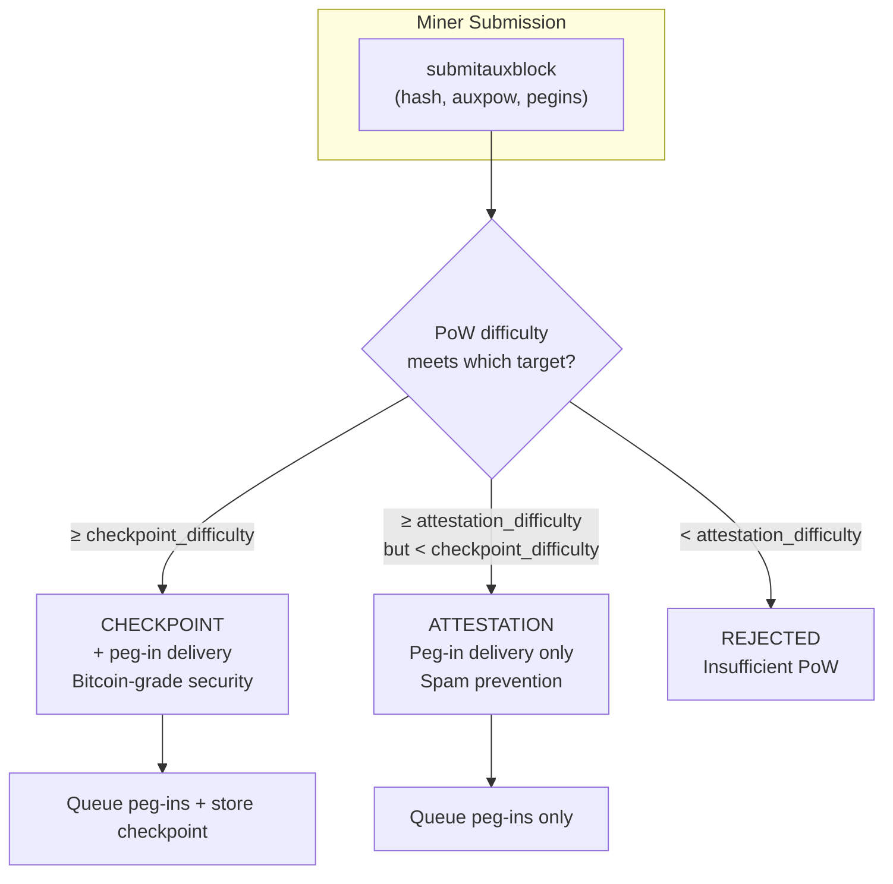
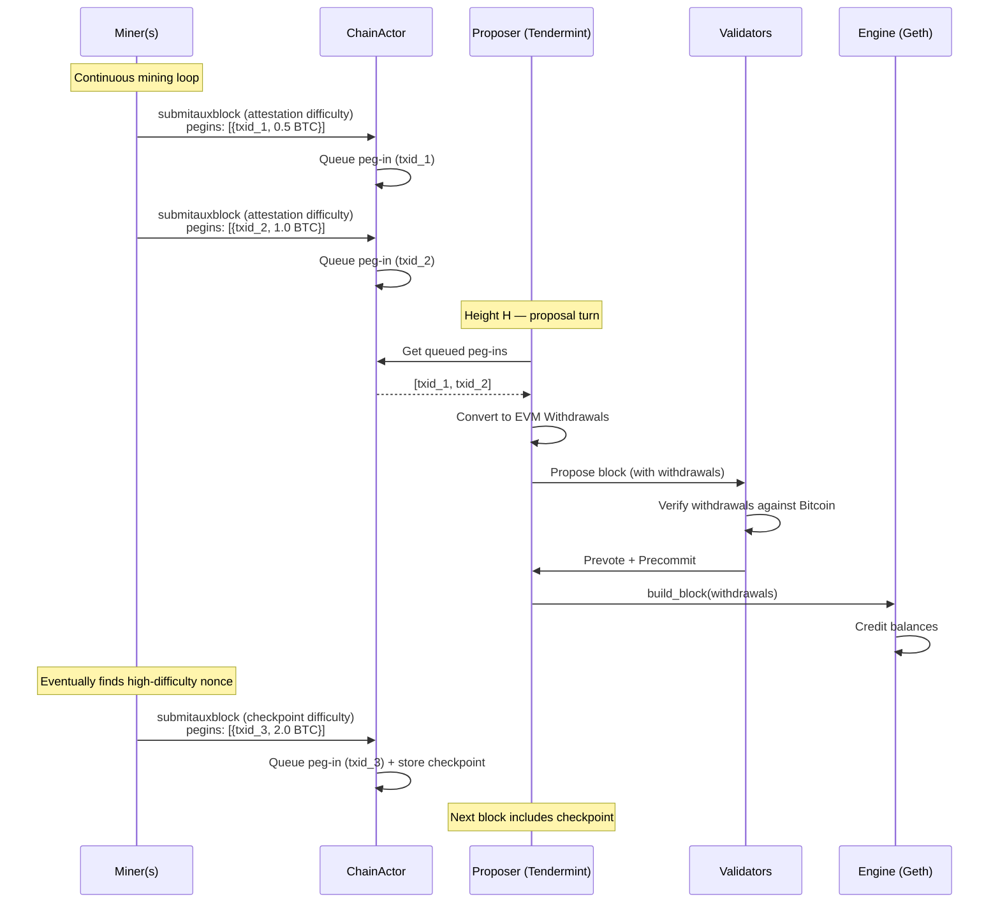
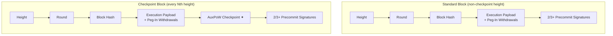
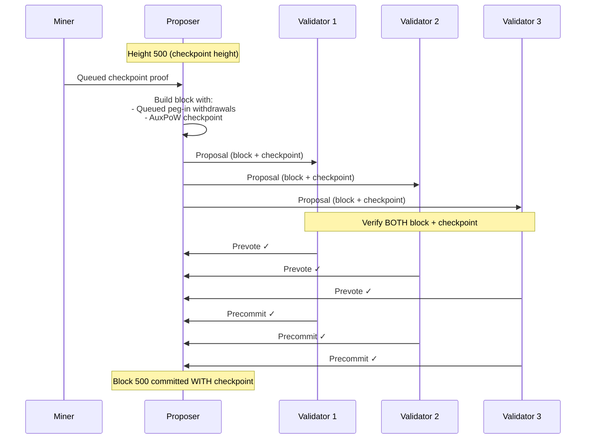
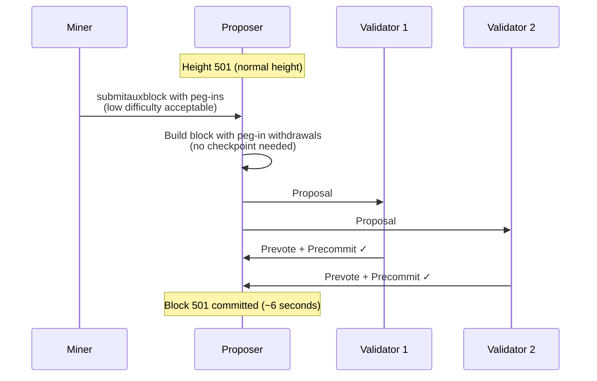
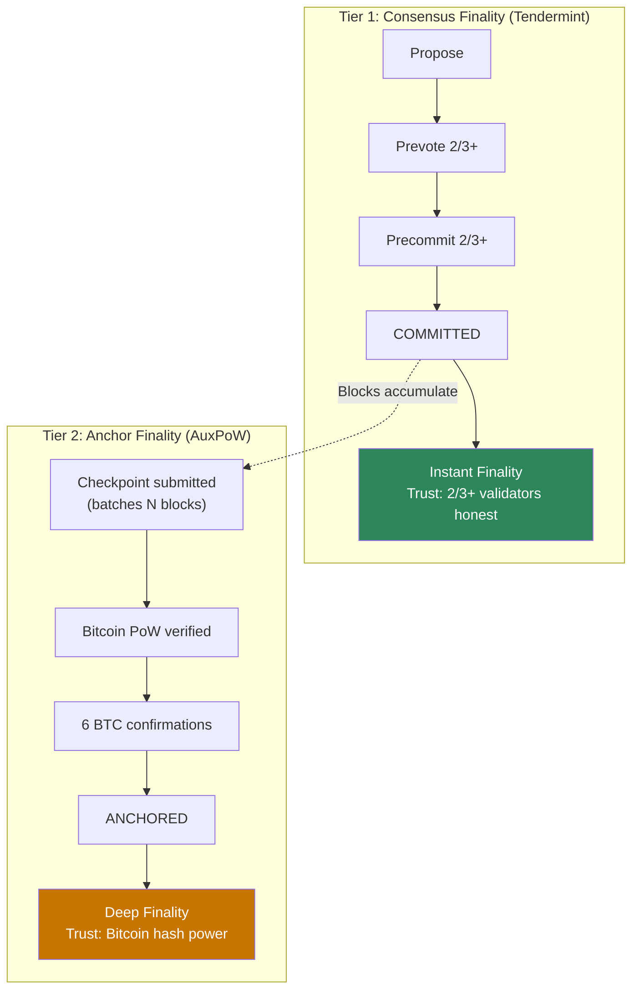
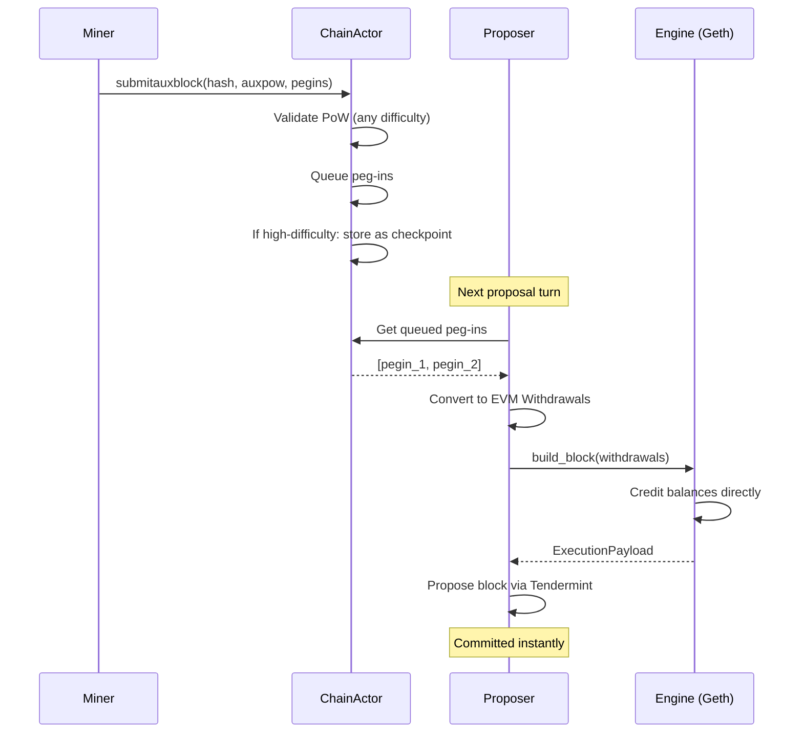
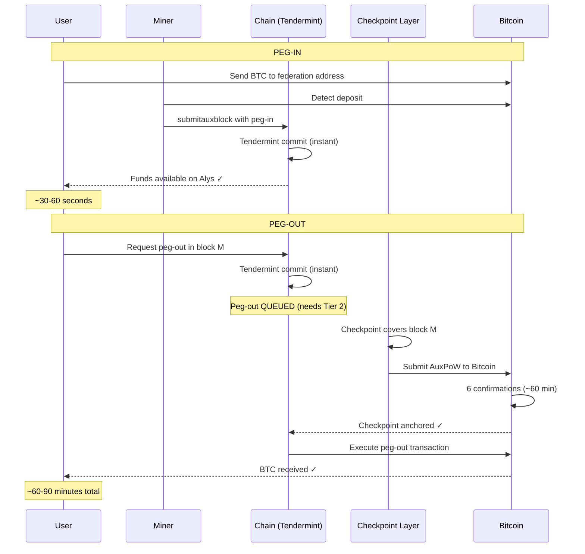

# AuxPoW-Tendermint Integration: Approaches for Miner-Effectuated Peg-Ins

## Overview

This document explores how AuxPoW (merge-mining) integrates with Tendermint consensus, accounting for the requirement that **miners effectuate peg-ins**. AuxPoW now serves three distinct roles in Alys:

1. **Bitcoin Anchoring** — Periodic merge-mining proofs anchor Alys block history in Bitcoin's PoW, providing long-range attack protection and deep finality for bridge operations.
2. **Liveness Gate** — The chain halts after `max_blocks_without_pow` blocks without a valid AuxPoW proof (currently 50000 on testnet).
3. **Peg-In Delivery** (NEW) — For AML/MTM legal compliance, miners must monitor Bitcoin for deposits and include peg-in data in their AuxPoW header submissions.

The third role fundamentally changes the integration calculus. Previously, peg-ins arrived via the Bridge (a separate monitoring process) and could be included in any block regardless of AuxPoW status. Now, peg-in delivery is **bound to the AuxPoW submission frequency**, creating a tension between peg-in latency and mining overhead that shapes every approach below.

> **Prerequisites**: See [MINER_PEGIN_IMPACT_ANALYSIS.md](MINER_PEGIN_IMPACT_ANALYSIS.md) for detailed explanations of merge-mining mechanics, `createauxblock`/`submitauxblock` protocol, and the end-to-end peg-in lifecycle with code walkthroughs.

---

## Current AuxPoW Behavior

```
Block 1     Block 2     Block 3     ...     Block n     Block n+1
  │           │           │                   │           │
  ▼           ▼           ▼                   ▼           ▼
[normal]   [normal]   [normal]            [AuxPoW!]   [normal]
                                              │
                                              ▼
                                    Counter resets to 0.
                                    Chain keeps producing.

If n reaches max_blocks_without_pow (50000 on testnet):
  → Chain HALTS. No more blocks until AuxPoW is submitted.
```

Under the current system, peg-ins flow independently through the Bridge:

```
Bridge (federation)  →  queued_pegins: BTreeMap<Txid, PegInInfo>  →  Block producer
                                                                      includes in block
```

Under the new requirement:

```
Miner monitors BTC  →  submitauxblock(hash, auxpow, pegins)  →  queued pegins  →  Proposer
                                                                                    includes in block
```

---

## Architectural Foundations (Common to All Approaches)

### Extended AuxPowHeader

Per [MINER_PEGIN_IMPACT_ANALYSIS.md](MINER_PEGIN_IMPACT_ANALYSIS.md), the `AuxPowHeader` struct (`block.rs:35`) must be extended to carry peg-in data. This is the primary vehicle for peg-in delivery:

```rust
pub struct AuxPowHeader {
    pub range_start: Hash256,
    pub range_end: Hash256,
    pub bits: u32,
    pub chain_id: u32,
    pub height: u64,
    pub auxpow: Option<AuxPow>,
    pub fee_recipient: Address,
    /// Peg-in transactions attested by this miner (NEW)
    /// These travel FROM the miner TO the chain via submitauxblock.
    /// ChainActor validates and queues them, then the proposer converts
    /// them to EVM Withdrawals in the next block's execution_payload.
    pub pegins: Vec<PegInInfo>,
}

/// Peg-in information extracted from Bitcoin transaction
/// (same as current PegInInfo in federation crate)
pub struct PegInInfo {
    pub txid: Txid,              // Bitcoin transaction ID
    pub block_hash: BlockHash,   // Bitcoin block containing the deposit
    pub block_height: u32,       // Bitcoin block height
    pub amount: u64,             // Satoshis deposited
    pub evm_account: Address,    // Target EVM address (from OP_RETURN)
}
```

### Extended Miner Binary

The miner (`crates/miner/src/main.rs`, currently 82 lines) must gain Bitcoin monitoring capabilities that currently live in `crates/federation/src/lib.rs`:

```rust
// Miner's new main loop (conceptual)
loop {
    // 1. Check for new Bitcoin deposits (NEW)
    let pending_pegins = bitcoin_monitor.get_pending_pegins().await;

    // 2. Get mining work package (existing)
    let aux_block = rpc_client.create_aux_block(&miner_address).await?;

    // 3. Mine PoW (existing)
    let auxpow = AuxPow::mine(aux_block.hash, aux_block.target, chain_id).await;

    // 4. Submit with peg-in data (MODIFIED)
    rpc_client.submit_aux_block(aux_block.hash, auxpow, pending_pegins).await?;
}
```

The miner needs access to a Bitcoin RPC endpoint and knowledge of the federation deposit address(es) — the same inputs the Bridge currently uses for `stream_blocks_for_pegins()` and `pegin_info()`.

### Duplicate Peg-In Prevention

Multiple miners monitoring Bitcoin will detect the same deposits. Four layers prevent duplicate processing:

| Layer | Where | Mechanism |
|-------|-------|-----------|
| 0. Ingestion filter (NEW) | `handle_submit_auxblock()` | Reject pegins already queued or already in wallet |
| 1. Queue dedup | `BTreeMap<Txid, PegInInfo>` | Map keyed by txid naturally deduplicates |
| 2. Producer filter | `fill_pegins()` / `collect_withdrawals()` | Check `wallet.get_tx(txid)` before including in block |
| 3. Validator verify | `check_withdrawals()` | Reject blocks containing already-processed txids |

Layer 0 is new and addresses the multi-miner scenario:

```rust
async fn validate_and_queue_pegins(
    &mut self,
    pegins: Vec<PegInInfo>,
) -> Result<usize, ChainError> {
    let mut queued_count = 0;

    for pegin in pegins {
        // Skip if already in queue (Layer 1 would also catch this)
        if self.state.queued_pegins.contains_key(&pegin.txid) {
            debug!(txid = %pegin.txid, "Peg-in already queued — skipping");
            continue;
        }

        // Skip if already processed in a finalized block
        let wallet = self.bitcoin_wallet.read().await;
        if wallet.get_tx(&pegin.txid)?.is_some() {
            debug!(txid = %pegin.txid, "Peg-in already processed — skipping");
            continue;
        }
        drop(wallet);

        // TODO: Verify peg-in against Bitcoin (confirm the deposit exists)
        // This is approach-dependent — see individual approaches

        self.state.queued_pegins.insert(pegin.txid, pegin);
        queued_count += 1;
    }

    Ok(queued_count)
}
```

### Peg-In to EVM Withdrawal Conversion

The proposer converts queued peg-ins to EVM withdrawals via `collect_withdrawals()` (`actors_v2/chain/withdrawals.rs:207`). Each `PegInInfo` becomes:

```rust
Withdrawal {
    index: withdrawals.len() as u64,
    validator_index: 0,              // Unused in Alys consensus
    address: pegin_info.evm_account, // From Bitcoin OP_RETURN
    amount: ConsensusAmount::from_satoshi(pegin_info.amount).0, // satoshis × 10 = gwei
}
```

Geth processes these via the Capella withdrawal mechanism — direct balance credit, no gas, no revert.

### Miner Compensation for Peg-Ins

Miners are compensated for including valid peg-ins with a **percentage of each peg-in amount**. This incentivizes active monitoring and timely inclusion.

```rust
/// Peg-in compensation parameters (configured in genesis)
pub struct PegInCompensation {
    /// Percentage of peg-in amount paid to miner (basis points, e.g., 50 = 0.5%)
    pub miner_fee_bps: u64,
    /// Minimum fee in satoshis (floor for small peg-ins)
    pub min_fee_satoshi: u64,
    /// Maximum fee in satoshis (cap for large peg-ins)
    pub max_fee_satoshi: u64,
}

impl Default for PegInCompensation {
    fn default() -> Self {
        Self {
            miner_fee_bps: 50,          // 0.5% default
            min_fee_satoshi: 1000,      // 0.00001 BTC minimum
            max_fee_satoshi: 10_000_000, // 0.1 BTC maximum
        }
    }
}

/// Calculate miner compensation for a peg-in
fn calculate_miner_fee(amount: u64, params: &PegInCompensation) -> u64 {
    let fee = (amount * params.miner_fee_bps) / 10_000;
    fee.clamp(params.min_fee_satoshi, params.max_fee_satoshi)
}
```

**Withdrawal Split**: When converting `PegInInfo` to EVM `Withdrawal`, the amount is split:

```rust
fn pegin_to_withdrawals(
    pegin: &PegInInfo,
    miner_address: Address,
    params: &PegInCompensation,
) -> Vec<Withdrawal> {
    let miner_fee = calculate_miner_fee(pegin.amount, params);
    let user_amount = pegin.amount - miner_fee;

    vec![
        // User receives peg-in minus fee
        Withdrawal {
            index: 0,
            validator_index: 0,
            address: pegin.evm_account,
            amount: ConsensusAmount::from_satoshi(user_amount).0,
        },
        // Miner receives fee
        Withdrawal {
            index: 1,
            validator_index: 0,
            address: miner_address,
            amount: ConsensusAmount::from_satoshi(miner_fee).0,
        },
    ]
}
```

**Incentive Alignment**:
- Miners are incentivized to monitor Bitcoin and include peg-ins promptly
- Multiple miners competing to include peg-ins improves peg-in latency
- Fee caps prevent excessive extraction on large peg-ins
- Fee floor ensures miners are compensated even for small peg-ins

### The Fundamental Tension

Peg-in latency is bounded by how often miners submit AuxPoW headers:

```
Submission frequency     Peg-in latency     PoW difficulty    Mining overhead
─────────────────────────────────────────────────────────────────────────────
Every block (~6s)        ~6 seconds          Very low          Very high
Every 10 blocks (~1m)    ~1 minute           Low               High
Every 100 blocks (~10m)  ~10 minutes         Moderate          Moderate
Every 500 blocks (~50m)  ~50 minutes         High              Low
```

If a single difficulty target is used, low difficulty means weak security guarantees per submission, while high difficulty means long waits between peg-in deliveries. This tension motivates dual-difficulty designs (Approach 1) and the separation of peg-in delivery from checkpoint anchoring (all approaches).

---

## Approach 1: Decoupled Dual-Difficulty Submissions

### Concept

Introduce two PoW difficulty targets: a **low "attestation" difficulty** for frequent peg-in delivery, and a **high "checkpoint" difficulty** for Bitcoin anchoring. Both use the same `submitauxblock` RPC. The chain classifies each submission based on which threshold it meets.

### How It Works



### Difficulty Parameters

```rust
pub struct DualDifficultyConfig {
    /// Low difficulty — miner should find a solution every ~30-60 seconds
    /// Purpose: prevent spam, deliver peg-ins
    pub attestation_bits: u32,

    /// High difficulty — real Bitcoin merge-mining difficulty
    /// Purpose: Bitcoin anchoring, deep finality
    pub checkpoint_bits: u32,

    /// Maximum blocks without a high-difficulty checkpoint
    /// Configurable: can halt chain or just queue bridge ops
    pub max_blocks_without_checkpoint: u64,

    /// Whether to halt consensus when checkpoint is overdue
    /// false = dual-layer finality (Approach 3 hybrid)
    /// true = liveness gate (stronger guarantee)
    pub halt_on_missing_checkpoint: bool,
}
```

### Submission Handler

```rust
#[derive(Debug, PartialEq)]
enum SubmissionType {
    Checkpoint,
    Attestation,
}

async fn handle_submit_auxblock(
    &mut self,
    aggregate_hash: BlockHash,
    auxpow: AuxPow,
    pegins: Vec<PegInInfo>,
) -> Result<SubmissionResult, ChainError> {
    // 1. Retrieve mining context
    let context = self.state.mining_contexts.get(&aggregate_hash)
        .ok_or(ChainError::UnknownAggregateHash)?;

    // 2. Validate AuxPoW structure (merkle proofs, chain ID)
    auxpow.check(aggregate_hash, context.chain_id)
        .map_err(|e| ChainError::AuxPowValidation(format!("{:?}", e)))?;

    // 3. Classify submission by difficulty
    let checkpoint_target = Target::from_compact(
        CompactTarget::from_consensus(self.config.checkpoint_bits)
    );
    let attestation_target = Target::from_compact(
        CompactTarget::from_consensus(self.config.attestation_bits)
    );

    let parent_hash = auxpow.parent_block.block_hash();

    let submission_type = if checkpoint_target.is_met_by(parent_hash) {
        SubmissionType::Checkpoint
    } else if attestation_target.is_met_by(parent_hash) {
        SubmissionType::Attestation
    } else {
        return Err(ChainError::InsufficientProofOfWork);
    };

    // 4. Validate and queue peg-ins (common to both types)
    let queued_count = self.validate_and_queue_pegins(pegins).await?;

    // 5. Handle checkpoint-specific logic
    if submission_type == SubmissionType::Checkpoint {
        let header = AuxPowHeader {
            range_start: context.start_hash,
            range_end: context.end_hash,
            bits: self.config.checkpoint_bits,
            chain_id: context.chain_id,
            height: context.height,
            auxpow: Some(auxpow),
            fee_recipient: context.miner_address,
            pegins: vec![], // Pegins from this submission are queued in state.queued_pegins
                            // (not stored in AuxPowHeader since they become EVM Withdrawals)
        };
        self.state.set_queued_pow(header);
        self.state.blocks_without_pow = 0;

        info!(height = context.height, "Checkpoint submission accepted");
    } else {
        info!(pegins = queued_count, "Attestation submission accepted (peg-ins only)");
    }

    Ok(SubmissionResult { submission_type, pegins_queued: queued_count })
}
```

### Consensus Integration

Tendermint treats peg-ins and checkpoints independently:



### Liveness Behavior

```
Mining pool active:
  → Attestations arrive every ~30-60 seconds
  → Peg-in latency: ~30-60 seconds + next block time
  → Checkpoints arrive every ~10-50 minutes (depends on difficulty)
  → Chain never stalls

Mining pool offline:
  → No attestations, no peg-ins (inherent — miners ARE the peg-in channel)
  → No checkpoints
  → If halt_on_missing_checkpoint = false:
      Chain continues, bridge ops queue (dual-layer mode)
  → If halt_on_missing_checkpoint = true:
      Chain halts after max_blocks_without_checkpoint (liveness gate mode)
```

### Assessment

| Dimension | Rating | Notes |
|-----------|--------|-------|
| Peg-in latency | **Best** (~30-60s) | Low attestation difficulty enables frequent delivery |
| Bitcoin anchoring | Strong | High-difficulty checkpoints provide real security |
| Consensus stalls? | **Configurable** | Toggle `halt_on_missing_checkpoint` |
| Implementation complexity | Medium | Dual difficulty classification, separate queues |
| Bridge security | Strong | Checkpoints for deep finality, attestations for peg-ins |

**Best for**: Networks that want fast peg-in delivery while maintaining strong Bitcoin anchoring, with configurable liveness policy.

---

## Approach 2: AuxPoW as Commit Extension

### Concept

Make AuxPoW a first-class field within the Tendermint block structure. At designated checkpoint heights, the proposer must include a valid AuxPoW proof in the block. Between checkpoint heights, miner peg-in submissions are processed continuously. This is the tightest integration — AuxPoW checkpoints are part of the block chain, not a side-channel.

### Where AuxPoW Lives in the Protocol



### Checkpoint Heights

```rust
const CHECKPOINT_INTERVAL: u64 = 500;

fn is_checkpoint_height(height: u64) -> bool {
    height > 0 && height % CHECKPOINT_INTERVAL == 0
}

// Heights 500, 1000, 1500, 2000, ... are checkpoint heights
```

### Block Structure

Per [MINER_PEGIN_IMPACT_ANALYSIS.md](MINER_PEGIN_IMPACT_ANALYSIS.md), peg-ins travel through the AuxPowHeader and become EVM withdrawals in the execution_payload. The block does NOT have a separate `pegins` field.

```rust
pub struct TendermintBlock {
    pub height: u64,
    pub round: u32,
    pub parent_hash: Hash256,
    /// Peg-ins are converted to Withdrawals and included here
    /// (see execution_payload.withdrawals)
    pub execution_payload: ExecutionPayloadCapella<MainnetEthSpec>,
    pub pegout_payment_proposal: Option<BitcoinTransaction>,
    pub finalized_pegouts: Vec<BitcoinTransaction>,
    /// AuxPoW checkpoint — present ONLY at checkpoint heights
    pub auxpow_checkpoint: Option<AuxPowCheckpoint>,
}

// Flow: Miner submits pegins via AuxPowHeader → ChainActor queues them →
//       Proposer converts to Withdrawals → included in execution_payload
//
// The ConsensusBlock stores (txid, block_hash) pairs to track which Bitcoin
// deposits have been processed, preventing duplicates:
pub struct ConsensusBlock {
    // ... other fields ...
    /// Bitcoin deposit txids processed in this block (for deduplication)
    pub processed_pegins: Vec<(Txid, BlockHash)>,
}

pub struct AuxPowCheckpoint {
    /// First block in the checkpoint range
    pub range_start_height: u64,
    /// Last block in the checkpoint range (inclusive)
    pub range_end_height: u64,
    /// Merkle root of all block hashes in range
    pub commitment: Hash256,
    /// Bitcoin merge-mining proof
    pub auxpow: AuxPow,
    /// Difficulty target
    pub bits: u32,
    /// Chain ID for AuxPoW validation
    pub chain_id: u32,
}
```

### Protocol Flow at Checkpoint Heights



### Protocol Flow at Normal Heights



### What If the Proposer Cannot Provide a Checkpoint?

If the proposer for a checkpoint height doesn't have a ready AuxPoW proof, the round times out and a new proposer tries:

```
Height 500 (checkpoint required):

  Round 0:
    Proposer A has no checkpoint ready
    → Proposes block WITHOUT checkpoint
    → Validators reject (missing required checkpoint)
    → Round times out

  Round 1:
    Proposer B has no checkpoint ready
    → Same outcome, round times out

  Round 2:
    Proposer C has a pre-mined checkpoint!
    → Proposes block WITH checkpoint + queued peg-ins
    → Validators verify checkpoint ✓
    → Block committed ✓

  Extra latency: 2 timeouts × ~6 seconds = ~12 seconds
```

Validators should **pre-mine checkpoints proactively** to minimize delays:

```rust
/// Background task that pre-mines checkpoints
async fn checkpoint_pre_mining_loop(
    chain_state: Arc<RwLock<ChainState>>,
    mining_pool: Arc<MiningPoolClient>,
) {
    loop {
        let state = chain_state.read().await;
        let current_height = state.get_height();
        let next_checkpoint = next_checkpoint_height(current_height);
        let blocks_until = next_checkpoint - current_height;

        // Start pre-mining when we're within 50 blocks of next checkpoint
        if blocks_until <= 50 {
            let range_start = state.last_checkpoint_height + 1;
            let range_end = next_checkpoint;

            drop(state); // Release lock

            if let Ok(checkpoint) = mining_pool
                .create_checkpoint(range_start, range_end).await
            {
                let mut state = chain_state.write().await;
                state.pending_checkpoint = Some(checkpoint);
                info!(checkpoint_height = next_checkpoint, "Pre-mined checkpoint ready");
            }
        }

        tokio::time::sleep(Duration::from_secs(6)).await;
    }
}
```

### Proposer Responsibility

```rust
impl ChainActor {
    async fn build_proposal(&self, height: u64) -> Result<TendermintBlock, ChainError> {
        // 1. Always collect queued peg-ins for withdrawal conversion
        let pegin_withdrawals = self.collect_pegin_withdrawals().await?;
        let block = self.build_execution_block(height, pegin_withdrawals).await?;

        // 2. Checkpoint logic only at checkpoint heights
        let checkpoint = if is_checkpoint_height(height) {
            if let Some(cp) = self.state.pending_checkpoint.take() {
                if cp.range_end_height == height {
                    Some(cp)
                } else {
                    // Stale checkpoint — need fresh one
                    self.request_checkpoint(
                        self.state.last_checkpoint_height + 1,
                        height,
                    ).await.ok()
                }
            } else {
                self.request_checkpoint(
                    self.state.last_checkpoint_height + 1,
                    height,
                ).await.ok()
            }
        } else {
            None
        };

        Ok(TendermintBlock {
            height,
            auxpow_checkpoint: checkpoint,
            ..block
        })
    }
}
```

### Validator Verification at Checkpoint Heights

```rust
fn validate_proposal_at_checkpoint_height(
    &self,
    proposal: &Proposal,
) -> Result<(), ChainError> {
    // Standard peg-in withdrawal validation (every block)
    self.verify_pegin_withdrawals(proposal)?;

    // Checkpoint validation (ONLY at checkpoint heights)
    let checkpoint = proposal.block.auxpow_checkpoint.as_ref()
        .ok_or(ChainError::MissingRequiredCheckpoint)?;

    // 1. Verify range covers expected blocks
    let expected_start = self.state.last_checkpoint_height + 1;
    if checkpoint.range_start_height != expected_start
        || checkpoint.range_end_height != proposal.height {
        return Err(ChainError::InvalidCheckpointRange);
    }

    // 2. Verify commitment matches actual block hashes
    let actual_commitment = self.compute_range_commitment(
        checkpoint.range_start_height,
        checkpoint.range_end_height,
    ).await?;
    if checkpoint.commitment != actual_commitment {
        return Err(ChainError::InvalidCheckpointCommitment);
    }

    // 3. Verify Bitcoin proof of work
    if !checkpoint.auxpow.check_proof_of_work(
        CompactTarget::from_consensus(checkpoint.bits)
    ) {
        return Err(ChainError::InsufficientProofOfWork);
    }

    // 4. Verify AuxPoW structure
    let commitment_hash = BlockHash::from_byte_array(checkpoint.commitment.0);
    checkpoint.auxpow.check(commitment_hash, checkpoint.chain_id)
        .map_err(|e| ChainError::AuxPowValidation(format!("{:?}", e)))?;

    Ok(())
}
```

### SyncActor Benefits

Nodes syncing from genesis receive checkpoints as part of block data — no separate checkpoint discovery protocol needed:

```
Syncing node requests blocks 1-1000:

  Block 1:    [payload]
  Block 2:    [payload + peg-in withdrawal]
  ...
  Block 500:  [payload + AuxPoW checkpoint covering 1-500]  ← embedded
  Block 501:  [payload]
  ...
  Block 1000: [payload + AuxPoW checkpoint covering 501-1000] ← embedded

  Syncing node verifies each checkpoint as part of block verification.
  No additional checkpoint discovery protocol needed.
```

### Assessment

| Dimension | Rating | Notes |
|-----------|--------|-------|
| Peg-in latency | Good (~30-60s) | Peg-ins flow continuously between checkpoints |
| Bitcoin anchoring | **Strongest** | Checkpoints are IN the block — auditable, verifiable |
| Consensus stalls? | Yes (rounds cycle at checkpoint heights) | Advances until a proposer has checkpoint |
| Implementation complexity | Medium-High | Extended block format, pre-mining, validation |
| Bridge security | **Strongest** | Checkpoints are part of the block chain itself |

**Best for**: Networks that want AuxPoW to be a verifiable, auditable part of the block history — checkpoints stored in the chain, not a side-channel.

---

## Approach 3: Dual-Layer Finality (Never Stalls)

### Concept

Two explicit finality tiers. **Consensus finality** (Tendermint) is instant and handles all normal operations including peg-in processing. **Anchor finality** (AuxPoW + Bitcoin) is delayed and required only for high-value or cross-chain operations. Tendermint **never stalls** waiting for AuxPoW.

### Two-Tier Architecture



### Key Property: Tendermint Never Waits

Miners submit AuxPoW headers carrying peg-ins at whatever pace they achieve. Peg-ins are queued and included in blocks as soon as a proposer picks them up. Checkpoints accumulate asynchronously and are never required for block production.

```
Timeline:
═══════════════════════════════════════════════════════════════════

Tendermint:  1 ─ 2 ─ 3 ─ 4 ─ 5 ─ 6 ─ ... ─ 500 ─ 501 ─ ... ─ 1000
             │   │   │   │   │   │         │     │             │
             F   F   F   F   F   F         F     F             F
             (all instantly final)

             Peg-ins included whenever available from miner submissions

AuxPoW:                                    CP1                 CP2
                                           │                   │
                                     Covers 1-500        Covers 501-1000
                                           │                   │
                                     +60 min BTC         +60 min BTC
                                     confirmations       confirmations
                                           │                   │
                                           ▼                   ▼
                                     Blocks 1-500        Blocks 501-1000
                                     now ANCHORED        now ANCHORED

F = Consensus Finality (instant)
CP = Checkpoint (AuxPoW submitted)
```

### Finality Tier Assignments

```
┌─────────────────────────────────────────────────────────────────┐
│                   OPERATION → FINALITY TIER                     │
├─────────────────────────────────────────────────────────────────┤
│                                                                 │
│  TIER 1 ONLY (Consensus Finality — instant):                    │
│  ─────────────────────────────────────────                      │
│  • EVM transactions between Alys accounts                       │
│  • Smart contract deployments and calls                         │
│  • Token transfers within Alys                                  │
│  • Peg-ins (miner-attested, processed immediately)              │
│                                                                 │
│  TIER 2 REQUIRED (Anchor Finality — delayed):                   │
│  ─────────────────────────────────────────                      │
│  • All peg-outs (releasing Bitcoin)                              │
│  • Validator set changes                                        │
│  • Governance actions (parameter changes)                       │
│  • Cross-chain proofs (for external verifiers)                  │
│                                                                 │
└─────────────────────────────────────────────────────────────────┘
```

### Finality Status per Block

```rust
pub enum FinalityStatus {
    /// Block has 2/3+ Tendermint precommits (instant)
    ConsensusFinalized {
        height: u64,
        commit: Commit,
    },

    /// Block is covered by an AuxPoW checkpoint
    CheckpointAnchored {
        height: u64,
        commit: Commit,
        checkpoint: AuxPowCheckpoint,
    },

    /// Block is covered by a checkpoint with sufficient BTC confirmations
    DeepFinalized {
        height: u64,
        commit: Commit,
        checkpoint: AuxPowCheckpoint,
        btc_confirmations: u32,
    },
}

impl FinalityStatus {
    pub fn meets_tier(&self, required: FinalityTier) -> bool {
        match (required, self) {
            (FinalityTier::Consensus, _) => true,
            (FinalityTier::Anchored, FinalityStatus::CheckpointAnchored { .. }) => true,
            (FinalityTier::Anchored, FinalityStatus::DeepFinalized { .. }) => true,
            (FinalityTier::Deep, FinalityStatus::DeepFinalized { btc_confirmations, .. }) => {
                *btc_confirmations >= REQUIRED_BTC_CONFIRMATIONS
            }
            _ => false,
        }
    }
}
```

### Miner Peg-In Flow



### Bridge Operations with Dual Finality



### Mining Pool Offline Scenario

```
┌─────────────────────────────────────────────────────────────────┐
│  SCENARIO: Mining pool goes offline                             │
├─────────────────────────────────────────────────────────────────┤
│                                                                 │
│  Tendermint: Continues producing blocks at full speed ✓         │
│  On-chain operations: Fully functional ✓                        │
│  Peg-ins: STOP (inherent — miners are the delivery channel)     │
│  Peg-outs: QUEUED but not processed (awaiting anchor finality)  │
│  Validator set changes: BLOCKED                                 │
│                                                                 │
│  Chain is fully operational for all on-chain activity.           │
│  Only cross-chain operations are affected.                      │
│                                                                 │
│  Recovery: Mining pool returns                                  │
│            Submits checkpoint covering entire gap                │
│            Queued peg-outs process                               │
│            New peg-ins resume                                    │
│                                                                 │
└─────────────────────────────────────────────────────────────────┘
```

### Anchor Finality Tracker

```rust
pub struct AnchorFinalityTracker {
    /// Pending checkpoints (not yet submitted to Bitcoin)
    pending_checkpoints: Vec<PendingCheckpoint>,
    /// Submitted checkpoints (awaiting BTC confirmations)
    submitted_checkpoints: Vec<SubmittedCheckpoint>,
    /// Fully anchored checkpoints
    anchored_checkpoints: Vec<AnchoredCheckpoint>,
}

pub struct PendingCheckpoint {
    pub range_start: u64,
    pub range_end: u64,
    pub commitment: Hash256,
    pub created_at: SystemTime,
}

pub struct SubmittedCheckpoint {
    pub range_start: u64,
    pub range_end: u64,
    pub commitment: Hash256,
    pub auxpow: AuxPow,
    pub btc_block_hash: BlockHash,
    pub submitted_at: SystemTime,
}

pub struct AnchoredCheckpoint {
    pub range_start: u64,
    pub range_end: u64,
    pub commitment: Hash256,
    pub auxpow: AuxPow,
    pub btc_block_hash: BlockHash,
    pub btc_confirmations: u32,
    pub anchored_at: SystemTime,
}

impl AnchorFinalityTracker {
    /// Get the highest block height that has anchor finality
    pub fn highest_anchored_height(&self) -> Option<u64> {
        self.anchored_checkpoints.iter()
            .map(|cp| cp.range_end)
            .max()
    }

    /// Check if a specific block has anchor finality
    pub fn is_anchored(&self, height: u64) -> bool {
        self.anchored_checkpoints.iter()
            .any(|cp| height >= cp.range_start && height <= cp.range_end)
    }
}
```

### Latency Comparison Across All Approaches

```
Operation              Approach 1         Approach 2          Approach 3
─────────────────────────────────────────────────────────────────────────
On-chain transfer      ~6s                ~6s                 ~6s
                       (never stalls      (rounds cycle       (never stalls)
                        if configured)     at CP heights)

Peg-in                 ~30-60s            ~30-60s             ~30-60s
                       (attestation       (continuous         (whenever
                        submissions)       flow)               miner submits)

Peg-out                CP wait            CP wait             CP wait
                       + BTC confs        + BTC confs         + BTC confs

Checkpoint stall       Configurable       ROUNDS CYCLE        NO HALT
                                          (at CP heights)     (just queues)
```

### Assessment

| Dimension | Rating | Notes |
|-----------|--------|-------|
| Peg-in latency | Good (~30-60s) | Processed as soon as miner submits |
| Bitcoin anchoring | Good | Async checkpoints, not structurally enforced |
| Consensus stalls? | **Never** | Tendermint runs independently of AuxPoW |
| Implementation complexity | Medium | Finality tracker + tier enforcement |
| Bridge security | Strong | Explicit tier requirements per operation |

**Best for**: Networks that prioritize uptime above all else — the chain never halts regardless of mining pool status.

---

## Full Comparison Matrix

| | Approach 1 | Approach 2 | Approach 3 |
|---|---|---|---|
| **Summary** | Dual-difficulty | Commit extension | Dual-layer finality |
| **Peg-in latency** | **~30-60s** | ~30-60s | ~30-60s |
| **Consensus stalls?** | Configurable | Yes (rounds cycle at CP heights) | **Never** |
| **Checkpoint guaranteed?** | Configurable | **Yes** (in-block) | No (async) |
| **Mining pool outage** | Chain fine or halts | Rounds slow at checkpoints | **Chain fine** |
| **Bridge impact** | Tiered (if configured) | In-block proof | Tiered |
| **Implementation** | Medium | Medium-High | Medium |
| **Auditability** | Moderate | **Best** (in-block) | Moderate |
| **AuxPoW coupling** | Low-Medium | **Highest** | **Lowest** |
| **Long-range protection** | Strong | **Strongest** | Good (voluntary) |
| **Peg-in delivery** | Via attestations | Via any submission | Via any submission |

### Cross-Cutting Observation

All three approaches share the same peg-in delivery mechanism: miners submit `AuxPowHeader` with peg-in data via `submitauxblock`, the chain queues the peg-ins, and the next proposer includes them as EVM withdrawals. The approaches differ only in how they handle the *checkpoint* (Bitcoin anchoring) aspect — whether it blocks consensus, how it's structured, and what security guarantees it provides.

The miner-effectuated peg-in requirement makes **PoW difficulty** a critical design parameter. With a single high-difficulty target, miners solve too slowly for responsive peg-in delivery. Approach 1 addresses this head-on with dual difficulty tiers. Approaches 2-3 address it implicitly by accepting any-difficulty submissions for peg-in delivery while imposing high difficulty only on checkpoint proofs.

> **Note**: Epoch-gated checkpoints (fixed checkpoint intervals that could halt the chain) were explicitly rejected because they would limit when miners can submit AuxPoW headers, directly impacting peg-in latency. Since peg-ins travel through AuxPoW headers, any restriction on AuxPoW submission timing is a restriction on peg-in delivery. See [MINER_PEGIN_IMPACT_ANALYSIS.md](MINER_PEGIN_IMPACT_ANALYSIS.md) for details.

---

## Recommendation

For a production Alys network with miner-effectuated peg-ins, we recommend a **Hybrid of Approaches 1 and 3** (Dual-Difficulty + Dual-Layer Finality):

### Why This Combination

1. **Tendermint never waits for AuxPoW** — on-chain operations are always instant (from Approach 3)
2. **Dual difficulty separates concerns** — low-difficulty attestations for fast peg-in delivery, high-difficulty checkpoints for Bitcoin anchoring (from Approach 1)
3. **Bridge operations enforce their own finality tier** — peg-outs require anchor finality, peg-ins are processed immediately (from Approach 3)
4. **Mining pool outage** degrades peg-in delivery but never halts the chain — acceptable since peg-in unavailability is inherent to the miner requirement regardless of approach

### Hybrid Configuration

```rust
pub struct HybridConfig {
    /// Low difficulty for peg-in attestations (~30-60s solve time)
    pub attestation_bits: u32,

    /// High difficulty for Bitcoin-grade checkpoints
    pub checkpoint_bits: u32,

    /// Target checkpoint interval (advisory, not enforced by consensus)
    pub target_checkpoint_interval: u64,  // e.g., 500 blocks

    /// Alert threshold: warn if no checkpoint in this many blocks
    pub checkpoint_alert_threshold: u64,  // e.g., 1000 blocks
}
```

### Operational Behavior

```
Normal operation:
  Miners submit attestations every ~30-60s → peg-ins delivered
  Miners submit checkpoints every ~50 minutes → Bitcoin anchoring
  Tendermint produces blocks every ~6s → instant finality
  Bridge processes peg-outs after checkpoint anchoring → tiered finality

Mining pool slowdown:
  Attestations slow → peg-in latency increases (proportionally)
  Checkpoints delayed → peg-out latency increases
  Tendermint: unaffected ✓
  Alert: "Checkpoint overdue"

Mining pool offline:
  No attestations → no new peg-ins (inherent to miner model)
  No checkpoints → peg-outs queue indefinitely
  Tendermint: unaffected ✓
  Alert: "Mining pool offline — peg-in/out unavailable"
  On-chain operations: fully functional ✓
```

### Implementation Phases

The hybrid can be built incrementally:

1. **Phase 1**: Implement extended `AuxPowHeader` with pegins field, dual-difficulty submission handler, and peg-in queue with duplicate prevention
2. **Phase 2**: Implement anchor finality tracker and tiered bridge operations (peg-out queuing until checkpoint anchored)
3. **Phase 3**: Add monitoring, alerts, and operational tooling (checkpoint overdue warnings, mining pool health checks)

---

## Key Decisions from Miner Peg-In Analysis

Per [MINER_PEGIN_IMPACT_ANALYSIS.md](MINER_PEGIN_IMPACT_ANALYSIS.md), the following decisions apply to all approaches:

| Dimension | Decision |
|-----------|----------|
| **Who detects peg-ins** | Miner (not Bridge/Federation) |
| **How peg-ins travel** | Embedded in `AuxPowHeader.pegins` field |
| **RPC interface** | `submitauxblock(hash, auxpow, pegins)` |
| **Block storage** | Peg-ins converted to EVM Withdrawals in `execution_payload` |
| **Deduplication tracking** | `processed_pegins: Vec<(Txid, BlockHash)>` in block |
| **Miner requirements** | Bitcoin RPC access + federation deposit address(es) |
| **Validator verification** | Must independently verify peg-ins against Bitcoin |
| **Latency bound** | Peg-in latency = miner detection + PoW solve time + next block |

### Peg-In Data Flow

```
1. Miner detects BTC deposit → extracts PegInInfo
2. Miner submits via submitauxblock(hash, auxpow, pegins)
3. ChainActor validates PoW + queues pegins in state.queued_pegins
4. Proposer calls collect_withdrawals() → converts pegins to Withdrawals
5. Withdrawals included in execution_payload (Capella mechanism)
6. Geth credits balances directly (no gas, no revert)
7. Block stores (txid, block_hash) pairs for deduplication
```

---

## RPC Monitoring Endpoints

In addition to the extended `submitauxblock` RPC, the following new RPC methods provide visibility into Tendermint consensus and checkpoint status.

### `getcheckpointstatus`

Returns current checkpoint and anchoring status.

```rust
/// Get checkpoint status
impl GetCheckpointStatusHandler {
    pub async fn handle(
        _params: Vec<Value>,
        chain_actor: Addr<ChainActor>,
    ) -> Result<Value, RpcError> {
        let status = chain_actor
            .send(ChainMessage::GetCheckpointStatus)
            .await??;

        Ok(json!({
            "latest_checkpoint": status.latest_checkpoint.map(|cp| json!({
                "range_start": cp.range_start_height,
                "range_end": cp.range_end_height,
                "commitment": hex::encode(cp.commitment),
                "timestamp": cp.timestamp,
                "btc_confirmations": cp.btc_confirmations,
            })),
            "pending_attestations": status.pending_attestation_count,
            "blocks_since_checkpoint": status.blocks_since_checkpoint,
            "queued_pegins": status.queued_pegin_count,
        }))
    }
}
```

### `getvalidatorstatus`

Returns Tendermint validator information for this node.

```rust
/// Get Tendermint validator status
impl GetValidatorStatusHandler {
    pub async fn handle(
        _params: Vec<Value>,
        chain_actor: Addr<ChainActor>,
    ) -> Result<Value, RpcError> {
        let status = chain_actor
            .send(ChainMessage::GetValidatorStatus)
            .await??;

        Ok(json!({
            "is_validator": status.is_validator,
            "validator_id": status.validator_id.map(|id| id.0),
            "voting_power": status.voting_power,
            "validator_set_size": status.validator_set_size,
            "is_proposer_this_height": status.is_proposer_this_height,
        }))
    }
}
```

### `getconsensusstate`

Returns current Tendermint consensus state (height, round, step).

```rust
/// Get current Tendermint consensus state
impl GetConsensusStateHandler {
    pub async fn handle(
        _params: Vec<Value>,
        chain_actor: Addr<ChainActor>,
    ) -> Result<Value, RpcError> {
        let state = chain_actor
            .send(ChainMessage::GetConsensusState)
            .await??;

        Ok(json!({
            "height": state.height,
            "round": state.round,
            "step": state.step.to_string(),
            "locked_round": state.locked_round,
            "locked_block": state.locked_block.map(|h| hex::encode(h)),
            "prevotes": state.prevote_count,
            "precommits": state.precommit_count,
            "proposal_received": state.proposal_received,
        }))
    }
}
```

### RPC Route Updates

```rust
impl RpcActor {
    async fn route_request(req: JsonRpcRequest, state: RpcServerState) -> Result<Value, RpcError> {
        match req.method.as_str() {
            // === Mining RPCs (extended for peg-ins) ===
            "createauxblock" => CreateAuxBlockHandler::handle(req.params, state.chain_actor).await,
            "submitauxblock" => SubmitAuxBlockHandler::handle(req.params, state.chain_actor).await,

            // === Checkpoint/Consensus Monitoring (new) ===
            "getcheckpointstatus" => GetCheckpointStatusHandler::handle(req.params, state.chain_actor).await,
            "getvalidatorstatus" => GetValidatorStatusHandler::handle(req.params, state.chain_actor).await,
            "getconsensusstate" => GetConsensusStateHandler::handle(req.params, state.chain_actor).await,

            // === Chain Info RPCs (existing) ===
            "getblockcount" => GetBlockCountHandler::handle(req.params, state.chain_actor).await,
            "getblockhash" => GetBlockHashHandler::handle(req.params, state.chain_actor).await,
            "getblock" => GetBlockHandler::handle(req.params, state.chain_actor).await,

            _ => Err(RpcError::MethodNotFound(req.method)),
        }
    }
}
```

### RPC Metrics

```rust
lazy_static! {
    /// Attestation submissions (low difficulty)
    pub static ref RPC_ATTESTATIONS_SUBMITTED: IntCounter = IntCounter::new(
        "rpc_attestations_submitted_total",
        "Low-difficulty attestation submissions via submitauxblock"
    ).unwrap();

    /// Checkpoint submissions (high difficulty)
    pub static ref RPC_CHECKPOINTS_SUBMITTED: IntCounter = IntCounter::new(
        "rpc_checkpoints_submitted_total",
        "High-difficulty checkpoint submissions via submitauxblock"
    ).unwrap();

    /// Peg-ins queued via submitauxblock
    pub static ref RPC_PEGINS_QUEUED: IntCounter = IntCounter::new(
        "rpc_pegins_queued_total",
        "Peg-ins queued from submitauxblock submissions"
    ).unwrap();

    /// Submissions rejected (insufficient PoW)
    pub static ref RPC_SUBMISSIONS_REJECTED: IntCounter = IntCounter::new(
        "rpc_submissions_rejected_total",
        "submitauxblock submissions rejected for insufficient PoW"
    ).unwrap();
}
```

---

## Related Documents

- [MINER_PEGIN_IMPACT_ANALYSIS.md](MINER_PEGIN_IMPACT_ANALYSIS.md) — Detailed merge-mining mechanics and peg-in lifecycle
- [Tendermint Migration Assessment](../TENDERMINT_MIGRATION_ASSESSMENT.md) — High-level analysis
- [Tendermint Consensus Guide](../TENDERMINT_CONSENSUS_GUIDE.md) — Protocol explanation

---

*Exploration Document Version: 3.1*
*Last Updated: February 2026*
*Changes: Added RPC monitoring endpoints (getcheckpointstatus, getvalidatorstatus, getconsensusstate); removed reference to obsolete 12_RPC_ACTOR_MIGRATION.md*
