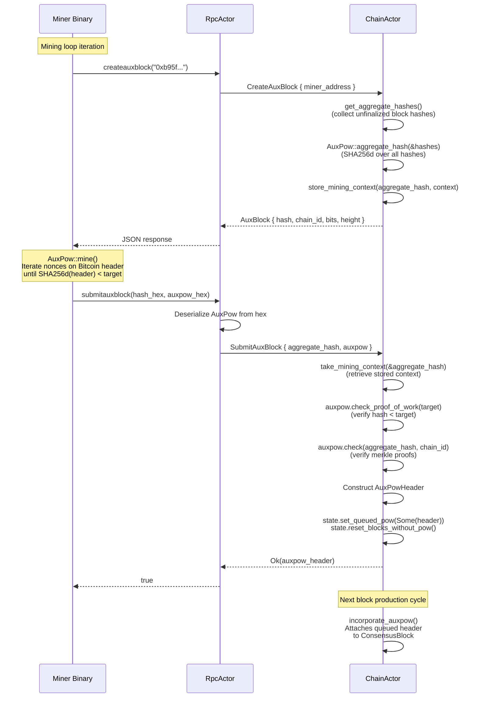
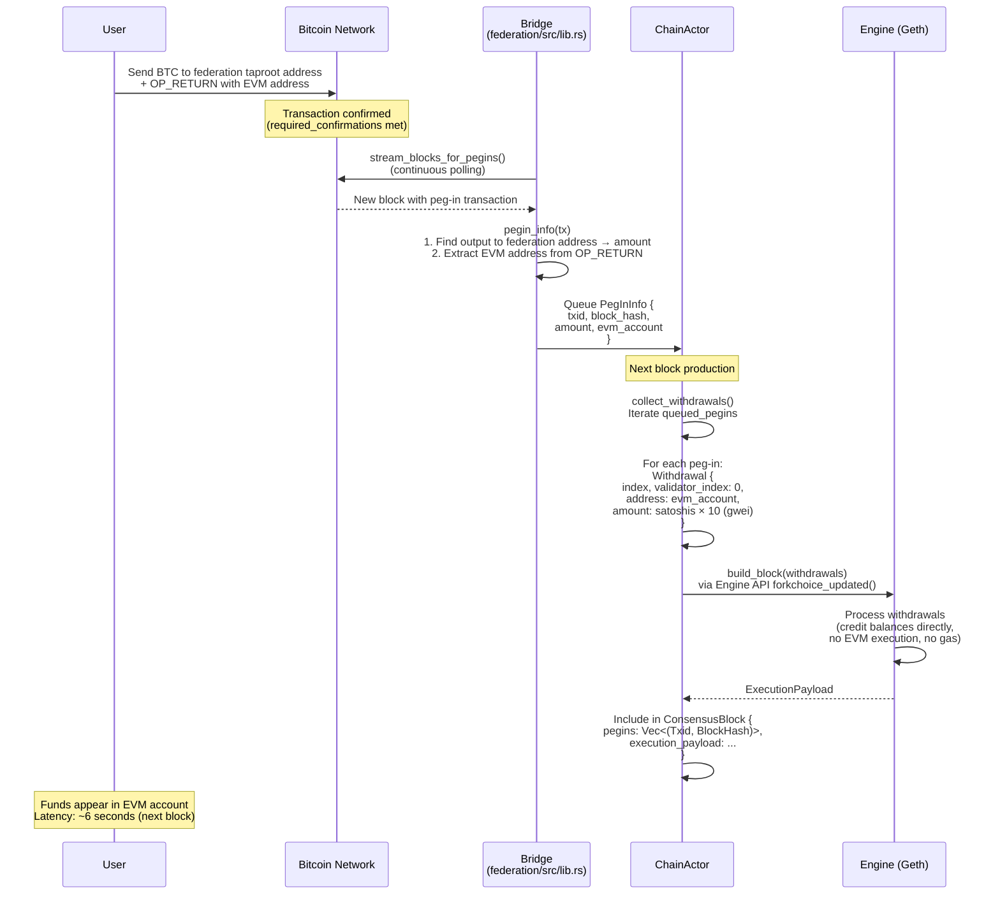
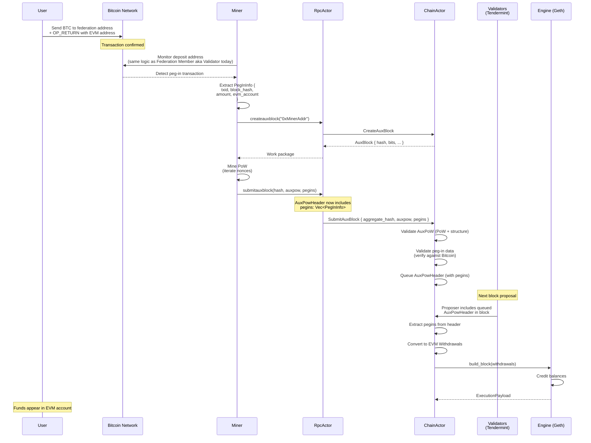

# Impact Analysis: Miner-Effectuated Peg-Ins

## Overview

New business requirements dictate that for AML/MTM legal reasons, **peg-ins must be effectuated by miners**. This means miners are responsible for monitoring the Bitcoin deposit address, detecting peg-in transactions, and including them as part of the AuxPoW header submitted via `submitauxblock`. This document explains the current system's mining and peg-in mechanics at a granular level, then describes what changes under the new requirement.

---

## 1. The PoW the Miner Performs

The miner performs **merge-mining** — a technique where Bitcoin's proof-of-work simultaneously secures a sidechain (Alys) without the miner doing extra computational work beyond what they'd already do for Bitcoin.

### What the Miner is Hashing

The miner is NOT hashing Alys blocks. It's creating a **synthetic Bitcoin block header** and iterating its nonce until the hash of that header meets a difficulty target. The trick is that this Bitcoin header *commits* to Alys data embedded in its coinbase transaction.

Looking at `AuxPow::mine()` in `app/src/auxpow.rs:394`:

```rust
pub async fn mine(sidechain_hash: BlockHash, target: CompactTarget, chain_id: u32) -> Self {
```

The `sidechain_hash` argument is the **aggregate hash** — a SHA256d hash over all unfinalized Alys block hashes. This is the Alys data being committed to. Here's what the function builds:

**Step 1: Create a coinbase transaction with a merged-mining header**

```rust
let transaction = Transaction {
    lock_time: Height::MIN,
    version: 0,
    input: vec![],
    output: vec![
        TxOut::default(),          // output[0]: empty
        TxOut::default(),          // output[1]: empty
        TxOut {                    // output[2]: merged-mining commitment
            value: 0,
            script_pubkey: MergedMiningHeader {
                magic: [0xfa, 0xbe, b'm', b'm'],  // "fabe6d6d" — the merge-mining marker
                block_hash: sidechain_hash,         // ← THE ALYS AGGREGATE HASH
                merkle_nonce: 0,
                merkle_size: 1,
            }.to_script_pub_key(),
        },
    ],
};
```

The magic bytes `0xfabe6d6d` are the Namecoin-originated merge-mining header convention. Any Bitcoin node (or verifier) can scan a coinbase transaction for these bytes and extract the sidechain commitment following them.

**Step 2: Create a Bitcoin block header whose merkle root commits to that coinbase**

```rust
let parent_block = Header {
    version: Version::from_consensus((1 as i32) * (1 << 16)),  // chain_id=1 (Bitcoin)
    bits: CompactTarget::from_consensus(0),
    merkle_root: TxMerkleNode::from_raw_hash(transaction.txid().to_raw_hash()),
    nonce: 0,          // ← THIS IS WHAT GETS ITERATED
    prev_blockhash: BlockHash::all_zeros(),
    time: 0,
};
```

The merkle root is the txid of the coinbase transaction, which contains the Alys aggregate hash. So the chain of commitment is:

```
Bitcoin header hash
    └─ commits to → merkle_root
        └─ which is → coinbase txid
            └─ which contains → merged-mining header (output[2])
                └─ which contains → sidechain_hash (Alys aggregate hash)
                    └─ which is → SHA256d(block_hash_1 || block_hash_2 || ... || block_hash_n)
```

**Step 3: Brute-force the nonce**

```rust
for nonce in 0..u32::MAX {
    tokio::task::yield_now().await;       // cooperative async yielding
    aux_pow.parent_block.nonce = nonce;
    if aux_pow.check_proof_of_work(target) {  // SHA256d(header) < target?
        aux_pow.check(sidechain_hash, chain_id).unwrap();  // sanity check
        return aux_pow;
    }
}
```

`check_proof_of_work()` (`auxpow.rs:387`) does:

```rust
pub fn check_proof_of_work(&self, bits: CompactTarget) -> bool {
    let diff_target = Target::from_compact(bits);
    diff_target.is_met_by(self.parent_block.block_hash())
}
```

This is exactly how Bitcoin mining works: `SHA256d(block_header) < target`. The lower the target, the harder it is to find a valid nonce. On testnet, the difficulty is set very low so mining completes in milliseconds to seconds.

### What the Resulting AuxPow Proof Contains

When mining succeeds, the `AuxPow` struct (`auxpow.rs:252`) captures everything needed for independent verification:

```rust
pub struct AuxPow {
    pub coinbase_txn: Transaction,       // The coinbase containing the merge-mining header
    pub block_hash: BlockHash,           // Hash of the parent block
    pub coinbase_branch: MerkleBranch,   // Merkle proof: coinbase → parent block's merkle root
    pub blockchain_branch: MerkleBranch, // Merkle proof: sidechain → merged-mining tree root
    pub parent_block: Header,            // The Bitcoin block header (contains the valid nonce)
}
```

A verifier can reconstruct the entire chain of commitment:

1. Check the parent block header hash meets the difficulty target (PoW is valid)
2. Verify the coinbase transaction is in the parent block (via `coinbase_branch` merkle proof)
3. Extract the merged-mining header from the coinbase
4. Verify the sidechain hash matches the expected aggregate hash (via `blockchain_branch`)

### Visual Summary

```
┌─────────────────────────────────────────────────────────────────────┐
│                     MERGE-MINING PROOF STRUCTURE                     │
├─────────────────────────────────────────────────────────────────────┤
│                                                                     │
│   Bitcoin Block Header (parent_block)                               │
│   ┌───────────────────────────────────────────────────────────┐     │
│   │  version: 0x00010000 (chain_id=1, Bitcoin)                │     │
│   │  prev_blockhash: 0x0000...                                │     │
│   │  merkle_root: SHA256d(coinbase_txn) ──────────────────┐   │     │
│   │  time: 0                                              │   │     │
│   │  bits: 0x00000000                                     │   │     │
│   │  nonce: 0x???????? ← iterated until hash < target     │   │     │
│   └───────────────────────────────────────────────────────┘   │     │
│                                                    │              │
│   SHA256d(header) must be < difficulty target       │              │
│                                                    │              │
│   Coinbase Transaction (coinbase_txn)              │              │
│   ┌────────────────────────────────────────────────▼──────┐       │
│   │  output[0]: (empty)                                   │       │
│   │  output[1]: (empty)                                   │       │
│   │  output[2]: script_pubkey contains:                   │       │
│   │    ┌──────────────────────────────────────────────┐   │       │
│   │    │  magic:       0xfabe6d6d                     │   │       │
│   │    │  block_hash:  <Alys aggregate hash> ─────┐   │   │       │
│   │    │  merkle_size: 1                          │   │   │       │
│   │    │  merkle_nonce: 0                         │   │   │       │
│   │    └──────────────────────────────────────────┘   │   │       │
│   └───────────────────────────────────────────────────┘   │       │
│                                                    │              │
│   Alys Aggregate Hash                              │              │
│   ┌────────────────────────────────────────────────▼──────┐       │
│   │  SHA256d(                                             │       │
│   │    block_hash_1 || block_hash_2 || ... || block_hash_n│       │
│   │  )                                                    │       │
│   │                                                       │       │
│   │  Commits to ALL unfinalized Alys blocks in one hash.  │       │
│   └───────────────────────────────────────────────────────┘       │
│                                                                     │
└─────────────────────────────────────────────────────────────────────┘
```

---

## 2. `createauxblock` and `submitauxblock`

These are two RPC endpoints that implement the mining pool protocol. They mirror Namecoin's merged-mining interface.

### `createauxblock` — "Give me work to mine"

The miner calls this to get a work package. Here's the full call chain:

```
Miner binary (crates/miner/src/main.rs:31-37)
    │
    │  HTTP JSON-RPC: createauxblock("0xb95f80EC665a534b1e309a2a24F8849d27B70FDE")
    │                                  └─ miner's EVM address for fee payment
    ▼
RpcActor (rpc/actor.rs:180)
    │  routes to CreateAuxBlockHandler
    ▼
CreateAuxBlockHandler::handle() (rpc/handlers.rs:32)
    │  parses miner_address from params[0]
    │  sends CreateAuxBlock message to ChainActor
    ▼
ChainActor::handle(CreateAuxBlock) (chain/handlers.rs:2370)
    │  delegates to create_aux_block_helper()
    ▼
ChainActor::create_aux_block() (chain/auxpow.rs:489)
```

Inside `create_aux_block()`, four things happen:

**1. Collect unfinalized block hashes** (`auxpow.rs:505`)

```rust
let hashes = self.get_aggregate_hashes().await?;
```

This returns all block hashes since the last AuxPoW checkpoint from the block hash cache.

**2. Compute the aggregate hash** (`auxpow.rs:508`)

```rust
let aggregate_hash = AuxPow::aggregate_hash(&hashes);
```

`aggregate_hash()` (`auxpow.rs:301`) concatenates all block hashes and SHA256d's them:

```rust
pub(crate) fn aggregate_hash(hashes: &[BlockHash]) -> BlockHash {
    let mut engine = BlockHash::engine();
    hashes.iter()
        .map(|hash| BlockHash::consensus_encode(hash, &mut engine))
        .collect::<Result<Vec<_>, _>>()
        .expect("engines don't error");
    BlockHash::from_engine(engine)
}
```

This produces a single hash that commits to the entire sequence of unfinalized blocks.

**3. Store a mining context** (`auxpow.rs:533-552`)

```rust
let mining_context = MiningContext {
    issued_at: SystemTime::now(),
    last_hash: self.state.get_head_hash(),
    start_hash: hashes.first(),   // first unfinalized block
    end_hash: hashes.last(),      // last unfinalized block
    miner_address,                // who to pay fees to
    bits: bits_u32,               // difficulty target
    height: target_height,
};
self.state.store_mining_context(aggregate_hash, mining_context).await;
```

This is stored so that when `submitauxblock` arrives later, the chain can look up: "for this aggregate hash, what was the expected block range, difficulty, and miner address?"

**4. Return the AuxBlock** (`auxpow.rs:561-568`)

```rust
AuxBlock::new(
    aggregate_hash,       // The hash the miner must embed in its Bitcoin coinbase
    chain_id,             // 1337 (Alys chain ID)
    previous_block_hash,  // First unfinalized block hash
    0,                    // coinbase_value: always 0 (no coinbase reward on Alys)
    bits,                 // Difficulty target the miner must meet
    target_height,        // Height after all unfinalized blocks are covered
)
```

The miner receives this as JSON and knows: "I need to find a Bitcoin block header whose hash is below `bits`, where the coinbase commits to `aggregate_hash`."

### What the Miner Does With the Work Package

The miner binary (`crates/miner/src/main.rs:29-61`) is a simple loop:

```rust
async fn try_mine(args: &Args) -> Result<(), Error> {
    let client = Client::simple_http(&args.url, None, None).unwrap();

    // 1. Request work
    let aux_block = call::<AuxBlock>(&client, "createauxblock", &[json!(miner_address)])?;

    // 2. Mine (brute-force nonce until PoW target is met)
    let auxpow = AuxPow::mine(aux_block.hash, aux_block.bits, aux_block.chain_id).await;

    // 3. Serialize the completed proof
    let mut encoded_auxpow = Vec::new();
    auxpow.consensus_encode(&mut encoded_auxpow).unwrap();
    let stringified_auxpow = hex::encode(encoded_auxpow);

    // 4. Serialize the aggregate hash
    let mut encoded_auxpow_hash = Vec::new();
    aux_block.hash.consensus_encode(&mut encoded_auxpow_hash).unwrap();
    let stringified_aux_hash = hex::encode(encoded_auxpow_hash);

    // 5. Submit the proof
    let result = call::<bool>(
        &client,
        "submitauxblock",
        &[json!(stringified_aux_hash), json!(stringified_auxpow)],
    )?;

    Ok(())
}
```

The outer loop (`main.rs:20-27`) sleeps 1 second between iterations.

### `submitauxblock` — "Here is my completed work"

After mining, the miner submits the proof. Here's the full call chain:

```
Miner binary (crates/miner/src/main.rs:53-57)
    │
    │  HTTP JSON-RPC: submitauxblock(aggregate_hash_hex, auxpow_hex)
    │
    ▼
RpcActor (rpc/actor.rs:181)
    │  routes to SubmitAuxBlockHandler
    ▼
SubmitAuxBlockHandler::handle() (rpc/handlers.rs:101)
    │  1. Parses aggregate_hash from params[0] (hex string → BlockHash)
    │  2. Parses auxpow_hex from params[1] (hex → bytes)
    │  3. Deserializes AuxPow via Bitcoin's Decodable trait
    │  4. Sends SubmitAuxBlock message to ChainActor
    ▼
ChainActor::handle(SubmitAuxBlock) (chain/handlers.rs:2414)
    │  delegates to submit_aux_block_helper()
    ▼
ChainActor::validate_submitted_auxpow() (chain/auxpow.rs:203)
```

Inside `validate_submitted_auxpow()`, four validation steps happen:

**1. Retrieve stored mining context** (`auxpow.rs:217-228`)

```rust
let context = self.state.take_mining_context(&aggregate_hash).await
    .ok_or(ChainError::AuxPowValidation("Unknown block hash"))?;
```

If the aggregate hash doesn't match any previously issued work from `createauxblock`, the submission is rejected.

**2. Validate proof of work** (`auxpow.rs:239-249`)

```rust
let compact_target = CompactTarget::from_consensus(context.bits);
if !auxpow.check_proof_of_work(compact_target) {
    return Err(ChainError::AuxPowValidation("Insufficient proof of work"));
}
```

The mined Bitcoin header hash must be below the difficulty target that was issued.

**3. Validate AuxPow structure** (`auxpow.rs:258-269`)

```rust
auxpow.check(aggregate_hash, chain_id)?;
```

`AuxPow::check()` (`auxpow.rs:311-371`) verifies the full cryptographic proof chain:

- Parent block doesn't have the same chain ID as Alys (prevents self-referencing)
- Blockchain merkle branch isn't unreasonably long
- Coinbase merkle branch correctly links the coinbase txn to the parent block's merkle root
- The merged-mining header in the coinbase contains the correct aggregate hash
- The merkle size and index are consistent

**4. Construct validated AuxPowHeader** (`auxpow.rs:277-285`)

```rust
let auxpow_header = AuxPowHeader {
    range_start: context.start_hash.to_block_hash(),
    range_end: context.end_hash.to_block_hash(),
    bits: context.bits,
    chain_id,
    height: context.height,
    auxpow: Some(auxpow),           // The completed proof
    fee_recipient: context.miner_address,
};
```

Back in the handler (`handlers.rs:2448`), the validated header is queued:

```rust
state.set_queued_pow(Some(auxpow_header.clone()));
state.reset_blocks_without_pow();
```

The next time a block is produced, `incorporate_auxpow()` (`chain/auxpow.rs:22`) checks for `state.queued_pow` and attaches it to the `ConsensusBlock`.

### Complete Sequence Diagram



---

## 3. Full End-to-End Lifecycle of a Peg-In

### Current System (Bridge-Detected Peg-Ins)



### Step-by-Step Code Walkthrough

**Step 1-2: User deposits BTC**

The user constructs a Bitcoin transaction with two relevant outputs:

- **Output to the federation taproot address**: The BTC amount being pegged in
- **OP_RETURN output**: Contains the user's EVM address (20 bytes) where funds should appear on Alys

**Step 3: Bridge detects the deposit**

`Bridge::stream_blocks_for_pegins()` in `crates/federation/src/lib.rs:107` continuously polls Bitcoin blocks. For each block, it calls `pegin_info()` (`lib.rs:211`) on every transaction:

```rust
fn pegin_info(&self, tx: &Transaction, block_hash: BlockHash, block_height: u32)
    -> Option<PegInInfo>
{
    // Find the output paying to the federation address
    let amount = tx.output.iter()
        .find(|output| {
            self.pegin_addresses.iter()
                .any(|addr| addr.matches_script_pubkey(&output.script_pubkey))
        })
        .map(|x| x.value)?;

    // Extract EVM address from OP_RETURN output
    let evm_account = tx.output.iter().find_map(extract_evm_address)?;

    Some(PegInInfo { txid: tx.txid(), block_hash, block_height, amount, evm_account })
}
```

**Step 4: Queue the peg-in**

The detected peg-in is inserted into `queued_pegins: BTreeMap<Txid, PegInInfo>` — a map held in ChainActor state, keyed by Bitcoin transaction ID.

**Step 5-6: Block producer converts peg-ins to EVM withdrawals**

During block production, `collect_withdrawals()` in `actors_v2/chain/withdrawals.rs:207` iterates over queued peg-ins:

```rust
for (txid, pegin_info) in &queued_pegins_snapshot {
    if self.validate_pegin_for_withdrawal(pegin_info).await? {
        let withdrawal = Withdrawal {
            index: withdrawals.len() as u64,
            validator_index: 0,              // not used in Alys
            address: pegin_info.evm_account,  // user's EVM address
            amount: ConsensusAmount::from_satoshi(pegin_info.amount).0,
        };
        withdrawals.push(withdrawal);
    }
}
```

`ConsensusAmount::from_satoshi()` (`engine.rs:39`) converts: `satoshis × 10 = gwei`. So 1 BTC (100,000,000 satoshis) becomes 1,000,000,000 gwei.

**Step 7-8: Geth executes the withdrawals**

The withdrawals vector is included in the `PayloadAttributes` sent to Geth's Engine API via `forkchoice_updated()`. Geth processes each withdrawal by directly crediting the target address's balance — no EVM execution, no gas consumption, no possibility of revert. This is the [Ethereum Capella withdrawal mechanism](https://eth2book.info/capella/part2/deposits-withdrawals/withdrawal-processing/).

**Step 9: Funds appear**

The user's EVM address now has a balance corresponding to the deposited BTC amount.

---

## 4. What Changes With Miner-Effectuated Peg-Ins

Under the new requirement, the Bridge's role in detecting peg-ins moves to the Miner, and peg-in data travels inside the AuxPoW header.

### New Flow



### Three Architectural Consequences

#### Consequence 1: AuxPowHeader Must Be Extended

The current `AuxPowHeader` struct (`block.rs:35-50`) has no peg-in field:

```rust
pub struct AuxPowHeader {
    pub range_start: Hash256,
    pub range_end: Hash256,
    pub bits: u32,
    pub chain_id: u32,
    pub height: u64,
    pub auxpow: Option<AuxPow>,
    pub fee_recipient: Address,
    // ← NO PEG-IN DATA
}
```

It needs to be extended with something like:

```rust
pub struct AuxPowHeader {
    pub range_start: Hash256,
    pub range_end: Hash256,
    pub bits: u32,
    pub chain_id: u32,
    pub height: u64,
    pub auxpow: Option<AuxPow>,
    pub fee_recipient: Address,
    /// Peg-in transactions attested by this miner (NEW)
    pub pegins: Vec<PegInInfo>,
}
```

#### Consequence 2: The Miner Must Monitor Bitcoin

The miner binary (`crates/miner/src/main.rs`) currently does nothing but PoW — it's 82 lines that loop between `createauxblock` and `submitauxblock`. It must now also run Bitcoin monitoring logic that currently lives in `crates/federation/src/lib.rs`:

- `Bridge::stream_blocks_for_pegins()` — continuous Bitcoin block polling
- `Bridge::pegin_info()` — scanning transactions for deposits to the federation taproot address and extracting the EVM address from OP_RETURN

The miner needs access to a Bitcoin RPC endpoint and knowledge of the federation deposit address(es).

#### Consequence 3: Peg-In Processing Rate is Bounded by Mining Frequency

This is the most consequential change. Currently, Validators detect a deposit and it can be included in the **very next Alys block** (~6 seconds). Under the new model, a peg-in must wait for:

1. The miner to detect the Bitcoin deposit
2. The miner to call `createauxblock` (or have a recent work package)
3. The miner to find a valid nonce (PoW mining time — depends on difficulty)
4. The miner to call `submitauxblock` (with the peg-in data)
5. The next proposer to include the queued AuxPoW header in a block

```
Mining frequency vs Peg-in latency:

  Every block (~6s):       Peg-in latency ≈ 6s + mining time
                           Mining overhead: Very high
                           PoW difficulty: Must be very low

  Every 10 blocks (~1m):   Peg-in latency ≈ 1-2 minutes
                           Mining overhead: High
                           PoW difficulty: Low

  Every 100 blocks (~10m): Peg-in latency ≈ 5-10 minutes
                           Mining overhead: Moderate
                           PoW difficulty: Moderate

  Every 500 blocks (~50m): Peg-in latency ≈ 25-50 minutes
                           Mining overhead: Low
                           PoW difficulty: Higher
```

The miner crate currently loops with a 1-second sleep between iterations (`main.rs:25`), so the miner polls for new work every ~1 second. Mining time depends on difficulty (testnet: milliseconds; mainnet: could be minutes). Minimum peg-in latency under the new model is roughly: `detection_time + mining_time + next_block_time`.

**This third point is the critical factor that differentiates the AuxPoW-Tendermint integration approaches.** Any approach that makes AuxPoW submissions infrequent (e.g., only at epoch boundaries) directly increases peg-in latency. Any approach that keeps AuxPoW frequent keeps peg-in latency low but increases mining overhead.

---

## 5. Current vs New: Side-by-Side Comparison

| Dimension | Current System | New System |
|-----------|---------------|------------|
| **Who detects peg-ins** | Bridge (federation crate) | Miner |
| **How peg-ins travel** | Queued directly in ChainActor state | Embedded in AuxPowHeader |
| **When peg-ins are processed** | Every block (~6s) | When miner submits AuxPoW header |
| **Peg-in latency** | ~6 seconds | Mining time + next block |
| **Mining pool outage impact on peg-ins** | None (peg-ins independent of mining) | All peg-ins halt |
| **AuxPowHeader carries peg-in data** | No | Yes |
| **Miner needs Bitcoin RPC access** | No | Yes |
| **Validator peg-in verification** | Implicit (Bridge already verified) | Must independently verify against Bitcoin |

---

*Analysis Version: 1.0*
*Last Updated: January 2026*
