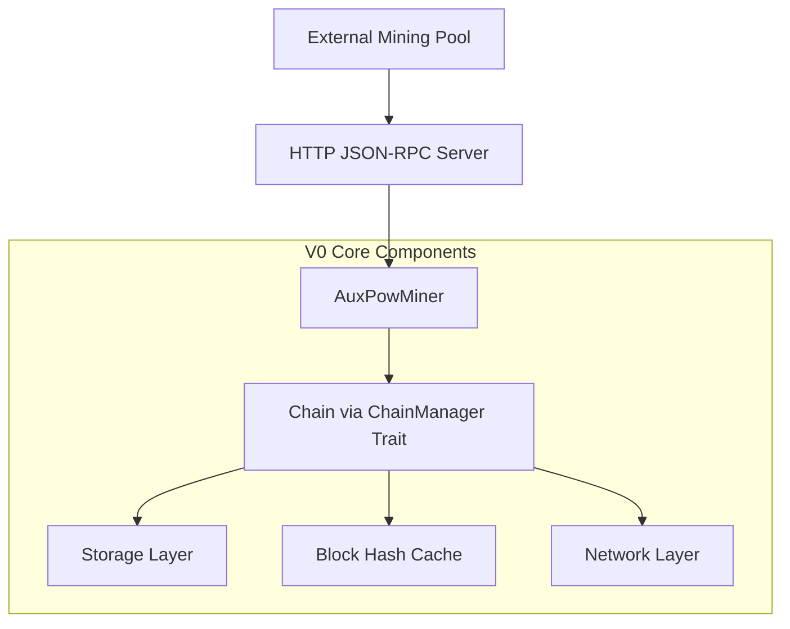
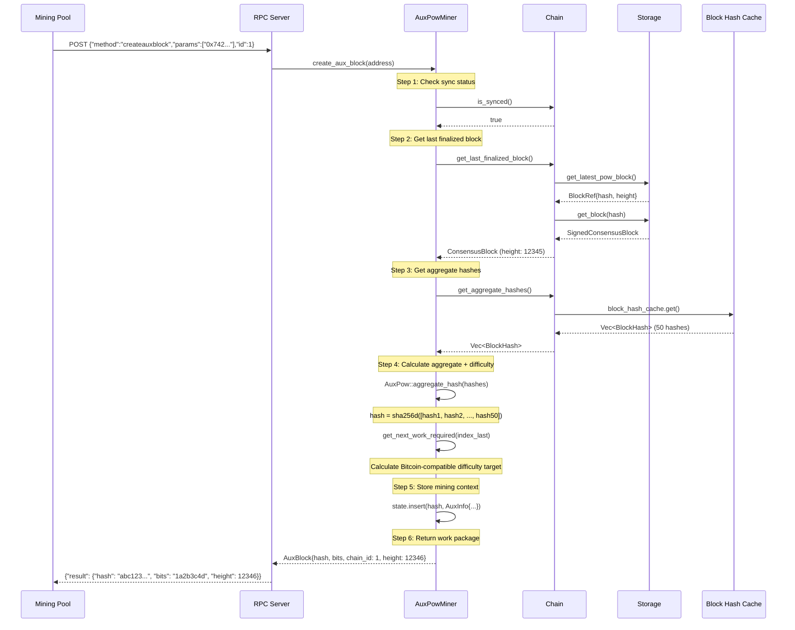
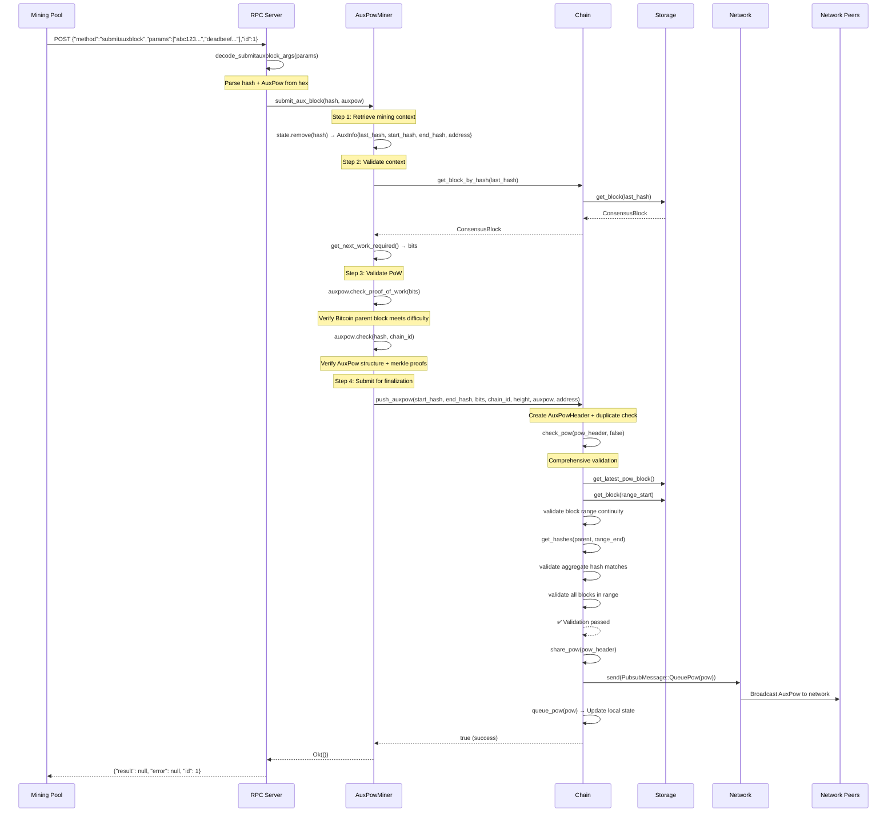

# V0 `create_aux_block` and `submit_aux_block`: Complete End-to-End Analysis

## Overview: External Mining Pool Integration

V0 provides Bitcoin-compatible RPC endpoints for external mining pools to perform merged mining with Alys. The process involves two key operations:

1. **`createauxblock`**: Mining pools request work packages from Alys
2. **`submitauxblock`**: Mining pools submit completed proof-of-work solutions

## Architecture Components



## Part 1: `create_aux_block` - Work Package Generation

### RPC Entry Point (rpc.rs:186-230)

```rust
// External mining pool calls: curl -X POST -d '{"method":"createauxblock","params":["0x742d35Cc6634C0532925a3b8D2C7BFcb39db4D8e"],"id":1}'
"createauxblock" => {
    // Parse mining address parameter
    let [script_pub_key] = serde_json::from_str::<[EvmAddress; 1]>(params.get())?;

    // Call AuxPowMiner directly
    match miner.create_aux_block(script_pub_key).await {
        Ok(aux_block) => {
            // Return work package to mining pool
            JsonRpcResponseV1 {
                result: Some(json!(aux_block)), // AuxBlock with hash, difficulty, etc.
                error: None,
                id,
            }
        }
        Err(e) => // Handle chain syncing or other errors
    }
}
```

### AuxPowMiner Implementation (auxpow_miner.rs:357-419)

The `create_aux_block` method follows this precise sequence:

```rust
pub async fn create_aux_block(&mut self, address: EvmAddress) -> Result<AuxBlock> {
    // Step 1: Verify chain is synchronized
    if !self.chain.is_synced().await {
        return Err(Error::ChainSyncing.into());
    }

    // Step 2: Get the last finalized block (baseline for work)
    let index_last = self.chain.get_last_finalized_block();

    // Step 3: Get unfinalized block hashes for aggregate calculation
    let hashes = self.chain.get_aggregate_hashes().await?;

    // Step 4: Calculate aggregate hash (vector commitment)
    let hash = AuxPow::aggregate_hash(&hashes);

    // Step 5: Store mining context for later submission validation
    self.state.insert(hash, AuxInfo {
        last_hash: index_last.block_hash(),
        start_hash: *hashes.first()?,
        end_hash: *hashes.last()?,
        address,
    });

    // Step 6: Calculate difficulty target
    let bits = self.get_next_work_required(&index_last)?;

    // Step 7: Return work package
    Ok(AuxBlock {
        hash,                                    // Aggregate hash to mine
        chain_id: index_last.chain_id(),        // Chain identifier (1)
        previous_block_hash: index_last.block_hash(),
        coinbase_value: 0,
        bits,                                    // Difficulty target
        height: index_last.height() + 1,
        _target: bits.into(),
    })
}
```

### Chain Integration via ChainManager Trait

#### get_aggregate_hashes() (chain.rs:2552-2579)

```rust
async fn get_aggregate_hashes(&self) -> Result<Vec<BlockHash>> {
    // Get current chain head
    let head = self.head.read().await.as_ref()?.hash;

    // Check if there's pending work
    let queued_pow = self.queued_pow.read().await;
    let has_work = queued_pow.as_ref()
        .map(|pow| pow.range_end != head)  // New blocks since last AuxPow?
        .unwrap_or(true);

    if !has_work {
        Err(NoWorkToDo.into())
    } else {
        // Return cached block hashes for aggregate calculation
        if let Some(ref block_hash_cache) = self.block_hash_cache {
            Ok(block_hash_cache.read().await.get())
        } else {
            Err(eyre!("Block hash cache is not initialized"))
        }
    }
}
```

#### get_last_finalized_block() (chain.rs:2581-2587)

```rust
fn get_last_finalized_block(&self) -> ConsensusBlock<MainnetEthSpec> {
    // Get the most recent block with AuxPow (finalized)
    match self.storage.get_latest_pow_block() {
        Ok(Some(x)) => self.storage.get_block(&x.hash).unwrap().unwrap().message,
        _ => unreachable!("Should always have AuxPow"),
    }
}
```

### Complete create_aux_block Flow



**Example AuxBlock Response:**
```json
{
  "result": {
    "hash": "df8be27164c84d325c77ef9383abf47c0c7ff06c66ccda3447b585c50872d010",
    "chainid": 1,
    "previousblockhash": "0f9188f13cb7b2c71f2a335e3a4fc328bf5beb436012afca590b1a11466e2206",
    "coinbasevalue": 0,
    "bits": "207fffff",
    "height": 12346
  }
}
```

## Part 2: `submit_aux_block` - Solution Validation & Finalization

### RPC Entry Point (rpc.rs:232-272)

```rust
"submitauxblock" => {
    // Parse hash and auxpow hex parameters
    let (hash, auxpow) = decode_submitauxblock_args(params.get())?;

    // Validate and finalize via AuxPowMiner
    miner.submit_aux_block(hash, auxpow).await?;

    // Return success (Bitcoin RPC compatibility)
    JsonRpcResponseV1 {
        result: Some(json!(())),  // Empty result = success
        error: None,
        id,
    }
}

fn decode_submitauxblock_args(encoded: &str) -> Result<(BlockHash, AuxPow)> {
    let (blockhash_str, auxpow_str) = serde_json::from_str::<(String, String)>(encoded)?;
    let blockhash_bytes = hex::decode(&blockhash_str)?;
    let blockhash = BlockHash::consensus_decode(&mut blockhash_bytes.as_slice())?;
    let auxpow_bytes = hex::decode(&auxpow_str)?;
    let auxpow = AuxPow::consensus_decode(&mut auxpow_bytes.as_slice())?;
    Ok((blockhash, auxpow))
}
```

### AuxPowMiner Validation (auxpow_miner.rs:428-494)

```rust
pub async fn submit_aux_block(&mut self, hash: BlockHash, auxpow: AuxPow) -> Result<()> {
    // Step 1: Retrieve stored mining context
    let AuxInfo { last_hash, start_hash, end_hash, address } =
        self.state.remove(&hash).ok_or_else(|| eyre!("Unknown block"))?;

    // Step 2: Validate context is still valid
    let index_last = self.chain.get_block_by_hash(&last_hash)?;
    let bits = self.get_next_work_required(&index_last)?;
    let chain_id = index_last.chain_id();

    // Step 3: Validate proof of work
    if !auxpow.check_proof_of_work(bits) {
        return Err(eyre!("POW is not valid"));
    }

    // Step 4: Validate AuxPow structure
    if auxpow.check(hash, chain_id).is_err() {
        return Err(eyre!("AuxPow is not valid"));
    }

    // Step 5: Submit to chain for finalization
    self.chain.push_auxpow(
        start_hash,     // Range start
        end_hash,       // Range end
        bits.to_consensus(),
        chain_id,
        index_last.height() + 1,
        auxpow,
        address,
    ).await;

    Ok(())
}
```

### Chain Finalization Process

#### push_auxpow() (chain.rs:2607-2632)

```rust
async fn push_auxpow(/*8 parameters*/) -> bool {
    // Step 1: Create AuxPowHeader structure
    let pow = AuxPowHeader {
        range_start: start_hash.to_block_hash(),
        range_end: end_hash.to_block_hash(),
        bits,
        chain_id,
        height,
        auxpow: Some(auxpow),
        fee_recipient: address,
    };

    // Step 2: Check for duplicate submissions
    if self.queued_pow.read().await.as_ref().is_some_and(|prev| {
        prev.range_start.eq(&pow.range_start) && prev.range_end.eq(&pow.range_end)
    }) {
        return false;
    }

    // Step 3: Comprehensive validation + network broadcasting
    self.check_pow(&pow, false).await.is_ok() && self.share_pow(pow).await.is_ok()
}
```

#### check_pow() Validation (chain.rs:1293-1352+)

This is the most complex validation step:

```rust
async fn check_pow(&self, header: &AuxPowHeader, pow_override: bool) -> Result<(), Error> {
    // Step 1: Get validation baselines
    let last_pow_block_ref = self.storage.get_latest_pow_block()?.unwrap();
    let last_finalized = self.get_latest_finalized_block_ref()?.ok_or(Error::MissingBlock)?;

    // Step 2: Validate block range continuity
    let range_start_block = self.storage.get_block(&header.range_start)?;
    if range_start_block.message.parent_hash != last_finalized.hash {
        return Err(Error::InvalidPowRange); // Chain continuity broken
    }

    // Step 3: Recreate and validate hash range
    let hashes = self.get_hashes(range_start_block.message.parent_hash, header.range_end)?;
    let expected_hash = AuxPow::aggregate_hash(&hashes);
    let submitted_hash = header.auxpow.as_ref().unwrap().get_hash();

    if expected_hash != submitted_hash {
        return Err(Error::InvalidAggregateHash);
    }

    // Step 4: Validate all blocks in range
    for block_hash in &hashes {
        let block = self.storage.get_block(block_hash)?;
        // Validate block structure, execution payload, peg operations, etc.
    }

    // Step 5: Validate proof of work meets difficulty
    if !header.auxpow.as_ref().unwrap().check_proof_of_work(header.bits.into()) {
        return Err(Error::InvalidProofOfWork);
    }

    Ok(())
}
```

#### share_pow() Broadcasting (chain.rs:1283-1291)

```rust
pub async fn share_pow(&self, pow: AuxPowHeader) -> Result<(), Error> {
    // Step 1: Broadcast to network peers
    let _ = self.network.send(PubsubMessage::QueuePow(pow.clone())).await;

    // Step 2: Queue locally for block production
    self.queue_pow(pow).await;

    Ok(())
}
```

### Complete submit_aux_block Flow



## Key Data Structures

### AuxBlock (Work Package)
```rust
pub struct AuxBlock {
    pub hash: BlockHash,              // Aggregate hash to mine (target)
    pub chain_id: u32,               // Always 1 for Alys
    pub previous_block_hash: BlockHash, // Last finalized block
    pub coinbase_value: u64,         // Always 0 (no direct coinbase)
    pub bits: CompactTarget,         // Difficulty target
    pub height: u64,                 // Next block height
    pub _target: Target,             // Expanded difficulty target
}
```

### AuxPowHeader (Final Result)
```rust
pub struct AuxPowHeader {
    pub range_start: Hash256,        // First block in range
    pub range_end: Hash256,          // Last block in range
    pub bits: u32,                   // Difficulty used
    pub chain_id: u32,               // Chain identifier
    pub height: u64,                 // Block height
    pub auxpow: Option<AuxPow>,      // Proof of work solution
    pub fee_recipient: Address,      // Mining reward address
}
```

### Mining State (AuxInfo)
```rust
struct AuxInfo {
    last_hash: BlockHash,    // Context validation
    start_hash: BlockHash,   // Block range start
    end_hash: BlockHash,     // Block range end
    address: EvmAddress,     // Miner address
}
```

## Critical V0 Design Insights

1. **State Management**: `AuxPowMiner` maintains a `BTreeMap<BlockHash, AuxInfo>` to track active mining work and validate submissions.

2. **Aggregate Hash Concept**: Multiple unfinalized blocks are combined into a single hash target using `AuxPow::aggregate_hash()` - this allows mining one hash that finalizes multiple Alys blocks.

3. **Block Range Validation**: The system ensures continuity by validating that `range_start.parent_hash == last_finalized.hash`, preventing gaps or forks.

4. **Two-Stage Validation**:
   - **AuxPowMiner**: Basic PoW validation (`check_proof_of_work`, `auxpow.check`)
   - **Chain**: Comprehensive validation (`check_pow` with full block range validation)

5. **Network Integration**: Successful AuxPow submissions are immediately broadcast to peers via `share_pow()` and queued for local block production.

6. **Bitcoin Compatibility**: The RPC interface exactly matches Bitcoin's merged mining API, allowing existing mining pools to work without modification.

## Performance Characteristics

- **create_aux_block**: Fast (~1-10ms) - mostly cache lookups and hash calculations
- **submit_aux_block**: Moderate (~50-200ms) - includes comprehensive validation and network broadcast
- **Concurrency**: Thread-safe via `Arc<Mutex<AuxPowMiner>>` but serialized access
- **Memory**: Minimal state (just active mining contexts in `BTreeMap`)

This V0 implementation is **proven in production** and successfully handles external mining pool integration while maintaining blockchain security and consensus integrity.