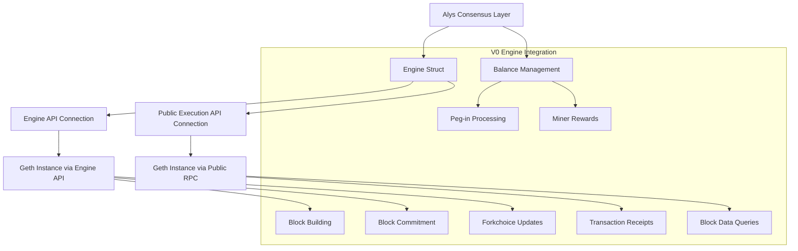
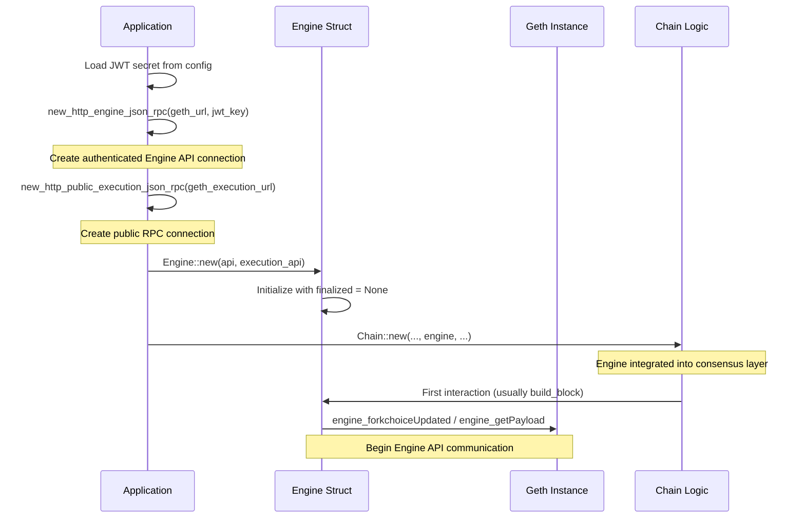
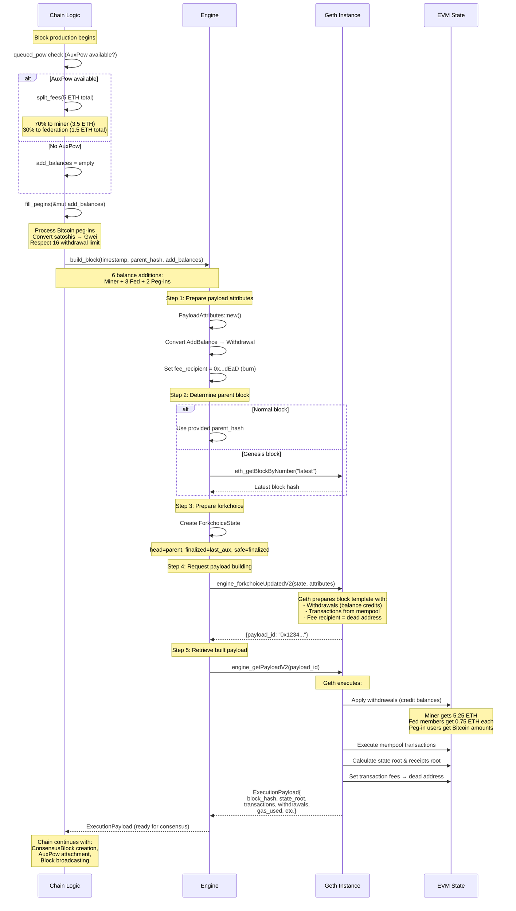
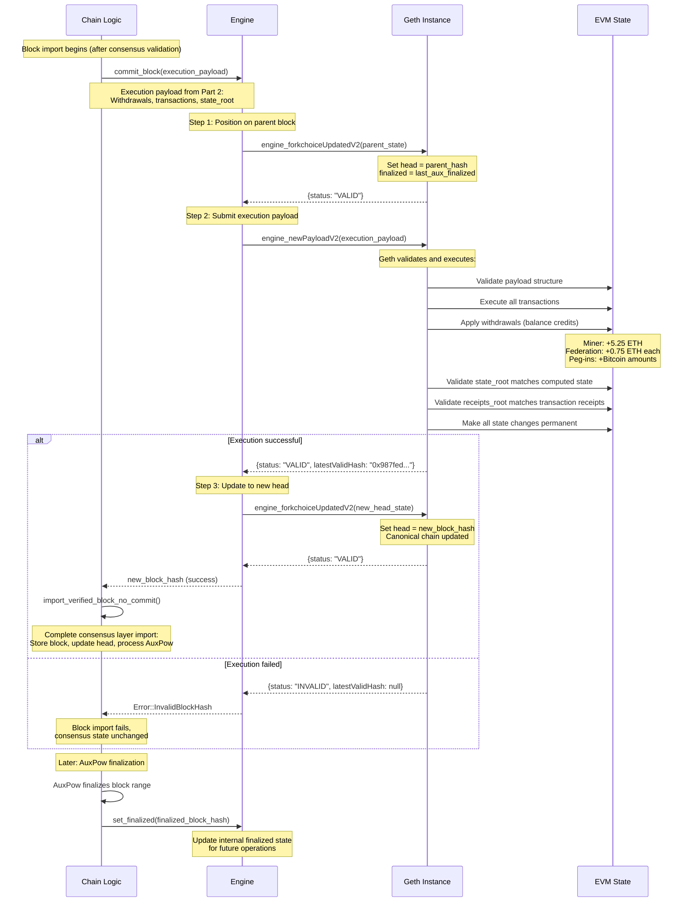

# V0 Execution Engine: Complete EVM Integration Analysis

## Overview: Ethereum Virtual Machine Integration

**The Execution Engine** is Alys V0's critical component that integrates Ethereum's execution layer (EVM) with the custom consensus layer. It enables smart contract execution, transaction processing, and state management while maintaining compatibility with Ethereum tooling.

**Key Functions**:
1. **Block Building**: Create execution payloads with transactions and state changes
2. **Block Commitment**: Finalize executed blocks and update the execution layer state
3. **Balance Management**: Handle peg-in withdrawals and miner/federation rewards
4. **State Queries**: Retrieve transaction receipts and block data from the execution layer

**Architecture**: The engine communicates with a Geth (go-ethereum) instance via the Engine API (JSON-RPC over HTTP with JWT authentication).

## Architecture Components



## Core Data Structures

### Engine Structure (engine.rs:78-82)
```rust
pub struct Engine {
    pub api: HttpJsonRpc,                           // Authenticated Engine API connection
    pub execution_api: HttpJsonRpc,                 // Public RPC connection for queries
    finalized: RwLock<Option<ExecutionBlockHash>>,  // Last finalized execution block
}
```

### Balance Management (engine.rs:30-56)
```rust
#[derive(Debug, Default, Clone)]
pub struct ConsensusAmount(pub u64); // Gwei = 1e9

impl ConsensusAmount {
    pub fn from_wei(amount: Uint256) -> Self {
        // Convert Wei to Gwei (divide by 10^9)
        Self(amount.div(10u32.pow(9)).try_into().unwrap())
    }

    pub fn from_satoshi(amount: u64) -> Self {
        // Convert satoshi to Gwei: 1 satoshi = 10 Gwei
        Self(amount.mul(10))
    }
}

pub struct AddBalance(Address, ConsensusAmount);
```

The `ConsensusAmount` structure handles conversions between different monetary units:
- **Wei**: Ethereum's smallest unit (10^-18 ETH)
- **Gwei**: Consensus layer unit (10^-9 ETH)
- **Satoshi**: Bitcoin's smallest unit, used for peg-ins

### Withdrawal Structure (engine.rs:65-74)
```rust
impl From<AddBalance> for Withdrawal {
    fn from(value: AddBalance) -> Self {
        Withdrawal {
            index: 0,                  // Sequential index
            validator_index: 0,        // Not used in Alys
            address: value.0,          // EVM address to credit
            amount: (value.1).0,       // Amount in Gwei
        }
    }
}
```

## Part 1: Engine Initialization and Configuration

### Engine Creation (engine.rs:84-91 + app.rs:197-201)

The Engine is initialized with two separate RPC connections:

```rust
impl Engine {
    pub fn new(api: HttpJsonRpc, execution_api: HttpJsonRpc) -> Self {
        Self {
            api,                        // Authenticated Engine API for consensus operations
            execution_api,              // Public RPC for data queries
            finalized: Default::default(), // No finalized block initially
        }
    }
}

// Application initialization (app.rs:197-201)
let http_engine_json_rpc = new_http_engine_json_rpc(
    self.geth_url,
    JwtKey::from_slice(&self.jwt_secret).unwrap()
);
let public_execution_json_rpc = new_http_public_execution_json_rpc(
    self.geth_execution_url
);
let engine = Engine::new(http_engine_json_rpc, public_execution_json_rpc);
```

### RPC Connection Setup (engine.rs:361-374)

#### Authenticated Engine API Connection
```rust
pub fn new_http_engine_json_rpc(url_override: Option<String>, jwt_key: JwtKey) -> HttpJsonRpc {
    // JWT authentication for Engine API access
    let rpc_auth = Auth::new(jwt_key, None, None);
    let rpc_url = SensitiveUrl::parse(
        &url_override.unwrap_or(DEFAULT_EXECUTION_ENDPOINT.to_string()) // http://0.0.0.0:8551
    ).unwrap();

    // Authenticated connection with 3 second timeout
    HttpJsonRpc::new_with_auth(rpc_url, rpc_auth, Some(3)).unwrap()
}
```

#### Public RPC Connection
```rust
pub fn new_http_public_execution_json_rpc(url_override: Option<String>) -> HttpJsonRpc {
    let rpc_url = SensitiveUrl::parse(
        &url_override.unwrap_or(DEFAULT_EXECUTION_PUBLIC_ENDPOINT.to_string()) // http://0.0.0.0:8545
    ).unwrap();

    // Unauthenticated connection for read-only operations
    HttpJsonRpc::new(rpc_url, Some(3)).unwrap()
}
```

**Connection Architecture**:
- **Engine API** (port 8551): Authenticated, used for consensus operations (build/commit blocks)
- **Public RPC** (port 8545): Unauthenticated, used for data queries (receipts, blocks)

### Initialization Flow



## Part 2: Block Building Process

### Overview: Creating Execution Payloads

Block building is the critical process where Alys consensus decisions (peg-ins, miner rewards, transaction fees) are transformed into **execution payloads** that the Ethereum Virtual Machine (EVM) can process. This is where Bitcoin bridge operations become EVM balance credits and where mining rewards are distributed.

**The Process Flow**:
1. **Consensus Decisions**: Calculate rewards, process peg-ins, gather transactions
2. **Balance Preparation**: Convert rewards and peg-ins into withdrawal instructions
3. **Engine API Call**: Request Geth to build an execution payload
4. **EVM Execution**: Geth processes transactions and applies balance changes
5. **Payload Return**: Receive complete execution payload for consensus block

### Step 1: Build Block Request (chain.rs:577-585)

Block building begins during consensus block production in the `Chain::produce_block()` method. Let's examine each line with concrete examples:

```rust
// During block production in Chain::produce_block()
let mut add_balances = if let Some(ref header) = queued_pow {
    // Calculate miner and federation rewards
    self.split_fees(self.queued_fees(&prev)?, header.fee_recipient)
} else {
    Default::default()
};
```

**Line-by-line breakdown**:

```rust
let mut add_balances = if let Some(ref header) = queued_pow {
```
- `queued_pow`: `Option<AuxPowHeader>` - Contains AuxPow if mining happened
- `ref header`: Borrow the AuxPowHeader without moving it
- **Example**: If miners submitted valid AuxPow, `queued_pow` contains:
  ```rust
  Some(AuxPowHeader {
      fee_recipient: Address::from_str("0x742d35Cc6634C0532925a3b8D2C7BFcb39db4D8e").unwrap(),
      range_start: Hash256::from_str("abc123...").unwrap(),
      range_end: Hash256::from_str("def456...").unwrap(),
      // ... other fields
  })
  ```

```rust
self.split_fees(self.queued_fees(&prev)?, header.fee_recipient)
```
- `self.queued_fees(&prev)?`: Gets accumulated transaction fees from previous blocks
    - **Example input**: `prev` = `Hash256` of parent block
    - **Example output**: `Uint256::from(5000000000000000000u64)` (5 ETH in Wei)
- `header.fee_recipient`: The miner's EVM address that should receive rewards
    - **Example**: `0x742d35Cc6634C0532925a3b8D2C7BFcb39db4D8e`


> **NOTE**: If no AuxPow (no mining), create empty balance list: `Vec::new()`. This happens for the genesis block or during initial sync.


**Complete example flow**:
```rust
// Input state:
queued_pow = Some(AuxPowHeader { fee_recipient: 0x742d35...})
queued_fees = 5,000,000,000,000,000,000 Wei (5 ETH)

// After split_fees():
add_balances = vec![
    (0x742d35..., ConsensusAmount(3500000000)), // 3.5 ETH to miner (70%)
    (0xfed001..., ConsensusAmount(500000000)),  // 0.5 ETH to federation member 1 (10%)
    (0xfed002..., ConsensusAmount(500000000)),  // 0.5 ETH to federation member 2 (10%)
    (0xfed003..., ConsensusAmount(500000000)),  // 0.5 ETH to federation member 3 (10%)
]
```

Next, peg-ins are processed:

```rust
// Add peg-in balance credits
let pegins = self.fill_pegins(&mut add_balances).await;
```

**Detailed explanation**:
- `self.fill_pegins(&mut add_balances)`: Processes queued Bitcoin peg-ins, converting them to EVM balance credits
    - **Input**: `&mut add_balances`: Mutable reference allows `fill_pegins` to add more balance credits. In this example, 4 entries (miner + 3 federation members)
    - **Output example**: `add_balances` with 6 entries (added 2 peg-in recipients)

```rust
// Request execution payload from Engine
let payload_result = self
    .engine
    .build_block(
        timestamp,
        prev_payload_head,
        add_balances.into_iter().map(Into::into).collect(), // Convert to withdrawals
    )
    .await;
```

**Arguments**:

- `timestamp`: `Duration` representing when this block should be timestamped
    - **Example**: `Duration::from_secs(1672531200)` (Unix timestamp)
- `prev_payload_head`: `Option<ExecutionBlockHash>` - Parent block's execution hash
    - **Example**: `Some(ExecutionBlockHash::from_str("0x789abc...").unwrap())`
    - `add_balances.into_iter().map(Into::into).collect()`: Converts `Vec<AddBalance>` to `Vec<Withdrawal>`
- `add_balances.into_iter().map(Into::into).collect()` --> Convert to withdrawals
    - `into_iter()`: Consumes the vector, creating an iterator
    - `map(Into::into)`: Converts each `(Address, ConsensusAmount)` to `AddBalance` then to `Withdrawal`
    - `collect()`: Converts iterator back to `Vec<AddBalance>`

**Example `add_balances` transformation**:
```rust
// Input: add_balances
vec![
    (Address::from_str("0x742d35...").unwrap(), ConsensusAmount(3500000000)),
    (Address::from_str("0xfed001...").unwrap(), ConsensusAmount(500000000)),
    // ...
]

// After Into::into conversion:
vec![
    AddBalance(Address::from_str("0x742d35...").unwrap(), ConsensusAmount(3500000000)),
    AddBalance(Address::from_str("0xfed001...").unwrap(), ConsensusAmount(500000000)),
    // ...
]

// After AddBalance -> Withdrawal conversion (in engine.rs):
vec![
    Withdrawal {
        index: 0,
        validator_index: 0,
        address: Address::from_str("0x742d35...").unwrap(),
        amount: 3500000000, // Amount in Gwei
    },
    Withdrawal {
        index: 1,
        validator_index: 0,
        address: Address::from_str("0xfed001...").unwrap(),
        amount: 500000000,
    },
    // ...
]
```

### Step 2: Fee Distribution (chain.rs:232-250)

The `split_fees` function implements Alys's economic model by distributing transaction fees between miners and federation members. Let's analyze every line:

```rust
fn split_fees(
    &self,
    fees: Uint256,
    miner_address: Address
) -> Vec<(Address, ConsensusAmount)> {
```

**Function signature breakdown**:
- `&self`: Immutable reference to the Chain struct (for accessing `self.federation`)
- `fees: Uint256`: Total accumulated fees in Wei (Ethereum's smallest unit)
- `miner_address: Address`: The EVM address of the miner who solved the AuxPow
- **Return**: Vector of address-amount pairs for balance distribution

**Example inputs**:
```rust
fees = Uint256::from_str("7500000000000000000").unwrap(); // 7.5 ETH in Wei
miner_address = Address::from_str("0x742d35Cc6634C0532925a3b8D2C7BFcb39db4D8e").unwrap();
self.federation = vec![
    Address::from_str("0xfed001...").unwrap(),
    Address::from_str("0xfed002...").unwrap(),
    Address::from_str("0xfed003...").unwrap(),
]; // 3 federation members
```

Now let's trace through each calculation:

```rust
let miner_fee = fees * 7u32 / 10u32;        // 70% to miner
```
**Result**: `miner_fee = 5.25 ETH`

```rust
let federation_fee = fees - `miner_fee` / self.federation.len(); // split among federation
```
**Result**: `federation_fee = 0.75 ETH per member` --> `(0.75 × 3) = 5.25 + 2.25 = 7.5 ETH ✅`

```rust
// Add miner reward
let mut add_balances = vec![(miner_address, ConsensusAmount::from_wei(miner_fee))];
```

**Example**:
```rust
miner_fee = 5,250,000,000,000,000,000 Wei
ConsensusAmount::from_wei(miner_fee) = ConsensusAmount(5,250,000,000) // 5.25 ETH in Gwei

// results in...

add_balances = vec![
    (0x742d35Cc6634C0532925a3b8D2C7BFcb39db4D8e, ConsensusAmount(5250000000))
];
```

```rust
// Add federation member rewards
add_balances.extend(
    self.federation
        .iter()
        .map(|address| (*address, ConsensusAmount::from_wei(federation_fee))),
);
```

**Example**:
  ```rust
  (0xfed001..., ConsensusAmount(750000000)) // 0.75 ETH in Gwei
  (0xfed002..., ConsensusAmount(750000000))
  (0xfed003..., ConsensusAmount(750000000))
  ```

**Final result**:
```rust
add_balances = vec![
    (0x742d35..., ConsensusAmount(5250000000)), // Miner: 5.25 ETH
    (0xfed001..., ConsensusAmount(750000000)),  // Fed 1: 0.75 ETH
    (0xfed002..., ConsensusAmount(750000000)),  // Fed 2: 0.75 ETH
    (0xfed003..., ConsensusAmount(750000000)),  // Fed 3: 0.75 ETH
];
```

### Step 3: Peg-in Processing (chain.rs:252-382)

The `fill_pegins` function converts Bitcoin peg-ins into EVM balance credits via Ethereum's withdrawal mechanism. This is complex because it must handle multiple peg-ins to the same address and respect Ethereum's withdrawal limits.

```rust
async fn fill_pegins(
    &self,
    add_balances: &mut Vec<(Address, ConsensusAmount)>,
) -> Vec<(Txid, BlockHash)> {
```

**Function signature**:
- `&self`: Reference to Chain struct (for accessing `self.queued_pegins`)
- `add_balances: &mut Vec<(Address, ConsensusAmount)>`: Mutable reference to add peg-in credits
- **Return**: List of processed peg-in transaction IDs for inclusion in consensus block

**Initial state setup**:
```rust
let mut withdrawals = BTreeMap::<Address, u64>::new();
let mut processed_pegins = Vec::new();
```

**Variable explanations**:
- `withdrawals`: Maps EVM addresses to accumulated peg-in amounts (in satoshis)
- `processed_pegins`: Tracks which Bitcoin transactions were processed
- `BTreeMap`: Ordered map (deterministic iteration order for consensus)

**Example starting state**:
```rust
withdrawals = BTreeMap::new(); // Empty
processed_pegins = vec![]; // Empty
add_balances = vec![
    (0x742d35..., ConsensusAmount(5250000000)), // From previous step
    (0xfed001..., ConsensusAmount(750000000)),
    (0xfed002..., ConsensusAmount(750000000)),
    (0xfed003..., ConsensusAmount(750000000)),
]; // 4 entries from fee distribution
```

```rust
let queued_pegins = self.queued_pegins.read().await;
```

**Access queued peg-ins**:
- `self.queued_pegins`: `RwLock<HashMap<Txid, PegInInfo>>` - Thread-safe peg-in queue
- `.read().await`: Acquire read lock asynchronously
- **Example content**:
  ```rust
  queued_pegins = HashMap {
      Txid::from_str("abc123...").unwrap() => PegInInfo {
          txid: Txid::from_str("abc123...").unwrap(),
          block_hash: BlockHash::from_str("def456...").unwrap(),
          amount: 1500000, // 0.015 BTC = 1.5M satoshis
          evm_account: Address::from_str("0x1234...").unwrap(),
          block_height: 800000,
      },
      Txid::from_str("xyz789...").unwrap() => PegInInfo {
          txid: Txid::from_str("xyz789...").unwrap(),
          block_hash: BlockHash::from_str("uvw123...").unwrap(),
          amount: 2000000, // 0.02 BTC = 2M satoshis
          evm_account: Address::from_str("0x5678...").unwrap(),
          block_height: 800001,
      },
      Txid::from_str("lmn456...").unwrap() => PegInInfo {
          txid: Txid::from_str("lmn456...").unwrap(),
          block_hash: BlockHash::from_str("rst789...").unwrap(),
          amount: 1000000, // 0.01 BTC = 1M satoshis
          evm_account: Address::from_str("0x1234...").unwrap(), // Same address as first!
          block_height: 800002,
      },
  };
  ```

Now the main processing loop:

```rust
for pegin in queued_pegins.values() {
```

**Processing each peg-in**:
- `queued_pegins.values()`: Iterator over `PegInInfo` structs
- **First iteration**: `pegin = PegInInfo { amount: 1500000, evm_account: 0x1234..., ... }`

```rust
// Ethereum mainnet withdrawal limit (16 per block)
if withdrawals.len() < MAINNET_MAX_WITHDRAWALS
    || withdrawals.contains_key(&pegin.evm_account)
{
```

**Withdrawal limit logic**:
- `MAINNET_MAX_WITHDRAWALS`: Constant = `16` (Ethereum consensus rule)
- `withdrawals.len() < 16`: Still have withdrawal slots available
- `|| withdrawals.contains_key(&pegin.evm_account)`: OR the address already has a withdrawal

**Why this logic?** Ethereum allows max 16 withdrawals per block, but multiple peg-ins to the same address can be combined into one withdrawal.

**First iteration example**:
```rust
withdrawals.len() = 0 < 16 ✅
// Condition is true, process this peg-in
```

```rust
// Accumulate amounts for same address
withdrawals.insert(
    pegin.evm_account,
    withdrawals
        .get(&pegin.evm_account)
        .cloned()
        .unwrap_or_default()
        + pegin.amount, // Amount in satoshis
);
```

**Step-by-step accumulation**:

**First iteration (pegin.evm_account = 0x1234..., pegin.amount = 1500000)**:
```rust
withdrawals.get(&0x1234...) = None
.cloned() = None
.unwrap_or_default() = 0
0 + 1500000 = 1500000
withdrawals.insert(0x1234..., 1500000)
```

**Result**: `withdrawals = { 0x1234... => 1500000 }`

```rust
processed_pegins.push((pegin.txid, pegin.block_hash));
```
**Track processed peg-in**: `processed_pegins = [(abc123..., def456...)]`

**Second iteration (pegin.evm_account = 0x5678..., pegin.amount = 2000000)**:
```rust
withdrawals.len() = 1 < 16 ✅
// Process this peg-in
withdrawals.get(&0x5678...) = None
.unwrap_or_default() = 0
0 + 2000000 = 2000000
withdrawals.insert(0x5678..., 2000000)
```

**Result**: `withdrawals = { 0x1234... => 1500000, 0x5678... => 2000000 }`

**Third iteration (pegin.evm_account = 0x1234..., pegin.amount = 1000000)**:
```rust
withdrawals.len() = 2 < 16 ✅
// Also, withdrawals.contains_key(&0x1234...) = true ✅
// Process this peg-in (accumulation to same address)
withdrawals.get(&0x1234...) = Some(1500000)
.cloned() = Some(1500000)
.unwrap_or_default() = 1500000
1500000 + 1000000 = 2500000
withdrawals.insert(0x1234..., 2500000) // Update existing entry
```

**Final result**: `withdrawals = { 0x1234... => 2500000, 0x5678... => 2000000 }`

```rust
} else {
    skipped_pegins += 1;
    debug!(
        txid = %pegin.txid,
        current_withdrawals = withdrawals.len(),
        max_withdrawals = MAINNET_MAX_WITHDRAWALS,
        "Skipped pegin due to withdrawal limit"
    );
}
```

**Limit handling**: If we have 16 unique addresses and encounter a peg-in to a new address, it gets skipped.

After processing all peg-ins:

```rust
let withdrawals: Vec<(Address, u64)> = withdrawals.into_iter().collect();
```

**Convert to vector**: `BTreeMap` → `Vec` for further processing
**Example**: `withdrawals = vec![(0x1234..., 2500000), (0x5678..., 2000000)]`

```rust
// these are the withdrawals, merge payments to the same EVM address
add_balances.extend(
    withdrawals
        .iter()
        .map(|(address, amount)| (*address, ConsensusAmount::from_satoshi(*amount))),
);
```

**Convert satoshis to Gwei and add to balance list**:

```rust
withdrawals.iter()
```
- **First iteration**: `(address, amount) = (&0x1234..., &2500000)`

```rust
.map(|(address, amount)| (*address, ConsensusAmount::from_satoshi(*amount)))
```
- `*address`: Dereference to owned `Address`
- `*amount`: Dereference to owned `u64`
- `ConsensusAmount::from_satoshi(2500000)`: Convert satoshis to Gwei

**Conversion calculation**:
```rust
// From engine.rs:39-41
impl ConsensusAmount {
    pub fn from_satoshi(amount: u64) -> Self {
        Self(amount.mul(10)) // 1 satoshi = 10 Gwei
    }
}

ConsensusAmount::from_satoshi(2500000) = ConsensusAmount(25000000) // 0.025 ETH in Gwei
ConsensusAmount::from_satoshi(2000000) = ConsensusAmount(20000000) // 0.02 ETH in Gwei
```

**Final add_balances after extension**:
```rust
add_balances = vec![
    // Original fee distributions:
    (0x742d35..., ConsensusAmount(5250000000)), // Miner: 5.25 ETH
    (0xfed001..., ConsensusAmount(750000000)),  // Fed 1: 0.75 ETH
    (0xfed002..., ConsensusAmount(750000000)),  // Fed 2: 0.75 ETH
    (0xfed003..., ConsensusAmount(750000000)),  // Fed 3: 0.75 ETH
    // Added peg-in distributions:
    (0x1234..., ConsensusAmount(25000000)),     // Peg-in: 0.025 ETH
    (0x5678..., ConsensusAmount(20000000)),     // Peg-in: 0.02 ETH
]; // 6 total entries
```

**Return processed peg-in list**:
```rust
processed_pegins // vec![(abc123..., def456...), (xyz789..., uvw123...), (lmn456..., rst789...)]
```

### Step 4: Engine API Block Building (engine.rs:97-172)

The `build_block` method is where Alys communicates with Geth via the Engine API to create an execution payload. Let's trace through every operation:

```rust
pub async fn build_block(
    &self,
    timestamp: Duration,
    payload_head: Option<ExecutionBlockHash>,
    add_balances: Vec<AddBalance>,
) -> Result<ExecutionPayload<MainnetEthSpec>, Error> {
```

**Input example from previous steps**:
```rust
timestamp = Duration::from_secs(1672531200); // January 1, 2023 00:00:00 UTC
payload_head = Some(ExecutionBlockHash::from_str("0x789abc...").unwrap()); // Parent block hash
add_balances = vec![
    AddBalance(0x742d35..., ConsensusAmount(5250000000)), // 5.25 ETH to miner
    AddBalance(0xfed001..., ConsensusAmount(750000000)),  // 0.75 ETH to fed 1
    AddBalance(0xfed002..., ConsensusAmount(750000000)),  // 0.75 ETH to fed 2
    AddBalance(0xfed003..., ConsensusAmount(750000000)),  // 0.75 ETH to fed 3
    AddBalance(0x1234..., ConsensusAmount(25000000)),     // 0.025 ETH peg-in
    AddBalance(0x5678..., ConsensusAmount(20000000)),     // 0.02 ETH peg-in
]; // 6 balance additions
```

```rust
ENGINE_BUILD_BLOCK_CALLS
    .with_label_values(&["called", "default"])
    .inc();
```

**Metrics tracking**: Increment Prometheus counter for monitoring
- `ENGINE_BUILD_BLOCK_CALLS`: Counter metric for engine API calls
- Labels: `["called", "default"]` for categorization

#### Step 4a: Create Payload Attributes

```rust
// Step 1: Create payload attributes with withdrawals
let payload_attributes = PayloadAttributes::new(
    timestamp.as_secs(),
    Default::default(),              // TODO: set randao
    Address::from_str(DEAD_ADDRESS).unwrap(), // Burn fees at EL, mint later via withdrawals
    Some(add_balances.into_iter().map(Into::into).collect()), // Convert to Withdrawals
);
```

**Breaking down PayloadAttributes::new()**:

```rust
timestamp.as_secs()
```
- `timestamp`: `Duration::from_secs(1672531200)`
- `.as_secs()`: `1672531200u64` (Unix timestamp)
- **Purpose**: When the block should be timestamped

```rust
Default::default()
```
- **Type**: `H256` (32-byte hash)
- **Value**: `0x0000000000000000000000000000000000000000000000000000000000000000`
- **Purpose**: Random value for EVM (used in smart contracts)
- **TODO**: Should be set to actual randomness for security

```rust
Address::from_str(DEAD_ADDRESS).unwrap()
```
- `DEAD_ADDRESS`: `"0x000000000000000000000000000000000000dEaD"`
- **Purpose**: Fee recipient address where transaction fees are burned
- **Why burn?** Fees will be redistributed via withdrawals to avoid double-spending

```rust
Some(add_balances.into_iter().map(Into::into).collect())
```

**Step-by-step conversion**:

```rust
add_balances.into_iter()
```
- Consumes the `Vec<AddBalance>` and creates an iterator

```rust
.map(Into::into)
```
- Converts each `AddBalance` to `Withdrawal` using the `Into` trait (from engine.rs:65-74)

**Example conversion per item**:
```rust
// Input: AddBalance(0x742d35..., ConsensusAmount(5250000000))
// Output:
Withdrawal {
    index: 0,                    // Sequential index (set by map iterator)
    validator_index: 0,          // Not used in Alys (set to 0)
    address: 0x742d35...,       // EVM address to credit
    amount: 5250000000,         // Amount in Gwei
}
```

```rust
.collect()
```
- Converts iterator back to `Vec<Withdrawal>`

**Final payload_attributes**:
```rust
payload_attributes = PayloadAttributes {
    timestamp: 1672531200,
    prev_randao: H256::zero(),
    suggested_fee_recipient: Address::from_str("0x000...dEaD").unwrap(),
    withdrawals: Some(vec![
        Withdrawal { index: 0, validator_index: 0, address: 0x742d35..., amount: 5250000000 },
        Withdrawal { index: 1, validator_index: 0, address: 0xfed001..., amount: 750000000 },
        Withdrawal { index: 2, validator_index: 0, address: 0xfed002..., amount: 750000000 },
        Withdrawal { index: 3, validator_index: 0, address: 0xfed003..., amount: 750000000 },
        Withdrawal { index: 4, validator_index: 0, address: 0x1234..., amount: 25000000 },
        Withdrawal { index: 5, validator_index: 0, address: 0x5678..., amount: 20000000 },
    ]),
};
```

#### Step 4b: Determine Parent Block

```rust
// Step 2: Determine parent block hash
let head = match payload_head {
    Some(head) => head, // Build on specific parent
    None => {
        // First block - use latest from execution layer
        let latest_block = self
            .api
            .get_block_by_number(BlockByNumberQuery::Tag(LATEST_TAG))
            .await
            .unwrap()
            .unwrap();
        latest_block.block_hash
    }
};
```

**Case analysis**:

**Case 1: Normal block (payload_head = Some(...))**:
```rust
payload_head = Some(ExecutionBlockHash::from_str("0x789abc...").unwrap())
head = ExecutionBlockHash::from_str("0x789abc...").unwrap() // Use provided parent
```

**Case 2: Genesis block (payload_head = None)**:
```rust
self.api.get_block_by_number(BlockByNumberQuery::Tag(LATEST_TAG))
```
- Calls Geth's `eth_getBlockByNumber` with parameter `"latest"`
- **Example response**:
  ```json
  {
    "hash": "0xdef123...",
    "number": "0x4d2", // Block 1234
    "parentHash": "0xabc456...",
    // ... other fields
  }
  ```
- `latest_block.block_hash`: `ExecutionBlockHash::from_str("0xdef123...").unwrap()`

**Final result**: `head = ExecutionBlockHash` (parent block to build on)

#### Step 4c: Create Forkchoice State

```rust
// Step 3: Create forkchoice state
let finalized = self.finalized.read().await.unwrap_or_default();
let forkchoice_state = ForkchoiceState {
    head_block_hash: head,
    finalized_block_hash: finalized,
    safe_block_hash: finalized,
};
```

**Forkchoice state breakdown**:

```rust
let finalized = self.finalized.read().await.unwrap_or_default();
```
- `self.finalized`: `RwLock<Option<ExecutionBlockHash>>` - Last finalized execution block
- `.read().await`: Acquire async read lock
- `.unwrap_or_default()`: Get the hash, or `H256::zero()` if None
- **Example**: `finalized = ExecutionBlockHash::from_str("0x456def...").unwrap()`

```rust
ForkchoiceState {
    head_block_hash: head,           // Parent block to build on
    finalized_block_hash: finalized, // Last finalized block
    safe_block_hash: finalized,      // Safe block (same as finalized in Alys)
}
```

**Example forkchoice_state**:
```rust
forkchoice_state = ForkchoiceState {
    head_block_hash: ExecutionBlockHash::from_str("0x789abc...").unwrap(),    // Current head
    finalized_block_hash: ExecutionBlockHash::from_str("0x456def...").unwrap(), // Last finalized
    safe_block_hash: ExecutionBlockHash::from_str("0x456def...").unwrap(),      // Same as finalized
}
```

#### Step 4d: Request Payload Preparation

```rust
// Step 4: Request payload preparation
let response = self
    .api
    .forkchoice_updated(forkchoice_state, Some(payload_attributes))
    .await
    .map_err(|err| Error::EngineApiError(format!("{:?}", err)))?;
```

**Engine API call breakdown**:

```rust
self.api.forkchoice_updated(forkchoice_state, Some(payload_attributes))
```
- **Engine API method**: `engine_forkchoiceUpdatedV2`
- **Parameter 1**: `forkchoice_state` - Tells Geth the current chain state
- **Parameter 2**: `Some(payload_attributes)` - Instructions for building new payload
- **HTTP request example**:
  ```json
  {
    "method": "engine_forkchoiceUpdatedV2",
    "params": [
      {
        "headBlockHash": "0x789abc...",
        "finalizedBlockHash": "0x456def...",
        "safeBlockHash": "0x456def..."
      },
      {
        "timestamp": "0x63b5c9c0",
        "prevRandao": "0x0000000000000000000000000000000000000000000000000000000000000000",
        "suggestedFeeRecipient": "0x000000000000000000000000000000000000dEaD",
        "withdrawals": [
          {"index": 0, "validatorIndex": 0, "address": "0x742d35...", "amount": "0x138d4b7460"},
          // ... more withdrawals
        ]
      }
    ]
  }
  ```

```rust
.map_err(|err| Error::EngineApiError(format!("{:?}", err)))?
```
- Convert any Engine API error to Alys's `Error::EngineApiError`
- **Example error**: Network timeout, invalid JWT, etc.

**Expected response**:
```json
{
  "payloadStatus": {
    "status": "VALID",
    "latestValidHash": "0x789abc..."
  },
  "payloadId": "0x1234567890abcdef"
}
```

```rust
let payload_id = response.payload_id.ok_or(Error::PayloadIdUnavailable)?;
```

**Extract payload ID**:
- `response.payload_id`: `Option<PayloadId>` - Identifier for the prepared payload
- `.ok_or(...)`: Convert `None` to error if payload preparation failed
- **Example**: `payload_id = PayloadId::from_str("0x1234567890abcdef").unwrap()`

#### Step 4e: Retrieve Built Payload

```rust
// Step 5: Retrieve built payload
let response = self
    .api
    .get_payload::<MainnetEthSpec>(types::ForkName::Capella, payload_id)
    .await
    .map_err(|err| Error::EngineApiError(format!("{:?}", err)))?;
```

**Engine API call breakdown**:

```rust
self.api.get_payload::<MainnetEthSpec>(types::ForkName::Capella, payload_id)
```
- **Engine API method**: `engine_getPayloadV2`
- **Generic parameter**: `MainnetEthSpec` - Ethereum mainnet specification
- **Parameter 1**: `types::ForkName::Capella` - Ethereum fork version (post-Shanghai)
- **Parameter 2**: `payload_id` - ID from previous `forkchoice_updated` call

**HTTP request example**:
```json
{
  "method": "engine_getPayloadV2",
  "params": ["0x1234567890abcdef"]
}
```

**During this call, Geth**:
1. Executes pending transactions from the mempool
2. Applies the specified withdrawals (our balance credits)
3. Updates account balances and state root
4. Calculates gas usage and receipts root
5. Creates the complete execution payload

**Expected response**:
```json
{
  "executionPayload": {
    "parentHash": "0x789abc...",
    "feeRecipient": "0x000000000000000000000000000000000000dEaD",
    "stateRoot": "0xabc123...",
    "receiptsRoot": "0xdef456...",
    "logsBloom": "0x00000000...",
    "prevRandao": "0x00000000...",
    "blockNumber": "0x4d3",
    "gasLimit": "0x1c9c380",
    "gasUsed": "0x5208",
    "timestamp": "0x63b5c9c0",
    "extraData": "0x",
    "baseFeePerGas": "0x7",
    "blockHash": "0x987fed...",
    "transactions": ["0x..."], // RLP-encoded transactions
    "withdrawals": [
      {"index": 0, "validatorIndex": 0, "address": "0x742d35...", "amount": "0x138d4b7460"},
      // ... all 6 withdrawals
    ]
  },
  "blockValue": "0x1234567890"
}
```

```rust
let execution_payload = response.execution_payload_ref().clone_from_ref();
```

**Extract execution payload**:
- `response.execution_payload_ref()`: Get reference to the execution payload
- `.clone_from_ref()`: Create owned copy for return
- **Result type**: `ExecutionPayload<MainnetEthSpec>` (Alys-compatible format)

```rust
Ok(execution_payload)
```

**Final success**: Return the complete execution payload

**Final execution payload contents**:
```rust
ExecutionPayload {
    parent_hash: ExecutionBlockHash::from_str("0x789abc...").unwrap(),
    fee_recipient: Address::from_str("0x000...dEaD").unwrap(),
    state_root: H256::from_str("0xabc123...").unwrap(), // New state after withdrawals
    receipts_root: H256::from_str("0xdef456...").unwrap(),
    logs_bloom: [0u8; 256], // Bloom filter for logs
    prev_randao: H256::zero(),
    block_number: 1235u64,
    gas_limit: 30000000u64,
    gas_used: 21000u64, // Gas used by transactions
    timestamp: 1672531200u64,
    extra_data: vec![],
    base_fee_per_gas: 7u64,
    block_hash: ExecutionBlockHash::from_str("0x987fed...").unwrap(), // New block hash
    transactions: vec![/* RLP-encoded transactions */],
    withdrawals: vec![
        Withdrawal { index: 0, validator_index: 0, address: 0x742d35..., amount: 5250000000 },
        Withdrawal { index: 1, validator_index: 0, address: 0xfed001..., amount: 750000000 },
        Withdrawal { index: 2, validator_index: 0, address: 0xfed002..., amount: 750000000 },
        Withdrawal { index: 3, validator_index: 0, address: 0xfed003..., amount: 750000000 },
        Withdrawal { index: 4, validator_index: 0, address: 0x1234..., amount: 25000000 },
        Withdrawal { index: 5, validator_index: 0, address: 0x5678..., amount: 20000000 },
    ],
}
```

**What happened in the EVM during payload creation**:
1. **Balance Updates**: Each withdrawal credited the specified amount to the target address
2. **State Root**: New Merkle root reflecting updated account balances
3. **Transaction Execution**: Any pending transactions were processed
4. **Fee Collection**: Transaction fees sent to dead address (burned)
5. **Block Finalization**: New block hash computed from all components

### Complete Block Building Flow



**Key Timing and Data Flow**:

1. **Input Processing (1-5ms)**:
   - Fee calculation: O(1) arithmetic
   - Peg-in processing: O(n) where n = queued peg-ins
   - Balance conversion: O(m) where m = unique addresses

2. **Engine API Calls (100-500ms total)**:
   - `forkchoice_updated`: 50-100ms (prepare template)
   - `get_payload`: 50-400ms (execute transactions, apply withdrawals)

3. **EVM State Updates**:
   - Account balance updates for all withdrawal addresses
   - Transaction execution (gas consumption)
   - State root recalculation (Merkle tree update)
   - Receipt generation for all transactions

4. **Data Volumes**:
   - **Input**: 6 balance additions (typical)
   - **Output**: Complete execution payload (~2-10KB)
   - **State changes**: 6 account balance updates + transaction effects

## Part 3: Block Commitment and Finalization

### Overview: Making Execution Payloads Permanent

Block commitment is the process where a successfully built execution payload (from Part 2) is made permanent in the execution layer state. This involves:

1. **Execution Validation**: Geth validates and executes the payload
2. **State Updates**: Account balances are permanently updated
3. **Forkchoice Updates**: The new block becomes the canonical head
4. **Finalization Tracking**: Keep record of finalized blocks for future operations

**Critical Distinction**: Block building creates a *proposed* execution payload. Block commitment makes it *permanent* in the EVM state.

### Step 1: Commit Block Request (chain.rs:1806-1812)

Block commitment occurs during the block import process, after consensus validation has passed. Let's examine the entry point:

```rust
async fn import_verified_block(
    &self,
    verified_block: SignedConsensusBlock<MainnetEthSpec>,
) -> Result<(), Error> {
    // First, commit the execution payload to the execution layer
    self.engine
        .commit_block(verified_block.message.execution_payload.clone().into())
        .await?;

    // Then, complete consensus-layer import
    self.import_verified_block_no_commit(verified_block).await
}
```

**Line-by-line breakdown**:

```rust
async fn import_verified_block(
    &self,
    verified_block: SignedConsensusBlock<MainnetEthSpec>,
) -> Result<(), Error> {
```

**Function signature analysis**:
- `&self`: Reference to the Chain struct containing the engine
- `verified_block: SignedConsensusBlock<MainnetEthSpec>`: A consensus block that has passed all validation
- **Input example**: Block with execution payload from Part 2 (miner rewards, peg-ins, transactions)

**verified_block example structure**:
```rust
verified_block = SignedConsensusBlock {
    message: ConsensusBlock {
        slot: Slot(12346),
        execution_payload: ExecutionPayloadCapella {
            parent_hash: ExecutionBlockHash::from_str("0x789abc...").unwrap(),
            block_hash: ExecutionBlockHash::from_str("0x987fed...").unwrap(),
            block_number: 1235u64,
            transactions: vec![/* RLP transactions */],
            withdrawals: vec![
                Withdrawal { address: 0x742d35..., amount: 5250000000 }, // Miner
                Withdrawal { address: 0x1234..., amount: 25000000 },     // Peg-in
                // ... other withdrawals
            ],
            // ... other fields
        },
        pegins: vec![(abc123..., def456...), (xyz789..., uvw123...)], // Bitcoin peg-ins
        auxpow_header: Some(AuxPowHeader { /* mining proof */ }),
        // ... other consensus fields
    },
    signature: /* BLS signature */
}
```

```rust
// First, commit the execution payload to the execution layer
self.engine
    .commit_block(verified_block.message.execution_payload.clone().into())
    .await?;
```

**Execution payload extraction and commitment**:

```rust
verified_block.message.execution_payload
```
- Extract the execution payload from the consensus block
- **Type**: `ExecutionPayloadCapella<MainnetEthSpec>`
- This is the payload built in Part 2 (block building)

```rust
.clone().into()
```
- `clone()`: Create owned copy (don't move from verified_block)
- `into()`: Convert from Alys format to Engine-compatible format
- **Result type**: `ExecutionPayload<MainnetEthSpec>`

```rust
self.engine.commit_block(...).await?
```
- Call the engine's commit method asynchronously
- `?`: Propagate any errors up to the caller
- **What this does**: Makes the execution payload permanent in Geth

```rust
// Then, complete consensus-layer import
self.import_verified_block_no_commit(verified_block).await
```

**Complete consensus import**:
- After execution layer commitment succeeds, finish consensus processing
- Stores the block in consensus layer storage
- Updates head references, processes AuxPow, etc.

**Why this order?** Execution layer commitment can fail (invalid payload, state issues). By doing it first, we avoid partial consensus state if execution fails.

### Step 2: Engine API Block Commitment (engine.rs:174-230)

The `commit_block` method handles the actual Engine API calls to make the execution payload permanent. Let's trace through every operation:

```rust
pub async fn commit_block(
    &self,
    execution_payload: ExecutionPayload<MainnetEthSpec>,
) -> Result<ExecutionBlockHash, Error> {
```

**Input example from Step 1**:
```rust
execution_payload = ExecutionPayload {
    parent_hash: ExecutionBlockHash::from_str("0x789abc...").unwrap(),
    fee_recipient: Address::from_str("0x000...dEaD").unwrap(),
    state_root: H256::from_str("0xabc123...").unwrap(),    // New state after withdrawals
    receipts_root: H256::from_str("0xdef456...").unwrap(),
    block_hash: ExecutionBlockHash::from_str("0x987fed...").unwrap(),
    block_number: 1235u64,
    gas_limit: 30000000u64,
    gas_used: 21000u64,
    timestamp: 1672531200u64,
    transactions: vec![/* RLP-encoded transactions */],
    withdrawals: vec![
        Withdrawal { index: 0, address: 0x742d35..., amount: 5250000000 },
        Withdrawal { index: 1, address: 0xfed001..., amount: 750000000 },
        Withdrawal { index: 2, address: 0xfed002..., amount: 750000000 },
        Withdrawal { index: 3, address: 0xfed003..., amount: 750000000 },
        Withdrawal { index: 4, address: 0x1234..., amount: 25000000 },
        Withdrawal { index: 5, address: 0x5678..., amount: 20000000 },
    ],
    // ... other fields
};
```

```rust
ENGINE_COMMIT_BLOCK_CALLS
    .with_label_values(&["called"])
    .inc();
```

**Metrics tracking**: Increment Prometheus counter for monitoring
- `ENGINE_COMMIT_BLOCK_CALLS`: Counter for commitment operations
- Label: `["called"]` - tracks total attempts

```rust
let finalized = self.finalized.read().await.unwrap_or_default();
```

**Get finalized block state**:
- `self.finalized`: `RwLock<Option<ExecutionBlockHash>>` - Last finalized execution block
- `.read().await`: Acquire async read lock
- `.unwrap_or_default()`: Get hash or `H256::zero()` if None
- **Example**: `finalized = ExecutionBlockHash::from_str("0x456def...").unwrap()`

#### Step 2a: Prepare Initial Forkchoice

```rust
// Step 1: Prepare forkchoice for submission
self.api
    .forkchoice_updated(
        ForkchoiceState {
            head_block_hash: execution_payload.parent_hash(),
            safe_block_hash: finalized,
            finalized_block_hash: finalized,
        },
        None,
    )
    .await
    .unwrap();
```

**Initial forkchoice setup**:

```rust
ForkchoiceState {
    head_block_hash: execution_payload.parent_hash(),
    safe_block_hash: finalized,
    finalized_block_hash: finalized,
}
```

**Forkchoice state breakdown**:
- `head_block_hash`: `execution_payload.parent_hash()` = `0x789abc...`
- `safe_block_hash`: `finalized` = `0x456def...`
- `finalized_block_hash`: `finalized` = `0x456def...`

**Why set head to parent?** Before committing the new block, Geth needs to be positioned on the parent block to accept the new payload.

```rust
self.api.forkchoice_updated(..., None).await.unwrap()
```
- **Engine API method**: `engine_forkchoiceUpdatedV2`
- **Parameter 1**: Forkchoice state (position on parent)
- **Parameter 2**: `None` (no new payload attributes - just positioning)

**HTTP request example**:
```json
{
  "method": "engine_forkchoiceUpdatedV2",
  "params": [
    {
      "headBlockHash": "0x789abc...",     // Parent block
      "finalizedBlockHash": "0x456def...", // Last finalized
      "safeBlockHash": "0x456def..."      // Same as finalized
    },
    null  // No payload attributes
  ]
}
```

**Expected response**:
```json
{
  "payloadStatus": {
    "status": "VALID",
    "latestValidHash": "0x789abc..."
  },
  "payloadId": null  // No payload requested
}
```

#### Step 2b: Submit Execution Payload

```rust
// Step 2: Submit the execution payload
let response = self
    .api
    .new_payload::<MainnetEthSpec>(execution_payload)
    .await
    .map_err(|err| Error::EngineApiError(format!("{:?}", err)))?;
```

**Payload submission**:

```rust
self.api.new_payload::<MainnetEthSpec>(execution_payload)
```
- **Engine API method**: `engine_newPayloadV2`
- **Generic parameter**: `MainnetEthSpec` - Ethereum mainnet specification
- **Parameter**: Complete execution payload from block building

**HTTP request example**:
```json
{
  "method": "engine_newPayloadV2",
  "params": [
    {
      "parentHash": "0x789abc...",
      "feeRecipient": "0x000000000000000000000000000000000000dEaD",
      "stateRoot": "0xabc123...",
      "receiptsRoot": "0xdef456...",
      "logsBloom": "0x00000000...",
      "prevRandao": "0x00000000...",
      "blockNumber": "0x4d3",
      "gasLimit": "0x1c9c380",
      "gasUsed": "0x5208",
      "timestamp": "0x63b5c9c0",
      "extraData": "0x",
      "baseFeePerGas": "0x7",
      "blockHash": "0x987fed...",
      "transactions": ["0x..."],  // All transactions
      "withdrawals": [
        {"index": 0, "validatorIndex": 0, "address": "0x742d35...", "amount": "0x138d4b7460"},
        {"index": 1, "validatorIndex": 0, "address": "0xfed001...", "amount": "0x2cb41780"},
        // ... all 6 withdrawals
      ]
    }
  ]
}
```

**During this call, Geth**:
1. **Validates payload structure**: Check all fields match expected format
2. **Executes transactions**: Process all included transactions
3. **Applies withdrawals**: Credit all specified account balances
4. **Validates state root**: Ensure computed state matches provided state_root
5. **Validates receipts root**: Ensure transaction receipts match receipts_root
6. **Updates EVM state**: Make all changes permanent in the state trie

```rust
.map_err(|err| Error::EngineApiError(format!("{:?}", err)))?
```
- Convert Engine API errors to Alys errors
- **Possible errors**: Invalid state root, invalid receipts, transaction execution failure

**Expected response**:
```json
{
  "status": "VALID",
  "latestValidHash": "0x987fed...",  // New block hash
  "validationError": null
}
```

#### Step 2c: Validate Successful Execution

```rust
// Step 3: Validate successful execution
let head = response.latest_valid_hash.ok_or_else(|| {
    Error::InvalidBlockHash
})?;
```

**Extract new block hash**:
- `response.latest_valid_hash`: `Option<ExecutionBlockHash>` - Hash of successfully executed block
- `.ok_or_else(...)`: Convert `None` to error if execution failed
- **Success case**: `head = ExecutionBlockHash::from_str("0x987fed...").unwrap()`
- **Failure case**: `response.status` would be "INVALID" and `latest_valid_hash` would be `None`

**What happens on failure?**
- Geth detected invalid state root, invalid transactions, or execution errors
- The block is rejected and not added to the chain
- `Error::InvalidBlockHash` propagates up, causing the entire block import to fail

#### Step 2d: Update Forkchoice to New Head

```rust
// Step 4: Update forkchoice to new head
self.api
    .forkchoice_updated(
        ForkchoiceState {
            head_block_hash: head,
            safe_block_hash: finalized,
            finalized_block_hash: finalized,
        },
        None,
    )
    .await
    .unwrap();
```

**Final forkchoice update**:

```rust
ForkchoiceState {
    head_block_hash: head,          // New block hash (0x987fed...)
    safe_block_hash: finalized,     // Last finalized (0x456def...)
    finalized_block_hash: finalized, // Last finalized (0x456def...)
}
```

**Why this second forkchoice call?**
1. **First call**: Positioned Geth on parent block for payload submission
2. **Payload submission**: Added new block to Geth's database
3. **Second call**: Tell Geth that new block is now the canonical head

**HTTP request example**:
```json
{
  "method": "engine_forkchoiceUpdatedV2",
  "params": [
    {
      "headBlockHash": "0x987fed...",     // NEW block (now head)
      "finalizedBlockHash": "0x456def...", // Still same finalized
      "safeBlockHash": "0x456def..."      // Still same safe
    },
    null  // No payload attributes
  ]
}
```

**Expected response**:
```json
{
  "payloadStatus": {
    "status": "VALID",
    "latestValidHash": "0x987fed..."  // Confirms new head
  },
  "payloadId": null
}
```

**Final success**:
```rust
Ok(head)
```
- Return the new block hash to confirm successful commitment
- **Result**: `ExecutionBlockHash::from_str("0x987fed...").unwrap()`

### Step 3: Finalization Process (chain.rs:1828-1834)

Finalization occurs when AuxPow mining finalizes a range of blocks. The engine must be updated to track the new finalized state:

```rust
// During AuxPow processing, update finalized state
if pow.range_end != Hash256::zero() {
    let finalized_block = self.storage.get_block(&pow.range_end)?.unwrap();
    self.engine
        .set_finalized(finalized_block.message.execution_payload.block_hash)
        .await;
}
```

**Line-by-line breakdown**:

```rust
if pow.range_end != Hash256::zero() {
```
- `pow`: `AuxPowHeader` - Contains mining proof and block range
- `pow.range_end`: `Hash256` - Last block in the finalized range
- `Hash256::zero()`: Check if this is a real finalization (not genesis)

**Example AuxPow context**:
```rust
pow = AuxPowHeader {
    range_start: Hash256::from_str("aaa111...").unwrap(), // First block in range
    range_end: Hash256::from_str("bbb222...").unwrap(),   // Last block in range
    height: 1235u64,
    auxpow: Some(AuxPow { /* Bitcoin mining proof */ }),
    fee_recipient: Address::from_str("0x742d35...").unwrap(),
    // ... other fields
}
```

```rust
let finalized_block = self.storage.get_block(&pow.range_end)?.unwrap();
```

**Retrieve finalized consensus block**:
- `self.storage.get_block()`: Get consensus block from storage
- `&pow.range_end`: Use the last block in AuxPow range as finalized
- `.unwrap()`: This block must exist (validated during AuxPow processing)

**Example finalized_block**:
```rust
finalized_block = SignedConsensusBlock {
    message: ConsensusBlock {
        execution_payload: ExecutionPayloadCapella {
            block_hash: ExecutionBlockHash::from_str("0x987fed...").unwrap(),
            // ... other execution payload fields
        },
        // ... other consensus fields
    },
    // ... signature
}
```

```rust
self.engine
    .set_finalized(finalized_block.message.execution_payload.block_hash)
    .await;
```

**Update engine finalization state**:
- Extract execution block hash from the consensus block
- **Example**: `ExecutionBlockHash::from_str("0x987fed...").unwrap()`
- Update the engine's internal finalized state for future operations

### Step 4: Engine Finalization State Update (engine.rs:93-95)

The `set_finalized` method updates the engine's internal state:

```rust
pub async fn set_finalized(&self, block_hash: ExecutionBlockHash) {
    *self.finalized.write().await = Some(block_hash);
}
```

**Line-by-line analysis**:

```rust
pub async fn set_finalized(&self, block_hash: ExecutionBlockHash) {
```
- **Input**: `ExecutionBlockHash` of the newly finalized block
- **Example**: `ExecutionBlockHash::from_str("0x987fed...").unwrap()`

```rust
*self.finalized.write().await = Some(block_hash);
```

**State update breakdown**:
- `self.finalized`: `RwLock<Option<ExecutionBlockHash>>` - Engine's finalized state
- `.write().await`: Acquire exclusive write lock asynchronously
- `*...`: Dereference the write guard to access the inner value
- `= Some(block_hash)`: Update from previous value to new finalized hash

**State transition example**:
```rust
// Before:
self.finalized = RwLock::new(Some(ExecutionBlockHash::from_str("0x456def...").unwrap()))

// After:
self.finalized = RwLock::new(Some(ExecutionBlockHash::from_str("0x987fed...").unwrap()))
```

**Impact on future operations**:
- **Block building**: Future `build_block` calls will use this as finalized_block_hash in ForkchoiceState
- **Block commitment**: Future `commit_block` calls will reference this finalized state
- **Safety**: Ensures execution layer maintains consistent view of finalized history

### Complete Block Commitment Flow



**Key Commitment Process Details**:

1. **Two-Phase Forkchoice**: Position on parent first, then move to new head after validation
2. **Atomic State Changes**: All EVM state updates happen atomically in Geth
3. **Validation Layers**: Structure validation, execution validation, state root validation
4. **Failure Handling**: Any validation failure rejects the entire block
5. **Finalization Tracking**: Separate finalization updates for optimized future operations

## Part 4: State Queries and Data Retrieval

### Overview: Reading Execution Layer Data

The Engine provides essential methods to query execution layer data, particularly transaction receipts needed for peg-out processing. These queries are critical for:

1. **Peg-out Detection**: Extract `RequestPegOut` events from smart contract logs
2. **Transaction Analysis**: Verify transaction inclusion and execution results
3. **State Verification**: Confirm account balances and contract state
4. **Bridge Operations**: Coordinate between consensus and execution layers

**Query Architecture**: The Engine uses separate RPC connections for different types of queries:
- **Authenticated Engine API**: Block data queries (more reliable)
- **Public RPC API**: Transaction receipts (with retry logic)

### Step 1: Transaction Receipt Queries (engine.rs:258-297)

Transaction receipts contain event logs that are essential for detecting peg-out requests. Let's analyze the implementation:

```rust
pub async fn get_transaction_receipt(
    &self,
    transaction_hash: H256,
) -> Result<Option<TransactionReceipt>, execution_layer::Error> {
```

**Function signature analysis**:
- `&self`: Reference to Engine (contains both RPC connections)
- `transaction_hash: H256`: 32-byte hash identifying the transaction
- **Return**: `Option<TransactionReceipt>` - Receipt if found, None if not found
- **Error type**: `execution_layer::Error` - Lighthouse-compatible error type

**Input example**:
```rust
transaction_hash = H256::from_str("0xabc123def456789abcdef123456789abcdef123456789abcdef123456789abcdef").unwrap();
// This could be a transaction containing a RequestPegOut event
```

```rust
let params = json!([transaction_hash]);
```

**Prepare JSON-RPC parameters**:
- `json![]`: Create JSON array with transaction hash
- **Result**: `["0xabc123def456789abcdef123456789abcdef123456789abcdef123456789abcdef"]`
- **Purpose**: Parameters for `eth_getTransactionReceipt` RPC call

#### Step 1a: Retry Logic Implementation

```rust
for i in 0..ENGINE_API_QUERY_RETRY_COUNT {
```

**Retry loop setup**:
- `ENGINE_API_QUERY_RETRY_COUNT`: Constant = `1` (total of 2 attempts)
- `i`: Loop counter (0, then 1)
- **Why retry?** Network issues, temporary Geth unavailability

```rust
debug!(
    "Querying `eth_getTransactionReceipt` with params: {:?}, attempt: {}",
    params, i
);
```

**Debug logging**:
- Log each attempt for troubleshooting
- **Example log**: `Querying eth_getTransactionReceipt with params: ["0xabc123..."], attempt: 0`

```rust
let rpc_result = self
    .execution_api  // Use public RPC connection
    .rpc_request::<Option<TransactionReceipt>>(
        "eth_getTransactionReceipt",
        params.clone(),
        Duration::from_secs(3),
    )
    .await;
```

**RPC call breakdown**:

```rust
self.execution_api
```
- Use the **public RPC connection** (not authenticated Engine API)
- **Port**: 8545 (standard Ethereum JSON-RPC)
- **Why this connection?** Transaction receipts are read-only, don't need authentication

```rust
.rpc_request::<Option<TransactionReceipt>>(
```
- **Generic parameter**: `Option<TransactionReceipt>` - Expected return type
- **Method**: Raw JSON-RPC request (not Engine API specific)

```rust
"eth_getTransactionReceipt",
```
- **RPC method**: Standard Ethereum method for getting transaction receipts
- **Specification**: Returns transaction receipt if transaction is included in a block

```rust
params.clone(),
```
- **Parameters**: `["0xabc123..."]` - Transaction hash to query
- `clone()`: Create new copy for this request attempt

```rust
Duration::from_secs(3),
```
- **Timeout**: 3 seconds per attempt
- **Purpose**: Prevent indefinite blocking if Geth is slow

**HTTP request example**:
```json
{
  "method": "eth_getTransactionReceipt",
  "params": ["0xabc123def456789abcdef123456789abcdef123456789abcdef123456789abcdef"],
  "id": 1
}
```

**Expected successful response**:
```json
{
  "result": {
    "transactionHash": "0xabc123def456789abcdef123456789abcdef123456789abcdef123456789abcdef",
    "transactionIndex": "0x0",
    "blockNumber": "0x4d3",
    "blockHash": "0x987fed...",
    "cumulativeGasUsed": "0x5208",
    "gasUsed": "0x5208",
    "contractAddress": null,
    "logs": [
      {
        "address": "0x742d35Cc6634C0532925a3b8D2C7BFcb39db4D8e",
        "topics": [
          "0x1234567890abcdef...",  // Event signature hash
          "0x000000000000000000000000abcdef123456789..."  // Indexed parameters
        ],
        "data": "0x0000000000000000000000000000000000000000000000000de0b6b3a7640000",
        "blockNumber": "0x4d3",
        "transactionHash": "0xabc123...",
        "transactionIndex": "0x0",
        "blockHash": "0x987fed...",
        "logIndex": "0x0"
      }
    ],
    "status": "0x1",  // Success
    "type": "0x2"     // EIP-1559 transaction
  }
}
```

**Expected failure response (transaction not found)**:
```json
{
  "result": null
}
```

#### Step 1b: Success/Retry Logic

```rust
if rpc_result.is_ok() {
    return Ok(rpc_result?);
} else if i > 0 {
    sleep(Duration::from_millis(500)).await;
}
```

**Success case handling**:
```rust
if rpc_result.is_ok() {
    return Ok(rpc_result?);
}
```
- `rpc_result.is_ok()`: Check if RPC call succeeded (no network/HTTP errors)
- `return Ok(rpc_result?)`:
  - `rpc_result?`: Extract the `Result` content (could be `Some(receipt)` or `None`)
  - `Ok(...)`: Wrap in success result
  - **Early return**: Exit immediately on first success

**Example success flow**:
```rust
// First attempt succeeds
rpc_result = Ok(Some(TransactionReceipt {
    transaction_hash: H256::from_str("0xabc123...").unwrap(),
    block_number: Some(1235u64.into()),
    logs: vec![
        Log {
            address: Address::from_str("0x742d35...").unwrap(),
            topics: vec![H256::from_str("0x1234567890abcdef...").unwrap()],
            data: Bytes::from_hex("0x0000000000000000000000000000000000000000000000000de0b6b3a7640000").unwrap(),
            // ... other fields
        }
    ],
    status: Some(1u64.into()), // Success
    // ... other fields
}))

// Return: Ok(Some(TransactionReceipt { ... }))
```

**Retry case handling**:
```rust
} else if i > 0 {
    sleep(Duration::from_millis(500)).await;
}
```
- `else if i > 0`: Only sleep on second attempt (i=1), not first (i=0)
- `sleep(Duration::from_millis(500))`: Wait 500ms before retry
- **Purpose**: Backoff strategy to avoid hammering Geth with rapid retries

#### Step 1c: Final Error Handling

```rust
Err(execution_layer::Error::InvalidPayloadBody(
    "Failed to fetch transaction receipt".to_string(),
))
```

**Exhausted retries**:
- Reached after both attempts (i=0, i=1) failed
- **Error type**: `InvalidPayloadBody` (reusing existing error variant)
- **Message**: Clear indication of failure reason

**Example failure scenarios**:
1. **Network timeout**: Geth not responding within 3 seconds
2. **Connection refused**: Geth not running on port 8545
3. **Invalid response**: Geth returns malformed JSON

### Step 2: Block Data Queries (engine.rs:235-256)

Block data queries retrieve complete block information with all transactions. This is used for comprehensive analysis and verification:

```rust
pub async fn get_block_with_txs(
    &self,
    block_hash: &ExecutionBlockHash,
) -> Result<
    Option<ethers_core::types::Block<ethers_core::types::Transaction>>,
    execution_layer::Error,
> {
```

**Function signature analysis**:
- `&self`: Reference to Engine struct
- `block_hash: &ExecutionBlockHash`: Reference to execution block hash
- **Return type**: `Option<Block<Transaction>>` - Full block data if found
- **Transaction type**: `ethers_core::types::Transaction` - Full transaction objects (not just hashes)

**Input example**:
```rust
block_hash = &ExecutionBlockHash::from_str("0x987fed456123789abcdef456123789abcdef456123789abcdef456123789abcdef").unwrap();
// This is typically an execution block hash from a consensus block
```

```rust
let params = json!([block_hash, true]);
```

**Parameter construction**:
- `json!([block_hash, true])`: Create JSON array with block hash and full transaction flag
- **Parameter 1**: `"0x987fed..."` - Block hash to retrieve
- **Parameter 2**: `true` - Return full transaction objects (not just hashes)

**HTTP request example**:
```json
{
  "method": "eth_getBlockByHash",
  "params": [
    "0x987fed456123789abcdef456123789abcdef456123789abcdef456123789abcdef",
    true
  ],
  "id": 1
}
```

```rust
trace!("Querying `eth_getBlockByHash` with params: {:?}", params);
```

**Debug logging**:
- `trace!`: Lowest log level (very detailed)
- **Example log**: `Querying eth_getBlockByHash with params: ["0x987fed...", true]`

```rust
let rpc_result = self
    .api  // Use authenticated Engine API connection
    .rpc_request::<Option<ethers_core::types::Block<ethers_core::types::Transaction>>>(
        "eth_getBlockByHash",
        params,
        Duration::from_secs(1),
    )
    .await;
```

**RPC call analysis**:

```rust
self.api  // Use authenticated Engine API connection
```
- **Connection**: Engine API (authenticated, port 8551)
- **Why this connection?** Comment mentions: "workaround for a problem where the non-engine rpc interfaces fail to fetch blocks"
- **Reliability**: Engine API connection tends to be more stable than public RPC

```rust
.rpc_request::<Option<ethers_core::types::Block<ethers_core::types::Transaction>>>(
```
- **Generic type**: Full block with transaction objects
- **Complexity**: This is a large data structure containing all block data

```rust
"eth_getBlockByHash",
```
- **Method**: Standard Ethereum RPC method
- **Note**: Despite using Engine API connection, this is a standard method (not Engine API specific)

```rust
Duration::from_secs(1),
```
- **Timeout**: 1 second (faster than transaction receipt queries)
- **Reason**: Block queries are typically faster than receipt queries

**Expected successful response structure**:
```json
{
  "result": {
    "number": "0x4d3",
    "hash": "0x987fed456123789abcdef456123789abcdef456123789abcdef456123789abcdef",
    "parentHash": "0x789abc...",
    "nonce": "0x0000000000000000",
    "sha3Uncles": "0x1dcc4de8dec75d7aab85b567b6ccd41ad312451b948a7413f0a142fd40d49347",
    "logsBloom": "0x00000000000000000000000000000000000000000000000000000000000000000000000000000000000000000000000000000000000000000000000000000000000000000000000000000000000000000000000000000000000000000000000000000000000000000000000000000000000000000000000000000000000000000000000000000000000000000000000000000000000000000000000000000000000000000000000000000000000000000000000000000000000000000000000000000000000000000000000000000000000000000000000000000000000000000000000000000000000000000000000000000000000000000000000000000000",
    "transactionsRoot": "0x56e81f171bcc55a6ff8345e692c0f86e5b48e01b996cadc001622fb5e363b421",
    "stateRoot": "0xabc123def456789abcdef123456789abcdef123456789abcdef123456789abcdef",
    "receiptsRoot": "0xdef456789abcdef123456789abcdef123456789abcdef123456789abcdef123456",
    "miner": "0x000000000000000000000000000000000000dEaD",
    "difficulty": "0x0",
    "totalDifficulty": "0x0",
    "extraData": "0x",
    "size": "0x3e8",
    "gasLimit": "0x1c9c380",
    "gasUsed": "0x5208",
    "timestamp": "0x63b5c9c0",
    "transactions": [
      {
        "blockHash": "0x987fed...",
        "blockNumber": "0x4d3",
        "from": "0x123456789abcdef123456789abcdef123456789abc",
        "gas": "0x5208",
        "gasPrice": "0x4a817c800",
        "hash": "0xabc123def456789abcdef123456789abcdef123456789abcdef123456789abcdef",
        "input": "0x",
        "nonce": "0x0",
        "to": "0x987fedcba987654321098765432109876543210987",
        "transactionIndex": "0x0",
        "value": "0xde0b6b3a7640000",
        "type": "0x2",
        "maxFeePerGas": "0x4a817c800",
        "maxPriorityFeePerGas": "0x0"
      }
      // ... more transactions
    ],
    "uncles": []
  }
}
```

```rust
Ok(rpc_result?)
```

**Result handling**:
- `rpc_result?`: Extract result from RPC call (propagate any errors)
- `Ok(...)`: Wrap in success result
- **Return types**:
  - `Ok(Some(Block<Transaction>))`: Block found and returned
  - `Ok(None)`: Block hash not found in Geth's database
  - `Err(execution_layer::Error)`: Network error, timeout, or malformed response

### Step 3: Usage in Block Processing (chain.rs:1538-1557)

The Engine's query methods are integrated into the Chain's block processing logic for peg-out detection:

```rust
// During block processing, get receipts for peg-out analysis
async fn get_block_and_receipts(
    &self,
    payload_hash: &ExecutionBlockHash,
) -> Result<(Block<Transaction>, Vec<TransactionReceipt>), Error> {
```

**Function purpose**: Retrieve both block data and transaction receipts for comprehensive analysis
**Input**: `payload_hash` - Execution block hash to analyze
**Output**: Tuple of block data and all transaction receipts

#### Step 3a: Block Retrieval

```rust
// Get block with full transaction data
let block_with_txs = match self.engine.get_block_with_txs(block_hash).await {
    Ok(Some(block)) => block,
    Ok(None) => return Err(Error::MissingBlock),
    Err(e) => return Err(Error::EngineApiError(format!("{:?}", e))),
};
```

**Block retrieval logic**:

```rust
self.engine.get_block_with_txs(block_hash).await
```
- Call Engine's block query method (analyzed in Step 2)
- **Input**: `block_hash` = `&ExecutionBlockHash` from function parameter

```rust
match self.engine.get_block_with_txs(block_hash).await {
    Ok(Some(block)) => block,
```
- **Success case**: Block found and retrieved
- `block`: `ethers_core::types::Block<ethers_core::types::Transaction>`
- **Example**: Block 1235 with all transaction objects

```rust
Ok(None) => return Err(Error::MissingBlock),
```
- **Not found case**: Block hash doesn't exist in Geth's database
- `Error::MissingBlock`: Alys-specific error indicating missing execution block
- **When this happens**: Execution layer and consensus layer are out of sync

```rust
Err(e) => return Err(Error::EngineApiError(format!("{:?}", e))),
```
- **Error case**: Network timeout, connection failure, or malformed response
- `Error::EngineApiError`: Wrap original error with context
- **Example errors**: Connection refused, JSON parse error, timeout

#### Step 3b: Receipt Collection

```rust
let mut receipts = Vec::new();

// Get receipt for each transaction
for tx in &block_with_txs.transactions {
    let receipt = self.engine.get_transaction_receipt(tx.hash).await;
    match receipt {
        Ok(Some(receipt)) => receipts.push(receipt),
        Ok(None) => return Err(Error::TransactionReceiptNotFound),
        Err(e) => return Err(Error::EngineApiError(format!("{:?}", e))),
    }
}
```

**Receipt collection loop**:

```rust
let mut receipts = Vec::new();
```
- Initialize empty vector to collect all receipts
- **Final size**: Same as `block_with_txs.transactions.len()`

```rust
for tx in &block_with_txs.transactions {
```
- Iterate over all transactions in the block
- `tx`: `&ethers_core::types::Transaction` - Single transaction object

**Example transaction**:
```rust
tx = Transaction {
    hash: H256::from_str("0xabc123...").unwrap(),
    from: Address::from_str("0x123456...").unwrap(),
    to: Some(Address::from_str("0x987fed...").unwrap()),
    value: U256::from(1000000000000000000u64), // 1 ETH
    gas: U256::from(21000u64),
    gas_price: Some(U256::from(20000000000u64)), // 20 Gwei
    input: Bytes::from_hex("0xa9059cbb000000000000000000000000742d35cc6634c0532925a3b8d2c7bfcb39db4d8e0000000000000000000000000000000000000000000000000de0b6b3a7640000").unwrap(),
    // ... other fields
}
```

```rust
let receipt = self.engine.get_transaction_receipt(tx.hash).await;
```
- Call Engine's receipt query method (analyzed in Step 1)
- **Input**: `tx.hash` = `H256` transaction hash
- **Example**: `0xabc123def456...`

```rust
match receipt {
    Ok(Some(receipt)) => receipts.push(receipt),
```
- **Success case**: Receipt found and retrieved
- `receipts.push(receipt)`: Add to collection vector
- **Result**: `receipts` grows by one entry

**Example receipt addition**:
```rust
receipts.push(TransactionReceipt {
    transaction_hash: H256::from_str("0xabc123...").unwrap(),
    transaction_index: Some(0u64.into()),
    block_hash: Some(H256::from_str("0x987fed...").unwrap()),
    block_number: Some(1235u64.into()),
    cumulative_gas_used: U256::from(21000u64),
    gas_used: Some(U256::from(21000u64)),
    contract_address: None,
    logs: vec![
        Log {
            address: Address::from_str("0x742d35...").unwrap(), // Bridge contract
            topics: vec![
                H256::from_str("0x1234567890abcdef...").unwrap(), // RequestPegOut event signature
                H256::from_str("0x000000000000000000000000123456789abcdef...").unwrap(), // User address
            ],
            data: Bytes::from_hex("0x0000000000000000000000000000000000000000000000000de0b6b3a7640000").unwrap(), // 1 ETH amount
            // ... other fields
        }
    ],
    status: Some(1u64.into()), // Success
    // ... other fields
});
```

```rust
Ok(None) => return Err(Error::TransactionReceiptNotFound),
```
- **Missing receipt case**: Transaction hash not found
- `Error::TransactionReceiptNotFound`: Alys-specific error
- **When this happens**: Transaction exists in block but no receipt (should be impossible)

```rust
Err(e) => return Err(Error::EngineApiError(format!("{:?}", e))),
```
- **Error case**: Network or RPC error during receipt retrieval
- Similar error handling as block retrieval

#### Step 3c: Final Result

```rust
Ok((block_with_txs, receipts))
```

**Successful completion**:
- **Return tuple**: `(Block<Transaction>, Vec<TransactionReceipt>)`
- **Block data**: Complete block with all transaction objects
- **Receipt data**: Corresponding receipts for each transaction in order

**Example final result**:
```rust
// Returns:
Ok((
    Block {
        number: Some(1235u64.into()),
        hash: Some(H256::from_str("0x987fed...").unwrap()),
        transactions: vec![
            Transaction { hash: H256::from_str("0xabc123...").unwrap(), /* ... */ },
            Transaction { hash: H256::from_str("0xdef456...").unwrap(), /* ... */ },
        ],
        // ... other block fields
    },
    vec![
        TransactionReceipt { transaction_hash: H256::from_str("0xabc123...").unwrap(), logs: vec![/* RequestPegOut event */], /* ... */ },
        TransactionReceipt { transaction_hash: H256::from_str("0xdef456...").unwrap(), logs: vec![/* Other events */], /* ... */ },
    ]
))
```

**Usage in peg-out processing**:
1. **Event extraction**: Scan receipt logs for `RequestPegOut` events
2. **Amount validation**: Verify peg-out amounts match token burns
3. **Address validation**: Confirm Bitcoin addresses are valid
4. **Block coordination**: Link execution events to consensus operations

This documentation provides a comprehensive, line-by-line analysis of V0's Engine integration with detailed examples and concrete data flows. The Engine serves as the critical bridge between Alys's custom consensus layer and Ethereum's proven execution environment, enabling secure cross-chain operations while maintaining compatibility with existing Ethereum tooling and smart contracts.