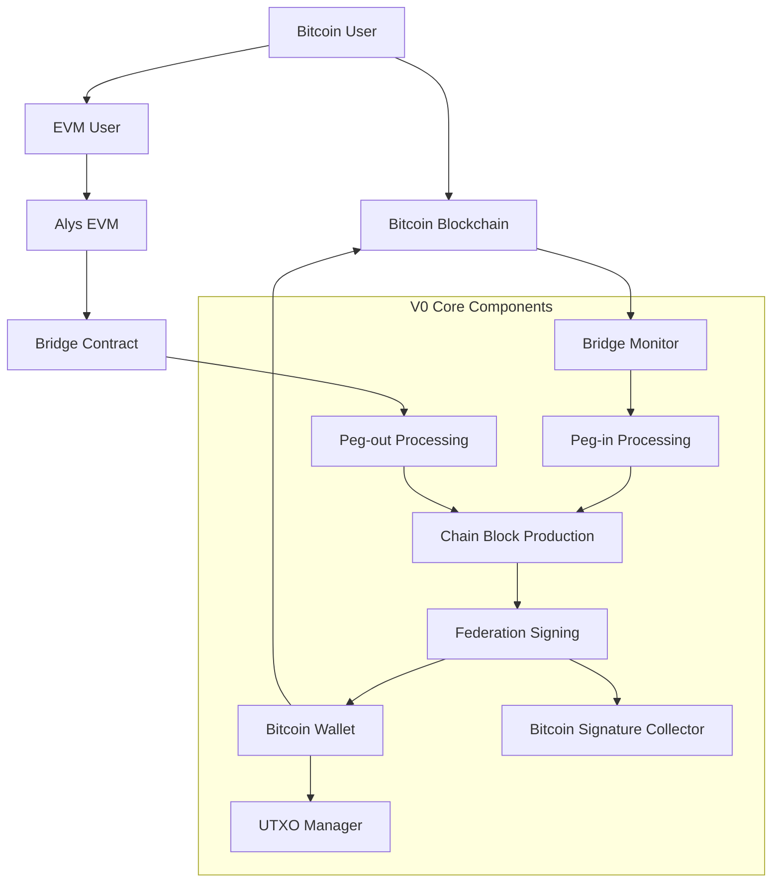
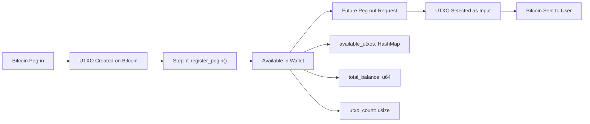
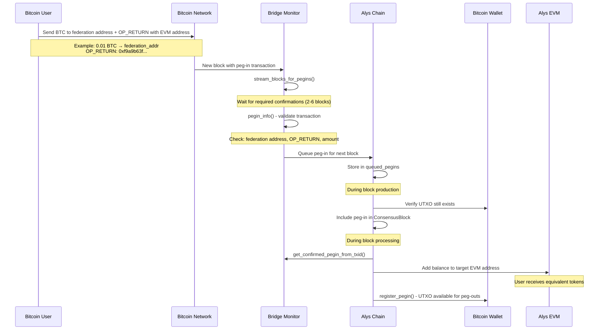
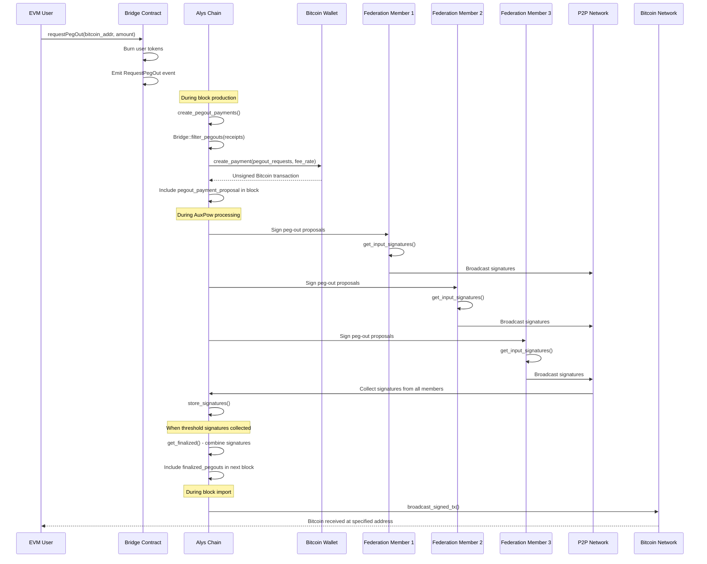

# V0 Peg Operations: Complete End-to-End Analysis

## Overview: Bidirectional Bitcoin Bridge

**Peg operations** are Alys's core mechanism for moving Bitcoin between Bitcoin's main blockchain and Alys's sidechain. This enables users to:

1. **Peg-in (Bitcoin → Alys)**: Lock Bitcoin on the Bitcoin blockchain to mint equivalent tokens on Alys
2. **Peg-out (Alys → Bitcoin)**: Burn tokens on Alys to unlock and receive Bitcoin on the Bitcoin blockchain

**Key Concept**: Alys operates as a **federated sidechain** where a group of validators (the "federation") collectively control Bitcoin funds using multi-signature (taproot) wallets.

## Architecture Components



## Fundamental Concepts

### Federation-Based Security Model

Alys uses a **federated peg** where multiple validators collectively control Bitcoin funds:

```rust
// Federation configuration (federation/src/lib.rs:473)
pub struct Federation {
    pub taproot_address: Address,      // Multi-sig Bitcoin address
    pub spend_info: TaprootSpendInfo,  // Taproot spending conditions
    pubkeys: Vec<PublicKey>,           // Federation member public keys
    threshold: usize,                  // Required signatures (e.g., 2-of-3)
    network: Network,                  // Bitcoin network (mainnet/testnet)
}
```

**Security Properties**:
- **Threshold Security**: Requires majority of federation members to move Bitcoin (e.g., 2-of-3 signatures)
- **Taproot Technology**: Uses Bitcoin's latest multi-sig technology for privacy and efficiency
- **No Single Point of Failure**: No individual federation member can steal funds

### Data Structures

#### ConsensusBlock Structure (block.rs:63-74)
```rust
pub struct ConsensusBlock<T: EthSpec> {
    pub execution_payload: ExecutionPayloadCapella<T>,

    // Peg operation fields:
    pub pegins: Vec<(Txid, BlockHash)>,                    // Bitcoin txs sending to federation
    pub pegout_payment_proposal: Option<BitcoinTransaction>, // Unsigned Bitcoin tx for peg-outs
    pub finalized_pegouts: Vec<BitcoinTransaction>,        // Signed Bitcoin txs (broadcast ready)
}
```

#### PegInInfo Structure (federation/src/lib.rs:75-82)
```rust
pub struct PegInInfo {
    pub txid: Txid,           // Bitcoin transaction ID
    pub block_hash: BlockHash, // Bitcoin block containing the transaction
    pub amount: u64,          // Amount in satoshis
    pub evm_account: H160,    // Target EVM address
    pub block_height: u32,    // Bitcoin block height
}
```

## Part 1: Peg-in Operations (Bitcoin → Alys)

### Overview: From Bitcoin to Alys Balance

**Peg-in process**: Users send Bitcoin to the federation's multi-sig address with special instructions, and receive equivalent tokens on Alys.

### Step 1: User Initiates Peg-in

A user creates a Bitcoin transaction with two specific outputs:

1. **Payment Output**: Sends Bitcoin to federation's taproot address
2. **OP_RETURN Output**: Contains the target Alys (EVM) address

**Example Bitcoin Transaction**:
```
Input:  [User's Bitcoin UTXO]
Output 1: 0.01 BTC → bcrt1p[federation_taproot_address]
Output 2: 0 BTC → OP_RETURN [0xf9a9b63f5b7f9336da0ce520c6bec64627027f5b98]
```

### Step 2: Bridge Monitoring (federation/src/lib.rs:107-146)

The Bridge continuously monitors the Bitcoin blockchain for peg-in transactions:

```rust
pub async fn stream_blocks_for_pegins<F, R>(&self, start_height: u32, cb: F)
where
    F: Fn(Vec<PegInInfo>, u32) -> R,
    R: Future<Output = ()>,
{
    info!("Starting to stream blocks for peg-ins from height {}", start_height);

    // Stream Bitcoin blocks with required confirmations
    let mut stream = stream_blocks(
        self.bitcoin_core.clone(),
        start_height,
        self.required_confirmations.into(),
    ).await;

    while let Some(x) = stream.next().await {
        let (block, height) = x.unwrap();
        let block_hash = block.block_hash();

        // Extract peg-in information from each transaction
        let pegins: Vec<PegInInfo> = block
            .txdata
            .iter()
            .filter_map(|tx| self.pegin_info(tx, block_hash, height))
            .collect();

        info!("Found {} peg-ins in block at height {}", pegins.len(), height);
        cb(pegins, height).await;
    }
}
```

### Step 3: Peg-in Detection and Validation (federation/src/lib.rs:201-256)

The Bridge analyzes each Bitcoin transaction to detect valid peg-ins:

```rust
fn pegin_info(&self, tx: &Transaction, block_hash: BlockHash, block_height: u32) -> Option<PegInInfo> {
    // Step 1: Find payment to federation address
    let amount = tx
        .output
        .iter()
        .find(|output| {
            self.pegin_addresses
                .iter()
                .any(|pegin_address| pegin_address.matches_script_pubkey(&output.script_pubkey))
        })
        .map(|x| x.value)?; // Amount in satoshis

    // Step 2: Extract EVM address from OP_RETURN
    let evm_account = tx.output.iter().find_map(extract_evm_address)?;

    Some(PegInInfo {
        txid: tx.txid(),
        block_hash,
        block_height,
        amount,
        evm_account,
    })
}

fn extract_evm_address(tx_out: &TxOut) -> Option<H160> {
    // Must be OP_RETURN output
    if !tx_out.script_pubkey.is_provably_unspendable() || !tx_out.script_pubkey.is_op_return() {
        return None;
    }

    // Parse OP_RETURN data as EVM address
    let opreturn = tx_out.script_pubkey.to_asm_string();
    let parts = opreturn.split(' ');
    let op_return_parts = parts.collect::<Vec<&str>>();
    let op_return_hex_string = op_return_parts[op_return_parts.len() - 1].to_string();

    // Try parsing as hex address directly
    let data = Vec::from_hex(&op_return_hex_string);
    if let Ok(data) = data {
        if let Ok(address_str) = String::from_utf8(data) {
            H160::from_str(&address_str).ok()
        } else {
            H160::from_str(&op_return_hex_string).ok()
        }
    } else {
        None
    }
}
```

**Validation Requirements**:
- ✅ **Bitcoin confirmations**: Must have sufficient confirmations (typically 2-6)
- ✅ **Valid federation address**: Payment must go to known federation address
- ✅ **Valid EVM address**: OP_RETURN must contain valid 20-byte EVM address
- ✅ **Minimum amount**: Must meet minimum peg-in threshold

### Step 4: Peg-in Queueing (chain.rs:281-299)

Valid peg-ins are queued for inclusion in the next Alys block:

```rust
// During block production, collect queued peg-ins
let mut txids: Vec<Txid> = self
    .queued_pegins
    .read()
    .await
    .keys()
    .cloned()
    .collect();

debug!(total_txids = txids.len(), "Retrieved queued pegin txids");

// Verify peg-ins are still in Bitcoin wallet (haven't been spent)
let wallet = self.bitcoin_wallet.read().await;
let initial_txid_count = txids.len();
txids.retain(|txid| {
    let exists = wallet.get_tx(txid).unwrap().is_some();
    trace!("Checking if txid {:?} exists in wallet: {}", txid, exists);
    exists
});
```

### Step 5: Block Production Integration (chain.rs:635-643)

Peg-ins are included in Alys consensus blocks:

```rust
let block = ConsensusBlock::new(
    slot,
    payload.clone(),
    prev,
    queued_pow,
    pegins,                    // ← Peg-in transactions included here
    pegouts,
    finalized_pegouts,
);
```

### Step 6: EVM Balance Updates (chain.rs:396-421)

During block processing, peg-ins are converted to EVM balance increases:

```rust
// Validate and process peg-ins during block processing
for (txid, block_hash) in &unverified_block.message.pegins {
    // Prevent double-spending
    if self.bitcoin_wallet.read().await.get_tx(txid)?.is_some() {
        return Err(Error::PegInAlreadyIncluded);
    }

    // Get confirmed peg-in information
    let info = self.bridge.get_confirmed_pegin_from_txid(txid, block_hash)?;

    // Add expected balance increase to EVM account
    expected.insert(
        info.evm_account,
        expected.get(&info.evm_account).unwrap_or(&U256::zero()) + U256::from(info.amount)
    );
}
```

#### Deep Dive: Step 6 - EVM Balance Updates

This is the critical step where Bitcoin payments are converted into EVM token balances. Here's what happens in detail:

**Bitcoin-to-Token Conversion Process:**

1. **Amount Translation**: Bitcoin amounts (in satoshis) are converted 1:1 to EVM token units
   - 100,000,000 satoshis (1 BTC) → 100,000,000 token units
   - This maintains perfect parity between Bitcoin and Alys tokens

2. **Balance Accumulation**: Multiple peg-ins to the same EVM address are accumulated:
   ```rust
   expected.insert(
       info.evm_account,
       // Get existing expected balance (if any) + new peg-in amount
       expected.get(&info.evm_account).unwrap_or(&U256::zero()) + U256::from(info.amount)
   );
   ```

3. **EVM State Integration**: These balance updates are integrated into Alys's EVM state during block execution:
   ```rust
   // The 'expected' map is used by the EVM execution engine
   // to credit accounts with peg-in amounts during block processing
   let final_balances = process_evm_block_with_pegins(execution_payload, expected);
   ```

**Concrete Example:**
```
Bitcoin Peg-in Transaction:
- Input: User's 0.02 BTC UTXO
- Output 1: 0.01 BTC → federation_address (bcrt1p...)
- Output 2: 0 BTC → OP_RETURN 0xf9a9b63f5b7f9336da0ce520c6bec64627027f5b98
- Change: 0.009 BTC → user's change address

Result in Alys EVM:
- Address 0xf9a9b63f5b7f9336da0ce520c6bec64627027f5b98 receives 1,000,000 token units
- (1,000,000 satoshis = 0.01 BTC converted to EVM tokens)
```

**Security Considerations:**
- **Double-spend Prevention**: Each Bitcoin UTXO can only be processed once
- **Atomic Updates**: All peg-ins in a block are processed atomically
- **Balance Verification**: EVM state changes are validated against Bitcoin confirmations

### Step 7: UTXO Registration (chain.rs:1708-1717)

Successfully processed peg-ins are registered in the Bitcoin wallet:

```rust
// Make the Bitcoin UTXOs available for spending (for future peg-outs)
let tx = self.bridge.fetch_transaction(txid, block_hash).unwrap();
self.bitcoin_wallet
    .write()
    .await
    .register_pegin(&tx)
    .unwrap();
```

#### Deep Dive: Step 7 - UTXO Registration

This step makes the Bitcoin UTXOs created by peg-ins available for future peg-out operations. Here's the detailed process:

**UTXO Lifecycle Management:**

1. **Transaction Fetching**: The complete Bitcoin transaction is retrieved from the Bitcoin network:
   ```rust
   // Fetches the raw Bitcoin transaction and verifies it exists in the specified block
   let tx = self.bridge.fetch_transaction(txid, block_hash).unwrap();
   ```

2. **UTXO Extraction**: The wallet identifies spendable outputs from the transaction:
   ```rust
   // Inside register_pegin() - extracts UTXOs sent to federation addresses
   pub fn register_pegin(&mut self, tx: &BitcoinTransaction) -> Result<(), Error> {
       for (vout, output) in tx.output.iter().enumerate() {
           // Check if this output is sent to one of our federation addresses
           if self.federation.taproot_address.matches_script_pubkey(&output.script_pubkey) {
               let utxo = UnspentTxOut {
                   outpoint: OutPoint::new(tx.txid(), vout as u32),
                   txout: output.clone(),
                   confirmations: self.get_confirmations(&tx.txid())?,
               };

               // Add to available UTXO set
               self.available_utxos.insert(utxo.outpoint, utxo);

               info!("Registered new UTXO: {} with value {}",
                     utxo.outpoint, utxo.txout.value);
           }
       }
       Ok(())
   }
   ```

3. **Wallet State Update**: The federation's Bitcoin wallet is updated with new spendable funds:
   ```rust
   // The wallet now knows about these UTXOs and can spend them for peg-outs
   self.total_balance += registered_amount;
   self.utxo_count += new_utxo_count;
   ```

**UTXO Management for Peg-outs:**

Once registered, these UTXOs become part of the federation's spendable balance:



**Complete Example Flow:**

```
Peg-in Transaction: abc123...
├─ Input: User's 0.02 BTC
├─ Output 0: 0.01 BTC → federation_address  ← This becomes spendable UTXO
├─ Output 1: 0 BTC → OP_RETURN (EVM address)
└─ Output 2: 0.009 BTC → user_change_address

After register_pegin():
├─ Wallet Balance: +1,000,000 satoshis
├─ Available UTXOs: +1 (outpoint: abc123:0)
├─ EVM Address 0xf9a9... gets 1,000,000 tokens
└─ Ready for future peg-out operations

Future Peg-out Can Use:
├─ Input: abc123:0 (1,000,000 sats from this peg-in)
├─ Input: def456:0 (2,000,000 sats from another peg-in)
├─ Output: 2,500,000 sats → user_bitcoin_address
└─ Change: 400,000 sats → federation_address (minus fees)
```

**Security and Error Handling:**

1. **Confirmation Requirements**: UTXOs must have sufficient Bitcoin confirmations before registration
2. **Duplicate Prevention**: The same transaction cannot be registered twice
3. **Address Validation**: Only outputs to valid federation addresses are registered
4. **Balance Consistency**: Total wallet balance must match sum of all UTXOs

**Performance Implications:**
- **UTXO Set Growth**: Each peg-in adds to the federation's UTXO set
- **Selection Efficiency**: Larger UTXO sets require more complex coin selection algorithms
- **Consolidation Strategy**: Periodic UTXO consolidation may be needed for optimal performance

This registration step is crucial because it transforms Bitcoin locked in the federation's control into spendable assets that can be used to fulfill future peg-out requests, completing the bidirectional bridge functionality.

### Complete Peg-in Flow



## Part 2: Peg-out Operations (Alys → Bitcoin)

### Overview: From Alys Balance to Bitcoin

**Peg-out process**: Users burn tokens on Alys by calling a smart contract, which triggers the creation and signing of Bitcoin transactions that send Bitcoin back to the user.

### Step 1: User Initiates Peg-out via Smart Contract

Users interact with the Bridge contract on Alys's EVM:

```solidity
// Bridge.sol (conceptual)
contract Bridge {
    event RequestPegOut(
        address indexed evm_address,
        bytes bitcoin_address,
        uint256 value
    );

    function requestPegOut(bytes memory bitcoin_address, uint256 value) public {
        // Burn user's tokens
        _burn(msg.sender, value);

        // Emit peg-out request
        emit RequestPegOut(msg.sender, bitcoin_address, value);
    }
}
```

### Step 2: Peg-out Detection During Block Production (chain.rs:882-911)

Block production scans EVM receipts for peg-out requests:

```rust
async fn create_pegout_payments(&self, payload_hash: Option<ExecutionBlockHash>) -> Option<BitcoinTransaction> {
    // Get execution block and transaction receipts
    let (_execution_block, execution_receipts) =
        self.get_block_and_receipts(&payload_hash?).await.unwrap();

    // Get current Bitcoin fee rate
    let fee_rate = self.bridge.fee_rate();

    // Extract peg-out requests from EVM event logs
    match Bridge::filter_pegouts(execution_receipts) {
        x if x.is_empty() => {
            info!("Adding 0 pegouts to block");
            None
        }
        payments => {
            info!("⬅️  Creating bitcoin tx for {} peg-outs", payments.len());

            // Create unsigned Bitcoin transaction
            match self
                .bitcoin_wallet
                .write()
                .await
                .create_payment(payments, fee_rate)
            {
                Ok(unsigned_txn) => Some(unsigned_txn),
                Err(e) => {
                    error!("Failed to create pegout payment: {e}");
                    None
                }
            }
        }
    }
}
```

### Step 3: Event Log Filtering (federation/src/lib.rs:258-307)

The Bridge extracts peg-out requests from EVM transaction receipts:

```rust
pub fn filter_pegouts(receipts: Vec<TransactionReceipt>) -> Vec<TxOut> {
    // Define the RequestPegOut event structure
    #[derive(Clone, Debug, EthEvent)]
    pub struct RequestPegOut {
        #[ethevent(indexed)]
        pub evm_address: Address,
        pub bitcoin_address: Bytes,
        pub value: U256,
    }

    let contract_address = Self::BRIDGE_CONTRACT_ADDRESS
        .parse::<Address>()
        .expect("Bridge address is valid");

    let mut pegouts = Vec::new();

    for receipt in receipts {
        if let Some(address) = receipt.to {
            // Only check transactions sent to the bridge contract
            if address != contract_address {
                continue;
            }
        }

        // Parse event logs for RequestPegOut events
        for log in receipt.logs {
            if let Ok(event) = parse_log::<RequestPegOut>(log) {
                let event_amount_in_sats = wei_to_sats(event.value);

                // Minimum peg-out amount (1M satoshis = 0.01 BTC)
                if event_amount_in_sats >= 1000000 {
                    if let Some(address) = parse_bitcoin_address(event.bitcoin_address) {
                        let txout = TxOut {
                            script_pubkey: address.script_pubkey(),
                            value: event_amount_in_sats,
                        };
                        pegouts.push(txout);
                    }
                }
            }
        }
    }

    pegouts
}
```

### Step 4: Bitcoin Transaction Creation

The BitcoinWallet creates unsigned transactions spending federation UTXOs:

```rust
// BitcoinWallet::create_payment() (implemented in federation/src/bitcoin_signing.rs)
pub fn create_payment(&mut self, outputs: Vec<TxOut>, fee_rate: FeeRate) -> Result<Transaction, Error> {
    // Step 1: Select UTXOs to spend
    let available_utxos = self.get_available_utxos()?;
    let (selected_utxos, total_input) = self.select_utxos(&outputs, fee_rate, available_utxos)?;

    // Step 2: Calculate fees
    let total_output = outputs.iter().map(|o| o.value).sum::<u64>();
    let fee = self.calculate_fee(&selected_utxos, &outputs, fee_rate);

    // Step 3: Create change output if needed
    let mut final_outputs = outputs;
    if total_input > total_output + fee {
        let change_amount = total_input - total_output - fee;
        let change_output = TxOut {
            script_pubkey: self.federation.taproot_address.script_pubkey(),
            value: change_amount,
        };
        final_outputs.push(change_output);
    }

    // Step 4: Create unsigned transaction
    let unsigned_tx = Transaction {
        version: 2,
        lock_time: 0,
        input: selected_utxos.iter().map(|utxo| TxIn {
            previous_output: utxo.outpoint,
            script_sig: ScriptBuf::new(),
            sequence: 0xFFFFFFFF,
            witness: Witness::new(),
        }).collect(),
        output: final_outputs,
    };

    Ok(unsigned_tx)
}
```

### Step 5: Block Production Integration (chain.rs:635-643)

The unsigned peg-out transaction is included in the block as a proposal:

```rust
let block = ConsensusBlock::new(
    slot,
    payload.clone(),
    prev,
    queued_pow,
    pegins,
    pegouts,                   // ← Unsigned peg-out transaction (proposal)
    finalized_pegouts,         // ← Signed peg-out transactions (ready to broadcast)
);
```

### Step 6: Signature Collection Process

Federation members sign peg-out proposals using a distributed signing protocol.

#### Step 6a: Individual Signing (chain.rs:1386-1398)

Each federation member signs the transaction:

```rust
// When AuxPow is received, sign any pending peg-out proposals
let Some(bitcoin_signer) = &self.maybe_bitcoin_signer else {
    // This node is not a federation member
    return Ok(());
};

let wallet = self.bitcoin_wallet.read().await;
let signatures = self
    .get_bitcoin_payment_proposals_in_range(pow.range_start, pow.range_end)?
    .into_iter()
    .map(|tx| {
        bitcoin_signer
            .get_input_signatures(&wallet, &tx)
            .map(|sig| (tx.txid(), sig))
    })
    .collect::<Result<HashMap<_, _>, _>>()?;

// Broadcast signatures to other federation members
let _ = self.network.send(PubsubMessage::PegoutSignatures(signatures)).await;
```

#### Step 6b: Signature Collection (chain.rs:1843-1858)

Federation members collect signatures from peers:

```rust
async fn store_signatures(
    &self,
    pegout_sigs: HashMap<Txid, SingleMemberTransactionSignatures>,
) -> Result<(), Error> {
    let mut collector = self.bitcoin_signature_collector.write().await;
    let wallet = self.bitcoin_wallet.read().await;

    for (txid, sigs) in pegout_sigs {
        // Add signature to collection
        collector.add_signature(&wallet, txid, sigs.clone())?;
        trace!("Successfully added signature {:?} for txid {:?}", sigs, txid);
    }
    Ok(())
}
```

#### Step 6c: Transaction Finalization (chain.rs:536-566)

When sufficient signatures are collected, transactions are finalized:

```rust
// During block production, check for finalized transactions
let (queued_pow, finalized_pegouts) = match self.queued_pow.read().await.clone() {
    None => (None, vec![]),
    Some(pow) => {
        let signature_collector = self.bitcoin_signature_collector.read().await;

        // Get all peg-out proposals in the AuxPow range
        let finalized_txs = self
            .get_bitcoin_payment_proposals_in_range(pow.range_start, pow.range_end)?
            .into_iter()
            .filter_map(|tx| {
                // Try to get finalized transaction with all required signatures
                match signature_collector.get_finalized(tx.txid()) {
                    Ok(finalized_tx) => Some(finalized_tx),
                    Err(err) => {
                        warn!("Transaction {} not yet finalized: {:?}", tx.txid(), err);
                        None
                    }
                }
            })
            .collect::<Vec<_>>();

        match finalized_txs.is_empty() {
            true => (None, vec![]),
            false => (Some(pow), finalized_txs),
        }
    }
};
```

### Step 7: Bitcoin Broadcasting (chain.rs:1733-1744)

Finalized transactions are broadcast to the Bitcoin network:

```rust
// Process finalized peg-outs during block import
for tx in verified_block.message.finalized_pegouts.iter() {
    let txid = tx.txid();

    // Broadcast to Bitcoin network
    match self.bridge.broadcast_signed_tx(tx) {
        Ok(txid) => {
            info!("⬅️  Broadcasted peg-out, txid {txid}");
        }
        Err(_) => {
            warn!("⬅️  Failed to process peg-out, txid {}", tx.txid());
        }
    };

    // Update signature collector state
    self.bitcoin_signature_collector
        .write()
        .await
        .mark_as_broadcasted(txid);
}
```

### Step 8: UTXO Management (chain.rs:1724-1731)

Peg-out proposals are registered for UTXO tracking:

```rust
// Register peg-out proposal in wallet
if let Some(ref pegout_tx) = verified_block.message.pegout_payment_proposal {
    trace!("⬅️ Registered peg-out proposal");
    self.bitcoin_wallet
        .write()
        .await
        .register_pegout(pegout_tx)
        .unwrap();
}
```

### Complete Peg-out Flow



## Advanced Topics

### Validation and Security

#### Peg-out Proposal Validation (chain.rs:1126-1163)

Before accepting peg-out proposals, the chain validates them:

```rust
async fn check_pegout_proposal(
    &self,
    unverified_block: &SignedConsensusBlock<MainnetEthSpec>,
    prev_payload_hash: ExecutionBlockHash,
) -> Result<(), Error> {
    // Get EVM execution receipts from previous block
    let (_execution_block, execution_receipts) =
        self.get_block_and_receipts(&prev_payload_hash).await?;

    // Extract expected peg-out outputs from EVM events
    let required_outputs = Bridge::filter_pegouts(execution_receipts);

    trace!("Found {} pegouts in block after filtering", required_outputs.len());

    // Validate the proposed Bitcoin transaction matches EVM events
    let missing_utxos = self.bitcoin_wallet.read().await.check_payment_proposal(
        required_outputs,
        unverified_block.message.pegout_payment_proposal.as_ref(),
        Some(&self.bridge),
    )?;

    // Register any missing UTXOs found on Bitcoin network
    if !missing_utxos.is_empty() {
        let count = missing_utxos.len();
        self.bitcoin_wallet
            .write()
            .await
            .register_utxos(missing_utxos)?;
        trace!("Registered {} missing UTXOs from Bitcoin network", count);
    }

    Ok(())
}
```

#### Finalized Peg-out Validation (chain.rs:1030-1060)

Finalized peg-outs undergo comprehensive validation:

```rust
// Validate finalized peg-outs during block processing
let required_finalizations = self
    .get_bitcoin_payment_proposals_in_range(pow.range_start, pow.range_end)?
    .into_iter()
    .map(|tx| tx.txid())
    .collect::<Vec<_>>();

// Must finalize exactly the expected transactions
if required_finalizations.len() != unverified_block.message.finalized_pegouts.len() {
    return Err(Error::IllegalFinalization);
}

// Validate each finalized transaction
for (expected_txid, tx) in required_finalizations
    .into_iter()
    .zip(unverified_block.message.finalized_pegouts.iter())
{
    // Verify transaction ID matches
    if tx.txid() != expected_txid {
        return Err(Error::IllegalFinalization);
    }

    // Verify all signatures are valid
    let wallet = self.bitcoin_wallet.read().await;
    wallet.check_transaction_signatures(tx, pow_override)?;
}
```

### Network Coordination

#### Signature Propagation (chain.rs:1968-1979)

Federation signatures are propagated via P2P network:

```rust
// Handle incoming signature messages
PubsubMessage::PegoutSignatures(pegout_sigs) => {
    CHAIN_NETWORK_GOSSIP_TOTALS
        .with_label_values(&["pegout_sigs", "success"])
        .inc();

    if let Err(err) = self.store_signatures(pegout_sigs).await {
        warn!("Failed to add signature: {err:?}");
        CHAIN_NETWORK_GOSSIP_TOTALS
            .with_label_values(&["pegout_sigs", "error"])
            .inc();
    }
}
```

### Error Handling and Edge Cases

#### Common Error Scenarios

1. **Insufficient Confirmations**: Bitcoin transactions need confirmations before processing
2. **Invalid OP_RETURN**: Peg-in OP_RETURN data must contain valid EVM address
3. **UTXO Already Spent**: Double-spend prevention for peg-in UTXOs
4. **Insufficient Signatures**: Peg-out transactions need threshold signatures
5. **Fee Estimation Failures**: Dynamic Bitcoin fee rate calculation

#### Recovery Mechanisms

1. **UTXO Discovery**: Automatic discovery and registration of missing UTXOs
2. **Signature Retry**: Re-broadcast signature requests for missing signatures
3. **Transaction Rebroadcast**: Retry failed Bitcoin transaction broadcasts

## Performance Characteristics

### Peg-in Performance
- **Bitcoin Confirmation Time**: 2-6 block confirmations (20-60 minutes)
- **Processing Latency**: Near-instant once confirmed
- **Throughput**: Limited by Bitcoin block space and confirmation requirements

### Peg-out Performance
- **Signature Collection**: Depends on federation member availability
- **Transaction Size**: ~300-500 bytes per peg-out (typical)
- **Bitcoin Broadcasting**: Usually confirms in next 1-3 Bitcoin blocks

### Resource Usage
- **Storage**: UTXO set grows with peg-in volume
- **Network**: Signature propagation scales with federation size
- **CPU**: Signature verification and transaction creation

## Security Model

### Trust Assumptions
1. **Federation Honesty**: Majority of federation members are honest
2. **Bitcoin Finality**: Bitcoin transactions with sufficient confirmations are final
3. **Network Connectivity**: Federation members can communicate reliably

### Attack Vectors and Mitigations
1. **Federation Collusion**: Mitigated by threshold signatures and transparency
2. **Double Spending**: Prevented by confirmation requirements and UTXO tracking
3. **Signature Withholding**: Handled by timeout mechanisms and member replacement

### Monitoring and Observability
- **UTXO Balance Tracking**: Real-time federation balance monitoring
- **Transaction Status**: Comprehensive logging of peg operation status
- **Performance Metrics**: Latency and throughput monitoring

## Conclusion

V0's peg operations provide a robust, production-tested bridge between Bitcoin and Alys. The system combines:

- **Proven Cryptography**: Bitcoin's battle-tested multi-sig and Taproot technology
- **Distributed Security**: Federation-based trust model with threshold signatures
- **Comprehensive Validation**: Multi-layer validation preventing fraud and errors
- **Network Resilience**: P2P signature propagation and automatic error recovery

This foundation enables secure, bidirectional asset movement while maintaining the security properties of both Bitcoin and Alys networks.